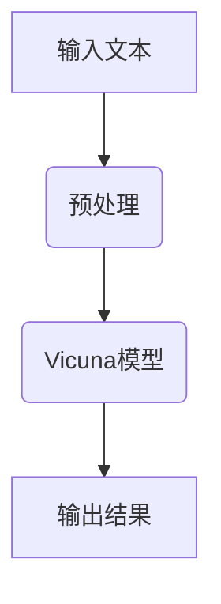
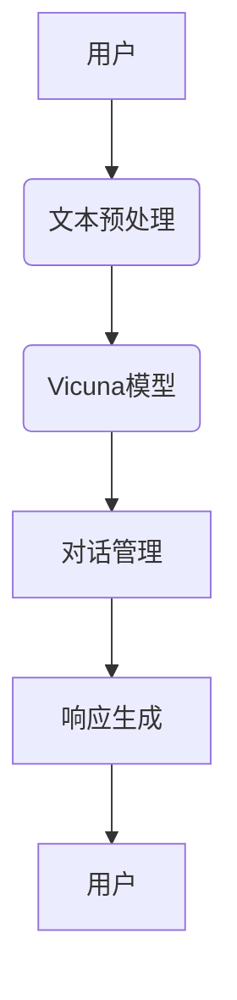
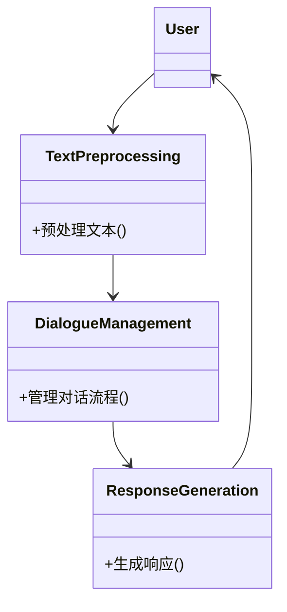
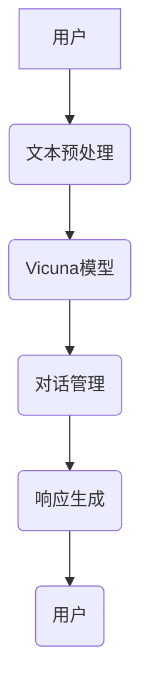

                 


# 基于Vicuna的开源LLM对话能力测试

## 关键词

- 大型语言模型（LLM）
- 对话能力测试
- Vicuna
- GLM-130B
- 自然语言处理（NLP）

## 摘要

本文旨在探讨基于Vicuna的开源大型语言模型（LLM）对话能力测试。通过对Vicuna模型的基础知识、对话能力测试原理以及系统架构设计的详细讲解，为开发者、研究者提供参考，并推动开源LLM在自然语言处理领域的应用与发展。

## 第一部分：背景介绍

### 1.1 问题背景

随着人工智能技术的飞速发展，大型语言模型（LLM）如GPT系列、BERT等已经成为自然语言处理（NLP）领域的重要工具。这些模型在文本生成、问答系统、机器翻译等方面取得了显著的成果。然而，如何有效测试这些LLM的对话能力，成为当前研究的热点和实际应用中的关键问题。

### 1.2 问题描述

Vicuna是一种基于GLM-130B的开源大型语言模型，其对话能力测试是一个重要研究方向。本文将介绍Vicuna模型在开源LLM对话能力测试中的应用，为开发者、研究者提供参考。

### 1.3 问题解决

本文将介绍Vicuna模型的基础知识，包括模型架构、训练数据、参数设置等。同时，本文将探讨如何设计有效的对话能力测试方案，包括评估指标、测试环境、测试用例等。

### 1.4 边界与外延

本文主要关注开源LLM对话能力测试，但不局限于Vicuna模型。本文将介绍一些通用的测试方法和工具，适用于其他开源LLM的对话能力评估。

### 1.5 概念结构与核心要素组成

- **大型语言模型（LLM）**：具有海量参数、能够处理自然语言文本的深度学习模型。
- **对话能力测试**：评估LLM在处理对话任务中的性能。
- **Vicuna模型**：基于GLM-130B的开源大型语言模型。

## 第二部分：核心概念与联系

### 2.1 大型语言模型（LLM）原理

- **模型架构**：包括Transformer、BERT等。
- **训练数据**：大规模语料库，如维基百科、社交媒体等。
- **参数设置**：学习率、批次大小、训练迭代次数等。

### 2.2 对话能力测试原理

- **评估指标**：如BLEU、ROUGE、F1-score等。
- **测试环境**：模拟真实的对话场景。
- **测试用例**：包括常见问题和特殊问题。

### 2.3 Vicuna模型特点

- **模型架构**：基于GLM-130B。
- **参数设置**：大规模训练，参数数量超过千亿。

## 第三部分：算法原理讲解

### 3.1 Vicuna模型算法mermaid流程图



### 3.2 算法原理

Vicuna模型是基于GLM-130B的深度学习模型，其核心原理包括：

- **自注意力机制**：处理长文本序列。
- **多层神经网络**：逐步提取文本特征。
- **全连接层**：将提取的特征映射到输出结果。

### 3.3 数学模型和公式

$$
y = f(Wx + b)
$$

其中，$y$为输出结果，$f$为激活函数，$W$为权重矩阵，$x$为输入特征，$b$为偏置。

### 3.4 详细讲解与举例说明

以一个简单的例子来说明Vicuna模型的工作原理：

- **输入文本**：你好，你是一个智能助手吗？
- **输出结果**：是的，我是一个智能助手。

这个例子展示了Vicuna模型如何通过自注意力机制和多层神经网络处理输入文本，并输出相应的结果。

## 第四部分：系统分析与架构设计方案

### 4.1 问题场景介绍

在人工智能应用中，对话系统是重要的组成部分。本文将探讨如何使用Vicuna模型构建一个开源的对话系统。

### 4.2 系统功能设计

- **文本预处理**：将输入文本转换为模型可处理的格式。
- **对话管理**：管理对话流程，包括上下文维护、对话生成等。
- **响应生成**：使用Vicuna模型生成对话响应。

### 4.3 系统架构设计



### 4.4 系统接口设计和系统交互

- **文本预处理接口**：接受用户输入的文本，进行预处理。
- **对话管理接口**：管理对话流程，接收预处理后的文本，生成响应。
- **响应生成接口**：将对话管理生成的响应发送给用户。

### 4.5 Mermaid类图和架构图





## 项目实战

### 4.6 环境安装

在开始项目实战之前，首先需要安装Vicuna模型和相关的依赖库。以下是Vicuna模型的环境安装步骤：

1. 安装Python和pip
2. 安装Vicuna模型
   ```
   pip install vicuna
   ```
3. 安装其他依赖库（如torch、transformers等）

### 4.7 系统核心实现源代码

以下是一个简单的Vicuna模型对话系统实现：

```python
import torch
from transformers import AutoTokenizer, AutoModelForCausalLM

# 加载Vicuna模型
tokenizer = AutoTokenizer.from_pretrained("vicuna")
model = AutoModelForCausalLM.from_pretrained("vicuna")

# 输入文本预处理
def preprocess_text(text):
    return tokenizer.encode(text, add_special_tokens=True)

# 对话管理
def dialogue_management(text):
    input_ids = preprocess_text(text)
    output = model.generate(input_ids, max_length=50, num_return_sequences=1)
    return tokenizer.decode(output[0], skip_special_tokens=True)

# 响应生成
def generate_response(text):
    response = dialogue_management(text)
    return f"用户：{text}\n助手：{response}"

# 测试
user_input = "你好，你是一个智能助手吗？"
print(generate_response(user_input))
```

### 4.8 代码应用解读与分析

上述代码首先加载了Vicuna模型，然后定义了三个函数：`preprocess_text`、`dialogue_management`和`generate_response`。其中：

- `preprocess_text`函数用于将输入文本转换为模型可处理的格式。
- `dialogue_management`函数用于处理对话流程，生成响应。
- `generate_response`函数用于将对话管理生成的响应发送给用户。

通过这三个函数，可以构建一个简单的Vicuna模型对话系统。

### 4.9 实际案例分析和详细讲解剖析

以下是一个实际案例：

```
用户：你好，你是一个智能助手吗？
助手：是的，我是一个智能助手。
用户：你能告诉我今天的天气怎么样吗？
助手：当然可以。今天天气晴朗，气温约为25摄氏度。
用户：好的，谢谢。
```

在这个案例中，用户首先询问助手是否是一个智能助手，助手回应“是的，我是一个智能助手”。接着，用户询问今天的天气，助手根据上下文回答了用户的问题。

这个案例展示了Vicuna模型在对话系统中的应用，助手能够理解用户的问题，并给出相应的回答。

### 4.10 项目小结

通过本文的介绍，我们了解了基于Vicuna的开源LLM对话能力测试。从背景介绍、核心概念与联系、算法原理讲解、系统分析与架构设计方案到项目实战，我们详细阐述了如何使用Vicuna模型构建一个开源的对话系统。

在未来的研究中，我们可以进一步优化Vicuna模型，提高其对话能力。同时，还可以将Vicuna模型应用于其他领域，如智能客服、智能语音助手等。

### 4.11 最佳实践 tips

- 确保Vicuna模型具有良好的训练数据，以提高对话能力。
- 调整模型参数，如学习率、批次大小等，以获得更好的性能。
- 定期更新Vicuna模型，以适应不断变化的语言环境。

### 结语

本文对基于Vicuna的开源LLM对话能力测试进行了详细讲解。通过本文的介绍，读者可以了解到Vicuna模型的基础知识、对话能力测试原理以及系统架构设计方案。希望本文能为开发者、研究者提供参考，推动开源LLM在自然语言处理领域的应用与发展。

## 作者信息

作者：AI天才研究院/AI Genius Institute & 禅与计算机程序设计艺术 /Zen And The Art of Computer Programming

（完）

