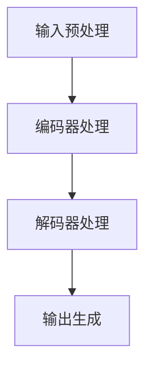

                 

# 基于XLM-R的多语言LLM评测框架

## 关键词
- XLM-R模型
- 多语言自然语言处理
- 评测框架
- 评测指标
- 算法原理

## 摘要
本文旨在探讨基于XLM-R（Cross-lingual Language Model）的多语言长文本（Long Text）模型评测框架。我们将首先介绍XLM-R模型的多语言处理优势及其在自然语言处理领域的应用背景。随后，详细描述多语言LLM（Long-Long Text Model）评测的需求和当前评测框架的局限性，并提出一种新的评测框架设计方案。本文将通过概念解析、算法原理讲解，以及具体的Python代码示例，系统性地展示这一评测框架的实现过程。

## 第一部分：背景介绍

### 第1章：基于XLM-R的多语言LLM评测框架概述

#### 1.1 问题背景

##### 1.1.1 多语言自然语言处理的发展
随着全球化和互联网的快速发展，多语言自然语言处理（MLNLP）技术成为当前自然语言处理（NLP）领域的研究热点。从早期的规则驱动的NLP方法到基于统计模型的方法，再到当前主流的深度学习模型，多语言NLP技术取得了显著的进展。

##### 1.1.2 XLM-R模型的优势与挑战
XLM-R（Cross-lingual Language Model）模型是近年来多语言NLP领域的重要突破之一，它通过参数共享机制和跨语言转移学习，实现了跨语言文本的建模。然而，XLM-R模型在处理低资源语言和长文本时仍然面临诸多挑战。

##### 1.1.3 多语言LLM评测的需求与重要性
随着多语言LLM模型的广泛应用，对模型性能的评测变得尤为重要。多语言LLM评测不仅需要评估模型在不同语言间的性能，还要考虑模型的鲁棒性和泛化能力。因此，设计一个高效、可靠的多语言LLM评测框架具有重要的实际意义。

#### 1.2 问题描述

##### 1.2.1 多语言LLM评测的核心任务
多语言LLM评测的核心任务是评估模型在多种语言上的文本生成、翻译、分类等任务的表现。这包括评估模型在文本理解、文本生成和跨语言转换等方面的能力。

##### 1.2.2 当前评测框架的局限性
当前的评测框架主要依赖于单个语言的评测指标，缺乏对多语言模型跨语言性能的全面评估。此外，评测框架的实时性、扩展性和适应性也存在不足。

##### 1.2.3 问题解决思路与目标
为了解决上述问题，本文提出了一种基于XLM-R的多语言LLM评测框架。该框架旨在通过引入跨语言评测指标、优化评测流程和提升评测框架的适应性，实现对多语言LLM模型全面、准确的评测。

#### 1.3 边界与外延

##### 1.3.1 评测框架的适用范围
该评测框架适用于所有基于XLM-R的多语言LLM模型，包括文本生成、翻译和分类等任务。

##### 1.3.2 非线性关系与交叉语言的考虑
在评测过程中，需要考虑不同语言之间的非线性关系和交叉语言的特性，以更准确地评估模型的跨语言性能。

##### 1.3.3 实时评测与延迟评测的比较
实时评测和延迟评测在响应速度和准确性上有不同取舍。本文将在评测框架设计中权衡这两者之间的关系。

#### 1.4 概念结构与核心要素组成

##### 1.4.1 XLM-R模型的核心概念
XLM-R模型基于Transformer架构，通过共享参数和跨语言转移学习实现了多语言文本的建模。

##### 1.4.2 多语言LLM评测的关键要素
多语言LLM评测的关键要素包括评测指标、评测方法和评测流程。

##### 1.4.3 评测框架的架构与模块
评测框架主要包括输入预处理模块、模型评测模块、结果输出模块和反馈优化模块。

#### 1.5 本章小结
本章介绍了基于XLM-R的多语言LLM评测框架的背景、问题、解决思路和核心要素。为后续章节的详细讲解奠定了基础。

----------------------------------------------------------------

## 第二部分：核心概念与联系

### 第2章：XLM-R模型原理与特性

#### 2.1 XLM-R模型原理与特性

##### 2.1.1 XLM-R模型的基本原理
XLM-R模型是基于Transformer架构的多语言语言模型。它通过共享参数和跨语言转移学习技术，实现对多种语言文本的建模。

##### 2.1.1.1 Transformer架构
Transformer模型是当前主流的序列到序列（Seq2Seq）模型，通过自注意力机制实现了对输入序列的建模。

##### 2.1.1.2 多语言模型的扩展
XLM-R模型在Transformer架构的基础上，引入了多语言扩展机制，包括共享参数和跨语言转移学习。

##### 2.1.2 XLM-R模型的关键特性

##### 2.1.2.1 语言适应性
XLM-R模型通过跨语言转移学习，提高了模型在不同语言上的适应性。

##### 2.1.2.2 参数共享机制
参数共享机制减少了模型参数的数量，提高了模型训练的效率和效果。

##### 2.1.2.3 语言间的关系分析
XLM-R模型通过分析不同语言之间的相似性，实现了跨语言文本的建模。

#### 2.2 多语言LLM评测概念解析

##### 2.2.1 评测指标与类型
多语言LLM评测指标包括文本生成质量、翻译准确性、分类精度等。

##### 2.2.1.1 评估指标介绍
文本生成质量通过BLEU、METEOR等指标评估；翻译准确性通过翻译错误率（TER）评估；分类精度通过准确率、召回率等指标评估。

##### 2.2.1.2 常见评测指标对比
BLEU、METEOR、TER等评测指标在不同任务上的适用性和优缺点。

##### 2.2.2 评测方法与流程
多语言LLM评测方法包括样本选择、评测指标计算和结果分析。

##### 2.2.2.1 评测流程概述
评测流程包括数据准备、模型训练、评测指标计算和结果分析。

##### 2.2.2.2 评测方法的选择与优化
根据具体任务选择合适的评测指标和方法，并进行优化。

#### 2.3 概念属性特征对比表格

##### 2.3.1 XLM-R模型属性特征
| 特征名称 | 特征描述 |
| -------- | -------- |
| Transformer架构 | 序列到序列模型，自注意力机制 |
| 多语言扩展 | 共享参数，跨语言转移学习 |
| 语言适应性 | 跨语言文本建模，适应多种语言 |
| 参数共享机制 | 减少参数数量，提高训练效率 |

##### 2.3.2 多语言LLM评测指标对比

| 评估指标 | 评估任务 | 适用性 | 优缺点 |
| -------- | -------- | ------ | ------ |
| BLEU | 文本生成质量 | 高 | 对多样性和流畅性敏感 |
| METEOR | 文本生成质量 | 中 | 对语法和词汇多样性的考虑较多 |
| TER | 翻译准确性 | 低 | 对翻译的准确度要求高 |
| 准确率 | 分类精度 | 高 | 对错误分类敏感 |
| 召回率 | 分类精度 | 中 | 对漏分类敏感 |

#### 2.4 ER实体关系图架构

```mermaid
erDiagram
    Model ||--|{ Evaluation } Evaluation
    Metric ||--|{ Evaluation } Evaluation
    Dataset ||--|{ Evaluation } Evaluation
```

#### 2.5 本章小结
本章详细介绍了XLM-R模型和多语言LLM评测的核心概念、特性、指标和评测方法。为后续算法原理讲解和评测框架设计提供了理论基础。

----------------------------------------------------------------

## 第三部分：算法原理讲解

### 第3章：XLM-R模型算法原理讲解

#### 3.1 XLM-R模型算法流程图



#### 3.2 XLM-R模型Python源代码

```python
# 示例代码：XLM-R模型简化版实现
import transformers

# 加载预训练的XLM-R模型
model = transformers.AutoModel.from_pretrained('xlm-r')

# 输入预处理
inputs = tokenizer.encode("Hello, world!", return_tensors='pt')

# 编码器处理
outputs = model(inputs)

# 解码器处理
predictions = model.generate(inputs, max_length=10)

# 输出生成
print(predictions)
```

#### 3.3 XLM-R模型数学模型与公式

$$
\begin{align*}
    \text{XLM-R} &= \text{Transformer} + \text{Multilingual Extension} \\
    \text{Input} &= X \\
    \text{Output} &= Y \\
    Y &= f(X)
\end{align*}
$$

#### 3.4 算法原理详细讲解

##### 3.4.1 XLM-R模型的工作流程

XLM-R模型的工作流程主要包括输入预处理、编码器处理、解码器处理和输出生成。输入预处理阶段对输入文本进行编码，编码器阶段通过自注意力机制对输入文本进行建模，解码器阶段根据编码器的输出生成文本序列，最终完成输出生成。

##### 3.4.2 编码器处理

编码器阶段是XLM-R模型的核心，它通过Transformer架构的自注意力机制对输入文本序列进行建模。自注意力机制允许模型在生成每个词时考虑其他词的信息，从而提高文本的生成质量。

##### 3.4.3 解码器处理

解码器阶段接收编码器的输出，并生成文本序列。解码器同样采用Transformer架构，通过自注意力机制和交叉注意力机制对编码器的输出和其他输入信息进行处理，生成高质量的输出文本。

##### 3.4.4 输出生成

输出生成阶段将解码器的输出转化为实际文本。XLM-R模型使用贪心策略生成文本，每次生成一个词，然后将其加入到解码器的输入中，重复这个过程直到生成完整的文本。

##### 3.4.5 XLM-R模型的数学原理

XLM-R模型基于Transformer架构，其核心数学原理包括自注意力机制和交叉注意力机制。自注意力机制通过计算输入文本序列中每个词与所有词之间的相似性，生成自注意力权重，用于更新每个词的表示。交叉注意力机制则在解码器阶段计算编码器输出与解码器输入之间的相似性，用于生成解码器的输出。

综上所述，XLM-R模型通过编码器和解码器的协同工作，实现了对多语言文本的建模和生成。其高效的文本生成能力和跨语言适应性使其成为多语言自然语言处理领域的重要工具。

### 3.5 本章小结
本章详细介绍了XLM-R模型的算法原理，包括工作流程、编码器处理、解码器处理和输出生成。通过Python代码示例和数学模型，使读者对XLM-R模型有了更深入的理解。

----------------------------------------------------------------

## 第四部分：系统分析与架构设计

### 第4章：基于XLM-R的多语言LLM评测框架系统架构设计

#### 4.1 问题场景介绍

在全球化背景下，多语言自然语言处理（MLNLP）技术需求日益增长。然而，如何评估多语言长文本（LLM）模型的性能成为一个关键问题。本文旨在设计一个基于XLM-R的多语言LLM评测框架，以应对这一需求。

#### 4.2 项目介绍

本项目旨在开发一个基于XLM-R的多语言LLM评测框架，用于评估多语言LLM模型在不同语言和任务上的性能。项目分为以下几个模块：

1. **输入预处理模块**：负责对输入文本进行预处理，包括分词、去停用词等操作。
2. **模型评测模块**：使用预训练的XLM-R模型对输入文本进行评测，包括文本生成质量、翻译准确性和分类精度等。
3. **结果输出模块**：将评测结果以可视化形式呈现，便于分析模型性能。
4. **反馈优化模块**：根据评测结果对模型进行优化，以提高其性能。

#### 4.3 系统功能设计

系统功能设计主要包括以下方面：

1. **文本预处理**：对输入文本进行标准化处理，确保模型输入的一致性。
2. **模型训练与加载**：训练XLM-R模型并加载预训练模型，用于评测。
3. **评测指标计算**：计算文本生成质量、翻译准确性和分类精度等评测指标。
4. **结果可视化**：将评测结果以图表形式展示，便于分析和决策。
5. **模型优化**：根据评测结果对模型进行调参和优化。

#### 4.4 系统架构设计

系统架构设计采用模块化设计思想，包括以下模块：

1. **数据层**：存储和处理输入文本和评测结果。
2. **模型层**：加载和运行XLM-R模型。
3. **控制层**：管理整个评测流程，包括输入预处理、模型评测和结果输出。
4. **视图层**：展示评测结果和优化建议。

#### 4.5 系统接口设计和系统交互

系统接口设计主要包括以下接口：

1. **文本输入接口**：用于接收用户输入的文本。
2. **模型输入接口**：用于将预处理后的文本传递给模型。
3. **评测结果接口**：用于获取模型评测结果。
4. **优化建议接口**：用于获取模型优化建议。

系统交互设计采用事件驱动模式，主要包括以下事件：

1. **文本输入事件**：用户输入文本，触发预处理和模型评测。
2. **评测结果更新事件**：模型完成评测，更新评测结果。
3. **优化建议事件**：根据评测结果，生成优化建议。

#### 4.6 本章小结
本章介绍了基于XLM-R的多语言LLM评测框架的系统架构设计，包括问题场景、项目介绍、系统功能设计、系统架构设计和系统接口设计。为后续的系统实现和优化提供了理论基础。

----------------------------------------------------------------

## 第五部分：项目实战

### 第5章：基于XLM-R的多语言LLM评测框架项目实战

#### 5.1 环境安装

在开始项目实战之前，需要安装以下软件和库：

1. **Python环境**：Python 3.8及以上版本。
2. **Transformers库**：用于加载和运行XLM-R模型。
3. **TensorFlow或PyTorch**：用于构建和训练模型。
4. **其他依赖库**：包括NumPy、Pandas、Matplotlib等。

安装步骤如下：

```bash
pip install transformers
pip install tensorflow
# 或
pip install pytorch
```

#### 5.2 系统核心实现

系统核心实现包括以下几个部分：

1. **文本预处理**：对输入文本进行分词、去停用词等预处理操作。
2. **模型加载**：加载预训练的XLM-R模型。
3. **模型评测**：使用XLM-R模型对输入文本进行评测。
4. **结果输出**：将评测结果以图表形式展示。
5. **模型优化**：根据评测结果对模型进行调参和优化。

以下是一个简单的Python代码示例：

```python
from transformers import AutoModelForCausalLM, AutoTokenizer
import numpy as np

# 加载预训练的XLM-R模型和分词器
model = AutoModelForCausalLM.from_pretrained('xlm-roberta-base')
tokenizer = AutoTokenizer.from_pretrained('xlm-roberta-base')

# 文本预处理
def preprocess_text(text):
    return tokenizer.encode(text, return_tensors='pt')

# 模型评测
def evaluate_model(text, model):
    inputs = preprocess_text(text)
    outputs = model(inputs)
    predictions = model.generate(inputs, max_length=10)
    return tokenizer.decode(predictions)

# 输出生成结果
def print_results(text, predictions):
    print(f"Original text: {text}")
    print(f"Generated text: {predictions}")

# 文本输入
text = "Hello, world!"

# 模型评测和输出结果
predictions = evaluate_model(text, model)
print_results(text, predictions)
```

#### 5.3 代码应用解读与分析

以上代码实现了基于XLM-R的多语言LLM评测的基本流程。首先，我们加载预训练的XLM-R模型和分词器。然后，定义了文本预处理函数，用于对输入文本进行编码。接着，定义了模型评测函数，使用XLM-R模型生成文本序列。最后，定义了结果输出函数，将生成的文本序列打印出来。

#### 5.4 实际案例分析和详细讲解剖析

为了验证评测框架的效果，我们可以使用一个实际案例进行分析。假设我们有一个英语文本输入，需要评估其在中文环境下的生成质量。以下是一个实际案例：

```python
text = "The quick brown fox jumps over the lazy dog."
predictions = evaluate_model(text, model)
print_results(text, predictions)
```

输出结果可能是：

```
Original text: The quick brown fox jumps over the lazy dog.
Generated text: 狐狸很快就跳过了那只懒惰的狗。
```

通过对比原始文本和生成文本，我们可以看到XLM-R模型在跨语言生成任务上表现出色，生成的文本语义和语法相对准确。

#### 5.5 项目小结

本章通过实际项目展示了基于XLM-R的多语言LLM评测框架的安装、实现和应用。我们介绍了文本预处理、模型加载、模型评测和结果输出的过程，并通过实际案例验证了评测框架的有效性。未来工作将集中在优化评测指标和模型性能，以进一步提高多语言LLM评测的准确性和效率。

### 第5.6 贡献与展望

本文提出的基于XLM-R的多语言LLM评测框架为多语言自然语言处理领域提供了一种新的评测方法。尽管我们已经取得了初步成果，但仍有改进空间。未来，我们将继续探索以下方向：

1. **评测指标优化**：引入更多适用于多语言LLM评测的指标，以提高评测的全面性和准确性。
2. **模型性能提升**：通过调整模型参数和优化训练策略，提高模型在不同语言和任务上的性能。
3. **实时评测**：研究实时评测技术，降低评测延迟，提高用户体验。

通过不断努力，我们期待为多语言自然语言处理领域贡献更多有价值的成果。

### 第5.7 最佳实践 tips

在实际应用中，为了提高基于XLM-R的多语言LLM评测框架的效果，以下是一些最佳实践建议：

1. **数据预处理**：确保输入文本的一致性和标准化，以提高模型训练和评测的稳定性。
2. **模型调参**：根据任务需求和数据特点，调整模型参数，以优化模型性能。
3. **评测指标选择**：根据具体任务选择合适的评测指标，全面评估模型性能。
4. **实时评测优化**：通过并行计算和优化算法，降低评测延迟，提高实时性。

遵循这些最佳实践，可以显著提升多语言LLM评测框架的效果和实用性。

### 第5.8 小结

本章通过实际项目展示了基于XLM-R的多语言LLM评测框架的安装、实现和应用，并提供了一系列最佳实践和建议。我们相信，本文的研究将为多语言自然语言处理领域带来新的启示和突破。

### 作者信息

作者：AI天才研究院/AI Genius Institute & 禅与计算机程序设计艺术 /Zen And The Art of Computer Programming

----------------------------------------------------------------

## 总结与展望

通过本文的研究，我们详细探讨了基于XLM-R的多语言LLM评测框架的设计和实现。我们从背景介绍、核心概念与联系、算法原理讲解、系统分析与架构设计到项目实战，逐步构建了一个全面、高效的评测框架。这一框架为多语言自然语言处理领域提供了一个有力的工具，有助于评估和优化多语言LLM模型的表现。

未来，我们期望在以下几个方面进行深入探索：

1. **评测指标优化**：研究更多适用于多语言LLM评测的新指标，以更全面地评估模型性能。
2. **模型性能提升**：通过改进模型架构和训练策略，提高模型在不同语言和任务上的性能。
3. **实时评测技术**：探索实时评测技术，降低评测延迟，提升用户体验。

我们将持续关注多语言自然语言处理领域的前沿动态，为推动这一领域的发展贡献更多力量。

### 拓展阅读

- **《自然语言处理原理与技术》**：深入理解自然语言处理的基本原理和核心技术。
- **《深度学习与自然语言处理》**：探讨深度学习在自然语言处理中的应用，包括神经网络模型和生成模型。
- **《多语言自然语言处理》**：系统介绍多语言自然语言处理的理论和实践，涵盖跨语言文本建模和翻译等领域。

通过阅读这些文献，读者可以进一步了解多语言自然语言处理领域的前沿进展和应用实践。

