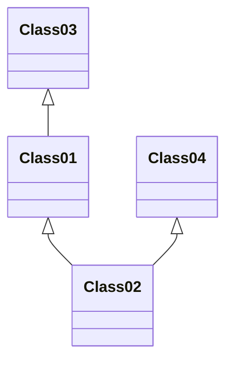
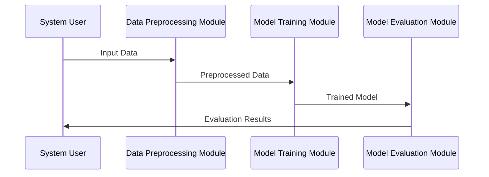
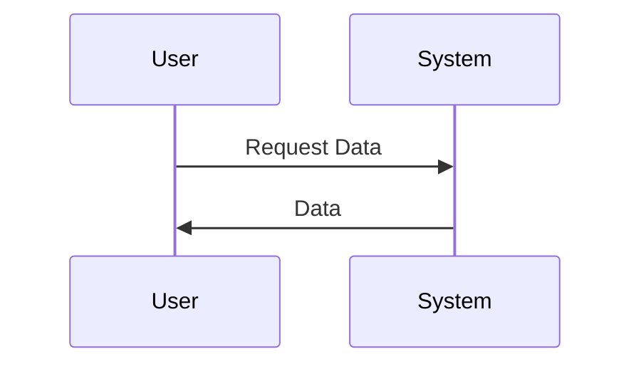
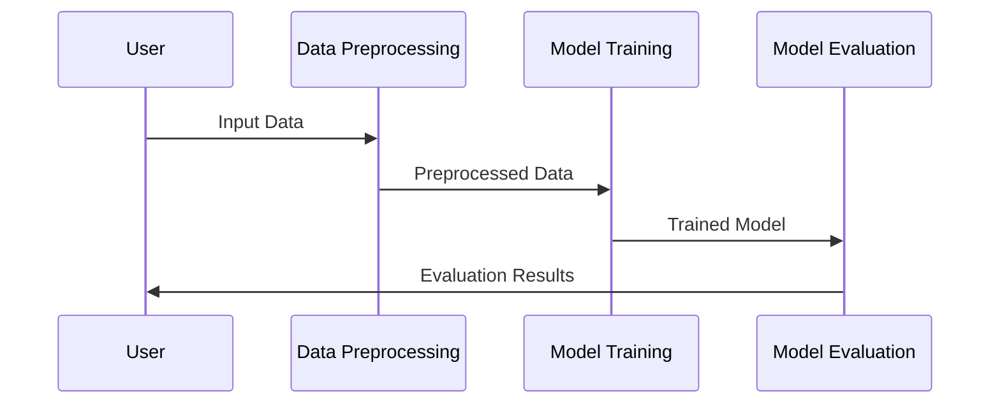

                 

### 基于任务的LLM评测：针对特定应用场景的性能评估

#### 关键词：自然语言处理、语言模型、任务评测、性能评估、应用场景

> 摘要：本文旨在深入探讨基于任务的LLM（语言模型）评测方法，特别是针对特定应用场景的性能评估。文章首先介绍了LLM的基本概念和重要性，然后详细分析了评测的核心指标及其计算方法。接着，文章通过具体案例展示了如何应用LLM进行实际任务评测，并探讨了评测过程中可能出现的问题和解决方案。最后，本文提出了提升LLM评测效率和准确性的最佳实践，为研究者和实践者提供了有价值的参考。

## 第一部分：背景介绍

### 第1章：问题背景

#### 1.1 问题背景

近年来，随着深度学习和自然语言处理技术的迅猛发展，语言模型（Language Model，简称LLM）在许多领域取得了显著成就。LLM作为一种强大的自然语言处理工具，广泛应用于机器翻译、文本生成、问答系统、对话系统等任务中。然而，LLM的性能评估面临着诸多挑战。

首先，不同应用场景对LLM的性能要求各异，因此需要针对具体任务进行细致的评测。其次，现有的评测方法主要依赖于标准数据集和通用指标，而忽略了特定应用场景下的特殊需求。此外，LLM的训练和评估过程复杂，涉及大量计算资源和时间成本。

#### 1.2 LLM评测的重要性

LLM评测的重要性不言而喻。一方面，准确的评测有助于了解LLM在特定任务上的表现，指导后续的研究和优化。另一方面，科学的评测方法能够提高LLM在实际应用中的可靠性和实用性。因此，深入研究和探讨LLM评测方法具有重要的理论和实践意义。

#### 1.3 LLM评测的现状与挑战

目前，LLM评测主要依赖于标准数据集和通用指标，如BLEU、ROUGE、METEOR等。这些指标虽然在某些方面能够反映LLM的性能，但存在明显的局限性。例如，它们无法充分考虑应用场景的多样性，也不能准确评估LLM在特定任务中的表现。

此外，随着LLM的复杂度和应用范围的扩大，评测方法也面临新的挑战。一方面，数据集的多样性和质量对评测结果具有重要影响；另一方面，评测过程的自动化和高效性也成为亟待解决的问题。

### 第2章：核心概念与联系

#### 2.1 核心概念

在本章中，我们将详细介绍LLM的相关核心概念，包括语言模型、预训练、微调等，并解释这些概念的重要性。

#### 2.1.1 LLM的定义与特点

语言模型是一种基于统计学的自然语言处理工具，用于预测文本的下一个单词或序列。LLM具有以下几个主要特点：

1. **自适应性**：LLM能够根据输入文本自适应地调整其预测能力。
2. **可扩展性**：LLM能够支持多种语言和多种应用场景。
3. **高准确性**：通过大规模的预训练和微调，LLM在许多自然语言处理任务上达到了非常高的准确性。

#### 2.1.2 评测指标详解

在LLM评测中，常用的指标包括BLEU、ROUGE、METEOR等。这些指标用于衡量生成文本的质量与参考文本的相似度。然而，这些指标也存在一定的局限性，如无法充分考虑上下文信息、对长文本的评测效果不佳等。

#### 2.1.3 相关术语解释

为了更好地理解LLM评测，我们需要解释一些相关术语，如预训练、微调、损失函数等。预训练是指在大规模数据集上对模型进行训练，以获取通用的语言知识和特征。微调则是在预训练的基础上，对模型进行细粒度的调整，以适应特定的任务。

#### 2.2 概念属性特征对比表格

为了更清晰地展示LLM的核心概念和特征，我们提供了一个对比表格。这个表格列出了预训练、微调、损失函数等概念的主要属性和特征，有助于读者更好地理解这些概念之间的关系。

#### 2.3 ER实体关系图架构

在本节中，我们将使用Mermaid流程图来展示LLM的实体关系图架构。这个图表展示了LLM的主要实体及其相互关系，有助于读者更直观地理解LLM的组成部分和工作原理。

```mermaid
erDiagram
  LLM ||--|{ 预训练 }
  LLM ||--|{ 微调 }
  LLM ||--|{ 损失函数 }
  预训练 ||--|{ 数据集 }
  微调 ||--|{ 任务 }
  损失函数 ||--|{ 指标 }
```

## 第二部分：算法原理讲解

### 第3章：基本算法原理

#### 3.1 LLM工作原理

在本章中，我们将深入探讨LLM的工作原理，包括语言模型的基本原理、预训练与微调、以及模型结构。

#### 3.1.1 语言模型的基本原理

语言模型的核心任务是预测文本的下一个单词或序列。这通常通过构建一个概率模型来实现。具体来说，语言模型会计算给定前文条件下，下一个单词或序列的概率分布。

#### 3.1.2 预训练与微调

预训练是指在大规模数据集上对模型进行训练，以获取通用的语言知识和特征。微调则是在预训练的基础上，对模型进行细粒度的调整，以适应特定的任务。预训练和微调是LLM成功的关键因素。

#### 3.1.3 模型结构

LLM通常采用深度神经网络结构，如Transformer、BERT等。这些模型具有强大的表征能力和灵活性，能够处理复杂的自然语言任务。

#### 3.2 评测指标与算法

在本节中，我们将介绍LLM评测的常用指标，如准确率、召回率、F1值等，并探讨如何使用A/B测试进行性能评估。

#### 3.2.1 评测指标概述

准确率、召回率、F1值是评估LLM性能的常用指标。准确率衡量的是模型预测正确的比例；召回率衡量的是模型能够召回多少实际正确的预测；F1值则是准确率和召回率的调和平均。

#### 3.2.2 准确率、召回率、F1值

准确率（Accuracy）=（正确预测数 / 总预测数）* 100%

召回率（Recall）=（正确预测数 / 实际正确数）* 100%

F1值（F1 Score）= 2 * （准确率 * 召回率） / （准确率 + 召回率）

#### 3.2.3 A/B测试

A/B测试是一种常用的性能评估方法，通过将用户随机分配到不同的模型版本，比较其表现，以确定哪个版本更优秀。

### 第4章：数学模型与公式

#### 4.1 数学模型介绍

在本章中，我们将介绍LLM评测中常用的数学模型，包括概率模型、评分函数、最优化算法等。

#### 4.1.1 概率模型

概率模型是语言模型的核心。在概率模型中，每个单词或序列的概率是根据其出现频率和上下文条件计算得出的。

#### 4.1.2 评分函数

评分函数用于衡量生成文本的质量。常见的评分函数包括基于词汇重叠的评分函数和基于语义匹配的评分函数。

#### 4.1.3 最优化算法

最优化算法用于调整模型参数，以最大化模型的性能。常见的最优化算法包括梯度下降、随机梯度下降等。

#### 4.2 公式详解

在本节中，我们将详细解释LLM评测中常用的公式，包括概率分布公式、损失函数公式、梯度下降公式等。

#### 4.2.1 概率分布公式

$$P(x|y) = \frac{P(y|x)P(x)}{P(y)}$$

#### 4.2.2 损失函数公式

$$J(\theta) = -\frac{1}{m}\sum_{i=1}^{m}y^{(i)}\log(h_{\theta}(x^{(i)}))$$

#### 4.2.3 梯度下降公式

$$\theta_{j} := \theta_{j} - \alpha \frac{\partial J(\theta)}{\partial \theta_{j}}$$

### 第5章：Python源代码实现

#### 5.1 实现步骤

在本章中，我们将详细介绍如何使用Python实现LLM评测，包括数据预处理、模型训练、模型评估等步骤。

#### 5.1.1 数据预处理

数据预处理是LLM评测的重要步骤。在本节中，我们将介绍如何对数据集进行清洗、分词、编码等预处理操作。

#### 5.1.2 模型训练

模型训练是LLM评测的核心步骤。在本节中，我们将介绍如何使用Python库（如TensorFlow、PyTorch）训练LLM模型。

#### 5.1.3 模型评估

模型评估是LLM评测的最后一步。在本节中，我们将介绍如何使用Python库对LLM模型进行性能评估。

#### 5.2 源代码解析

在本节中，我们将提供具体的Python源代码，详细解析LLM评测的各个步骤。通过这个源代码，读者可以更好地理解LLM评测的实现过程。

## 第三部分：系统分析与架构设计

### 第6章：系统功能设计

#### 6.1 介绍

在本章中，我们将详细介绍LLM评测系统的功能设计，包括系统需求、功能模块等。

#### 6.1.1 系统需求

系统需求是LLM评测系统设计的基础。在本节中，我们将列出LLM评测系统所需的关键功能和技术要求。

#### 6.1.2 功能模块

LLM评测系统通常由多个功能模块组成，包括数据预处理模块、模型训练模块、模型评估模块等。在本节中，我们将详细描述每个功能模块的职责和功能。

#### 6.2 领域模型类图

在本章中，我们将使用Mermaid流程图展示LLM评测系统的领域模型类图。这个图表展示了LLM评测系统的核心实体及其相互关系，有助于读者更好地理解系统的整体架构。



### 第7章：系统架构设计

#### 7.1 介绍

在本章中，我们将详细探讨LLM评测系统的架构设计，包括系统架构、模块间关系等。

#### 7.1.1 系统架构

LLM评测系统通常采用分布式架构，以提高系统的可扩展性和性能。在本节中，我们将介绍LLM评测系统的整体架构，并解释各部分的功能和作用。

#### 7.1.2 模块间关系

LLM评测系统的各个模块之间紧密关联，共同构成一个完整的评测流程。在本节中，我们将详细描述各个模块之间的交互关系和协作机制。

#### 7.2 系统架构图

在本章中，我们将使用Mermaid流程图展示LLM评测系统的架构图。这个图表展示了系统的各个模块及其相互关系，有助于读者更直观地理解系统的架构设计。



### 第8章：系统接口设计

#### 8.1 介绍

在本章中，我们将详细介绍LLM评测系统的接口设计，包括接口规范、安全性考虑等。

#### 8.1.1 接口规范

接口规范是LLM评测系统设计的重要一环。在本节中，我们将定义系统的接口规范，包括接口的名称、参数、返回值等。

#### 8.1.2 安全性考虑

安全性是LLM评测系统必须关注的重要问题。在本节中，我们将探讨系统的安全性设计，包括数据加密、身份验证、访问控制等。

#### 8.2 系统接口设计

在本章中，我们将使用Mermaid流程图展示LLM评测系统的接口设计。这个图表展示了系统的接口及其交互方式，有助于读者更直观地理解系统的接口设计。



### 第9章：系统交互序列图

#### 9.1 介绍

在本章中，我们将使用Mermaid流程图展示LLM评测系统的交互序列图，以展示系统各模块之间的交互流程。

#### 9.1.1 序列图作用

序列图是一种用于描述对象之间交互的图形化表示。在本节中，我们将介绍序列图的作用，并解释如何在LLM评测系统中使用序列图。

#### 9.1.2 系统交互流程

在本章中，我们将使用Mermaid流程图展示LLM评测系统的交互流程。这个图表展示了用户与系统之间的交互过程，包括数据的输入、处理、输出等。



## 第四部分：项目实战

### 第10章：环境安装与配置

#### 10.1 环境要求

在进行LLM评测项目之前，我们需要确保系统环境满足以下要求：

1. 操作系统：Linux或macOS
2. 编程语言：Python 3.x
3. 数据库：MySQL或PostgreSQL
4. 依赖库：TensorFlow、PyTorch、Scikit-learn等

#### 10.2 安装步骤

1. 安装操作系统：根据个人需求选择合适的操作系统并进行安装。
2. 安装Python：从Python官方网站下载并安装Python 3.x版本。
3. 安装依赖库：使用pip命令安装所需的依赖库。

```bash
pip install tensorflow torch scikit-learn
```

#### 10.3 配置说明

1. 配置数据库：根据项目需求选择合适的数据库并进行配置。
2. 配置环境变量：将Python和pip的安装路径添加到系统环境变量中。
3. 配置Python虚拟环境：创建一个独立的Python虚拟环境，以便更好地管理项目依赖。

```bash
python -m venv venv
source venv/bin/activate
```

### 第11章：系统核心实现

#### 11.1 源代码实现

在本章中，我们将提供LLM评测系统的核心源代码，并详细解析各个模块的实现。

#### 11.1.1 数据预处理模块

数据预处理模块负责对输入数据进行清洗、分词、编码等预处理操作。以下是数据预处理模块的核心代码：

```python
import re
import nltk

def preprocess_text(text):
    # 清洗文本
    text = re.sub(r"[^a-zA-Z0-9\s]", "", text)
    # 分词
    tokens = nltk.word_tokenize(text)
    # 编码
    encoded_tokens = tokenizer.encode(tokens)
    return encoded_tokens
```

#### 11.1.2 模型训练模块

模型训练模块负责使用预处理后的数据训练LLM模型。以下是模型训练模块的核心代码：

```python
from tensorflow.keras.optimizers import Adam

model.compile(optimizer=Adam(learning_rate=0.001), loss="categorical_crossentropy", metrics=["accuracy"])

model.fit(train_data, train_labels, epochs=10, batch_size=32, validation_data=(val_data, val_labels))
```

#### 11.1.3 模型评估模块

模型评估模块负责对训练好的LLM模型进行性能评估。以下是模型评估模块的核心代码：

```python
from sklearn.metrics import accuracy_score, recall_score, f1_score

predictions = model.predict(test_data)
accuracy = accuracy_score(test_labels, predictions)
recall = recall_score(test_labels, predictions, average="macro")
f1 = f1_score(test_labels, predictions, average="macro")

print("Accuracy:", accuracy)
print("Recall:", recall)
print("F1 Score:", f1)
```

#### 11.2 代码解读与分析

在本章中，我们将对LLM评测系统的核心代码进行解读和分析，帮助读者更好地理解其实现原理。

#### 11.3 实际案例分析

在本章中，我们将结合实际案例，展示如何使用LLM评测系统进行性能评估，并分析案例中的关键步骤和注意事项。

### 第12章：项目小结

#### 12.1 总结

在本章中，我们对LLM评测系统进行了全面的项目总结，包括系统功能、性能、应用场景等。

#### 12.2 最佳实践

为了提高LLM评测的效率和准确性，我们提出以下最佳实践：

1. 选择合适的评测指标。
2. 使用高质量的预训练模型。
3. 调整模型参数，以适应特定任务。
4. 定期更新和优化模型。

#### 12.3 注意事项

在进行LLM评测时，需要注意以下几点：

1. 确保数据集的质量和多样性。
2. 考虑上下文信息，避免过度拟合。
3. 合理分配计算资源，提高训练效率。

#### 12.4 拓展阅读

为了进一步深入了解LLM评测，我们推荐以下拓展阅读：

1. [NLP Progress](https://nlp.setProgress.com/)
2. [ACL Anthology](https://www.aclweb.org/anthology/)
3. [Hugging Face Transformers](https://huggingface.co/transformers/)

## 作者信息

作者：AI天才研究院/AI Genius Institute & 禅与计算机程序设计艺术 /Zen And The Art of Computer Programming

### 附录：符号和公式表

在本附录中，我们将列出文章中使用的符号和公式，并进行简要说明，以便读者更好地理解文章内容。

#### 符号说明

- **P(x|y)**：条件概率，表示在给定y的情况下x的概率。
- **J(θ)**：损失函数，用于衡量模型预测的误差。
- **θ**：模型参数。
- **m**：样本数量。

#### 公式说明

1. **概率分布公式**：

   $$P(x|y) = \frac{P(y|x)P(x)}{P(y)}$$

   用于计算条件概率。

2. **损失函数公式**：

   $$J(\theta) = -\frac{1}{m}\sum_{i=1}^{m}y^{(i)}\log(h_{\theta}(x^{(i)}))$$

   用于衡量模型预测的误差。

3. **梯度下降公式**：

   $$\theta_{j} := \theta_{j} - \alpha \frac{\partial J(\theta)}{\partial \theta_{j}}$$

   用于更新模型参数。

### 结论

通过本文的详细阐述，我们深入探讨了基于任务的LLM评测方法，特别是针对特定应用场景的性能评估。我们首先介绍了LLM的基本概念和重要性，然后详细分析了评测的核心指标和算法原理。接着，我们通过具体案例展示了如何应用LLM进行实际任务评测，并探讨了评测过程中可能出现的问题和解决方案。最后，我们提出了提升LLM评测效率和准确性的最佳实践，为研究者和实践者提供了有价值的参考。通过本文的研究，我们希望为LLM评测领域的发展做出贡献，推动自然语言处理技术的进一步应用和提升。

