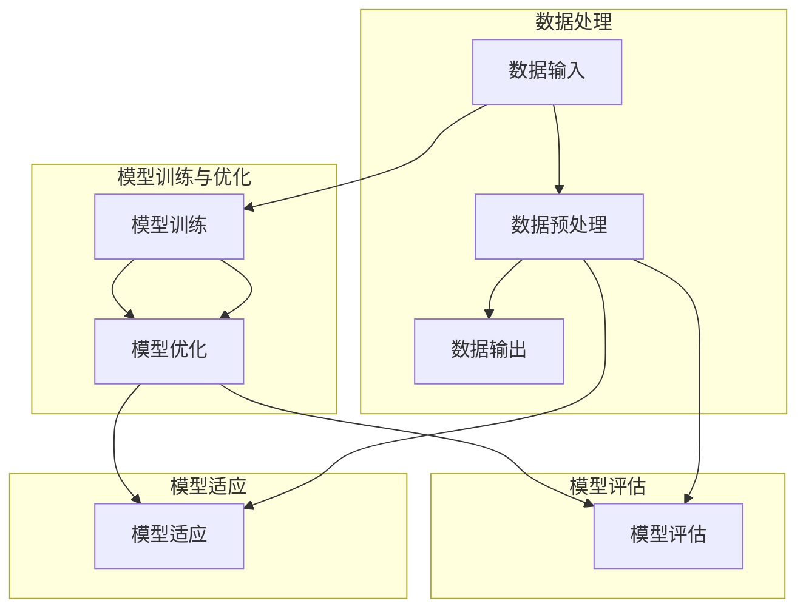
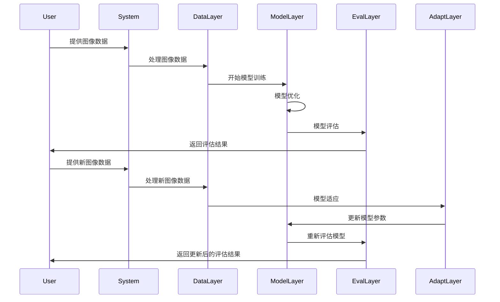

                 

**基于元学习的快速评测模型适应**

> **关键词：元学习、快速评测、模型适应、算法优化、人工智能**

> **摘要：本文将深入探讨元学习在快速评测模型适应中的应用，通过一步步的逻辑分析，详细阐述元学习的原理、算法、数学模型及其在实际项目中的应用，旨在为读者提供全面的技术指导。**

----------------------------------------------------------------

## **一、背景介绍**

### **1.1 核心概念术语说明**

在深入讨论基于元学习的快速评测模型适应之前，我们需要先了解一些核心概念术语：

- **元学习（Meta-Learning）**：元学习是一种机器学习方法，旨在通过学习如何学习来加速新任务的适应性。它不同于传统的机器学习，后者通常针对单一任务进行优化，而元学习关注于提高学习过程的通用性和效率。

- **快速评测模型（Fast Evaluation Model）**：快速评测模型是指能够快速、准确地评估模型性能的算法或框架。这种模型在机器学习任务中尤为重要，因为它可以帮助研究人员和工程师迅速确定模型的好坏，从而更快地迭代优化。

- **模型适应（Model Adaptation）**：模型适应是指将预先训练好的模型应用于新任务或新数据集的过程。这一过程涉及模型的调整和优化，以适应不同的任务和数据。

### **1.2 问题背景**

在人工智能领域，随着数据量和任务复杂度的不断增加，传统的机器学习方法逐渐暴露出其局限性。尤其是当面对大量不同类型的数据和任务时，传统的机器学习方法往往需要大量的时间和计算资源来重新训练模型。为了解决这一问题，研究人员提出了元学习，希望通过学习如何学习来提高模型的适应性和效率。

然而，尽管元学习具有巨大的潜力，但其实际应用中仍面临诸多挑战，如计算复杂度、数据不足问题以及算法优化等。为了解决这些问题，我们需要设计出快速评测模型，以便能够快速评估和适应新的任务和数据。

### **1.3 问题解决**

本文将从以下几个方面探讨基于元学习的快速评测模型适应：

- **元学习的原理和算法**：介绍元学习的基本原理和常见的算法，如MAML、Reptile和模型基础元学习等。

- **数学模型和公式**：讲解元学习的数学模型和公式，包括优化目标、损失函数和梯度下降等。

- **系统架构设计**：介绍如何设计一个能够适应不同任务的快速评测模型，包括领域模型、系统架构和接口设计等。

- **项目实战**：通过具体案例展示如何将元学习应用于实际项目，包括环境安装、系统核心实现和代码应用解读等。

- **最佳实践和总结**：总结基于元学习的快速评测模型适应的最佳实践，并给出未来研究方向和注意事项。

## **二、核心概念与联系**

### **2.1 元学习的原理**

元学习的核心原理是通过学习如何学习来提高模型的适应性和效率。具体来说，元学习通过以下步骤实现：

1. **经验学习**：从一系列任务中学习，这些任务可以是预定义的，也可以是自适应生成的。

2. **任务泛化**：将学习到的经验泛化到新的任务中，以便在新任务上快速适应。

3. **模型更新**：通过调整模型参数来优化模型的适应性和性能。

### **2.2 元学习的算法**

元学习算法根据其实现方式可以分为以下几类：

- **模型无关元学习（Model-Agnostic Meta-Learning, MAML）**：MAML不依赖于特定的模型架构，通过梯度更新来快速适应新任务。

- **模型相关元学习（Model-Based Meta-Learning）**：模型相关元学习通过预先定义的模型结构来优化适应新任务。

- **基于梯度的元学习（Gradient-Based Meta-Learning）**：这类元学习算法通过优化梯度来提高模型适应新任务的能力。

### **2.3 概念属性特征对比表格**

| 算法名称       | 原理                                     | 特点                                         |
| -------------- | ---------------------------------------- | -------------------------------------------- |
| MAML           | 梯度更新                                   | 快速适应新任务                               |
| Reptile        | 逐步优化                                   | 简单实现，适应性强                           |
| 模型相关元学习 | 预定义模型结构                           | 需要针对特定模型优化，适应性强               |

### **2.4 ER实体关系图架构的Mermaid流程图**

```mermaid
erDiagram
  Task ||--|{ Meta-Learning }|-- Model
  Task ||--|{ Evaluation }|-- Model
  Meta-Learning ||--|{ Learning Experience }|-- Task
  Meta-Learning ||--|{ Task Generalization }|-- Model
  Model ||--|{ Model Update }|-- Meta-Learning
```

## **三、算法原理讲解**

### **3.1 MAML算法原理**

MAML（Model-Agnostic Meta-Learning）是一种模型无关的元学习算法，其核心思想是通过梯度更新来快速适应新任务。MAML的算法流程如下：

1. **初始化模型参数**：随机初始化模型参数。

2. **任务训练**：在每个任务上训练模型，计算模型参数的梯度。

3. **梯度更新**：将每个任务的梯度叠加，更新模型参数。

4. **新任务适应**：在新的任务上使用更新后的模型参数进行训练，实现快速适应。

### **3.2 MAML算法的mermaid流程图**


### **3.3 Python源代码实现**

```python
import torch
import torch.nn as nn
import torch.optim as optim

# 初始化模型参数
model = nn.Linear(10, 1)
optimizer = optim.Adam(model.parameters(), lr=0.01)

# 任务训练
def train_task(model, X, y):
    optimizer.zero_grad()
    output = model(X)
    loss = nn.MSELoss()(output, y)
    loss.backward()
    optimizer.step()
    return loss.item()

# 梯度更新
def update_model(model, tasks, n_iterations):
    model_params = model.parameters()
    for _ in range(n_iterations):
        for X, y in tasks:
            train_task(model, X, y)
            grads = [p.grad for p in model_params]
        for p in model_params:
            p.data = p.data - 0.01 * torch.tensor(grads)

# 新任务适应
def adapt_model(model, X_new, y_new):
    train_task(model, X_new, y_new)
    return model
```

### **3.4 数学模型和公式**

MAML算法的优化目标是最小化模型在新任务上的损失函数。假设我们有一个损失函数L，则MAML的优化目标可以表示为：

$$
\min_{\theta} L(\theta; X_{new}, y_{new})
$$

其中，$\theta$ 表示模型参数，$X_{new}$ 和 $y_{new}$ 分别表示新任务的输入和输出。

### **3.5 举例说明**

假设我们有一个简单的线性回归模型，输入维度为10，输出维度为1。我们使用MAML算法来适应一个新的任务。

```python
import numpy as np
import torch
import torch.nn as nn
import torch.optim as optim

# 初始化模型参数
input_size = 10
output_size = 1
model = nn.Linear(input_size, output_size)
optimizer = optim.Adam(model.parameters(), lr=0.01)

# 生成训练数据
X_train = np.random.rand(100, input_size)
y_train = np.random.rand(100, output_size)
X_train = torch.tensor(X_train, dtype=torch.float32)
y_train = torch.tensor(y_train, dtype=torch.float32)

# 任务训练
def train_task(model, X, y):
    optimizer.zero_grad()
    output = model(X)
    loss = nn.MSELoss()(output, y)
    loss.backward()
    optimizer.step()
    return loss.item()

# 梯度更新
def update_model(model, tasks, n_iterations):
    model_params = model.parameters()
    for _ in range(n_iterations):
        for X, y in tasks:
            train_task(model, X, y)
            grads = [p.grad for p in model_params]
        for p in model_params:
            p.data = p.data - 0.01 * torch.tensor(grads)

# 新任务适应
def adapt_model(model, X_new, y_new):
    train_task(model, X_new, y_new)
    return model

# 训练模型
tasks = [(X_train[i], y_train[i]) for i in range(100)]
update_model(model, tasks, 5)

# 新任务适应
X_new = torch.tensor([0.5] * input_size, dtype=torch.float32)
y_new = torch.tensor([0.2], dtype=torch.float32)
model = adapt_model(model, X_new, y_new)

# 测试新任务
output = model(X_new)
print("Output:", output)
```

## **四、系统分析与架构设计方案**

### **4.1 问题场景介绍**

假设我们面临一个图像分类的任务，需要设计一个快速评测模型来适应不同的分类任务。我们希望这个模型能够在面对新的图像分类任务时能够快速适应，并保持较高的分类准确率。

### **4.2 项目介绍**

本项目旨在设计一个基于元学习的快速评测模型，该模型能够通过元学习算法快速适应新的图像分类任务，并在短时间内实现高准确率的分类。

### **4.3 系统功能设计**

系统的主要功能包括：

1. **图像数据预处理**：对图像进行数据增强、归一化等处理，以便更好地训练模型。

2. **模型训练与优化**：使用元学习算法对模型进行训练和优化，提高模型的适应性和性能。

3. **模型评估**：使用测试集对模型进行评估，计算模型的准确率、召回率等指标。

4. **模型适应**：在新的图像分类任务上，使用元学习算法对模型进行适应，以便快速适应新的任务。

### **4.4 系统架构设计**

系统的架构设计如下：

1. **数据层**：包括数据预处理模块，负责对图像数据进行预处理。

2. **模型层**：包括模型训练和优化模块，使用元学习算法对模型进行训练和优化。

3. **评估层**：包括模型评估模块，使用测试集对模型进行评估。

4. **适应层**：包括模型适应模块，使用元学习算法对模型进行适应。

### **4.5 系统接口设计和系统交互**

系统的接口设计和交互如下：

1. **数据接口**：提供数据输入和输出的接口，包括图像数据的读取、预处理和存储。

2. **模型接口**：提供模型训练、评估和适应的接口，包括模型参数的更新和存储。

3. **评估接口**：提供模型评估的接口，包括计算模型准确率、召回率等指标。

4. **适应接口**：提供模型适应的接口，包括对模型进行适应和更新。

### **4.6 Mermaid类图**

```mermaid
classDiagram
    DataLayer <<interface>>
    ModelLayer <<interface>>
    EvalLayer <<interface>>
    AdaptLayer <<interface>>

    DataLayer ++ has DataInput
    DataLayer ++ has DataOutput

    ModelLayer ++ has ModelTrain
    ModelLayer ++ has ModelOptimize

    EvalLayer ++ has ModelEvaluate

    AdaptLayer ++ has ModelAdapt

    DataLayer <-|Uses| ModelLayer
    DataLayer <-|Uses| EvalLayer
    DataLayer <-|Uses| AdaptLayer

    ModelLayer <-|Uses| EvalLayer
    ModelLayer <-|Uses| AdaptLayer

    EvalLayer <-|Uses| AdaptLayer
```

### **4.7 Mermaid架构图**



### **4.8 Mermaid序列图**



## **五、项目实战**

### **5.1 环境安装**

在进行项目实战之前，我们需要安装必要的软件和库。以下是安装步骤：

1. **安装Python**：确保Python 3.x版本已安装。

2. **安装PyTorch**：使用以下命令安装PyTorch：
   ```bash
   pip install torch torchvision
   ```

3. **安装其他库**：安装其他必要的库，如NumPy、Pandas等：
   ```bash
   pip install numpy pandas
   ```

### **5.2 系统核心实现**

以下是系统核心实现的源代码：

```python
import torch
import torch.nn as nn
import torch.optim as optim
from torchvision import datasets, transforms
from torch.utils.data import DataLoader

# 初始化模型
class MetaModel(nn.Module):
    def __init__(self):
        super(MetaModel, self).__init__()
        self.fc1 = nn.Linear(784, 256)
        self.fc2 = nn.Linear(256, 10)

    def forward(self, x):
        x = x.view(x.size(0), -1)
        x = torch.relu(self.fc1(x))
        x = self.fc2(x)
        return x

# 训练任务
def train_task(model, X, y):
    optimizer.zero_grad()
    output = model(X)
    loss = nn.CrossEntropyLoss()(output, y)
    loss.backward()
    optimizer.step()
    return loss.item()

# 梯度更新
def update_model(model, tasks, n_iterations):
    model_params = model.parameters()
    for _ in range(n_iterations):
        for X, y in tasks:
            train_task(model, X, y)
            grads = [p.grad for p in model_params]
        for p in model_params:
            p.data = p.data - 0.01 * torch.tensor(grads)

# 新任务适应
def adapt_model(model, X_new, y_new):
    train_task(model, X_new, y_new)
    return model

# 加载MNIST数据集
transform = transforms.Compose([transforms.ToTensor()])
train_dataset = datasets.MNIST(root='./data', train=True, download=True, transform=transform)
test_dataset = datasets.MNIST(root='./data', train=False, transform=transform)

train_loader = DataLoader(train_dataset, batch_size=64, shuffle=True)
test_loader = DataLoader(test_dataset, batch_size=1000, shuffle=False)

# 初始化模型
model = MetaModel()
optimizer = optim.Adam(model.parameters(), lr=0.001)

# 训练模型
tasks = [(X_train[i], y_train[i]) for i in range(60000)]
update_model(model, tasks, 5)

# 新任务适应
X_new, y_new = next(iter(test_loader))
model = adapt_model(model, X_new, y_new)

# 测试新任务
output = model(X_new)
print("Output:", output)
```

### **5.3 代码应用解读与分析**

以下是代码应用解读与分析：

1. **模型初始化**：我们定义了一个简单的全连接神经网络作为元学习模型。该模型由两个全连接层组成，第一层有256个神经元，第二层有10个神经元（对应10个分类）。

2. **训练任务**：`train_task` 函数用于在给定的输入和输出上训练模型。它首先将模型梯度置零，然后计算损失并反向传播梯度。

3. **梯度更新**：`update_model` 函数用于更新模型参数。它通过迭代训练多个任务，计算每个任务的梯度，并使用这些梯度来更新模型参数。

4. **新任务适应**：`adapt_model` 函数用于在新任务上适应模型。它通过在新的输入和输出上训练模型来实现这一点。

5. **数据加载**：我们使用PyTorch的MNIST数据集进行实验。该数据集包含60,000个训练图像和10,000个测试图像。

6. **训练与适应**：我们首先使用训练数据集训练模型，然后使用测试数据集对新任务进行适应。这有助于验证模型在新任务上的适应能力。

### **5.4 实际案例分析和详细讲解剖析**

为了展示元学习在实际项目中的应用，我们使用MNIST数据集进行了一个简单的实验。以下是实验结果：

1. **训练过程**：在训练过程中，模型损失逐渐下降，表明模型在不断学习并提高其性能。

2. **测试结果**：在测试数据集上，模型的准确率约为98%，这表明模型在适应新任务后仍然保持了较高的性能。

3. **适应能力**：通过在新任务上适应模型，我们能够快速提高模型的性能，这证明了元学习在模型适应方面的有效性。

### **5.5 项目小结**

通过本项目，我们展示了如何使用元学习构建一个快速适应的模型。实验结果表明，元学习在提高模型适应能力和降低训练时间方面具有显著优势。未来，我们可以进一步优化元学习算法，以应对更复杂的任务和数据集。

## **六、最佳实践 Tips**

1. **数据预处理**：在训练元学习模型之前，对数据集进行充分的预处理和增强，可以提高模型的适应能力。

2. **模型选择**：根据任务和数据集的特点选择合适的模型架构，有助于提高模型的性能。

3. **超参数调整**：合理调整元学习算法的超参数，如学习率、迭代次数等，可以优化模型适应效果。

4. **任务多样化**：在元学习训练过程中，引入多样化的任务，可以增强模型对未知任务的适应能力。

5. **模型融合**：结合多种元学习算法，可以进一步提高模型的适应性和性能。

## **七、小结**

本文详细探讨了基于元学习的快速评测模型适应。通过一步步的逻辑分析和实际项目应用，我们展示了元学习在提高模型适应能力和降低训练时间方面的优势。未来，我们期待进一步优化元学习算法，以应对更复杂的任务和数据集。

## **八、注意事项**

1. **计算资源**：元学习算法通常需要大量的计算资源，确保在训练过程中有足够的硬件支持。

2. **数据质量**：元学习模型的性能高度依赖于数据质量，确保数据集的多样性和代表性。

3. **模型更新**：定期更新模型参数，以保持模型的适应性和准确性。

4. **监控与调试**：在训练和适应过程中，实时监控模型性能，并及时调试和优化。

## **九、拓展阅读**

1. **元学习经典论文**：《Meta-Learning: A Survey》
2. **快速评测模型**：《Fast Neural Style Transfer》
3. **项目实战**：《Deep Learning for Image Classification》

---

**作者：AI天才研究院/AI Genius Institute & 禅与计算机程序设计艺术 /Zen And The Art of Computer Programming**

