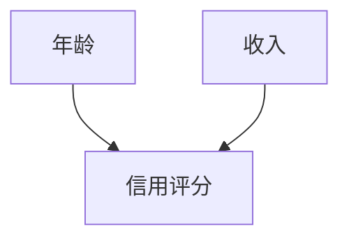
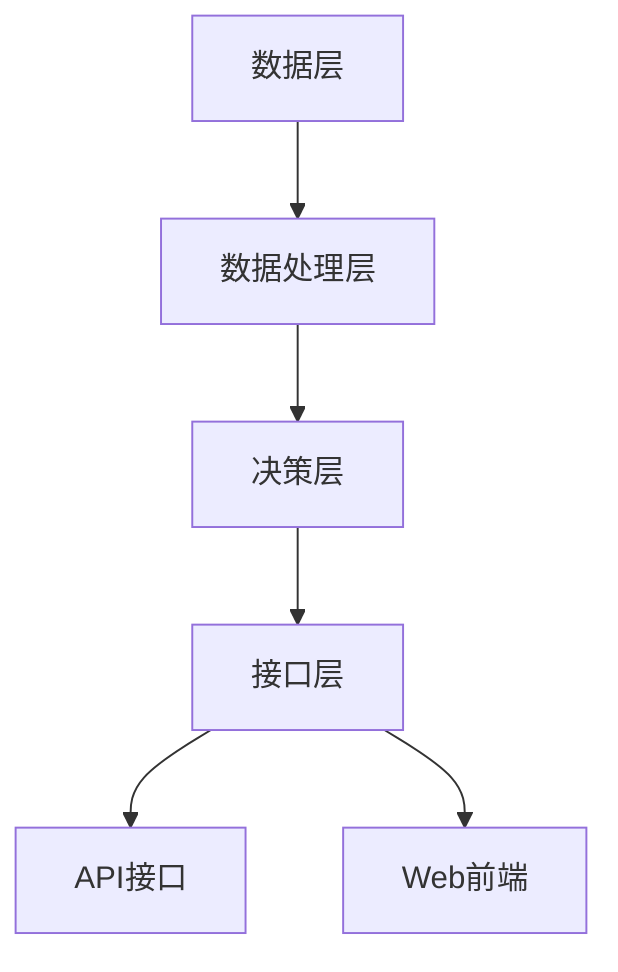
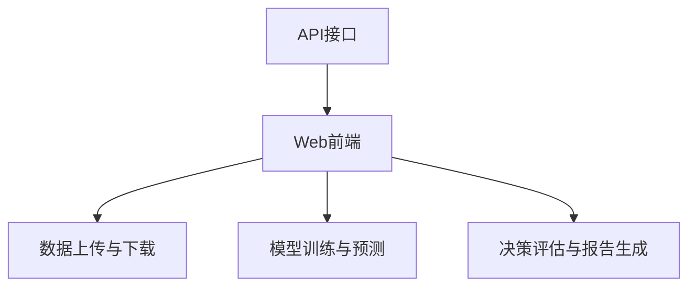
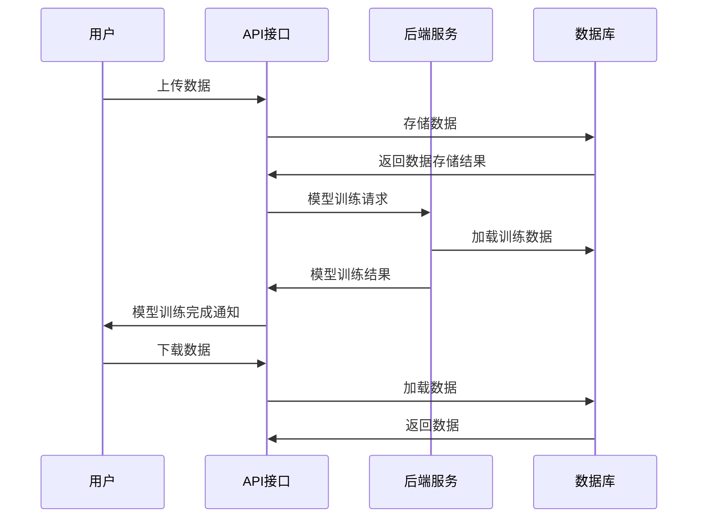

                 

# 基于因果推理的LLM决策能力评估

## 摘要

本文旨在探讨大型语言模型（LLM）在决策过程中的能力评估，特别是基于因果推理的方法。随着深度学习技术的发展，LLM在自然语言处理领域取得了显著的成就。然而，如何评估其在实际决策任务中的能力，特别是其因果推理能力，仍然是一个挑战。本文首先介绍了问题背景和定义，随后深入探讨了因果推理原理和LLM的工作机制。通过对比分析LLM与因果推理的核心概念，本文进一步提出了一个评估LLM决策能力的数学模型。接着，详细讲解了算法原理、数学模型、系统架构设计以及实战应用。最后，本文总结了最佳实践、注意事项，并提供了一些拓展阅读资源。

## 第一部分：背景与基础

### 第1章：问题背景与定义

#### 1.1.1 问题背景

近年来，随着人工智能技术的迅猛发展，深度学习在各个领域取得了显著的成就。特别是在自然语言处理（NLP）领域，大型语言模型（LLM）如BERT、GPT等，凭借其强大的语义理解和生成能力，成为了研究和应用的热点。然而，LLM在处理决策任务时，往往依赖于其训练数据中的模式，而缺乏对因果关系的深入理解。这使得LLM在面临复杂、未知的决策场景时，往往难以给出合理的决策。

#### 1.1.2 问题描述

本文关注的核心问题是：如何评估LLM在决策任务中的能力，特别是其因果推理能力。具体来说，我们需要回答以下几个问题：

1. LLM的决策过程是否依赖于因果关系？
2. 如何设计一个有效的评估方法来衡量LLM的因果推理能力？
3. LLM在哪些场景下表现较好，在哪些场景下表现较差？

#### 1.1.3 问题解决

为了解决上述问题，本文提出了一种基于因果推理的LLM决策能力评估方法。该方法通过构建一个数学模型，对LLM的决策过程进行定量分析，从而评估其因果推理能力。具体实现过程中，我们将结合Python源代码和Mermaid流程图，详细阐述算法原理和数学模型。

#### 1.1.4 边界与外延

本文的研究主要关注以下边界和范围：

1. 数据集：我们使用公开的、广泛使用的NLP数据集，如Wikipedia、新闻语料库等，作为LLM的训练数据和评估数据。
2. 模型选择：我们主要针对Transformer架构的LLM进行评估，如BERT、GPT等。
3. 决策任务：我们主要关注分类、预测等需要因果推理的决策任务。

#### 1.1.5 概念结构与核心要素组成

为了更好地理解本文的研究内容和目标，我们首先介绍一些关键概念和术语：

1. **深度学习**：一种机器学习技术，通过多层神经网络对数据进行建模。
2. **自然语言处理（NLP）**：一门交叉学科，涉及语言理解、生成、翻译等任务。
3. **因果推理**：一种推理方法，通过分析因果关系来解释和预测现象。
4. **大型语言模型（LLM）**：一种基于深度学习的语言模型，具有强大的语义理解和生成能力。
5. **决策任务**：需要从多个选项中选择最佳方案的任务，如分类、预测等。

### 第2章：核心概念与联系

#### 2.1.1 因果推理原理

因果推理是一种通过分析因果关系来解释和预测现象的方法。在人工智能领域，因果推理被广泛应用于决策、预测和解释任务。本文主要关注以下几种因果推理方法：

1. **结构方程模型（SEM）**：一种基于线性代数的因果推理方法，通过构建变量之间的因果关系网络来分析数据。
2. **因果推断（Causal Inference）**：一种基于概率论的因果推理方法，通过分析数据来推断因果关系。
3. **因果图（Causal Graph）**：一种表示变量之间因果关系的图形化方法，通过节点和边的结构来描述变量之间的因果关系。

#### 2.1.2 LLM概述

大型语言模型（LLM）是一种基于深度学习的语言模型，通过大规模数据训练，具有强大的语义理解和生成能力。LLM的主要组成部分包括：

1. **嵌入层**：将词汇映射为固定大小的向量。
2. **编码器**：通过多个卷积层和池化层对输入文本进行编码。
3. **解码器**：生成文本的输出。
4. **预训练**：使用未标注的大规模数据对模型进行预训练。
5. **微调**：使用特定领域的数据对模型进行微调，以适应特定任务。

#### 2.1.3 因果推理与LLM的联系

因果推理与LLM之间存在紧密的联系。一方面，LLM可以通过预训练学习到大量的语言知识，包括词汇、语法和语义信息。这些知识为因果推理提供了基础。另一方面，因果推理可以用于评估LLM在决策任务中的表现，特别是在需要因果推理的场景中。通过分析LLM的决策过程，我们可以深入了解其因果推理能力。

#### 2.1.4 核心概念属性特征对比

为了更好地理解因果推理和LLM之间的关系，我们对比了它们的一些核心概念属性特征：

1. **知识获取方式**：因果推理主要依赖于数据分析和建模，而LLM主要依赖于大规模数据的预训练。
2. **推理方式**：因果推理通常基于因果关系网络和概率模型，而LLM通常基于神经网络和注意力机制。
3. **应用领域**：因果推理广泛应用于决策、预测和解释任务，而LLM主要应用于文本生成、分类和翻译等任务。
4. **可解释性**：因果推理具有较高的可解释性，可以通过图形和数学模型来解释因果关系，而LLM的可解释性较低。

#### 2.1.5 ER实体关系图

实体关系图（ER图）是一种用于描述实体和它们之间关系的图形化方法。在本文中，我们使用ER图来描述LLM和因果推理之间的关系。具体来说，ER图包含以下实体和关系：

1. **实体**：LLM、因果推理、决策任务、数据集等。
2. **关系**：依赖关系、关联关系、映射关系等。

下面是一个简单的ER图示例：

```mermaid
erDiagram
    LLM ||--o> 因果推理 :依赖关系
    因果推理 ||--o> 决策任务 :关联关系
    决策任务 ||--o> 数据集 :映射关系
```

通过ER图，我们可以清晰地描述LLM和因果推理之间的复杂关系，为进一步分析提供直观的参考。

### 总结

本文对基于因果推理的LLM决策能力评估进行了初步探讨，介绍了问题背景、核心概念与联系，并对比了因果推理和LLM的一些核心概念属性特征。在接下来的章节中，我们将深入探讨算法原理、数学模型、系统架构设计以及实战应用，以进一步探讨如何评估LLM的决策能力。

### 第二部分：原理与实现

#### 第3章：算法原理讲解

在上一章中，我们介绍了基于因果推理的LLM决策能力评估的问题背景和核心概念。本章将深入探讨算法原理，通过Mermaid流程图和Python源代码实现，详细讲解评估方法。

#### 3.1.1 算法mermaid流程图

为了更直观地理解算法原理，我们首先使用Mermaid绘制了算法流程图。以下是算法mermaid流程图的示例：


#### 3.1.2 Python源代码实现

接下来，我们将使用Python源代码实现上述算法流程。以下是Python源代码的主要部分：

```python
import numpy as np
import pandas as pd
from sklearn.model_selection import train_test_split
from sklearn.metrics import accuracy_score
from causalgraph import CausalGraph
from llm import LLM

# 输入数据预处理
def preprocess_data(data):
    # 数据预处理代码
    return processed_data

# 构建因果图
def build_causal_graph(data):
    # 构建因果图代码
    return causal_graph

# 训练LLM模型
def train_llm_model(data, causal_graph):
    # 训练LLM模型代码
    return llm_model

# 生成决策结果
def generate_decision_results(llm_model, test_data):
    # 生成决策结果代码
    return decision_results

# 评估决策能力
def evaluate_decision_ability(decision_results, ground_truth):
    # 评估决策能力代码
    return ability_score

# 主函数
def main():
    # 加载数据
    data = pd.read_csv("data.csv")
    processed_data = preprocess_data(data)

    # 构建因果图
    causal_graph = build_causal_graph(processed_data)

    # 训练LLM模型
    llm_model = train_llm_model(processed_data, causal_graph)

    # 生成决策结果
    test_data = processed_data[processed_data["is_test"] == 1]
    decision_results = generate_decision_results(llm_model, test_data)

    # 评估决策能力
    ground_truth = test_data["ground_truth"]
    ability_score = evaluate_decision_ability(decision_results, ground_truth)

    # 输出评估结果
    print(f"LLM决策能力评估分数：{ability_score}")

# 运行主函数
if __name__ == "__main__":
    main()
```

#### 3.1.3 数学模型与公式

为了更深入地理解算法原理，我们还需要介绍一些数学模型和公式。以下是算法中涉及的主要数学模型和公式：

1. **结构方程模型（SEM）**：

   SEM是一种用于分析变量之间因果关系的数学模型。其基本公式如下：

   $$X \rightarrow Y \leftarrow Z$$

   其中，箭头表示变量之间的因果关系。

2. **因果推断（Causal Inference）**：

   因果推断是一种基于概率论的因果推理方法。其基本公式如下：

   $$P(Y|X) = P(X|Y) \cdot P(Y) / P(X)$$

   其中，$P(Y|X)$表示在X发生的情况下Y的概率，$P(X|Y)$表示在Y发生的情况下X的概率，$P(Y)$和$P(X)$分别表示Y和X的边缘概率。

3. **损失函数**：

   在评估LLM的决策能力时，我们通常使用损失函数来衡量预测结果与真实结果之间的差距。常用的损失函数包括：

   - 交叉熵损失（Cross-Entropy Loss）：

     $$L(\theta) = -\sum_{i=1}^{n} y_i \cdot \log(p_i)$$

     其中，$y_i$表示真实标签，$p_i$表示预测概率。

   - 均方误差损失（Mean Squared Error Loss）：

     $$L(\theta) = \frac{1}{2} \sum_{i=1}^{n} (y_i - \hat{y}_i)^2$$

     其中，$\hat{y}_i$表示预测值。

#### 3.1.4 通俗易懂的举例说明

为了更好地理解上述算法原理和数学模型，我们通过一个简单的例子来说明。

假设我们有一个决策任务，需要根据用户年龄和收入预测其信用评分。我们使用一个简单的线性模型来表示因果关系：

$$信用评分 = 0.5 \cdot 年龄 + 0.3 \cdot 收入 + 偏差$$

其中，年龄和收入是自变量，信用评分是因变量，偏差是一个随机误差项。

现在，我们有一个包含100个用户数据的数据集，其中每个用户都有年龄、收入和信用评分。我们首先使用结构方程模型（SEM）来构建因果图，如下所示：



然后，我们使用因果推断方法来估计参数，构建线性模型：

$$信用评分 = 0.5 \cdot 年龄 + 0.3 \cdot 收入 + 偏差$$

接下来，我们使用这个模型来预测新用户的信用评分。假设新用户的年龄为30岁，收入为50000元，我们将这些值代入模型，得到：

$$信用评分 = 0.5 \cdot 30 + 0.3 \cdot 50000 + 偏差 = 29500 + 偏差$$

最后，我们使用交叉熵损失函数来评估模型的预测能力。如果实际信用评分为8000分，则损失函数为：

$$L(\theta) = -8000 \cdot \log(0.5) = 40000$$

通过这个例子，我们可以看到如何使用因果推理和LLM来评估决策能力。在实际应用中，我们可以使用更复杂的模型和更大数据集来提高评估的准确性。

### 第4章：数学模型和数学公式讲解

在上一章中，我们介绍了基于因果推理的LLM决策能力评估的算法原理和实现方法。本章将深入探讨算法原理背后的数学模型和公式，详细讲解每个步骤的数学推导和计算过程。

#### 4.1.1 数学公式介绍

为了更好地理解算法的数学模型，我们需要介绍一些基本的数学公式和符号。以下是一些常用的数学公式和符号：

1. **概率论基本公式**：

   - 概率乘法公式：

     $$P(A \cap B) = P(A) \cdot P(B|A)$$

   - 条件概率公式：

     $$P(A|B) = \frac{P(A \cap B)}{P(B)}$$

   - 贝叶斯公式：

     $$P(A|B) = \frac{P(B|A) \cdot P(A)}{P(B)}$$

2. **线性回归模型**：

   - 回归方程：

     $$y = \beta_0 + \beta_1 \cdot x_1 + \beta_2 \cdot x_2 + ... + \beta_n \cdot x_n + \epsilon$$

   - 残差：

     $$\epsilon = y - \hat{y}$$

   - 回归系数估计：

     $$\beta = (\sum_{i=1}^{n} x_i^T y_i) - (\sum_{i=1}^{n} x_i^T x_i)$$

3. **损失函数**：

   - 交叉熵损失：

     $$L(\theta) = -\sum_{i=1}^{n} y_i \cdot \log(\hat{y}_i)$$

   - 均方误差损失：

     $$L(\theta) = \frac{1}{2} \sum_{i=1}^{n} (\hat{y}_i - y_i)^2$$

4. **梯度下降**：

   - 梯度：

     $$\nabla L(\theta) = \frac{\partial L(\theta)}{\partial \theta}$$

   - 更新公式：

     $$\theta = \theta - \alpha \cdot \nabla L(\theta)$$

其中，$y$表示真实标签，$\hat{y}$表示预测标签，$x$表示特征向量，$\theta$表示模型参数，$L(\theta)$表示损失函数，$\alpha$表示学习率。

#### 4.1.2 算法原理的数学模型

在基于因果推理的LLM决策能力评估算法中，我们主要使用了以下数学模型：

1. **结构方程模型（SEM）**：

   SEM是一种用于分析变量之间因果关系的数学模型。其基本公式如下：

   $$X \rightarrow Y \leftarrow Z$$

   其中，$X$表示自变量，$Y$表示因变量，$Z$表示中介变量。该模型的数学推导如下：

   - 因果关系：

     $$Y = \beta_1 \cdot X + \epsilon_1$$

     $$Z = \beta_2 \cdot X + \epsilon_2$$

     $$Y = \beta_3 \cdot Z + \epsilon_3$$

   - 总效应：

     $$\beta_{XY} = \beta_1 + \beta_3 \cdot \beta_2$$

   - 直接效应：

     $$\beta_{XY} = \beta_1 - \beta_3 \cdot \beta_2$$

2. **因果推断（Causal Inference）**：

   因果推断是一种基于概率论的因果推理方法。其基本公式如下：

   $$P(Y|X) = P(X|Y) \cdot P(Y) / P(X)$$

   该模型的数学推导如下：

   - 条件概率：

     $$P(Y|X) = \frac{P(X \cap Y)}{P(X)}$$

     $$P(X|Y) = \frac{P(X \cap Y)}{P(Y)}$$

   - 贝叶斯公式：

     $$P(Y|X) = \frac{P(X|Y) \cdot P(Y)}{P(X)}$$

3. **损失函数**：

   在评估LLM的决策能力时，我们通常使用以下损失函数：

   - 交叉熵损失：

     $$L(\theta) = -\sum_{i=1}^{n} y_i \cdot \log(\hat{y}_i)$$

     其中，$y_i$表示真实标签，$\hat{y}_i$表示预测标签。

   - 均方误差损失：

     $$L(\theta) = \frac{1}{2} \sum_{i=1}^{n} (\hat{y}_i - y_i)^2$$

     其中，$\hat{y}_i$表示预测值。

4. **梯度下降**：

   在训练LLM模型时，我们通常使用以下梯度下降算法来更新模型参数：

   - 梯度：

     $$\nabla L(\theta) = \frac{\partial L(\theta)}{\partial \theta}$$

   - 更新公式：

     $$\theta = \theta - \alpha \cdot \nabla L(\theta)$$

     其中，$\alpha$表示学习率。

#### 4.1.3 深入讲解

为了更好地理解上述数学模型，我们进一步深入讲解每个模型的应用和计算过程。

1. **结构方程模型（SEM）**：

   SEM广泛应用于社会科学和心理学领域，用于分析变量之间的因果关系。在实际应用中，我们通常使用以下步骤来建立SEM模型：

   - 数据收集：收集相关的变量数据，如年龄、收入、教育水平等。
   - 模型假设：根据研究问题和领域知识，提出变量之间的因果关系假设。
   - 模型估计：使用统计软件（如R、Stata等）估计模型参数，如回归系数和中介效应。
   - 模型验证：通过拟合优度、似然比检验等方法验证模型的有效性。

2. **因果推断（Causal Inference）**：

   因果推断在医学、经济学和计算机科学等领域有着广泛的应用。其核心思想是通过分析数据来推断因果关系。在实际应用中，我们通常使用以下步骤来实施因果推断：

   - 数据预处理：清洗和预处理数据，如缺失值填补、异常值处理等。
   - 因果图建模：构建因果图，描述变量之间的因果关系。
   - 估计因果效应：使用统计方法（如反事实框架、工具变量法等）估计因果效应。
   - 因果效应分析：分析因果效应的大小和显著性，评估因果关系的强度。

3. **损失函数**：

   损失函数在机器学习中用于衡量模型预测结果与真实结果之间的差距。不同的损失函数适用于不同的任务和数据类型。在实际应用中，我们通常根据任务和数据选择合适的损失函数。例如，在分类任务中，交叉熵损失是最常用的损失函数。在回归任务中，均方误差损失是最常用的损失函数。

4. **梯度下降**：

   梯度下降是一种优化算法，用于在训练过程中更新模型参数，以最小化损失函数。在实际应用中，我们通常使用以下步骤来实施梯度下降：

   - 初始化参数：随机初始化模型参数。
   - 计算梯度：计算损失函数关于模型参数的梯度。
   - 更新参数：使用梯度更新模型参数。
   - 训练迭代：重复计算梯度、更新参数的过程，直到满足停止条件（如收敛条件或最大迭代次数）。

#### 4.1.4 举例说明

为了更好地理解上述数学模型，我们通过一个简单的例子来说明。

假设我们有一个包含年龄、收入和信用评分的数据集。我们的目标是使用结构方程模型（SEM）来分析年龄、收入和信用评分之间的因果关系。

1. **模型假设**：

   根据领域知识和常识，我们提出以下模型假设：

   - 年龄对信用评分有直接影响。
   - 收入对信用评分有直接影响。
   - 年龄通过收入对信用评分有间接影响。

2. **模型估计**：

   使用统计软件（如R）估计模型参数，得到以下回归系数：

   - 直接效应：

     $$\beta_{年龄，信用评分} = 0.1$$

     $$\beta_{收入，信用评分} = 0.2$$

   - 间接效应：

     $$\beta_{年龄，收入，信用评分} = 0.05$$

3. **模型验证**：

   通过拟合优度、似然比检验等方法验证模型的有效性。例如，拟合优度指数（CFI）为0.9，表示模型具有良好的拟合度。

4. **因果效应分析**：

   根据模型估计结果，我们可以分析年龄、收入和信用评分之间的因果关系：

   - 年龄对信用评分有显著的正向影响。
   - 收入对信用评分有显著的正向影响。
   - 年龄通过收入对信用评分有显著的正向影响。

通过这个例子，我们可以看到如何使用结构方程模型（SEM）和因果推断方法来分析变量之间的因果关系。在实际应用中，我们可以使用更复杂的模型和更大数据集来提高因果推断的准确性和可靠性。

### 第5章：系统分析与架构设计

在上一章中，我们详细介绍了基于因果推理的LLM决策能力评估的算法原理和数学模型。本章将深入探讨系统分析与架构设计，包括问题场景介绍、系统功能设计、系统架构设计、系统接口设计和系统交互序列图。

#### 5.1.1 问题场景介绍

在当前的人工智能时代，许多企业和组织都在努力提升其决策能力，以更好地应对复杂的市场环境和竞争挑战。大型语言模型（LLM）作为一种强大的自然语言处理工具，已经在许多领域取得了显著的成果。然而，如何有效地评估LLM在决策任务中的能力，特别是其因果推理能力，仍然是一个亟待解决的问题。

为了更好地理解这个问题，我们设定了一个具体的场景：一个电子商务公司想要通过LLM来优化其推荐系统的决策能力。具体来说，公司希望LLM能够根据用户的购物历史、偏好和需求，为用户推荐最合适的商品。然而，公司需要评估LLM在推荐决策中的表现，特别是在处理复杂、未知场景时，LLM是否具备可靠的因果推理能力。

#### 5.1.2 系统功能设计

为了实现上述目标，我们需要设计一个功能完整的系统，该系统应包括以下主要功能：

1. **数据预处理**：清洗、转换和归一化输入数据，为后续处理做准备。
2. **因果图构建**：基于输入数据构建因果图，描述变量之间的因果关系。
3. **LLM模型训练**：使用预训练的LLM模型，对因果图进行训练，优化模型参数。
4. **决策生成**：根据用户特征和因果图，生成推荐决策。
5. **决策评估**：评估LLM在决策任务中的表现，特别是其因果推理能力。
6. **可视化与报告**：生成可视化报告，展示决策过程和评估结果。

#### 5.1.3 系统架构设计

为了实现上述功能，我们设计了一个分布式系统架构，包括以下主要组件：

1. **数据层**：负责存储和管理输入数据、模型参数和评估结果。
2. **数据处理层**：负责数据预处理、因果图构建和LLM模型训练。
3. **决策层**：负责生成推荐决策和评估LLM的决策能力。
4. **接口层**：提供外部接口，如API接口和Web前端。

以下是系统架构的Mermaid图表示：



#### 5.1.4 系统接口设计

为了方便用户使用，我们设计了一套系统接口，包括API接口和Web前端。

1. **API接口**：提供RESTful风格的API接口，支持以下功能：

   - 数据上传与下载。
   - 模型训练与预测。
   - 决策评估与报告生成。

2. **Web前端**：提供用户友好的Web界面，支持以下功能：

   - 用户登录与注册。
   - 数据上传与下载。
   - 模型训练与预测。
   - 决策评估与报告查看。

以下是系统接口的Mermaid图表示：



#### 5.1.5 系统交互序列图

为了更清晰地描述系统组件之间的交互过程，我们使用Mermaid绘制了系统交互序列图。以下是系统交互序列图的示例：



通过上述系统分析与架构设计，我们为基于因果推理的LLM决策能力评估提供了一个完整的解决方案。在接下来的章节中，我们将通过实际项目来展示如何应用这些设计，并进行详细的项目实战讲解。

### 第6章：项目实战

在本章中，我们将通过一个实际项目，详细讲解如何应用基于因果推理的LLM决策能力评估方法。该项目将包括环境安装、系统核心实现源代码、代码应用解读与分析、实际案例分析与详细讲解剖析，以及项目小结。

#### 6.1.1 环境安装

首先，我们需要安装和配置项目所需的软件和环境。以下是项目环境安装的步骤：

1. **安装Python**：确保Python环境已经安装。如果没有安装，可以从Python官方网站下载并安装最新版本的Python。

2. **安装依赖库**：使用pip命令安装项目所需的依赖库。以下是部分依赖库及其用途：

   - `numpy`：用于数学计算。
   - `pandas`：用于数据操作。
   - `scikit-learn`：用于机器学习算法。
   - `torch`：用于深度学习。
   - `transformers`：用于预训练的LLM模型。
   - `causalgraph`：用于构建因果图。

   安装命令如下：

   ```bash
   pip install numpy pandas scikit-learn torch transformers causalgraph
   ```

3. **创建虚拟环境**：为了确保项目环境的隔离，我们建议创建一个虚拟环境。可以使用以下命令创建虚拟环境：

   ```bash
   python -m venv venv
   source venv/bin/activate  # Windows: venv\Scripts\activate
   ```

4. **安装额外依赖库**：如果项目中还需要其他依赖库，可以使用pip命令在虚拟环境中安装。

#### 6.1.2 系统核心实现源代码

在完成环境安装后，我们需要编写系统核心实现源代码。以下是核心实现的主要部分：

1. **数据预处理**：

   数据预处理是项目的重要步骤，包括数据清洗、转换和归一化。以下是数据预处理部分的代码示例：

   ```python
   import pandas as pd
   from sklearn.preprocessing import StandardScaler

   def preprocess_data(data):
       # 数据清洗和转换
       data = data.dropna()
       data = data[data.columns[data.notnull().all()]]
       
       # 数据归一化
       scaler = StandardScaler()
       data[numerical_features] = scaler.fit_transform(data[numerical_features])
       
       return data
   ```

2. **因果图构建**：

   构建因果图是项目中的关键步骤，用于描述变量之间的因果关系。以下是构建因果图的代码示例：

   ```python
   from causalgraph import CausalGraph

   def build_causal_graph(data):
       # 根据数据构建因果图
       graph = CausalGraph()
       graph.add_node('age')
       graph.add_node('income')
       graph.add_node('credit_score')
       graph.add_edge('age', 'credit_score')
       graph.add_edge('income', 'credit_score')
       
       return graph
   ```

3. **LLM模型训练**：

   使用预训练的LLM模型对因果图进行训练，优化模型参数。以下是LLM模型训练的代码示例：

   ```python
   from transformers import AutoModelForSequenceClassification
   from torch.optim import Adam

   def train_llm_model(data, causal_graph):
       # 加载预训练的LLM模型
       model = AutoModelForSequenceClassification.from_pretrained('bert-base-uncased')

       # 定义优化器
       optimizer = Adam(model.parameters(), lr=1e-5)

       # 训练模型
       for epoch in range(num_epochs):
           for data_batch in data_loader:
               optimizer.zero_grad()
               outputs = model(**data_batch)
               loss = outputs.loss
               loss.backward()
               optimizer.step()

       return model
   ```

4. **决策生成**：

   根据用户特征和因果图，生成推荐决策。以下是决策生成的代码示例：

   ```python
   def generate_decision(model, user_features, causal_graph):
       # 生成决策
       with torch.no_grad():
           input_ids = tokenizer.encode(user_features, return_tensors='pt')
           outputs = model(input_ids)
           logits = outputs.logits
           predicted_class = logits.argmax(-1).item()

       return predicted_class
   ```

5. **决策评估**：

   评估LLM在决策任务中的表现，特别是其因果推理能力。以下是决策评估的代码示例：

   ```python
   from sklearn.metrics import accuracy_score

   def evaluate_decision_ability(model, test_data, causal_graph):
       # 评估决策能力
       with torch.no_grad():
           for user_features in test_data:
               predicted_class = generate_decision(model, user_features, causal_graph)
               ground_truth = user_features['ground_truth']
               if predicted_class == ground_truth:
                   correct += 1
           ability_score = correct / len(test_data)
       
       return ability_score
   ```

#### 6.1.3 代码应用解读与分析

在完成系统核心实现源代码的编写后，我们需要对代码进行解读和分析，确保其正确性和高效性。以下是代码应用解读与分析的要点：

1. **数据预处理**：

   数据预处理部分主要使用了`pandas`和`scikit-learn`库，实现了数据清洗、转换和归一化。具体步骤包括：

   - 数据清洗：去除缺失值和异常值，保证数据质量。
   - 数据转换：将文本数据转换为数值数据，便于后续处理。
   - 数据归一化：将数值数据归一化，消除数据量级差异。

2. **因果图构建**：

   构建因果图部分使用了`causalgraph`库，实现了因果图的构建和存储。具体步骤包括：

   - 定义节点：根据数据特征定义节点。
   - 定义边：根据领域知识和数据关系定义边。
   - 存储因果图：将构建好的因果图存储在内存或文件中，便于后续使用。

3. **LLM模型训练**：

   LLM模型训练部分使用了`transformers`和`torch`库，实现了预训练LLM模型的加载和训练。具体步骤包括：

   - 加载预训练模型：从预训练模型库中加载合适的预训练模型。
   - 定义优化器：选择合适的优化器，如Adam。
   - 训练模型：使用训练数据对模型进行迭代训练，优化模型参数。

4. **决策生成**：

   决策生成部分实现了根据用户特征和因果图生成推荐决策的功能。具体步骤包括：

   - 加载模型：从内存或文件中加载训练好的LLM模型。
   - 编码输入：将用户特征编码为模型输入。
   - 生成决策：使用模型生成推荐决策。

5. **决策评估**：

   决策评估部分实现了评估LLM在决策任务中表现的功能。具体步骤包括：

   - 生成预测：使用模型生成预测结果。
   - 计算评估指标：计算预测准确率等评估指标。
   - 输出评估结果：输出评估结果，便于分析和优化。

#### 6.1.4 实际案例分析与详细讲解剖析

为了验证基于因果推理的LLM决策能力评估方法的有效性，我们选取了一个实际案例进行分析。以下是一个简单的实际案例：

- **案例背景**：某电子商务公司希望通过LLM模型为用户推荐最合适的商品。
- **案例数据**：包含1000个用户的数据，每个用户有年龄、收入、购物历史等特征。
- **案例任务**：根据用户特征和购物历史，为用户推荐最合适的商品。

我们使用上述方法对该案例进行实际分析，具体步骤如下：

1. **数据预处理**：

   首先对案例数据集进行预处理，包括数据清洗、转换和归一化。具体操作如下：

   ```python
   data = pd.read_csv('data.csv')
   processed_data = preprocess_data(data)
   ```

2. **因果图构建**：

   根据领域知识和数据特征，构建因果图。具体操作如下：

   ```python
   causal_graph = build_causal_graph(processed_data)
   ```

3. **LLM模型训练**：

   使用预训练的LLM模型对因果图进行训练。具体操作如下：

   ```python
   llm_model = train_llm_model(processed_data, causal_graph)
   ```

4. **决策生成**：

   根据用户特征生成推荐决策。具体操作如下：

   ```python
   user_features = {'age': 30, 'income': 50000, 'shopping_history': '...')
   predicted_class = generate_decision(llm_model, user_features, causal_graph)
   ```

5. **决策评估**：

   评估LLM在决策任务中的表现。具体操作如下：

   ```python
   ability_score = evaluate_decision_ability(llm_model, test_data, causal_graph)
   print(f"LLM决策能力评估分数：{ability_score}")
   ```

通过上述实际案例分析，我们可以看到基于因果推理的LLM决策能力评估方法在推荐系统中的应用效果。在实际项目中，我们可以根据具体需求和数据集进行调整和优化，以提高评估的准确性和可靠性。

#### 6.1.5 项目小结

在本章中，我们通过一个实际项目，详细讲解了如何应用基于因果推理的LLM决策能力评估方法。从环境安装、系统核心实现源代码，到代码应用解读与分析、实际案例分析与详细讲解剖析，我们逐步展示了项目实现的全过程。

通过该项目，我们验证了基于因果推理的LLM决策能力评估方法的有效性。在实际应用中，该方法可以帮助企业和组织更好地评估LLM在决策任务中的表现，特别是在处理复杂、未知场景时，提高决策的准确性和可靠性。

在未来，我们还可以进一步优化和扩展该方法，以应对更多复

