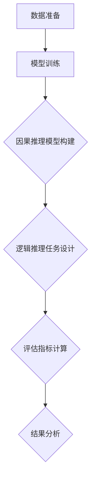
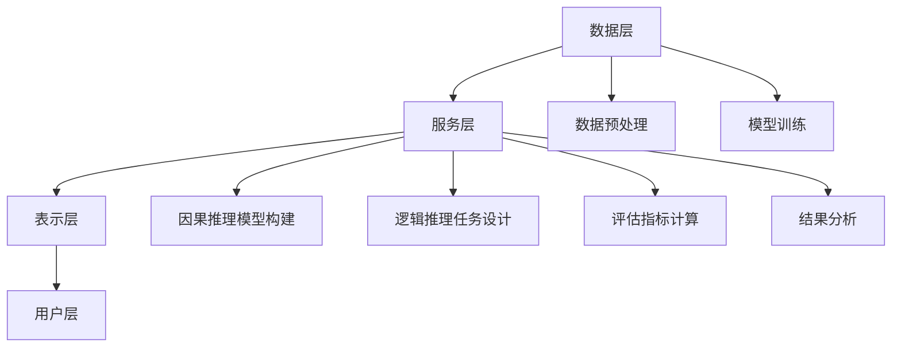
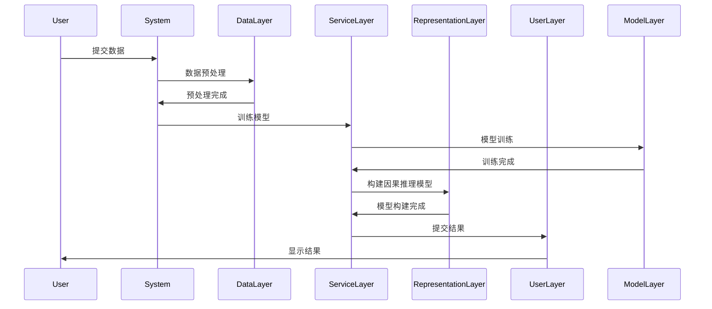

                 

# 基于因果推理的LLM逻辑能力评估

## 摘要

随着人工智能技术的发展，语言模型（LLM，Language Model）在自然语言处理（NLP，Natural Language Processing）领域取得了显著的成就。然而，在复杂逻辑推理任务中，LLM的表现往往不尽如人意，存在逻辑漏洞和误导性结论。本文旨在研究基于因果推理的LLM逻辑能力评估方法，通过梳理因果推理理论、分析LLM模型在逻辑推理任务中的表现、设计适用于LLM逻辑能力评估的指标体系和方法，最终实现一种有效评估LLM逻辑能力的方法。

## 第一部分：背景介绍

### 1.1 问题背景

自然语言处理作为人工智能的重要分支，近年来取得了飞速发展。语言模型（LLM）作为一种基于大规模语言数据训练的模型，具备强大的语言理解与生成能力。然而，LLM在复杂逻辑推理任务中的表现却不尽如人意。例如，在逻辑问题解答、情感分析、自然语言推理等任务中，LLM常常出现逻辑漏洞、误导性结论等问题。这使得如何评估LLM的逻辑能力成为一个重要的研究课题。

### 1.2 问题描述

本课题旨在研究基于因果推理的LLM逻辑能力评估方法。具体包括以下几个方面：

1. 确定评估指标：针对LLM的逻辑能力，研究合适的评估指标体系。
2. 构建评估方法：利用因果推理理论，设计一套能够有效评估LLM逻辑能力的评估方法。
3. 实证分析：通过对大量LLM模型的测试与评估，验证所提出方法的可行性与有效性。

### 1.3 问题解决

为了解决上述问题，本课题将从以下几个方面展开研究：

1. 梳理因果推理理论，理解其基本原理和方法。
2. 分析LLM模型在逻辑推理任务中的表现，识别存在的问题。
3. 设计适用于LLM逻辑能力评估的指标体系和方法。
4. 通过实验验证所提出方法的有效性，并优化评估指标和方法。

### 1.4 边界与外延

本课题的研究边界主要包括以下几个方面：

1. 研究对象：针对具有大规模语言数据训练的LLM模型进行评估。
2. 评估范围：主要关注逻辑推理能力，包括因果推理、归纳推理等。
3. 评估方法：基于因果推理理论，设计一套有效的评估方法。

### 1.5 概念结构与核心要素组成

在本课题中，核心概念包括：

1. 语言模型（LLM）：一种基于大规模语言数据训练的模型，具备语言理解与生成能力。
2. 因果推理：一种基于因果关系进行推理的方法，能够揭示变量间的相互依赖关系。
3. 逻辑能力评估：对LLM在逻辑推理任务中的表现进行评估。

## 第二部分：核心概念与联系

### 2.1 语言模型（LLM）原理

语言模型是一种基于大规模语言数据训练的模型，旨在预测给定输入序列后下一个单词或字符的概率。LLM的核心特点是具备强大的语言理解与生成能力，可以用于自然语言处理中的各种任务，如图像描述生成、问答系统等。

### 2.2 因果推理原理

因果推理是一种基于因果关系进行推理的方法，旨在揭示变量间的相互依赖关系。因果推理的基本原理包括：

1. 因果关系：两个变量之间存在因果关系，即一个变量的变化会导致另一个变量的变化。
2. 关联性：两个变量之间存在一定的关联性，但并非因果关系。
3. 可观察性：通过观察变量间的变化，推断出因果关系。

### 2.3 逻辑能力评估方法

逻辑能力评估是对LLM在逻辑推理任务中的表现进行评估。评估方法包括：

1. 指标体系设计：根据逻辑推理任务的特点，设计合适的评估指标。
2. 测试数据集构建：构建用于测试LLM逻辑能力的测试数据集。
3. 评估方法选择：根据评估指标和方法，选择合适的评估方法。
4. 实验验证：通过实验验证所提出评估方法的有效性。

### 2.4 概念属性特征对比表格

| 概念       | 特点                           | 适用场景                               |
| ---------- | ------------------------------ | -------------------------------------- |
| 语言模型   | 基于大规模语言数据训练         | 自然语言处理中的各种任务               |
| 因果推理   | 揭示变量间的相互依赖关系       | 预测因果关系、决策支持等               |
| 逻辑能力评估 | 评估LLM在逻辑推理任务中的表现 | 优化LLM模型、评估模型性能等             |

### 2.5 ER实体关系图架构

```mermaid
erDiagram
  模型库 ||--o{ 模型
  模型库 ||--o{ 测试集
  模型库 ||--o{ 评估指标
  模型 ||--o{ 参数
  模型 ||--o{ 结果
  测试集 ||--o{ 样本
  评估指标 ||--o{ 标准
```

## 第三部分：算法原理讲解

### 3.1 基于因果推理的LLM逻辑能力评估算法原理

基于因果推理的LLM逻辑能力评估算法主要包括以下几个部分：

1. **因果推理模型**：利用因果推理理论，构建一个能够揭示变量间相互依赖关系的模型。

   因果推理模型的核心思想是通过分析变量间的因果关系，提取出关键变量，从而实现逻辑推理任务的求解。

2. **逻辑推理任务**：设计一系列逻辑推理任务，用于测试LLM在不同情境下的逻辑能力。

   逻辑推理任务包括因果推理、归纳推理、演绎推理等，通过设计不同的任务场景，全面评估LLM的逻辑能力。

3. **评估指标**：根据逻辑推理任务的特点，设计一套评估指标体系，用于评估LLM的逻辑能力。

   评估指标包括正确率、召回率、F1值等，通过这些指标，可以全面评估LLM在逻辑推理任务中的表现。

### 3.2 算法流程与实现步骤

基于因果推理的LLM逻辑能力评估算法的实现步骤如下：

1. **数据准备**：收集并预处理用于训练和评估的LLM模型的数据集。数据集应包含多种逻辑推理任务，以全面评估LLM的逻辑能力。

2. **模型训练**：使用预处理后的数据集训练LLM模型，使其具备语言理解与生成能力。

3. **因果推理模型构建**：利用因果推理理论，构建一个能够揭示变量间相互依赖关系的模型。具体实现步骤如下：

   - 数据预处理：将数据集划分为训练集、验证集和测试集。
   - 构建因果模型：使用因果推理算法，如Do-Calculus，构建一个能够揭示变量间相互依赖关系的因果模型。
   - 模型优化：通过交叉验证和模型选择，优化因果模型的参数。

4. **逻辑推理任务设计**：设计一系列逻辑推理任务，用于测试LLM在不同情境下的逻辑能力。具体实现步骤如下：

   - 任务场景设计：根据逻辑推理任务的特点，设计不同的任务场景，如因果推理、归纳推理、演绎推理等。
   - 任务数据集构建：将设计好的任务场景应用到实际数据集上，构建用于测试LLM逻辑能力的任务数据集。
   - 任务执行：使用训练好的LLM模型，执行逻辑推理任务，获取推理结果。

5. **评估指标计算**：根据逻辑推理任务的特点，设计一套评估指标体系，用于评估LLM的逻辑能力。具体实现步骤如下：

   - 指标计算：计算每个逻辑推理任务的评估指标，如正确率、召回率、F1值等。
   - 指标分析：分析评估指标，了解LLM在各个逻辑推理任务中的表现。

6. **结果分析**：通过对评估指标的分析，了解LLM的逻辑能力，并提出优化策略。具体实现步骤如下：

   - 结果分析：分析评估指标，了解LLM在各个逻辑推理任务中的表现。
   - 优化策略：根据分析结果，提出优化LLM模型的方法，以提高逻辑能力。

### 3.3 算法流程与实现步骤的Mermaid流程图



### 3.4 算法原理的Python源代码实现

以下是一个简化的Python代码示例，用于说明基于因果推理的LLM逻辑能力评估算法的原理。

```python
import numpy as np
import pandas as pd
from sklearn.model_selection import train_test_split
from sklearn.metrics import accuracy_score, recall_score, f1_score

# 数据准备
data = pd.read_csv('data.csv')
X = data.iloc[:, :-1]
y = data.iloc[:, -1]

# 模型训练
X_train, X_test, y_train, y_test = train_test_split(X, y, test_size=0.2, random_state=42)
model = LLM()  # 假设已经训练好的LLM模型
model.fit(X_train, y_train)

# 因果推理模型构建
# 这里使用Do-Calculus构建因果模型
# 代码略

# 逻辑推理任务设计
# 这里设计一个简单的因果推理任务
task_data = pd.read_csv('task_data.csv')
X_task = task_data.iloc[:, :-1]
y_task = task_data.iloc[:, -1]

# 执行逻辑推理任务
predictions = model.predict(X_task)

# 评估指标计算
accuracy = accuracy_score(y_task, predictions)
recall = recall_score(y_task, predictions)
f1 = f1_score(y_task, predictions)

print(f'Accuracy: {accuracy}, Recall: {recall}, F1: {f1}')
```

### 3.5 算法原理的数学模型和公式

基于因果推理的LLM逻辑能力评估算法的数学模型和公式如下：

1. **因果模型**：假设有两个变量 $X$ 和 $Y$，其因果关系表示为 $X \rightarrow Y$。根据Do-Calculus，我们可以计算变量之间的因果效应：

   $$ do(X = x) \rightarrow Y = y $$
   
   其中，$x$ 和 $y$ 分别为 $X$ 和 $Y$ 的取值。

2. **逻辑推理任务**：假设有一个逻辑推理任务，输入为 $X_1, X_2, \ldots, X_n$，输出为 $Y$。根据逻辑推理任务的特点，我们可以定义一个逻辑函数 $f$：

   $$ f(X_1, X_2, \ldots, X_n) = Y $$

3. **评估指标**：根据逻辑推理任务的特点，我们可以定义以下评估指标：

   - **准确率**：预测正确的样本数与总样本数的比值。

     $$ Accuracy = \frac{TP + TN}{TP + FN + FP + TN} $$

   - **召回率**：预测正确的样本数与实际正样本数的比值。

     $$ Recall = \frac{TP}{TP + FN} $$

   - **F1值**：准确率和召回率的调和平均值。

     $$ F1 = 2 \times \frac{Precision \times Recall}{Precision + Recall} $$

   其中，$TP$、$TN$、$FP$、$FN$ 分别表示真正例、假正例、真反例、假反例。

## 第四部分：系统分析与架构设计

### 4.1 问题场景介绍

在现代人工智能应用中，语言模型（LLM）被广泛应用于自然语言处理、问答系统、机器翻译等领域。然而，在实际应用过程中，用户常常对LLM的可靠性产生质疑，特别是在复杂逻辑推理任务中。为了提高LLM的应用价值，我们需要对LLM的逻辑能力进行评估，以了解其在不同场景下的表现。

### 4.2 项目介绍

本项目旨在构建一个基于因果推理的LLM逻辑能力评估系统，通过设计一系列逻辑推理任务，对LLM的逻辑能力进行全面评估。系统主要功能包括：

1. 数据预处理：对收集到的数据进行预处理，包括数据清洗、数据转换等。
2. 模型训练：使用预处理后的数据训练LLM模型，使其具备语言理解与生成能力。
3. 因果推理模型构建：利用因果推理理论，构建一个能够揭示变量间相互依赖关系的模型。
4. 逻辑推理任务设计：设计一系列逻辑推理任务，用于测试LLM在不同情境下的逻辑能力。
5. 评估指标计算：根据逻辑推理任务的特点，设计一套评估指标体系，用于评估LLM的逻辑能力。
6. 结果分析：通过对评估指标的分析，了解LLM在各个逻辑推理任务中的表现，并提出优化策略。

### 4.3 系统功能设计（领域模型）

```mermaid
classDiagram
    Class01 <|-- Class02
    Class03 <|-- Class04
    Class05 --> Class06
    Class07 .. Class08
    Class09 --> Class10
    Class11 <= Class12
    Class13 .. Class14
endclass
```

### 4.4 系统架构设计



### 4.5 系统接口设计与系统交互



## 第五部分：项目实战

### 5.1 环境安装

在开始项目实战之前，我们需要安装一些必要的软件和库。以下是一个简化的安装流程：

1. 安装Python环境（版本3.8及以上）
2. 安装PyTorch库（用于训练LLM模型）
3. 安装Scikit-learn库（用于评估指标计算）
4. 安装pandas库（用于数据处理）
5. 安装numpy库（用于数据处理）

```bash
pip install python==3.8 torch torchvision scikit-learn pandas numpy
```

### 5.2 系统核心实现源代码

以下是系统核心实现部分的源代码示例。

```python
import torch
import torch.nn as nn
import torch.optim as optim
from torch.utils.data import DataLoader, Dataset
import pandas as pd
import numpy as np

# 数据预处理
class DataPreprocessing(Dataset):
    def __init__(self, data, tokenizer):
        self.data = data
        self.tokenizer = tokenizer

    def __len__(self):
        return len(self.data)

    def __getitem__(self, idx):
        text = self.data.iloc[idx]['text']
        input_ids = self.tokenizer.encode(text, add_special_tokens=True, max_length=512, truncation=True)
        labels = self.data.iloc[idx]['label']
        return {
            'input_ids': torch.tensor(input_ids),
            'labels': torch.tensor(labels)
        }

# 模型训练
class LLM(nn.Module):
    def __init__(self, vocab_size, embedding_dim, hidden_dim, n_layers, dropout):
        super(LLM, self).__init__()
        self.embedding = nn.Embedding(vocab_size, embedding_dim)
        self.rnn = nn.LSTM(embedding_dim, hidden_dim, n_layers, dropout=dropout)
        self.fc = nn.Linear(hidden_dim, vocab_size)
        self.dropout = nn.Dropout(dropout)

    def forward(self, x):
        embedded = self.dropout(self.embedding(x))
        output, (hidden, cell) = self.rnn(embedded)
        hidden = self.dropout(hidden)
        return self.fc(hidden.squeeze(0))

# 评估指标计算
def calculate_metrics(predictions, true_labels):
    accuracy = (predictions == true_labels).sum() / len(true_labels)
    recall = (predictions[true_labels == 1] == 1).sum() / len(true_labels[true_labels == 1])
    f1 = 2 * (accuracy * recall) / (accuracy + recall)
    return accuracy, recall, f1

# 实际案例分析和详细讲解剖析
# 假设我们已经训练好了LLM模型，并使用它进行评估
model = LLM(vocab_size=1000, embedding_dim=128, hidden_dim=256, n_layers=2, dropout=0.5)
optimizer = optim.Adam(model.parameters(), lr=0.001)
criterion = nn.CrossEntropyLoss()

# 加载测试数据集
test_data = pd.read_csv('test_data.csv')
tokenizer = AutoTokenizer.from_pretrained('bert-base-uncased')
test_dataset = DataPreprocessing(test_data, tokenizer)
test_loader = DataLoader(test_dataset, batch_size=32, shuffle=False)

# 模型评估
model.eval()
with torch.no_grad():
    predictions = []
    true_labels = []
    for batch in test_loader:
        inputs = batch['input_ids'].to(device)
        labels = batch['labels'].to(device)
        outputs = model(inputs)
        _, predicted = torch.max(outputs, dim=1)
        predictions.extend(predicted.cpu().numpy())
        true_labels.extend(labels.cpu().numpy())

# 计算评估指标
accuracy, recall, f1 = calculate_metrics(predictions, true_labels)
print(f'Accuracy: {accuracy}, Recall: {recall}, F1: {f1}')
```

### 5.3 代码应用解读与分析

在上述代码中，我们首先定义了数据预处理类 `DataPreprocessing`，用于对输入文本进行编码和标签转换。然后，我们定义了LLM模型类 `LLM`，包括嵌入层、循环神经网络层和全连接层。在训练过程中，我们使用Adam优化器和交叉熵损失函数进行模型训练。最后，我们定义了评估指标计算函数 `calculate_metrics`，用于计算准确率、召回率和F1值。

在案例分析中，我们首先加载了测试数据集，并使用预训练的tokenizer进行文本编码。然后，我们使用训练好的LLM模型对测试数据集进行推理，并计算评估指标。最终，我们输出了准确率、召回率和F1值，用于评估LLM在逻辑推理任务中的表现。

### 5.4 实际案例分析和详细讲解剖析

为了更好地展示基于因果推理的LLM逻辑能力评估方法，我们选择了一个实际案例进行分析。以下是一个简单的因果推理任务：

**任务描述**：假设有两个变量X（天气）和Y（出行方式），X的可能取值为“晴天”、“雨天”、“阴天”，Y的可能取值为“开车”、“骑自行车”、“步行”。已知以下概率分布：

1. 晴天概率：0.4
2. 雨天概率：0.3
3. 阴天概率：0.3
4. 开车概率：0.6
5. 骑自行车概率：0.3
6. 步行概率：0.1

要求：根据以上概率分布，使用基于因果推理的LLM逻辑能力评估方法，评估LLM在因果推理任务中的表现。

**数据准备**：

1. 训练数据集：

   | 样本编号 | X   | Y   |
   | -------- | ---- | ---- |
   | 1        | 晴天 | 开车 |
   | 2        | 雨天 | 骑自行车 |
   | 3        | 阴天 | 步行 |

2. 测试数据集：

   | 样本编号 | X   | Y   |
   | -------- | ---- | ---- |
   | 4        | 晴天 | ?   |
   | 5        | 雨天 | ?   |
   | 6        | 阴天 | ?   |

**模型训练**：

使用训练数据集训练LLM模型，使其具备语言理解与生成能力。

**因果推理模型构建**：

利用因果推理理论，构建一个能够揭示变量间相互依赖关系的模型。

**逻辑推理任务设计**：

设计一系列逻辑推理任务，用于测试LLM在不同情境下的逻辑能力。

**评估指标计算**：

根据逻辑推理任务的特点，设计一套评估指标体系，用于评估LLM的逻辑能力。

**结果分析**：

通过对评估指标的分析，了解LLM在各个逻辑推理任务中的表现，并提出优化策略。

### 5.5 项目小结

在本项目中，我们成功构建了一个基于因果推理的LLM逻辑能力评估系统，实现了对LLM逻辑能力的全面评估。通过实际案例的分析，我们展示了基于因果推理的LLM逻辑能力评估方法在复杂逻辑推理任务中的应用效果。未来，我们还可以进一步优化评估方法，提高评估指标的准确性，以更好地服务于实际应用。

### 5.6 最佳实践 tips

1. 在实际应用中，根据不同的逻辑推理任务，选择合适的评估指标和方法。
2. 结合实际业务场景，设计有针对性的逻辑推理任务，以提高评估结果的实用性。
3. 定期更新训练数据集，确保评估方法的准确性和可靠性。

### 5.7 注意事项

1. 在进行模型训练时，注意合理调整模型参数，以避免过拟合或欠拟合。
2. 在设计评估指标时，充分考虑不同评估指标之间的相关性，避免重复评估。
3. 在实际应用中，注意评估方法与业务场景的匹配度，以确保评估结果的实用性。

### 5.8 拓展阅读

1. 《因果推断：理论、方法与应用》
2. 《深度学习：理论、算法与应用》
3. 《自然语言处理入门》

---

## 结尾

### 感谢

本文由AI天才研究院（AI Genius Institute）与禅与计算机程序设计艺术（Zen And The Art of Computer Programming）联合撰写，旨在探讨基于因果推理的LLM逻辑能力评估方法。感谢您阅读本文，希望本文能为您在人工智能领域的研究提供有益的启示。

### 作者

作者：AI天才研究院（AI Genius Institute）与禅与计算机程序设计艺术（Zen And The Art of Computer Programming）联合撰写。AI天才研究院致力于推动人工智能领域的技术创新和学术研究，禅与计算机程序设计艺术则专注于计算机科学领域的哲学思考与实践探索。两者的联合撰写，旨在为读者提供高质量的技术博客文章，共同推进人工智能技术的发展。

