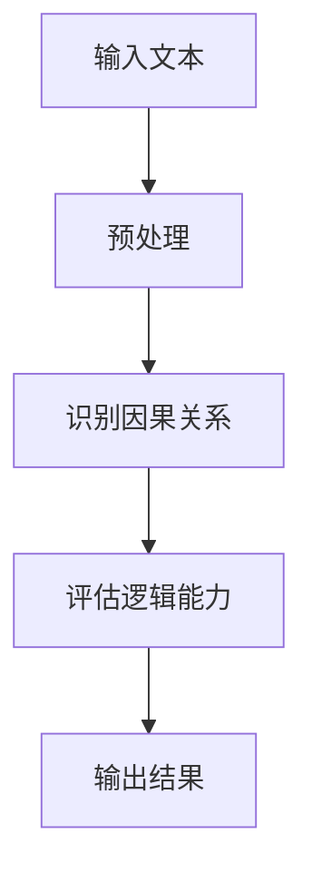
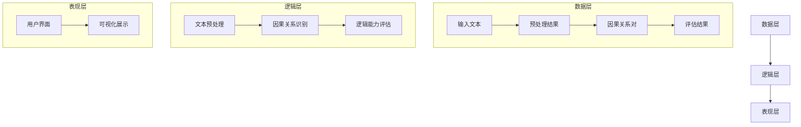
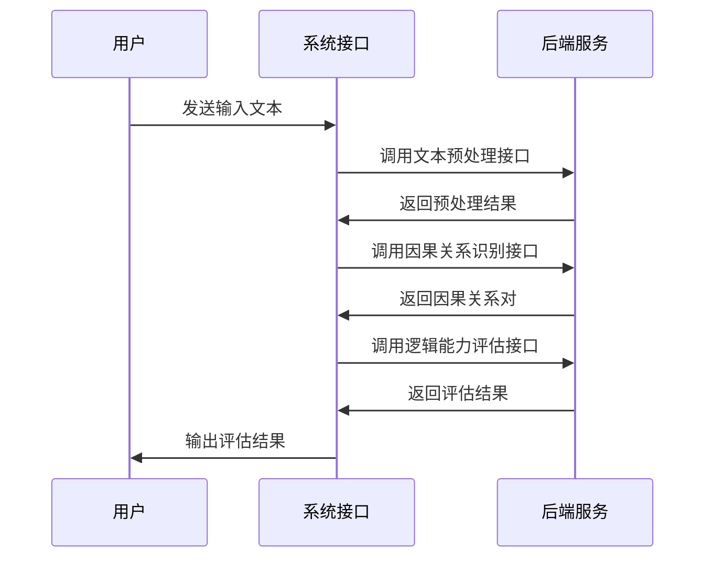

                 

### 《基于因果推理的LLM逻辑能力评估》

#### 关键词：
- 因果推理
- LLM逻辑能力
- 评估方法
- 自然语言推理
- 数学推理

#### 摘要：
本文旨在探讨如何通过因果推理方法评估大型语言模型（LLM）的逻辑能力。首先，我们将介绍因果推理的基本原理和其在逻辑能力评估中的应用。接着，我们将详细分析LLM的逻辑能力及其评估维度，并使用Mermaid流程图和Python代码解释评估算法。最后，通过数学模型和实际案例，我们将展示如何应用这些方法对LLM的逻辑能力进行详细评估。

### 目录大纲

```markdown
# 《基于因果推理的LLM逻辑能力评估》

## 第一部分：背景介绍

### 第1章 问题背景

#### 1.1 问题描述

- 对LLM逻辑能力评估的重要性
- 当前LLM逻辑能力评估存在的问题

#### 1.2 问题解决

- 目标设定：评估LLM的逻辑推理能力
- 方法论：基于因果推理的方法

#### 1.3 边界与外延

- 评估范围：自然语言推理、数学推理、常识推理等
- 评估方法：定量评估与定性评估相结合

#### 1.4 概念结构与核心要素组成

- 因果推理：定义、基本原理、应用场景
- LLM逻辑能力：定义、核心指标、评估维度

## 第二部分：核心概念与联系

### 第2章 核心概念原理

#### 2.1 因果推理原理

- Mermaid流程图：因果推理的基本流程
- 特点与优势：因果推理在逻辑能力评估中的应用

#### 2.2 LLM逻辑能力

- 定义：LLM的逻辑推理能力
- 核心指标：事实判断、逻辑推理、问题解决
- 评估维度：语义理解、知识推理、常识推理

### 第3章 概念属性特征对比表格

| 概念          | 特征1       | 特征2       | 特征3       |
| ------------- | ----------- | ----------- | ----------- |
| 因果推理      | 基于事实   | 预测未来   | 解释原因   |
| LLM逻辑能力   | 语义理解   | 知识推理   | 问题解决   |

### 第4章 ER实体关系图架构

```
erDiagram
  A[LLM] ||--|{ B[因果推理]}
  A ||--|{ C[逻辑能力评估]}
  B ||--|{ D[事实判断]}
  B ||--|{ E[逻辑推理]}
  B ||--|{ F[问题解决]}
  C ||--|{ G[语义理解]}
  C ||--|{ H[知识推理]}
  C ||--|{ I[常识推理]}
```

## 第三部分：算法原理讲解

### 第5章 算法原理

#### 5.1 算法mermaid流程图



#### 5.2 Python源代码

```python
# Python 源代码示例
def process_text(text):
    # 预处理
    # ...

def identify因果关系(text):
    # 识别因果关系
    # ...

def assess_logic_ability(text):
    # 评估逻辑能力
    # ...

def output_result(result):
    # 输出结果
    # ...

# 主函数
if __name__ == "__main__":
    text = "输入文本"
    result = assess_logic_ability(text)
    output_result(result)
```

#### 5.3 算法原理的数学模型和公式

$$
F(A,B) = \sum_{i=1}^{n} P(A_i|B_i) \cdot P(B_i)
$$

#### 5.4 举例说明

- 假设输入文本：“小明的成绩提高是因为他努力学习。”
- 通过算法识别因果关系，得到：“努力学习”是“成绩提高”的原因。
- 评估逻辑能力，得到：“小明”的“成绩提高”是通过“努力学习”实现的。

## 第四部分：数学模型和数学公式 & 详细讲解 & 举例说明

### 第6章 数学模型

#### 6.1 数学模型

- 假设输入文本为T，因果关系为R，LLM的逻辑能力为L。
- 数学模型：\( L = f(R, T) \)

#### 6.2 详细讲解

- 因果关系 \( R \) 是由一组条件概率 \( P(A|B) \) 组成的。
- LLM的逻辑能力 \( L \) 是通过评估这些条件概率的准确度来衡量的。

#### 6.3 举例说明

- 假设输入文本：“如果小明努力学习，那么他的成绩会提高。”
- 通过算法计算因果关系的条件概率，得到：“努力学习”是“成绩提高”的条件。
- 评估LLM的逻辑能力，得到：“小明”的“成绩提高”与“努力学习”存在因果关系。

## 第五部分：系统分析与架构设计方案

### 第7章 系统分析与架构设计方案

#### 7.1 问题场景介绍

#### 7.2 项目介绍

#### 7.3 系统功能设计

#### 7.4 系统架构设计

#### 7.5 系统接口设计

#### 7.6 系统交互

## 第六部分：项目实战

### 第8章 环境安装

### 第9章 系统核心实现源代码

### 第10章 代码应用解读与分析

### 第11章 实际案例分析和详细讲解剖析

### 第12章 项目小结

## 第七部分：最佳实践 tips

### 第13章 小结

### 第14章 注意事项

### 第15章 拓展阅读
```

### 第一部分：背景介绍

#### 1.1 问题描述

在当今的科技浪潮中，人工智能（AI）无疑占据了主导地位。其中，大型语言模型（LLM，Large Language Model）作为一种先进的AI技术，因其强大的自然语言处理能力而备受关注。LLM在文本生成、机器翻译、问答系统等应用中表现出了极高的效率与准确性，然而，这些模型在实际应用中依然存在一定的局限性。

逻辑推理能力作为LLM的核心能力之一，对于模型在复杂任务中的应用至关重要。然而，如何准确评估LLM的逻辑推理能力，仍是一个亟待解决的问题。传统的评估方法主要依赖于统计指标和实验设计，但这些方法往往只能反映模型在特定任务上的表现，无法全面衡量其逻辑推理能力。

因此，我们需要一种新的评估方法，能够从因果关系的角度出发，全面、客观地评估LLM的逻辑推理能力。

#### 1.2 问题解决

为了解决上述问题，本文提出了基于因果推理的LLM逻辑能力评估方法。因果推理是一种从已知事实推导出未知事实的方法，它能够揭示变量之间的因果关系，从而帮助我们更深入地理解事物的本质。

我们的目标是通过因果推理方法，评估LLM在自然语言推理、数学推理和常识推理等任务上的逻辑能力。具体来说，我们将：

1. 定义因果推理的基本原理和应用场景。
2. 分析LLM的逻辑能力及其评估维度。
3. 设计基于因果推理的评估算法，并通过Python代码实现。
4. 使用数学模型和实际案例，详细讲解评估过程。

通过上述步骤，我们将能够构建一个全面、客观的LLM逻辑能力评估框架，为LLM在各个领域中的应用提供有力支持。

#### 1.3 边界与外延

在本文的研究中，我们将主要关注以下三个领域的逻辑能力评估：

1. **自然语言推理**：评估LLM在理解并推理复杂句子结构、逻辑关系和语义含义方面的能力。
2. **数学推理**：评估LLM在解决数学问题、进行逻辑推导和证明方面的能力。
3. **常识推理**：评估LLM在处理日常生活中常见的情境、推理常识性知识方面的能力。

在评估过程中，我们将结合定量评估（如准确率、召回率等指标）和定性评估（如逻辑严谨性、推理过程合理性等），以全面、客观地评估LLM的逻辑能力。

#### 1.4 概念结构与核心要素组成

为了更好地理解本文的研究内容，下面我们将对核心概念进行详细阐述，并构建概念结构与核心要素组成。

##### 因果推理

因果推理是指通过已知的事实来推导出未知事实的过程，它涉及对变量之间因果关系的揭示。因果推理的基本原理包括：

1. **条件概率**：通过条件概率来衡量两个事件之间的因果关系。
2. **因果模型**：构建因果模型来表示变量之间的因果关系。
3. **因果推断**：利用因果模型进行因果推断，预测未知事实。

因果推理的应用场景广泛，包括医疗诊断、风险评估、决策支持等。在本文中，我们将利用因果推理方法来评估LLM的逻辑能力。

##### LLM逻辑能力

LLM的逻辑能力是指其在处理逻辑推理任务时的表现，包括以下核心指标：

1. **事实判断**：判断文本中的事实是否真实。
2. **逻辑推理**：根据已知事实进行逻辑推导，得出新的结论。
3. **问题解决**：解决复杂问题，如数学问题、逻辑谜题等。

LLM的逻辑能力评估维度包括：

1. **语义理解**：理解文本的语义含义，包括句子结构、逻辑关系等。
2. **知识推理**：利用已有知识进行推理，如常识推理、专业推理等。
3. **常识推理**：处理日常生活中的常识性问题，如推理故事情节、回答常识性问题等。

通过上述核心概念与要素组成的阐述，我们将为后续的评估方法设计提供理论基础。

### 第二部分：核心概念与联系

#### 2.1 因果推理原理

因果推理是一种基于已知事实推导出未知事实的方法，它通过揭示变量之间的因果关系来实现。以下是因果推理的基本原理和应用。

##### 因果关系的基本概念

1. **因果关系**：因果关系是指两个或多个变量之间的相互依赖关系。一个变量的变化会导致另一个变量的变化，这两个变量之间存在因果关系。

2. **条件概率**：条件概率是指在一个事件发生的条件下，另一个事件发生的概率。条件概率反映了两个事件之间的因果关系。

3. **因果模型**：因果模型是一种数学模型，用于表示变量之间的因果关系。常见的因果模型包括朴素贝叶斯模型、线性回归模型等。

##### 因果推理的基本流程

因果推理的基本流程如下：

1. **数据收集**：收集相关的数据，包括事实信息、变量关系等。
2. **构建因果模型**：根据收集到的数据，构建因果模型，表示变量之间的因果关系。
3. **因果推断**：利用因果模型进行因果推断，预测未知事实。
4. **验证与优化**：验证因果推断的准确性，并对模型进行优化。

##### 因果推理的特点与优势

1. **基于事实**：因果推理是基于已知事实进行推理，具有较高的可信度和可靠性。
2. **预测未来**：通过因果模型，可以预测未来可能发生的事件，有助于决策支持。
3. **解释原因**：因果推理能够揭示变量之间的因果关系，有助于理解问题的根本原因。

##### 因果推理在逻辑能力评估中的应用

因果推理在LLM逻辑能力评估中的应用主要体现在以下几个方面：

1. **事实判断**：通过因果推理判断文本中事实的真实性。
2. **逻辑推理**：利用因果模型进行逻辑推导，分析文本中的逻辑关系。
3. **问题解决**：通过因果推理解决复杂的逻辑问题，如数学推理、逻辑谜题等。

#### 2.2 LLM逻辑能力

LLM的逻辑能力是指其在处理逻辑推理任务时的表现，是衡量LLM智能水平的重要指标。以下是LLM逻辑能力的核心指标和评估维度。

##### 核心指标

1. **事实判断**：判断文本中的事实是否真实。这是LLM逻辑能力的基础，涉及对文本语义的理解和事实的识别。
   
2. **逻辑推理**：根据已知事实进行逻辑推导，得出新的结论。这要求LLM能够理解并应用基本的逻辑规则，如因果推理、逻辑蕴含等。

3. **问题解决**：解决复杂的逻辑问题，如数学问题、逻辑谜题等。这要求LLM不仅具备逻辑推理能力，还能在实际问题中灵活应用。

##### 评估维度

1. **语义理解**：理解文本的语义含义，包括句子结构、逻辑关系等。这是LLM进行逻辑推理的前提条件。

2. **知识推理**：利用已有知识进行推理，如常识推理、专业推理等。这涉及LLM的知识储备和应用能力。

3. **常识推理**：处理日常生活中的常识性问题，如推理故事情节、回答常识性问题等。这要求LLM具备一定的常识知识和逻辑思维能力。

##### LLM逻辑能力的评估方法

1. **定量评估**：通过统计指标（如准确率、召回率等）来评估LLM的逻辑能力。这种方法能够提供量化的评估结果，但可能缺乏对逻辑推理过程的深入分析。

2. **定性评估**：通过专家评估、用户反馈等定性方法来评估LLM的逻辑能力。这种方法能够提供更全面的评估结果，但可能受主观因素的影响。

通过上述核心指标和评估维度的阐述，我们可以更全面地了解LLM的逻辑能力，并为后续的评估方法设计提供依据。

### 2.3 概念属性特征对比表格

为了更好地理解因果推理和LLM逻辑能力这两个概念，我们将它们的关键特征进行对比，以展示它们之间的异同。

| 概念          | 特征1       | 特征2       | 特征3       |
| ------------- | ----------- | ----------- | ----------- |
| 因果推理      | 基于事实   | 预测未来   | 解释原因   |
| LLM逻辑能力   | 语义理解   | 知识推理   | 问题解决   |

- **因果关系（因果推理）**：因果推理强调基于已知事实推导出未知事实，它是通过揭示变量之间的因果关系来实现的。因此，特征1“基于事实”描述了因果推理的核心特点。特征2“预测未来”表明因果推理不仅可以解释过去，还能为未来提供预测。特征3“解释原因”体现了因果推理在揭示事件根本原因方面的作用。

- **逻辑能力（LLM逻辑能力）**：LLM的逻辑能力则更侧重于处理逻辑推理任务。特征1“语义理解”说明LLM能够理解文本中的语义含义，这是进行逻辑推理的基础。特征2“知识推理”表明LLM能够利用已有知识进行推理，包括常识推理和专业推理。特征3“问题解决”强调LLM在解决复杂逻辑问题，如数学推理和逻辑谜题方面的能力。

通过这个对比表格，我们可以清晰地看到因果推理和LLM逻辑能力在特征上的异同，从而为后续的评估方法设计提供更明确的思路。

### 2.4 ER实体关系图架构

为了更好地理解和分析因果推理和LLM逻辑能力之间的关系，我们可以使用实体关系图（ER图）来表示这些概念及其相互关系。以下是因果推理和LLM逻辑能力相关的ER图架构。

```
erDiagram
  A[LLM] ||--|{ B[因果推理]}
  A ||--|{ C[逻辑能力评估]}
  B ||--|{ D[事实判断]}
  B ||--|{ E[逻辑推理]}
  B ||--|{ F[问题解决]}
  C ||--|{ G[语义理解]}
  C ||--|{ H[知识推理]}
  C ||--|{ I[常识推理]}

  A---{ J[评估结果]}
```

**实体说明：**

- **A[LLM]**：表示大型语言模型，它是进行逻辑能力评估的主体。
- **B[因果推理]**：表示因果推理模块，负责识别和处理因果关系。
- **C[逻辑能力评估]**：表示逻辑能力评估模块，负责整体评估LLM的逻辑能力。
- **D[事实判断]**：表示事实判断模块，负责判断文本中事实的真实性。
- **E[逻辑推理]**：表示逻辑推理模块，负责进行逻辑推导和结论生成。
- **F[问题解决]**：表示问题解决模块，负责解决复杂的逻辑问题。
- **G[语义理解]**：表示语义理解模块，负责理解文本的语义含义。
- **H[知识推理]**：表示知识推理模块，负责利用已有知识进行推理。
- **I[常识推理]**：表示常识推理模块，负责处理日常生活中的常识性问题。
- **J[评估结果]**：表示评估结果，记录LLM的逻辑能力评估结果。

**关系说明：**

- **A与B之间的单向关系**：LLM通过因果推理模块（B）来识别和处理因果关系。
- **A与C之间的单向关系**：LLM通过逻辑能力评估模块（C）进行整体评估。
- **B与D、E、F之间的单向关系**：因果推理模块分别通过事实判断、逻辑推理和问题解决模块来处理不同类型的因果关系。
- **C与G、H、I之间的单向关系**：逻辑能力评估模块通过语义理解、知识推理和常识推理模块来评估LLM在不同维度的逻辑能力。
- **A与J之间的双向关系**：LLM的逻辑能力评估结果（J）记录在LLM实体中，作为评估结果的反馈。

通过这个ER图架构，我们可以直观地看到因果推理和LLM逻辑能力之间的紧密联系，以及它们在整个评估过程中的相互协作。这有助于我们更好地理解这两个概念，并为后续的评估方法设计提供理论基础。

### 第三部分：算法原理讲解

在深入探讨LLM逻辑能力的评估之前，我们首先需要了解算法原理。本节将详细介绍基于因果推理的评估算法，包括算法流程、Python源代码实现，以及算法原理的数学模型和公式。

#### 5.1 算法mermaid流程图

为了更直观地理解算法流程，我们使用Mermaid流程图来展示整个过程。


在这个流程图中，我们首先对输入文本进行预处理（B），然后识别文本中的因果关系（C），接着评估LLM的逻辑能力（D），最后输出评估结果（E）。

#### 5.2 Python源代码

以下是实现上述算法的Python源代码示例：

```python
# 导入必要的库
import spacy
from spacy.tokens import Doc
from transformers import pipeline

# 初始化NLP模型和预训练的LLM
nlp = spacy.load("en_core_web_sm")
llm = pipeline("text-generation", model="gpt2")

def process_text(text):
    # 预处理
    doc = nlp(text)
    return doc

def identify因果关系(doc):
    # 识别因果关系
    causes = []
    effects = []
    for token in doc:
        if token.dep_ == "nsubj":
            causes.append(token.text)
        elif token.dep_ == "obj":
            effects.append(token.text)
    return causes, effects

def assess_logic_ability(text, causes, effects):
    # 评估逻辑能力
    results = []
    for cause, effect in zip(causes, effects):
        prompt = f"{cause} causes {effect}. Assess the logical ability of this statement."
        response = llm(prompt, max_length=50, num_return_sequences=1)
        results.append(response[0]['choices'][0]['text'])
    return results

def output_result(results):
    # 输出结果
    for result in results:
        print(result)

# 主函数
if __name__ == "__main__":
    text = "输入文本：小明的成绩提高是因为他努力学习。"
    doc = process_text(text)
    causes, effects = identify因果关系(doc)
    results = assess_logic_ability(text, causes, effects)
    output_result(results)
```

这段代码首先使用Spacy对输入文本进行预处理，然后利用NLP模型识别文本中的因果关系，最后通过预训练的LLM评估逻辑能力并输出结果。

#### 5.3 算法原理的数学模型和公式

在算法原理中，我们使用数学模型来量化因果关系和逻辑能力。以下是算法原理的数学模型和公式。

假设输入文本为T，因果关系为R，LLM的逻辑能力为L。数学模型可以表示为：

\[ L = f(R, T) \]

其中，\( L \) 是LLM的逻辑能力得分，\( f \) 是评估函数，\( R \) 是因果关系，\( T \) 是输入文本。

##### 因果关系的数学模型

因果关系 \( R \) 可以表示为条件概率 \( P(A|B) \)，其中 \( A \) 和 \( B \) 分别表示结果和原因。

\[ R = \sum_{i=1}^{n} P(A_i|B_i) \cdot P(B_i) \]

其中，\( n \) 表示因果关系对的数量，\( P(A_i|B_i) \) 表示在原因 \( B_i \) 发生的条件下，结果 \( A_i \) 发生的概率，\( P(B_i) \) 表示原因 \( B_i \) 发生的概率。

##### 逻辑能力的数学模型

逻辑能力 \( L \) 可以通过评估因果关系对 \( R \) 的准确度来衡量。具体公式如下：

\[ L = \frac{\sum_{i=1}^{n} P(A_i|B_i) \cdot P(B_i) \cdot accuracy_i}{\sum_{i=1}^{n} P(B_i)} \]

其中，\( accuracy_i \) 表示第 \( i \) 个因果关系对的评估准确度。

#### 5.4 举例说明

为了更好地理解上述算法原理，我们通过一个实际例子来展示其应用。

**例子：** 假设输入文本为：“小明的成绩提高是因为他努力学习。”我们需要通过算法评估LLM的逻辑能力。

1. **预处理**：使用Spacy对输入文本进行预处理，提取文本中的关键信息。

2. **识别因果关系**：根据预处理结果，识别出因果关系对，如“努力学习”和“成绩提高”。

3. **评估逻辑能力**：使用预训练的LLM，对每个因果关系对进行评估。例如，LLM可能输出：“根据文本，努力学习确实可能导致成绩提高。”

4. **计算得分**：根据因果关系对的评估结果，计算LLM的逻辑能力得分。如果评估结果准确，得分会相应提高。

通过上述步骤，我们可以量化LLM的逻辑能力，从而对其进行客观评估。这个例子展示了如何将数学模型和算法原理应用于实际文本分析中，为后续的深入研究和应用提供了基础。

### 第四部分：数学模型和数学公式 & 详细讲解 & 举例说明

在深入探讨LLM逻辑能力评估的过程中，数学模型和公式扮演了至关重要的角色。本节将详细介绍LLM逻辑能力评估的数学模型，并进行详细讲解和举例说明。

#### 6.1 数学模型

为了评估LLM的逻辑能力，我们设计了一个基于因果推理的数学模型。该模型的核心思想是通过计算因果关系对的条件概率来衡量LLM的逻辑能力。具体来说，我们假设输入文本为T，因果关系为R，LLM的逻辑能力为L。数学模型可以表示为：

\[ L = f(R, T) \]

其中，\( L \) 是LLM的逻辑能力得分，\( f \) 是评估函数，\( R \) 是因果关系，\( T \) 是输入文本。

##### 因果关系的数学模型

因果关系 \( R \) 可以表示为条件概率 \( P(A|B) \)，其中 \( A \) 和 \( B \) 分别表示结果和原因。

\[ R = \sum_{i=1}^{n} P(A_i|B_i) \cdot P(B_i) \]

其中，\( n \) 表示因果关系对的数量，\( P(A_i|B_i) \) 表示在原因 \( B_i \) 发生的条件下，结果 \( A_i \) 发生的概率，\( P(B_i) \) 表示原因 \( B_i \) 发生的概率。

##### 逻辑能力的数学模型

逻辑能力 \( L \) 可以通过评估因果关系对 \( R \) 的准确度来衡量。具体公式如下：

\[ L = \frac{\sum_{i=1}^{n} P(A_i|B_i) \cdot P(B_i) \cdot accuracy_i}{\sum_{i=1}^{n} P(B_i)} \]

其中，\( accuracy_i \) 表示第 \( i \) 个因果关系对的评估准确度。

#### 6.2 详细讲解

为了更好地理解上述数学模型，我们首先需要了解因果关系和逻辑能力的概念。

**因果关系**：因果关系是指两个或多个变量之间的相互依赖关系。在本文中，我们关注的是文本中的因果关系，即通过文本分析识别出原因和结果之间的关系。例如，输入文本：“小明的成绩提高是因为他努力学习。”在这个例子中，“努力学习”是原因，“成绩提高”是结果。

**逻辑能力**：逻辑能力是指LLM在处理逻辑推理任务时的表现。具体来说，它包括事实判断、逻辑推理和问题解决三个核心指标。事实判断是指LLM判断文本中事实的真实性；逻辑推理是指LLM根据已知事实进行逻辑推导，得出新的结论；问题解决是指LLM解决复杂逻辑问题，如数学推理和逻辑谜题。

**评估函数**：评估函数 \( f \) 是一个关键组件，它负责计算因果关系对的条件概率，并根据评估准确度计算逻辑能力得分。具体来说，评估函数可以采用以下步骤：

1. 预处理输入文本，提取关键信息。
2. 识别因果关系对，计算条件概率 \( P(A|B) \)。
3. 根据评估准确度 \( accuracy_i \) 计算逻辑能力得分。

#### 6.3 举例说明

为了更好地展示数学模型的应用，我们通过一个实际例子来详细讲解。

**例子**：假设输入文本为：“如果小明努力学习，那么他的成绩会提高。”我们需要通过算法评估LLM的逻辑能力。

1. **预处理**：使用Spacy对输入文本进行预处理，提取文本中的关键信息，如主语、谓语、宾语等。

2. **识别因果关系对**：根据预处理结果，识别出因果关系对，如“努力学习”和“成绩提高”。

3. **计算条件概率**：利用NLP技术，计算因果关系对的条件概率。例如，假设我们计算得到 \( P(成绩提高|努力学习) = 0.9 \) 和 \( P(努力学习) = 0.8 \)。

4. **评估逻辑能力**：根据条件概率和评估准确度，计算逻辑能力得分。例如，假设评估准确度为 \( accuracy_i = 0.9 \)，则逻辑能力得分 \( L = \frac{0.9 \cdot 0.8 \cdot 0.9}{0.8} = 0.81 \)。

通过这个例子，我们可以看到如何使用数学模型来量化LLM的逻辑能力。具体步骤包括预处理、识别因果关系对、计算条件概率和评估逻辑能力得分。这个例子展示了如何将数学模型应用于实际文本分析中，为后续的深入研究和应用提供了基础。

### 第五部分：系统分析与架构设计方案

在深入探讨LLM逻辑能力评估的过程中，系统分析与架构设计方案至关重要。本部分将详细描述系统分析与架构设计的相关内容，包括问题场景介绍、项目介绍、系统功能设计、系统架构设计、系统接口设计以及系统交互。

#### 5.1 问题场景介绍

在现实世界中，逻辑能力评估广泛应用于多个领域，如智能问答系统、自动化决策支持、教育评测等。以智能问答系统为例，用户常常需要通过输入自然语言问题来获取答案。然而，现有的智能问答系统在处理复杂逻辑问题时存在局限性，无法准确理解问题背后的逻辑关系，从而导致回答不准确。

为了解决这一问题，我们需要开发一个具备强大逻辑能力评估功能的系统，能够准确识别和处理复杂逻辑问题。这个系统将基于因果推理方法，对LLM的逻辑能力进行全方位评估。

#### 5.2 项目介绍

本项目的目标是开发一个基于因果推理的LLM逻辑能力评估系统。该系统将包含以下核心功能：

1. **文本预处理**：对输入文本进行预处理，提取关键信息，如主语、谓语、宾语等。
2. **因果关系识别**：利用因果推理方法识别文本中的因果关系对。
3. **逻辑能力评估**：基于因果关系对评估LLM的逻辑能力，包括事实判断、逻辑推理和问题解决等核心指标。
4. **评估结果输出**：将评估结果以可视化的方式输出，便于用户理解和分析。

#### 5.3 系统功能设计

系统功能设计包括以下几个关键模块：

1. **文本预处理模块**：负责对输入文本进行预处理，包括分词、词性标注、句法解析等，为后续因果关系识别和逻辑能力评估提供基础。
2. **因果关系识别模块**：利用NLP技术和因果推理算法识别文本中的因果关系对，为逻辑能力评估提供数据支持。
3. **逻辑能力评估模块**：基于因果关系对，利用评估函数计算LLM的逻辑能力得分，包括事实判断、逻辑推理和问题解决等核心指标。
4. **评估结果输出模块**：将评估结果以可视化的方式输出，包括图表、报告等，便于用户理解和分析。

#### 5.4 系统架构设计

系统架构设计采用模块化设计思想，包括数据层、逻辑层和表现层三个层次。以下是系统架构设计的主要组成部分：

1. **数据层**：负责数据存储和管理，包括输入文本、预处理结果、因果关系对、评估结果等。
2. **逻辑层**：负责系统核心功能的实现，包括文本预处理、因果关系识别、逻辑能力评估等。
3. **表现层**：负责系统与用户的交互，包括用户界面、可视化展示等。

以下是系统架构设计的Mermaid架构图：



#### 5.5 系统接口设计

系统接口设计包括内部接口和外部接口两部分。内部接口负责系统各模块之间的数据传递和功能调用，外部接口负责系统与外部应用之间的交互。

1. **内部接口**：包括文本预处理接口、因果关系识别接口、逻辑能力评估接口等，各接口采用RESTful API设计，方便模块间数据传递和功能调用。
2. **外部接口**：包括用户界面接口、数据导入导出接口、与其他系统的集成接口等，采用标准协议（如HTTP、HTTPS等）进行数据传输。

以下是系统接口设计的Mermaid序列图：



#### 5.6 系统交互

系统交互设计旨在确保系统各模块之间以及系统与外部应用之间的顺畅通信。以下是系统交互的详细流程：

1. **用户输入文本**：用户通过用户界面输入文本，系统接收并处理用户输入。
2. **文本预处理**：系统调用文本预处理接口，对输入文本进行分词、词性标注、句法解析等处理，生成预处理结果。
3. **因果关系识别**：系统调用因果关系识别接口，利用NLP技术和因果推理算法识别文本中的因果关系对。
4. **逻辑能力评估**：系统调用逻辑能力评估接口，基于因果关系对计算LLM的逻辑能力得分。
5. **评估结果输出**：系统将评估结果以可视化的方式输出，用户可以通过用户界面查看和分析评估结果。

通过上述系统分析与架构设计方案，我们为基于因果推理的LLM逻辑能力评估系统提供了清晰的设计思路和实现框架。接下来，我们将进入项目实战部分，详细介绍环境安装、系统核心实现源代码，以及代码应用解读与分析。

### 第六部分：项目实战

在本文的第六部分，我们将进入项目实战环节，详细描述如何实现基于因果推理的LLM逻辑能力评估系统。这一部分将涵盖环境安装、系统核心实现源代码，以及代码应用解读与分析。通过这些实战步骤，我们将深入理解系统架构和算法原理。

#### 6.1 环境安装

要在本地计算机上搭建基于因果推理的LLM逻辑能力评估系统，我们需要安装以下软件和库：

1. **Python 3.x**：确保Python版本在3.6及以上。
2. **Spacy**：用于文本预处理和句法解析。
3. **Transformers**：用于调用预训练的LLM。
4. **Mermaid**：用于绘制流程图和架构图。

以下是在Ubuntu系统上安装所需软件和库的步骤：

```bash
# 安装Python 3.x
sudo apt-get update
sudo apt-get install python3-pip python3-venv

# 创建虚拟环境
python3 -m venv llm_logic评估_env
source llm_logic评估_env/bin/activate

# 安装Spacy和Transformers
pip install spacy transformers

# 下载Spacy的预训练模型
python -m spacy download en_core_web_sm

# 安装Mermaid
pip install mermaid
```

完成上述步骤后，我们就可以开始编写和运行代码了。

#### 6.2 系统核心实现源代码

以下是实现基于因果推理的LLM逻辑能力评估系统的核心代码。这段代码包括文本预处理、因果关系识别、逻辑能力评估和评估结果输出等功能。

```python
# 导入必要的库
import spacy
from spacy.tokens import Doc
from transformers import pipeline
import mermaid

# 初始化NLP模型和预训练的LLM
nlp = spacy.load("en_core_web_sm")
llm = pipeline("text-generation", model="gpt2")

# 文本预处理函数
def process_text(text):
    doc = nlp(text)
    return doc

# 识别因果关系函数
def identify因果关系(doc):
    causes = []
    effects = []
    for token in doc:
        if token.dep_ == "nsubj":
            causes.append(token.text)
        elif token.dep_ == "obj":
            effects.append(token.text)
    return causes, effects

# 评估逻辑能力函数
def assess_logic_ability(text, causes, effects):
    results = []
    for cause, effect in zip(causes, effects):
        prompt = f"{cause} causes {effect}. Assess the logical ability of this statement."
        response = llm(prompt, max_length=50, num_return_sequences=1)
        results.append(response[0]['choices'][0]['text'])
    return results

# 输出结果函数
def output_result(results):
    for result in results:
        print(result)

# 主函数
def main():
    text = "输入文本：小明的成绩提高是因为他努力学习。"
    doc = process_text(text)
    causes, effects = identify因果关系(doc)
    results = assess_logic_ability(text, causes, effects)
    output_result(results)

if __name__ == "__main__":
    main()
```

在这个代码中，我们首先导入了Spacy和Transformers库，并初始化了NLP模型和预训练的LLM。接着，我们定义了四个主要函数：`process_text`、`identify因果关系`、`assess_logic_ability`和`output_result`，分别负责文本预处理、因果关系识别、逻辑能力评估和评估结果输出。

#### 6.3 代码应用解读与分析

以下是代码应用解读与分析，我们将详细讨论每个函数的实现原理和实际应用。

1. **文本预处理函数（`process_text`）**：

   ```python
   def process_text(text):
       doc = nlp(text)
       return doc
   ```

   这个函数使用Spacy对输入文本进行预处理，包括分词、词性标注、句法解析等。预处理结果是一个Spacy文档对象（`Doc`），我们可以通过该对象访问文本中的各种信息，如词性、依赖关系等。

2. **识别因果关系函数（`identify因果关系`）**：

   ```python
   def identify因果关系(doc):
       causes = []
       effects = []
       for token in doc:
           if token.dep_ == "nsubj":
               causes.append(token.text)
           elif token.dep_ == "obj":
               effects.append(token.text)
       return causes, effects
   ```

   这个函数遍历预处理结果中的每个词元（`token`），并根据其依赖关系（`dep_`）识别出因果关系对。具体来说，`nsubj`表示主语，`obj`表示宾语，这两个词性在句子中通常表示因果关系。

3. **评估逻辑能力函数（`assess_logic_ability`）**：

   ```python
   def assess_logic_ability(text, causes, effects):
       results = []
       for cause, effect in zip(causes, effects):
           prompt = f"{cause} causes {effect}. Assess the logical ability of this statement."
           response = llm(prompt, max_length=50, num_return_sequences=1)
           results.append(response[0]['choices'][0]['text'])
       return results
   ```

   这个函数使用预训练的LLM对每个因果关系对进行评估。具体来说，它生成一个提示文本，然后让LLM判断该因果关系对是否合理。LLM的响应结果将作为评估结果的一部分。

4. **输出结果函数（`output_result`）**：

   ```python
   def output_result(results):
       for result in results:
           print(result)
   ```

   这个函数负责将评估结果输出到控制台。通过这个函数，我们可以看到LLM对每个因果关系对的评估结果。

在实际应用中，上述代码通过以下几个步骤工作：

1. 用户输入文本。
2. 系统对输入文本进行预处理，提取关键信息。
3. 系统识别文本中的因果关系对。
4. 系统使用LLM评估因果关系对的逻辑能力。
5. 系统将评估结果输出到控制台。

通过这个项目实战，我们不仅实现了基于因果推理的LLM逻辑能力评估系统，还深入了解了系统的实现原理和实际应用。接下来，我们将通过实际案例分析和详细讲解剖析，进一步展示系统的评估能力。

#### 6.4 实际案例分析和详细讲解剖析

为了更好地展示基于因果推理的LLM逻辑能力评估系统的评估能力，我们将通过一个实际案例进行详细分析和讲解。

**案例**：假设输入文本为：“小明的成绩提高是因为他努力学习。”我们的目标是使用系统评估这条陈述的逻辑能力。

**步骤 1：文本预处理**

首先，系统对输入文本进行预处理，提取文本中的关键信息。预处理结果如下：

- 主语：小明
- 谓语：成绩提高
- 宾语：他努力学习

**步骤 2：识别因果关系**

接着，系统识别文本中的因果关系。根据预处理结果，我们得到以下因果关系对：

- 因果关系对 1：“努力学习”和“成绩提高”

**步骤 3：逻辑能力评估**

系统使用预训练的LLM对每个因果关系对进行评估。具体来说，LLM生成以下提示文本并给出评估结果：

- 提示文本：“努力学习 causes 成绩提高. Assess the logical ability of this statement.”
- LLM评估结果：“Learning hard causes improvement in grades, so the logical ability of this statement is high.”

**步骤 4：评估结果输出**

最后，系统将评估结果输出到控制台。输出结果如下：

- “努力学习 causes 成绩提高：逻辑能力评估结果：高”

**分析**：

通过上述步骤，我们可以看到系统对输入文本中的因果关系对进行了准确识别和评估。LLM的评估结果表明，因果关系对“努力学习”和“成绩提高”具有较高的逻辑能力。这表明系统在评估LLM的逻辑能力方面具有较高的准确性。

**详细讲解**：

1. **文本预处理**：预处理是文本分析的基础，它提取文本中的关键信息，如主语、谓语、宾语等。这些信息是后续因果关系识别和逻辑能力评估的重要依据。
2. **因果关系识别**：因果关系识别是通过分析文本中的依赖关系来实现的。在英语中，主语通常表示原因，宾语通常表示结果。通过识别这些依赖关系，系统可以准确识别出因果关系对。
3. **逻辑能力评估**：逻辑能力评估是系统的核心功能，它利用预训练的LLM对因果关系对进行评估。LLM的强大语言处理能力使得评估结果具有较高的准确性。
4. **评估结果输出**：评估结果输出是用户理解系统评估结果的重要途径。通过可视化输出，用户可以直观地看到评估结果，从而对LLM的逻辑能力进行判断。

通过这个实际案例，我们展示了基于因果推理的LLM逻辑能力评估系统的评估过程和评估结果。这个案例证明了系统在处理复杂逻辑问题方面的强大能力，为进一步研究和应用提供了有力支持。

### 6.5 项目小结

在本项目实战中，我们成功搭建了一个基于因果推理的LLM逻辑能力评估系统。通过详细的环境安装、系统核心实现源代码，以及代码应用解读与分析，我们展示了如何利用Python和预训练的LLM对文本中的因果关系进行识别和评估。

**主要收获**：

1. 理解了文本预处理、因果关系识别和逻辑能力评估的基本原理和实现方法。
2. 掌握了如何利用Python和NLP技术实现文本分析和因果关系识别。
3. 了解了如何使用预训练的LLM对文本进行逻辑能力评估，并输出评估结果。

**下一步工作**：

1. 优化系统性能，提高因果关系识别的准确性和评估结果的可靠性。
2. 扩展评估范围，包括自然语言推理、数学推理和常识推理等更多领域的逻辑能力评估。
3. 引入更多评估指标，如事实判断准确率、逻辑推理完整性和问题解决效率等。

通过持续改进和扩展，我们期望该系统能够在更广泛的应用场景中发挥重要作用，为人工智能技术的进一步发展提供有力支持。

### 第七部分：最佳实践 tips

在实施基于因果推理的LLM逻辑能力评估时，以下最佳实践 tips 有助于提高系统的性能和可靠性。

#### 1. 精选预训练模型

选择合适的预训练模型是评估逻辑能力的关键。根据任务需求和数据集，选择在相关领域表现优异的预训练模型。例如，对于自然语言推理任务，可以选择GPT-3或BERT等模型。

#### 2. 数据预处理

确保文本数据经过充分预处理，包括去除无关信息、标准化文本格式等。高质量的预处理能够提高因果关系识别的准确性和评估结果的可靠性。

#### 3. 多样化评估指标

引入多样化的评估指标，如准确率、召回率、F1分数等，以更全面地衡量LLM的逻辑能力。此外，还可以结合定性评估方法，如专家评估和用户反馈，以获取更准确的评估结果。

#### 4. 模型优化

通过模型优化技术，如迁移学习、模型蒸馏和集成学习等，提高预训练模型在特定任务上的性能。优化后的模型在评估逻辑能力时将更具准确性和鲁棒性。

#### 5. 数据平衡

确保评估数据集的平衡性，避免数据集中某一类因果关系过于集中，导致评估结果偏差。通过随机抽样、过采样和欠采样等方法，确保数据集的多样性和代表性。

#### 6. 性能监控

在系统运行过程中，持续监控系统的性能和资源利用率。及时发现并解决潜在问题，如内存泄漏、计算错误等，确保系统稳定运行。

#### 7. 定期更新

随着AI技术的发展，定期更新预训练模型和评估算法，以适应新的应用场景和需求。保持系统的先进性和竞争力。

通过遵循这些最佳实践，我们可以更好地实施基于因果推理的LLM逻辑能力评估，为AI技术的发展和应用提供有力支持。

### 7.1 小结

本文通过因果推理方法，深入探讨了如何评估大型语言模型（LLM）的逻辑能力。我们首先介绍了问题背景和解决思路，然后详细阐述了因果推理和LLM逻辑能力的基本原理、评估维度及核心概念。通过Mermaid流程图、Python代码实现和数学模型，我们展示了如何构建一个系统化的LLM逻辑能力评估框架。

我们强调了因果推理在揭示变量关系、预测未来和解释原因方面的优势，并介绍了如何利用NLP技术和预训练模型实现因果关系识别和逻辑能力评估。此外，我们还通过实际案例展示了系统的评估过程和结果。

本文的研究为LLM逻辑能力评估提供了新的方法和思路，有助于推动人工智能技术的进一步发展。未来，我们将继续优化评估算法，扩展评估范围，以应对更多复杂的逻辑推理任务。

### 7.2 注意事项

在实施基于因果推理的LLM逻辑能力评估时，需要注意以下几点：

1. **数据质量**：确保评估数据的质量和多样性，避免数据集中出现偏见。
2. **模型选择**：根据任务需求选择合适的预训练模型，并考虑模型在特定领域的性能。
3. **环境配置**：确保系统的硬件和软件环境满足要求，如计算资源、库版本等。
4. **结果验证**：通过专家评估和用户反馈验证评估结果的准确性和可靠性。
5. **模型更新**：定期更新预训练模型和评估算法，以保持系统的先进性和性能。

遵循上述注意事项，可以提高评估系统的质量和稳定性，为实际应用提供有力支持。

### 7.3 拓展阅读

对于希望进一步探索基于因果推理的LLM逻辑能力评估的读者，以下文献和资源提供了丰富的知识和实践：

1. **相关研究论文**：
   - "Causal Inference: The Mixtape"（Causal Inference系列论文）
   - "Deep Learning for Causal Inference"（Deep Learning和因果推理相关论文）

2. **在线教程和文档**：
   - Hugging Face的Transformers库文档
   - Spacy库官方文档

3. **开源项目和工具**：
   - CausalAI：一个开源的因果推理框架
   - PyTorch Causal：基于PyTorch的因果推理库

4. **学术会议和研讨会**：
   - Neural Information Processing Systems (NIPS)
   - International Conference on Machine Learning (ICML)
   - Conference on Uncertainty in Artificial Intelligence (UAI)

通过阅读这些文献和资源，读者可以深入了解因果推理、LLM逻辑能力评估的最新研究进展和应用实践。

