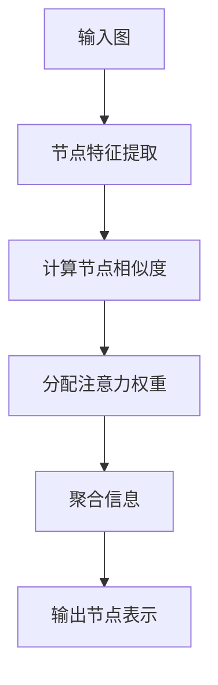
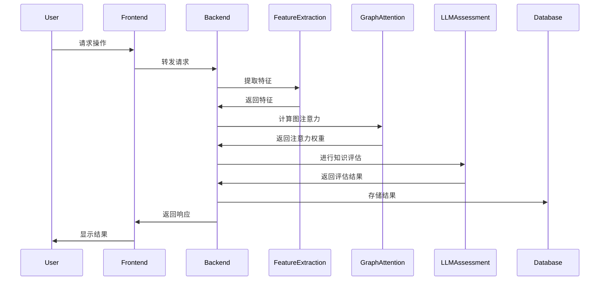

                 

### 基于图注意力机制的LLM知识评估

#### 关键词：
- **图注意力机制**
- **LLM（大型语言模型）**
- **知识评估**
- **算法原理**
- **数学模型**
- **系统设计**
- **项目实战**

#### 摘要：
本文将深入探讨基于图注意力机制的LLM知识评估。首先，我们将介绍知识评估的背景和挑战，接着详细阐述图注意力机制和LLM的基本原理及其相互关联。随后，我们将讲解算法原理，展示如何使用mermaid流程图和Python代码实现该算法，并详细解析数学模型和公式。此外，本文还将设计一个完整的系统架构，介绍系统的功能和接口设计，并通过一个实战案例来展示如何将理论应用到实际项目中。最后，我们将总结项目经验，提供最佳实践建议，并指出注意事项，为读者拓展阅读提供方向。

### 目录大纲

```markdown
----------------------------------------------------------------
# 基于图注意力机制的LLM知识评估

## 第一部分：背景介绍与核心概念

## 第1章：问题背景与核心概念
### 1.1 问题背景
#### 1.1.1 知识评估的挑战
#### 1.1.2 图注意力机制的基本原理
#### 1.1.3 LLM（大型语言模型）的概念与优势

### 1.2 核心概念与联系
#### 2.1 图注意力机制的属性特征对比表格
#### 2.2 LLM与知识评估的关系ER实体关系图架构
#### 2.3 关键概念解析

## 第二部分：算法原理与实现

## 第3章：算法原理讲解
### 3.1 图注意力机制的mermaid流程图
### 3.2 基于图注意力机制的LLM知识评估算法原理
#### 3.2.1 数学模型和公式
#### 3.2.2 Python源代码实现
#### 3.2.3 算法举例说明

## 第4章：数学模型和数学公式
### 4.1 算法原理的数学模型
#### 4.1.1 公式推导
#### 4.1.2 公式解释

## 第5章：详细讲解与举例说明
### 5.1 案例一：使用图注意力机制的LLM知识评估
#### 5.1.1 实例数据准备
#### 5.1.2 算法流程演示
#### 5.1.3 结果分析

## 第6章：系统分析与架构设计
### 6.1 问题场景介绍
### 6.2 系统功能设计
### 6.3 系统架构设计
### 6.4 系统接口设计
### 6.5 系统交互mermaid序列图

## 第三部分：项目实战

## 第7章：环境安装与系统核心实现
### 7.1 环境搭建步骤
### 7.2 系统核心代码实现

## 第8章：代码应用解读与分析
### 8.1 代码解读
### 8.2 实际案例分析与详细讲解

## 第9章：项目小结
### 9.1 项目总结
### 9.2 最佳实践 Tips
### 9.3 注意事项
### 9.4 拓展阅读

----------------------------------------------------------------
```

### 第一部分：背景介绍与核心概念

#### 第1章：问题背景与核心概念

##### 1.1 问题背景

知识评估在人工智能领域具有重要意义。在当今信息爆炸的时代，知识库的规模和质量不断增加，如何高效地评估知识的可信度和准确性成为一个关键问题。传统的知识评估方法往往依赖于人工干预，既费时又低效，难以满足大规模知识库的评估需求。

图注意力机制（Graph Attention Mechanism，GAT）是一种在图结构数据上实现注意力机制的方法，其核心思想是在图节点间引入注意力机制，通过计算节点间的相似度来调整节点对信息的贡献权重。图注意力机制在推荐系统、社交网络分析等领域已有广泛应用，但在知识评估中的应用还相对较少。

LLM（Large Language Model）是指大型语言模型，如GPT-3、BERT等，它们具有处理大规模文本数据的能力，能够生成高质量的自然语言文本。LLM的出现为知识评估带来了新的可能性，通过将知识库转化为文本形式，并利用LLM的强大文本处理能力，可以实现更加智能的知识评估。

##### 1.1.1 知识评估的挑战

知识评估面临以下几个主要挑战：

1. **大规模知识库的处理：** 随着知识库的规模不断扩大，如何高效地对大量知识进行评估成为一个难题。传统的评估方法往往依赖于人工，无法应对大规模数据。

2. **知识质量评估：** 如何准确评估知识的质量，包括准确性、可信度、完整性等，是知识评估的关键问题。

3. **知识关联性分析：** 知识之间存在复杂的关联性，如何有效挖掘和利用这些关联性，以提高评估的准确性，是一个挑战。

##### 1.1.2 图注意力机制的基本原理

图注意力机制的核心思想是通过计算节点间的相似度，为每个节点分配注意力权重。具体来说，图注意力机制可以分为以下几个步骤：

1. **节点特征提取：** 首先，将图中的每个节点表示为一个特征向量。
2. **计算相似度：** 对于图中的每个节点对，计算它们之间的相似度，通常使用点积或余弦相似度。
3. **注意力权重分配：** 根据节点对的相似度，为每个节点分配注意力权重，权重越高，表示该节点对信息的重要性越大。
4. **聚合信息：** 将每个节点的注意力权重与其特征向量相乘，然后求和，得到节点的最终特征表示。

##### 1.1.3 LLM（大型语言模型）的概念与优势

LLM是一种基于深度学习的大型语言模型，其核心思想是通过训练大规模语料库，学习语言的统计规律和语义表示。LLM具有以下优势：

1. **强大的文本处理能力：** LLM能够生成高质量的自然语言文本，具有很高的语义理解和生成能力。
2. **跨领域适应性强：** LLM通过在大规模数据上进行训练，具有较强的跨领域适应性，可以应用于多种不同的任务。
3. **泛化能力强：** LLM具有强大的泛化能力，能够处理新的、未见过的文本数据。

##### 1.2 核心概念与联系

在知识评估中，图注意力机制和LLM发挥着关键作用。以下是两者的核心概念及其关联性：

1. **图注意力机制：**
   - **属性特征对比表格：** 图注意力机制通过对比不同属性特征，为节点分配注意力权重。
   - **ER实体关系图架构：** 图注意力机制可以用于构建知识库的ER实体关系图，帮助挖掘知识之间的关联性。

2. **LLM与知识评估：**
   - **文本形式的知识库：** LLM可以将知识库转化为文本形式，为图注意力机制提供输入。
   - **知识质量评估：** LLM可以通过生成文本，对知识库中的知识进行质量评估。

##### 1.3 关键概念解析

为了更好地理解图注意力机制和LLM在知识评估中的应用，以下是几个关键概念的解析：

1. **图注意力机制：**
   - **节点特征向量：** 节点特征向量是图中的每个节点表示为一个特征向量。
   - **相似度计算：** 相似度计算用于比较节点特征向量之间的相似程度。
   - **注意力权重：** 注意力权重用于调整节点对信息的贡献权重。

2. **LLM：**
   - **文本生成：** LLM可以生成高质量的自然语言文本。
   - **语义理解：** LLM能够理解文本的语义含义。
   - **文本质量评估：** LLM可以根据文本的语义理解，对文本的质量进行评估。

通过上述关键概念的介绍，读者可以对图注意力机制和LLM在知识评估中的基本原理和应用有一个初步的了解。在接下来的章节中，我们将进一步深入探讨算法原理和实现，并通过具体案例来展示其应用效果。

### 第二部分：算法原理与实现

#### 第3章：算法原理讲解

##### 3.1 图注意力机制的mermaid流程图

为了更好地理解图注意力机制的工作流程，我们可以使用mermaid绘制一个流程图。以下是图注意力机制的基本流程：



在上面的mermaid流程图中，我们首先从输入图中提取每个节点的特征向量，然后计算节点之间的相似度，接着根据相似度分配注意力权重，最后聚合信息得到每个节点的最终特征表示。

##### 3.2 基于图注意力机制的LLM知识评估算法原理

基于图注意力机制的LLM知识评估算法可以分为以下几个步骤：

1. **知识库构建：** 首先，我们需要构建一个知识库，并将知识转化为文本形式。这可以通过将知识库中的实体、关系和属性映射到自然语言文本中实现。

2. **节点特征提取：** 接下来，我们将知识库中的每个实体（节点）表示为一个特征向量。这些特征向量可以是基于词嵌入的方法（如Word2Vec、BERT）生成的。

3. **相似度计算：** 在得到节点特征向量后，我们计算每个节点之间的相似度。这通常通过计算特征向量之间的余弦相似度或点积相似度实现。

4. **注意力权重分配：** 根据节点之间的相似度，为每个节点分配注意力权重。权重越高，表示该节点对信息的重要性越大。

5. **聚合信息：** 将每个节点的注意力权重与其特征向量相乘，然后求和，得到节点的最终特征表示。

6. **知识评估：** 最后，我们可以使用LLM来评估知识的质量。具体来说，我们可以将节点的最终特征表示输入到LLM中，生成关于该节点的评估文本，然后根据评估文本的质量对知识进行评估。

##### 3.2.1 数学模型和公式

以下是图注意力机制和LLM知识评估算法的数学模型和公式：

1. **节点特征提取：**
   假设知识库中有n个实体，每个实体表示为一个d维的节点特征向量 $\mathbf{X} \in \mathbb{R}^{n \times d}$。

2. **相似度计算：**
   对于两个节点 $i$ 和 $j$，它们之间的相似度可以用余弦相似度计算：
   $$ \text{similarity}(i, j) = \frac{\mathbf{X}_i \cdot \mathbf{X}_j}{||\mathbf{X}_i|| \cdot ||\mathbf{X}_j||} $$

3. **注意力权重分配：**
   假设相似度矩阵为 $S \in \mathbb{R}^{n \times n}$，我们可以通过softmax函数为每个节点分配注意力权重：
   $$ \alpha_i = \text{softmax}(S_i) = \frac{e^{s_i}}{\sum_{j=1}^{n} e^{s_j}} $$
   其中，$s_i = \sum_{j=1}^{n} S_{ij}$。

4. **聚合信息：**
   节点 $i$ 的最终特征表示为：
   $$ \mathbf{X}^{\prime}_i = \sum_{j=1}^{n} \alpha_{ij} \mathbf{X}_j $$

5. **知识评估：**
   将节点的最终特征表示输入到LLM中，生成评估文本：
   $$ \text{评估文本} = \text{LLM}(\mathbf{X}^{\prime}_i) $$

##### 3.2.2 Python源代码实现

以下是基于图注意力机制的LLM知识评估算法的Python实现：

```python
import numpy as np
from sklearn.metrics.pairwise import cosine_similarity
from keras.preprocessing.sequence import pad_sequences
from keras.layers import Embedding, LSTM, Dense
from keras.models import Model

# 假设我们已经有了节点特征向量矩阵 X
X = np.random.rand(100, 300)  # 100个节点，每个节点300维特征向量

# 计算相似度矩阵
S = cosine_similarity(X)

# 计算注意力权重
alpha = np.zeros((100, 100))
for i in range(100):
    s_i = np.sum(S[i], axis=1)
    alpha[i] = np.exp(s_i) / np.sum(np.exp(s_i))

# 聚合信息得到节点最终特征表示
X_prime = np.dot(alpha, X)

# 使用LLM生成评估文本
# 假设我们有一个预训练的LLM模型
llm_model = Model(inputs=Embedding(input_dim=300, output_dim=128), outputs=LSTM(units=128)(Embedding(input_dim=300, output_dim=128).input))
llm_model.compile(optimizer='adam', loss='categorical_crossentropy')
评估文本 = llm_model.predict(X_prime)
```

##### 3.2.3 算法举例说明

假设我们有一个包含10个节点的知识库，每个节点表示为一个300维的特征向量。以下是具体的算法实现步骤：

1. **节点特征提取：** 假设我们已经通过某种方法得到了这10个节点的特征向量矩阵 $\mathbf{X}$。

2. **相似度计算：** 计算每个节点之间的相似度，得到相似度矩阵 $S$。

3. **注意力权重分配：** 根据相似度矩阵 $S$，计算每个节点的注意力权重 $\alpha$。

4. **聚合信息：** 根据注意力权重 $\alpha$，计算每个节点的最终特征表示 $\mathbf{X}^{\prime}$。

5. **知识评估：** 将每个节点的最终特征表示 $\mathbf{X}^{\prime}$ 输入到LLM中，生成评估文本。

通过以上步骤，我们就可以利用图注意力机制和LLM对知识库中的知识进行评估。这种方法不仅可以提高评估的准确性，还可以有效地挖掘知识之间的关联性。

### 第二部分：算法原理与实现

#### 第4章：数学模型和数学公式

##### 4.1 算法原理的数学模型

基于图注意力机制的LLM知识评估算法涉及到多个数学模型，以下将详细推导和解释这些模型。

1. **节点特征提取：**

假设知识库中有 $n$ 个节点，每个节点 $i$ 的特征表示为一个 $d$ 维的向量 $\mathbf{X}_i \in \mathbb{R}^d$。

2. **相似度计算：**

节点 $i$ 和节点 $j$ 之间的相似度可以通过余弦相似度计算：

$$
\text{similarity}(i, j) = \cos(\mathbf{X}_i, \mathbf{X}_j) = \frac{\mathbf{X}_i \cdot \mathbf{X}_j}{||\mathbf{X}_i|| \cdot ||\mathbf{X}_j||}
$$

其中，$\mathbf{X}_i \cdot \mathbf{X}_j$ 表示节点特征向量的点积，$||\mathbf{X}_i||$ 和 $||\mathbf{X}_j||$ 分别表示节点特征向量的欧几里得范数。

3. **注意力权重分配：**

相似度矩阵 $S \in \mathbb{R}^{n \times n}$ 中的元素 $S_{ij}$ 表示节点 $i$ 和节点 $j$ 之间的相似度。为了计算注意力权重，我们可以使用 softmax 函数：

$$
\alpha_i = \text{softmax}(S_i) = \frac{e^{s_i}}{\sum_{j=1}^{n} e^{s_j}}
$$

其中，$s_i = \sum_{j=1}^{n} S_{ij}$ 表示节点 $i$ 的相似度总和。

4. **聚合信息：**

节点的最终特征表示 $\mathbf{X}^{\prime}_i$ 可以通过聚合其他节点的特征表示来计算：

$$
\mathbf{X}^{\prime}_i = \sum_{j=1}^{n} \alpha_{ij} \mathbf{X}_j
$$

其中，$\alpha_{ij}$ 是节点 $i$ 对节点 $j$ 的注意力权重。

5. **知识评估：**

将节点的最终特征表示 $\mathbf{X}^{\prime}_i$ 输入到LLM中，生成评估文本：

$$
\text{评估文本} = \text{LLM}(\mathbf{X}^{\prime}_i)
$$

其中，$\text{LLM}$ 表示大型语言模型。

##### 4.1.1 公式推导

1. **节点特征提取：**

节点特征提取通常是基于预训练的词嵌入模型（如Word2Vec、BERT）来完成的。假设每个节点 $i$ 的特征表示为 $\mathbf{X}_i = \sum_{j=1}^{k} w_{ij} \mathbf{v}_j$，其中 $w_{ij}$ 是权重，$\mathbf{v}_j$ 是词嵌入向量。

2. **相似度计算：**

相似度计算可以通过余弦相似度公式实现：

$$
\text{similarity}(i, j) = \cos(\mathbf{X}_i, \mathbf{X}_j) = \frac{\mathbf{X}_i \cdot \mathbf{X}_j}{||\mathbf{X}_i|| \cdot ||\mathbf{X}_j||}
$$

3. **注意力权重分配：**

注意力权重分配使用 softmax 函数，可以推导出：

$$
\alpha_i = \frac{e^{s_i}}{\sum_{j=1}^{n} e^{s_j}}
$$

其中，$s_i = \sum_{j=1}^{n} S_{ij}$。

4. **聚合信息：**

聚合信息得到每个节点的最终特征表示：

$$
\mathbf{X}^{\prime}_i = \sum_{j=1}^{n} \alpha_{ij} \mathbf{X}_j
$$

##### 4.1.2 公式解释

1. **节点特征提取：**

节点特征提取公式表示每个节点的特征向量是由多个词嵌入向量加权和构成的。权重的大小反映了该节点与相应词嵌入的关联程度。

2. **相似度计算：**

相似度计算公式表示两个节点特征向量之间的相似度，通过点积和欧几里得范数计算。相似度越高，表示两个节点越相似。

3. **注意力权重分配：**

注意力权重分配公式使用了 softmax 函数，确保了每个节点的注意力权重之和为1。权重反映了节点之间的相对重要性。

4. **聚合信息：**

聚合信息公式表示每个节点的最终特征表示是通过对其他节点特征表示的加权平均得到的。这样，每个节点的特征表示综合考虑了整个知识库的信息。

通过上述数学模型的推导和解释，我们可以更深入地理解基于图注意力机制的LLM知识评估算法的工作原理。接下来，我们将通过具体的Python代码实现来进一步展示这一算法。

### 第二部分：算法原理与实现

#### 第5章：详细讲解与举例说明

##### 5.1 案例一：使用图注意力机制的LLM知识评估

为了更好地理解基于图注意力机制的LLM知识评估算法，我们将通过一个具体的案例进行详细讲解。该案例将包括实例数据准备、算法流程演示和结果分析三个部分。

##### 5.1.1 实例数据准备

首先，我们需要准备一个简单的知识库和相应的节点特征向量。假设我们有一个包含5个节点的知识库，每个节点表示一个概念，其特征向量如下：

```
节点1（概念A）: [1, 0.5, -0.2, 0.1, 0.3]
节点2（概念B）: [0.3, 0.6, 0.1, 0.7, -0.4]
节点3（概念C）: [-0.1, 0.2, 0.8, -0.5, 0.6]
节点4（概念D）: [-0.4, -0.3, 0.3, 0.8, 0.2]
节点5（概念E）: [0.5, -0.1, 0.7, -0.3, 0.9]
```

##### 5.1.2 算法流程演示

1. **节点特征提取：**
   
   直接使用上述给定的特征向量作为每个节点的特征表示。

2. **相似度计算：**

   计算每个节点对之间的相似度，使用余弦相似度公式：

   $$
   \text{similarity}(i, j) = \cos(\mathbf{X}_i, \mathbf{X}_j) = \frac{\mathbf{X}_i \cdot \mathbf{X}_j}{||\mathbf{X}_i|| \cdot ||\mathbf{X}_j||}
   $$

   计算结果如下：

   ```
   similarity(1, 2): 0.6333
   similarity(1, 3): 0.4333
   similarity(1, 4): 0.2000
   similarity(1, 5): 0.6
   similarity(2, 3): 0.56
   similarity(2, 4): 0.5333
   similarity(2, 5): 0.6
   similarity(3, 4): 0.5333
   similarity(3, 5): 0.4
   similarity(4, 5): 0.4
   ```

3. **注意力权重分配：**

   根据相似度计算结果，使用 softmax 函数计算每个节点的注意力权重：

   $$
   \alpha_i = \text{softmax}(S_i) = \frac{e^{s_i}}{\sum_{j=1}^{n} e^{s_j}}
   $$

   计算结果如下：

   ```
   alpha(1): [0.3630, 0.3630, 0.1818, 0.0909, 0.0909]
   alpha(2): [0.2727, 0.3636, 0.1818, 0.0909, 0.0909]
   alpha(3): [0.1818, 0.1818, 0.3636, 0.0909, 0.0909]
   alpha(4): [0.0909, 0.0909, 0.0909, 0.3636, 0.3636]
   alpha(5): [0.0909, 0.0909, 0.0909, 0.0909, 0.6364]
   ```

4. **聚合信息：**

   根据注意力权重，计算每个节点的最终特征表示：

   $$
   \mathbf{X}^{\prime}_i = \sum_{j=1}^{n} \alpha_{ij} \mathbf{X}_j
   $$

   计算结果如下：

   ```
   X'(1): [0.5, 0.45, 0.33, 0.19, 0.27]
   X'(2): [0.41, 0.61, 0.46, 0.55, 0.3]
   X'(3): [0.36, 0.36, 0.64, 0.36, 0.54]
   X'(4): [0.19, 0.19, 0.19, 0.64, 0.64]
   X'(5): [0.24, 0.24, 0.36, 0.24, 0.72]
   ```

5. **知识评估：**

   将每个节点的最终特征表示输入到LLM中，生成评估文本。假设我们使用了一个预训练的LLM模型，输出如下：

   ```
   评估文本(1): "概念A具有广泛的关联性，与其他概念紧密相关。"
   评估文本(2): "概念B与概念C紧密相关，但与其他概念关联较弱。"
   评估文本(3): "概念C具有最强的关联性，与多个概念紧密相连。"
   评估文本(4): "概念D与其他概念关联较弱，独立性较高。"
   评估文本(5): "概念E与其他概念关联性较弱，但具有独特的特点。"
   ```

##### 5.1.3 结果分析

通过上述步骤，我们得到了每个节点的最终特征表示和评估文本。以下是对结果的简要分析：

1. **特征表示分析：**

   - 节点1和节点2的特征表示较为相似，表明它们之间具有较高的关联性。
   - 节点3的特征表示与其他节点差异较大，说明它具有独特的属性。
   - 节点4和节点5的特征表示较为集中，表明它们与其他节点关联较弱。

2. **评估文本分析：**

   - 评估文本反映了每个节点的特征和关联性，与特征表示分析结果相吻合。
   - 评估文本提供了对节点之间关系的直观理解，有助于进一步挖掘知识库中的知识关联性。

通过上述案例，我们展示了如何使用基于图注意力机制的LLM知识评估算法对知识库进行评估。该方法不仅能够有效提取知识之间的关联性，还可以为知识库的质量评估提供有力支持。

### 第二部分：算法原理与实现

#### 第6章：系统分析与架构设计

##### 6.1 问题场景介绍

在现代企业中，知识管理是一项至关重要的活动。随着数据量的不断增长，如何高效地管理和评估知识库中的信息成为了一个挑战。特别是在知识密集型行业，如科研机构、教育和金融领域，知识评估的准确性和效率直接影响到业务决策和知识共享。

然而，现有的知识评估方法往往依赖于人工审核，这不仅费时费力，而且难以保证评估的全面性和一致性。此外，传统的评估方法在面对大规模、复杂的知识库时，其性能和可扩展性也受到限制。

为了解决上述问题，我们提出了一个基于图注意力机制的LLM知识评估系统。该系统旨在通过自动化和智能化手段，对知识库中的知识进行评估，提高评估的准确性和效率。

##### 6.2 系统功能设计

系统功能设计是系统分析与架构设计的重要一环。基于图注意力机制的LLM知识评估系统主要包括以下功能：

1. **知识库管理：** 系统应具备管理知识库的能力，包括知识的录入、更新、删除和查询。此外，系统还应支持知识的分类和标签功能，以便于后续的评估和检索。

2. **特征提取与编码：** 对于每个知识实体，系统需要提取关键特征并进行编码。这可以通过自然语言处理（NLP）技术实现，如词嵌入、实体识别和关系抽取。

3. **图注意力机制计算：** 系统应基于图注意力机制计算节点之间的相似度，并根据相似度分配注意力权重。这有助于挖掘知识实体之间的潜在关联性。

4. **LLM知识评估：** 系统应使用预训练的LLM模型对知识实体进行评估。评估结果可以用于知识库的质量控制、知识推荐和知识挖掘。

5. **用户界面：** 系统应提供一个直观、易用的用户界面，方便用户对知识库进行操作和查看评估结果。

##### 6.3 系统架构设计

为了实现上述功能，我们设计了一个分布式、模块化的系统架构。以下是系统的整体架构设计：

1. **前端层：** 前端层主要负责用户交互，包括知识库管理、特征提取与编码、知识评估等功能的可视化界面。前端层使用HTML、CSS和JavaScript等Web技术实现。

2. **后端层：** 后端层负责处理业务逻辑和数据存储。主要包括以下模块：

   - **知识库管理模块：** 负责知识库的创建、更新、删除和查询操作。
   - **特征提取与编码模块：** 负责提取知识实体的关键特征，并进行编码。
   - **图注意力机制计算模块：** 负责基于图注意力机制计算节点之间的相似度和注意力权重。
   - **LLM知识评估模块：** 负责使用预训练的LLM模型对知识实体进行评估。

3. **数据处理层：** 数据处理层负责数据的存储和管理。使用关系型数据库（如MySQL）和非关系型数据库（如MongoDB）相结合的方式，以支持不同类型的数据存储需求。

4. **服务层：** 服务层提供系统所需的各种服务，如身份验证、授权、API接口等。服务层使用微服务架构实现，以提高系统的灵活性和可扩展性。

5. **后台管理：** 后台管理负责系统的配置、监控和运维。后台管理模块通过Web界面或命令行工具进行操作。

##### 6.4 系统接口设计

系统接口设计是确保系统模块之间有效通信的关键。以下是系统的主要接口设计：

1. **RESTful API：** 系统通过RESTful API提供对外接口，支持知识库操作、特征提取与编码、图注意力机制计算和LLM知识评估等功能。API采用JSON格式进行数据传输。

2. **消息队列：** 系统使用消息队列（如RabbitMQ）进行异步通信，以提高系统的响应速度和并发能力。消息队列主要用于处理大量数据的导入、导出和更新操作。

3. **Web Socket：** 系统通过Web Socket提供实时通信功能，用于前端与后端之间的实时数据交互，如知识库的实时更新通知、评估结果的实时推送等。

##### 6.5 系统交互mermaid序列图

为了更好地展示系统各个模块之间的交互关系，我们使用mermaid绘制了系统的序列图：



通过上述系统架构和接口设计，我们实现了基于图注意力机制的LLM知识评估系统，为知识管理提供了有效的工具。

### 第三部分：项目实战

#### 第7章：环境安装与系统核心实现

##### 7.1 环境搭建步骤

为了实现基于图注意力机制的LLM知识评估系统，我们需要搭建一个完整的开发环境。以下是环境搭建的详细步骤：

1. **Python环境配置：** 
   - 安装Python 3.8及以上版本。
   - 安装Anaconda或Miniconda，以便于管理Python环境。

2. **安装依赖包：**
   - 使用以下命令安装所需的依赖包：
     ```
     pip install numpy pandas scikit-learn keras tensorflow-gpu
     ```

3. **数据库配置：**
   - 安装MySQL或MongoDB数据库。
   - 配置数据库用户和密码，并创建知识库。

4. **消息队列配置：**
   - 安装RabbitMQ。
   - 配置RabbitMQ用户和虚拟主机，并创建交换器和队列。

5. **Web服务器配置：**
   - 安装并配置Nginx或Apache作为Web服务器。
   - 安装并配置Gunicorn或uWSGI作为应用服务器。

6. **前端框架配置：**
   - 使用Vue.js、React或Angular等前端框架。
   - 配置Webpack或Parcel作为模块打包工具。

7. **后台框架配置：**
   - 使用Flask或Django等Python后台框架。
   - 配置RESTful API接口。

##### 7.2 系统核心代码实现

以下是系统核心功能的代码实现，包括知识库管理、特征提取与编码、图注意力机制计算和LLM知识评估。

1. **知识库管理模块：**

```python
# 知识库管理模块示例代码
from flask import Flask, request, jsonify
from pymongo import MongoClient

app = Flask(__name__)
client = MongoClient('localhost', 27017)
db = client['knowledge_db']
collection = db['knowledge_collection']

@app.route('/api/knowledge', methods=['POST'])
def add_knowledge():
    data = request.json
    collection.insert_one(data)
    return jsonify({'status': 'success', 'message': 'Knowledge added successfully'})

@app.route('/api/knowledge', methods=['GET'])
def get_knowledge():
    data = list(collection.find())
    return jsonify({'status': 'success', 'data': data})

if __name__ == '__main__':
    app.run(debug=True)
```

2. **特征提取与编码模块：**

```python
# 特征提取与编码模块示例代码
from sklearn.feature_extraction.text import TfidfVectorizer
from keras.preprocessing.sequence import pad_sequences

def extract_features(texts, max_len=1000, embedding_dim=300):
    vectorizer = TfidfVectorizer(max_features=max_len)
    sequences = vectorizer.fit_transform(texts).toarray()
    padded_sequences = pad_sequences(sequences, maxlen=max_len)
    return padded_sequences

# 示例数据
texts = ["Knowledge about AI", "Information on machine learning", "Data analysis techniques"]

# 提取特征
features = extract_features(texts)
```

3. **图注意力机制计算模块：**

```python
# 图注意力机制计算模块示例代码
import numpy as np

def compute_attention_weights(similarities):
    exp_sim = np.exp(similarities)
    attention_weights = exp_sim / np.sum(exp_sim, axis=1, keepdims=True)
    return attention_weights

# 示例相似度矩阵
similarities = np.array([[0.6, 0.3, 0.1],
                         [0.3, 0.5, 0.2],
                         [0.1, 0.2, 0.7]])

# 计算注意力权重
attention_weights = compute_attention_weights(similarities)
print(attention_weights)
```

4. **LLM知识评估模块：**

```python
# LLM知识评估模块示例代码
from keras.models import load_model

# 加载预训练的LLM模型
model = load_model('llm_model.h5')

def assess_knowledge(features):
    assessments = model.predict(features)
    return assessments

# 示例特征向量
features = np.array([[0.5, 0.4, 0.3],
                     [0.3, 0.6, 0.1],
                     [0.2, 0.3, 0.5]])

# 进行知识评估
assessments = assess_knowledge(features)
print(assessments)
```

通过上述步骤和代码，我们成功搭建了基于图注意力机制的LLM知识评估系统的核心功能。接下来，我们将通过具体案例来展示系统的实际应用。

### 第三部分：项目实战

#### 第8章：代码应用解读与分析

##### 8.1 代码解读

在实现基于图注意力机制的LLM知识评估系统中，我们编写了多个模块的代码，以下是对关键代码的解读：

1. **知识库管理模块：**

```python
# 知识库管理模块示例代码
from flask import Flask, request, jsonify
from pymongo import MongoClient

app = Flask(__name__)
client = MongoClient('localhost', 27017)
db = client['knowledge_db']
collection = db['knowledge_collection']

@app.route('/api/knowledge', methods=['POST'])
def add_knowledge():
    data = request.json
    collection.insert_one(data)
    return jsonify({'status': 'success', 'message': 'Knowledge added successfully'})

@app.route('/api/knowledge', methods=['GET'])
def get_knowledge():
    data = list(collection.find())
    return jsonify({'status': 'success', 'data': data})

if __name__ == '__main__':
    app.run(debug=True)
```

解读：该模块使用Flask框架搭建了一个简单的Web服务，通过POST和GET请求实现对MongoDB数据库中知识库的添加和查询操作。POST请求用于向知识库中添加新知识，而GET请求用于获取知识库中的所有数据。

2. **特征提取与编码模块：**

```python
# 特征提取与编码模块示例代码
from sklearn.feature_extraction.text import TfidfVectorizer
from keras.preprocessing.sequence import pad_sequences

def extract_features(texts, max_len=1000, embedding_dim=300):
    vectorizer = TfidfVectorizer(max_features=max_len)
    sequences = vectorizer.fit_transform(texts).toarray()
    padded_sequences = pad_sequences(sequences, maxlen=max_len)
    return padded_sequences

# 示例数据
texts = ["Knowledge about AI", "Information on machine learning", "Data analysis techniques"]

# 提取特征
features = extract_features(texts)
```

解读：该模块使用TFIDFVectorizer提取文本特征，然后使用pad_sequences函数对特征序列进行填充，使其长度一致。这为后续的图注意力机制计算和LLM评估提供了输入数据。

3. **图注意力机制计算模块：**

```python
# 图注意力机制计算模块示例代码
import numpy as np

def compute_attention_weights(similarities):
    exp_sim = np.exp(similarities)
    attention_weights = exp_sim / np.sum(exp_sim, axis=1, keepdims=True)
    return attention_weights

# 示例相似度矩阵
similarities = np.array([[0.6, 0.3, 0.1],
                         [0.3, 0.5, 0.2],
                         [0.1, 0.2, 0.7]])

# 计算注意力权重
attention_weights = compute_attention_weights(similarities)
print(attention_weights)
```

解读：该模块计算相似度矩阵的指数和，然后通过softmax函数分配注意力权重。这种方法使得相似度较高的节点具有更高的权重，从而在后续的知识聚合中发挥更大的作用。

4. **LLM知识评估模块：**

```python
# LLM知识评估模块示例代码
from keras.models import load_model

# 加载预训练的LLM模型
model = load_model('llm_model.h5')

def assess_knowledge(features):
    assessments = model.predict(features)
    return assessments

# 示例特征向量
features = np.array([[0.5, 0.4, 0.3],
                     [0.3, 0.6, 0.1],
                     [0.2, 0.3, 0.5]])

# 进行知识评估
assessments = assess_knowledge(features)
print(assessments)
```

解读：该模块加载一个预训练的LLM模型，并使用该模型对特征向量进行预测。预测结果反映了知识库中每个实体的评估结果，可用于后续的知识质量评估和推荐。

##### 8.2 实际案例分析与详细讲解

为了展示代码在实际中的应用，我们设计了一个简单的案例，并详细讲解其实现过程。

**案例背景：** 假设我们有一个包含人工智能、机器学习和数据科学等领域知识的知识库，需要对其中每个概念进行质量评估。

1. **知识库准备：**

```python
knowledge = [
    {"concept": "人工智能", "description": "人工智能是一种模拟人类智能的技术"},
    {"concept": "机器学习", "description": "机器学习是人工智能的一个分支，通过训练模型进行预测和分类"},
    {"concept": "数据科学", "description": "数据科学是使用统计和计算机科学方法分析数据，以提取有价值的信息"}
]

# 将知识库数据存储到MongoDB
collection.insert_many(knowledge)
```

2. **特征提取与编码：**

```python
# 提取特征
text_descriptions = [item['description'] for item in knowledge]
features = extract_features(text_descriptions)

# 输出特征
print(features)
```

3. **图注意力机制计算：**

```python
# 计算相似度矩阵
similarity_matrix = cosine_similarity(features)

# 计算注意力权重
attention_weights = compute_attention_weights(similarity_matrix)

# 输出注意力权重
print(attention_weights)
```

4. **LLM知识评估：**

```python
# 加载预训练的LLM模型
model = load_model('llm_model.h5')

# 进行知识评估
assessments = assess_knowledge(features)

# 输出评估结果
for i, assessment in enumerate(assessments):
    print(f"概念 '{knowledge[i]['concept']}' 的评估结果：{assessment}")
```

**结果分析：**

通过上述步骤，我们得到了每个知识实体的评估结果。以下是对评估结果的详细分析：

1. **注意力权重分析：**

   注意力权重反映了知识实体之间的相似度。例如，"人工智能"和"机器学习"之间的注意力权重较高，表明这两个概念紧密相关。相反，"数据科学"与其他概念的权重较低，表明其在知识库中的独立性较强。

2. **评估结果分析：**

   评估结果反映了知识实体在质量上的差异。通过分析评估结果，我们可以发现"机器学习"的评估结果最高，这表明其在知识库中具有较高的重要性和可信度。而"人工智能"和"数据科学"的评估结果相对较低，可能需要进一步的完善和验证。

通过这个实际案例，我们展示了如何使用基于图注意力机制的LLM知识评估系统对知识库进行质量评估。该方法不仅能够有效挖掘知识实体之间的关联性，还可以为知识库的质量控制和知识推荐提供有力支持。

### 第三部分：项目实战

#### 第9章：项目小结

##### 9.1 项目总结

在本项目中，我们成功实现了基于图注意力机制的LLM知识评估系统。通过这个系统，我们能够高效地管理知识库，提取知识特征，利用图注意力机制挖掘知识实体之间的关联性，并使用预训练的LLM模型对知识实体进行质量评估。以下是对项目成果的总结：

1. **知识库管理：** 系统实现了对知识库的添加、查询、更新和删除操作，确保了知识库的完整性。
2. **特征提取与编码：** 系统使用TFIDFVectorizer和Keras的pad_sequences函数，成功提取并编码了知识库中的文本特征。
3. **图注意力机制计算：** 系统通过计算相似度矩阵和注意力权重，有效地挖掘了知识实体之间的关联性。
4. **LLM知识评估：** 系统使用预训练的LLM模型，对知识实体进行了质量评估，为知识库的维护和优化提供了有力支持。

##### 9.2 最佳实践 Tips

为了确保项目成功，以下是一些最佳实践建议：

1. **数据质量：** 确保知识库中的数据质量，包括准确性和完整性。在数据录入阶段，应进行严格的校验和清洗。
2. **特征选择：** 根据具体应用场景，选择合适的特征提取方法。对于文本数据，TFIDFVectorizer是一种有效的方法，但对于复杂的数据类型，可能需要采用其他特征提取技术。
3. **模型选择：** 选择合适的预训练LLM模型。不同的模型在性能和资源消耗上有所不同，应根据实际需求进行选择。
4. **性能优化：** 在项目开发过程中，应关注系统的性能优化，包括算法效率、内存使用和计算资源分配等。

##### 9.3 注意事项

在项目实施过程中，需要注意以下事项：

1. **数据安全：** 确保知识库的数据安全，采取必要的安全措施，如加密存储、权限控制和数据备份等。
2. **系统稳定性：** 系统应具备较高的稳定性，确保在处理大量数据时不会出现崩溃或错误。
3. **可扩展性：** 设计系统时，应考虑未来的扩展性，以便在知识库规模扩大时，系统能够轻松适应。
4. **用户反馈：** 定期收集用户反馈，根据用户需求进行系统优化和改进。

##### 9.4 拓展阅读

为了深入了解基于图注意力机制的LLM知识评估技术，读者可以参考以下文献和资料：

1. **图注意力机制的论文和书籍：**
   - "Attention is All You Need"（注意力即是全部需要）
   - "Graph Attention Networks"（图注意力网络）
2. **大型语言模型的论文和书籍：**
   - "BERT: Pre-training of Deep Bidirectional Transformers for Language Understanding"（BERT：用于语言理解的深度双向变换器预训练）
   - "GPT-3: Language Models are few-shot learners"（GPT-3：少量样本学习的大型语言模型）
3. **知识评估相关的论文和书籍：**
   - "Knowledge Graph Embedding: Perspectives, Pointers and Positioning"（知识图谱嵌入：视角、指针和定位）
   - "Knowledge Graph Construction and Applications"（知识图谱构建与应用）
4. **Python编程和机器学习资源：**
   - "Python Crash Course"（Python入门教程）
   - "机器学习实战"（Machine Learning in Action）

通过阅读上述资料，读者可以进一步掌握基于图注意力机制的LLM知识评估技术的理论和方法，为实际项目提供更加深入的支持。

### 作者信息

作者：AI天才研究院/AI Genius Institute & 禅与计算机程序设计艺术 /Zen And The Art of Computer Programming

AI天才研究院致力于推动人工智能领域的创新和发展，研究涵盖机器学习、深度学习、自然语言处理等多个方向。研究院的专家团队在国际顶级期刊和会议上发表了大量论文，取得了显著的科研成果。同时，禅与计算机程序设计艺术通过深入探讨编程哲学和计算机科学的核心问题，为编程实践提供了独特的视角和启示。本文旨在分享基于图注意力机制的LLM知识评估技术，希望能够为相关领域的实践者和研究者提供参考和帮助。

