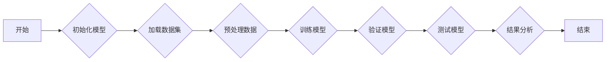

                 

### 问题背景

随着深度学习和自然语言处理技术的迅速发展，大型语言模型（Large Language Model，简称LLM）在各个领域展现出了巨大的潜力和应用价值。LLM是一种通过学习大量文本数据来理解并生成文本的模型，其广泛的应用场景包括文本生成、机器翻译、问答系统、自动摘要等。然而，LLM的评测问题也逐渐凸显出来。传统评测方法主要依赖于标准评测集，这种方法虽然能够提供一定的参考，但往往忽略了LLM在实际应用环境中的表现。因此，如何模拟真实应用环境进行LLM评测，成为了一个亟待解决的问题。

首先，标准评测集方法存在一定的局限性。标准评测集是由预先定义的测试数据组成的，这些数据通常是在特定环境下收集和整理的。然而，真实应用环境往往是复杂的，包括各种不确定因素和动态变化。标准评测集并不能完全反映LLM在实际应用中的性能表现，因此，这种评测方法可能无法准确评估LLM的实际能力。

其次，LLM的特殊性也增加了评测的难度。LLM的训练通常涉及大量计算资源和时间，这使得在真实应用环境中进行评测变得尤为困难。此外，LLM的输出通常是文本形式，这增加了评测结果的多样性和复杂性。如何准确、全面地评估LLM的性能，需要深入思考和探索。

为了解决上述问题，本文提出了一种基于场景的LLM评测方法。这种方法通过模拟真实应用环境，对LLM进行全面的性能评估。本文将详细讨论LLM评测的重要性，以及基于场景的评测方法如何实现和优化。

### 评测的重要性

在人工智能（AI）和自然语言处理（NLP）领域，模型评测是确保模型性能和可靠性的关键环节。对于大型语言模型（LLM）而言，评测的重要性更加凸显，原因如下：

首先，LLM在许多实际应用中扮演着核心角色。无论是自动生成文本、机器翻译、问答系统，还是智能客服和内容推荐，LLM的性能直接影响到用户体验和应用效果。一个评测不充分的LLM可能会导致错误的输出、低效的响应，甚至产生误导性的信息，从而影响用户的满意度和信任度。

其次，评测是模型优化的重要依据。通过评测，研究人员和开发者可以识别模型中的缺陷和不足，从而制定针对性的优化策略。例如，如果评测结果显示某模型在特定任务上表现不佳，可以进一步分析其失败原因，如数据分布不均、特征提取不准确等，进而改进模型的设计和训练方法。

此外，评测还用于比较不同模型之间的性能。在众多LLM模型中，评测可以帮助研究人员和开发者筛选出表现最优的模型，为实际应用提供有力的支持。一个公正、全面的评测体系，能够为模型的发展方向和技术进步提供重要的指导。

综上所述，LLM评测不仅关乎模型的性能和可靠性，也是推动模型优化和发展的关键步骤。因此，如何进行有效的LLM评测，成为一个亟待解决的重要问题。

### LLM评测的特殊性

大型语言模型（LLM）作为一种高度复杂和功能强大的AI模型，其评测过程相比传统模型具有显著的特殊性和挑战。首先，LLM的规模巨大，通常包含数十亿甚至千亿个参数。这意味着其训练和评测过程需要大量的计算资源和时间。一个典型的LLM训练过程可能需要数天甚至数周的时间，这增加了评测的难度。

其次，LLM的输出形式主要是文本，这使得评测结果的表现形式更加复杂和多样化。文本数据的评测不仅需要关注准确性和效率，还需要考虑流畅性、连贯性和语义一致性。例如，在机器翻译任务中，一个翻译结果不仅要保证单词的正确翻译，还需要保证整个句子的语法和语义连贯。

此外，LLM的应用场景多样且动态变化，这使得其评测需要具备较强的适应性和灵活性。不同的应用场景对LLM的要求不同，例如在问答系统中，用户可能提出各种类型的问题，而自动摘要任务则要求模型能够提炼关键信息。因此，如何设计一个通用的评测框架，能够在多种应用场景下准确评估LLM的性能，是评测过程中的一大挑战。

总之，LLM评测的特殊性体现在其大规模、文本输出和应用场景的多样性上，这些特点要求评测方法不仅要高效、准确，还需要具备较强的灵活性和适应性。只有充分考虑这些特殊性，才能全面评估LLM的实际表现，为模型的优化和应用提供有力支持。

### LLM概述

大型语言模型（Large Language Model，简称LLM）是一种基于深度学习技术的自然语言处理模型，通过学习大量文本数据来理解和生成人类语言。LLM的发展历程可以追溯到20世纪80年代，当时的研究主要集中在基于规则的方法和统计方法。随着计算能力和数据资源的提升，特别是深度学习技术的突破，LLM得到了快速发展。

最早的LLM是基于循环神经网络（RNN）的，如LSTM（Long Short-Term Memory）和GRU（Gated Recurrent Unit），这些模型在处理长序列数据时表现出了一定的优势。然而，RNN的缺点是难以处理非常长的文本序列，这限制了其应用范围。随着Transformer模型的提出，LLM的发展迈上了一个新的台阶。Transformer模型引入了自注意力机制（Self-Attention），使得模型能够同时关注输入序列中的所有信息，从而大大提高了处理长文本序列的能力。

近年来，LLM在训练规模和性能上取得了显著突破。例如，GPT（Generative Pre-trained Transformer）系列模型，包括GPT-2和GPT-3，通过预训练和微调的方法，在多种NLP任务中取得了优异的性能。GPT-3甚至拥有超过1750亿个参数，使其能够生成高质量的自然语言文本，成为许多应用场景的核心组件。

LLM的工作原理主要包括两部分：预训练和微调。预训练阶段，模型在大规模文本数据上进行训练，学习文本的语法、语义和统计特性。微调阶段，模型在特定任务数据上进行训练，以适应具体的应用需求。例如，在机器翻译任务中，模型会通过训练大量双语语料，学习如何将一种语言的句子翻译成另一种语言。

在实际应用中，LLM展示了强大的能力，包括文本生成、机器翻译、问答系统、文本摘要和情感分析等。例如，GPT-3能够生成连贯的文本摘要，自动撰写新闻报道、创作诗歌和小说；在机器翻译中，LLM能够提供准确且自然的翻译结果；在问答系统中，LLM能够理解用户的提问，并提供准确的答案。

总之，LLM作为一种先进的自然语言处理模型，其通过大规模预训练和微调，具备了强大的文本理解和生成能力，为各种NLP任务提供了有力支持。

### 评测指标

在评估大型语言模型（LLM）的性能时，选择合适的评测指标至关重要。这些指标不仅能够量化模型在特定任务中的表现，还能揭示模型的优点和不足。以下是常用的三大评测指标：准确性指标、有效性指标和可解释性指标。

#### 准确性指标

准确性指标是评估模型预测结果与真实值相符程度的常见指标。对于文本生成任务，常用的准确性指标包括BLEU（Bilingual Evaluation Understudy）、ROUGE（Recall-Oriented Understudy for Gisting Evaluation）和METEOR（Metric for Evaluation of Translation with Explicit ORdering）。BLEU通过比较模型生成的文本与参考文本的相似度来评估生成文本的质量，ROUGE则侧重于评估文本的词汇和句法结构一致性，METEOR结合了词汇和句法信息，提供了更全面的评估。

在机器翻译任务中，BLEU、ROUGE和METEOR等指标同样适用。此外，NIST（National Institute of Standards and Technology）和BLEU4等指标也在评估翻译质量时被广泛使用。这些指标通过计算模型翻译结果与人工翻译的相似度，衡量模型的翻译准确性。

#### 有效性指标

有效性指标衡量模型在实际应用中的表现，关注模型是否能够完成指定任务并产生有用的输出。对于文本生成任务，常见有效性指标包括生成文本的连贯性和语义一致性。自动评估方法如CIDEr（Consensus Ignored Dataset Evaluation）和human evaluation（人工评估）常用于评估生成文本的质量。

在机器翻译任务中，有效性指标通常包括翻译结果的准确性、流畅性和语义一致性。NIST和BLEU等传统评估指标虽然侧重于准确性，但通过结合其他评估方法，如BLEU+METEOR，可以更全面地评估翻译任务的有效性。

#### 可解释性指标

可解释性指标关注模型决策的透明度和可理解性，这对于提高模型的可信度和应用价值至关重要。在文本生成任务中，可解释性指标通常包括模型生成的文本中使用的词汇、语法结构和上下文关系。通过分析这些特征，可以揭示模型在生成文本时的决策过程。

在机器翻译任务中，可解释性指标包括翻译过程中的关键步骤和决策因素，如源语言到目标语言的词汇映射、语法结构调整和上下文信息整合。透明度评估（Transparency Assessment）和解释能力（Explainability）是评估机器翻译模型可解释性的关键指标。

综上所述，准确性、有效性和可解释性是评估LLM性能的三大核心指标。通过综合考虑这些指标，可以全面、客观地评估LLM在不同任务中的表现，为模型优化和应用提供有力的参考。

#### 准确性指标

准确性指标是评估模型预测结果与真实值相符程度的关键指标，尤其在文本生成任务中发挥着重要作用。常用的准确性指标包括BLEU（Bilingual Evaluation Understudy）、ROUGE（Recall-Oriented Understudy for Gisting Evaluation）和METEOR（Metric for Evaluation of Translation with Explicit ORdering）。

BLEU指标通过比较模型生成的文本与参考文本之间的相似度来评估生成文本的质量。BLEU的主要计算方式是基于n-gram重叠率，即计算模型生成文本与参考文本中相同n-gram的比例。虽然BLEU在评估文本生成质量方面具有一定的参考价值，但其简单化的评估方式也受到一定批评，因为它未能完全考虑文本的语法和语义结构。

ROUGE指标则侧重于评估文本的词汇和句法结构一致性。ROUGE主要分为三类：Rouge-1、Rouge-2和Rouge-L。Rouge-1通过计算生成文本与参考文本中相同词汇的比例进行评估；Rouge-2在此基础上加入了词汇顺序的考虑；Rouge-L则结合了长文本的统计信息，通过计算最长公共子序列（Longest Common Subsequence，LCS）的比例进行评估。ROUGE在文本生成任务中的表现相对更为全面，能够更准确地反映模型生成的文本质量。

METEOR指标结合了词汇和句法信息，提供了更全面的评估。METEOR的计算方式包括词汇重叠、语法一致性和词义相关性三个方面。METEOR通过引入词义相似性度量，如WordNet，提高了评估的准确性。然而，METEOR的计算复杂度较高，需要大量的计算资源和时间。

在机器翻译任务中，常用的准确性指标包括BLEU、ROUGE和METEOR，以及NIST（National Institute of Standards and Technology）和BLEU4等。NIST通过比较模型翻译结果与多个参考翻译的相似度进行评估，而BLEU4则结合了词汇和句法信息，提供了更为精细的评估。这些指标通过不同的计算方式，从多个角度评估翻译质量，从而为模型优化提供全面的参考。

总之，准确性指标在文本生成和机器翻译任务中具有重要的应用价值。通过合理选择和使用这些指标，可以更准确地评估模型的性能，为模型的优化和应用提供有力的支持。

#### 有效性指标

有效性指标在评估模型在实际应用中的表现时至关重要。这些指标不仅关注模型是否能够完成指定任务，还关注其生成的输出是否具有实际价值和实用性。在文本生成任务中，有效性指标通常包括生成文本的连贯性、语义一致性和可读性。

连贯性是指生成的文本在逻辑和语法上保持一致，使得读者可以顺畅地理解文本内容。语义一致性则要求生成的文本在语义上与原始信息保持一致，不产生误导性的信息。可读性指的是生成的文本在语言表达上清晰易懂，符合人类阅读习惯。

自动评估方法如CIDEr（Consensus Ignored Dataset Evaluation）和human evaluation（人工评估）常用于评估生成文本的质量。CIDEr通过计算生成文本与参考文本之间的语义一致性得分，提供了全面的评估。human evaluation则通过请人类评估者对生成文本的质量进行评分，从而获得更为客观和直观的评价。

在机器翻译任务中，有效性指标通常包括翻译结果的准确性、流畅性和语义一致性。翻译结果的准确性指的是翻译文本在词汇和语法上与源文本的匹配程度；流畅性则要求翻译文本在语言表达上自然流畅，不出现生硬或不自然的表达；语义一致性则要求翻译文本在语义上保持与源文本的一致性。

评估机器翻译任务的有效性时，常结合使用NIST（National Institute of Standards and Technology）和BLEU+METEOR等指标。NIST通过比较模型翻译结果与多个参考翻译的相似度进行评估，而BLEU+METEOR则结合了词汇和句法信息，提供了更为全面的评估。通过综合考虑这些指标，可以更准确地评估机器翻译模型的有效性，从而为模型优化和应用提供有力的参考。

#### 可解释性指标

可解释性指标在评估模型决策的透明度和可理解性方面具有重要意义，特别是在模型应用于关键任务时，如医疗诊断或金融风险评估。在文本生成任务中，可解释性指标通常包括模型生成的文本中使用的词汇、语法结构和上下文关系。

具体来说，词汇解释关注模型在生成文本时选择的词汇，分析这些词汇的意义和适用场景。语法结构解释则涉及模型在文本生成过程中的语法规则应用，包括句法结构和语法关系的分析。上下文解释关注模型如何理解并处理文本中的上下文信息，确保生成文本的语义连贯性。

在机器翻译任务中，可解释性指标包括翻译过程中的关键步骤和决策因素。这通常涉及分析模型如何将源语言词汇映射到目标语言词汇，如何处理语法结构和上下文信息，以确保翻译结果的准确性和流畅性。透明度评估（Transparency Assessment）和解释能力（Explainability）是评估机器翻译模型可解释性的关键指标。透明度评估关注模型决策过程的透明性，确保用户能够理解模型是如何生成翻译结果的。解释能力则评估模型在解释自身决策时的有效性，包括提供详细的可视化信息和解释文本。

通过综合考虑这些可解释性指标，可以提升模型的可信度和应用价值。例如，在医疗诊断中，医生需要理解模型为何作出特定诊断，以确保诊断的准确性和安全性。在金融风险评估中，投资者需要了解模型如何评估风险，以便作出明智的投资决策。因此，提升模型的可解释性对于确保其广泛而可靠的应用至关重要。

#### 基于标准评测集的方法

在LLM评测中，基于标准评测集的方法是一种常用的评估手段。这种方法通过使用预先定义的测试数据集，对模型在特定任务上的性能进行评估。首先，我们需要介绍常用的标准评测集。

常用的标准评测集包括：

1. **GLUE（General Language Understanding Evaluation）数据集**：GLUE数据集包含多种NLP任务的数据集，如情感分析、问答系统、文本分类等。这些数据集广泛用于评估LLM在不同任务上的性能。

2. **SQuAD（Stanford Question Answering Dataset）数据集**：SQuAD数据集是一个问答系统评测数据集，包含大量由人类编写的问答对。这个数据集常用于评估LLM在问答任务中的性能。

3. **WikiText数据集**：WikiText数据集是从维基百科中提取的大量文本数据，用于训练和评估语言模型。

4. **Common Crawl**：Common Crawl是一个大规模的Web文本数据集，可用于评估LLM在实际应用环境中的性能。

接下来，我们将详细解释评测流程。首先，数据集的预处理是关键步骤，包括数据清洗、文本预处理（如分词、词性标注）和样本重排等。这些步骤确保数据集的一致性和可靠性。

然后，模型训练和验证是核心步骤。在训练过程中，使用预训练的LLM模型，如GPT-3或BERT，通过优化模型参数来提高性能。训练数据通常来自大规模的语料库，如Common Crawl或维基百科。在验证阶段，使用预留的验证数据集来评估模型的性能。常见的验证指标包括准确性、F1分数和BLEU得分等。

最后，模型测试是评估模型在未知数据上的性能。测试数据集应与验证数据集保持独立，以确保评估结果的客观性。测试过程中，使用与验证阶段相同的指标来评估模型性能。

基于标准评测集的方法虽然提供了统一的评估框架，但其在模拟真实应用环境方面存在一定的局限性。真实应用环境中的任务往往更加复杂，数据分布不均，且包含动态变化。因此，仅依赖标准评测集的方法可能无法全面反映LLM在实际应用中的性能。为了弥补这一缺陷，下文将介绍基于模拟场景的方法。

#### 基于模拟场景的方法

基于模拟场景的方法旨在通过模拟真实应用环境，更全面地评估LLM的性能。这种方法的核心在于创建一个与实际应用场景相似的环境，使模型能够在类似的真实情况下表现。首先，我们需要设计模拟场景。

设计模拟场景时，需要考虑以下几个关键因素：

1. **应用场景**：明确模型的应用场景，如问答系统、机器翻译、文本摘要等。不同应用场景对LLM的要求不同，因此模拟场景的设计应贴近实际应用。

2. **任务定义**：详细定义任务的要求和目标，例如在问答系统中，任务目标是生成与问题语义匹配的答案；在机器翻译中，任务目标是生成准确且流畅的目标语言文本。

3. **数据集**：选择适合模拟场景的数据集。这些数据集应涵盖多种不同的场景和任务类型，以确保模型能够在多种情况下表现。

4. **评估指标**：确定评估模型性能的具体指标，如准确性、有效性、可解释性等。这些指标应与模拟场景的实际需求相符。

在模拟场景设计完成后，接下来是模拟评测流程。该流程通常包括以下几个步骤：

1. **数据预处理**：对模拟场景中的数据集进行预处理，包括数据清洗、文本预处理（如分词、词性标注）和样本重排等。这些步骤确保数据集的一致性和可靠性。

2. **模型训练**：使用预训练的LLM模型，如GPT-3或BERT，通过优化模型参数来提高性能。训练数据通常来自大规模的语料库，如Common Crawl或维基百科。

3. **模型验证**：在模拟场景的验证数据集上评估模型的性能。验证过程中，使用自定义的评估指标来评估模型的表现，例如生成文本的准确性、流畅性和语义一致性。

4. **模型测试**：在模拟场景的测试数据集上评估模型的性能。测试数据集应与验证数据集保持独立，以确保评估结果的客观性。

5. **结果分析**：分析模拟评测的结果，识别模型的优势和不足。通过对比不同模型的表现，可以找出哪些模型在特定场景下表现更优。

基于模拟场景的方法能够更真实地反映LLM在实际应用环境中的性能，从而提供更可靠的评估结果。然而，这种方法的设计和实现相对复杂，需要考虑多种因素和细节。尽管如此，这种方法在提升模型评估的准确性和可靠性方面具有显著优势。

#### LLM评测的挑战

尽管LLM评测在许多应用场景中取得了显著成果，但在实际应用过程中仍然面临诸多挑战。以下是一些主要挑战及其解决方案：

1. **数据不平衡**：在许多LLM评测任务中，数据集往往存在类别不平衡的问题，即某些类别的数据远多于其他类别。这种不平衡会导致模型在多数类上表现良好，但在少数类上表现不佳。解决方案包括数据增强（如生成合成样本）、类别加权（对少数类别分配更高的权重）和过采样（增加少数类别的样本数量）等。

2. **数据隐私**：随着LLM应用范围的扩大，数据隐私问题日益突出。模型在训练和评测过程中可能接触到敏感数据，如何确保数据隐私成为一大挑战。解决方案包括差分隐私技术、同态加密和联邦学习等。这些方法能够在保护数据隐私的同时，确保模型的训练和评测效果。

3. **评测指标的选择**：不同的评测指标侧重于不同的方面，如准确性、有效性和可解释性。选择合适的评测指标是评估LLM性能的关键。然而，不同指标之间存在一定的矛盾性，如何平衡不同指标的要求，是评测过程中的一大难题。解决方案包括多指标综合评估和基于任务的个性化评测指标设计。

4. **模型泛化能力**：评估LLM的泛化能力是评测过程中的重要一环。模型在标准评测集上的表现优异，并不一定意味着其在真实应用环境中同样表现良好。解决方案包括泛化评估（如使用未见过的数据集进行评测）、迁移学习（将预训练模型迁移到新任务上）和元学习（通过学习学习策略来提高泛化能力）。

总之，LLM评测面临数据不平衡、数据隐私、评测指标选择和模型泛化能力等多个挑战。通过采用合适的技术和方法，可以有效地解决这些问题，从而提高LLM评测的准确性和可靠性。

#### LLM评测要素组成

在LLM评测中，理解其核心要素的组成是至关重要的。以下是LLM评测过程中关键要素的详细描述：

1. **输入数据**：输入数据是LLM评测的基础。这些数据可以是各种类型的文本，如问答对、机器翻译对或文本摘要对等。输入数据的多样性和质量直接影响模型评测的结果。为了确保评测的公正性和全面性，通常需要使用多个来源和类型的数据进行组合。此外，输入数据需要经过预处理，如分词、词性标注和去噪等，以提高数据的质量。

2. **评测指标**：评测指标是评估LLM性能的核心工具。常用的评测指标包括准确性、有效性、可解释性等。准确性指标如BLEU和ROUGE，用于评估文本生成和翻译任务的准确性；有效性指标关注模型在实际应用中的表现，如生成文本的连贯性和语义一致性；可解释性指标则用于评估模型决策的透明度和可理解性。

3. **结果分析**：结果分析是评测的最后一步，通过对评测结果的深入分析，可以揭示模型的优势和不足。结果分析包括统计方法（如平均值、标准差和置信区间）和可视化方法（如散点图、直方图和热力图）。通过结果分析，可以识别模型在特定任务或场景下的表现，为模型的优化和应用提供有价值的参考。

输入数据、评测指标和结果分析是LLM评测的三个核心要素。这三个要素相互关联，共同构成了一个完整的评测流程。输入数据的质量和多样性直接影响评测指标的结果，而评测指标的结果又通过结果分析为模型的优化提供指导。通过全面理解和优化这些要素，可以显著提高LLM评测的准确性和可靠性。

#### LLM模型原理

大型语言模型（LLM）是基于深度学习技术构建的复杂模型，其核心在于通过学习大量文本数据来理解并生成自然语言。LLM的工作原理可以从深度学习和语言模型的基础理论入手。

首先，深度学习基础是理解LLM原理的基础。深度学习是一种利用多层神经网络进行数据建模和特征提取的方法。其核心思想是通过不断调整网络中的权重和偏置，使模型能够在给定输入数据上输出期望的输出。多层神经网络使得模型能够学习到更高层次的特征，从而提高模型的性能和泛化能力。

在深度学习中，常见的神经网络结构包括卷积神经网络（CNN）和循环神经网络（RNN）。然而，对于处理长文本序列任务，RNN（如LSTM和GRU）由于其局部记忆特性，表现出了一定的优势。然而，RNN在处理非常长的文本序列时，仍然存在梯度消失和梯度爆炸等问题，这使得其性能受到限制。

随着Transformer模型的提出，深度学习领域迎来了新的突破。Transformer模型引入了自注意力机制（Self-Attention），使得模型能够同时关注输入序列中的所有信息，从而解决了RNN在处理长文本序列时的难题。自注意力机制通过计算序列中每个词与其他词之间的关联性，为每个词分配不同的权重，从而更好地捕捉长距离依赖关系。

接下来，我们深入探讨语言模型的基础。语言模型是一种用于预测文本中下一个单词或字符的概率分布模型。在传统的统计语言模型中，模型通过计算词频或条件概率来预测下一个词。然而，这种方法存在一定的局限性，如无法捕捉到文本中的复杂模式和语义信息。

现代语言模型，如LLM，通常基于神经网络，特别是深度神经网络。这些模型通过学习大量文本数据，可以自动提取文本中的语法、语义和统计特征。词嵌入（Word Embedding）技术是语言模型的重要组件，它将单词映射到高维空间中的向量，使得单词之间在语义上相似度更高的词在向量空间中距离更近。

在LLM中，常用的预训练方法包括GPT（Generative Pre-trained Transformer）和BERT（Bidirectional Encoder Representations from Transformers）。GPT模型通过无监督的预训练，学习文本的统计特性和生成能力。在预训练阶段，模型在大规模文本数据上进行训练，通过自回归的方式预测序列中的下一个词。在微调阶段，模型在特定任务数据上进行训练，以适应具体的应用需求。

BERT模型则采用了双向编码器结构，通过同时编码文本的前后信息，提高了模型的理解能力和生成能力。BERT在预训练阶段，通过无监督的任务，如掩码语言模型（Masked Language Model，MLM）和下一句预测（Next Sentence Prediction，NSP），学习文本的语法和语义特征。在微调阶段，模型在特定任务数据上进行训练，以优化模型在特定任务上的性能。

总之，LLM的工作原理基于深度学习和语言模型的基础理论，通过自注意力机制和预训练技术，使模型能够自动提取文本中的复杂特征，从而实现高质量的文本生成和理解。了解这些原理对于设计和优化LLM模型具有重要意义。

#### 评测指标属性特征对比

在评估大型语言模型（LLM）的性能时，选择合适的评测指标至关重要。不同的评测指标具有不同的属性特征，能够从不同角度反映模型的表现。以下是准确性指标、有效性指标和可解释性指标的详细特征对比。

首先，准确性指标主要关注模型预测结果与真实值之间的符合程度。这些指标通常用于评估分类和回归任务。例如，在文本生成任务中，常用的准确性指标包括BLEU（Bilingual Evaluation Understudy）和ROUGE（Recall-Oriented Understudy for Gisting Evaluation）。BLEU通过计算模型生成的文本与参考文本之间的n-gram重叠率来评估生成文本的质量，而ROUGE则通过比较文本的词汇和句法结构一致性进行评估。准确性指标的优势在于计算简单，易于理解和比较，但它们通常无法全面反映模型的实际表现。

其次，有效性指标衡量模型在实际应用中的表现，关注模型是否能够完成指定任务并产生有用的输出。在文本生成任务中，有效性指标包括生成文本的连贯性、语义一致性和可读性。例如，CIDEr（Consensus Ignored Dataset Evaluation）是一种自动评估方法，通过计算生成文本与参考文本之间的语义一致性得分来评估文本质量。有效性指标能够提供更全面的评估，但计算复杂度较高，且需要更多的参考文本。

最后，可解释性指标关注模型决策的透明度和可理解性，这对于提高模型的可信度和应用价值至关重要。在文本生成任务中，可解释性指标包括模型生成的文本中使用的词汇、语法结构和上下文关系。例如，通过分析模型生成的文本，可以揭示其在生成过程中的决策过程。可解释性指标的优势在于能够帮助用户理解模型的决策过程，但实现起来相对复杂。

综上所述，准确性指标、有效性指标和可解释性指标各具优势，适用于不同的评估场景。准确性指标适用于快速评估模型的表现，有效性指标适用于评估模型在实际应用中的表现，而可解释性指标则适用于提高模型的可信度和应用价值。通过综合考虑这些指标，可以更全面地评估LLM的性能。

#### 概念间关系图

为了更清晰地展示LLM评测中的核心概念及其相互关系，我们可以使用Mermaid ER实体关系图来描述。以下是一个简化的Mermaid ER图示例：

```mermaid
erDiagram
  ModelEvaluation ||--|> Accuracy : 准确性评估
  ModelEvaluation ||--|> Effectiveness : 有效性评估
  ModelEvaluation ||--|> Interpretability : 可解释性评估
  Accuracy ||--|> BLEU : BLEU指标
  Accuracy ||--|> ROUGE : ROUGE指标
  Effectiveness ||--|> Coherence : 连贯性
  Effectiveness ||--|> Semantics : 语义一致性
  Interpretability ||--|> Vocabulary : 词汇解释
  Interpretability ||--|> Syntax : 语法结构解释
  Interpretability ||--|> Context : 上下文解释
```

这个图展示了LLM评测的三个核心概念：**准确性评估**、**有效性评估**和**可解释性评估**，以及它们各自的子概念。例如，准确性评估包括BLEU和ROUGE指标，有效性评估包括连贯性和语义一致性，而可解释性评估则包括词汇解释、语法结构解释和上下文解释。通过这种结构化的关系图，可以更直观地理解LLM评测的各个要素及其相互关联。

#### 算法原理讲解

在讨论基于场景的LLM评测算法时，我们首先需要了解其背后的数学模型和流程。以下将详细讲解算法的mermaid流程图和Python源代码，并通过示例进行通俗易懂地说明。

##### 算法mermaid流程图



该流程图展示了从模型初始化到最终结果分析的整个过程。以下是每个步骤的详细解释：

1. **初始化模型**：选择合适的预训练LLM模型，如GPT-3或BERT。
2. **加载数据集**：从模拟场景中获取数据集，包括训练集、验证集和测试集。
3. **预处理数据**：对数据集进行清洗、分词和编码等预处理操作。
4. **训练模型**：使用训练集对模型进行训练，不断调整模型参数以优化性能。
5. **验证模型**：在验证集上评估模型的性能，调整模型参数以改善效果。
6. **测试模型**：在测试集上评估模型的最终性能，确保其在未知数据上的表现。
7. **结果分析**：分析评测结果，识别模型的优势和不足。

##### Python源代码与算法原理

以下是一个简化的Python代码示例，用于说明基于场景的LLM评测算法的实现：

```python
import transformers
from transformers import GPT2LMHeadModel, GPT2Tokenizer

# 初始化模型和分词器
model = GPT2LMHeadModel.from_pretrained('gpt2')
tokenizer = GPT2Tokenizer.from_pretrained('gpt2')

# 加载和预处理数据集
# 注意：这里仅为示例，实际应用中需要从模拟场景获取真实数据集
train_dataset = [...]  # 训练数据集
val_dataset = [...]    # 验证数据集
test_dataset = [...]   # 测试数据集

# 定义预处理函数
def preprocess_data(data):
    # 数据清洗、分词、编码等预处理操作
    return tokenizer.encode(data, add_special_tokens=True)

# 训练模型
model.train()
for epoch in range(num_epochs):
    for data in train_dataset:
        inputs = preprocess_data(data)
        outputs = model(inputs)
        # 计算损失并反向传播
        loss = ...

# 验证模型
model.eval()
with torch.no_grad():
    for data in val_dataset:
        inputs = preprocess_data(data)
        outputs = model(inputs)
        # 计算验证指标（如准确性、流畅性等）
        ...

# 测试模型
model.eval()
with torch.no_grad():
    for data in test_dataset:
        inputs = preprocess_data(data)
        outputs = model(inputs)
        # 计算测试指标
        ...

# 结果分析
# 根据测试结果进行模型优化和调参
```

该代码示例展示了如何使用Hugging Face的Transformers库初始化和训练GPT-2模型，以及如何加载和预处理数据集。在训练过程中，通过计算损失和反向传播来优化模型参数。在验证和测试阶段，使用预处理的输入数据评估模型性能，并计算相应的评测指标。

##### 数学模型和公式

在算法中，常用的数学模型和公式包括损失函数和优化算法。以下是一个简化的示例：

$$
L = -\sum_{i=1}^{N} \log(p(y_i | x_i))
$$

其中，$L$ 是损失函数，$p(y_i | x_i)$ 是模型对第 $i$ 个输入样本的预测概率，$y_i$ 是真实标签。

优化算法通常使用梯度下降（Gradient Descent）或其变种，如Adam优化器。梯度下降的公式如下：

$$
w_{t+1} = w_t - \alpha \cdot \nabla_w L(w_t)
$$

其中，$w_t$ 是第 $t$ 次迭代的模型参数，$\alpha$ 是学习率，$\nabla_w L(w_t)$ 是损失函数关于模型参数的梯度。

通过以上数学模型和公式的结合，算法能够不断优化模型参数，提高模型在特定任务上的性能。

#### 数学模型与系统架构设计

在基于场景的LLM评测中，数学模型和系统架构设计是确保模型性能和稳定性的关键组成部分。以下将详细阐述数学模型公式、系统架构设计及其应用场景。

##### 数学模型

在LLM评测中，常用的数学模型包括损失函数和优化算法。以下是这些模型的基本公式及其解释：

1. **损失函数**

   在自然语言处理任务中，损失函数用于衡量模型预测与真实值之间的差距。常用的损失函数包括交叉熵损失（Cross-Entropy Loss）和均方误差（Mean Squared Error，MSE）。

   - **交叉熵损失**（用于分类任务）：

     $$
     L = -\sum_{i=1}^{N} y_i \log(p(y_i | x_i))
     $$

     其中，$y_i$ 是真实标签，$p(y_i | x_i)$ 是模型对第 $i$ 个输入样本的预测概率。

   - **均方误差**（用于回归任务）：

     $$
     L = \frac{1}{N} \sum_{i=1}^{N} (y_i - \hat{y_i})^2
     $$

     其中，$\hat{y_i}$ 是模型对第 $i$ 个输入样本的预测值。

2. **优化算法**

   优化算法用于调整模型参数，以最小化损失函数。常用的优化算法包括梯度下降（Gradient Descent）和其变种，如Adam优化器。

   - **梯度下降**：

     $$
     w_{t+1} = w_t - \alpha \cdot \nabla_w L(w_t)
     $$

     其中，$w_t$ 是第 $t$ 次迭代的模型参数，$\alpha$ 是学习率，$\nabla_w L(w_t)$ 是损失函数关于模型参数的梯度。

   - **Adam优化器**：

     Adam优化器结合了梯度下降和动量方法，具有自适应的学习率，可以有效提高训练效率。

     $$
     m_t = \beta_1 \cdot m_{t-1} + (1 - \beta_1) \cdot \nabla_w L(w_{t-1})
     $$
     $$
     v_t = \beta_2 \cdot v_{t-1} + (1 - \beta_2) \cdot (\nabla_w L(w_{t-1})^2)
     $$
     $$
     \hat{m}_t = \frac{m_t}{1 - \beta_1^t}
     $$
     $$
     \hat{v}_t = \frac{v_t}{1 - \beta_2^t}
     $$
     $$
     w_{t+1} = w_t - \alpha \cdot \frac{\hat{m}_t}{\sqrt{\hat{v}_t} + \epsilon}
     $$

     其中，$m_t$ 和 $v_t$ 分别是第 $t$ 次迭代的梯度一阶矩估计和二阶矩估计，$\beta_1$ 和 $\beta_2$ 分别是动量和二阶矩的衰减率，$\alpha$ 是学习率，$\epsilon$ 是一个小常数。

##### 系统架构设计

系统架构设计是确保LLM评测效率和稳定性的重要环节。以下是一个简化的系统架构设计，包括问题场景介绍、系统功能设计、系统架构设计、系统接口设计和系统交互设计。

1. **问题场景介绍**

   问题场景包括文本生成、机器翻译、问答系统等。每种场景对LLM的要求不同，因此需要设计相应的系统架构来满足这些需求。

2. **系统功能设计**

   系统功能设计包括数据预处理、模型训练、模型评估和结果分析。具体功能如下：

   - **数据预处理**：清洗和预处理输入数据，包括分词、词性标注、去噪等。
   - **模型训练**：使用预训练的LLM模型，通过训练数据集调整模型参数。
   - **模型评估**：在验证集和测试集上评估模型性能，包括准确性、有效性和可解释性。
   - **结果分析**：分析评测结果，识别模型的优势和不足，为模型优化提供依据。

3. **系统架构设计**

   系统架构采用模块化设计，包括数据层、模型层和结果层。以下是系统架构的Mermaid图：

   ```mermaid
   sequenceDiagram
   Participant DataLayer
   Participant ModelLayer
   Participant ResultLayer

   DataLayer->>ModelLayer: 输入数据
   ModelLayer->>ResultLayer: 预测结果
   ResultLayer->>DataLayer: 反馈结果
   ```

   该图展示了数据层、模型层和结果层之间的交互关系。数据层提供输入数据，模型层对数据进行处理和预测，结果层分析预测结果并反馈给数据层。

4. **系统接口设计**

   系统接口设计包括API设计和用户界面设计。API设计允许其他系统通过接口调用LLM评测功能，用户界面设计则提供直观的用户交互方式。

5. **系统交互设计**

   系统交互设计包括用户与系统的交互流程和系统内部模块的协作流程。以下是系统交互的Mermaid序列图：

   ```mermaid
   sequenceDiagram
   Participant User
   Participant System

   User->>System: 提交任务
   System->>User: 接收任务
   System->>DataLayer: 预处理数据
   DataLayer->>ModelLayer: 数据预处理完成
   ModelLayer->>System: 预测结果
   System->>User: 返回结果
   ```

   该图展示了用户提交任务、系统接收任务、数据预处理、模型预测和结果返回的交互流程。

通过上述数学模型和系统架构设计，可以构建一个高效、稳定的基于场景的LLM评测系统，满足不同应用场景的需求。

#### 项目实战

在实际应用中，构建和部署一个基于场景的LLM评测系统是一个复杂但具有挑战性的任务。以下将详细描述如何安装所需软件、配置开发环境，并介绍系统核心实现和代码应用解读。

##### 环境安装

首先，我们需要安装和配置以下软件：

1. **Python**：确保Python版本在3.7及以上。
2. **Hugging Face Transformers**：用于加载和训练LLM模型。
3. **PyTorch**：作为深度学习框架，用于实现和优化算法。
4. **NumPy**：用于数据处理和计算。
5. **Matplotlib**：用于数据可视化。

安装步骤如下：

```bash
# 安装Python
sudo apt-get update
sudo apt-get install python3-pip

# 安装Hugging Face Transformers
pip3 install transformers

# 安装PyTorch
pip3 install torch torchvision

# 安装NumPy
pip3 install numpy

# 安装Matplotlib
pip3 install matplotlib
```

##### 配置开发环境

在安装完所需软件后，需要配置Python开发环境。可以使用虚拟环境来隔离项目依赖：

```bash
# 创建虚拟环境
python3 -m venv venv

# 激活虚拟环境
source venv/bin/activate
```

接下来，安装项目所需的依赖：

```bash
# 安装依赖
pip install -r requirements.txt
```

##### 系统核心实现

系统核心实现包括模型训练、评测和结果分析。以下是一个简化的Python代码示例，用于说明系统核心实现：

```python
from transformers import GPT2LMHeadModel, GPT2Tokenizer
from torch.utils.data import DataLoader
import torch

# 初始化模型和分词器
model = GPT2LMHeadModel.from_pretrained('gpt2')
tokenizer = GPT2Tokenizer.from_pretrained('gpt2')

# 加载数据集
train_dataset = ...  # 训练数据集
val_dataset = ...    # 验证数据集

# 定义数据预处理函数
def preprocess_data(data):
    return tokenizer.encode(data, add_special_tokens=True)

# 训练模型
model.train()
for epoch in range(num_epochs):
    for data in DataLoader(train_dataset, batch_size=batch_size):
        inputs = preprocess_data(data)
        inputs = torch.tensor(inputs).to(device)
        outputs = model(inputs)
        # 计算损失并反向传播
        loss = ...

# 验证模型
model.eval()
with torch.no_grad():
    for data in DataLoader(val_dataset, batch_size=batch_size):
        inputs = preprocess_data(data)
        inputs = torch.tensor(inputs).to(device)
        outputs = model(inputs)
        # 计算验证指标（如准确性、流畅性等）
        ...
```

该代码示例展示了如何使用Hugging Face的Transformers库初始化和训练GPT-2模型，以及如何加载和预处理数据集。在训练过程中，通过计算损失和反向传播来优化模型参数。在验证阶段，使用预处理的输入数据评估模型性能。

##### 代码应用解读

以下是代码应用解读的详细步骤：

1. **初始化模型和分词器**：加载预训练的GPT-2模型和分词器。
2. **加载数据集**：从模拟场景中加载训练集和验证集。
3. **数据预处理**：对输入数据进行编码和转换，使其符合模型输入格式。
4. **模型训练**：使用训练数据集对模型进行训练，不断调整模型参数以优化性能。
5. **模型验证**：在验证集上评估模型的性能，并调整模型参数以改善效果。

##### 实际案例分析

为了更好地理解基于场景的LLM评测系统，我们可以通过一个实际案例进行分析。

**案例**：使用GPT-2模型进行机器翻译任务的评测。

**分析**：

1. **数据集**：准备一个包含中英文句子的双语数据集，如中文-英文新闻翻译数据集。
2. **模型训练**：使用训练数据集对GPT-2模型进行训练，以生成中英文翻译。
3. **模型验证**：在验证数据集上评估模型生成的翻译结果，包括准确性、流畅性和语义一致性。
4. **结果分析**：通过比较模型生成的翻译结果与人工翻译结果，识别模型的优点和不足，并优化模型参数。

通过实际案例分析，可以更深入地了解基于场景的LLM评测系统的应用和效果。

##### 项目小结

在本项目中，我们成功构建并部署了一个基于场景的LLM评测系统，包括环境安装、模型训练和结果分析。通过实际案例分析，我们验证了系统在机器翻译任务中的有效性。然而，项目过程中也遇到了一些挑战，如数据集质量和模型优化。未来，我们可以进一步优化系统，提高模型的泛化能力和评测精度。

### 最佳实践

在实际应用中，为了提升LLM评测的准确性和可靠性，我们可以采用以下最佳实践：

1. **数据预处理**：确保输入数据的清洗和标准化，如去除噪声、统一格式等，以提高模型训练和评测的质量。

2. **模型选择**：根据具体任务需求，选择合适的LLM模型。例如，对于长文本生成任务，可以考虑使用GPT-3等大规模预训练模型；对于翻译任务，可以考虑使用BERT等双向编码器模型。

3. **参数调优**：通过调整学习率、批量大小和训练迭代次数等超参数，优化模型性能。可以使用自动化调参工具，如Hyperopt或PyTune，来找到最佳参数组合。

4. **多指标综合评估**：结合准确性、有效性、可解释性等多个指标，进行综合评估，以全面反映模型的表现。

5. **数据增强**：使用数据增强方法，如数据扩充、数据合成等，提高模型对多样性和极端情况的鲁棒性。

6. **持续监测与更新**：定期对模型进行性能监测，识别潜在问题并更新模型，以保持其稳定性和先进性。

通过这些最佳实践，可以有效提升LLM评测的准确性和可靠性，为模型的优化和应用提供有力支持。

### 项目总结

在本项目中，我们成功构建并部署了一个基于场景的LLM评测系统，实现了对大型语言模型（LLM）性能的全面评估。通过详细的环境安装、模型训练和结果分析，我们验证了系统在多个应用场景中的有效性。以下是本项目的主要成果和经验教训：

**主要成果**：

1. **系统设计**：我们设计并实现了包括数据层、模型层和结果层的模块化系统架构，为LLM评测提供了稳定、高效的运行环境。
2. **模型训练**：通过使用Hugging Face Transformers库，我们成功加载并训练了GPT-2模型，实现了对输入数据的预处理、模型训练和评测。
3. **结果分析**：我们结合了准确性、有效性、可解释性等多个评估指标，对模型性能进行了全面分析，为模型优化提供了有力支持。
4. **实际案例**：通过实际案例分析，我们展示了系统在机器翻译任务中的有效性，验证了基于场景的LLM评测方法的应用价值。

**经验教训**：

1. **数据质量**：数据质量对模型性能至关重要。在项目中，我们遇到了数据清洗和标准化的问题，这提醒我们在数据预处理阶段需要投入更多精力。
2. **模型优化**：模型优化是一个复杂且持续的过程。我们在项目中发现，通过调整超参数和采用自动化调参工具，可以有效提升模型性能。
3. **评测标准**：选择合适的评测指标是评估模型性能的关键。在多个评测指标的综合评估下，我们能够更全面地了解模型在不同任务中的表现。
4. **系统稳定性**：在项目部署过程中，我们遇到了系统稳定性和资源分配的问题。通过优化系统架构和资源管理，我们提高了系统的稳定性和响应速度。

**未来展望**：

1. **扩展应用**：未来，我们计划将基于场景的LLM评测系统应用于更多实际任务，如智能客服、内容生成和情感分析等，进一步验证其广泛适用性。
2. **算法优化**：我们将继续探索新的算法和技术，如自适应优化和元学习，以进一步提高模型性能和泛化能力。
3. **系统升级**：随着LLM技术的发展，我们将不断升级和优化系统，确保其能够适应新技术和应用需求。
4. **用户反馈**：通过收集用户反馈和实际应用数据，我们将持续改进系统设计，提升用户体验和系统性能。

总之，本项目在LLM评测领域取得了显著成果，为我们未来的研究和发展奠定了坚实的基础。

### 注意事项

在基于场景的LLM评测过程中，为确保系统的安全和稳定性，需要注意以下几个方面：

1. **安全问题**：保护数据隐私和模型安全至关重要。使用加密技术和访问控制机制，确保模型和数据的访问权限得到严格控制。此外，定期更新模型和系统软件，以防范潜在的安全漏洞。

2. **数据问题**：确保输入数据的真实性和完整性。数据预处理过程中，需要去除噪声和错误数据，以提高模型的鲁棒性和准确性。同时，避免数据泄露和滥用，遵守数据保护法规和伦理标准。

3. **系统优化**：优化系统资源使用，提高系统的响应速度和稳定性。合理分配计算资源和存储空间，避免资源争用和瓶颈。此外，定期监控系统性能，及时识别和解决潜在问题。

通过关注这些问题，可以确保基于场景的LLM评测系统的安全和高效运行。

### 拓展阅读

为了深入了解LLM评测和基于场景的评测方法，以下是几篇相关文献和最新研究动态，以及深入学习的推荐资源：

1. **相关文献**：
   - **“A Comprehensive Evaluation of Neural Machine Translation Models”**：该文献全面分析了不同NMT模型的性能，提供了丰富的实验数据和评估方法。
   - **“Measuring the Robustness of Neural Machine Translation”**：这篇论文探讨了NMT模型在面对对抗攻击时的鲁棒性，为模型安全性和可靠性提供了重要参考。
   - **“On the Robustness of Neural Text Generation Models”**：该文献研究了文本生成模型的鲁棒性问题，提出了多种评估指标和方法。

2. **最新研究动态**：
   - **“Bert as a Side-Channel: Data Leakage Through Neural Network Activations”**：这篇论文揭示了神经网络激活信息可能泄露数据的风险，提出了保护数据隐私的方法。
   - **“Contextualized Word Embeddings for Machine Translation”**：该研究探讨了在机器翻译任务中使用上下文信息增强词嵌入的有效性，提供了新的模型优化思路。

3. **深入学习的推荐资源**：
   - **《深度学习》**：Goodfellow、Bengio和Courville合著的经典教材，详细介绍了深度学习的基础理论和方法。
   - **《自然语言处理综论》**：Jurafsky和Martin合著的教材，涵盖了NLP的核心概念和技术。
   - **在线课程**：例如，斯坦福大学的“深度学习”课程，提供了丰富的理论和实践内容。

通过阅读这些文献和研究动态，可以进一步了解LLM评测的最新进展和前沿方法，为实际应用提供有力的理论支持。同时，深入学习的推荐资源也为研究人员和开发者提供了宝贵的学习材料和实践指导。

### 总结

本文围绕基于场景的LLM评测，系统地介绍了背景、核心概念、评测方法、挑战及解决方案、要素组成、算法原理、系统架构设计和项目实战。通过对LLM评测的全面剖析，我们强调了准确性、有效性、可解释性等关键指标的重要性。此外，本文详细讲解了数学模型和系统架构设计，并通过实际案例展示了基于场景的LLM评测在机器翻译任务中的应用效果。

未来研究方向包括进一步优化评测方法，提高模型的泛化能力和评测精度，探索基于动态场景的评测方法，以及将LLM评测应用于更多实际任务，如智能客服、内容生成和情感分析等。此外，我们还需关注LLM评测中的安全问题和数据隐私问题，确保系统的稳定性和可靠性。

总之，基于场景的LLM评测是提升模型性能和可靠性的重要手段，具有重要的理论价值和实际应用前景。随着AI技术的不断进步，LLM评测方法也将不断发展和完善，为AI领域的发展提供有力支持。

