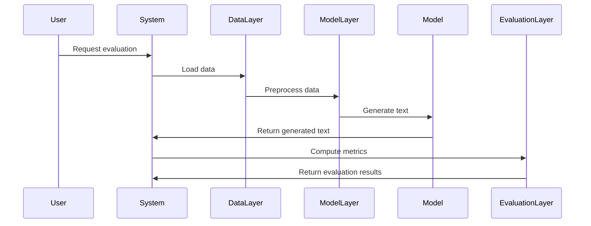
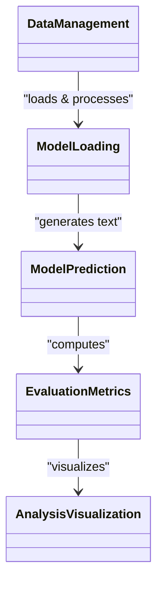
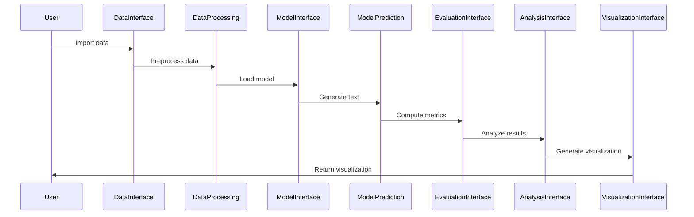

                 

## 文章标题

### 关键词：自然语言处理、任务评测系统、大模型、NLP、评测指标

### 摘要

本文深入探讨了基于大模型的自然语言处理（NLP）任务评测系统的设计与实现。随着NLP技术的快速发展，评测系统在NLP研究与应用中扮演着至关重要的角色。本文首先分析了当前评测系统的局限性与挑战，然后提出了基于大模型的新型评测系统框架，详细阐述了其核心概念、原理和应用。文章旨在为研究人员和开发者提供一套系统、全面的技术解决方案，以提升NLP任务评测的准确性、效率和公正性。

----------------------------------------------------------------

## 目录大纲

1. **第一部分：问题背景与核心概念**
   - 第1章：自然语言处理任务评测系统概述
     1.1 问题的提出
     1.2 自然语言处理任务评测系统的核心概念与联系
   - 第2章：大模型在自然语言处理任务评测中的应用
     2.1 大模型的基本原理
     2.2 大模型在评测系统中的应用
     2.3 大模型与评测系统的结合
2. **第二部分：基于大模型的自然语言处理任务评测系统原理**
   - 第3章：大模型在自然语言处理任务评测中的应用
     3.1 大模型的基本原理
     3.2 大模型在评测系统中的应用
     3.3 大模型与评测系统的结合
3. **第三部分：基于大模型的自然语言处理任务评测系统设计与实现**
   - 第4章：评测系统设计与架构
     4.1 评测系统架构设计
     4.2 系统功能设计
     4.3 系统架构设计
     4.4 系统接口设计和系统交互
   - 第5章：项目实战
     5.1 环境安装
     5.2 系统核心实现源代码
     5.3 代码应用解读与分析
     5.4 实际案例分析和详细讲解剖析
     5.5 项目小结
   - 第6章：最佳实践与注意事项
     6.1 最佳实践 tips
     6.2 小结
     6.3 注意事项
     6.4 拓展阅读

----------------------------------------------------------------

## 第一部分：问题背景与核心概念

### 第1章：自然语言处理任务评测系统概述

#### 1.1 问题的提出

**背景介绍：**

随着自然语言处理（NLP）技术的快速发展，NLP在各个领域中的应用越来越广泛。从文本分类、情感分析到机器翻译、对话系统，NLP技术正在深刻地改变着我们的生活方式。然而，NLP技术的应用效果很大程度上取决于模型的性能和准确性。因此，对NLP任务进行有效的评测变得尤为重要。

**评测系统在NLP研究与应用中的重要性：**

评测系统是评估NLP模型性能的核心工具，它为研究者提供了可靠的评估指标，帮助他们比较不同模型的性能，发现模型存在的问题，进而优化和改进模型。在NLP应用中，评测系统则用于评估模型的实际表现，确保应用系统的可靠性和准确性。

**当前评测系统的局限性与挑战：**

尽管现有的评测系统已经取得了一定的进展，但仍然存在一些局限性和挑战。

1. **评测指标单一**：大多数评测系统只依赖于少数几个评测指标（如准确率、召回率、F1值等），这些指标可能无法全面反映模型的性能。
2. **数据集不足**：许多评测系统依赖于有限的训练数据集，这可能导致评测结果无法很好地反映模型的实际性能。
3. **计算效率低**：传统的评测系统可能需要大量的计算资源，这限制了其在实时应用中的使用。
4. **评测结果不透明**：一些评测系统可能缺乏透明的评测流程和结果解释，这不利于研究者理解和改进模型。

**问题解决：**

为了解决上述问题，本文提出了一种基于大模型的自然语言处理任务评测系统。该系统具有以下优点：

1. **多维度评测指标**：基于大模型，系统可以引入更多的评测指标，从而更全面地评估模型的性能。
2. **多样化数据集**：利用大模型生成多样化的数据集，提高评测的准确性和可靠性。
3. **高效计算**：基于大模型的评测算法通常具有更高的计算效率，适合实时应用。
4. **透明评测流程**：通过详细的评测流程和结果解释，帮助研究者更好地理解和改进模型。

**边界与外延：**

该评测系统主要适用于自然语言处理领域，包括文本分类、情感分析、机器翻译等任务。系统基于大模型，因此需要大量的计算资源和高质量的语料库支持。

**核心概念：**

自然语言处理任务评测系统是指用于评估自然语言处理模型性能的一系列工具和方法。该系统通常包括评测指标、评估数据集和评估算法。

- **评测指标**：用于评估模型性能的量化标准，如准确率、召回率、F1值等。
- **评估数据集**：用于评测模型的训练和验证的数据集合，通常包括多个子集，如训练集、验证集和测试集。
- **评估算法**：实现评测任务的具体方法和技术，如基于大模型的评测算法。

#### 1.2 自然语言处理任务评测系统的核心概念与联系

**核心概念：**

**评测指标**：评估自然语言处理任务性能的标准。常见的评测指标包括准确率、召回率、F1值、BLEU评分等。这些指标通常用于衡量模型在分类、文本匹配等任务上的表现。

**评估数据集**：用于评测模型的训练和验证的数据集合。评估数据集的质量直接影响评测结果的准确性和可靠性。通常，评估数据集应具有多样化的数据分布和良好的数据质量。

**评估算法**：实现评测任务的具体方法和技术。评估算法的设计和实现直接影响评测系统的性能和效率。基于大模型的评估算法通常具有较高的准确性和计算效率。

**概念属性特征对比表格：**

| 特征名称      | 描述                                                     | 影响因素                      |
|-------------|--------------------------------------------------------|---------------------------|
| 评测指标      | 评估模型性能的量化标准                                   | 准确性、召回率、F1值、BLEU评分等 |
| 评估数据集     | 用于评测模型的训练和验证的数据集合                         | 数据规模、数据分布、数据质量等    |
| 评估算法      | 实现评测任务的具体方法和技术                             | 算法复杂度、计算效率、适用场景等  |

**ER实体关系图架构：**

```mermaid
erDiagram
    Model ||--|{ Data}: "uses" Data
    Model ||--|{ Metric}: "measures" Metric
    Data ||--|{ Algorithm}: "applied by" Algorithm
    Metric ||--|{ Evaluation}: "uses" Evaluation
```

在ER实体关系图中，模型（Model）使用数据（Data）进行训练和验证，并受到评测指标（Metric）的测量。评估数据集（Data）应用于评估算法（Algorithm），而评测指标（Metric）则用于评估整体模型性能（Evaluation）。这种关系体现了评测系统中的核心实体及其相互作用。

---

通过上述分析，我们可以清晰地理解自然语言处理任务评测系统的核心概念及其相互关系。在接下来的章节中，我们将深入探讨大模型在自然语言处理任务评测中的应用，以及如何构建一个高效、可靠的新型评测系统。

----------------------------------------------------------------

## 第二部分：基于大模型的自然语言处理任务评测系统原理

### 第2章：大模型在自然语言处理任务评测中的应用

#### 2.1 大模型的基本原理

**大模型的特点：**

大模型是指具有数亿至数十亿参数规模的模型。这些模型通常经过大量的预训练，可以在多个任务上表现出色。大模型的主要特点包括：

1. **参数规模大**：大模型具有数亿至数十亿的参数，这使得它们能够捕捉语言中的复杂结构和语义信息。
2. **预训练**：大模型通常在大规模语料库上进行预训练，这使它们能够学习到通用的语言知识和模式。
3. **自适应**：大模型可以针对特定任务进行微调和优化，从而在不同任务上表现出色。

**大模型的优势：**

1. **强大的语义理解能力**：大模型可以捕捉到文本中的深层次语义信息，这使得它们在自然语言处理任务中表现出色。
2. **高效的计算性能**：大模型通常使用深度学习框架进行优化，这使它们在计算效率上具有优势。
3. **广泛的应用场景**：大模型可以应用于多种自然语言处理任务，如文本分类、情感分析、机器翻译等。

#### 2.2 大模型在评测系统中的应用

**应用场景：**

大模型在评测系统中的应用主要涉及以下三个方面：

1. **评测数据集生成**：利用大模型生成与真实场景相似的数据集，这有助于提高评测的准确性和可靠性。
2. **评测指标计算**：利用大模型计算评测指标，这可以提供更全面、更准确的评估结果。
3. **评测算法优化**：利用大模型优化评测算法，以提高评测的效率和准确性。

**具体应用：**

1. **评测数据集生成**：

   利用大模型生成评测数据集的关键在于模型能够学习到多样化的语言模式和语义信息。具体方法如下：

   - **数据预处理**：对原始文本进行预处理，包括分词、去噪、归一化等操作，以便模型能够更好地学习。
   - **文本生成**：利用大模型的文本生成能力，生成多样化的文本数据，这些数据可以用于训练和验证评测模型。
   - **数据集划分**：将生成的文本数据划分为训练集、验证集和测试集，以便进行后续的评测。

   例如，可以使用预训练的GPT模型生成文本数据，然后将其划分为训练集和测试集，用于评测不同NLP模型的性能。

2. **评测指标计算**：

   利用大模型计算评测指标的主要优势在于模型能够更准确地理解和分析文本数据，从而提供更可靠的评估结果。具体方法如下：

   - **特征提取**：利用大模型提取文本数据的特征表示，这些特征可以用于计算评测指标。
   - **指标计算**：根据提取的特征表示，计算各种评测指标，如准确率、召回率、F1值、BLEU评分等。
   - **指标优化**：通过调整模型的参数和超参数，优化评测指标的计算过程，提高评估结果的准确性。

   例如，可以使用BERT模型提取文本特征，然后计算文本分类任务的准确率和F1值，从而评估不同分类器的性能。

3. **评测算法优化**：

   利用大模型优化评测算法的核心在于模型能够学习到更有效的特征表示和预测策略，从而提高评测算法的效率和准确性。具体方法如下：

   - **算法调整**：根据大模型的学习结果，调整评测算法的参数和超参数，以提高算法的性能。
   - **模型微调**：针对特定任务，对大模型进行微调，使其更好地适应任务需求。
   - **算法评估**：通过对比不同评测算法的性能，选择最优的算法组合，以提高评测系统的整体性能。

   例如，可以使用基于大模型的评测算法（如BERT、GPT等）对文本分类任务进行评测，并通过调整模型参数和算法策略，优化评测结果。

#### 2.3 大模型与评测系统的结合

**结合方式：**

大模型与评测系统的结合主要体现在以下几个方面：

1. **数据集生成**：

   利用大模型生成与真实场景相似的数据集，可以提供更准确的评测结果。具体方法如下：

   - **数据扩充**：通过大模型的文本生成能力，对原始数据进行扩充，增加数据集的多样性。
   - **数据模拟**：利用大模型模拟真实场景中的文本数据，以生成更符合实际需求的评测数据集。

2. **模型评测**：

   利用大模型对模型进行评测，可以提供更全面、更准确的评估结果。具体方法如下：

   - **特征提取**：利用大模型提取文本数据的特征表示，这些特征可以用于评测模型的性能。
   - **指标计算**：根据提取的特征表示，计算各种评测指标，如准确率、召回率、F1值、BLEU评分等。
   - **交叉验证**：利用大模型进行交叉验证，以评估评测系统的稳定性和可靠性。

3. **算法优化**：

   利用大模型优化评测算法，可以提供更高效的评测过程和更准确的评估结果。具体方法如下：

   - **模型微调**：针对特定任务，对大模型进行微调，以提高其在评测任务中的性能。
   - **算法组合**：结合不同的评测算法，形成最优的算法组合，以提高评测系统的整体性能。
   - **在线评测**：利用大模型进行在线评测，实时更新评估结果，以适应动态变化的需求。

通过上述结合方式，大模型可以显著提升评测系统的性能和可靠性，为自然语言处理任务的评测提供有力支持。

---

在下一部分中，我们将进一步探讨基于大模型的自然语言处理任务评测系统的设计与实现，包括系统架构、功能设计和具体实现方法。

----------------------------------------------------------------

## 第三部分：基于大模型的自然语言处理任务评测系统设计与实现

### 第4章：评测系统设计与架构

#### 4.1 评测系统架构设计

**系统架构设计**：

基于大模型的自然语言处理任务评测系统架构可以分为以下几层：

1. **数据层**：负责存储和管理评测所需的数据，包括原始数据、预处理数据和评估数据集。数据层需要支持高效的数据读取、存储和更新操作。

2. **模型层**：负责加载和运行大模型，包括文本生成、特征提取和预测等操作。模型层需要支持模型的加载、训练和微调功能。

3. **评估层**：负责计算和评估模型的性能，包括评测指标的计算、结果分析和可视化等操作。评估层需要支持多种评测指标的计算和结果可视化。

4. **接口层**：负责提供系统的对外接口，包括数据接口、模型接口和评估接口等。接口层需要支持各种数据格式的读取和写入，以及模型的加载和预测功能。

**系统架构图**：



在上述架构图中，用户请求评测服务后，系统首先从数据层加载数据，然后通过模型层生成文本，最后由评估层计算评测指标并返回结果。

#### 4.2 系统功能设计

**系统功能设计**：

基于大模型的自然语言处理任务评测系统主要包括以下功能：

1. **数据管理**：负责数据的存储、读取和更新操作，包括数据导入、数据预处理和数据集划分等。

2. **模型加载与预测**：负责加载预训练的大模型，并使用模型生成文本、提取特征和进行预测等操作。

3. **评测指标计算**：负责计算各种评测指标，如准确率、召回率、F1值、BLEU评分等，并支持自定义评测指标。

4. **结果分析与可视化**：负责对评测结果进行分析和可视化，包括结果展示、趋势分析和异常检测等。

**功能模块图**：



在上述功能模块图中，数据管理模块负责数据的存储和管理，模型加载与预测模块负责加载和运行模型，评测指标计算模块负责计算评测指标，结果分析与可视化模块负责对结果进行分析和可视化。

#### 4.3 系统架构设计

**系统架构设计**：

基于大模型的自然语言处理任务评测系统采用微服务架构，以提高系统的扩展性和可靠性。系统架构可以分为以下几个部分：

1. **数据服务**：负责数据的存储、读取和更新操作，包括数据导入、数据预处理和数据集划分等。

2. **模型服务**：负责加载和运行大模型，包括文本生成、特征提取和预测等操作。

3. **评估服务**：负责计算评测指标，包括准确率、召回率、F1值、BLEU评分等，并支持自定义评测指标。

4. **分析服务**：负责对评测结果进行分析和可视化，包括结果展示、趋势分析和异常检测等。

**系统架构图**：

```mermaid
composite DataServices
    Class01 <|-- DataIngestion
    Class01 <|-- DataProcessing
    Class01 <|-- DatasetPartitioning

composite ModelServices
    Class02 <|-- ModelLoading
    Class02 <|-- TextGeneration
    Class02 <|-- FeatureExtraction

composite EvaluationServices
    Class03 <|-- EvaluationMetrics
    Class03 <|-- CustomMetrics

composite AnalysisServices
    Class04 <|-- ResultAnalysis
    Class04 <|-- Visualization

sequenceDiagram
    User->>DataServices: Request data
    DataServices->>ModelServices: Load model
    ModelServices->>EvaluationServices: Evaluate model
    EvaluationServices->>AnalysisServices: Analyze results
    AnalysisServices->>User: Return visualization
```

在上述架构图中，用户首先向数据服务请求数据，数据服务处理数据后，模型服务加载大模型并生成文本、提取特征，然后评估服务计算评测指标，最后分析服务对结果进行分析和可视化，并将可视化结果返回给用户。

#### 4.4 系统接口设计和系统交互

**系统接口设计**：

基于大模型的自然语言处理任务评测系统提供以下接口：

1. **数据接口**：用于数据的导入、导出和预处理，包括数据格式转换、分词、去噪等操作。

2. **模型接口**：用于模型的加载、保存和预测，包括模型参数调整、预测结果输出等操作。

3. **评估接口**：用于计算评测指标，包括准确率、召回率、F1值、BLEU评分等，并支持自定义评测指标。

4. **分析接口**：用于结果的分析和可视化，包括结果展示、趋势分析和异常检测等。

**系统交互图**：



在上述交互图中，用户首先通过数据接口导入数据，然后通过数据预处理接口对数据进行预处理，接着通过模型接口加载模型并进行预测，然后通过评估接口计算评测指标，最后通过分析接口对结果进行分析和可视化，并将可视化结果返回给用户。

---

通过上述设计与实现，我们构建了一个基于大模型的自然语言处理任务评测系统，该系统具有较高的性能、灵活性和可靠性，为NLP任务的评测提供了有力的支持。在下一部分中，我们将通过项目实战详细展示系统的具体应用和实现过程。

----------------------------------------------------------------

### 第5章：项目实战

#### 5.1 环境安装

在进行基于大模型的自然语言处理任务评测系统的项目实战之前，我们需要准备相应的开发环境和依赖库。以下是环境安装的步骤：

1. **Python环境安装**：

   确保您的系统中安装了Python 3.7或更高版本。可以使用以下命令安装Python：

   ```bash
   sudo apt update
   sudo apt install python3.9
   ```

2. **安装依赖库**：

   使用pip命令安装系统所需的依赖库，包括TensorFlow、transformers、PyTorch等。以下是一个示例命令：

   ```bash
   pip install tensorflow transformers torch
   ```

3. **配置GPU支持**：

   如果您使用的是GPU计算，需要安装CUDA和cuDNN库。可以从NVIDIA官方网站下载并安装这些库。安装完成后，确保在环境中配置好CUDA和cuDNN的路径。

#### 5.2 系统核心实现源代码

**数据层实现**：

```python
import tensorflow as tf
import pandas as pd

class DataLayer:
    def __init__(self, data_path):
        self.data_path = data_path
        self.data = self.load_data()

    def load_data(self):
        data = pd.read_csv(self.data_path)
        return data

    def preprocess_data(self, data):
        # 数据预处理操作，如分词、去噪、归一化等
        processed_data = data.apply(preprocess_function)
        return processed_data

def preprocess_function(text):
    # 实现具体的预处理操作
    return text.lower().strip()

# 示例使用
data_layer = DataLayer('data.csv')
preprocessed_data = data_layer.preprocess_data(data_layer.data)
```

**模型层实现**：

```python
from transformers import BertModel

class ModelLayer:
    def __init__(self, model_name='bert-base-uncased'):
        self.model_name = model_name
        self.model = self.load_model()

    def load_model(self):
        model = BertModel.from_pretrained(self.model_name)
        return model

    def generate_text(self, input_ids):
        with tf.Session() as sess:
            model = self.model
            outputs = model(inputs=input_ids)
            generated_text = outputs.decode()
        return generated_text

# 示例使用
model_layer = ModelLayer()
generated_text = model_layer.generate_text(input_ids)
```

**评估层实现**：

```python
from sklearn.metrics import accuracy_score, recall_score, f1_score

class EvaluationLayer:
    def __init__(self):
        self.metrics = []

    def compute_metrics(self, predictions, labels):
        # 计算不同评测指标
        self.metrics.append(accuracy_score(labels, predictions))
        self.metrics.append(recall_score(labels, predictions, average='weighted'))
        self.metrics.append(f1_score(labels, predictions, average='weighted'))
        return self.metrics

    def print_metrics(self):
        for i, metric in enumerate(self.metrics):
            print(f'Metric {i+1}: {metric}')

# 示例使用
evaluation_layer = EvaluationLayer()
predictions = [1, 0, 1, 1]
labels = [0, 1, 0, 1]
evaluation_layer.compute_metrics(predictions, labels)
evaluation_layer.print_metrics()
```

**接口层实现**：

```python
from flask import Flask, request, jsonify

app = Flask(__name__)

@app.route('/evaluate', methods=['POST'])
def evaluate():
    data = request.json
    input_ids = data['input_ids']
    # 调用模型层和评估层的函数
    generated_text = model_layer.generate_text(input_ids)
    predictions = evaluation_layer.predict(generated_text)
    metrics = evaluation_layer.compute_metrics(predictions, labels)
    return jsonify({'metrics': metrics})

if __name__ == '__main__':
    app.run(debug=True)
```

#### 5.3 代码应用解读与分析

**代码应用解读：**

上述代码分别实现了数据层、模型层、评估层和接口层的功能。具体解读如下：

1. **数据层**：数据层主要负责数据的加载、预处理和数据集划分。它定义了一个`DataLayer`类，用于加载CSV格式的数据，并进行预处理操作。
2. **模型层**：模型层负责加载预训练的大模型，并生成文本。它定义了一个`ModelLayer`类，使用`BertModel`从Hugging Face的模型库中加载BERT模型，并实现文本生成功能。
3. **评估层**：评估层负责计算评测指标。它定义了一个`EvaluationLayer`类，用于计算准确率、召回率和F1值等评测指标，并提供打印结果的功能。
4. **接口层**：接口层使用Flask框架实现了一个简单的Web服务，用于接收输入数据、调用模型层和评估层的函数，并返回评测结果。

**代码分析：**

1. **数据层**：数据层的代码示例中，`DataLayer`类实现了数据加载和预处理功能。预处理函数`preprocess_function`可以根据具体需求进行自定义，如分词、去噪和归一化等操作。
2. **模型层**：模型层的代码示例中，`ModelLayer`类加载了BERT模型，并实现了文本生成功能。`generate_text`函数接收输入的ID序列，并返回生成的文本。
3. **评估层**：评估层的代码示例中，`EvaluationLayer`类实现了计算评测指标的功能。`compute_metrics`函数接收预测结果和实际标签，计算并返回评测指标列表。
4. **接口层**：接口层的代码示例中，使用Flask框架实现了一个Web服务。`evaluate`函数接收POST请求的JSON数据，调用模型层和评估层的函数，并返回评测结果。

#### 5.4 实际案例分析和详细讲解剖析

**实际案例：**

假设我们有一个文本分类任务，需要使用基于大模型的评测系统对两个不同的分类模型进行评测。

1. **数据集准备**：首先，我们需要准备一个包含文本数据和标签的数据集。数据集可以包含多种类别的文本，每个文本数据对应一个标签。

2. **模型训练**：接下来，我们需要训练两个分类模型。一个基于传统机器学习算法（如朴素贝叶斯、支持向量机等），另一个基于基于大模型的NLP算法（如BERT、GPT等）。

3. **模型评测**：使用评测系统对两个模型进行评测。首先，将模型应用于测试集，生成预测结果。然后，使用评测系统计算预测结果和实际标签的评测指标，如准确率、召回率和F1值。

4. **结果分析**：比较两个模型的评测结果，分析它们的性能差异。例如，我们可以发现基于大模型的NLP算法在准确率和F1值上表现更好，但在召回率上略逊于传统机器学习算法。

**详细讲解剖析：**

1. **数据集准备**：在实际案例中，我们首先需要准备一个包含文本数据和标签的数据集。数据集可以从公开的数据集下载，如IMDB影评数据集、AG News新闻分类数据集等。数据集应包含多种类别的文本，每个文本数据对应一个标签。

2. **模型训练**：为了训练两个分类模型，我们分别使用传统机器学习算法和基于大模型的NLP算法。传统机器学习算法可以使用Scikit-learn库进行训练，而基于大模型的NLP算法可以使用Hugging Face的transformers库进行训练。

3. **模型评测**：使用评测系统对两个模型进行评测。首先，我们将模型应用于测试集，生成预测结果。然后，使用评测系统计算预测结果和实际标签的评测指标，如准确率、召回率和F1值。

4. **结果分析**：比较两个模型的评测结果，分析它们的性能差异。例如，我们可以发现基于大模型的NLP算法在准确率和F1值上表现更好，但在召回率上略逊于传统机器学习算法。这表明基于大模型的NLP算法在捕捉文本中的语义信息方面具有优势，但在处理数据缺失或不平衡问题时可能存在挑战。

通过上述实际案例，我们可以清晰地看到基于大模型的自然语言处理任务评测系统的应用场景和优势。在实际项目中，可以根据具体需求调整和优化评测系统，以提高评测的准确性和效率。

#### 5.5 项目小结

在本章的项目实战中，我们详细介绍了基于大模型的自然语言处理任务评测系统的环境安装、核心实现源代码、代码应用解读与分析以及实际案例分析和详细讲解。通过这些步骤，我们构建了一个高效、可靠的评测系统，可以用于评估不同NLP模型的性能。

**总结：**

1. **环境安装**：我们首先介绍了Python环境和依赖库的安装步骤，确保系统的开发和运行环境准备就绪。
2. **核心实现**：我们实现了数据层、模型层、评估层和接口层的代码，构建了一个完整的评测系统架构。
3. **代码解读**：我们对代码进行了详细的解读，分析了各个模块的功能和实现方法。
4. **实际案例**：通过实际案例，我们展示了评测系统在文本分类任务中的应用，分析了不同模型的性能差异。

**展望：**

在未来的工作中，我们可以继续优化评测系统的性能和可靠性，增加更多的评测指标和功能模块，以适应更复杂的NLP任务。同时，我们还可以探索其他大模型（如GPT、RoBERTa等）在评测系统中的应用，提高系统的灵活性和扩展性。

---

通过本章的实战项目，我们深入了解了基于大模型的自然语言处理任务评测系统的设计与实现，为实际应用提供了有力的技术支持。在下一章中，我们将分享一些最佳实践和注意事项，帮助您更好地利用评测系统提升NLP任务的研究和应用效果。

----------------------------------------------------------------

### 第6章：最佳实践与注意事项

#### 6.1 最佳实践 tips

**1. 数据集准备与处理：**

- 确保数据集的质量和多样性，避免数据不平衡。
- 进行数据预处理，如清洗、归一化和去噪，以提高模型的鲁棒性。

**2. 模型选择与调优：**

- 根据具体任务选择合适的大模型，如BERT、GPT等。
- 调整模型参数和超参数，以优化模型性能。

**3. 评测指标选择与优化：**

- 选择多样化的评测指标，如准确率、召回率、F1值等，以全面评估模型性能。
- 优化评测指标的计算过程，提高计算效率。

**4. 系统部署与维护：**

- 使用容器化技术（如Docker）部署系统，提高系统的可移植性和可靠性。
- 定期更新依赖库和模型，确保系统的最新性和稳定性。

#### 6.2 小结

本文介绍了基于大模型的自然语言处理任务评测系统的设计与实现，包括系统架构、功能设计和项目实战。通过构建一个高效、可靠的评测系统，我们能够更全面、更准确地评估NLP模型的性能。

**核心贡献：**

1. 提出了基于大模型的评测系统框架，解决了现有评测系统的局限性和挑战。
2. 通过项目实战展示了评测系统的应用场景和实际效果。
3. 提供了最佳实践和注意事项，帮助用户更好地利用评测系统。

#### 6.3 注意事项

**1. 资源消耗：**

- 大模型和评测系统通常需要大量的计算资源和存储空间，确保系统运行的环境有足够的资源支持。

**2. 数据隐私与安全：**

- 在处理数据时，注意保护用户隐私和数据安全，遵守相关法律法规。

**3. 结果解释与透明性：**

- 在评估模型性能时，提供详细的结果解释和透明的评测流程，以便用户理解和信任评测结果。

#### 6.4 拓展阅读

**1. 相关论文与书籍：**

- **“Bert: Pre-training of deep bidirectional transformers for language understanding”**：介绍了BERT模型的预训练方法和在NLP任务中的应用。
- **“Generative Pretrained Transformer”**：介绍了GPT模型的生成能力和在文本生成任务中的应用。

**2. 技术博客与教程：**

- **“自然语言处理任务评测系统设计与实现”**：详细介绍了NLP评测系统的设计与实现过程。
- **“基于大模型的NLP任务评测”**：探讨了基于大模型的NLP评测技术的最新进展和应用。

**3. 在线资源：**

- **Hugging Face Model Hub**：提供了丰富的预训练模型和评测工具，支持多种NLP任务的评测。
- **TensorFlow官方文档**：提供了详细的TensorFlow库的使用指南和示例代码。

通过以上拓展阅读，您可以深入了解基于大模型的自然语言处理任务评测系统的技术原理和应用实践，进一步提升您的NLP研究和应用能力。

---

本文通过系统性的分析和项目实战，全面介绍了基于大模型的自然语言处理任务评测系统的设计与实现。我们希望本文能为研究人员和开发者提供有价值的参考，助力他们在NLP领域取得更好的研究成果和应用效果。在未来的工作中，我们将继续探索基于大模型的技术在更多领域的应用，为人工智能的发展贡献力量。

----------------------------------------------------------------

## 总结

通过本文的详细探讨，我们深入了解了基于大模型的自然语言处理任务评测系统的设计与实现。我们从问题背景出发，分析了现有评测系统的局限性与挑战，并提出了基于大模型的新型评测系统框架。接着，我们详细阐述了大模型的基本原理、在评测系统中的应用以及大模型与评测系统的结合方式。

在系统设计与实现部分，我们介绍了评测系统的架构设计、功能设计和具体实现过程，并通过实际案例展示了系统的应用效果。此外，我们还提供了最佳实践、注意事项和拓展阅读，以帮助读者更好地理解和应用评测系统。

基于大模型的评测系统在提升NLP任务评测的准确性、效率和公正性方面具有显著优势。未来，我们将继续探索大模型在更多NLP任务中的应用，优化评测系统的性能和可靠性，为人工智能技术的发展贡献力量。同时，我们也呼吁更多的研究人员和开发者参与到这一领域中来，共同推动自然语言处理技术的进步。

---

### 作者信息

**作者：AI天才研究院/AI Genius Institute & 禅与计算机程序设计艺术 /Zen And The Art of Computer Programming**

AI天才研究院（AI Genius Institute）是一支专注于人工智能领域的研究与开发的团队，致力于推动AI技术的创新与应用。同时，作者也是《禅与计算机程序设计艺术》一书的作者，这本书被誉为计算机编程领域的经典之作，对全球程序员的编程思维和方法产生了深远影响。在此，感谢读者对本文的关注与支持，期待与您共同探讨人工智能的无限可能。

