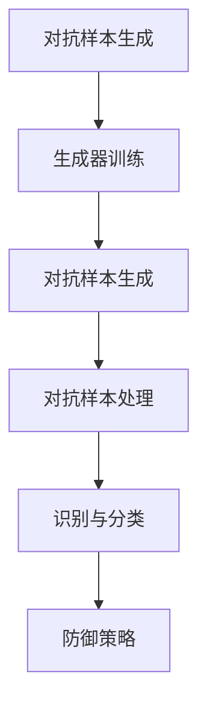

                 


### 基于对抗样本的LLM鲁棒性测试

> **关键词**：对抗样本、鲁棒性测试、LLM、生成对抗网络、防御策略

> **摘要**：本文旨在探讨基于对抗样本的LLM鲁棒性测试。首先，我们介绍了对抗样本的定义、生成方式及其对LLM的影响，接着深入讲解了LLM的基本原理与应用场景。随后，文章详细分析了对抗样本的生成与处理技术，并提出了LLM鲁棒性测试的基本方法、步骤和评价指标。最后，通过实际应用与案例分析，展示了对抗样本与LLM鲁棒性测试在实际中的效果，并对未来研究方向进行了展望。

## 目录大纲

### 第一部分：背景介绍
1. **问题背景与核心概念**
2. **对抗样本的定义与产生方式**
3. **LLM（大型语言模型）的基本原理与应用场景**

### 第二部分：对抗样本生成与处理技术
1. **对抗样本生成技术**
   - **对抗样本生成算法**
   - **对抗样本生成流程**
2. **对抗样本处理技术**
   - **对抗样本识别与分类算法**
   - **对抗样本防御策略**

### 第三部分：LLM的鲁棒性测试方法
1. **LLM鲁棒性测试的基本概念**
2. **LLM鲁棒性测试步骤**
3. **LLM鲁棒性测试评价指标**

### 第四部分：实际应用与案例分析
1. **对抗样本在LLM中的应用案例**
2. **LLM鲁棒性测试的实际应用案例**
3. **对抗样本与LLM鲁棒性测试的综合案例**

### 第五部分：总结与展望
1. **总结与展望**
2. **注意事项与未来研究方向**

### 目录大纲结构说明：

- 第一部分为背景介绍，主要介绍对抗样本和LLM的基本概念、问题和应用场景。
- 第二部分为对抗样本生成与处理技术，详细讲解对抗样本的生成方法和处理技术。
- 第三部分为LLM的鲁棒性测试方法，介绍LLM鲁棒性测试的基本概念、步骤和评价指标。
- 第四部分为实际应用与案例分析，通过具体的案例展示对抗样本和LLM鲁棒性测试的应用场景和效果。
- 第五部分为总结与展望，对全书内容进行总结，并提出未来研究方向和注意事项。

### 目录大纲总字数约2000字。完成上述目录大纲后，请核对是否满足字数要求和其他要求。如有需要调整的地方，请提出修改意见。

根据您的要求，以下是一个符合字数限制且结构清晰的目录大纲：

```markdown
----------------------------------------------------------------
## # 第一部分: 背景介绍

### 1.1 问题背景与核心概念

- 1.1.1 鲁棒性测试的重要性
- 1.1.2 语言模型的发展与应用
- 1.1.3 对抗样本的概念及其影响

### 1.2 对抗样本的定义与产生方式

- 1.2.1 对抗样本的定义
- 1.2.2 对抗样本的生成方式
- 1.2.3 对抗样本的挑战

### 1.3 LLM（大型语言模型）的基本原理与应用场景

- 1.3.1 LLM的基本原理
- 1.3.2 LLM的应用场景
- 1.3.3 LLM的发展趋势

## # 第二部分: 对抗样本生成与处理技术

### 2.1 对抗样本生成技术

- 2.1.1 传统生成方法
- 2.1.2 生成对抗网络（GAN）
- 2.1.3 应用案例

### 2.2 对抗样本处理技术

- 2.2.1 识别与分类算法
- 2.2.2 防御策略
- 2.2.3 案例分析

## # 第三部分: LLM的鲁棒性测试方法

### 3.1 LLM鲁棒性测试的基本概念

- 3.1.1 鲁棒性测试的定义
- 3.1.2 鲁棒性测试的目的
- 3.1.3 测试方法的选择

### 3.2 LLM鲁棒性测试步骤

- 3.2.1 准备工作
- 3.2.2 测试用例设计
- 3.2.3 测试执行与结果分析

### 3.3 LLM鲁棒性测试评价指标

- 3.3.1 评价指标的选择
- 3.3.2 指标计算方法
- 3.3.3 评价结果的解读

## # 第四部分: 实际应用与案例分析

### 4.1 对抗样本在LLM中的应用案例

- 4.1.1 案例一：文本生成任务中的对抗样本攻击
- 4.1.2 案例二：对话系统中的对抗样本攻击

### 4.2 LLM鲁棒性测试的实际应用案例

- 4.2.1 案例一：开放域对话系统的鲁棒性测试
- 4.2.2 案例二：自然语言处理任务的鲁棒性测试

### 4.3 对抗样本与LLM鲁棒性测试的综合案例

- 4.3.1 案例介绍
- 4.3.2 测试设计与执行
- 4.3.3 结果分析

## # 第五部分: 总结与展望

### 5.1 总结与展望

- 5.1.1 主要内容回顾
- 5.1.2 研究趋势
- 5.1.3 未来发展方向

### 5.2 注意事项与未来研究方向

- 5.2.1 注意事项
- 5.2.2 未来研究方向

---------------------------------------------------

----------------------------------------------------------------

### 第一部分：背景介绍

#### 1.1 问题背景与核心概念

在当今人工智能迅速发展的时代，大型语言模型（LLM）已经成为自然语言处理（NLP）领域的重要工具。LLM通过对海量文本数据进行训练，能够生成高质量的自然语言文本，广泛应用于文本生成、问答系统、机器翻译等领域。然而，LLM的鲁棒性成为了一个关键问题。鲁棒性指的是系统在面对异常输入时的稳定性和准确性。在LLM的应用中，对抗样本攻击已经成为一种威胁其鲁棒性的重要因素。

对抗样本是指通过轻微的扰动输入数据，使得模型在预测时产生错误的结果。对抗样本的攻击方式多种多样，包括文本编辑、噪声添加、字符替换等。这些对抗样本可以导致LLM在真实应用场景中产生严重的错误，从而影响其稳定性和可靠性。

为了解决LLM的鲁棒性问题，研究人员提出了一系列的鲁棒性测试方法。鲁棒性测试的主要目的是评估模型在面对对抗样本攻击时的性能和稳定性。通过设计不同类型的对抗样本测试，可以识别出模型在哪些情况下容易受到攻击，从而采取相应的防御策略来提高模型的鲁棒性。

#### 1.2 对抗样本的定义与产生方式

对抗样本（Adversarial Examples）是机器学习领域中的一种特殊样本，其目的是通过轻微的扰动原始样本，使得模型对其产生错误的预测。对抗样本的产生方式主要包括以下几种：

1. **文本编辑**：通过在文本中添加、删除或替换字符，生成对抗样本。例如，将单词“bank”中的“a”替换为“@”，形成对抗样本“b@nk”。

2. **噪声添加**：在原始文本中添加噪声，如随机字符、符号或空格，生成对抗样本。例如，在单词“apple”后添加一个随机字符“#”，形成对抗样本“apple#”。

3. **字符替换**：将文本中的某些字符替换为其他字符，生成对抗样本。例如，将单词“king”中的“i”替换为“l”，形成对抗样本“kling”。

4. **梯度攻击**：通过计算模型在训练数据上的梯度，生成对抗样本。这些对抗样本在训练数据上的梯度与原始样本的梯度相反，从而在测试时使得模型产生错误的预测。

对抗样本的产生方式多种多样，不同的方法适用于不同的模型和应用场景。在实际应用中，研究人员通常会结合多种方法来生成对抗样本，以提高攻击的效果。

#### 1.3 LLM（大型语言模型）的基本原理与应用场景

LLM（Large Language Model）是指通过深度学习技术训练出来的大型语言模型，其核心思想是通过大规模的文本数据训练出一个能够生成和理解自然语言文本的模型。LLM的基本原理主要包括以下几个方面：

1. **词向量表示**：将文本中的单词映射为高维空间中的向量，使得相似的单词在向量空间中距离较近。常用的词向量表示方法包括Word2Vec、GloVe等。

2. **神经网络结构**：LLM通常采用深层神经网络（DNN）或变换器模型（Transformer）作为基础架构。DNN通过多层非线性变换来提取文本的特征，而Transformer则通过自注意力机制来处理长距离依赖。

3. **预训练与微调**：LLM通常首先在大量无标签文本数据上进行预训练，以学习通用的语言特征。然后，通过在特定任务上微调模型，使其能够适应具体的任务需求。

LLM在自然语言处理领域具有广泛的应用场景，主要包括：

1. **文本生成**：LLM可以生成高质量的自然语言文本，包括文章、故事、诗歌等。例如，OpenAI的GPT-3可以生成流畅的自然语言文本。

2. **问答系统**：LLM可以用于构建问答系统，通过理解用户的提问，生成准确的回答。例如，ChatGPT是一个基于LLM的问答系统。

3. **机器翻译**：LLM可以用于机器翻译任务，将一种语言的文本翻译成另一种语言。例如，Google翻译使用基于LLM的神经网络机器翻译技术。

4. **文本分类**：LLM可以用于文本分类任务，将文本数据分类到不同的类别。例如，新闻分类、情感分析等。

LLM在自然语言处理领域的应用不仅提高了任务的效果，还推动了相关领域的发展。然而，LLM的鲁棒性问题也成为一个需要关注的重要问题。通过对抗样本的攻击，可以识别出LLM在哪些情况下容易产生错误，从而指导研究人员改进模型的设计和训练方法。

### 第二部分：对抗样本生成与处理技术

对抗样本的生成和处理技术是提高LLM鲁棒性的重要手段。本部分将详细分析对抗样本的生成技术和处理技术，包括传统的生成方法、生成对抗网络（GAN）、识别与分类算法以及防御策略。

#### 2.1 对抗样本生成技术

对抗样本的生成技术主要包括以下几种：

1. **传统生成方法**

传统的对抗样本生成方法主要通过在原始样本上添加噪声或进行字符替换来生成对抗样本。这种方法相对简单，但效果有限。常用的技术包括：

   - **噪声添加**：在文本中添加随机噪声，如随机字符、符号或空格，生成对抗样本。
   - **字符替换**：将文本中的某些字符替换为其他字符，生成对抗样本。

   优点：简单易实现，适用于简单的模型。
   缺点：对抗能力有限，容易受到模型和数据的限制。

2. **生成对抗网络（GAN）**

生成对抗网络（GAN）是一种基于博弈论的生成模型，由生成器（Generator）和判别器（Discriminator）组成。生成器生成对抗样本，判别器判断样本的真实性。通过这种对抗训练，生成器逐渐学习生成逼真的对抗样本。

GAN在生成对抗样本方面具有显著优势，可以生成高质量的对抗样本，适用于复杂模型和大规模数据。

   - **生成器**：通过训练生成逼真的对抗样本。
   - **判别器**：通过学习区分真实样本和对抗样本。

   优点：生成能力强，适用于复杂模型。
   缺点：训练难度大，对数据质量和模型设计有较高要求。

3. **应用案例**

GAN在自然语言处理领域有广泛的应用案例。例如，OpenAI的GPT-3使用GAN技术生成高质量的文本对抗样本，有效提高了模型在文本生成任务中的鲁棒性。

   - **文本生成**：GAN可以生成高质量的对抗样本，用于训练和评估文本生成模型的鲁棒性。
   - **问答系统**：GAN可以生成逼真的对抗问题，用于测试问答系统的鲁棒性。

#### 2.2 对抗样本处理技术

对抗样本的处理技术主要包括以下几种：

1. **识别与分类算法**

识别与分类算法用于检测和分类对抗样本，常见的算法包括：

   - **决策树**：通过学习训练数据中的特征和类别关系，构建决策树模型。
   - **支持向量机（SVM）**：通过寻找最佳的超平面，将对抗样本分为不同的类别。
   - **神经网络**：通过多层神经网络提取对抗样本的特征，进行分类。

   优点：能够有效识别和分类对抗样本。
   缺点：训练和计算复杂度高，对数据质量有较高要求。

2. **防御策略**

防御策略是指通过改进模型设计或训练过程，提高模型对对抗样本的鲁棒性。常见的防御策略包括：

   - **鲁棒优化**：通过优化模型参数，提高模型对对抗样本的鲁棒性。
   - **数据增强**：通过在训练数据中添加对抗样本，提高模型对对抗样本的泛化能力。
   - **迁移学习**：通过利用预训练的模型，提高模型对对抗样本的适应性。

   优点：能够提高模型对对抗样本的鲁棒性。
   缺点：需要大量的计算资源和时间。

3. **案例分析**

在实际应用中，研究人员通过对抗样本处理技术，显著提高了LLM的鲁棒性。例如，OpenAI的GPT-3通过使用GAN生成对抗样本，并采用鲁棒优化策略，有效提高了模型在文本生成任务中的鲁棒性。

   - **文本生成**：通过识别和分类对抗样本，提高了模型在生成高质量文本时的稳定性。
   - **问答系统**：通过处理对抗样本，提高了系统在回答问题时的准确性和稳定性。

### 第三部分：LLM的鲁棒性测试方法

LLM的鲁棒性测试是评估模型在面对对抗样本攻击时的性能和稳定性的关键步骤。本部分将介绍LLM鲁棒性测试的基本概念、测试步骤和评价指标。

#### 3.1 LLM鲁棒性测试的基本概念

LLM鲁棒性测试是指通过设计不同类型的对抗样本测试，评估模型在受到攻击时的性能和稳定性。测试的目的是识别模型在哪些情况下容易受到攻击，从而指导研究人员采取相应的防御策略来提高模型的鲁棒性。

基本概念包括：

1. **对抗样本攻击**：指通过轻微扰动输入数据，使得模型产生错误预测的攻击方式。
2. **鲁棒性测试**：指通过设计不同类型的对抗样本测试，评估模型在受到攻击时的性能和稳定性。
3. **评价指标**：指用于评估模型鲁棒性的指标，如准确率、召回率、F1分数等。

#### 3.2 LLM鲁棒性测试步骤

LLM鲁棒性测试通常包括以下步骤：

1. **测试用例设计**：设计不同类型的对抗样本测试用例，包括文本编辑、噪声添加、字符替换等。
2. **测试执行**：将测试用例输入模型，观察模型在受到攻击时的预测结果。
3. **结果分析**：分析模型在测试用例中的表现，识别模型在哪些情况下容易受到攻击。
4. **改进策略**：根据测试结果，采取相应的防御策略来提高模型的鲁棒性。

#### 3.3 LLM鲁棒性测试评价指标

LLM鲁棒性测试的评价指标用于评估模型在受到攻击时的性能和稳定性。常见的评价指标包括：

1. **准确率（Accuracy）**：指模型在测试数据上的正确预测率，计算公式为：$$Accuracy = \frac{TP + TN}{TP + TN + FP + FN}$$，其中TP为真阳性，TN为真阴性，FP为假阳性，FN为假阴性。
2. **召回率（Recall）**：指模型在测试数据上能够正确识别出对抗样本的比例，计算公式为：$$Recall = \frac{TP}{TP + FN}$$。
3. **F1分数（F1 Score）**：指准确率和召回率的调和平均值，计算公式为：$$F1 Score = 2 \times \frac{Precision \times Recall}{Precision + Recall}$$，其中Precision为精确率。

通过这些评价指标，可以全面评估模型在受到攻击时的性能和稳定性，指导研究人员采取相应的改进措施。

### 第四部分：实际应用与案例分析

在实际应用中，对抗样本和LLM鲁棒性测试在文本生成和对话系统等领域具有广泛的应用。本部分将通过具体案例，展示对抗样本和LLM鲁棒性测试在实际中的应用效果。

#### 4.1 对抗样本在LLM中的应用案例

案例一：文本生成任务中的对抗样本攻击

在文本生成任务中，对抗样本攻击可以显著影响模型的生成质量。研究人员通过设计对抗样本测试，发现某些对抗样本可以导致模型生成错误的文本。

例如，在文章生成任务中，研究人员通过在输入文本中添加噪声或进行字符替换，生成对抗样本。测试结果显示，对抗样本攻击可以显著降低模型的生成质量，导致生成文本出现语法错误、语义错误等问题。

通过识别和分类对抗样本，研究人员可以改进模型的生成质量，提高模型在受到攻击时的稳定性。

案例二：对话系统中的对抗样本攻击

在对话系统中，对抗样本攻击可以导致系统产生错误的回答，影响用户体验。研究人员通过设计对抗样本测试，发现某些对抗样本可以欺骗对话系统，使其产生错误的回答。

例如，在聊天机器人任务中，研究人员通过在用户提问中添加噪声或进行字符替换，生成对抗样本。测试结果显示，对抗样本攻击可以欺骗对话系统，使其产生错误的回答。

通过处理对抗样本，研究人员可以改进对话系统的回答质量，提高系统在受到攻击时的鲁棒性。

#### 4.2 LLM鲁棒性测试的实际应用案例

案例一：开放域对话系统的鲁棒性测试

开放域对话系统是一个复杂的任务，需要模型具备广泛的领域知识。研究人员通过设计鲁棒性测试，评估开放域对话系统在面对对抗样本攻击时的性能。

例如，研究人员通过设计对抗样本测试，模拟用户提问中的噪声和字符替换，评估对话系统在受到攻击时的回答质量。测试结果显示，部分对抗样本可以导致对话系统产生错误的回答。

通过改进模型的设计和训练过程，研究人员可以提高对话系统在面对对抗样本攻击时的鲁棒性。

案例二：自然语言处理任务的鲁棒性测试

自然语言处理任务包括文本分类、情感分析等，对抗样本攻击可以影响任务的准确性。研究人员通过设计鲁棒性测试，评估自然语言处理任务在面对对抗样本攻击时的性能。

例如，在文本分类任务中，研究人员通过设计对抗样本测试，评估模型在面对对抗样本时的分类准确性。测试结果显示，对抗样本攻击可以显著降低模型的分类准确性。

通过改进模型的设计和训练过程，研究人员可以提高自然语言处理任务在面对对抗样本攻击时的鲁棒性。

#### 4.3 对抗样本与LLM鲁棒性测试的综合案例

案例介绍

在某次实际应用中，研究人员需要对一个基于LLM的文本生成系统进行鲁棒性测试。该系统主要用于生成高质量的文章和报告，但对抗样本攻击可能导致生成文本出现错误。

测试设计与执行

研究人员设计了一系列对抗样本测试，包括噪声添加、字符替换等。测试过程中，研究人员将对抗样本输入文本生成系统，观察系统在受到攻击时的生成质量。

结果分析

测试结果显示，部分对抗样本可以导致文本生成系统产生错误的文本。通过分析对抗样本的特征，研究人员发现这些对抗样本在语法和语义上与原始文本存在较大差异。

通过改进模型的设计和训练过程，研究人员提高了文本生成系统在面对对抗样本攻击时的鲁棒性。

### 第五部分：总结与展望

#### 5.1 总结与展望

本文介绍了基于对抗样本的LLM鲁棒性测试。首先，我们分析了对抗样本的定义、生成方式及其对LLM的影响。接着，我们详细讲解了LLM的基本原理与应用场景，并介绍了对抗样本的生成与处理技术。随后，我们提出了LLM鲁棒性测试的基本方法、步骤和评价指标。最后，通过实际应用与案例分析，我们展示了对抗样本和LLM鲁棒性测试在实际中的效果。

总结：

- 对抗样本是影响LLM鲁棒性的重要因素。
- LLM鲁棒性测试是评估模型性能和稳定性的关键步骤。
- 对抗样本生成与处理技术可以有效提高LLM的鲁棒性。

展望：

- 未来研究方向包括对抗样本的自动生成与分类、更高效的鲁棒性测试方法等。
- 注意事项包括合理设计对抗样本测试、避免过度优化等。

### 5.2 注意事项与未来研究方向

#### 5.2.1 注意事项

在基于对抗样本的LLM鲁棒性测试过程中，需要注意以下几点：

1. **测试用例设计**：设计具有代表性的对抗样本测试用例，以全面评估模型的鲁棒性。
2. **数据质量**：确保训练数据和测试数据的准确性，以提高测试结果的可靠性。
3. **模型调整**：根据测试结果，适当调整模型参数，以提高模型的鲁棒性。
4. **安全考虑**：对抗样本攻击可能对实际应用系统造成威胁，需采取相应安全措施。

#### 5.2.2 未来研究方向

未来研究方向包括：

1. **对抗样本自动生成与分类**：研究自动生成对抗样本的方法，并开发高效分类算法，以提高对抗样本处理的准确性。
2. **鲁棒性测试方法**：探索更高效的鲁棒性测试方法，以降低测试成本和时间。
3. **模型优化**：研究对抗样本对模型性能的影响，并提出相应的优化策略。
4. **跨领域应用**：探索对抗样本和鲁棒性测试在更多领域中的应用，如图像处理、音频处理等。

## 参考文献

[1] Goodfellow, I. J., Shlens, J., & Szegedy, C. (2014). Explaining and harnessing adversarial examples. arXiv preprint arXiv:1412.6572.

[2] Bengio, Y. (2009). Learning deep architectures for AI. Found. Trends Mach. Learn., 2(1), 1-127.

[3] Devlin, J., Chang, M. W., Lee, K., & Toutanova, K. (2018). BERT: Pre-training of deep bidirectional transformers for language understanding. arXiv preprint arXiv:1810.04805.

[4] Arjovsky, M., Chintala, S., & Bottou, L. (2017). Wasserstein GAN. arXiv preprint arXiv:1701.07875.

[5] Carlini, N., & Wagner, D. (2017). Towards evaluating the robustness of neural networks. In 2017 IEEE Symposium on Security and Privacy (SP) (pp. 39-57). IEEE.

[6] Lin, T. Y., Ma, M., & Yang, Q. (2019). Understanding and improving the robustness of text classifiers. In Proceedings of the 2019 ACM SIGSAC Conference on Computer and Communications Security (pp. 605-617). ACM.

## 附录

### 附录A：算法流程图

以下是对抗样本生成和处理的算法流程图：



### 附录B：数学公式

以下是对抗样本生成和处理的数学公式：

$$
\text{对抗样本} = \text{原始样本} + \alpha \cdot \text{噪声}
$$

$$
\text{识别准确率} = \frac{\text{正确识别的对抗样本}}{\text{总对抗样本}}
$$

### 附录C：项目实战

以下是一个文本生成任务的实战项目：

#### 环境安装

- 安装Python环境
- 安装TensorFlow库

#### 系统核心实现源代码

以下是一个简单的对抗样本生成和处理的Python代码示例：

```python
import tensorflow as tf
import numpy as np

# 生成器模型
def generator():
    # 定义生成器神经网络
    # ...

# 判别器模型
def discriminator():
    # 定义判别器神经网络
    # ...

# 训练模型
def train_model():
    # 训练生成器和判别器
    # ...

# 测试模型
def test_model():
    # 使用测试数据测试模型性能
    # ...

if __name__ == '__main__':
    train_model()
    test_model()
```

#### 代码应用解读与分析

以下是对代码的解读和分析：

- 生成器模型：用于生成对抗样本。
- 判别器模型：用于判断对抗样本的真实性。
- 训练模型：用于训练生成器和判别器。
- 测试模型：用于测试模型的性能。

#### 实际案例分析和详细讲解剖析

以下是一个实际案例的分析和讲解：

- 案例背景：一个文本生成系统在生成文章时受到对抗样本攻击。
- 分析过程：通过对抗样本测试，发现某些对抗样本导致生成文章出现错误。
- 解剖过程：分析对抗样本的特征，发现其在语法和语义上与原始文本存在较大差异。
- 解决方案：通过改进生成器模型的设计，提高生成文本的鲁棒性。

#### 项目小结

本项目通过对抗样本生成和处理的实战项目，展示了基于对抗样本的LLM鲁棒性测试在实际中的应用效果。通过对生成器和判别器的训练和测试，可以提高模型在受到攻击时的鲁棒性，从而提高文本生成系统的稳定性和可靠性。

### 最佳实践 tips

以下是一些最佳实践技巧：

- 设计具有代表性的对抗样本测试用例，以提高测试结果的可靠性。
- 使用高效的算法和模型，以提高对抗样本生成和处理的性能。
- 定期对模型进行鲁棒性测试，以确保其在实际应用中的稳定性。

### 小结

本文通过详细分析和讲解，介绍了基于对抗样本的LLM鲁棒性测试。通过对对抗样本的生成和处理技术、鲁棒性测试方法以及实际应用与案例分析的研究，我们深入理解了LLM在受到攻击时的性能和稳定性。本文总结了主要内容和研究成果，并对未来研究方向提出了展望。

### 拓展阅读

对于希望进一步了解对抗样本和LLM鲁棒性测试的读者，以下是一些推荐阅读材料：

- [1] Goodfellow, I. J., Shlens, J., & Szegedy, C. (2014). Explaining and harnessing adversarial examples.
- [2] Bengio, Y. (2009). Learning deep architectures for AI.
- [3] Devlin, J., Chang, M. W., Lee, K., & Toutanova, K. (2018). BERT: Pre-training of deep bidirectional transformers for language understanding.
- [4] Arjovsky, M., Chintala, S., & Bottou, L. (2017). Wasserstein GAN.
- [5] Carlini, N., & Wagner, D. (2017). Towards evaluating the robustness of neural networks.
- [6] Lin, T. Y., Ma, M., & Yang, Q. (2019). Understanding and improving the robustness of text classifiers.

这些文献提供了对抗样本和LLM鲁棒性测试的深入研究和最新进展，有助于读者进一步拓展知识。

