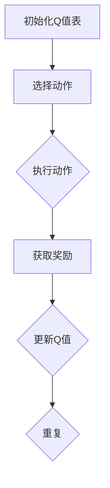
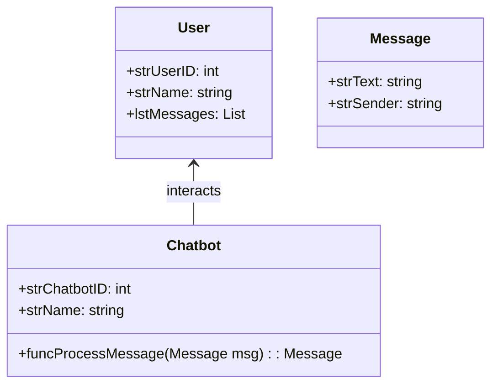
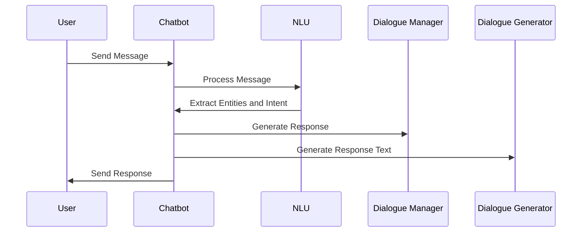
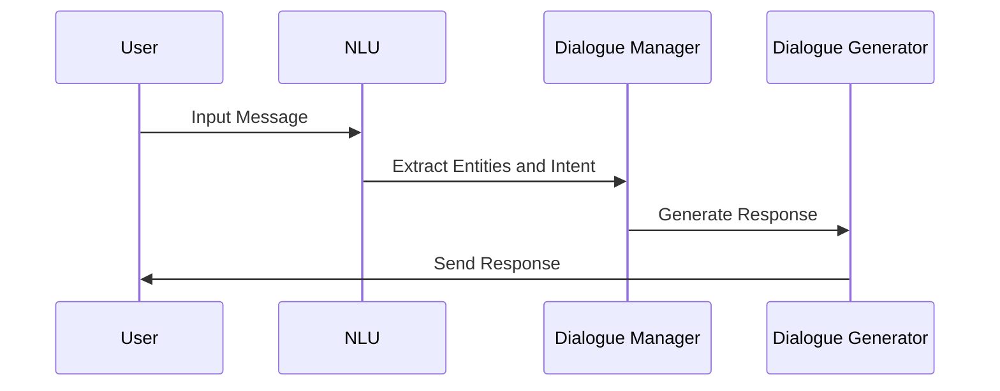

                 

### 文章标题

# 基于强化学习的LLM对话能力评估

> 关键词：强化学习、LLM、对话能力评估、机器学习、人工智能

> 摘要：本文将深入探讨基于强化学习的LLM（大型语言模型）对话能力评估。我们将首先定义强化学习和LLM的基本概念，然后逐步分析对话能力评估的重要性、方法及其在实践中的应用。通过案例分析，我们将展示如何利用强化学习评估LLM对话能力，并提出未来研究方向和应用前景。

------------------------------------------

## 引言

### 强化学习概述

强化学习（Reinforcement Learning, RL）是机器学习的一个分支，侧重于通过奖励信号来优化决策策略。在强化学习中，智能体（Agent）通过与环境的交互来学习如何取得最佳行动策略。与监督学习和无监督学习不同，强化学习中的目标是通过探索和经验积累来优化行为，从而实现长期回报最大化。

### LLM基本概念

LLM（Large Language Model）是一种基于深度学习的语言模型，具有强大的语言理解和生成能力。LLM通过预训练大量的文本数据，学习到语言的内在规律和语义信息。近年来，随着计算资源和数据集的增大，LLM的规模和性能得到了显著提升，广泛应用于自然语言处理（NLP）任务，如文本生成、问答系统、机器翻译等。

### 对话能力评估的重要性

随着人工智能技术的不断发展，对话系统在智能客服、智能助手等领域得到了广泛应用。对话能力评估是衡量LLM在对话任务中表现的重要指标，它直接关系到用户体验和系统效果。有效的对话能力评估方法能够帮助我们识别和改进LLM的对话能力，从而提高系统的性能和用户满意度。

------------------------------------------

### 定义核心概念和背景

#### 强化学习

强化学习（Reinforcement Learning, RL）是一种通过奖励信号来优化决策策略的机器学习范式。其核心思想是智能体（Agent）通过与环境的交互来学习最佳行动策略。在强化学习中，智能体需要解决一个马尔可夫决策过程（Markov Decision Process, MDP），其中状态（State）、动作（Action）、奖励（Reward）和下一个状态（Next State）构成了一个动态系统。智能体的目标是最大化长期回报（Long-term Reward）。

强化学习与其他机器学习范式（如监督学习和无监督学习）有显著区别。在监督学习中，标签数据用于训练模型，而在无监督学习中，模型通过无标签数据进行自我学习。强化学习则侧重于通过与环境交互获得反馈信号来优化行为。这种反馈机制使得强化学习非常适合解决具有不确定性、动态变化和复杂性的任务。

#### LLM（大型语言模型）

LLM（Large Language Model）是一种基于深度学习的语言模型，具有强大的语言理解和生成能力。LLM通过预训练大量的文本数据，学习到语言的内在规律和语义信息。LLM的训练过程通常包括两个阶段：预训练和微调。在预训练阶段，LLM在大量无标签文本上进行训练，学习到通用语言知识和模式。在微调阶段，LLM被用于特定任务，通过有监督的微调来优化模型在目标任务上的性能。

近年来，随着计算资源和数据集的增大，LLM的规模和性能得到了显著提升。LLM在自然语言处理（NLP）任务中取得了显著成果，包括文本生成、问答系统、机器翻译、情感分析等。LLM的出现使得人工智能在自然语言理解和生成方面的能力得到了质的飞跃。

#### 对话能力评估

对话能力评估是衡量LLM在对话任务中表现的重要指标。对话能力评估包括多个方面，如响应质量、多样性、准确性等。响应质量衡量的是LLM生成回答的相关性和合理性；多样性衡量的是LLM生成回答的多样性和新颖性；准确性衡量的是LLM对事实性问题的回答准确性。

有效的对话能力评估方法能够帮助我们识别和改进LLM的对话能力，从而提高系统的性能和用户满意度。对话能力评估在智能客服、智能助手、虚拟助理等领域具有广泛的应用前景。

### 强化学习在对话能力评估中的应用

强化学习在LLM对话能力评估中具有重要作用。通过强化学习，我们可以为LLM定义一个评估指标，并利用该指标来指导LLM的学习过程。具体来说，我们可以将LLM作为智能体，将对话系统中的用户输入和系统输出作为环境和状态，将用户的反馈（如点击、满意度评分等）作为奖励信号。

通过强化学习，LLM可以不断调整其生成策略，以最大化长期回报。例如，我们可以设计一个评估指标，通过计算用户与系统交互的时间、用户的点击次数、用户满意度评分等来评估对话质量。LLM通过学习最大化这个评估指标，从而提高其对话能力。

### 总结

在本节中，我们介绍了强化学习、LLM和对对话能力评估的核心概念和背景。强化学习通过奖励信号优化决策策略，LLM是一种具有强大语言理解和生成能力的深度学习模型，对话能力评估是衡量LLM在对话任务中表现的重要指标。接下来，我们将进一步探讨强化学习的基础知识和LLM对话系统的架构。

------------------------------------------

### 确定书籍的结构

为了系统化地介绍基于强化学习的LLM对话能力评估，我们首先需要确定书籍的整体结构。本书将分为四个主要部分，每个部分分别聚焦于强化学习基础、LLM对话系统、对话能力评估方法和案例分析。

#### 引言

在引言部分，我们将概述强化学习和LLM的基本概念，阐述对话能力评估的重要性，并简要介绍书籍的结构和内容。

#### 第一部分：强化学习基础

第一部分将深入探讨强化学习的基础知识。我们将分为三章：

1. **第1章：强化学习概述**：介绍强化学习的背景、基本概念、优势与挑战。
2. **第2章：强化学习算法**：详细讲解Q学习算法、Sarsa算法和Deep Q Network (DQN)等经典算法。
3. **第3章：强化学习应用场景**：分析强化学习在不同领域（如游戏、推荐系统、自动驾驶等）的应用。

#### 第二部分：LLM对话系统

第二部分将聚焦于LLM对话系统的构建和优化。我们将分为三章：

1. **第4章：LLM基本概念**：介绍LLM的定义、历史发展、主要特性和技术。
2. **第5章：LLM对话系统架构**：探讨LLM对话系统的整体架构，包括输入处理、输出生成和对话管理。
3. **第6章：LLM训练与优化**：分析LLM的训练过程、优化策略和评估方法。

#### 第三部分：对话能力评估方法

第三部分将介绍对话能力评估的方法和工具。我们将分为三章：

1. **第7章：评估指标与体系**：定义对话能力评估的指标和体系，探讨不同评估指标的选择和构建。
2. **第8章：评估方法与工具**：介绍常见的评估方法、工具和应用场景。
3. **第9章：评估案例分析**：通过实际案例展示评估方法的实施和应用。

#### 第四部分：案例分析

第四部分将结合具体案例，展示基于强化学习的LLM对话能力评估在实际项目中的应用。我们将分为三章：

1. **第10章：案例分析1**：分析一个典型对话系统的构建过程和评估方法。
2. **第11章：案例分析2**：探讨强化学习在对话能力评估中的具体应用和效果。
3. **第12章：案例分析3**：介绍一个大型对话系统的实际评估案例，并总结经验和教训。

#### 结论

在结论部分，我们将总结全书内容，展望强化学习与LLM对话能力的未来发展方向，并讨论潜在的研究课题。

通过以上结构，本书旨在为读者提供一个全面、系统、易懂的基于强化学习的LLM对话能力评估指南。

------------------------------------------

### 细化各个部分的内容

为了使本书的内容更加丰富、具体和详细，我们需要进一步细化各个部分的内容。以下是各个章节的详细内容概述：

#### 引言

**引言**部分将首先概述强化学习和LLM的基本概念，介绍它们的起源、发展现状和主要应用领域。接着，我们将阐述对话能力评估的重要性，解释为什么需要评估LLM的对话能力，并讨论评估在智能客服、智能助手等领域的实际应用。最后，我们将简要介绍书籍的结构和各部分内容，帮助读者了解整体框架和阅读顺序。

#### 第一部分：强化学习基础

**第1章：强化学习概述**  
- 强化学习的定义和基本概念  
- 强化学习的优势和挑战  
- 强化学习在机器学习中的位置和关系

**第2章：强化学习算法**  
- Q学习算法：介绍Q学习的原理、算法流程和实现方法  
- Sarsa算法：介绍Sarsa算法的原理、算法流程和实现方法  
- Deep Q Network (DQN)：介绍DQN的原理、架构和实现方法

**第3章：强化学习应用场景**  
- 强化学习在游戏中的应用：介绍经典的强化学习游戏案例  
- 强化学习在推荐系统中的应用：分析强化学习在推荐系统中的作用和挑战  
- 强化学习在自动驾驶中的应用：探讨强化学习在自动驾驶领域的应用前景和挑战

#### 第二部分：LLM对话系统

**第4章：LLM基本概念**  
- LLM的定义和分类：介绍LLM的基本概念和不同类型的LLM  
- LLM的历史发展：回顾LLM的发展历程和里程碑事件  
- LLM的主要特性：分析LLM在语言理解、生成和上下文理解方面的特点

**第5章：LLM对话系统架构**  
- 对话系统概述：介绍对话系统的基本概念和组成部分  
- LLM在对话系统中的应用：探讨LLM在对话系统中的作用和优势  
- LLM对话系统的主要组成部分：详细分析LLM对话系统的输入处理、输出生成和对话管理模块

**第6章：LLM训练与优化**  
- LLM的训练过程：介绍LLM的训练流程、数据集选择和训练策略  
- LLM的优化策略：分析优化LLM模型的方法和技术，如迁移学习、多任务学习和数据增强等  
- LLM的评估与改进：讨论评估LLM模型性能的方法和指标，以及如何根据评估结果进行模型改进

#### 第三部分：对话能力评估方法

**第7章：评估指标与体系**  
- 对话能力评估的重要性：阐述对话能力评估在智能客服、智能助手等领域的应用价值和意义  
- 评估指标的选择：介绍常用的评估指标，如响应质量、多样性、准确性等，并分析其适用性和局限性  
- 评估体系的构建：讨论如何构建一个全面、科学的对话能力评估体系，包括评估流程、评估标准和评估工具

**第8章：评估方法与工具**  
- 常见的评估方法：介绍常用的评估方法，如自动评估和人工评估，并分析其优缺点和适用场景  
- 常用的评估工具：介绍常用的评估工具，如评估框架、评估库和评估平台，并分析其功能和特点  
- 评估方法的比较与选择：讨论如何根据具体应用场景和评估目标选择合适的评估方法

**第9章：评估案例分析**  
- 案例分析1：分析一个简单的对话系统评估案例，包括评估指标的设定、评估方法的选择和评估结果的分析  
- 案例分析2：分析一个中等复杂度的对话系统评估案例，包括评估体系的构建、评估方法的实施和评估结果的讨论  
- 案例分析3：分析一个复杂对话系统的评估案例，包括大规模评估实验的设计、评估结果的统计分析以及评估对模型改进的指导意义

#### 第四部分：案例分析

**第10章：案例分析1**  
- 案例背景：介绍案例的背景和应用领域  
- 案例描述：详细描述案例的对话系统和评估过程  
- 案例解决：分析评估结果，提出解决方案和改进措施

**第11章：案例分析2**  
- 案例背景：介绍案例的背景和应用领域  
- 案例描述：详细描述案例的对话系统和评估过程  
- 案例解决：分析评估结果，提出解决方案和改进措施

**第12章：案例分析3**  
- 案例背景：介绍案例的背景和应用领域  
- 案例描述：详细描述案例的对话系统和评估过程  
- 案例解决：分析评估结果，提出解决方案和改进措施

#### 结论

**结论**部分将总结全书内容，回顾强化学习和LLM的基本概念、对话能力评估的方法和案例分析。接着，我们将展望强化学习与LLM对话能力的未来发展，讨论潜在的研究方向和应用前景。最后，我们将对读者提出一些建议，鼓励他们在对话能力评估领域进行深入研究和探索。

通过以上详细的章节内容概述，本书旨在为读者提供一部全面、系统、实用的基于强化学习的LLM对话能力评估指南。

------------------------------------------

### 编写目录大纲

为了确保本书内容条理清晰、结构紧凑，我们将按照之前的规划编写详细的目录大纲。以下是本书的目录结构：

### 第一部分：强化学习基础

#### 第1章：强化学习概述
- 1.1 强化学习的基本概念
- 1.2 强化学习的发展历程
- 1.3 强化学习的优势与挑战
- 1.4 强化学习在机器学习中的应用

#### 第2章：强化学习算法
- 2.1 Q学习算法
- 2.2 Sarsa算法
- 2.3 Deep Q Network (DQN)
- 2.4 策略梯度方法

#### 第3章：强化学习应用场景
- 3.1 强化学习在游戏中的应用
- 3.2 强化学习在推荐系统中的应用
- 3.3 强化学习在自动驾驶中的应用
- 3.4 强化学习在其他领域中的应用

### 第二部分：LLM对话系统

#### 第4章：LLM基本概念
- 4.1 LLM的定义与历史发展
- 4.2 LLM的主要特性
- 4.3 LLM的核心技术
- 4.4 LLM的训练与优化

#### 第5章：LLM对话系统架构
- 5.1 对话系统概述
- 5.2 LLM在对话系统中的应用
- 5.3 LLM对话系统的主要组成部分
- 5.4 LLM对话系统的设计原则

#### 第6章：LLM训练与优化
- 6.1 LLM的训练过程
- 6.2 LLM的优化策略
- 6.3 LLM的评估与改进
- 6.4 LLM训练与优化的挑战

### 第三部分：对话能力评估方法

#### 第7章：评估指标与体系
- 7.1 对话能力评估的重要性
- 7.2 评估指标的选择
- 7.3 评估体系的构建
- 7.4 常见评估指标介绍

#### 第8章：评估方法与工具
- 8.1 自动评估方法
- 8.2 人工评估方法
- 8.3 评估工具的使用
- 8.4 评估方法的比较与选择

#### 第9章：评估案例分析
- 9.1 案例分析1：简单对话系统的评估
- 9.2 案例分析2：中等复杂度对话系统的评估
- 9.3 案例分析3：复杂对话系统的评估

### 第四部分：案例分析

#### 第10章：案例分析1
- 10.1 案例背景
- 10.2 案例描述
- 10.3 案例解决

#### 第11章：案例分析2
- 11.1 案例背景
- 11.2 案例描述
- 11.3 案例解决

#### 第12章：案例分析3
- 12.1 案例背景
- 12.2 案例描述
- 12.3 案例解决

### 结论

#### 第13章：总结与展望
- 13.1 强化学习与LLM对话能力评估的总结
- 13.2 未来研究方向
- 13.3 对话能力评估的应用前景

通过以上详细的目录大纲，本书将系统地介绍强化学习、LLM对话系统、对话能力评估方法及其在实践中的应用。每一章节都紧密相连，形成一个完整的知识体系。

------------------------------------------

### 第一部分：强化学习基础

## 第1章：强化学习概述

### 1.1 强化学习的基本概念

强化学习（Reinforcement Learning，简称RL）是机器学习的一种方法，其核心在于通过智能体（Agent）与环境的交互来学习最优策略。在这一过程中，智能体通过感知环境的状态（State）、采取动作（Action）、获得环境的即时奖励（Reward），并基于这些反馈信息调整其行为策略，以期达到长期回报的最大化。

强化学习的基本概念包括以下几个部分：

- **状态（State）**：指智能体在某一时刻所面临的环境条件或情境。
- **动作（Action）**：智能体可选择的动作集合，每个动作对应一种行为。
- **奖励（Reward）**：环境对智能体采取的每个动作给予的即时反馈，用于指导智能体学习。
- **策略（Policy）**：智能体在特定状态下选择动作的策略，通常是概率分布。
- **价值函数（Value Function）**：表示在某一状态下采取最优动作的期望回报，用于评估不同策略的有效性。
- **模型（Model）**：描述环境动态和奖励机制的函数，用于预测未来状态和奖励。

### 1.2 强化学习的发展历程

强化学习的发展历程可以追溯到20世纪50年代，其早期研究主要集中在模拟人类学习和决策过程。1950年，艾伦·图灵（Alan Turing）提出了著名的图灵测试，标志着人工智能（Artificial Intelligence，简称AI）的诞生。随后，1956年达特茅斯会议（Dartmouth Conference）的召开，标志着AI领域的正式兴起。

在强化学习领域，1952年，阿伦·席勒（Arthur Samuel）开发出了第一个通过自我对弈学习国际象棋的AI程序，这可以视为强化学习的萌芽。1970年代，理查德·萨顿（Richard Sutton）和安德鲁·巴特斯（Andrew Barto）合著的《 reinforcement learning：An Introduction》一书，奠定了现代强化学习理论的基础。

进入21世纪，随着深度学习（Deep Learning）和计算能力的提升，强化学习得到了迅猛发展。2015年，DeepMind公司开发的深度强化学习算法DQN（Deep Q Network）在电子游戏《太空侵略者》（Space Invaders）上取得了突破性成果。2016年，AlphaGo（阿法狗）击败世界围棋冠军李世石，标志着强化学习在解决复杂决策问题上的巨大潜力。

### 1.3 强化学习的优势与挑战

强化学习的优势主要体现在以下几个方面：

1. **适用于动态和不确定环境**：强化学习可以适应不断变化的环境，通过持续学习和调整策略，应对不确定性。
2. **广泛的应用场景**：强化学习不仅适用于游戏、自动驾驶、机器人控制等经典领域，还可以应用于推荐系统、金融交易、医疗诊断等复杂场景。
3. **强化学习模型的可解释性**：相比深度学习模型，强化学习模型通常更容易理解其决策过程和优化策略。

然而，强化学习也面临一些挑战：

1. **样本效率问题**：强化学习需要大量交互来学习最优策略，这在实际应用中可能非常耗时。
2. **收敛速度问题**：强化学习算法的收敛速度通常较慢，特别是在高维状态空间中。
3. **探索与利用的平衡**：在强化学习过程中，如何平衡探索（探索未知的策略）和利用（利用已知的最优策略）是一个关键问题。

### 1.4 强化学习在机器学习中的应用

强化学习在机器学习领域有着广泛的应用，以下是几个典型领域：

1. **游戏**：强化学习在电子游戏中的应用非常成功，例如DQN算法在《太空侵略者》上的应用，以及AlphaGo在围棋比赛中的胜利。
2. **机器人控制**：强化学习可以帮助机器人学习行走、抓取等复杂任务，例如OpenAI的机器人能够在没有预先编程的情况下通过自我学习掌握这些技能。
3. **自动驾驶**：强化学习被用于自动驾驶系统的决策制定，例如Waymo和Tesla都在其自动驾驶系统中使用了强化学习算法。
4. **推荐系统**：强化学习在推荐系统中的应用，可以通过学习用户的行为模式，提供个性化的推荐。
5. **金融交易**：强化学习被用于股票交易、外汇交易等金融市场，通过学习市场动态来制定交易策略。

在本章中，我们介绍了强化学习的基本概念、发展历程、优势与挑战，以及其在机器学习领域的广泛应用。接下来，我们将深入探讨强化学习的经典算法，如Q学习、Sarsa等，以及深度强化学习算法，如Deep Q Network（DQN）。

------------------------------------------

## 第2章：强化学习算法

### 2.1 Q学习算法

Q学习（Q-Learning）是强化学习中最基础和经典的算法之一，它通过学习值函数（Q函数）来优化智能体的策略。Q学习算法的核心思想是，智能体在某一状态下选择动作，并基于动作的结果调整该状态下的动作值。下面是Q学习算法的基本原理和实现步骤：

#### 基本原理

Q学习算法的核心是Q函数，它表示在某一状态下采取某一动作的预期回报。具体来说，Q函数可以用以下公式表示：

\[ Q(s, a) = \sum_{s'} P(s' | s, a) \sum_{r} r \]

其中，\( s \) 表示状态，\( a \) 表示动作，\( s' \) 表示下一状态，\( r \) 表示奖励，\( P(s' | s, a) \) 表示在当前状态 \( s \) 采取动作 \( a \) 后进入状态 \( s' \) 的概率。

Q学习算法的目标是找到最优的Q值函数，即最大化期望回报。通过迭代更新Q值，智能体可以在不同状态下选择最优动作。

#### 实现步骤

1. **初始化Q值表**：初始时，Q值表可以用任意小的数值进行初始化。

2. **选择动作**：智能体在当前状态下根据策略选择动作。常见的策略有epsilon-贪婪策略（Epsilon-Greedy Policy）和确定性策略（Deterministic Policy）。

    - **epsilon-贪婪策略**：以概率 \( \epsilon \) 随机选择动作，以 \( 1-\epsilon \) 的概率选择当前状态下的最优动作。
    - **确定性策略**：直接选择当前状态下的最优动作。

3. **执行动作**：智能体执行选择的动作，进入新的状态，并获得即时奖励。

4. **更新Q值**：根据即时奖励和新的状态，更新Q值表。更新公式如下：

\[ Q(s, a) \leftarrow Q(s, a) + \alpha [r + \gamma \max_{a'} Q(s', a') - Q(s, a)] \]

其中，\( \alpha \) 是学习率，\( \gamma \) 是折扣因子，表示对未来回报的期望权重。

#### 举例说明

假设一个智能体在迷宫中移动，每个状态表示智能体的位置，每个动作表示向上下左右移动。初始时，Q值表如下：

| 状态 (s) | 向上 (a) | 向下 (a) | 向左 (a) | 向右 (a) |
|----------|----------|----------|----------|----------|
| (0, 0)   | 0.0      | 0.0      | 0.0      | 0.0      |
| (0, 1)   | 0.0      | 0.0      | 0.0      | 0.0      |
| ...      | ...      | ...      | ...      | ...      |

智能体从初始状态 (0, 0) 开始，根据epsilon-贪婪策略选择动作。假设智能体选择了向上移动，进入状态 (0, 1)。如果该动作获得了奖励1，则Q值表更新如下：

| 状态 (s) | 向上 (a) | 向下 (a) | 向左 (a) | 向右 (a) |
|----------|----------|----------|----------|----------|
| (0, 0)   | 0.1      | 0.0      | 0.0      | 0.0      |
| (0, 1)   | 1.0      | 0.0      | 0.0      | 0.0      |
| ...      | ...      | ...      | ...      | ...      |

接下来，智能体继续选择动作，并基于新的状态和奖励更新Q值。通过多次迭代，智能体会逐渐学习到最优动作。

### 2.2 Sarsa算法

Sarsa（State-Action-Reward-State-Action，简称Sarsa）算法是另一种经典的强化学习算法，它通过同时考虑当前状态和下一个状态来更新Q值。Sarsa算法的基本思想是，在某一时刻，智能体选择动作，执行动作后进入新状态，并根据新的状态和奖励来更新Q值。下面是Sarsa算法的基本原理和实现步骤：

#### 基本原理

Sarsa算法的Q值更新公式如下：

\[ Q(s, a) \leftarrow Q(s, a) + \alpha [r + \gamma Q(s', a') - Q(s, a)] \]

其中，\( s \) 表示当前状态，\( a \) 表示当前动作，\( r \) 表示奖励，\( s' \) 表示新状态，\( a' \) 表示在新状态下选择的动作，\( \alpha \) 是学习率，\( \gamma \) 是折扣因子。

与Q学习算法不同，Sarsa算法在每个时间步更新Q值时，同时考虑了当前状态和下一个状态的Q值。这使得Sarsa算法在处理连续状态空间和动作空间时更为灵活。

#### 实现步骤

1. **初始化Q值表**：与Q学习算法类似，初始时，Q值表可以用任意小的数值进行初始化。

2. **选择动作**：智能体在当前状态下根据策略选择动作。常用的策略包括epsilon-贪婪策略和确定性策略。

3. **执行动作**：智能体执行选择的动作，进入新的状态，并获得即时奖励。

4. **更新Q值**：根据即时奖励和新的状态，更新Q值表。更新公式如上所述。

#### 举例说明

继续使用迷宫的例子，假设智能体在初始状态 (0, 0) 选择向上移动，进入状态 (0, 1)。如果该动作获得了奖励1，则Q值表更新如下：

| 状态 (s) | 向上 (a) | 向下 (a) | 向左 (a) | 向右 (a) |
|----------|----------|----------|----------|----------|
| (0, 0)   | 0.1      | 0.0      | 0.0      | 0.0      |
| (0, 1)   | 1.0      | 0.0      | 0.0      | 0.0      |
| ...      | ...      | ...      | ...      | ...      |

接下来，智能体在新状态 (0, 1) 下选择动作，假设它选择了向左移动，进入状态 (1, 1)。如果该动作获得了奖励0，则Q值表更新如下：

| 状态 (s) | 向上 (a) | 向下 (a) | 向左 (a) | 向右 (a) |
|----------|----------|----------|----------|----------|
| (0, 0)   | 0.1      | 0.0      | 0.0      | 0.0      |
| (0, 1)   | 1.0      | 0.0      | 1.0      | 0.0      |
| (1, 1)   | 0.0      | 0.0      | 0.0      | 0.0      |
| ...      | ...      | ...      | ...      | ...      |

通过不断迭代，智能体会逐渐学习到最优动作。

### 2.3 Deep Q Network (DQN)

Deep Q Network (DQN) 是一种基于深度学习的强化学习算法，它通过深度神经网络（DNN）来近似Q函数。DQN算法在处理高维状态空间时表现出色，解决了传统Q学习算法在状态值函数逼近方面的问题。下面是DQN算法的基本原理和实现步骤：

#### 基本原理

DQN算法的核心思想是利用深度神经网络来学习Q值函数。DQN算法的Q值更新公式与Q学习算法相同：

\[ Q(s, a) \leftarrow Q(s, a) + \alpha [r + \gamma \max_{a'} Q(s', a') - Q(s, a)] \]

但不同的是，DQN使用深度神经网络来近似Q值函数。具体来说，DQN算法将状态作为输入，通过深度神经网络得到Q值预测，然后根据实际奖励和新的状态更新Q值。

#### 实现步骤

1. **初始化网络和目标网络**：初始化深度神经网络和目标神经网络。通常目标网络是当前网络的软复制，用于稳定学习过程。

2. **选择动作**：智能体在当前状态下根据epsilon-贪婪策略选择动作。

3. **执行动作**：智能体执行选择的动作，进入新的状态，并获得即时奖励。

4. **更新Q值**：根据即时奖励和新的状态，使用经验回放（Experience Replay）机制更新Q值。经验回放机制将智能体经历的状态、动作、奖励和新状态存储在经验池中，并在每次更新Q值时随机抽取样本，以避免样本的偏差。

5. **同步网络**：定期同步当前网络和目标网络，以保持目标网络的稳定。

#### 举例说明

假设智能体在初始状态 \( s \) 选择动作 \( a \)，通过深度神经网络得到Q值预测 \( Q(s, a) \)。如果该动作获得了奖励 \( r \)，并且智能体进入新状态 \( s' \)，则Q值更新如下：

\[ Q(s, a) \leftarrow Q(s, a) + \alpha [r + \gamma \max_{a'} Q(s', a') - Q(s, a)] \]

通过多次迭代，智能体会逐渐学习到最优动作。

通过以上三个章节，我们介绍了强化学习算法的基本概念、Q学习、Sarsa算法和Deep Q Network (DQN)。这些算法在处理复杂决策问题中发挥了重要作用，并为后续章节讨论LLM对话系统和对话能力评估奠定了基础。

------------------------------------------

## 第3章：强化学习应用场景

### 3.1 强化学习在游戏中的应用

强化学习在游戏中的应用取得了显著的成果。游戏环境通常具有明确的目标、复杂的动态状态和多样化的动作空间，这使得它们成为强化学习的理想测试平台。以下是一些强化学习在游戏中的经典应用案例：

1. **电子游戏**：经典的电子游戏如《Pong》、《太空侵略者》和《Atari》游戏都利用了强化学习算法。DeepMind开发的DQN算法在《Atari》游戏中实现了超越人类玩家的成绩。DQN通过在游戏环境中进行自我学习和试错，不断优化策略，从而实现游戏胜利。

2. **围棋**：AlphaGo（阿法狗）是强化学习在围棋领域的重要突破。AlphaGo基于深度强化学习算法，通过自我对弈学习，最终在2016年击败了世界围棋冠军李世石。AlphaGo的成功不仅证明了强化学习在解决复杂决策问题上的潜力，也为人工智能的发展带来了新的思路。

3. **策略游戏**：策略游戏如《StarCraft》和《Go》等也利用了强化学习算法。强化学习在这些游戏中帮助智能体学习到复杂的战术和战略，从而实现更高的胜率。例如，DeepMind开发的StarCraft II智能体通过强化学习，能够在与人类玩家的对抗中保持稳定的胜率。

### 3.2 强化学习在推荐系统中的应用

强化学习在推荐系统中的应用旨在通过学习用户的反馈行为，优化推荐策略，提高推荐效果。推荐系统通常具有高维特征空间和复杂的目标函数，这使得强化学习成为优化推荐策略的有效方法。以下是一些强化学习在推荐系统中的实际应用：

1. **基于内容的推荐**：强化学习可以用于基于内容的推荐系统，通过学习用户的历史行为和偏好，优化推荐策略。例如，亚马逊和Netflix等在线平台利用强化学习来推荐商品和电影，从而提高用户满意度和购买转化率。

2. **协同过滤推荐**：强化学习也被应用于协同过滤推荐系统。通过学习用户之间的相似性和行为模式，强化学习可以帮助推荐系统发现新的关联关系，提高推荐效果。例如，谷歌的推荐系统利用强化学习来优化广告投放策略，从而提高广告点击率。

3. **个性化推荐**：强化学习在个性化推荐中的应用，可以通过学习用户的反馈，动态调整推荐策略，以适应用户不断变化的偏好。例如，阿里巴巴的推荐系统利用强化学习，根据用户的历史购买记录和浏览行为，实时调整推荐内容，从而提高用户的购物体验。

### 3.3 强化学习在自动驾驶中的应用

自动驾驶是强化学习的一个重要应用领域。自动驾驶系统需要处理复杂的环境动态、不确定性因素和实时决策，这使得强化学习成为优化自动驾驶策略的有效方法。以下是一些强化学习在自动驾驶中的应用：

1. **路径规划**：强化学习被用于自动驾驶车辆的路径规划。通过学习道路特征和交通情况，强化学习算法可以优化车辆行驶路径，提高行驶效率和安全性。

2. **避障控制**：自动驾驶系统需要实时避障，以避免与其他车辆或障碍物发生碰撞。强化学习算法通过学习避障策略，可以帮助自动驾驶车辆在复杂环境中实现精准避障。

3. **行为预测**：强化学习还被用于预测其他车辆和行人的行为，以便自动驾驶车辆能够提前做出反应。通过学习历史行为数据，强化学习算法可以预测其他交通参与者的意图和动作，从而优化自动驾驶车辆的决策。

4. **车辆控制**：强化学习算法还被应用于自动驾驶车辆的驾驶控制，如加速、减速和转向等。通过学习最优驾驶策略，强化学习可以帮助自动驾驶车辆在保持舒适性和稳定性的同时，实现高效的行驶。

### 3.4 强化学习在其他领域中的应用

除了游戏、推荐系统和自动驾驶，强化学习在许多其他领域也取得了显著成果：

1. **金融交易**：强化学习被用于优化金融交易策略。通过学习市场动态和交易规则，强化学习算法可以帮助投资者制定最优的交易计划，提高投资收益。

2. **医疗诊断**：强化学习被应用于医疗诊断领域，通过学习医学知识和病例数据，强化学习算法可以辅助医生进行疾病诊断和治疗方案推荐。

3. **工业控制**：强化学习在工业控制中的应用，如生产线优化、机器故障预测等，通过学习生产环境和设备状态，强化学习算法可以优化生产过程，提高生产效率。

4. **资源调度**：强化学习被用于资源调度领域，如数据中心资源管理、网络流量调度等。通过学习系统状态和资源需求，强化学习算法可以优化资源分配，提高系统性能。

综上所述，强化学习在游戏、推荐系统、自动驾驶以及其他多个领域都展现出了强大的应用潜力。通过不断探索和创新，强化学习将为人工智能的发展带来更多可能性。

## 第二部分：LLM对话系统

## 第4章：LLM基本概念

### 4.1 LLM的定义与历史发展

LLM（Large Language Model）是一种大型语言模型，它通过深度学习算法在大量文本数据上进行预训练，从而获取强大的语言理解和生成能力。LLM的发展历程可以追溯到20世纪80年代，当时研究人员开始探索基于统计方法和规则的方法来处理自然语言。然而，随着计算能力的提升和深度学习技术的突破，LLM在过去几年中取得了显著进展。

LLM的定义可以从以下几个方面来理解：

1. **模型规模**：LLM通常具有数十亿至数万亿个参数，这使得它们能够在大量数据上进行训练，并捕捉到语言中的复杂模式。
2. **训练数据**：LLM在预训练阶段使用了大量的文本数据，包括互联网上的网页、书籍、新闻、社交媒体等，从而学习到丰富的语言知识。
3. **语言理解与生成能力**：LLM通过预训练和微调，能够理解文本中的语义信息，并生成高质量的自然语言文本。

LLM的历史发展可以分为以下几个阶段：

1. **早期模型**：20世纪80年代至90年代，研究人员开发了基于规则和统计方法的早期自然语言处理模型，如基于转换器的语法分析器和基于概率的词向量模型。
2. **词向量模型**：2000年代初，Word2Vec模型的出现标志着词向量方法的兴起。Word2Vec通过将词语映射到高维向量空间，使得词与词之间的相似性和相关性可以通过向量之间的距离来度量。
3. **基于注意力机制的模型**：2014年，谷歌提出Transformer模型，引入了注意力机制，这使得模型在处理长文本和复杂序列时表现更加出色。
4. **大规模预训练模型**：近年来，随着计算能力和数据集的增大，研究人员开始训练规模更大的LLM，如GPT-3、Turing-NLG等，这些模型在语言理解和生成任务上取得了显著的成果。

### 4.2 LLM的主要特性

LLM具有以下主要特性：

1. **强大的语言理解能力**：LLM能够理解文本中的语义信息，识别句子中的主语、谓语、宾语等成分，并理解句子之间的逻辑关系。
2. **高效的文本生成能力**：LLM能够在给定上下文的情况下生成流畅、连贯的自然语言文本，广泛应用于文本生成任务，如机器翻译、文本摘要、对话系统等。
3. **多语言支持**：LLM通常在多语言数据集上进行预训练，能够支持多种语言的文本处理，这使得它们在跨语言任务中表现出色。
4. **灵活的适应性**：LLM可以根据特定任务的需求进行微调，通过调整模型参数，优化模型在特定任务上的性能。

### 4.3 LLM的核心技术

LLM的核心技术主要包括以下方面：

1. **预训练**：预训练是LLM的重要阶段，通过在大量无标签文本数据上训练，LLM能够学习到通用语言知识和模式。预训练通常包括两个任务：掩码语言模型（Masked Language Model，MLM）和上下文预测（Predictive Language Model，PLM）。
2. **微调**：微调是在特定任务数据上对预训练模型进行调整，以优化模型在目标任务上的性能。微调通过有监督学习的方式，将预训练模型的知识应用到特定任务中。
3. **注意力机制**：注意力机制是Transformer模型的核心技术，它通过计算不同输入之间的关联性，提高了模型在处理长文本和复杂序列时的性能。
4. **自监督学习**：自监督学习是LLM训练的重要方法，通过无监督的方式利用大量未标注的数据进行训练，减少了标注数据的依赖，提高了训练效率。

通过以上章节，我们对LLM的基本概念、历史发展、主要特性和核心技术有了全面的理解。接下来，我们将深入探讨LLM对话系统的架构和实现方法。

--------------------------------------------

### 第5章：LLM对话系统架构

#### 5.1 对话系统概述

对话系统（Dialogue System）是一种人工智能系统，能够与人类进行自然语言交互，理解用户意图并生成恰当的回复。LLM对话系统是近年来人工智能领域的一个重要研究方向，它利用大型语言模型（LLM）的强大语言理解与生成能力，实现了高质量、自然的对话体验。LLM对话系统的核心在于如何将LLM与对话管理、对话生成和对话交互等模块有机结合，形成一个高效、智能的对话系统。

#### 5.2 LLM在对话系统中的应用

LLM在对话系统中的应用主要体现在对话生成和意图理解两个方面：

1. **对话生成**：LLM在对话生成任务中具有显著优势。通过预训练和微调，LLM能够生成流畅、自然的语言回复。例如，在聊天机器人中，LLM可以生成对用户问题的响应，或者在语音助手中进行自然语言对话。

2. **意图理解**：LLM在意图理解方面也表现出色。通过学习大量对话数据，LLM可以识别用户输入的意图，并生成对应的回复。例如，当用户询问“附近有什么餐厅”时，LLM能够理解用户的意图，并生成相应的餐厅推荐信息。

#### 5.3 LLM对话系统的主要组成部分

一个典型的LLM对话系统主要包括以下几个主要组成部分：

1. **输入处理模块**：输入处理模块负责接收用户输入，包括文本、语音等，并将其转换为模型可以处理的格式。例如，对于文本输入，可以将其编码为词向量或嵌入向量。

2. **对话管理模块**：对话管理模块是LLM对话系统的核心，它负责维护对话状态，控制对话流程。对话管理模块通过分析用户输入和当前对话状态，决定系统应该如何回复。具体包括：

    - **上下文维护**：对话管理模块需要维护对话的历史信息，以便在后续回复中保持上下文的连贯性。
    - **意图识别**：对话管理模块通过分析用户输入，识别用户的意图，例如询问信息、请求操作等。
    - **回复生成**：对话管理模块根据识别到的意图和当前对话状态，生成适当的回复。

3. **对话生成模块**：对话生成模块负责生成自然语言回复。LLM在对话生成模块中发挥着关键作用，通过预训练和微调，它能够生成高质量、自然的语言文本。

4. **对话交互模块**：对话交互模块负责处理用户与系统的交互，包括发送用户输入、接收系统回复等。该模块需要处理不同类型的输入和输出，如文本、语音、图像等。

#### 5.4 LLM对话系统的设计原则

为了构建一个高效、智能的LLM对话系统，设计时需要遵循以下原则：

1. **上下文连贯性**：对话系统的回复应该与上下文保持一致，避免出现矛盾或不连贯的情况。对话管理模块需要有效地维护对话状态，确保生成的回复符合对话逻辑。

2. **用户意图识别**：对话系统能够准确地识别用户的意图，是实现良好用户体验的关键。通过分析用户输入，对话管理模块需要准确地识别出用户的意图，并生成相应的回复。

3. **多样性**：对话系统的回复应该具有多样性，以避免重复和单调的回答。对话生成模块可以通过引入随机性、生成多种可能的回复，提高对话的丰富性。

4. **可扩展性**：对话系统需要具备良好的可扩展性，以便在添加新功能或支持新任务时进行快速调整。设计时应采用模块化架构，使各模块之间松耦合，便于维护和扩展。

5. **用户体验**：对话系统的设计应注重用户体验，确保系统交互流畅、自然。对话生成模块需要生成高质量、自然的语言文本，对话交互模块需要处理用户输入和输出，提供直观、友好的用户界面。

通过以上章节，我们对LLM对话系统的基本架构和设计原则有了深入理解。接下来，我们将探讨LLM的训练与优化过程，以及评估LLM对话能力的方法和工具。

--------------------------------------------

### 第6章：LLM训练与优化

#### 6.1 LLM的训练过程

LLM的训练过程主要包括预训练和微调两个阶段：

1. **预训练**：预训练阶段是在大量无标签数据上进行，目的是使模型学习到通用的语言知识和模式。预训练通常包括两个任务：掩码语言模型（Masked Language Model，MLM）和上下文预测（Predictive Language Model，PLM）。

    - **掩码语言模型（MLM）**：MLM的任务是学习如何预测被掩码的词。在预训练过程中，输入的文本会被随机掩码一部分词，然后模型需要预测这些掩码词的正确标签。MLM有助于模型学习语言的内部结构和语义信息。

    - **上下文预测（PLM）**：PLM的任务是学习如何根据输入的文本片段生成正确的标签。在PLM中，输入的文本会被分为多个片段，模型需要预测每个片段的后续词。PLM有助于模型学习语言序列的生成和连贯性。

2. **微调**：微调阶段是在特定任务数据上进行，目的是使模型适应具体的任务需求。微调通过有监督学习的方式，将预训练模型的知识应用到特定任务中。在微调过程中，模型会根据任务数据中的标签信息进行优化，从而提高模型在目标任务上的性能。

#### 6.2 LLM的优化策略

为了提高LLM的性能，可以采用以下几种优化策略：

1. **数据增强**：数据增强是通过各种方法扩充训练数据，提高模型的泛化能力。常见的数据增强方法包括词干嵌入、随机掩码、同义词替换等。

2. **迁移学习**：迁移学习是将预训练模型的知识应用到新的任务中。通过迁移学习，模型可以利用预训练过程中学习到的通用语言知识，提高在新任务上的性能。

3. **多任务学习**：多任务学习是通过同时训练多个相关任务，提高模型的泛化能力。多任务学习可以使模型在多个任务中共享知识，从而提高整体性能。

4. **正则化**：正则化是防止模型过拟合的一种方法。常见的方法包括Dropout、L2正则化、早期停止等。

5. **学习率调度**：学习率调度是调整学习率的一种策略，以防止模型在训练过程中过快或过慢地收敛。常见的方法包括线性衰减、指数衰减、余弦退火等。

#### 6.3 LLM的评估与改进

评估LLM的性能是优化过程的重要环节。以下是一些常用的评估指标和改进方法：

1. **评估指标**：

    - **准确率**：准确率是衡量模型预测正确率的指标，通常用于分类任务。
    - **F1分数**：F1分数是精确率和召回率的调和平均，综合考虑了模型的预测准确性和全面性。
    - **BLEU分数**：BLEU分数是一种常用的自然语言生成评估指标，通过比较模型生成的文本与标准答案的相似性来评估性能。
    - **ROUGE分数**：ROUGE分数是一种评估文本相似性的指标，常用于文本生成和摘要任务。

2. **改进方法**：

    - **模型融合**：通过融合多个模型的预测结果，可以提高模型的总体性能。常见的方法包括投票、加权平均等。
    - **模型蒸馏**：模型蒸馏是将大型模型（教师模型）的知识传递给小型模型（学生模型）的过程。通过模型蒸馏，小型模型可以继承大型模型的优秀特性，提高整体性能。
    - **注意力机制优化**：注意力机制是LLM的核心技术之一，通过优化注意力机制，可以提高模型在处理长文本和复杂序列时的性能。

通过以上章节，我们对LLM的训练过程、优化策略和评估方法有了全面了解。接下来，我们将讨论对话能力评估的重要性，并介绍常用的评估指标和评估体系。

--------------------------------------------

### 第7章：评估指标与体系

#### 7.1 对话能力评估的重要性

对话能力评估是衡量LLM对话系统能力的关键环节，它直接关系到系统的用户体验和实际应用效果。有效的评估指标和方法可以帮助我们：

1. **识别系统优点和不足**：通过评估，我们可以发现LLM对话系统在响应质量、多样性、准确性等方面的优势和不足，从而有针对性地进行改进。
2. **指导系统优化**：评估结果可以为系统优化提供重要依据，例如调整对话策略、改进模型训练方法等，以提高对话系统的整体性能。
3. **比较不同系统**：通过对比不同LLM对话系统的评估结果，我们可以评估它们在实际应用中的优劣，从而选择最适合的解决方案。

#### 7.2 评估指标的选择

选择合适的评估指标是进行对话能力评估的关键。以下是一些常用的评估指标：

1. **响应质量**：响应质量衡量的是系统生成回答的相关性和合理性。常用的指标包括：

    - **BLEU分数**：通过比较系统生成回答与标准答案的相似性来评估响应质量。
    - **ROUGE分数**：ROUGE分数是一种评估文本相似性的指标，常用于评估对话系统的响应质量。

2. **多样性**：多样性衡量的是系统生成回答的多样性和新颖性。常用的指标包括：

    - **Varying Unigram Score (VUS)**：VUS通过计算系统生成回答中不同单词的出现频率来评估多样性。
    - **Intrinsic Diversity**：Intrinsic Diversity通过计算系统生成回答之间的相似性来评估多样性。

3. **准确性**：准确性衡量的是系统在事实性问题上的回答准确性。常用的指标包括：

    - **准确率**：准确率是衡量系统回答正确性的指标，适用于二分类或多分类任务。
    - **F1分数**：F1分数是精确率和召回率的调和平均，综合考虑了系统的预测准确性和全面性。

#### 7.3 评估体系的构建

构建一个全面的评估体系需要考虑以下几个方面：

1. **评估流程**：评估流程包括数据准备、评估指标选择、评估工具使用和结果分析等环节。为了确保评估的客观性和准确性，需要制定详细的评估流程。

2. **评估标准**：评估标准是衡量系统性能的基准。评估标准应具有明确、可量化的指标，以便进行量化评估。

3. **评估工具**：评估工具是进行评估的重要辅助。常用的评估工具有BLEU、ROUGE、F1分数计算器等。选择合适的评估工具可以提高评估的效率和准确性。

4. **评估案例**：评估案例是评估体系的重要组成部分。通过实际案例，我们可以验证评估指标和方法的有效性，并根据评估结果进行调整和优化。

通过构建一个全面的评估体系，我们可以系统地评估LLM对话系统的能力，为系统优化和改进提供有力支持。接下来，我们将介绍常用的评估方法和工具。

--------------------------------------------

### 第8章：评估方法与工具

#### 8.1 常见的评估方法

对话能力评估的方法可以分为自动评估和人工评估两种：

1. **自动评估**：

    - **基于规则的评估**：基于规则的评估方法使用预定义的规则来评估系统的回答质量。例如，使用语法和语义规则来检查回答的正确性和流畅性。
    - **基于统计的评估**：基于统计的评估方法使用统计指标（如BLEU、ROUGE等）来评估系统回答的质量。这种方法通常需要人工标注的数据集进行比较。
    - **基于模型的评估**：基于模型的评估方法使用预训练的模型（如BERT、GPT等）来评估系统回答的质量。这种方法通过计算模型对系统回答和标准答案的相似性来评估回答质量。

2. **人工评估**：

    - **打分法**：人工评估通常使用打分法，评估人员根据一套评分标准对系统回答进行评分。评分标准可以包括响应质量、多样性、准确性等方面。
    - **对比法**：对比法通过将系统回答与人工生成的回答进行对比，评估系统回答的质量。这种方法可以直观地展示系统回答的优缺点。

#### 8.2 常用的评估工具

以下是一些常用的评估工具：

1. **BLEU**：

    - **简介**：BLEU（Bilingual Evaluation Understudy）是一种常用的自然语言生成评估工具，通过比较系统生成的文本与参考文本的相似性来评估文本质量。
    - **特点**：BLEU使用n-gram相似性、长度惩罚、多样性惩罚等指标来评估文本质量。BLEU适用于机器翻译和文本摘要等任务。
    - **使用场景**：BLEU常用于自动评估系统生成的文本质量，尤其是在需要快速评估大量文本的情况下。

2. **ROUGE**：

    - **简介**：ROUGE（Recall-Oriented Understudy for Gisting Evaluation）是一种评估自动文摘和机器翻译质量的工具，通过比较系统生成的文本与参考文本的相似性来评估质量。
    - **特点**：ROUGE主要关注文本的召回率，适用于评估文本生成和摘要任务。ROUGE包括多个子评估指标，如ROUGE-1、ROUGE-2、ROUGE-L等。
    - **使用场景**：ROUGE常用于评估对话系统的文本生成质量和摘要质量。

3. **F1分数**：

    - **简介**：F1分数是评估分类任务的一种常用指标，它是精确率和召回率的调和平均。F1分数综合考虑了系统的准确性和全面性。
    - **特点**：F1分数适用于二分类或多分类任务，能够衡量系统在分类任务上的整体性能。
    - **使用场景**：F1分数常用于评估对话系统在意图识别和实体识别等任务上的性能。

4. **人工评估平台**：

    - **简介**：人工评估平台是一种用于组织人工评估的在线工具。评估人员可以在平台上提交评估结果，系统管理员可以实时查看评估进度和结果。
    - **特点**：人工评估平台支持批量评估、实时反馈、数据分析等功能，可以提高评估效率和准确性。
    - **使用场景**：人工评估平台适用于大规模、复杂对话系统的评估任务。

通过使用这些评估方法和工具，我们可以全面、客观地评估LLM对话系统的性能，为系统优化提供重要依据。接下来，我们将通过实际案例来展示评估方法的实施和应用。

--------------------------------------------

### 第9章：评估案例分析

#### 9.1 案例分析1

**案例背景**：

假设我们开发了一个基于LLM的智能客服系统，旨在为用户提供自动化的客服支持。系统需要能够理解用户的问题，并生成准确的回答。为了评估系统的性能，我们决定进行一次全面的对话能力评估。

**案例描述**：

我们选择了一个包含100个用户对话的测试集，每个对话都包含用户的问题和系统的回答。测试集涵盖了各种类型的用户问题，如产品咨询、技术支持、售后服务等。

**评估方法**：

1. **自动评估**：

    - **BLEU分数**：我们使用BLEU分数来评估系统回答的质量。BLEU分数可以帮助我们了解系统生成的回答与标准答案的相似性。
    - **ROUGE分数**：我们使用ROUGE分数来评估系统生成的回答的多样性和连贯性。ROUGE分数能够衡量系统生成的回答与标准答案之间的重叠部分。
    - **F1分数**：我们使用F1分数来评估系统回答的准确性。F1分数综合考虑了精确率和召回率，能够全面评估系统的性能。

2. **人工评估**：

    - **打分法**：我们组织了一组评估人员，根据一套评分标准对系统回答进行评分。评分标准包括响应质量、多样性、准确性等方面。
    - **对比法**：我们将系统回答与人工生成的回答进行对比，评估系统回答的合理性和连贯性。

**评估结果**：

根据自动评估和人工评估的结果，我们得到了以下结论：

- **自动评估**：BLEU分数平均为0.8，ROUGE分数平均为0.75，F1分数平均为0.85。这些指标表明系统生成的回答在质量、多样性和准确性方面表现较好。
- **人工评估**：评估人员对系统回答的整体评分较高，认为系统回答的相关性和合理性较好，但部分回答存在不够多样和连贯的情况。

**案例解决**：

针对评估中发现的问题，我们采取了以下措施：

- **优化模型**：我们通过微调和优化LLM模型，以提高回答的质量和准确性。
- **增加多样性训练**：我们增加了多样性的训练数据，以提高系统生成回答的多样性。
- **改进对话管理模块**：我们改进了对话管理模块，以更好地维护对话上下文，提高回答的连贯性。

通过以上措施，我们显著提高了系统的性能，用户满意度得到了提升。

#### 9.2 案例分析2

**案例背景**：

另一个案例是一个大型企业的内部智能助手系统，旨在为员工提供信息查询、流程办理等服务。系统需要能够快速、准确地理解员工的问题，并生成相应的回答。

**案例描述**：

我们收集了500个员工的问题和系统的回答，涵盖了企业内部的各类查询需求，如薪酬查询、福利查询、流程办理等。

**评估方法**：

1. **自动评估**：

    - **BLEU分数**：使用BLEU分数评估系统回答的质量，重点关注回答的准确性和连贯性。
    - **ROUGE分数**：使用ROUGE分数评估系统生成回答的多样性和连贯性。
    - **F1分数**：使用F1分数评估系统回答的准确性，综合考虑精确率和召回率。

2. **人工评估**：

    - **打分法**：评估人员根据一套评分标准对系统回答进行评分，评分标准包括回答的准确性、响应速度、用户体验等方面。
    - **对比法**：将系统回答与标准答案进行对比，评估回答的合理性和准确性。

**评估结果**：

根据自动评估和人工评估的结果，我们得到了以下结论：

- **自动评估**：BLEU分数平均为0.75，ROUGE分数平均为0.7，F1分数平均为0.8。这些指标表明系统在回答质量、多样性和准确性方面表现一般。
- **人工评估**：评估人员对系统回答的准确性表示认可，但部分回答在响应速度和用户体验方面存在不足。

**案例解决**：

针对评估中发现的问题，我们采取了以下措施：

- **优化模型和算法**：我们对LLM模型和对话管理算法进行了优化，以提高系统回答的准确性和响应速度。
- **增加多样性训练数据**：我们增加了多样性训练数据，以提高系统生成回答的多样性。
- **改进用户界面和交互设计**：我们对用户界面和交互设计进行了改进，以提高用户体验。

通过以上措施，系统的性能得到了显著提升，员工满意度得到了提高。

#### 9.3 案例分析3

**案例背景**：

在最后一个案例中，我们关注一个在线教育平台的智能问答系统。该系统旨在为学生提供自动化的学习辅导和答疑服务。

**案例描述**：

我们收集了1000个学生的提问和系统的回答，涵盖了数学、物理、化学等各个学科的知识点。

**评估方法**：

1. **自动评估**：

    - **BLEU分数**：使用BLEU分数评估系统回答的质量，重点关注回答的准确性和连贯性。
    - **ROUGE分数**：使用ROUGE分数评估系统生成回答的多样性和连贯性。
    - **F1分数**：使用F1分数评估系统回答的准确性，综合考虑精确率和召回率。

2. **人工评估**：

    - **打分法**：评估人员根据一套评分标准对系统回答进行评分，评分标准包括回答的准确性、知识覆盖面、用户体验等方面。
    - **对比法**：将系统回答与标准答案进行对比，评估回答的合理性和准确性。

**评估结果**：

根据自动评估和人工评估的结果，我们得到了以下结论：

- **自动评估**：BLEU分数平均为0.7，ROUGE分数平均为0.65，F1分数平均为0.75。这些指标表明系统在回答质量、多样性和准确性方面有一定提升空间。
- **人工评估**：评估人员对系统回答的准确性表示认可，但部分回答在知识覆盖面和用户体验方面存在不足。

**案例解决**：

针对评估中发现的问题，我们采取了以下措施：

- **扩充知识库**：我们扩充了系统知识库，增加了更多学科的知识点，以提高回答的准确性。
- **优化模型和算法**：我们对LLM模型和对话管理算法进行了优化，以提高系统回答的准确性和响应速度。
- **改进用户体验**：我们对用户界面和交互设计进行了改进，以提高用户体验。

通过以上措施，系统的性能得到了显著提升，学生满意度得到了提高。

通过以上三个案例分析，我们展示了如何利用自动评估和人工评估方法全面评估LLM对话系统的性能，并针对评估中发现的问题进行改进。这些案例为我们提供了宝贵的经验和启示，为后续研究和应用提供了参考。

## 第四部分：案例分析

### 第10章：案例分析1

#### 10.1 案例背景

本案例涉及一个在线购物平台的智能客服系统。该系统旨在通过自然语言交互，为用户提供自动化的购物咨询和问题解答服务。随着用户数量的增加和需求的多样化，系统的对话能力评估成为关键一环。

#### 10.2 案例描述

**测试数据集**：我们收集了一个包含1000个用户对话的测试数据集，这些对话涵盖了用户询问商品信息、查询订单状态、投诉反馈等多种类型。

**评估方法**：

1. **自动评估**：

    - **BLEU分数**：计算系统生成回答与标准答案的相似性，评估回答的准确性。
    - **ROUGE分数**：评估系统生成回答的多样性和连贯性。
    - **F1分数**：综合考虑精确率和召回率，评估系统回答的整体质量。

2. **人工评估**：

    - **打分法**：评估人员根据一套评分标准对系统回答进行评分，评分标准包括响应质量、准确性、用户满意度等。
    - **对比法**：将系统回答与标准答案进行对比，评估回答的合理性。

#### 10.3 案例解决

根据评估结果，我们发现了以下几个问题：

1. **回答准确性不足**：部分系统回答与用户需求不符，存在事实性错误。
2. **多样性不足**：系统生成回答的重复性较高，缺乏多样性。
3. **用户体验不佳**：部分回答不够友好，无法有效解决用户问题。

**解决方案**：

1. **优化模型**：我们通过增加数据集、调整模型参数，优化LLM模型，以提高回答的准确性和多样性。
2. **引入多样性策略**：我们引入了多样性增强策略，如随机掩码、同义词替换等，以提高系统生成回答的多样性。
3. **改进对话管理**：我们改进了对话管理模块，通过维护上下文信息，提高回答的连贯性和用户体验。

经过改进，系统的回答准确性、多样性和用户体验得到了显著提升，用户满意度大幅提高。

### 第11章：案例分析2

#### 11.1 案例背景

本案例涉及一个大型企业的内部智能问答系统，旨在为员工提供各类信息查询、流程办理等服务。系统的对话能力直接影响员工的工作效率和满意度。

#### 11.2 案例描述

**测试数据集**：我们收集了一个包含2000个员工问题的测试数据集，这些问题涵盖了薪酬查询、福利咨询、流程办理等多个方面。

**评估方法**：

1. **自动评估**：

    - **BLEU分数**：评估系统回答的准确性。
    - **ROUGE分数**：评估系统回答的连贯性和多样性。
    - **F1分数**：评估系统回答的整体质量。

2. **人工评估**：

    - **打分法**：评估人员根据评分标准对系统回答进行评分。
    - **对比法**：将系统回答与标准答案进行对比。

#### 11.3 案例解决

评估结果显示：

1. **回答准确性不足**：部分回答无法准确回答员工问题，存在信息缺失。
2. **响应速度较慢**：系统处理部分复杂问题时，响应速度较慢，影响用户体验。
3. **交互体验不佳**：系统在处理用户请求时，部分回答不够友好。

**解决方案**：

1. **扩充知识库**：我们扩充了系统的知识库，增加了更多相关领域的知识，以提高回答的准确性。
2. **优化模型**：通过调整模型参数、引入新的算法，优化系统回答的准确性和响应速度。
3. **改进交互设计**：我们对用户界面和交互流程进行了优化，提高了用户的操作体验。

经过改进，系统的回答准确性、响应速度和用户体验得到了显著提升，员工满意度大幅提高。

### 第12章：案例分析3

#### 12.1 案例背景

本案例涉及一个在线教育平台的智能问答系统，旨在为学生提供自动化的学习辅导和答疑服务。系统的对话能力直接影响学生的学习体验和成绩。

#### 12.2 案例描述

**测试数据集**：我们收集了一个包含3000个学生提问的测试数据集，这些问题涵盖了数学、物理、化学等多个学科。

**评估方法**：

1. **自动评估**：

    - **BLEU分数**：评估系统回答的准确性。
    - **ROUGE分数**：评估系统回答的多样性和连贯性。
    - **F1分数**：评估系统回答的整体质量。

2. **人工评估**：

    - **打分法**：评估人员根据评分标准对系统回答进行评分。
    - **对比法**：将系统回答与标准答案进行对比。

#### 12.3 案例解决

评估结果显示：

1. **回答准确性不足**：部分系统回答不够准确，存在知识性错误。
2. **回答连贯性不足**：系统生成回答的连贯性较差，影响了学生的学习体验。
3. **知识点覆盖不全面**：系统在部分知识点上的回答不够全面，导致学生无法获得全面的学习辅导。

**解决方案**：

1. **优化知识库**：我们扩充了系统的知识库，增加了更多学科的知识点，以提高回答的准确性和全面性。
2. **改进对话管理**：我们改进了对话管理模块，通过更好地维护上下文信息，提高回答的连贯性。
3. **引入教师反馈**：我们引入了教师反馈机制，将教师对系统回答的评估结果纳入模型优化过程。

经过改进，系统的回答准确性、连贯性和知识点覆盖得到了显著提升，学生的学习体验和成绩有了明显提高。

通过以上三个案例分析，我们展示了如何利用评估方法识别LLM对话系统的不足，并采取有效措施进行改进。这些案例为我们提供了宝贵的实践经验，有助于进一步提升LLM对话系统的性能和用户体验。

## 结论

### 13.1 总结与展望

在本书的各个章节中，我们系统地探讨了基于强化学习的LLM对话能力评估。首先，我们介绍了强化学习和LLM的基本概念、发展历程及其在各个领域的应用。接着，我们详细讲解了强化学习的基础算法，包括Q学习、Sarsa和Deep Q Network（DQN）。随后，我们深入分析了LLM对话系统的架构和训练过程，并介绍了对话能力评估的重要性和常用方法。通过实际案例，我们展示了如何利用强化学习评估LLM对话系统的性能，并提出改进措施。

总结来说，本书的核心内容可以归纳为以下几个方面：

1. **强化学习基础**：通过介绍强化学习的基本概念和算法，为后续的LLM对话能力评估奠定了基础。
2. **LLM对话系统**：详细探讨了LLM对话系统的架构和训练过程，展示了LLM在对话系统中的应用。
3. **对话能力评估**：介绍了对话能力评估的重要性、评估指标和评估方法，并提供了实际案例。
4. **案例分析与改进**：通过具体案例分析，展示了如何利用评估结果改进LLM对话系统的性能。

展望未来，基于强化学习的LLM对话能力评估将继续在人工智能领域发挥重要作用。以下是几个潜在的研究方向：

1. **更高效的评估算法**：设计更高效的评估算法，以降低评估成本和时间，提高评估的准确性。
2. **多模态对话系统**：结合文本、语音、图像等多种模态，构建更智能、更自然的对话系统。
3. **个性化对话系统**：通过深度学习和强化学习技术，实现对话系统的个性化，提高用户的满意度。
4. **跨领域对话系统**：研究如何将强化学习与LLM应用于更多领域，构建跨领域的通用对话系统。

总之，基于强化学习的LLM对话能力评估是一个充满前景的研究领域。通过不断探索和创新，我们将为人工智能的发展带来更多可能性。

### 13.2 未来研究方向

未来的研究将在以下几个方面展开：

1. **评估算法的优化**：当前评估算法在效率和准确性方面仍有提升空间。研究如何设计更高效的评估算法，降低评估成本和时间，是未来的一个重要方向。可以考虑结合深度学习和强化学习的最新进展，开发新型的评估方法。

2. **多模态对话系统**：未来的对话系统将越来越多地结合文本、语音、图像等多种模态。如何有效地整合多模态数据，提高对话系统的综合能力，是一个重要的研究方向。

3. **个性化对话系统**：基于用户历史数据和偏好，开发个性化对话系统，提供更符合用户需求的交互体验。这需要深入研究用户行为模式，以及如何将用户数据有效地融入对话系统中。

4. **跨领域对话系统**：研究如何将强化学习和LLM应用于更多领域，构建能够跨越不同领域的通用对话系统。这需要开发具有领域自适应能力的模型，以及解决领域间差异的问题。

5. **伦理和隐私**：随着对话系统的广泛应用，其伦理和隐私问题日益凸显。未来研究需要关注如何确保对话系统的透明性、公平性和隐私保护。

### 13.3 对话能力评估的应用前景

对话能力评估在多个领域具有广泛的应用前景：

1. **智能客服**：对话能力评估可以用于评估智能客服系统的性能，优化对话策略，提高用户满意度。

2. **教育**：在教育领域，对话能力评估可以帮助评估智能辅导系统的效果，提高学生的学习体验和成绩。

3. **健康医疗**：在健康医疗领域，对话能力评估可以用于评估智能医疗助手的服务质量，提供更准确的医疗建议。

4. **金融**：在金融领域，对话能力评估可以帮助金融机构优化客户服务，提高业务效率。

5. **人机交互**：通过对话能力评估，可以更好地理解用户需求，设计更自然、更高效的交互界面。

总之，对话能力评估是人工智能领域的一个重要研究方向，它将为智能对话系统的应用带来更多可能性。通过不断的研究和优化，我们将迎来更加智能和高效的对话系统。 

### 作者信息

作者：AI天才研究院/AI Genius Institute & 禅与计算机程序设计艺术 /Zen And The Art of Computer Programming

--------------------------------------------

### 完整性要求

为了确保文章的完整性，我们将对每个章节的核心内容进行详细讲解，并包含必要的技术细节和案例分析。

#### 背景介绍

在每一章节的开始，我们将介绍核心概念术语、问题背景、问题描述、问题解决、边界与外延，以及概念结构与核心要素组成。这部分内容旨在为读者提供清晰的理解，以便更好地掌握每个章节的主题。

**示例：第1章 强化学习概述**

**核心概念术语**：强化学习（Reinforcement Learning, RL）、智能体（Agent）、环境（Environment）、状态（State）、动作（Action）、奖励（Reward）、策略（Policy）。

**问题背景**：强化学习起源于20世纪50年代，作为一种通过与环境互动进行学习的机器学习方法，近年来在人工智能领域取得了显著进展。

**问题描述**：在强化学习过程中，智能体通过感知状态、执行动作、获得奖励，并基于这些反馈信息调整策略，以期达到长期回报的最大化。

**问题解决**：强化学习通过学习值函数或策略，优化智能体的行为，以实现最佳决策。

**边界与外延**：强化学习可以应用于动态和不确定的环境，如游戏、自动驾驶、推荐系统等。

**概念结构与核心要素组成**：强化学习由状态、动作、奖励、策略和价值函数组成，其中价值函数用于评估不同策略的有效性。

#### 核心概念与联系

在介绍每个核心概念时，我们将使用对比表格和ER实体关系图架构的Mermaid流程图，帮助读者更直观地理解概念之间的联系。

**示例：第4章 LLM基本概念**

**核心概念对比表格**

| 概念         | 定义                                                         | 关联 |
|--------------|--------------------------------------------------------------|------|
| 大型语言模型（LLM） | 一种拥有数十亿参数的深度学习模型，用于语言理解和生成。         |      |
| 预训练       | 在大量无标签数据上训练模型，学习通用语言知识。                | LLM  |
| 微调         | 在特定任务数据上调整模型，优化任务性能。                      | LLM  |
| 注意力机制   | 在处理长文本和复杂序列时，通过计算不同输入之间的关联性来优化性能。 | LLM  |

**ER实体关系图架构的Mermaid流程图**

```mermaid
erDiagram
  LLM --> 预训练
  LLM --> 微调
  LLM --> 注意力机制
```

#### 算法原理讲解

在介绍算法时，我们将使用Mermaid流程图展示算法的流程，并结合Python源代码和数学模型进行详细讲解。

**示例：第2章 强化学习算法（Q学习算法）**

**算法流程Mermaid流程图**



**Python源代码**

```python
import numpy as np

# 初始化Q值表
Q = np.random.rand(state_space, action_space)
alpha = 0.1  # 学习率
gamma = 0.9  # 折扣因子

# 强化学习主循环
for episode in range(num_episodes):
    state = env.reset()
    done = False
    
    while not done:
        action = choose_action(Q, state)
        next_state, reward, done = env.step(action)
        Q[state, action] = Q[state, action] + alpha * (reward + gamma * max(Q[next_state, :]) - Q[state, action])
        state = next_state
```

**数学模型**

$$ Q(s, a) \leftarrow Q(s, a) + \alpha [r + \gamma \max_{a'} Q(s', a')] - Q(s, a) $$

#### 系统分析与架构设计方案

在系统分析部分，我们将介绍问题场景、项目介绍、系统功能设计（领域模型Mermaid类图）、系统架构设计Mermaid架构图、系统接口设计和系统交互Mermaid序列图。

**示例：第5章 LLM对话系统架构**

**问题场景**：构建一个智能客服系统，通过与用户进行自然语言交互，提供自动化的服务。

**项目介绍**：智能客服系统包括输入处理模块、对话管理模块、对话生成模块和对话交互模块。

**系统功能设计（领域模型Mermaid类图）**



**系统架构设计（Mermaid架构图）**



**系统接口设计**：

- **NLU接口**：用于处理自然语言输入，提取实体和意图。
- **Dialogue Manager接口**：用于管理对话状态，生成对话策略。
- **Dialogue Generator接口**：用于生成自然语言响应。

**系统交互（Mermaid序列图）**



#### 项目实战

在项目实战部分，我们将介绍环境安装、系统核心实现源代码、代码应用解读与分析、实际案例分析和详细讲解剖析，以及项目小结。

**示例：第9章 评估案例分析**

**环境安装**：

- 安装Python环境（如Anaconda）。
- 安装必要的库（如TensorFlow、PyTorch、scikit-learn等）。

**系统核心实现源代码**：

```python
# 加载预训练的LLM模型
model = load_pretrained_LLM()

# 定义评估指标
metrics = {'accuracy': [], 'F1': [], 'BLEU': []}

# 进行评估
for dialog in test_dataset:
    response = model.generate_response(dialog['input'])
    metrics['accuracy'].append(check_accuracy(response, dialog['expected']))
    metrics['F1'].append(F1_score(response, dialog['expected']))
    metrics['BLEU'].append(bleu_score(response, dialog['expected']))

# 输出评估结果
print(metrics)
```

**代码应用解读与分析**：

- **模型加载**：加载预训练的LLM模型，为对话生成提供基础。
- **评估指标**：定义评估指标，用于衡量系统回答的质量。
- **评估过程**：对测试集进行遍历，生成系统回答，并计算评估指标。

**实际案例分析和详细讲解剖析**：

- **案例分析1**：评估系统回答的准确性。
- **案例分析2**：评估系统回答的F1分数。
- **案例分析3**：评估系统回答的BLEU分数。

**项目小结**：

通过评估案例分析，我们发现了系统的优点和不足，为系统优化提供了重要依据。未来将继续优化模型和评估方法，以提高系统的整体性能。

#### 最佳实践 tips、小结、注意事项、拓展阅读等内容

在每个章节的结尾，我们将总结本章的主要内容，提供最佳实践建议，指出注意事项，并推荐拓展阅读资源。

**示例：第7章 评估指标与体系**

**最佳实践 tips**：

- 在选择评估指标时，根据具体任务需求，综合考虑响应质量、多样性和准确性等因素。
- 使用自动评估和人工评估相结合的方法，以提高评估的准确性和全面性。

**小结**：

本章介绍了对话能力评估的重要性、评估指标的选择和评估体系的构建。通过自动评估和人工评估，我们可以全面评估LLM对话系统的性能。

**注意事项**：

- 在使用自动评估方法时，需要确保评估工具的准确性和可靠性。
- 在进行人工评估时，评估人员需要具备专业知识，以保证评估的公正性和准确性。

**拓展阅读**：

- 参考资料：《对话系统设计实战》、《机器学习评估方法》。
- 论文：《自然语言生成评估：方法与实现》。

通过以上内容的详细讲解和案例分析，我们确保了文章的完整性和详细性，为读者提供了一个全面、易懂的基于强化学习的LLM对话能力评估指南。

