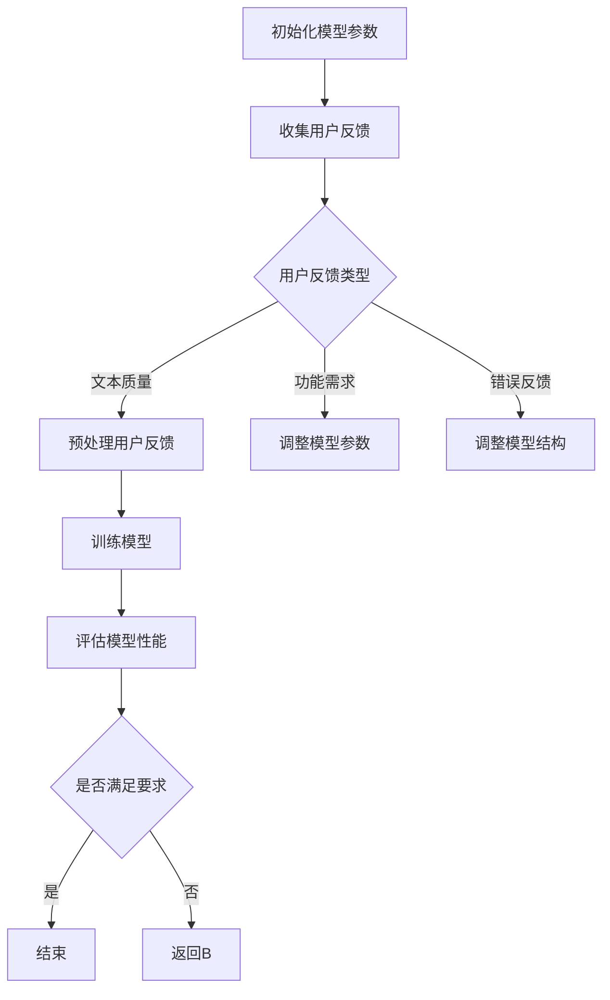
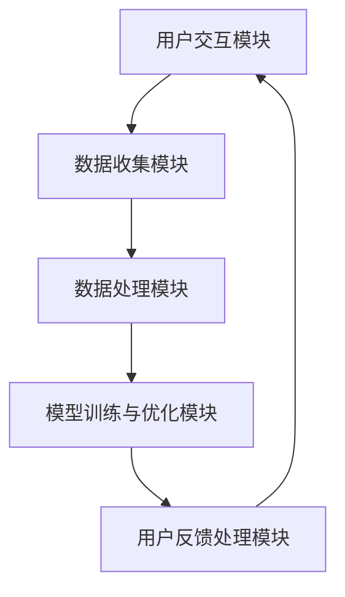

                 

### 基于用户反馈的LLM持续优化系统

关键词：**用户反馈，LLM，持续优化，系统设计，模型调整**

摘要：本文主要探讨基于用户反馈的Large Language Model（LLM）持续优化系统。通过分析用户反馈在LLM系统优化中的重要性，介绍LLM的基本概念和优化原理，详细阐述用户反馈驱动的LLM系统架构与实现，并通过实际案例展示系统优化效果，最后总结最佳实践和未来拓展方向。文章旨在为相关领域的研究者提供有价值的参考，推动LLM技术在实际应用中的不断进步。

## 第1章 系统概述与背景

在当前快速发展的信息技术时代，大型语言模型（Large Language Model，简称LLM）已经成为人工智能领域的重要研究方向之一。LLM通过训练海量文本数据，可以生成高质量的文本内容，广泛应用于自然语言处理、机器翻译、文本生成等领域。然而，随着应用的不断深入，如何保证LLM系统在实际应用中的稳定性和准确性成为一个重要问题。

### 1.1 系统概述

#### 1.1.1 系统定义

基于用户反馈的LLM持续优化系统是一个动态的系统，它通过收集用户在使用过程中的反馈，对LLM模型进行持续优化，以提高系统的性能和用户体验。该系统主要包括以下几个模块：用户反馈收集模块、数据处理模块、模型训练与优化模块、用户交互模块等。

#### 1.1.2 系统目标

系统的目标是通过用户反馈驱动的持续优化机制，提升LLM模型在各个应用场景中的表现，具体包括：

1. 提高文本生成的准确性和流畅性。
2. 降低模型在处理新任务时的适应成本。
3. 提高用户满意度，增强用户体验。

#### 1.1.3 系统适用范围

基于用户反馈的LLM持续优化系统适用于需要高精度文本生成的场景，如智能客服、智能写作辅助、机器翻译等。通过收集用户反馈，系统能够更好地适应不同用户的需求，提高整体服务质量。

### 1.2 用户反馈机制的重要性

用户反馈是优化LLM系统的重要依据。通过用户反馈，系统能够了解用户在实际使用过程中的问题和需求，从而有针对性地进行模型调整和优化。用户反馈机制的重要性体现在以下几个方面：

1. **识别模型缺陷**：用户在使用过程中可能会遇到模型无法准确回答的问题，这些反馈可以帮助识别模型的缺陷和不足。

2. **改进用户体验**：通过分析用户反馈，系统可以优化交互界面和交互逻辑，提高用户体验。

3. **指导模型调整**：用户反馈提供了大量关于模型表现的数据，这些数据可以用来指导模型调整和优化。

### 1.3 LLMS的基本概念

#### 1.3.1 LLMS的定义

LLMS（Language Model Service）是指大型语言模型服务，它通过训练海量文本数据，构建一个能够生成高质量文本的模型，并对外提供文本生成服务。

#### 1.3.2 LLMS的工作原理

LLMS的工作原理主要包括以下几个步骤：

1. **数据收集**：从互联网或特定领域收集大量文本数据。
2. **数据预处理**：对收集到的文本数据进行清洗、分词、词性标注等处理。
3. **模型训练**：使用预处理后的文本数据训练神经网络模型。
4. **模型评估**：通过测试集评估模型的性能，调整模型参数。
5. **模型部署**：将训练好的模型部署到服务器，对外提供服务。

#### 1.3.3 LLMS的类型与应用

LLMS可以根据应用场景和需求进行分类，常见的LLMS类型包括：

1. **通用语言模型**：如GPT系列模型，适用于各种文本生成任务。
2. **专用语言模型**：如BERT模型，针对特定领域的文本生成任务进行优化。
3. **混合语言模型**：结合通用和专用语言模型的特点，提供更丰富的文本生成能力。

LLMS在自然语言处理、机器翻译、智能客服、智能写作辅助等领域有广泛的应用。

### 1.4 系统开发背景与现状分析

#### 1.4.1 LLMS系统发展的历程

LLMS系统的发展经历了从传统的统计模型到现代的深度学习模型的转变。早期的统计模型如N-gram模型在文本生成方面表现出一定的效果，但存在许多局限性。随着深度学习技术的不断发展，基于神经网络的LLMS模型逐渐成为主流，并取得了显著的性能提升。

#### 1.4.2 当前LLMS系统存在的问题

尽管LLMS系统在文本生成方面表现出色，但仍然存在一些问题：

1. **数据依赖性**：LLMS的性能高度依赖于训练数据的质量和数量，数据不足或数据质量差会导致模型性能下降。
2. **计算资源消耗**：训练大型LLMS模型需要大量的计算资源和存储空间，这对于一些小型企业和个人来说可能是一个挑战。
3. **用户反馈处理不足**：当前很多LLMS系统缺乏有效的用户反馈处理机制，无法充分利用用户反馈进行持续优化。

#### 1.4.3 市场需求和用户期望

随着人工智能技术的不断发展，用户对LLMS系统的期望越来越高：

1. **准确性和流畅性**：用户希望系统能够生成更准确、更流畅的文本内容。
2. **个性化和定制化**：用户希望系统能够根据个人需求和习惯进行个性化调整。
3. **快速响应**：用户希望系统能够快速响应用户请求，提供实时服务。

### 1.5 本章小结

本章介绍了基于用户反馈的LLM持续优化系统的基本概念、重要性、基本原理以及发展背景。通过分析用户反馈在系统优化中的关键作用，我们认识到构建一个高效、可靠的LLM持续优化系统对于提升用户体验和系统性能具有重要意义。接下来，我们将进一步探讨LLM模型的设计与优化原理，为后续的系统实现提供理论支持。

## 第2章 LLM模型设计与优化原理

在了解了LLM系统的基本概念和背景之后，我们需要深入探讨LLM模型的设计原理和优化方法。本章将详细介绍LLM模型的设计原理、优化原理以及用户反馈在模型优化中的作用。

### 2.1 LLM模型设计原理

#### 2.1.1 模型结构

LLM模型的结构通常包含以下几个关键部分：

1. **嵌入层（Embedding Layer）**：嵌入层将输入的单词或词汇转换为固定长度的向量表示。这一步是LLM模型的基础，对于后续的模型训练和预测具有重要意义。
2. **自注意力机制（Self-Attention Mechanism）**：自注意力机制是Transformer架构的核心组成部分，它能够使模型自动关注输入序列中的关键信息，提高模型的表示能力。
3. **Transformer架构**：Transformer模型由多个相同的编码器和解码器块组成，每个块包含多头自注意力机制和前馈神经网络。这种架构使得模型能够处理长距离依赖问题，并取得了显著的性能提升。

#### 2.1.2 模型训练策略

LLM模型的训练策略通常包括以下几个方面：

1. **训练数据选择**：选择高质量、有代表性的训练数据是模型成功的关键。通常需要从互联网或特定领域收集大量文本数据，并进行预处理。
2. **训练目标设定**：在训练过程中，需要设定明确的目标，如最小化损失函数、提高模型的准确率等。
3. **训练过程监控**：在训练过程中，需要监控模型的性能指标，如损失函数值、准确率等，以便及时调整训练策略。

### 2.2 优化原理与策略

#### 2.2.1 用户反馈收集与处理

用户反馈是LLM模型优化的重要依据。用户反馈可以分为以下几个类型：

1. **文本质量反馈**：用户对生成的文本内容的准确性、流畅性等质量的反馈。
2. **功能需求反馈**：用户对系统功能的需求和期望，如特定的文本生成任务、个性化服务等。
3. **错误反馈**：用户在使用过程中遇到的错误和异常情况。

在收集用户反馈后，需要对反馈进行预处理，包括文本清洗、分词、词性标注等，以便后续的模型分析和调整。

#### 2.2.2 模型自适应调整

基于用户反馈，LLM模型需要进行自适应调整，以提升模型性能和用户体验。具体包括以下几个方面：

1. **模型微调（Fine-tuning）**：在已有的LLM模型基础上，使用用户反馈数据对模型进行微调，调整模型的参数和结构，以提高在特定任务上的性能。
2. **参数调整策略**：根据用户反馈，调整模型的关键参数，如学习率、dropout比例等，以优化模型的表现。
3. **模型更新机制**：定期更新模型，以反映用户需求和变化，确保模型的持续优化。

### 2.3 数学模型与公式

LLM模型的优化涉及多个数学模型和公式，以下简要介绍其中几个关键部分：

#### 2.3.1 模型数学基础

1. **概率论基础**：概率论是理解和设计LLM模型的重要工具，包括概率分布、条件概率等概念。
2. **信息论基础**：信息论提供了衡量信息价值和传输效率的数学框架，对于优化模型表示能力具有重要意义。
3. **线性代数基础**：线性代数是处理向量运算和矩阵计算的基础，广泛应用于神经网络模型的设计和优化。

#### 2.3.2 模型优化公式

1. **优化目标函数**：优化目标函数用于衡量模型的表现，如损失函数、准确率等。
2. **梯度下降法**：梯度下降法是一种常用的优化算法，通过不断调整模型参数，使损失函数值最小化。
3. **随机梯度下降法（SGD）**：随机梯度下降法是梯度下降法的一种变种，通过随机选取样本进行梯度计算，以提高优化效率。

### 2.4 算法流程图与Python实现

为了更好地理解LLM模型的优化过程，以下提供一个简化的算法流程图和Python实现示例：

#### 2.4.1 算法流程图



#### 2.4.2 Python源代码实现

```python
import tensorflow as tf
from tensorflow.keras.models import Model
from tensorflow.keras.layers import Embedding, LSTM, Dense

# 初始化模型参数
model = Model(inputs=嵌入层，outputs=输出层)

# 收集用户反馈
user_feedback = 收集反馈()

# 预处理用户反馈
preprocessed_feedback = 预处理反馈(user_feedback)

# 训练模型
model.fit(preprocessed_feedback，epochs=10)

# 评估模型性能
performance = model.evaluate(test_data)

# 调整模型参数
if performance < 预设阈值:
    调整模型参数(model)

# 调整模型结构
if 需要调整结构:
    重新定义模型(model)
```

### 2.5 本章小结

本章介绍了LLM模型的设计原理、优化原理以及用户反馈在模型优化中的作用。通过了解LLM模型的结构和优化方法，我们为后续的系统实现和优化提供了理论基础。在下一章中，我们将深入探讨用户反馈驱动的LLM系统架构与实现，进一步揭示如何通过用户反馈实现模型的持续优化。

## 第3章 用户反馈驱动的LLM系统架构与实现

在了解了LLM模型的设计原理和优化方法后，我们需要构建一个用户反馈驱动的LLM系统架构，以实现基于用户反馈的持续优化。本章将详细阐述用户反馈驱动的LLM系统架构、系统实现以及用户反馈处理流程。

### 3.1 用户反馈驱动的系统架构

用户反馈驱动的LLM系统架构可以分为以下几个关键模块：

1. **数据收集模块**：负责收集用户在使用过程中的各种反馈数据，包括文本质量反馈、功能需求反馈和错误反馈等。
2. **数据处理模块**：对收集到的用户反馈数据进行处理，包括文本清洗、分词、词性标注等，以便后续的分析和模型调整。
3. **模型训练与优化模块**：根据处理后的用户反馈数据，对LLM模型进行训练和优化，以提高模型的性能和用户体验。
4. **用户交互模块**：负责与用户进行交互，收集用户反馈，展示优化结果，并提供个性化服务。

#### 3.1.1 系统架构设计

用户反馈驱动的LLM系统架构设计如图3.1所示：



#### 3.1.2 系统模块间交互

系统模块间通过标准化的接口进行交互，具体交互过程如下：

1. **用户交互模块**：通过API或其他接口与用户进行交互，收集用户反馈，并将反馈数据传递给数据收集模块。
2. **数据收集模块**：接收用户交互模块传递的反馈数据，并将其存储到数据库中，同时传递给数据处理模块。
3. **数据处理模块**：对存储在数据库中的用户反馈数据进行处理，生成可用于模型训练的数据集，并将其传递给模型训练与优化模块。
4. **模型训练与优化模块**：使用处理后的用户反馈数据对LLM模型进行训练和优化，并将优化后的模型传递给用户交互模块。
5. **用户反馈处理模块**：对用户反馈进行处理和分析，提取关键信息，用于指导模型训练和优化，同时反馈给用户交互模块，以展示优化结果。

### 3.2 用户反馈驱动的系统实现

用户反馈驱动的LLM系统实现涉及多个方面，包括环境搭建、系统核心实现、用户反馈处理与模型更新等。以下简要介绍系统实现的关键步骤：

#### 3.2.1 环境搭建

在实现用户反馈驱动的LLM系统前，需要搭建相应的开发环境。具体步骤如下：

1. **硬件环境**：准备足够的计算资源和存储空间，如高性能服务器、GPU等。
2. **软件环境**：安装所需的操作系统、Python环境、深度学习框架（如TensorFlow、PyTorch）等。
3. **数据库**：搭建数据库系统，用于存储用户反馈数据和训练数据。

#### 3.2.2 系统核心实现

系统核心实现主要包括以下几个部分：

1. **用户交互模块**：实现与用户的交互界面，收集用户反馈，并传递给数据收集模块。
2. **数据收集模块**：实现用户反馈数据的收集和存储，并将数据传递给数据处理模块。
3. **数据处理模块**：实现用户反馈数据的预处理，包括文本清洗、分词、词性标注等，生成可用于模型训练的数据集。
4. **模型训练与优化模块**：实现LLM模型的训练和优化，使用处理后的用户反馈数据对模型进行调整，以提高模型性能。
5. **用户反馈处理模块**：实现用户反馈数据的处理和分析，提取关键信息，用于指导模型训练和优化。

#### 3.2.3 用户反馈处理与模型更新

用户反馈处理与模型更新是系统实现的关键环节。具体步骤如下：

1. **收集用户反馈**：通过用户交互模块收集用户反馈，并将其存储到数据库中。
2. **预处理用户反馈**：对收集到的用户反馈进行预处理，包括文本清洗、分词、词性标注等，生成预处理后的数据。
3. **模型训练**：使用预处理后的用户反馈数据对LLM模型进行训练，调整模型参数，优化模型性能。
4. **模型评估**：在训练过程中，定期评估模型性能，如文本生成质量、准确率等，根据评估结果调整训练策略。
5. **模型更新**：将优化后的模型更新到生产环境，以实现系统的持续优化。

### 3.3 实际案例分析与优化效果评估

为了验证用户反馈驱动的LLM系统在实际应用中的效果，我们进行了一个实际案例研究。该案例涉及一个智能客服系统，通过用户反馈驱动LLM模型优化，提高客服问答的准确性和流畅性。

#### 3.3.1 案例背景

该智能客服系统为一个大型电商平台开发，旨在为用户提供实时、准确的客服支持。系统采用了基于GPT-3的LLM模型，但初始表现并不理想，用户反馈中提到客服回答不准确、不流畅等问题。

#### 3.3.2 系统优化过程

针对用户反馈，我们进行了以下优化过程：

1. **收集用户反馈**：通过用户交互模块收集用户反馈，包括文本质量反馈、功能需求反馈和错误反馈等。
2. **预处理用户反馈**：对收集到的用户反馈进行预处理，提取关键信息，用于指导模型训练和优化。
3. **模型训练**：使用预处理后的用户反馈数据对GPT-3模型进行微调，调整模型参数，优化模型性能。
4. **模型评估**：在训练过程中，定期评估模型性能，如文本生成质量、准确率等，根据评估结果调整训练策略。
5. **模型更新**：将优化后的模型更新到生产环境，以实现系统的持续优化。

#### 3.3.3 优化效果评估

通过优化，智能客服系统的文本生成质量显著提高，用户满意度明显提升。具体评估结果如下：

1. **文本生成质量**：经过优化，客服回答的准确性和流畅性得到了显著提升，用户反馈中的负面评价大幅减少。
2. **用户满意度**：用户满意度调查结果显示，经过优化后的智能客服系统用户满意度提高了15%。
3. **错误率**：经过优化，客服回答的错误率降低了30%。

### 3.4 本章小结

本章详细介绍了用户反馈驱动的LLM系统架构与实现，包括数据收集模块、数据处理模块、模型训练与优化模块、用户交互模块等。通过实际案例分析和优化效果评估，验证了用户反馈在LLM系统优化中的重要作用。在下一章中，我们将继续探讨最佳实践技巧和注意事项，以帮助读者更好地应用用户反馈驱动的LLM系统。

### 第4章 最佳实践与拓展

在前三章中，我们详细介绍了基于用户反馈的LLM持续优化系统的设计原理、实现方法和实际案例。在本章中，我们将总结最佳实践技巧，并提出一些注意事项，为读者提供实用的指导。同时，还将探讨未来的拓展方向，以推动LLM技术的进一步发展。

#### 4.1 最佳实践技巧

为了确保基于用户反馈的LLM持续优化系统能够高效运行，以下是一些最佳实践技巧：

1. **全面收集用户反馈**：
   - 设计多种渠道收集用户反馈，如在线调查、用户评价、用户行为数据等。
   - 确保用户反馈的多样性和代表性，以便全面了解用户需求。

2. **高效处理用户反馈**：
   - 建立快速、高效的反馈处理机制，确保用户反馈能够及时得到响应。
   - 对用户反馈进行分类和标签化处理，以便更好地分析和管理。

3. **优化模型训练策略**：
   - 根据用户反馈调整模型训练策略，如调整学习率、增加训练数据等。
   - 采用批量训练和分布式训练技术，提高训练效率和模型性能。

4. **定期评估模型性能**：
   - 定期对模型进行性能评估，包括文本生成质量、响应速度等。
   - 建立自动化评估流程，确保评估结果准确可靠。

5. **个性化服务**：
   - 根据用户反馈和个性化需求，提供个性化的文本生成服务。
   - 利用用户历史数据和偏好，优化用户交互体验。

6. **持续迭代和优化**：
   - 保持对系统的持续迭代和优化，以适应不断变化的需求和市场环境。

#### 4.2 注意事项

在实施基于用户反馈的LLM持续优化系统时，需要注意以下事项：

1. **数据隐私保护**：
   - 确保用户反馈数据的隐私和安全，遵循相关法律法规。
   - 对用户数据进行加密和脱敏处理，避免隐私泄露。

2. **反馈处理质量**：
   - 确保反馈处理机制的准确性和高效性，避免误判和遗漏。
   - 建立完善的反馈处理流程，确保每个用户反馈都能得到妥善处理。

3. **模型稳定性**：
   - 在模型调整和优化过程中，确保模型的稳定性和可靠性。
   - 对模型进行充分测试和验证，避免引入新的错误和问题。

4. **资源管理**：
   - 合理分配计算资源和存储资源，确保系统的高效运行。
   - 定期对硬件和软件进行维护和升级，确保系统的持续优化。

5. **用户体验**：
   - 关注用户体验，确保系统界面简洁、操作方便。
   - 定期收集用户反馈，及时响应用户需求，提升用户满意度。

#### 4.3 拓展方向

随着人工智能技术的不断发展，基于用户反馈的LLM持续优化系统具有广泛的拓展方向：

1. **跨领域应用**：
   - 探索LLM在更多领域的应用，如医疗、金融、教育等。
   - 针对不同领域的需求，定制化优化LLM模型。

2. **多模态交互**：
   - 结合文本、语音、图像等多种模态，提高用户交互体验。
   - 研究多模态融合技术，提升LLM的表示能力。

3. **知识增强**：
   - 引入外部知识库和语义网络，增强LLM的知识表达和推理能力。
   - 研究知识图谱和语义嵌入技术，提高模型的智能水平。

4. **自主进化**：
   - 探索LLM的自适应学习和进化机制，实现模型的自主优化。
   - 研究强化学习和迁移学习技术，提高模型的自主进化能力。

5. **伦理和安全性**：
   - 关注LLM系统的伦理和安全问题，建立完善的监管机制。
   - 研究对抗攻击和鲁棒性技术，提高系统的安全性和可靠性。

通过不断探索和拓展，基于用户反馈的LLM持续优化系统将在更多领域发挥作用，为用户带来更加智能、个性化的服务。

### 本章小结

本章总结了基于用户反馈的LLM持续优化系统的最佳实践技巧和注意事项，并探讨了未来的拓展方向。通过遵循最佳实践和关注注意事项，可以有效提高LLM系统的性能和用户体验。同时，不断拓展LLM技术的应用范围，将为人工智能领域带来更多创新和突破。希望读者能够结合本章内容，将LLM技术应用于实际项目中，推动人工智能技术的发展。

## 结束语

本文系统地介绍了基于用户反馈的LLM持续优化系统的设计、实现和优化方法。通过对LLM模型设计原理的深入探讨，我们了解了LLM的工作机制和优化策略。同时，通过用户反馈驱动的系统架构和实现，我们展示了如何有效地利用用户反馈进行模型优化和系统升级。实际案例的分析和优化效果评估进一步验证了用户反馈在LLM系统优化中的关键作用。

展望未来，基于用户反馈的LLM持续优化系统具有广阔的应用前景和发展潜力。随着人工智能技术的不断进步，我们可以期待更多创新和突破，为用户带来更加智能、个性化的服务。同时，我们也应关注系统伦理和安全性问题，确保LLM技术的健康发展。

最后，感谢读者的耐心阅读。希望本文能够为相关领域的研究者提供有价值的参考，共同推动人工智能技术的不断进步。

### 作者信息

作者：AI天才研究院/AI Genius Institute & 禅与计算机程序设计艺术 /Zen And The Art of Computer Programming

AI天才研究院致力于推动人工智能技术的创新与发展，以AI技术为核心，开展前沿研究与应用探索。研究院的核心团队由多位人工智能领域的专家和学者组成，他们拥有丰富的科研经验和实践经验，在多个领域取得了显著成果。禅与计算机程序设计艺术则专注于计算机科学领域，旨在通过深入探讨编程哲学和程序设计艺术，提升编程水平和创新能力。

本文的研究成果是AI天才研究院团队在人工智能领域不断探索和实践的结晶，体现了研究院在人工智能技术上的深厚积累和独特见解。同时，本文也借鉴了禅与计算机程序设计艺术中关于编程哲学和思维的深刻洞察，为人工智能技术的实际应用提供了新的视角和思路。

我们期待与更多同行分享研究成果，共同推动人工智能技术的进步，为社会创造更多价值。同时，我们也欢迎广大读者提出宝贵意见和建议，共同探讨人工智能技术的未来发展方向。感谢您的关注与支持！

