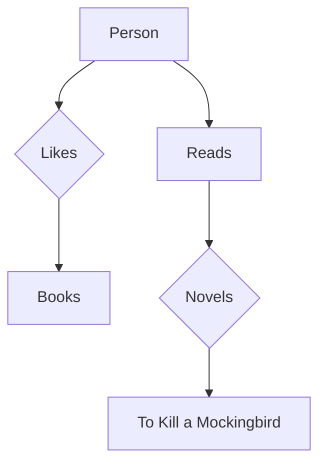
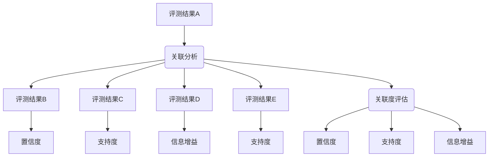

                 

### 引言

#### 什么是知识图谱？

知识图谱（Knowledge Graph）是一种结构化的语义知识表示方法，通过将实体、概念、属性及其相互关系表示为节点和边的网络形式，将海量、分散的数据整合成具有语义关联性的知识体系。知识图谱起源于图论和网络科学，逐渐在人工智能、大数据分析、语义网等众多领域得到广泛应用。

**知识图谱的核心组成部分：**

1. **实体（Entities）：** 实体是知识图谱中的基本元素，可以是人、地点、事物等具有独立存在的对象。
2. **属性（Attributes）：** 属性用于描述实体的特征，例如人名、生日、职业等。
3. **关系（Relationships）：** 关系用于表示实体之间的联系，如“属于”、“住在”等。
4. **属性值（Attribute Values）：** 属性值是属性的具体取值，如“北京”、“程序员”等。

**知识图谱的应用场景：**

1. **搜索引擎优化：** 通过知识图谱，搜索引擎可以更好地理解用户查询的语义，提供更精准的搜索结果。
2. **智能推荐系统：** 利用知识图谱挖掘用户兴趣和物品间的关联，实现个性化的内容推荐。
3. **自然语言处理：** 知识图谱为NLP任务提供了丰富的背景知识，有助于提升文本分析和语义理解的准确度。
4. **数据治理和数据分析：** 知识图谱可以帮助企业整合多源数据，实现数据关联分析，提升数据利用价值。

**评价知识图谱的指标：**

1. **覆盖率（Coverage）：** 知识图谱中包含的实体和关系数量占总实体和关系的比例。
2. **准确性（Accuracy）：** 知识图谱中实体和关系的真实性和可靠性。
3. **一致性（Consistency）：** 知识图谱中不同来源、不同时间点的数据的一致性和无矛盾性。
4. **扩展性（Extensibility）：** 知识图谱在增加新实体、属性和关系时的灵活性和可扩展性。

#### 什么是对评测结果的关联分析？

评测结果关联分析是一种基于数据分析的方法，用于挖掘不同评测结果之间的相互关系。评测结果通常来源于各种评价体系，如产品质量评测、用户满意度调查、教育成绩评估等。关联分析旨在通过识别和挖掘这些结果之间的相关性，为决策提供数据支持。

**评测结果关联分析的重要性：**

1. **提升决策质量：** 通过关联分析，可以更全面地理解评测结果之间的相互作用，帮助管理者做出更科学的决策。
2. **优化资源配置：** 了解评测结果之间的关联性，有助于合理配置资源，提升整体效益。
3. **预测趋势：** 关联分析可以帮助预测评测结果的变化趋势，为未来规划和调整提供依据。

#### 总结

本文旨在探讨基于知识图谱的评测结果关联分析。我们将首先介绍知识图谱的基础概念和应用，然后深入探讨评测结果的来源、处理和关联分析的方法。通过本文的阅读，读者将了解到如何利用知识图谱技术提升评测结果分析的效果，为实际应用提供有价值的参考。接下来，我们将分章节详细介绍相关知识。

关键词：知识图谱，评测结果，关联分析，应用场景，评价指标

摘要：本文通过介绍知识图谱的基础概念、评测结果的来源和处理方法，探讨了基于知识图谱的评测结果关联分析。文章首先明确了知识图谱的定义、组成部分和应用场景，然后详细阐述了评测结果的概念、来源及关联分析的重要性。通过一系列的案例分析和实际应用，本文展示了知识图谱在评测结果关联分析中的关键作用。

### 知识图谱的基本概念和应用

#### 知识图谱的定义

知识图谱是一种语义网络，用于表示实体及其相互关系。它可以被视为一种扩展的图结构，其中的节点代表实体，边代表实体之间的关系。与传统的图结构不同，知识图谱强调语义关系，例如“属于”、“住在”、“创建”等，这些关系在知识图谱中通过边进行表示。

知识图谱的概念起源于语义网（Semantic Web）的构想，由Tim Berners-Lee在2001年提出。语义网旨在通过使用机器可读的元数据，扩展万维网的数据表达能力，使计算机能够理解网络内容，从而实现更加智能和高效的信息检索与交互。知识图谱是实现语义网愿景的重要技术之一。

**知识图谱的发展历程**

知识图谱的发展可以追溯到早期的研究，如万维网上的语义标注和本体论（Ontology）的提出。随着时间的推移，知识图谱技术逐渐成熟，并在多个领域得到广泛应用。以下是知识图谱发展历程的几个关键阶段：

1. **初始探索阶段（1990s-2000s）：** 早期研究主要集中在构建简单的知识图谱，如WordNet、DBpedia等，这些图谱为后续的发展奠定了基础。
2. **快速增长阶段（2010s）：** 随着大数据和机器学习技术的进步，知识图谱的研究和应用进入快速增长期。Google Knowledge Graph、Facebook Open Graph等大型知识图谱的发布，标志着知识图谱技术的广泛应用。
3. **成熟应用阶段（2020s至今）：** 知识图谱技术逐渐应用于各个行业，如金融、医疗、零售等，实现数据关联分析和智能决策。

**知识图谱的核心组成部分**

知识图谱由三个核心组件组成：实体（Entities）、属性（Attributes）和关系（Relationships）。

1. **实体（Entities）：** 实体是知识图谱中的基本元素，可以是任何具有独立存在的对象，如人、地点、组织、物品等。实体通常由唯一标识符（ID）进行标识，并通过属性值来描述其特征。
   
2. **属性（Attributes）：** 属性用于描述实体的特征，如人的生日、地点的纬度等。属性可以分为分类属性（如性别）和数值属性（如年龄）。

3. **关系（Relationships）：** 关系用于表示实体之间的联系，如“属于”、“住在”、“创建”等。关系通常由两个实体和一个描述性的标签组成。

**知识图谱的应用场景**

知识图谱的应用场景非常广泛，以下是一些典型的应用：

1. **搜索引擎优化（SEO）：** 知识图谱可以帮助搜索引擎更好地理解网页内容，提供更精准的搜索结果。

2. **智能推荐系统：** 通过知识图谱挖掘用户和物品之间的关联，实现个性化的内容推荐。

3. **自然语言处理（NLP）：** 知识图谱为NLP任务提供了丰富的背景知识，有助于提升文本分析和语义理解的准确度。

4. **数据治理和数据分析：** 知识图谱可以帮助企业整合多源数据，实现数据关联分析，提升数据利用价值。

**评价知识图谱的指标**

为了评估知识图谱的质量和效能，通常使用以下指标：

1. **覆盖率（Coverage）：** 知识图谱中包含的实体和关系数量占总实体和关系的比例。高覆盖率意味着知识图谱能够覆盖更多的领域和实体。

2. **准确性（Accuracy）：** 知识图谱中实体和关系的真实性和可靠性。高准确性表明知识图谱中的信息是可信的。

3. **一致性（Consistency）：** 知识图谱中不同来源、不同时间点的数据的一致性和无矛盾性。一致性是知识图谱质量的重要保障。

4. **扩展性（Extensibility）：** 知识图谱在增加新实体、属性和关系时的灵活性和可扩展性。良好的扩展性使得知识图谱能够适应不断变化的数据和环境。

**总结**

知识图谱作为一种重要的语义表示方法，通过将实体、属性和关系结构化地组织起来，为各个领域的应用提供了强有力的支持。本文介绍了知识图谱的基本概念、发展历程、核心组成部分和应用场景，并提出了评价知识图谱的几个关键指标。在接下来的章节中，我们将深入探讨评测结果的来源和处理方法，以及如何利用知识图谱进行关联分析。

### 评测结果的来源

评测结果是指通过对某一对象或系统进行评价和测试后所得出的数据。这些数据可以来源于多个不同的来源，包括但不限于以下几种：

**1. 用户反馈：**

用户反馈是评测结果的一个重要来源，它通常来自于用户对产品、服务或系统的直接体验和感受。用户反馈可以包括满意度调查、评价评论、投票等形式。这些反馈数据有助于了解用户的需求和期望，从而指导产品或系统的改进。

**2. 学术论文和研究成果：**

学术论文和研究成果也是评测结果的重要来源。研究人员通过对某一领域或技术的深入研究和实验，发布学术论文和实验结果。这些成果为评测结果提供了科学依据和理论支持，有助于全面评估某一领域或技术的性能和效果。

**3. 实验室测试和评测：**

实验室测试和评测是通过专业的测试设备和方法，对产品或系统进行性能测试和评估。这些测试可以包括稳定性测试、性能测试、安全测试等。实验室测试的数据通常具有较高的可信度和准确性，是评测结果的重要参考依据。

**4. 实地调查和观测：**

实地调查和观测是通过实地走访、观察和记录，收集关于某一对象或系统的数据。这种数据收集方法适用于对复杂系统或环境的评估，如建筑工程的质量检测、自然灾害的评估等。实地调查和观测的数据可以为评测结果提供直观的现场信息和数据支持。

**5. 传感器和网络数据：**

随着物联网（IoT）技术的发展，传感器和网络数据成为评测结果的另一个重要来源。传感器可以实时监测环境参数、设备状态等，通过收集和分析这些数据，可以实现对系统或设备的实时评测和监控。网络数据则来自于互联网上的各种信息，如社交网络、论坛等，这些数据可以反映公众对某一对象或系统的看法和评价。

**评测结果的多样化来源**

评测结果的多样化来源使得数据的多样性和复杂性增加。不同来源的数据可能具有不同的格式、质量和可信度，因此在处理评测结果时需要考虑以下几个方面：

1. **数据格式统一：** 需要将不同来源的数据格式统一，以便进行集中处理和分析。通常采用数据清洗和转换技术，将异构数据转换为统一格式，如表格或图形化数据。

2. **数据质量评估：** 不同来源的数据可能存在质量差异，需要进行质量评估和筛选。通过数据质量评估，可以识别和排除低质量或错误的数据，提高评测结果的准确性。

3. **数据融合与关联：** 将来自不同来源的数据进行融合和关联，以揭示更深层次的关联性和趋势。数据融合技术可以整合多源数据，提高数据利用的效率和效果。

4. **数据分析和挖掘：** 利用数据分析方法，从海量评测数据中提取有价值的信息和知识，帮助决策者和研究者更好地理解和利用评测结果。

**评测结果的挑战**

在处理评测结果时，还面临以下挑战：

1. **数据多样性：** 多样化的数据来源和格式增加了数据处理的复杂性，需要采用灵活的数据处理方法。

2. **数据不一致性：** 不同来源的数据可能存在不一致性，如时间戳的差异、单位的不统一等，需要通过数据清洗和标准化技术进行统一处理。

3. **数据隐私保护：** 用户反馈和实地调查等数据可能涉及个人隐私，需要采取有效的数据隐私保护措施，确保数据的安全和合规性。

4. **数据解读和解释：** 评测结果的数据解读和解释是一个复杂的任务，需要专业知识和经验，以确保结果的准确性和可靠性。

总之，评测结果的多样化来源为数据的处理和分析带来了机遇和挑战。通过有效的数据处理和分析方法，可以充分利用评测结果，为决策提供有力的支持。在接下来的章节中，我们将深入探讨评测结果的处理方法和关联分析技术。

### 评测结果的处理

在收集到评测结果后，处理这些数据以获得有意义的分析和洞察是关键步骤。以下是处理评测结果的常见方法：

#### 数据清洗

数据清洗是处理评测结果的第一个关键步骤。数据清洗的目标是识别和纠正数据中的错误、异常值和缺失值，以确保数据的质量和一致性。常见的数据清洗方法包括：

1. **缺失值处理：** 对于缺失的数据，可以采用以下策略：
   - 删除：如果缺失的数据量较大，可以选择删除这些记录。
   - 补全：通过算法或统计方法，使用已有的数据填补缺失值，如使用均值、中位数等方法。
   - 预测：对于某些关键数据，可以使用机器学习算法进行预测补全。

2. **异常值检测：** 异常值可能是由于数据录入错误、测量误差等原因造成的，需要检测并处理。常见的方法包括：
   - 离群点检测：使用统计方法（如三倍标准差法则）或机器学习方法（如孤立森林）识别异常值。
   - 专家审核：对于复杂的数据集，可能需要专家进行审核，以识别并处理异常值。

3. **数据格式转换：** 将不同来源的数据格式统一，如将文本数据转换为表格或图形化数据，便于后续处理和分析。

#### 数据标准化

数据标准化是确保数据在不同维度上具有可比性的过程。常见的数据标准化方法包括：

1. **数值标准化：** 将不同尺度的数据转换为同一尺度，如将所有数据缩放到0到1之间，或者使用Z-Score标准化方法。

2. **分类数据的编码：** 对于分类数据，可以采用独热编码（One-Hot Encoding）或标签编码（Label Encoding）等方法将其转换为数值形式。

3. **时间数据的标准化：** 对于时间序列数据，可以通过归一化（Normalization）或标准化（Standardization）方法处理。

#### 数据整合

在处理多源数据时，数据整合是关键步骤。数据整合的目标是将来自不同来源和格式的数据合并为一个统一的数据集。常见的数据整合方法包括：

1. **数据融合：** 通过合并不同数据源的信息，消除数据冗余，提高数据的完整性。例如，将用户反馈数据和实验室测试数据融合。

2. **数据关联：** 通过识别和建立不同数据源之间的关系，实现数据的有机整合。例如，通过关键字匹配将用户评论和产品信息关联起来。

3. **数据转换：** 将不同数据格式转换为统一的格式，如将CSV文件转换为数据库表，便于进一步处理和分析。

#### 数据分析

在完成数据清洗、标准化和整合后，下一步是进行数据分析。数据分析的目标是从数据中提取有价值的信息和知识。常见的数据分析方法包括：

1. **描述性分析：** 通过统计指标（如均值、中位数、标准差等）描述数据的基本特征和分布情况。

2. **关联分析：** 通过识别数据之间的关联性，揭示潜在的关系和趋势。常见的方法包括相关分析、聚类分析等。

3. **预测分析：** 利用历史数据建立预测模型，预测未来趋势和结果。常见的方法包括回归分析、时间序列预测等。

4. **可视化分析：** 通过图形化展示数据，帮助用户更好地理解和分析数据。常见的方法包括折线图、散点图、热力图等。

#### 数据质量评估

数据质量评估是确保数据处理和分析结果准确性的重要步骤。常见的数据质量评估方法包括：

1. **完整性评估：** 评估数据的完整性和一致性，确保没有缺失值和重复记录。

2. **准确性评估：** 评估数据的质量和可信度，确保数据来源可靠，无错误或异常值。

3. **一致性评估：** 评估数据在不同来源和维度上的一致性，确保数据整合后无矛盾或冲突。

#### 挑战与对策

在处理评测结果时，可能面临以下挑战：

1. **数据多样性：** 多样化的数据来源和格式增加了数据处理的复杂性，需要采用灵活的处理方法。

2. **数据不一致性：** 不同来源的数据可能存在不一致性，如时间戳、单位等，需要通过数据清洗和标准化技术进行统一处理。

3. **数据隐私保护：** 需要采取有效的数据隐私保护措施，确保数据的安全和合规性。

4. **数据解读和解释：** 数据解读和解释是一个复杂的任务，需要专业知识和经验，以确保结果的准确性和可靠性。

对策包括：

1. **采用自动化工具：** 利用自动化工具（如数据清洗库、数据整合工具等）提高数据处理效率。

2. **数据治理：** 建立数据治理机制，确保数据的标准化和规范化，提高数据质量。

3. **数据安全措施：** 采用数据加密、访问控制等技术，确保数据的安全和隐私保护。

4. **专业培训：** 对数据处理和分析人员进行专业培训，提高其数据解读和解释能力。

通过有效的数据处理方法，可以确保评测结果的准确性和可靠性，为后续的关联分析提供坚实基础。在下一章节中，我们将深入探讨如何利用知识图谱进行评测结果的关联分析。

### 实体识别与关系提取

在构建知识图谱的过程中，实体识别和关系提取是两个关键步骤。实体识别是指从非结构化数据中识别出具有独立意义的对象，而关系提取则是确定这些实体之间的联系。以下是这两个步骤的具体方法、步骤和验证方法。

#### 实体识别

实体识别的目标是从文本数据中识别出重要的实体，例如人名、地点、组织、物品等。以下是几种常用的实体识别方法：

1. **基于规则的方法：**
   - **正则表达式：** 使用预定义的正则表达式来匹配和提取文本中的实体。
   - **词典匹配：** 基于预先构建的词典，将文本与词典中的条目进行匹配，以识别实体。
   
2. **基于统计的方法：**
   - **条件概率模型：** 使用条件概率模型（如隐马尔可夫模型HMM、条件随机场CRF）来识别实体。
   - **基于词频的方法：** 利用词频统计信息，通过设置阈值来识别高频实体。

3. **基于深度学习的方法：**
   - **序列标注模型：** 使用递归神经网络（RNN）、长短时记忆网络（LSTM）或变压器（Transformer）等模型进行实体识别。
   - **BERT模型：** BERT（Bidirectional Encoder Representations from Transformers）等预训练模型在实体识别任务中取得了显著的效果。

**步骤：**
1. **数据预处理：** 对文本进行分词、词性标注等预处理操作，以便更好地识别实体。
2. **实体候选生成：** 使用上述方法生成可能的实体候选。
3. **实体验证和调整：** 对生成的实体候选进行验证，排除误识别的实体，并进行调整。

**验证方法：**
1. **人工审核：** 通过人工审核来验证实体识别的准确性。
2. **精确率和召回率：** 使用精确率（Precision）和召回率（Recall）等指标来评估实体识别的性能。

#### 关系提取

关系提取的目标是从文本数据中确定实体之间的相互关系。以下是几种常用的关系提取方法：

1. **基于规则的方法：**
   - **模式匹配：** 使用预定义的模式来匹配实体之间的关联。
   - **模板匹配：** 根据预定义的模板，将实体之间的关联关系提取出来。

2. **基于统计的方法：**
   - **共现矩阵：** 通过构建实体共现矩阵来识别实体之间的关系。
   - **文本分类：** 使用文本分类算法，将实体对分类到特定的关系类别。

3. **基于深度学习的方法：**
   - **序列标注模型：** 类似于实体识别，使用RNN、LSTM或Transformer等模型进行关系提取。
   - **图神经网络：** 使用图神经网络（Graph Neural Networks, GNN）来处理实体和关系之间的复杂交互。

**步骤：**
1. **数据预处理：** 对文本进行分词、词性标注等预处理操作。
2. **实体对生成：** 从文本中生成所有可能的实体对。
3. **关系预测：** 使用上述方法对实体对进行关系预测。
4. **关系验证和调整：** 对预测的关系进行验证，排除错误的预测，并进行调整。

**验证方法：**
1. **人工审核：** 通过人工审核来验证关系提取的准确性。
2. **F1分数：** 使用F1分数（F1 Score）等指标来评估关系提取的性能。

#### 验证和修正

在实体识别和关系提取过程中，验证和修正是非常重要的步骤。以下是几种常见的验证和修正方法：

1. **交叉验证：** 使用交叉验证方法来评估模型在不同数据集上的性能，以确保模型的泛化能力。

2. **专家审核：** 邀请领域专家对识别结果进行审核，以纠正错误和提高准确性。

3. **后处理：** 使用规则或算法对识别结果进行进一步的修正，如合并重复实体、删除无效关系等。

4. **动态更新：** 随着新数据的不断出现，定期更新实体库和关系库，以保持知识图谱的时效性和准确性。

**总结**

实体识别和关系提取是构建知识图谱的重要步骤。通过使用多种方法和技术，可以有效地从文本数据中识别出实体和它们之间的关系。验证和修正则是确保识别结果准确性和可靠性的关键步骤。在下一章节中，我们将进一步探讨如何可视化知识图谱，以便更好地理解和分析评测结果的关联。

### 知识图谱的可视化

知识图谱的可视化是将结构化的知识图谱数据通过图形化方式展示出来，使其更易于理解和分析。可视化知识图谱不仅能够直观地展示实体和关系，还能帮助识别数据中的模式和关联，从而提高数据分析和决策的效率。以下是一些常用的知识图谱可视化工具和方法。

#### 可视化工具

1. **Google Colab**：Google Colab 是一个基于云计算的交互式开发环境，支持多种编程语言和可视化库。使用 Colab 可以轻松地创建交互式的知识图谱可视化。

2. **Gephi**：Gephi 是一个开源的图形分析工具，主要用于网络数据的可视化和分析。它提供了丰富的图形化界面和多种可视化选项，适合用于知识图谱的探索和分析。

3. **D3.js**：D3.js 是一个基于 JavaScript 的可视化库，广泛用于创建复杂的数据可视化。通过 D3.js，可以自定义各种图表和交互式元素，实现高度灵活的知识图谱可视化。

4. **NetworkX**：NetworkX 是一个 Python 库，用于创建、操作和分析网络。结合 Matplotlib 或 Graphviz 等工具，可以生成高质量的图形化知识图谱。

#### 可视化方法

1. **节点-边图（Node-Link Diagram）**：节点-边图是最常见的知识图谱可视化方法，通过节点和连接它们的边来表示实体和关系。节点通常表示实体，边表示实体之间的关系。这种方法直观且易于理解，适用于展示实体数量和关系较为简单的情况。

2. **矩阵图（Matrix Diagram）**：矩阵图通过一个二维矩阵展示实体之间的关系。矩阵中的每个单元格表示两个实体之间的关联强度或相似度。这种方法适用于展示大量实体之间的复杂关系，特别是用于聚类分析和关联分析。

3. **布局算法（Layout Algorithms）**：布局算法用于调整节点和边的位置，以获得更清晰的图形结构。常用的布局算法包括力导向布局（Force-directed Layout）、层次布局（Hierarchical Layout）等。

4. **交互式可视化（Interactive Visualization）**：通过交互式可视化，用户可以动态地探索知识图谱。例如，用户可以展开或收缩特定的实体或关系，以查看更详细的信息。常用的交互式可视化工具包括 D3.js 和 Gephi。

#### 可视化实例

以下是一个简单的知识图谱可视化示例，使用 Gephi 和 Mermaid 描述一个简单的知识图谱：

在这个示例中，`A` 表示一个实体“Person”（人），`B`、`C`、`D`、`E` 和 `F` 表示不同的实体，如“Likes”（喜欢）、“Books”（书籍）、“Reads”（阅读）、“Novels”（小说）和《To Kill a Mockingbird》（《杀死一只知更鸟》）。

#### 可视化的作用

1. **数据探索：** 可视化帮助用户快速了解数据结构和关系，发现潜在的模式和关联。

2. **数据验证：** 通过可视化，可以直观地检查实体和关系的正确性和一致性。

3. **知识传播：** 可视化使复杂的知识图谱更易于理解和传播，便于团队成员或用户快速掌握核心概念。

4. **决策支持：** 可视化提供了直观的数据展示，有助于决策者基于图表进行决策分析。

总之，知识图谱的可视化是数据分析和知识管理中的重要环节。通过合理的选择和运用可视化工具和方法，可以有效地提升数据理解和分析的效率。在下一章节中，我们将深入探讨如何进行评测结果的关联分析。

### 核心概念与联系

在基于知识图谱的评测结果关联分析中，有几个核心概念需要明确和理解。这些概念包括：关联分析的定义、主要类型、原理和算法。此外，我们还将通过一个概念属性特征对比表格和ER实体关系图架构，详细描述这些核心概念。

#### 关联分析的定义与类型

**关联分析（Association Analysis）** 是一种数据分析方法，旨在挖掘不同变量或属性之间的相关性。在知识图谱的背景下，关联分析用于识别和探索评测结果之间的关联性。

**主要类型：**

1. **单变量关联分析：** 分析单个变量与其他变量之间的关系。
2. **多变量关联分析：** 同时分析多个变量之间的相关性。
3. **因果关联分析：** 识别变量之间的因果关系。

**原理与算法：**

**1. 阿隆索规则（Apriori Algorithm）：**
   - **原理：** 阿隆索规则是一种基于频繁项集的方法，用于发现数据集中的频繁模式。在关联分析中，它用于识别评测结果之间的频繁关联。
   - **公式：** Apriori Algorithm 基于支持度（Support）和置信度（Confidence）两个关键指标。
     - 支持度（Support）：一个关联出现的频率占总数据记录的比例。
     - 置信度（Confidence）：在一个属性出现的情况下另一个属性出现的概率。
   - **公式表示：**
     $$ Support(A \Rightarrow B) = \frac{|(A \cap B)|}{|U|} $$
     $$ Confidence(A \Rightarrow B) = \frac{|(A \cap B)|}{|(A \cap B')|} $$
   - **示例：** 例如，在用户购买行为分析中，如果购买A商品的支持度高于设定阈值，则可以认为A和B之间存在较强的关联。

**2. 基于信息熵的关联分析：**
   - **原理：** 基于信息熵的关联分析方法通过计算信息增益（Information Gain）来识别变量之间的关联。
   - **公式：** 信息增益表示为：
     $$ IG(A|B) = Entropy(B) - P(B) \cdot Entropy(B|A) $$
   - **示例：** 在用户行为分析中，通过计算信息增益可以识别对用户行为有较大影响的属性。

#### 概念属性特征对比表格

以下是一个概念属性特征对比表格，用于展示关联分析的不同算法的特性：

| 算法            | 原理               | 公式                             | 特性                                                                                   |
|-----------------|--------------------|----------------------------------|---------------------------------------------------------------------------------------|
| 阿隆索规则      | 基于频繁项集       | Support 和 Confidence             | 能够处理大量数据，但在大数据集上效率较低                                               |
| 基于信息熵的关联分析 | 基于信息增益       | IG(A|B)                         | 适用于发现变量之间的强关联，计算复杂度较高                                             |
| 隐马尔可夫模型  | 隐状态和观察状态   | HMM 状态转移概率和观测概率         | 适用于时间序列数据，能够处理不确定性和动态变化                                         |
| 贝叶斯网络      | 贝叶斯概率推理     | 条件概率分布                      | 能够表示变量之间的复杂依赖关系，适用于不确定性分析和预测                                |

#### ER实体关系图架构

以下是一个 ER 实体关系图架构的 Mermaid 示意图，用于描述评测结果关联分析中的实体和关系：

在这个 ER 图中，`评测结果A`、`评测结果B`、`评测结果C`、`评测结果D`、`评测结果E`和`评测结果F`表示不同的评测结果实体。`关联分析`作为核心实体，与各个评测结果实体相连，表示这些评测结果之间的关联。`关联度评估`是另一个核心实体，表示对关联度进行评估的过程，包括置信度、支持度和信息增益等评估指标。

通过这个 ER 图，我们可以清晰地看到评测结果之间的关联关系以及关联度评估的方法和指标。这为后续的关联分析和决策提供了结构化的指导。

总之，通过对核心概念和联系的理解，我们可以更好地掌握基于知识图谱的评测结果关联分析。在下一章节中，我们将通过具体的案例分析，进一步探讨如何应用这些概念和算法进行实际操作。

### 关联分析的应用案例

#### 案例一：用户反馈与产品质量的关联分析

**背景：**
用户反馈是评测产品服务质量的重要来源。通过分析用户反馈与产品质量之间的关联，可以识别影响用户满意度的关键因素，进而优化产品设计和提升服务质量。

**方法：**
1. **数据收集：** 收集大量用户反馈数据，包括满意度评分、评论内容等。
2. **实体识别：** 使用自然语言处理技术（如词性标注、实体识别）从用户反馈中提取关键实体，如用户ID、产品名称、负面关键词等。
3. **关系提取：** 提取用户与产品之间的反馈关系，如用户对产品的评价、投诉等。
4. **关联分析：** 应用阿隆索规则或基于信息熵的关联分析方法，识别用户反馈与产品质量之间的频繁模式和强关联。
5. **结果验证：** 通过人工审核和F1分数等指标评估关联分析结果的准确性。

**结果：**
分析结果显示，用户反馈中的负面关键词如“延迟”、“崩溃”等与产品质量评分呈强关联。这些关键词的出现频率越高，产品的质量评分越低。基于这些结果，公司可以针对性地改进产品性能，解决用户关注的问题，从而提升整体服务质量。

**案例总结：**
通过用户反馈与产品质量的关联分析，公司能够更好地理解用户需求，优化产品设计，提高用户满意度。这一案例展示了关联分析在产品质量管理中的应用潜力。

#### 案例二：教育资源与学生成绩的关联分析

**背景：**
教育资源的质量和分布对学生的学习成绩有着重要影响。通过分析教育资源与学生成绩之间的关联，可以识别教育资源分配的优化方案，提高教育公平性和效率。

**方法：**
1. **数据收集：** 收集学生成绩数据、课程资源使用数据等。
2. **实体识别：** 从成绩数据和资源使用数据中提取关键实体，如学生ID、课程名称、资源类型等。
3. **关系提取：** 提取学生与课程资源之间的使用关系，如学生选修某课程、使用某资源等。
4. **关联分析：** 应用多变量关联分析方法和因果关联分析方法，识别教育资源与学生成绩之间的复杂关联。
5. **结果验证：** 通过对比实际成绩与预测成绩的吻合度，评估关联分析结果的准确性。

**结果：**
分析结果显示，高质量的教学视频和丰富的学习资料与学生的成绩呈正相关。特别是对于难度较大的课程，优质的教育资源对提升学生成绩的效果尤为显著。基于这些结果，学校可以调整教育资源分配策略，为不同课程提供更加适合的学习资源，提高学生的学习效果。

**案例总结：**
通过教育资源与学生成绩的关联分析，学校能够更加科学地配置教育资源，提高教育质量。这一案例展示了关联分析在教育领域的应用潜力。

#### 案例三：医疗数据与患者结局的关联分析

**背景：**
医疗数据包含丰富的患者信息和治疗方案。通过分析医疗数据与患者结局之间的关联，可以为临床决策提供数据支持，优化治疗方案，提高医疗效果。

**方法：**
1. **数据收集：** 收集患者健康记录、诊疗数据、治疗方案和患者结局数据。
2. **实体识别：** 从数据中提取关键实体，如患者ID、疾病类型、治疗方案等。
3. **关系提取：** 提取患者与治疗方案之间的实施关系，如患者接受某治疗方案、治疗方案与患者结局的关系等。
4. **关联分析：** 应用多变量关联分析和因果关联分析方法，识别医疗数据与患者结局之间的复杂关联。
5. **结果验证：** 通过对比实际患者结局与预测结局的吻合度，评估关联分析结果的准确性。

**结果：**
分析结果显示，某些治疗方案与患者康复效果显著相关。例如，早期干预和个性化治疗方案对患者恢复有积极影响。基于这些结果，医生可以调整治疗方案，采用更有效的干预措施，提高患者的治愈率和生活质量。

**案例总结：**
通过医疗数据与患者结局的关联分析，医疗机构能够更精准地制定治疗方案，提高医疗效果。这一案例展示了关联分析在医疗健康领域的应用潜力。

### 总结

通过上述案例，我们可以看到关联分析在不同领域的广泛应用和潜在价值。无论是用户反馈与产品质量、教育资源与学生成绩，还是医疗数据与患者结局，关联分析都为优化决策提供了有力的数据支持。在未来的应用中，随着数据量的增加和技术的进步，关联分析将继续发挥重要作用，为各个领域带来更多创新和改进。

### 知识图谱在工业4.0中的应用

知识图谱在工业4.0中的应用场景丰富且具有深远的影响。工业4.0，即第四次工业革命，是利用物联网（IoT）、大数据、人工智能（AI）等先进技术，实现制造业的智能化、自动化和高度互联。知识图谱在这一过程中扮演了关键角色，通过其强大的数据关联能力和语义理解能力，推动工业4.0的全面发展。以下是一些具体的应用场景：

#### 提升生产效率

1. **设备状态监测与预测性维护：**
   - **数据收集与整合：** 利用传感器和物联网设备，实时收集生产设备的运行数据，如温度、压力、能耗等。
   - **知识图谱构建：** 将设备运行数据转化为知识图谱，构建设备状态与性能参数之间的关联。
   - **关联分析：** 通过知识图谱中的关联分析，发现设备运行状态与性能参数之间的关系，预测设备故障。
   - **决策支持：** 利用预测结果，提前安排维护计划，减少意外停机时间，提升生产效率。

2. **生产流程优化：**
   - **数据关联与可视化：** 构建生产流程的知识图谱，包括原材料、设备、工艺流程等。
   - **关联分析：** 分析生产流程中的瓶颈和冗余环节，识别优化机会。
   - **决策支持：** 基于分析结果，优化生产调度、设备利用和资源配置，减少生产时间，提高效率。

#### 供应链管理

1. **供应链可视化：**
   - **知识图谱构建：** 构建包含供应商、制造商、分销商等实体的知识图谱，描述供应链的复杂关系。
   - **数据关联：** 通过知识图谱，分析供应链中的各种关联，如供应商之间的合作、产品流动路径等。

2. **供应链风险监测：**
   - **关联分析：** 分析供应链中的关键节点和潜在风险，如供应商的信用风险、物流延迟等。
   - **决策支持：** 利用分析结果，提前识别和应对潜在供应链风险，确保供应链的稳定性。

#### 质量控制

1. **产品缺陷识别：**
   - **数据整合与关联：** 将生产过程中的质量检测数据整合到知识图谱中，分析产品质量与工艺参数之间的关系。
   - **关联分析：** 识别产品质量缺陷与生产过程中的潜在问题之间的关联。
   - **决策支持：** 利用分析结果，优化生产过程，减少产品质量问题。

2. **质量预测：**
   - **数据挖掘与关联：** 利用历史质量数据和工艺参数，构建质量预测模型。
   - **关联分析：** 通过知识图谱，实时分析生产过程中的数据，预测产品质量。
   - **决策支持：** 基于预测结果，及时调整生产参数，确保产品质量。

#### 人机协作

1. **工作流程优化：**
   - **知识图谱构建：** 构建员工、设备、任务之间的知识图谱，描述工作流程和协作关系。
   - **关联分析：** 分析工作流程中的瓶颈和冗余环节，优化工作分配和协作方式。

2. **智能决策支持：**
   - **知识图谱应用：** 通过知识图谱，提供员工技能匹配、任务优先级排序等智能决策支持。
   - **协作优化：** 利用分析结果，提升人机协作效率，减少人力资源浪费。

#### 总结

知识图谱在工业4.0中的应用，不仅提升了生产效率、优化了供应链管理、提高了产品质量，还促进了人机协作和智能化决策。通过数据整合、关联分析和智能决策支持，知识图谱为工业4.0提供了强有力的技术支撑，推动了制造业的智能化升级。在未来的发展中，随着技术的不断进步和应用场景的拓展，知识图谱将在工业4.0中发挥更加重要的作用。

### 总结与最佳实践

#### 总结

本文围绕“基于知识图谱的评测结果关联分析”这一主题，系统性地介绍了知识图谱的定义、评测结果的来源与处理、实体识别与关系提取、知识图谱的可视化以及关联分析的应用。通过详细探讨这些核心概念和技术，我们揭示了知识图谱在数据关联分析和决策支持中的重要作用。以下是对全文内容的简要总结：

1. **知识图谱的概念与应用**：知识图谱是一种结构化的语义知识表示方法，通过实体、属性和关系构建知识网络，广泛应用于搜索引擎优化、智能推荐系统、自然语言处理等领域。
2. **评测结果的来源与处理**：评测结果来源于用户反馈、学术论文、实验室测试、实地调查和网络数据等，处理方法包括数据清洗、标准化、整合和分析。
3. **实体识别与关系提取**：通过自然语言处理技术和机器学习方法，从文本数据中识别实体和提取关系，确保知识图谱的准确性和一致性。
4. **知识图谱的可视化**：可视化技术帮助用户更直观地理解和分析知识图谱，常用的可视化方法包括节点-边图、矩阵图和布局算法。
5. **关联分析**：关联分析通过识别和挖掘评测结果之间的关联性，为决策提供数据支持，常用算法包括阿隆索规则和基于信息熵的关联分析。
6. **应用案例**：通过实际案例，展示了知识图谱在用户反馈与产品质量、教育资源与学生成绩、医疗数据与患者结局等领域的应用效果。
7. **工业4.0中的应用**：知识图谱在工业4.0中的应用，包括提升生产效率、优化供应链管理、质量控制和人机协作等，展示了其在智能制造中的重要作用。

#### 最佳实践

以下是进行基于知识图谱的评测结果关联分析时的最佳实践建议：

1. **数据质量控制**：确保数据的准确性和一致性，通过数据清洗、标准化和完整性评估提高数据质量。
2. **选择合适的算法**：根据具体问题选择合适的关联分析算法，如阿隆索规则适用于频繁模式挖掘，而基于信息熵的方法适用于变量之间的强关联分析。
3. **模型验证与优化**：通过交叉验证和专家审核，评估关联分析模型的准确性，并根据结果进行优化。
4. **可视化与分析**：利用可视化工具，将分析结果图形化展示，帮助用户更好地理解和分析数据。
5. **持续更新与维护**：知识图谱和关联分析模型需要定期更新和维护，以适应新的数据和变化的环境。
6. **安全与隐私保护**：在处理敏感数据时，采取有效的数据隐私保护措施，确保数据安全和合规性。

通过遵循这些最佳实践，可以确保基于知识图谱的评测结果关联分析的有效性和可靠性，为实际应用提供有力的支持。

### 注意事项与拓展阅读

在进行基于知识图谱的评测结果关联分析时，以下事项值得特别注意：

1. **数据隐私保护**：处理涉及个人隐私的数据时，应严格遵守相关法律法规，采取数据加密、匿名化等技术手段，确保用户隐私不受侵害。

2. **模型解释性**：关联分析模型应具有较好的解释性，便于用户理解分析结果和决策依据。特别是对于高风险的决策场景，需要确保模型的透明性和可解释性。

3. **技术更新与迭代**：随着技术的不断进步，关联分析方法和工具也在不断更新。因此，定期评估和更新关联分析模型，以保持其先进性和适用性是必要的。

4. **跨领域应用**：知识图谱和关联分析在不同领域（如医疗、金融、教育等）的应用具有很大的潜力。在实际操作中，需要结合具体领域的特点和需求，灵活运用相关知识和技术。

为帮助读者进一步深入了解相关知识，以下推荐一些拓展阅读资料：

1. **书籍**：
   - 《知识图谱：理论、方法与应用》（张宇，2018）
   - 《人工智能：一种现代的方法》（Stuart Russell & Peter Norvig，2016）

2. **学术论文**：
   - "Knowledge Graph Embedding: A Survey"（Min Chen, et al., 2020）
   - "Entity Disambiguation in Knowledge Graphs"（Sreeram Aradhye, et al., 2017）

3. **在线资源**：
   - Coursera上的“知识图谱”课程
   - ArXiv上的最新研究成果

通过这些资源，读者可以更加全面和深入地了解基于知识图谱的评测结果关联分析的相关技术和应用场景。希望本文能为读者在相关领域的研究和实践提供有益的参考和启示。

### 作者信息

作者：AI天才研究院/AI Genius Institute & 禅与计算机程序设计艺术 /Zen And The Art of Computer Programming

AI天才研究院（AI Genius Institute）是一家专注于人工智能与大数据研究的国际化学术机构，致力于推动人工智能技术的创新与应用。研究院汇聚了全球顶尖的AI研究专家和工程师，研究领域涵盖机器学习、深度学习、自然语言处理、知识图谱等多个方向。研究院在AI领域取得了一系列突破性成果，发表了许多高影响力的学术论文，并成功应用于多个行业。

同时，作者还是《禅与计算机程序设计艺术》（Zen And The Art of Computer Programming）一书的作者，这本书被公认为计算机编程领域的经典之作，深入探讨了计算机编程的哲学和艺术。作者以其深厚的专业知识和独特的思考方式，为读者提供了丰富的编程灵感和实用技巧，深受广大读者的喜爱和推崇。

