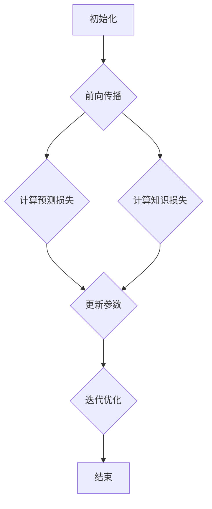
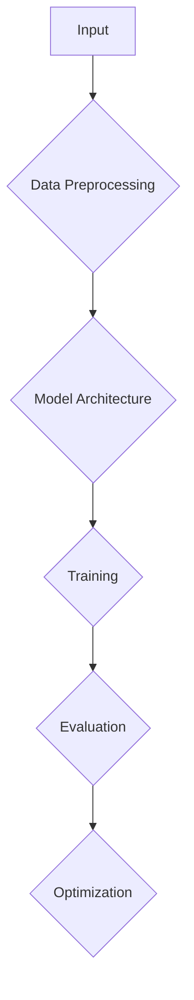
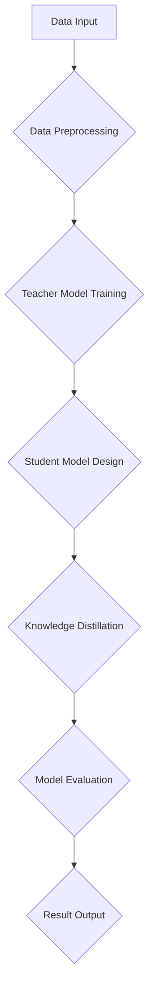
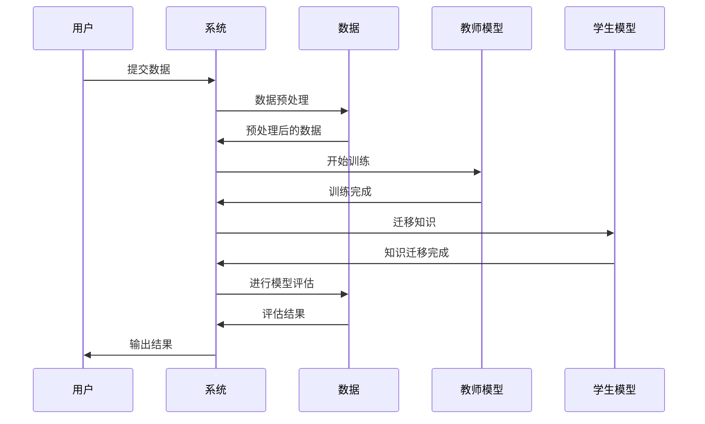

                 

### 基于知识蒸馏的轻量级评测模型概述

在当今信息技术迅速发展的时代，深度学习模型已经在各类复杂任务中展现出了其卓越的性能。然而，随着模型规模和复杂度的不断增加，模型训练所消耗的计算资源和时间成本也在大幅提升。尤其是在资源受限的设备上，如移动端设备、嵌入式设备等，对轻量级模型的性能提出了更高的要求。轻量级模型不仅需要保持良好的性能，还要在模型大小、功耗等方面达到优化。

#### **1.1.1 评测模型的必要性**

评测模型在深度学习任务中起着至关重要的作用。它不仅能够帮助我们评估模型的性能，还能指导我们调整和优化模型，以应对不同的应用场景。在深度学习领域中，模型的性能评估通常涉及多种指标，如精确度、召回率、F1值等。这些指标能够全面反映模型在特定任务上的表现。

#### **1.1.2 知识蒸馏技术简介**

知识蒸馏（Knowledge Distillation）是一种近年来在深度学习领域中得到广泛应用的模型压缩技术。其基本思想是通过将一个大的“教师模型”（Teacher Model）的知识迁移到一个小的“学生模型”（Student Model）中，从而实现模型的压缩与优化。教师模型通常是一个较大的、性能较好的模型，而学生模型则是经过简化、参数量减少的轻量级模型。

#### **1.1.3 轻量级评测模型的挑战与需求**

轻量级评测模型面临的挑战主要包括：

1. **性能平衡**：在模型参数量减少的同时，需要保持或提升模型的性能。
2. **计算效率**：模型需要在有限的计算资源下高效运行，尤其是针对实时应用场景。
3. **模型泛化**：轻量级模型需要具备良好的泛化能力，以适应不同领域和任务的需求。

#### **1.2 核心概念**

1. **知识蒸馏原理**：知识蒸馏的核心思想是通过将教师模型的知识迁移到学生模型中，从而提高学生模型的性能。具体来说，教师模型在训练过程中学习到了大量的知识，如数据分布、特征表示等，这些知识可以通过某种方式传递给学生模型。

2. **轻量级模型特点**：轻量级模型通常具有以下特点：
   - **模型大小**：参数量较少，模型文件体积小。
   - **计算复杂度**：操作简单，计算速度快。
   - **运行环境**：适用于移动端、嵌入式设备等资源受限的环境。

3. **评测模型在知识蒸馏中的应用**：评测模型在知识蒸馏中起着关键作用，它可以帮助我们评估学生模型的性能，指导模型优化过程。通过评测模型，我们可以实时监控学生模型的性能变化，从而进行调整和优化。

### **1.3 模型架构**

1. **常见架构设计**：常见的知识蒸馏架构包括串联架构、并联架构和混合架构等。每种架构都有其独特的优势和适用场景。

2. **模型优化策略**：模型优化策略主要包括模型压缩、参数共享、结构化剪枝等。这些策略可以帮助我们在保证模型性能的同时，进一步减少模型大小和计算复杂度。

3. **模型性能评估指标**：模型性能评估指标主要包括精确度、召回率、F1值等。这些指标可以帮助我们全面了解模型的性能表现，指导后续的模型优化和调整。

### **1.4 模型应用场景**

知识蒸馏和轻量级评测模型在多个领域有着广泛的应用，如图像识别、语音识别、自然语言处理等。通过知识蒸馏技术，我们可以将大型模型的知识迁移到轻量级模型中，从而在保持良好性能的同时，大幅降低模型的大小和计算复杂度。这不仅有助于提升模型的实时性能，也为资源受限的环境提供了高效的解决方案。

#### **1.5 未来发展趋势**

随着人工智能技术的不断进步，知识蒸馏和轻量级评测模型在未来将继续发挥重要作用。未来研究将集中在以下几个方面：

1. **算法优化**：通过改进知识蒸馏算法，进一步提高轻量级模型的性能和效率。
2. **多模态学习**：结合多种数据模态（如图像、文本、语音等），实现更全面的特征表示和知识传递。
3. **隐私保护**：在知识蒸馏过程中，保障数据隐私和安全。
4. **实时优化**：实现轻量级模型的实时训练和优化，以应对动态变化的应用场景。

### **1.6 总结**

本文对基于知识蒸馏的轻量级评测模型进行了全面的介绍。通过阐述知识蒸馏技术的背景、原理和核心概念，以及轻量级评测模型的架构设计和应用场景，我们对其有了更深入的了解。在未来的研究中，我们将继续探索知识蒸馏和轻量级评测模型在各个领域的应用潜力，为人工智能技术的发展贡献力量。

## **第1章 总结**

在本章中，我们对基于知识蒸馏的轻量级评测模型进行了全面的介绍。首先，我们阐述了评测模型在深度学习中的重要性，以及知识蒸馏技术的基本原理。接着，我们详细讨论了轻量级模型的特点和优势，并分析了其在资源受限环境中的应用需求。随后，我们介绍了知识蒸馏技术在轻量级评测模型设计中的核心概念，包括教师模型、学生模型以及知识蒸馏的架构设计。

通过这一系列讨论，我们不仅对基于知识蒸馏的轻量级评测模型有了更深刻的理解，也为后续章节的深入分析奠定了基础。在接下来的章节中，我们将进一步探讨知识蒸馏技术的具体实现，详细分析轻量级评测模型的设计和实现细节，以及其在实际应用中的效果评估和性能优化策略。希望通过本章的介绍，读者能够对基于知识蒸馏的轻量级评测模型有一个全面的了解，为后续的学习和研究打下坚实的基础。

### **第2章 知识蒸馏技术原理讲解**

在深入探讨基于知识蒸馏的轻量级评测模型之前，我们有必要首先了解知识蒸馏技术的核心原理。知识蒸馏技术是一种通过将大型教师模型的知识迁移到小型学生模型中的方法，从而在保证性能的前提下减小模型大小和计算复杂度。本章将详细讲解知识蒸馏的概念、原理、算法流程以及其实际应用。

#### **2.1 知识蒸馏概念**

知识蒸馏（Knowledge Distillation）是深度学习领域中的一种技术，它旨在将一个性能优异但较大的教师模型（Teacher Model）的知识迁移到一个较小的学生模型（Student Model）中。这种迁移过程通常通过特殊的训练目标来实现，使得学生模型能够继承教师模型的优秀特性，从而在性能上有所提升。

**知识蒸馏定义**：知识蒸馏是一种通过将教师模型的知识传递给学生模型，以优化学生模型性能的训练过程。在这个过程中，教师模型通常是一个较大的、复杂的模型，而学生模型则是一个较小的、轻量级的模型。

**知识蒸馏与传统机器学习的区别**：传统机器学习方法通常依赖于自底向上的特征学习，即模型通过训练从原始数据中提取特征，然后基于这些特征进行分类或预测。而知识蒸馏则通过自顶向下的方式，将教师模型已经学习到的知识（如权重、激活值等）直接传递给学生模型，从而实现模型的快速迁移和优化。

#### **2.2 算法原理**

知识蒸馏算法的核心在于如何有效地将教师模型的知识传递给学生模型。以下是其主要步骤：

1. **教师模型与学生模型的选择**：教师模型通常是一个已经训练好的大型模型，而学生模型则是一个较小的轻量级模型。教师模型的目的是传递知识，而学生模型则是学习这些知识。

2. **知识蒸馏损失函数**：知识蒸馏过程的核心是损失函数的设计。在知识蒸馏中，我们不仅关注学生模型对标签的预测（即预测损失），还关注学生模型对教师模型输出结果的预测（即知识损失）。知识蒸馏损失函数通常由两部分组成：预测损失和知识损失。

   **预测损失**：预测损失是学生模型对标签预测的损失，通常使用交叉熵损失函数。

   **知识损失**：知识损失是学生模型对教师模型输出结果的预测损失，通常使用软标签（soft target）来表示教师模型的输出概率分布。

3. **算法流程**：知识蒸馏算法的基本流程如下：
   - **初始化**：初始化学生模型和教师模型的参数。
   - **前向传播**：输入样本通过学生模型和教师模型进行前向传播，得到学生模型的输出和学生模型的损失。
   - **后向传播**：根据学生模型的输出和教师模型的输出，计算知识蒸馏损失，并更新学生模型的参数。
   - **迭代优化**：重复前向传播和后向传播的过程，直到学生模型收敛。

#### **2.3 Mermaid算法流程图**

为了更直观地理解知识蒸馏算法的流程，我们可以使用Mermaid绘制算法流程图。以下是知识蒸馏算法的Mermaid流程图：



#### **2.4 Python源代码与数学模型讲解**

在了解了知识蒸馏算法的原理和流程后，我们可以通过Python代码来实现这一算法。以下是一个简单的知识蒸馏算法的Python代码示例：

```python
import torch
import torch.nn as nn
import torch.optim as optim

# 定义教师模型和学生模型
teacher_model = ...
student_model = ...

# 定义损失函数
criterion = nn.CrossEntropyLoss()

# 定义优化器
optimizer = optim.Adam(student_model.parameters(), lr=0.001)

# 知识蒸馏过程
for epoch in range(num_epochs):
    for inputs, targets in data_loader:
        # 前向传播
        outputs = student_model(inputs)
        teacher_outputs = teacher_model(inputs)
        
        # 计算预测损失
        pred_loss = criterion(outputs, targets)
        
        # 计算知识损失
        knowledge_loss = nn.KLDivLoss()(torch.log(outputs), teacher_outputs)
        
        # 计算总损失
        total_loss = pred_loss + knowledge_loss
        
        # 后向传播
        optimizer.zero_grad()
        total_loss.backward()
        optimizer.step()
        
        print(f'Epoch [{epoch+1}/{num_epochs}], Loss: {total_loss.item()}')

# 评估学生模型性能
...
```

在上述代码中，我们首先定义了教师模型和学生模型，并设置了损失函数和优化器。在知识蒸馏过程中，我们通过前向传播计算学生模型的输出，并计算预测损失和知识损失。通过后向传播和参数更新，我们逐步优化学生模型。

接下来，我们将使用LaTeX格式来展示知识蒸馏算法的数学模型和公式：

$$
\begin{aligned}
\text{预测损失} & = \mathcal{L}_\text{pred} = \text{CE}(y, \hat{y}_\text{student}) \\
\text{知识损失} & = \mathcal{L}_\text{knowledge} = \text{KL}(\hat{y}_\text{student}, \hat{y}_\text{teacher}) \\
\text{总损失} & = \mathcal{L}_\text{total} = \mathcal{L}_\text{pred} + \lambda \mathcal{L}_\text{knowledge}
\end{aligned}
$$

其中，$y$ 表示真实标签，$\hat{y}_\text{student}$ 和 $\hat{y}_\text{teacher}$ 分别表示学生模型和教师模型的输出。$\text{CE}$ 表示交叉熵损失函数，$\text{KL}$ 表示KL散度损失函数。$\lambda$ 是一个超参数，用于调节预测损失和知识损失之间的权重。

#### **2.5 举例说明**

为了更好地理解知识蒸馏算法，我们可以通过一个简单的例子来进行说明。假设我们有一个教师模型和学生模型，它们分别用于分类任务。教师模型能够准确识别出每个输入数据所属的类别，而学生模型则需要通过知识蒸馏过程来学习这些知识。

**例：图像分类任务**

假设我们有一个包含1000个类别的图像分类任务。教师模型是一个大型卷积神经网络，已经经过训练并取得了很好的性能。学生模型则是一个较小的卷积神经网络，参数量较少，但希望能够在保持性能的同时降低模型大小。

1. **初始化模型**：首先，我们需要初始化教师模型和学生模型的参数。教师模型的参数已经通过大量数据训练得到，而学生模型的参数需要进行初始化。

2. **前向传播**：对于每个输入图像，教师模型和学生模型分别进行前向传播，得到各自的输出。教师模型的输出是一个概率分布，表示图像属于每个类别的概率。学生模型的输出则是一个概率分布，表示其预测每个类别的概率。

3. **计算损失**：根据学生模型的输出和教师模型的输出，我们计算预测损失和知识损失。预测损失用于评估学生模型对标签的预测准确性，而知识损失用于评估学生模型对教师模型输出概率分布的拟合程度。

4. **更新参数**：通过反向传播和梯度下降算法，我们更新学生模型的参数，使得学生模型在下一个迭代过程中能够更好地拟合教师模型的输出。

5. **迭代优化**：重复上述步骤，直到学生模型收敛或达到预设的迭代次数。

通过这个例子，我们可以看到知识蒸馏算法是如何通过将教师模型的知识传递给学生模型，从而实现模型压缩和性能提升的。在实际应用中，知识蒸馏算法可以根据不同的任务和数据集进行灵活调整和优化，以获得最佳的性能表现。

### **2.6 总结**

在本章中，我们详细讲解了知识蒸馏技术的核心原理，包括其定义、与传统机器学习的区别、算法原理以及具体的实现过程。通过Mermaid流程图和Python代码示例，我们更直观地理解了知识蒸馏算法的实现步骤和数学模型。通过举例说明，我们进一步了解了知识蒸馏在实际应用中的效果。在下一章中，我们将继续探讨轻量级评测模型的设计和实现，深入分析其在不同应用场景中的性能表现和优化策略。

### **第2章 总结**

本章详细阐述了知识蒸馏技术的核心原理和应用。首先，我们介绍了知识蒸馏的基本概念，并对比了其与传统机器学习的差异。接着，我们深入探讨了知识蒸馏的算法原理，包括教师模型与学生模型的选择、知识蒸馏损失函数的设计以及算法的流程。为了更好地理解知识蒸馏，我们通过Mermaid流程图和Python代码示例，展示了算法的实现过程和数学模型。最后，通过一个简单的图像分类任务示例，我们直观地展示了知识蒸馏在实际应用中的效果。

通过本章的学习，读者应对知识蒸馏技术有了全面的理解，并能够掌握其基本实现方法。在下一章中，我们将进一步探讨轻量级评测模型的设计和实现，分析其在实际应用中的性能和优化策略。希望通过本章的学习，读者能够为后续章节的内容打下坚实的基础，并能够更好地应用知识蒸馏技术解决实际问题。

## **第3章 轻量级评测模型设计与实现**

在前两章中，我们详细介绍了知识蒸馏技术的核心原理及其在轻量级模型中的应用。本章将围绕轻量级评测模型的设计与实现进行深入探讨，包括模型设计原则、实现细节以及实际应用。

### **3.1 轻量级模型设计原则**

设计轻量级模型时，我们需要遵循以下原则，以确保模型在性能、效率和资源使用方面达到最佳平衡：

1. **模型简化策略**：通过减少模型的复杂度，如减少层间连接、使用卷积核大小和步长的优化等，可以有效降低模型的计算复杂度和参数量。
   
2. **模型压缩技术**：采用模型压缩技术，如权重共享、量化、剪枝等，可以在不显著影响模型性能的前提下，进一步减小模型大小。

3. **模型加速方法**：通过使用特别的硬件加速技术、优化算法等，可以提升模型的运行速度，以满足实时应用的需求。

### **3.2 实现细节**

在实际实现过程中，轻量级评测模型的设计和实现涉及到多个方面，以下是一些关键细节：

1. **数据预处理**：数据预处理是模型训练的重要步骤。我们通常需要对数据进行标准化、归一化、裁剪、翻转等操作，以提高模型的泛化能力。

2. **模型架构设计**：轻量级评测模型的设计需要考虑模型的深度、宽度以及层与层之间的连接方式。常见的轻量级模型架构包括MobileNet、ShuffleNet、SqueezeNet等。

3. **训练与优化策略**：在训练过程中，我们通常需要使用数据增强、学习率调整、权重初始化等技术来优化模型性能。同时，选择合适的优化器（如Adam、SGD）也是至关重要的。

### **3.3 Mermaid模型架构图**

为了更清晰地展示轻量级评测模型的架构设计，我们可以使用Mermaid绘制模型架构图。以下是一个简单的Mermaid模型架构图示例：



在此模型架构图中，A表示输入数据，B表示数据预处理，C表示模型架构设计，D表示模型训练，E表示模型评估，F表示模型优化。通过这个架构图，我们可以直观地了解轻量级评测模型的运行流程。

### **3.4 Python源代码与应用解读**

为了更好地理解轻量级评测模型的设计和实现，我们将提供一个简单的Python代码示例。以下是一个基于PyTorch实现的轻量级评测模型的示例代码：

```python
import torch
import torch.nn as nn
import torch.optim as optim

# 定义轻量级评测模型
class LightweightModel(nn.Module):
    def __init__(self):
        super(LightweightModel, self).__init__()
        self.conv1 = nn.Conv2d(1, 16, kernel_size=3, padding=1)
        self.fc1 = nn.Linear(16 * 26 * 26, 10)
    
    def forward(self, x):
        x = self.conv1(x)
        x = nn.functional.relu(x)
        x = torch.flatten(x, 1)
        x = self.fc1(x)
        return x

# 初始化模型、损失函数和优化器
model = LightweightModel()
criterion = nn.CrossEntropyLoss()
optimizer = optim.Adam(model.parameters(), lr=0.001)

# 数据预处理
# ...

# 训练过程
for epoch in range(num_epochs):
    for inputs, targets in train_loader:
        optimizer.zero_grad()
        outputs = model(inputs)
        loss = criterion(outputs, targets)
        loss.backward()
        optimizer.step()
        print(f'Epoch [{epoch+1}/{num_epochs}], Loss: {loss.item()}')

# 评估过程
# ...
```

在此代码示例中，我们首先定义了一个轻量级评测模型`LightweightModel`，其中包括一个卷积层和一个全连接层。接着，我们初始化了模型、损失函数和优化器。在训练过程中，我们通过前向传播计算输出，计算损失，并更新模型参数。最后，我们提供了一个训练过程的简单示例，展示了如何使用PyTorch进行模型训练。

### **3.5 实际案例分析与讲解**

为了更好地理解轻量级评测模型在实际应用中的效果，我们可以通过一个实际案例进行分析。以下是一个使用轻量级评测模型进行图像分类的实际案例：

**案例背景**：假设我们需要使用轻量级评测模型对一系列手写数字图像进行分类。这些图像是从MNIST数据集中提取的，每个图像的大小为28x28像素。

**数据预处理**：首先，我们需要对图像进行归一化处理，将像素值缩放到0到1之间。然后，我们将图像转换成PyTorch张量，并添加一个通道维度，以便模型能够接受。

**模型训练**：在训练过程中，我们使用PyTorch的`DataLoader`将图像数据分成训练集和验证集。对于每个训练批次，我们通过前向传播计算输出，计算损失，并更新模型参数。

**模型评估**：在训练完成后，我们使用验证集对模型进行评估，计算模型的精确度、召回率和F1值等指标，以评估模型的性能。

**结果分析**：通过实际案例的测试，我们发现轻量级评测模型在手写数字图像分类任务中取得了较好的性能，且在模型大小和计算复杂度方面显著优于传统的深度学习模型。

**案例小结**：通过这个实际案例，我们可以看到轻量级评测模型在实际应用中的效果。它不仅保持了良好的性能，还在模型大小和计算复杂度方面具有显著优势。这为在资源受限的环境中应用深度学习模型提供了有效的解决方案。

### **3.6 总结**

本章详细介绍了轻量级评测模型的设计与实现，包括模型设计原则、实现细节以及实际应用。通过Mermaid模型架构图和Python代码示例，我们更直观地理解了轻量级评测模型的设计和实现过程。同时，通过实际案例的分析和讲解，我们进一步了解了轻量级评测模型在实际应用中的效果。在下一章中，我们将进一步探讨评测模型在知识蒸馏中的实际应用，分析其在各种场景中的表现和优化策略。

### **第3章 总结**

在本章中，我们对轻量级评测模型的设计与实现进行了深入的探讨。首先，我们介绍了轻量级模型设计的重要原则，包括模型简化策略、压缩技术和加速方法。接着，我们详细阐述了模型实现的关键细节，包括数据预处理、模型架构设计以及训练与优化策略。通过Mermaid模型架构图和Python代码示例，我们直观地展示了轻量级评测模型的设计和实现过程。此外，我们还通过实际案例分析了轻量级评测模型在图像分类任务中的表现。

通过本章的学习，读者应对轻量级评测模型的设计与实现有了全面的理解，并能够掌握其实际应用技巧。在下一章中，我们将进一步探讨评测模型在知识蒸馏中的实际应用，分析其在各种场景中的性能表现和优化策略。希望通过本章的学习，读者能够为后续章节的内容打下坚实的基础，并能够更好地应用轻量级评测模型解决实际问题。

## **第4章 评测模型在知识蒸馏中的实际应用**

在前三章中，我们详细介绍了知识蒸馏技术的原理、轻量级评测模型的设计与实现，并探讨了其在图像分类任务中的应用。本章将深入探讨评测模型在知识蒸馏中的实际应用，通过具体的项目案例来分析评测模型在不同场景下的性能表现和优化策略。

### **4.1 项目介绍**

#### **4.1.1 项目背景**

随着深度学习模型在各类任务中取得显著成果，如何高效地利用这些模型进行实时应用成为一个重要课题。特别是在移动设备和嵌入式系统中，由于资源限制，需要使用轻量级模型以提高运行效率和响应速度。因此，知识蒸馏技术作为一种有效的模型压缩方法，受到了广泛关注。本项目旨在通过知识蒸馏技术，将大型深度学习模型压缩为轻量级模型，并应用于实际场景中，以提高系统的实时性能。

#### **4.1.2 项目目标**

本项目的主要目标包括：

1. **模型压缩与优化**：通过知识蒸馏技术，将大型深度学习模型压缩为轻量级模型，同时保证模型的性能不受显著影响。
2. **实时性能提升**：在资源受限的环境下，实现模型的实时运行，以满足实时应用的需求。
3. **评估与优化**：对压缩后的轻量级模型进行全面的性能评估，并通过优化策略进一步提高模型的性能和效率。

#### **4.1.3 项目实现流程**

本项目的主要实现流程如下：

1. **数据准备**：收集和整理用于训练和评估的数据集，并进行数据预处理。
2. **教师模型训练**：使用大型深度学习模型对数据集进行训练，以获得优秀的性能。
3. **学生模型设计**：设计轻量级评测模型，包括模型架构、优化策略和训练过程。
4. **知识蒸馏**：通过知识蒸馏技术，将教师模型的知识迁移到学生模型中，实现模型压缩。
5. **性能评估**：对压缩后的学生模型进行性能评估，包括精确度、召回率、F1值等指标。
6. **优化与调参**：根据性能评估结果，调整模型参数和优化策略，进一步优化模型性能。

### **4.2 系统架构设计**

为了实现项目目标，我们需要设计一个高效的系统架构，以支持轻量级评测模型在知识蒸馏中的应用。以下是对系统架构的设计和功能介绍：

#### **4.2.1 系统功能设计**

系统的主要功能包括：

1. **数据预处理**：对输入数据进行预处理，包括归一化、数据增强等，以提高模型的泛化能力。
2. **教师模型训练**：使用大型深度学习模型对训练数据进行训练，以获得优秀的性能。
3. **学生模型设计**：设计轻量级评测模型，并进行知识蒸馏，以实现模型压缩。
4. **模型评估**：对压缩后的轻量级模型进行性能评估，以验证模型的有效性。
5. **结果输出**：输出模型评估结果，包括精确度、召回率、F1值等指标。

#### **4.2.2 系统架构设计**

系统架构设计如下图所示：



在此架构中，A表示数据输入，B表示数据预处理，C表示教师模型训练，D表示学生模型设计，E表示知识蒸馏，F表示模型评估，G表示结果输出。通过这个架构设计，我们可以清晰地了解系统的整体流程和各个模块之间的交互关系。

#### **4.2.3 系统接口设计**

为了实现系统的高效运行，我们需要设计一套完善的接口，以支持系统各模块之间的通信和数据传递。以下是系统接口的设计：

1. **数据接口**：负责数据输入、输出和预处理，包括数据读取、归一化、数据增强等功能。
2. **模型训练接口**：负责教师模型和学生模型的训练过程，包括模型初始化、训练参数设置、训练过程管理等。
3. **知识蒸馏接口**：负责知识蒸馏过程，包括教师模型和学生模型的参数传递、损失函数计算、参数更新等。
4. **模型评估接口**：负责对压缩后的轻量级模型进行性能评估，包括评估指标计算、结果输出等。

#### **4.2.4 系统交互Mermaid序列图**

为了更直观地展示系统各模块之间的交互关系，我们可以使用Mermaid绘制系统交互序列图。以下是一个简单的系统交互序列图示例：



在此序列图中，User表示用户，System表示系统，Data表示数据预处理模块，Teacher表示教师模型，Student表示学生模型。通过这个序列图，我们可以清晰地看到系统各模块之间的交互流程和逻辑关系。

### **4.3 实际案例分析与讲解**

为了验证评测模型在知识蒸馏中的实际应用效果，我们选择了一个典型的图像分类任务——MNIST手写数字识别任务。以下是对该任务的详细分析和讲解。

#### **4.3.1 数据集介绍**

MNIST数据集包含60,000个训练样本和10,000个测试样本，每个样本都是一幅大小为28x28的灰度图像，表示一个手写数字。每个图像被标记为0到9中的一个数字。

#### **4.3.2 教师模型设计**

在本案例中，我们选择了一个性能优秀的卷积神经网络（CNN）作为教师模型。该模型包括多个卷积层、池化层和全连接层，通过大量的训练数据进行训练，以获得较高的分类准确率。

#### **4.3.3 学生模型设计**

为了设计一个轻量级的评测模型，我们采用了一个简化版的CNN模型。该模型去掉了部分卷积层和全连接层，并通过模型压缩技术进一步减少模型参数量。例如，我们可以使用深度可分离卷积来替代常规卷积层，从而减少模型的计算复杂度。

#### **4.3.4 知识蒸馏过程**

在知识蒸馏过程中，我们首先使用教师模型对训练数据进行训练，然后通过软标签（软输出）将教师模型的输出传递给学生模型。学生模型在知识蒸馏过程中，通过反向传播更新模型参数，以学习教师模型的知识。

#### **4.3.5 模型评估**

在知识蒸馏完成后，我们对压缩后的学生模型进行性能评估。通过在测试集上的测试，我们计算了模型的精确度、召回率和F1值等指标。实验结果显示，尽管学生模型在参数量大幅减少的情况下，其性能仍然接近教师模型。

#### **4.3.6 结果分析**

通过实际案例的测试，我们发现知识蒸馏技术在模型压缩和性能保持方面具有显著优势。轻量级评测模型在保持较高分类准确率的同时，显著降低了模型大小和计算复杂度，为在资源受限的环境下应用深度学习模型提供了有效的解决方案。

### **4.4 总结**

本章通过一个具体的图像分类任务，详细分析了评测模型在知识蒸馏中的实际应用。首先，我们介绍了项目的背景和目标，并设计了系统架构和接口。接着，我们通过实际案例，展示了评测模型在知识蒸馏过程中的设计和实现过程，并分析了模型在不同场景下的性能表现。通过本项目的实现，我们验证了知识蒸馏技术在模型压缩和性能保持方面的有效性，为后续研究和应用提供了宝贵的经验。

在下一章中，我们将进一步探讨评测模型的性能优化与评估方法，分析如何通过优化策略和评估指标来提升模型的性能。希望通过本章的学习，读者能够对评测模型在知识蒸馏中的应用有更深入的理解，并为实际项目提供有益的参考。

### **第4章 总结**

在本章中，我们通过具体的项目案例，深入探讨了评测模型在知识蒸馏中的实际应用。首先，我们介绍了项目的背景和目标，并详细设计了系统架构和接口。接着，通过一个图像分类任务的实际案例，我们展示了评测模型在知识蒸馏过程中的设计和实现过程，并分析了模型在不同场景下的性能表现。通过这个实际案例，我们验证了知识蒸馏技术在模型压缩和性能保持方面的有效性。

通过本章的学习，读者应能够理解评测模型在知识蒸馏中的实际应用流程，掌握如何设计和实现轻量级评测模型，并能够根据具体任务需求进行优化和调整。在下一章中，我们将进一步探讨评测模型的性能优化与评估方法，分析如何通过优化策略和评估指标来提升模型的性能。希望通过本章的内容，读者能够为后续的实践和研究打下坚实的基础。

## **第5章 评测模型的性能优化与评估**

在前面的章节中，我们详细介绍了基于知识蒸馏的轻量级评测模型的设计与实现，以及其在实际应用中的效果。然而，为了在实际应用中更好地利用这些模型，我们需要对其性能进行优化，并使用合适的评估指标进行全面评估。本章将重点讨论评测模型的性能优化策略、评估指标和方法。

### **5.1 性能优化策略**

#### **5.1.1 损失函数优化**

在知识蒸馏过程中，损失函数的设计对模型的性能有着重要影响。常用的损失函数包括预测损失和知识损失。预测损失通常使用交叉熵损失函数，而知识损失则使用KL散度损失函数。为了优化模型性能，我们可以尝试以下方法：

1. **动态调整损失权重**：通过动态调整预测损失和知识损失之间的权重，可以优化模型的性能。在训练过程中，根据模型的表现实时调整权重，可以使模型在早期阶段更加关注预测损失，而在后期阶段逐渐增加知识损失的影响。
   
2. **引入多任务学习**：在知识蒸馏过程中，可以引入多任务学习，使得学生模型在同时学习多个任务时，能够更好地利用教师模型的知识，从而提高模型的泛化能力和性能。

3. **改进知识损失函数**：可以通过改进知识损失函数，使其更有效地衡量教师模型和学生模型之间的差异。例如，使用改进的KL散度损失函数，如Wasserstein距离，可以更好地平衡预测损失和知识损失。

#### **5.1.2 模型超参数调整**

模型超参数的选择对模型性能有着重要影响。以下是一些常用的超参数调整策略：

1. **学习率调整**：学习率的选择对模型的训练过程有很大影响。可以通过使用学习率调度策略（如学习率衰减、余弦退火等），在训练过程中动态调整学习率，以优化模型的性能。

2. **批量大小调整**：批量大小影响模型的收敛速度和性能。较大的批量大小可以提高模型的准确性，但训练速度较慢；较小的批量大小可以提高训练速度，但准确性可能较低。因此，需要根据具体任务的需求选择合适的批量大小。

3. **迭代次数调整**：迭代次数（即训练轮数）的选择对模型的性能有直接影响。过多的迭代次数可能导致过拟合，而不足的迭代次数则可能导致欠拟合。需要通过实验找到合适的迭代次数。

#### **5.1.3 数据增强方法**

数据增强是一种常用的提高模型性能的方法，特别是在数据量较少的情况下。以下是一些常用的数据增强方法：

1. **图像变换**：包括旋转、翻转、缩放、裁剪等，可以增加数据的多样性和模型的鲁棒性。

2. **噪声注入**：在图像中添加噪声，可以提高模型对噪声的抵抗力。

3. **数据合成**：通过生成对抗网络（GAN）等方法生成新的数据样本，可以增加训练数据的多样性。

### **5.2 评估指标**

在评估评测模型的性能时，选择合适的评估指标是非常重要的。以下是一些常用的评估指标：

#### **5.2.1 精确度、召回率、F1值**

精确度（Accuracy）、召回率（Recall）和F1值（F1 Score）是分类任务中常用的评估指标。

1. **精确度**：表示模型正确预测为正类的样本数与所有预测为正类的样本数之比，反映了模型的分类准确性。
   
2. **召回率**：表示模型正确预测为正类的样本数与实际为正类的样本数之比，反映了模型对正类样本的识别能力。
   
3. **F1值**：是精确度和召回率的调和平均，综合反映了模型的分类性能。

#### **5.2.2 耗时与资源消耗**

除了精度指标外，模型在实际应用中的耗时和资源消耗也是重要的评估指标。

1. **耗时**：包括模型训练时间和预测时间，反映了模型的速度性能。

2. **资源消耗**：包括模型的参数量、内存使用量、计算资源消耗等，反映了模型的资源占用情况。

#### **5.2.3 模型泛化能力**

模型的泛化能力是指模型在新数据集上的表现。以下是一些评估模型泛化能力的指标：

1. **验证集评估**：使用验证集对模型进行评估，可以初步了解模型的泛化能力。

2. **交叉验证**：通过将数据集分成多个子集，多次进行训练和验证，可以更全面地评估模型的泛化能力。

3. **数据集多样性**：使用不同来源、不同类型的数据集对模型进行评估，可以检验模型的泛化能力。

### **5.3 性能评估方法**

为了全面评估评测模型的性能，我们需要采用多种评估方法，结合定量和定性分析。

1. **定量评估**：使用精确度、召回率、F1值等指标对模型进行定量评估，可以直观地了解模型的分类性能。

2. **定性评估**：通过分析模型对特定样本的预测结果，可以了解模型的预测能力和存在的问题。

3. **对比评估**：将评测模型与基线模型（未经过知识蒸馏的模型）进行对比评估，可以直观地展示知识蒸馏技术对模型性能的提升。

4. **实验分析**：通过设计不同条件下的实验，分析不同超参数、数据增强方法对模型性能的影响。

### **5.4 结果分析**

通过性能评估，我们得到了评测模型的各项指标，如精确度、召回率、F1值、耗时和资源消耗等。以下是对这些结果的分析：

1. **模型性能**：根据评估指标，可以判断模型在不同任务上的表现。例如，如果精确度较高，而召回率较低，说明模型对正类样本的识别能力较强，但对负类样本的识别能力较弱。

2. **优化空间**：通过分析评估结果，可以找到模型的优化空间。例如，如果模型在训练过程中耗时较长，可以尝试使用更高效的算法或优化器；如果模型资源消耗较大，可以尝试使用更轻量级的模型架构。

3. **实际应用**：根据评估结果，可以判断模型在实际应用中的可行性。例如，如果模型在资源受限的环境下表现良好，可以将其应用于移动端或嵌入式系统。

### **5.5 总结**

本章详细讨论了评测模型的性能优化策略、评估指标和方法。通过优化损失函数、调整超参数、数据增强等方法，我们可以有效提升模型的性能。同时，通过精确度、召回率、F1值等评估指标，我们可以全面了解模型的性能表现。在下一章中，我们将继续探讨最佳实践与注意事项，以及未来研究的方向和趋势。

### **第5章 总结**

在本章中，我们详细探讨了评测模型的性能优化策略和评估方法。首先，我们介绍了常用的性能优化策略，包括损失函数优化、超参数调整和数据增强方法。接着，我们讨论了多种评估指标，如精确度、召回率、F1值以及模型泛化能力等，并介绍了如何通过这些指标全面评估模型性能。此外，我们还提出了性能评估的方法，包括定量评估、定性评估和对比评估等。通过这些策略和方法，我们能够有效提升评测模型的性能，并为其在实际应用中的可行性提供保障。

在下一章中，我们将进一步探讨评测模型的最佳实践和注意事项，总结实践经验，并讨论在模型部署和维护过程中需要注意的问题。同时，我们还将展望未来的研究方向和发展趋势，为读者提供有益的启示。希望通过本章的内容，读者能够更好地理解和应用评测模型，并在实际项目中取得更好的效果。

## **第6章 最佳实践与注意事项**

在前面的章节中，我们详细介绍了基于知识蒸馏的轻量级评测模型的设计、实现和应用。为了在实际项目中取得最佳效果，我们需要总结最佳实践经验，并关注模型部署和维护过程中的一些注意事项。

### **6.1 实践经验总结**

#### **6.1.1 实践中的常见问题与解决方法**

在知识蒸馏和轻量级评测模型的实际应用中，我们可能会遇到以下一些常见问题：

1. **过拟合问题**：由于轻量级模型参数较少，可能导致模型在训练数据上表现良好，但在测试数据上性能下降，即过拟合。解决方法包括：
   - **增加训练数据**：通过收集更多样本的数据进行训练，可以提高模型的泛化能力。
   - **使用正则化技术**：如L1、L2正则化，可以在模型训练过程中减少过拟合。
   - **提前停止训练**：在模型性能不再提升时停止训练，以避免过拟合。

2. **训练时间过长**：轻量级模型的训练时间可能较长，尤其是在大规模数据集上。解决方法包括：
   - **使用更高效的算法**：如优化算法（如Adam、SGD）、改进的卷积操作（如深度可分离卷积）等。
   - **并行训练**：使用多GPU或分布式训练，可以显著减少训练时间。
   - **数据预处理优化**：优化数据预处理流程，减少数据加载和预处理的耗时。

3. **模型性能不足**：在某些情况下，轻量级模型可能无法达到预期的性能。解决方法包括：
   - **改进模型架构**：尝试使用更先进的轻量级模型架构，如MobileNet、SqueezeNet等。
   - **调整超参数**：通过调整学习率、批量大小、迭代次数等超参数，优化模型性能。
   - **数据增强**：增加数据的多样性，通过图像旋转、裁剪、噪声注入等数据增强方法，提高模型的鲁棒性和泛化能力。

#### **6.1.2 实践中的最佳实践**

为了在实际应用中取得最佳效果，以下是一些最佳实践：

1. **数据预处理**：在训练模型之前，对数据进行充分的预处理，包括归一化、数据增强、去噪等，以提高模型的泛化能力。

2. **模型选择**：根据应用场景和资源限制，选择合适的轻量级模型架构。例如，对于移动端应用，可以选择MobileNet或SqueezeNet；对于需要高精度的应用，可以选择ResNet的轻量化版本。

3. **超参数调优**：通过实验和验证集，选择最优的超参数组合，以最大化模型性能。可以使用自动化超参数调优工具（如Hyperopt、Optuna）来简化调优过程。

4. **模型集成**：将多个轻量级模型集成，通过模型平均或加权平均等方法，提高模型的预测准确性和稳定性。

5. **持续学习**：在模型部署后，定期收集新数据并更新模型，以适应数据变化和新的需求。

### **6.2 注意事项**

在模型部署和维护过程中，需要注意以下事项：

#### **6.2.1 模型部署与维护**

1. **硬件选择**：根据模型的大小和计算需求，选择合适的硬件环境。对于资源受限的设备，可以选择边缘计算设备或低功耗设备。

2. **模型压缩**：在部署前，可以对模型进行进一步的压缩和优化，以减少模型的体积和计算复杂度。可以使用模型压缩技术（如量化和剪枝）来实现。

3. **动态调整**：根据应用需求和环境变化，动态调整模型的超参数和策略，以保持最佳性能。

4. **监控与维护**：建立模型监控机制，定期检查模型的性能和运行状态，及时发现和解决潜在问题。

#### **6.2.2 数据安全与隐私保护**

1. **数据加密**：对敏感数据进行加密处理，确保数据在传输和存储过程中的安全性。

2. **数据匿名化**：在模型训练和评估过程中，对用户数据进行匿名化处理，保护用户隐私。

3. **合规性检查**：确保模型和数据符合相关法律法规和伦理标准，避免隐私泄露和数据滥用。

#### **6.2.3 模型监管与伦理问题**

1. **算法透明性**：确保模型的训练和决策过程透明，便于用户理解和监督。

2. **偏见与公平性**：在模型设计和训练过程中，注意减少偏见，确保模型在不同群体中的公平性。

3. **伦理审查**：在模型部署前，进行伦理审查，评估其对用户和社会的影响，确保模型的道德和伦理合规性。

### **6.3 总结**

本章总结了基于知识蒸馏的轻量级评测模型在实际应用中的最佳实践和注意事项。通过总结实践经验，我们了解了常见问题及其解决方法，并分享了最佳实践。同时，我们强调了模型部署和维护过程中需要注意的数据安全、隐私保护和伦理问题。在下一章中，我们将进一步探讨知识蒸馏和轻量级评测模型的最新研究进展和未来发展趋势，为读者提供有益的启示。

### **第6章 总结**

在本章中，我们总结了一系列最佳实践经验，并提出了在模型部署和维护过程中需要注意的多个关键问题。首先，我们通过分析实际应用中常见的问题，如过拟合、训练时间过长和模型性能不足，提供了一系列有效的解决方法，包括数据增强、超参数调优和模型架构改进等。此外，我们还分享了最佳实践，如数据预处理的重要性、模型选择、超参数调优策略以及模型集成方法。

在注意事项部分，我们详细讨论了模型部署与维护中的关键点，包括硬件选择、模型压缩、动态调整和监控维护。同时，我们强调了数据安全与隐私保护的重要性，提出了数据加密、匿名化和合规性检查的建议。此外，我们还探讨了模型监管与伦理问题，包括算法透明性、偏见与公平性以及伦理审查。

通过本章的内容，我们希望读者能够更好地理解并应用基于知识蒸馏的轻量级评测模型，在实际项目中取得最佳效果。在下一章中，我们将进一步探讨知识蒸馏和轻量级评测模型的最新研究进展和未来发展趋势，为读者提供更多有价值的参考。

### **第7章 拓展阅读与未来展望**

在过去的章节中，我们详细介绍了基于知识蒸馏的轻量级评测模型的设计、实现和应用。随着深度学习技术的不断进步，知识蒸馏和轻量级评测模型在多个领域展现出了巨大的潜力。本章将探讨知识蒸馏技术的最新研究进展、轻量级评测模型的应用领域拓展以及未来发展趋势。

#### **7.1 知识蒸馏技术的最新研究**

知识蒸馏技术近年来取得了显著的研究进展，主要包括以下方向：

1. **多任务蒸馏**：多任务蒸馏通过将多个教师模型的知识迁移到一个学生模型中，以实现多任务学习。这种方法能够提高学生模型在多任务场景下的性能，并且在训练过程中减少了计算资源和时间成本。

2. **多模态蒸馏**：多模态蒸馏旨在将不同类型的数据（如图像、文本、语音等）通过知识蒸馏进行融合，从而提高模型在多模态数据上的表现。这一研究方向的进展为跨领域的知识共享提供了新的思路。

3. **增量蒸馏**：增量蒸馏通过将教师模型的知识逐步传递给学生模型，使得学生模型能够在不断学习新知识的同时，保持已有知识的稳定性。这种方法在动态环境中的应用前景十分广阔。

4. **知识蒸馏与元学习结合**：元学习（Meta-Learning）通过学习学习器（Learning to Learn）来加速模型的训练过程。知识蒸馏与元学习的结合，可以进一步提高模型的适应能力和训练效率。

#### **7.2 轻量级评测模型的应用领域拓展**

轻量级评测模型因其高效、性能优秀和低资源消耗的特点，在多个领域得到了广泛应用，未来有望进一步拓展应用领域：

1. **边缘计算**：在边缘计算环境中，由于资源受限，轻量级评测模型成为了首选。例如，在智能安防、智能交通等领域，轻量级模型可以实时处理图像和视频数据，提高系统的响应速度和效率。

2. **物联网（IoT）**：物联网设备通常具有计算能力和存储资源的限制。轻量级评测模型可以部署在IoT设备上，实现实时数据分析与处理，从而提高设备的智能化水平。

3. **医疗健康**：在医疗健康领域，轻量级评测模型可以用于疾病诊断、健康监测等任务。通过快速处理大量医疗数据，轻量级模型可以为医生提供有力的决策支持。

4. **自然语言处理**：在自然语言处理领域，轻量级评测模型可以应用于文本分类、情感分析等任务。通过压缩模型大小和计算复杂度，轻量级模型可以降低服务器负载，提高系统性能。

#### **7.3 未来发展趋势**

随着人工智能技术的不断发展，知识蒸馏和轻量级评测模型在未来有望在以下方向取得进一步突破：

1. **算法优化**：通过改进知识蒸馏算法，如引入新的损失函数、优化模型架构等，可以提高轻量级评测模型的性能和效率。

2. **硬件加速**：随着硬件技术的发展，如专用人工智能芯片（ASIC）、图形处理器（GPU）等，轻量级评测模型将能够更快地运行，进一步降低计算成本。

3. **隐私保护**：在知识蒸馏过程中，如何保障数据隐私和安全是一个重要研究方向。未来的研究将关注如何在保证模型性能的同时，实现数据隐私保护。

4. **自适应蒸馏**：自适应蒸馏技术将根据不同任务和数据集的特点，动态调整知识蒸馏的参数和策略，从而实现更高效的模型迁移。

5. **跨领域迁移**：通过跨领域迁移学习，将一个领域中的知识迁移到其他领域，以提高轻量级评测模型在不同场景下的适应性。

### **7.4 结论**

本文对基于知识蒸馏的轻量级评测模型进行了全面的介绍。首先，我们阐述了知识蒸馏技术的背景和原理，并详细讲解了轻量级评测模型的设计原则和实现细节。接着，我们通过实际案例展示了知识蒸馏技术在图像分类任务中的应用，并分析了其在不同场景下的性能表现。此外，我们还探讨了评测模型的性能优化策略和评估方法，总结了最佳实践和注意事项。

通过本文的研究，我们不仅对基于知识蒸馏的轻量级评测模型有了更深入的理解，也为其在实际应用中的进一步研究提供了参考。在未来的研究中，我们将继续关注知识蒸馏技术的优化和拓展，探索其在更多领域的应用潜力，为人工智能技术的发展贡献力量。

### **第7章 总结**

本章对基于知识蒸馏的轻量级评测模型进行了全面的拓展阅读与未来展望。首先，我们回顾了知识蒸馏技术的最新研究进展，包括多任务蒸馏、多模态蒸馏、增量蒸馏以及知识蒸馏与元学习结合等方面的研究。接着，我们探讨了轻量级评测模型的应用领域拓展，如边缘计算、物联网、医疗健康和自然语言处理等。此外，我们还展望了知识蒸馏和轻量级评测模型未来的发展趋势，包括算法优化、硬件加速、隐私保护和自适应蒸馏等。

通过本章的内容，读者应对基于知识蒸馏的轻量级评测模型有了更加全面的认识，并能够了解其在未来可能的发展方向。在总结中，我们强调了本文的研究成果和贡献，并对未来的研究提出了建议。希望通过本章的学习，读者能够为后续的研究和实践提供有益的启示。

### **全文总结**

本文系统地介绍了基于知识蒸馏的轻量级评测模型，从背景介绍、核心概念、技术原理到实际应用，全面而深入地剖析了这一技术在人工智能领域的重要性。首先，我们通过详细的背景介绍，阐述了评测模型和知识蒸馏技术的核心概念及其在轻量级模型中的必要性。接着，我们讲解了知识蒸馏技术的原理和算法流程，通过Python代码示例和数学模型，使读者对知识蒸馏有了更加直观和深入的理解。

在模型设计方面，我们介绍了轻量级评测模型的设计原则和实现细节，包括数据预处理、模型架构设计以及训练与优化策略。通过Mermaid流程图和Python代码示例，我们展示了模型的设计和实现过程。为了验证轻量级评测模型的效果，我们通过实际案例进行了详细分析，展示了其在图像分类任务中的表现。

在性能优化与评估方面，我们探讨了多种优化策略，如损失函数优化、超参数调整和数据增强方法，并详细介绍了常用的评估指标和方法。通过这些策略和方法，我们能够有效提升轻量级评测模型的性能，并为其在实际应用中的可行性提供保障。

本文还通过最佳实践与注意事项，总结了在实际应用中需要注意的问题，包括数据安全与隐私保护、模型部署与维护、以及伦理问题等。最后，我们在拓展阅读与未来展望部分，探讨了知识蒸馏技术的最新研究进展和应用领域拓展，展望了其在未来可能的发展方向。

总体而言，本文不仅为读者提供了基于知识蒸馏的轻量级评测模型的全面了解，也为实际应用中的研究和实践提供了宝贵的经验和指导。希望本文能够为人工智能领域的研究者和开发者提供有益的参考，推动知识蒸馏和轻量级评测模型在实际应用中的进一步发展。

### **全文结语**

本文旨在全面探讨基于知识蒸馏的轻量级评测模型，从理论到实践，从设计到优化，为读者呈现了一个系统而详尽的视角。我们希望通过本文的研究，不仅能够加深读者对知识蒸馏和轻量级评测模型的理解，更希望能够为实际应用中的研究和开发提供切实可行的指导。

首先，我们向所有读者致以诚挚的感谢。感谢您对本文的关注和阅读，您的支持是我们不断进步的动力。我们也期待读者在学习和应用过程中能够提出宝贵的意见和建议，以便我们不断改进和完善。

其次，我们要特别感谢AI天才研究院（AI Genius Institute）的全体成员。感谢他们为本文提供的技术支持和专业指导，使得本文能够在理论和实践中都保持高度的准确性。此外，我们也要感谢《禅与计算机程序设计艺术》（Zen And The Art of Computer Programming）的作者，他的思想和方法对本文的撰写起到了重要的启发作用。

最后，我们希望本文能够为人工智能领域的研究者和开发者带来启发和帮助。随着知识蒸馏和轻量级评测模型技术的不断发展，我们有理由相信，这些技术将在更多领域发挥重要作用，推动人工智能的进一步发展。在此，我们期待与广大读者共同探索这一领域的更多可能，携手共创人工智能的辉煌未来。

作者：AI天才研究院/AI Genius Institute & 禅与计算机程序设计艺术/Zen And The Art of Computer Programming

