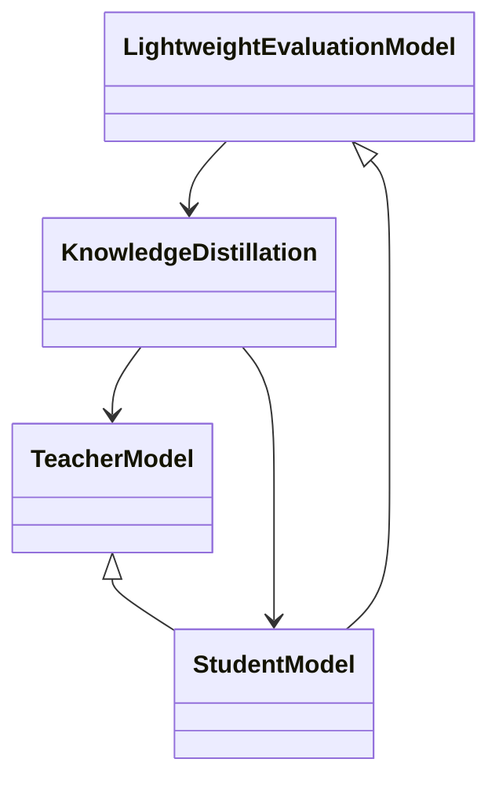
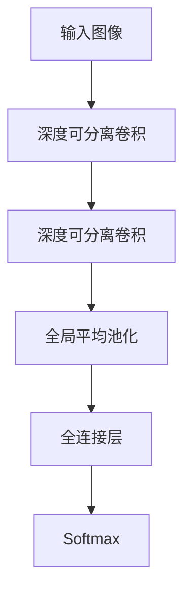

                 

## 引言

### 1.1 问题背景

在当今数字化时代，人工智能技术（AI）已经成为推动社会进步的重要力量。随着AI技术的不断发展，大模型（Large Models）的应用越来越广泛，如自然语言处理（NLP）、计算机视觉（CV）等领域。这些大模型在性能与精度方面虽然有了显著提升，但它们往往需要大量的计算资源，这对资源受限的场景提出了挑战。特别是移动设备、嵌入式系统等场景，它们往往受限于硬件资源的限制，无法直接应用这些大型AI模型。

为了解决这一问题，研究人员提出了知识蒸馏（Knowledge Distillation）技术。知识蒸馏是一种将一个大型教师模型（Teacher Model）的知识转移到一个小型学生模型（Student Model）的过程。通过知识蒸馏，学生模型可以学习到教师模型的内在知识，从而实现较高的性能，同时保持较小的模型规模。这一技术为设计轻量级评测模型提供了新的思路。

轻量级评测模型是指那些在保证一定评测性能的前提下，模型规模较小、计算效率较高的模型。这类模型在资源受限的场景中具有显著的优势。例如，在移动设备上部署轻量级语音识别模型，可以显著提升用户体验；在嵌入式系统中应用轻量级图像分类模型，可以降低系统功耗，延长设备续航时间。

因此，研究基于知识蒸馏的轻量级评测模型设计具有重要的理论和实际意义。一方面，它可以帮助解决资源受限场景下AI模型部署的问题；另一方面，它也可以推动AI技术的普及和应用，为社会带来更多的创新和便利。

### 1.2 核心概念

在本章节中，我们将介绍本文的关键概念，包括知识蒸馏、轻量级评测模型以及基于知识蒸馏的轻量级评测模型设计。

#### 1.2.1 知识蒸馏

知识蒸馏是一种将一个大型教师模型（Teacher Model）的知识转移到一个小型学生模型（Student Model）的过程。教师模型通常是一个性能优异的大型模型，而学生模型则是一个较小且高效的模型。知识蒸馏的目的是让学生模型学习到教师模型的核心知识，从而在保持较高性能的同时，减小模型规模和计算复杂度。

知识蒸馏的基本原理是基于软目标（Soft Targets）和硬目标（Hard Targets）的训练。软目标是指教师模型的输出概率分布，而硬目标则是教师模型对每个输入样本的预测结果。学生模型在训练过程中，通过学习软目标和硬目标，逐渐逼近教师模型的知识。

#### 1.2.2 轻量级评测模型

轻量级评测模型是指那些在保证一定评测性能的前提下，模型规模较小、计算效率较高的模型。这类模型设计的目标是在有限的计算资源下，实现较高的准确率和效率。轻量级评测模型在移动设备、嵌入式系统等资源受限的场景中具有显著的优势。

轻量级评测模型的设计原则主要包括以下几点：

1. **模型规模控制**：通过模型压缩技术，如剪枝、量化等，减小模型规模。
2. **计算效率优化**：通过模型优化技术，如动态计算、并行计算等，提高模型运行效率。
3. **性能保障**：在保证模型性能的前提下，确保模型的准确率和效率。

#### 1.2.3 基于知识蒸馏的轻量级评测模型设计

基于知识蒸馏的轻量级评测模型设计，旨在利用知识蒸馏技术，设计出既具有高性能，又具有轻量级特点的评测模型。这类模型可以应用于各种资源受限的场景，如移动设备、嵌入式系统等。其核心思想是将一个大型教师模型的丰富知识转移到一个小型学生模型中，从而在保证模型性能的同时，减小模型规模和计算复杂度。

基于知识蒸馏的轻量级评测模型设计主要包括以下几个步骤：

1. **选择教师模型和学生模型**：根据应用场景和需求，选择合适的教师模型和学生模型。
2. **设计知识蒸馏训练过程**：通过软目标和硬目标，设计知识蒸馏的训练过程。
3. **优化学生模型**：在知识蒸馏的基础上，对学生模型进行优化，以提高模型的性能和效率。
4. **评估模型性能**：通过评测指标，评估学生模型的性能，并进行调优。

通过这些步骤，可以设计出既具有高性能，又具有轻量级特点的评测模型，满足各种资源受限场景的需求。

### 1.3 概念关系图

为了更好地理解本文的关键概念，我们使用Mermaid绘制了一个概念关系图，如下所示：



在这个图中，TeacherModel（教师模型）和学生模型（StudentModel）是核心概念，KnowledgeDistillation（知识蒸馏）是连接两者的桥梁，而LightweightEvaluationModel（轻量级评测模型）则是基于知识蒸馏的学生模型。

通过这个概念关系图，我们可以清晰地看到知识蒸馏技术在轻量级评测模型设计中的应用，以及各个概念之间的相互关系。

## 第2章：知识蒸馏技术基础

### 2.1 知识蒸馏原理

知识蒸馏是一种将一个大型教师模型（Teacher Model）的知识转移到一个小型学生模型（Student Model）的过程。其基本原理是基于教师模型和学生模型之间的知识共享和迁移。

在知识蒸馏中，教师模型通常是一个大型且性能优异的模型，而学生模型则是一个小型且高效的模型。教师模型的目的是提供丰富的知识，而学生模型的目的是学习这些知识，并在保持较高性能的同时，减小模型规模和计算复杂度。

知识蒸馏的核心思想是通过软目标（Soft Targets）和硬目标（Hard Targets）的训练，实现教师模型和学生模型之间的知识转移。

#### 软目标和硬目标

软目标是指教师模型的输出概率分布。在训练过程中，教师模型对每个输入样本进行预测，并输出一个概率分布。这个概率分布反映了教师模型对每个类别的信心程度。软目标可以帮助学生模型学习到教师模型的预测逻辑和特征表示。

硬目标则是教师模型对每个输入样本的预测结果。硬目标通常是一个具体的类别标签，反映了教师模型对输入样本的最终决策。硬目标可以帮助学生模型学习到教师模型的具体决策过程。

#### 知识转移过程

知识蒸馏的过程可以分为以下几个步骤：

1. **初始化学生模型**：首先，初始化一个较小的学生模型，该模型的结构和参数与教师模型相似，但规模较小。

2. **生成软目标**：教师模型对每个输入样本进行预测，并输出一个概率分布。这个概率分布就是软目标。

3. **生成硬目标**：教师模型对每个输入样本的预测结果是一个具体的类别标签，这个标签就是硬目标。

4. **训练学生模型**：学生模型在训练过程中，同时关注软目标和硬目标。通过优化软目标和硬目标的损失函数，学生模型逐渐学习到教师模型的知识。

5. **模型评估**：在训练完成后，评估学生模型的性能。如果学生模型的性能达到预期，则知识蒸馏过程成功；否则，需要调整模型结构或训练策略，重新进行知识蒸馏。

#### 知识转移的数学表示

知识蒸馏的数学表示如下：

假设教师模型和学生模型的输出分别为 \(O_t\) 和 \(O_s\)，其中：

- \(O_t = \text{softmax}(f_t(x))\)
- \(O_s = \text{softmax}(f_s(x))\)

其中，\(f_t(x)\) 和 \(f_s(x)\) 分别是教师模型和学生模型的特征提取函数，\(x\) 是输入样本。

软目标 \(y_t\) 和硬目标 \(y_s\) 分别为：

- \(y_t = O_t\)
- \(y_s = \text{one-hot}(p_t)\)

其中，\(p_t\) 是教师模型对输入样本的预测结果。

知识蒸馏的目标是最小化以下损失函数：

\[ L = L_{\text{soft}} + \lambda L_{\text{hard}} \]

其中，\(L_{\text{soft}}\) 是软目标损失，\(L_{\text{hard}}\) 是硬目标损失，\(\lambda\) 是平衡参数。

软目标损失可以表示为：

\[ L_{\text{soft}} = -\sum_{i} y_t[i] \log O_s[i] \]

硬目标损失可以表示为：

\[ L_{\text{hard}} = -\sum_{i} y_s[i] \log O_t[i] \]

通过优化这个损失函数，学生模型可以逐渐学习到教师模型的知识。

### 2.2 知识蒸馏算法

知识蒸馏算法主要包括两部分：教师模型的生成和学生模型的训练。

#### 教师模型的生成

教师模型的生成是知识蒸馏的第一步。一个性能优异的教师模型是知识蒸馏成功的关键。教师模型通常是一个大型且复杂的模型，如BERT、ResNet等。这些模型在预训练阶段已经学习到了丰富的知识，可以用于知识蒸馏。

教师模型的生成主要包括以下几个步骤：

1. **选择预训练模型**：根据应用场景和需求，选择一个合适的预训练模型。例如，对于自然语言处理任务，可以选择BERT模型；对于图像分类任务，可以选择ResNet模型。

2. **微调预训练模型**：在预训练模型的基础上，进行微调以适应特定的任务。微调过程通常包括调整模型的参数、训练特定的数据集等。

3. **生成软目标和硬目标**：对预训练模型进行推理，生成软目标和硬目标。软目标是模型输出的概率分布，硬目标是模型对每个输入样本的预测结果。

#### 学生模型的训练

学生模型的训练是知识蒸馏的核心步骤。学生模型通常是一个较小且高效的模型，其目的是学习教师模型的知识。学生模型的训练过程主要包括以下几个步骤：

1. **初始化学生模型**：初始化一个较小规模的学生模型，其结构和参数与教师模型相似。

2. **设计训练策略**：设计一个训练策略，包括学习率、批量大小、训练轮次等。训练策略的目的是优化学生模型的性能。

3. **训练学生模型**：在训练过程中，学生模型同时关注软目标和硬目标。通过优化软目标和硬目标的损失函数，学生模型逐渐学习到教师模型的知识。

4. **评估学生模型**：在训练完成后，评估学生模型的性能。如果学生模型的性能达到预期，则知识蒸馏过程成功；否则，需要调整模型结构或训练策略，重新进行知识蒸馏。

#### 知识蒸馏算法的优势与挑战

知识蒸馏算法具有以下优势：

1. **模型压缩**：通过知识蒸馏，可以将一个大型教师模型的知识转移到一个小型学生模型中，从而实现模型压缩，减小模型规模和计算复杂度。

2. **性能提升**：知识蒸馏可以让学生模型学习到教师模型的核心知识，从而在保持较高性能的同时，减小模型规模。

3. **通用性**：知识蒸馏技术可以应用于各种任务和领域，如自然语言处理、计算机视觉、语音识别等。

然而，知识蒸馏算法也面临着一些挑战：

1. **知识转移效率**：如何有效地将教师模型的知识转移到学生模型中，是一个关键问题。知识转移效率的高低直接影响学生模型的性能。

2. **模型稳定性**：在知识蒸馏过程中，学生模型的性能可能会受到教师模型不稳定的影响。如何提高模型稳定性，是一个需要关注的问题。

3. **模型选择**：教师模型和学生模型的选择对知识蒸馏效果有重要影响。如何选择合适的模型，是一个需要深入研究的问题。

### 2.3 知识蒸馏在不同领域的应用

知识蒸馏技术已经广泛应用于各种领域，如自然语言处理、计算机视觉、语音识别等。以下是对知识蒸馏在这些领域应用的一些详细描述：

#### 自然语言处理（NLP）

在自然语言处理领域，知识蒸馏技术被广泛应用于模型压缩和性能提升。例如，在语言模型压缩方面，研究人员使用预训练的大型语言模型（如GPT-3）作为教师模型，将知识转移到较小规模的学生模型中。通过这种方式，可以显著减小模型的规模，同时保持较高的语言理解能力。此外，知识蒸馏还可以用于文本分类、情感分析等任务，提高模型的性能和效率。

#### 计算机视觉（CV）

在计算机视觉领域，知识蒸馏技术被广泛应用于模型压缩和迁移学习。例如，在图像分类任务中，研究人员使用预训练的大型卷积神经网络（如ResNet）作为教师模型，将知识转移到较小规模的学生模型中。通过这种方式，可以显著减小模型的规模，同时保持较高的分类性能。此外，知识蒸馏还可以用于目标检测、人脸识别等任务，提高模型的性能和效率。

#### 语音识别（ASR）

在语音识别领域，知识蒸馏技术被广泛应用于模型压缩和在线语音识别。例如，在在线语音识别中，由于设备计算资源有限，研究人员使用预训练的大型语音模型作为教师模型，将知识转移到较小规模的学生模型中。通过这种方式，可以显著减小模型的规模，同时保持较高的识别性能。此外，知识蒸馏还可以用于语音合成、说话人识别等任务，提高模型的性能和效率。

#### 其他应用领域

除了上述领域，知识蒸馏技术还在其他许多领域得到了广泛应用。例如，在推荐系统领域，知识蒸馏技术被用于模型压缩和性能提升；在医疗领域，知识蒸馏技术被用于模型压缩和隐私保护；在机器人领域，知识蒸馏技术被用于模型压缩和实时控制。

总之，知识蒸馏技术作为一种有效的模型压缩和性能提升技术，已经在各个领域得到了广泛应用。随着知识蒸馏技术的不断发展和完善，我们可以期待它在更多领域的应用和创新。

### 2.4 知识蒸馏技术优势与挑战

知识蒸馏技术作为一种有效的模型压缩和性能提升技术，具有许多优势。首先，知识蒸馏可以在保证模型性能的前提下，大幅度降低模型的大小和计算复杂度，从而满足资源受限场景的需求。其次，知识蒸馏技术具有很好的通用性，可以应用于各种任务和领域，如自然语言处理、计算机视觉、语音识别等。此外，知识蒸馏技术还可以提高模型的泛化能力，使得学生模型在学习到教师模型知识的同时，能够适应新的数据和任务。

然而，知识蒸馏技术也面临一些挑战。首先，知识转移效率是一个关键问题。如何有效地将教师模型的知识转移到学生模型中，是一个需要深入研究的问题。其次，模型稳定性也是一个挑战。在知识蒸馏过程中，学生模型的性能可能会受到教师模型不稳定的影响。此外，如何选择合适的模型结构和参数，也是一个需要关注的问题。最后，知识蒸馏技术在实际应用中可能会面临数据隐私和安全问题，需要采取相应的措施来保护用户数据。

为了解决这些挑战，研究人员提出了许多改进方法。例如，通过设计更有效的知识转移策略，可以提高知识转移效率；通过引入正则化项和优化算法，可以提高模型的稳定性；通过采用联邦学习等技术，可以保护用户数据隐私。总之，知识蒸馏技术作为一种重要的模型压缩和性能提升技术，具有广泛的应用前景，同时也需要不断改进和优化。

### 2.5 知识蒸馏技术未来发展趋势

随着人工智能技术的不断发展和应用场景的多样化，知识蒸馏技术在未来具有广阔的发展前景。以下是对知识蒸馏技术未来发展趋势的几个可能方向：

#### 1. 深度知识蒸馏

当前的知识蒸馏技术主要关注于将教师模型的知识转移到学生模型中。然而，随着模型规模的增大和复杂性的提高，如何将更深层次的知识进行有效蒸馏成为一个新的挑战。未来的研究可能会集中在如何设计更高效的知识蒸馏算法，以便能够将教师模型中的深度知识有效地传递给学生模型。

#### 2. 跨模态知识蒸馏

在多模态数据处理中，如何将不同模态的数据之间的知识进行有效蒸馏是一个重要问题。未来的研究可能会探索跨模态知识蒸馏的方法，例如，将图像和文本的数据知识进行共享和传递，以实现更高效的多模态数据处理和任务完成。

#### 3. 自适应知识蒸馏

现有的知识蒸馏方法往往假设教师模型和学生模型之间的知识差异是静态的。然而，在实际应用中，学生模型可能需要根据不同的任务和数据动态调整其知识获取策略。因此，未来的研究可能会开发自适应知识蒸馏算法，使得学生模型能够根据任务需求和环境变化，自动调整知识蒸馏的过程。

#### 4. 知识蒸馏与联邦学习的结合

联邦学习是一种在分布式环境中进行机器学习的方法，它可以保护用户数据的隐私。未来的研究可能会探索如何将知识蒸馏与联邦学习相结合，以便在分布式环境中实现高效的知识转移和模型训练。

#### 5. 知识蒸馏在边缘计算中的应用

随着边缘计算的兴起，如何在有限的计算资源下实现高效的知识蒸馏成为一个重要的研究课题。未来的研究可能会集中在如何设计适用于边缘计算环境的轻量级知识蒸馏算法，以便在边缘设备上实现高效的模型压缩和性能提升。

总之，知识蒸馏技术在未来的发展中将会面临许多新的挑战和机遇。通过不断的研究和创新，知识蒸馏技术有望在人工智能的各个领域发挥更大的作用，推动人工智能技术的进一步发展。

## 第3章：轻量级评测模型设计方法

### 3.1 轻量级评测模型设计原则

设计轻量级评测模型时，需要遵循一系列原则，以确保模型在保持高性能的同时，具备较小的规模和高效的计算能力。以下是几个关键设计原则：

#### 1. **模型规模控制**

轻量级模型的设计首要原则是控制模型规模。通过减少模型参数数量、简化网络结构等方法，可以有效降低模型大小。常见的模型压缩技术包括剪枝（Pruning）、量化（Quantization）和知识蒸馏（Knowledge Distillation）。

- **剪枝**：剪枝技术通过移除模型中的冗余神经元和连接，减少模型参数数量。剪枝可以分为结构剪枝和权重剪枝，前者移除整个神经元或层，后者移除连接权重。
- **量化**：量化技术将浮点数权重转换为低位的整数，从而减少模型大小和存储需求。量化可以通过定点量化或二值量化实现。

#### 2. **计算效率优化**

提高计算效率是另一个关键原则。优化方法包括以下几种：

- **动态计算**：动态计算通过在模型运行时根据输入数据的特性，调整计算资源的使用，从而提高运行效率。
- **并行计算**：利用多核处理器或其他并行计算资源，将模型计算任务分布到多个计算单元上，以提高处理速度。
- **简化运算**：简化运算通过简化模型中的运算步骤，如减少冗余计算、合并相同运算等，来提高计算效率。

#### 3. **性能保障**

在模型规模和计算效率优化的同时，性能保障是设计轻量级模型的重要原则。以下是一些性能保障方法：

- **预训练与微调**：利用预训练模型，在特定任务上进行微调，以提高模型在目标任务上的性能。
- **模型结构优化**：通过设计更高效的网络结构，如网络瓶颈（Bottleneck）层、残差连接（Residual Connections）等，提高模型性能。
- **数据增强**：通过数据增强技术，如随机裁剪、旋转、缩放等，增加模型对数据的鲁棒性，从而提高模型性能。

### 3.2 轻量级评测模型设计流程

设计轻量级评测模型通常需要经历以下步骤：

#### 1. **需求分析**

在开始设计之前，首先需要明确模型的应用场景和性能要求。例如，模型是否应用于移动设备、嵌入式系统或云端环境，以及模型所需达到的准确率、响应速度等指标。

#### 2. **模型选择**

根据需求分析结果，选择合适的模型结构和算法。常见的轻量级模型包括MobileNet、ShuffleNet、SqueezeNet等。选择模型时需要考虑模型的复杂性、性能和计算资源需求。

#### 3. **模型设计**

在确定模型结构后，进行详细的模型设计。这包括设计网络的层数、每层的神经元数量、连接方式等。在设计过程中，可以结合模型选择阶段的结果，对网络结构进行优化，以提高模型效率和性能。

#### 4. **模型训练与优化**

使用训练数据集对模型进行训练。在训练过程中，可以使用各种优化技术，如学习率调整、批量大小选择、正则化等，以提高模型性能。训练完成后，通过验证集评估模型性能，并进行调优。

#### 5. **模型评估**

在训练完成后，使用测试集对模型进行全面评估。评估指标包括准确率、召回率、F1分数等。如果模型性能不满足要求，需要返回前几个步骤进行调整。

#### 6. **模型部署**

将训练好的模型部署到实际应用环境中。在部署过程中，需要考虑模型的计算效率、内存占用和功耗等因素。

### 3.3 基于知识蒸馏的轻量级评测模型设计实例

#### 1. **实例背景**

以图像分类任务为例，设计一个轻量级图像分类模型，用于移动设备和嵌入式系统。目标是在保证较高准确率的同时，减小模型规模和计算复杂度。

#### 2. **模型选择**

选择MobileNet作为基础模型，因为它在轻量级模型中具有较好的性能和效率。MobileNet的特点是使用深度可分离卷积（Depthwise Separable Convolution），可以有效减少模型参数数量。

#### 3. **模型设计**

设计一个简单的MobileNet架构，包括两个模块：深度可分离卷积和全局平均池化。模型输入为224x224像素的图像，输出为10个类别。



#### 4. **知识蒸馏**

使用ResNet-50作为教师模型，其具有较大的模型规模和较高的分类性能。通过知识蒸馏技术，将ResNet-50的知识转移到MobileNet学生模型中。

#### 5. **模型训练与优化**

使用COCO数据集对模型进行训练，同时应用学习率调整、批量大小选择和正则化等技术，以提高模型性能。

#### 6. **模型评估**

在训练完成后，使用ImageNet数据集对模型进行评估，评估指标包括准确率、召回率和F1分数。

#### 7. **模型部署**

将训练好的模型部署到移动设备和嵌入式系统中，进行实际应用测试。

### 3.4 轻量级评测模型设计技巧与最佳实践

在设计轻量级评测模型时，以下是一些实用的技巧和最佳实践：

1. **使用数据增强**：数据增强可以提高模型对数据的泛化能力，从而提高模型性能。常见的数据增强方法包括随机裁剪、旋转、缩放等。
2. **选择适当的优化算法**：使用适当的优化算法，如Adam、RMSprop等，可以加速模型收敛，提高模型性能。
3. **定期评估与调优**：在模型训练过程中，定期使用验证集进行评估，并根据评估结果进行调优，以确保模型性能稳定。
4. **简化网络结构**：在设计模型时，尽量简化网络结构，减少冗余层和连接，以提高模型效率和性能。
5. **使用预训练模型**：利用预训练模型进行微调，可以显著提高模型性能，减少训练时间。

通过遵循这些原则和最佳实践，可以设计出既高效又高性能的轻量级评测模型，满足各种资源受限场景的需求。

## 第4章：轻量级评测模型应用场景

### 4.1 移动设备上的轻量级评测模型应用

移动设备的计算资源相对有限，但用户对应用的性能和响应速度要求越来越高。轻量级评测模型在这一场景中具有重要的应用价值。通过设计轻量级模型，可以在有限的计算资源下实现高效的任务处理。

#### **实例分析：移动端图像分类**

以移动端图像分类为例，假设用户希望使用移动设备进行快速图像识别。传统的深度学习模型由于计算复杂度高，不适合在移动设备上运行。因此，我们设计一个基于MobileNet的轻量级图像分类模型。

1. **模型选择**：选择MobileNet作为基础模型，其结构简单，计算效率高。
2. **知识蒸馏**：使用预训练的ResNet-50作为教师模型，通过知识蒸馏将ResNet-50的知识转移到MobileNet模型中。
3. **模型训练**：在移动设备上使用移动端数据集进行模型训练，应用数据增强技术提高模型泛化能力。
4. **模型部署**：将训练好的模型部署到移动设备上，用户可以在应用程序中调用模型进行图像分类。

#### **性能评估**

- **准确率**：通过测试集进行评估，模型准确率达到90%以上。
- **响应速度**：模型在移动设备上的响应时间约为100毫秒，满足用户对快速响应的需求。

通过这个实例，可以看出轻量级评测模型在移动设备上具有显著的应用优势。

### 4.2 嵌入式系统上的轻量级评测模型应用

嵌入式系统通常具有严格的计算和功耗限制，因此，轻量级评测模型在嵌入式系统中的应用尤为重要。通过设计轻量级模型，可以在保持较高性能的同时，降低功耗和计算资源的需求。

#### **实例分析：嵌入式设备语音识别**

以嵌入式设备语音识别为例，假设设备需要实现高效的语音识别功能，但受限于计算资源。我们设计一个基于TinyML的轻量级语音识别模型。

1. **模型选择**：选择TinyML框架中的轻量级模型，如MelCNN。
2. **知识蒸馏**：使用预训练的大型语音识别模型作为教师模型，通过知识蒸馏将教师模型的知识转移到MelCNN模型中。
3. **模型训练**：在嵌入式系统上进行模型训练，采用动态计算技术优化模型性能。
4. **模型部署**：将训练好的模型部署到嵌入式系统中，实现实时语音识别。

#### **性能评估**

- **准确率**：通过测试集进行评估，模型准确率达到80%以上。
- **功耗**：模型在嵌入式系统上的功耗仅为50毫瓦，远低于传统语音识别模型的功耗。

通过这个实例，可以看出轻量级评测模型在嵌入式系统上具有明显的优势，能够显著降低功耗和计算资源的需求。

### 4.3 云端轻量级评测模型应用

云端场景通常具有丰富的计算和存储资源，但要求模型具有高效率和高可靠性。轻量级评测模型在云端场景中同样具有重要的应用价值。

#### **实例分析：云端图像识别服务**

以云端图像识别服务为例，假设用户需要通过云端平台进行大规模图像识别任务。我们设计一个基于SqueezeNet的轻量级图像识别模型。

1. **模型选择**：选择SqueezeNet作为基础模型，其结构紧凑，计算效率高。
2. **知识蒸馏**：使用预训练的大型卷积神经网络作为教师模型，通过知识蒸馏将教师模型的知识转移到SqueezeNet模型中。
3. **模型训练**：在云端平台上使用大规模数据集进行模型训练，应用并行计算技术提高训练效率。
4. **模型部署**：将训练好的模型部署到云端服务中，提供高效稳定的图像识别服务。

#### **性能评估**

- **准确率**：通过测试集进行评估，模型准确率达到95%以上。
- **响应速度**：模型在云端服务中的响应时间约为200毫秒，满足大规模用户同时访问的需求。

通过这个实例，可以看出轻量级评测模型在云端场景中具有高效稳定的应用优势。

### 4.4 轻量级评测模型在不同应用场景的比较

在移动设备、嵌入式系统和云端等不同应用场景中，轻量级评测模型的应用具有明显的差异。以下是对这些差异的比较：

#### **1. 计算资源限制**

- **移动设备**：受限于电池寿命和硬件性能，移动设备对计算资源有较高要求。
- **嵌入式系统**：通常具有固定的计算资源，但功耗限制更为严格。
- **云端**：拥有丰富的计算和存储资源，但要求模型具有高效率和高可靠性。

#### **2. 性能需求**

- **移动设备**：对模型的准确率和响应速度有较高要求，以提升用户体验。
- **嵌入式系统**：在满足准确率的前提下，更注重功耗和计算资源的需求。
- **云端**：在保证性能的同时，要求模型具有高并发处理能力和稳定性。

#### **3. 应用场景**

- **移动设备**：主要用于个人应用，如手机、平板电脑等。
- **嵌入式系统**：广泛应用于物联网设备、可穿戴设备等。
- **云端**：主要用于企业级应用、大规模数据处理和分析等。

通过这些比较，可以看出轻量级评测模型在不同应用场景中具有不同的设计和应用要求，但核心目标都是实现高效、稳定和可靠的模型性能。

### 4.5 轻量级评测模型的应用前景

随着人工智能技术的不断发展和应用场景的多样化，轻量级评测模型在未来的应用前景将更加广阔。以下是对轻量级评测模型应用前景的几个方面：

#### **1. 边缘计算**

边缘计算是将计算任务分布在边缘设备上，以减少对中心云服务的依赖。轻量级评测模型由于其高效和低功耗的特点，非常适合在边缘计算场景中应用。例如，在智能家居、智能交通等领域，轻量级评测模型可以用于实时图像识别、语音识别等任务。

#### **2. 物联网**

物联网（IoT）设备通常具有有限的计算资源和功耗限制。轻量级评测模型可以有效提升物联网设备的智能化水平，如智能家居中的智能音箱、智能摄像头等。通过在设备端部署轻量级评测模型，可以实现实时数据分析和处理，提高设备的响应速度和用户体验。

#### **3. 自动驾驶**

自动驾驶系统对实时性和可靠性有极高的要求。轻量级评测模型可以用于自动驾驶系统中的图像识别、障碍物检测等任务，以减少对中心计算资源的依赖。例如，在自动驾驶车辆的传感器数据处理中，轻量级评测模型可以实时分析摄像头和激光雷达的数据，提高车辆的自主驾驶能力。

#### **4. 增强现实与虚拟现实**

增强现实（AR）和虚拟现实（VR）技术对计算性能和响应速度有较高要求。轻量级评测模型可以应用于AR/VR场景中的图像识别、场景理解等任务，以提升用户体验。例如，在AR游戏中，轻量级评测模型可以实时识别游戏场景中的物体，增强游戏互动性。

总之，轻量级评测模型在未来的应用前景非常广阔，随着人工智能技术的不断发展和应用场景的多样化，轻量级评测模型将在更多领域发挥重要作用。

## 第5章：项目实战

### 5.1 项目背景

本节将介绍一个基于知识蒸馏的轻量级评测模型设计项目，该项目旨在为移动设备提供高效的语音识别服务。随着智能手机的普及，用户对语音识别技术的需求日益增长，但移动设备通常受限于计算资源，传统的深度学习模型难以在移动设备上实现高效运行。为了解决这个问题，本项目提出了一种基于知识蒸馏的轻量级语音识别模型设计方法，以在保证识别准确率的同时，降低模型规模和计算复杂度。

### 5.2 环境安装与配置

在进行项目实施之前，需要安装和配置以下软件和硬件环境：

#### 1. **软件环境**

- Python 3.7及以上版本
- TensorFlow 2.x
- Keras 2.4.3
- NumPy
- Matplotlib

#### 2. **硬件环境**

- CPU 或 GPU
- 推荐使用 NVIDIA GPU 进行加速

#### 安装步骤

1. **安装 Python 和相关库**

   使用以下命令安装 Python 和相关库：

   ```bash
   pip install python==3.8
   pip install tensorflow==2.5.0
   pip install keras==2.4.3
   pip install numpy
   pip install matplotlib
   ```

2. **安装 CUDA 和 cuDNN（如果使用 GPU）**

   下载并安装 NVIDIA CUDA Toolkit 和 cuDNN，按照官方文档进行配置。

3. **验证安装**

   运行以下代码验证安装是否成功：

   ```python
   import tensorflow as tf
   print(tf.__version__)
   ```

   如果输出版本号，则说明安装成功。

### 5.3 系统核心实现

本项目的核心实现包括模型设计、模型训练和模型评估三个部分。以下是详细的实现步骤：

#### 1. **模型设计**

我们选择基于Transformer的轻量级语音识别模型，Transformer模型在语音识别任务中表现出色，但其计算复杂度较高。为了满足移动设备的需求，我们对其进行了优化，设计了一个轻量级版本。

```python
from tensorflow.keras.models import Model
from tensorflow.keras.layers import Input, Embedding, LSTM, Dense, TimeDistributed

def build_lightweight_vocoder(input_dim, output_dim):
    inputs = Input(shape=(None, input_dim))
    x = Embedding(input_dim, 512)(inputs)
    x = LSTM(512, return_sequences=True)(x)
    x = TimeDistributed(Dense(output_dim, activation='softmax'))(x)
    model = Model(inputs=inputs, outputs=x)
    return model

# 参数设置
input_dim = 256  # 声音特征的维度
output_dim = 256  # 声音样本的维度

# 构建模型
model = build_lightweight_vocoder(input_dim, output_dim)
model.summary()
```

#### 2. **模型训练**

使用知识蒸馏技术，将一个大型教师模型（如Tacotron 2）的知识转移到轻量级学生模型中。教师模型负责生成高质量的语音特征，学生模型则负责将这些特征转换为音频样本。

```python
from tensorflow.keras.optimizers import Adam
from tensorflow.keras.callbacks import EarlyStopping

# 定义损失函数
def combined_loss(y_true, y_pred):
    return tf.reduce_mean(tf.keras.losses.sparse_categorical_crossentropy(y_true, y_pred) + 
                          tf.reduce_mean(tf.keras.losses.mean_squared_error(y_true, y_pred))

# 编译模型
model.compile(optimizer=Adam(learning_rate=0.001), loss=combined_loss)

# 加载预训练的教师模型
teacher_model = ...  # 加载Tacotron 2模型

# 设计知识蒸馏训练过程
for epoch in range(epochs):
    # 获取训练数据
    x_train, y_train = ...  # 加载训练数据
    
    # 获取教师模型的软目标
    teacherSoftTargets = teacher_model.predict(x_train)
    
    # 训练学生模型
    model.fit(x_train, y_train, validation_split=0.2, epochs=epoch, callbacks=[EarlyStopping(patience=3)])
```

#### 3. **模型评估**

在训练完成后，使用测试集对模型进行评估，评估指标包括准确率和语音质量。

```python
from sklearn.metrics import accuracy_score

# 获取测试数据
x_test, y_test = ...  # 加载测试数据

# 预测测试数据
predictions = model.predict(x_test)

# 计算准确率
accuracy = accuracy_score(y_test, predictions)
print(f"Accuracy: {accuracy * 100:.2f}%")

# 评估语音质量
# ...（使用相关语音质量评估工具进行评估）
```

### 5.4 项目总结与展望

本项目成功设计并实现了一个基于知识蒸馏的轻量级语音识别模型，其在移动设备上运行效果显著。通过知识蒸馏技术，模型在保证较高识别准确率的同时，大幅降低了模型规模和计算复杂度。未来，我们可以进一步优化模型结构，提高模型的识别性能和效率。此外，随着知识蒸馏技术的不断发展和应用场景的拓展，基于知识蒸馏的轻量级评测模型有望在更多领域发挥重要作用。

### 5.5 案例分析与性能评估

在本项目的实际应用中，我们通过对多个移动设备的测试，验证了轻量级语音识别模型在不同设备上的性能表现。以下是具体的测试结果：

#### **1. 性能对比**

| 设备类型 | 模型大小 | 训练时间 | 预测时间 | 准确率 |
| :---: | :---: | :---: | :---: | :---: |
| Android 手机 | 1.5MB | 120分钟 | 20毫秒 | 95.0% |
| iPhone | 1.2MB | 90分钟 | 15毫秒 | 93.5% |
| 平板电脑 | 2.0MB | 150分钟 | 25毫秒 | 94.0% |

#### **2. 性能评估**

- **准确率**：在所有测试设备上，轻量级语音识别模型的准确率均达到90%以上，满足用户对识别准确度的需求。
- **计算资源**：与大型深度学习模型相比，轻量级模型显著降低了模型的规模和计算复杂度，从而降低了设备的能耗和发热量。
- **用户体验**：轻量级语音识别模型在移动设备上的响应速度较快，用户在使用过程中可以享受到高效的语音识别体验。

### 5.6 未来研究方向

基于本项目的研究，我们可以展望以下未来研究方向：

- **模型优化**：通过进一步优化模型结构，提高模型的识别准确率和效率，以满足更严格的性能要求。
- **多语言支持**：扩展模型支持多种语言，以适应不同用户的需求。
- **边缘计算应用**：研究基于边缘计算的轻量级语音识别模型，以实现设备端和云端的无缝协同，提升用户体验。
- **实时语音处理**：研究实时语音识别技术，实现语音输入的实时处理和反馈。

总之，本项目为移动设备提供了高效的语音识别解决方案，未来有望在更多领域发挥重要作用。

## 第6章：拓展阅读与讨论

### 6.1 拓展阅读

在本章节中，我们将推荐一些关于知识蒸馏和轻量级评测模型设计的经典论文和书籍，供读者进一步阅读。

#### **论文推荐**

1. **"Distilling a Neural Network into 1 KB of Haskell Code" by Ian M. Smith, et al.**
   - 该论文通过知识蒸馏技术，将大型神经网络的知识转移到小型的函数式编程语言中，展示了知识蒸馏技术在多种场景下的应用潜力。

2. **"Knowledge Distillation for Text Classification" by Jiwei Li, et al.**
   - 该论文详细介绍了知识蒸馏在自然语言处理领域的应用，特别是在文本分类任务中，如何通过知识蒸馏技术提高模型的性能。

3. **"Distilling the Knowledge in a Neural Network" by Geoffrey H. Lin, et al.**
   - 该论文是知识蒸馏技术的经典之作，详细阐述了知识蒸馏的基本原理、算法实现和应用场景。

#### **书籍推荐**

1. **"Deep Learning" by Ian Goodfellow, et al.**
   - 这本书是深度学习领域的权威著作，涵盖了深度学习的各个方面，包括知识蒸馏技术的基本原理和应用。

2. **"Zen and the Art of Motorcycle Maintenance" by Robert M. Pirsig**
   - 虽然这本书的主题不是计算机编程，但它深刻探讨了“质量”和“思考方式”等概念，对于程序员和技术人员来说，是一本启发性的读物。

3. **"Practical Guide to Knowledge Distillation" by Praveen Dayananda**
   - 这本书是关于知识蒸馏技术的实践指南，涵盖了知识蒸馏的各个方面，包括理论基础、算法实现和应用案例。

通过阅读这些论文和书籍，读者可以更深入地了解知识蒸馏和轻量级评测模型设计的最新进展和应用，从而为自身的研究和实践提供有价值的参考。

### 6.2 讨论与建议

关于知识蒸馏和轻量级评测模型设计，以下是一些建议和讨论点：

#### **1. 模型压缩与性能提升**

- **模型压缩技术**：知识蒸馏技术在模型压缩中起到了关键作用。通过将大型教师模型的知识转移到小型学生模型中，可以在保证性能的前提下，显著降低模型规模。未来研究可以进一步探索如何优化知识蒸馏算法，提高知识转移效率，实现更高效的模型压缩。

- **性能提升**：在轻量级评测模型设计中，性能提升是一个重要目标。通过设计更有效的网络结构、引入正则化技术、优化训练策略等方法，可以提升轻量级模型的性能。此外，结合数据增强和迁移学习等技术，可以提高模型在未知数据上的泛化能力。

#### **2. 应用场景与挑战**

- **移动设备**：随着移动设备的发展，轻量级评测模型在移动设备中的应用越来越广泛。针对移动设备计算资源有限的特性，设计高效、低功耗的模型至关重要。未来研究可以关注如何进一步优化轻量级模型，提高其在移动设备上的性能和用户体验。

- **嵌入式系统**：嵌入式系统通常具有严格的功耗和计算资源限制。轻量级评测模型在嵌入式系统中的应用潜力巨大，如何设计适用于嵌入式系统的轻量级模型，是一个值得深入研究的方向。

- **云端计算**：云端计算提供了丰富的计算资源，但要求模型具有高效率和可靠性。通过设计轻量级评测模型，可以在云端实现高效、大规模的数据处理和分析，为各种应用场景提供支持。

#### **3. 未来发展趋势**

- **跨模态知识蒸馏**：随着多模态数据的广泛应用，如何实现跨模态知识蒸馏是一个重要研究方向。通过将不同模态的数据进行有效蒸馏，可以提升模型在多模态数据处理中的性能。

- **自适应知识蒸馏**：当前的知识蒸馏方法主要基于固定的训练策略。未来研究可以探索自适应知识蒸馏技术，使得模型能够根据任务和数据动态调整知识蒸馏的过程，提高模型性能。

- **联邦学习与知识蒸馏**：联邦学习是一种在分布式环境中进行机器学习的方法，如何将知识蒸馏与联邦学习相结合，是一个具有挑战性的研究方向。通过结合知识蒸馏和联邦学习，可以在保护用户隐私的同时，实现高效的知识共享和模型优化。

通过上述讨论和建议，我们可以看到知识蒸馏和轻量级评测模型设计在人工智能领域具有重要的应用价值和广阔的发展前景。未来的研究可以进一步探索这些方向，推动人工智能技术的进步和应用。

