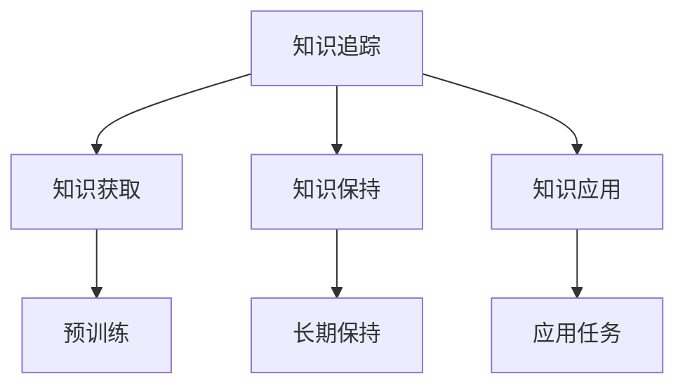
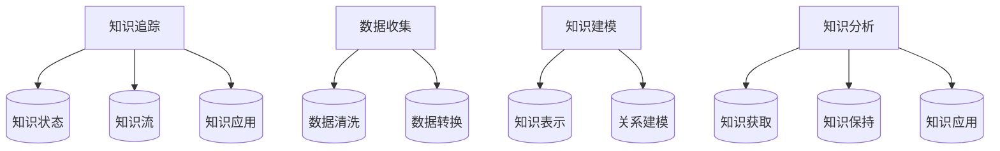
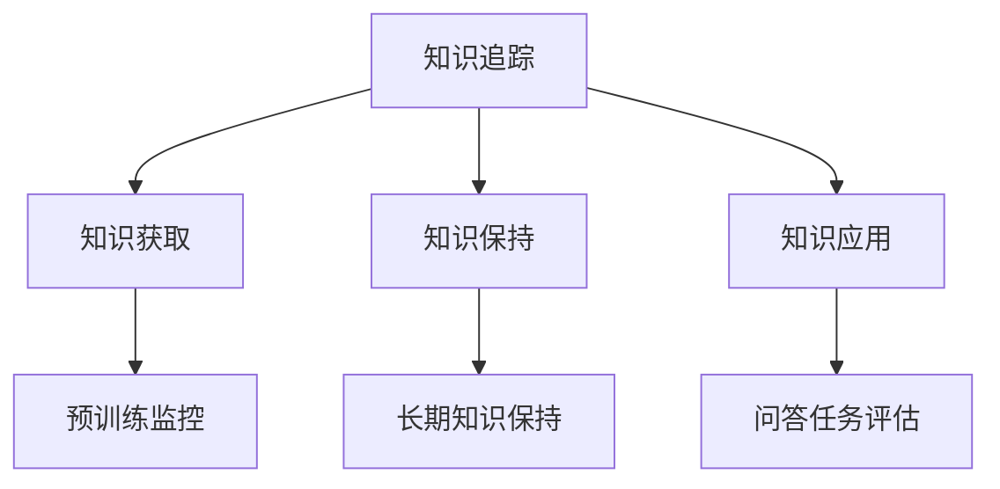

                 


# 《基于知识追踪的LLM学习能力评估》

## 关键词
- 知识追踪
- LLM学习能力
- 评估方法
- 知识图谱
- 机器学习

## 摘要
本文旨在探讨基于知识追踪的LLM（大型语言模型）学习能力评估。首先，我们将介绍知识追踪和LLM的基本概念，随后详细解释知识追踪在LLM学习能力评估中的应用。通过定义评估指标和描述评估方法，本文将提供一个系统的框架来评价LLM的学习能力。随后，文章将讨论实际应用场景和面临的技术挑战，并提供最佳实践和未来发展的展望。

## 目录大纲

----------------------------------------------------------------

### 第一部分：背景介绍与理论基础

#### 第1章：知识追踪与LLM概述
- 1.1 问题背景
- 1.2 知识追踪的重要性
- 1.3 LLM的基本原理
- 1.4 知识追踪与LLM的联系
- 1.5 概念与联系表格

#### 第2章：知识追踪的核心概念
- 2.1 定义
- 2.2 特征
- 2.3 应用场景
- 2.4 关键挑战
- 2.5 概念属性特征对比表格
- 2.6 ER实体关系图

----------------------------------------------------------------

### 第二部分：LLM学习能力评估方法

#### 第3章：LLM学习能力评估概述
- 3.1 评估目标
- 3.2 评估指标
- 3.3 评估方法分类
- 3.4 概念与联系表格

#### 第4章：基于知识追踪的评估方法
- 4.1 知识追踪在评估中的应用
- 4.2 知识追踪指标的构建
- 4.3 实践案例
- 4.4 概念与联系表格

----------------------------------------------------------------

### 第三部分：应用与挑战

#### 第5章：实际应用场景
- 5.1 教育领域
- 5.2 企业应用
- 5.3 社交媒体
- 5.4 案例分析

#### 第6章：技术挑战与解决方案
- 6.1 数据质量
- 6.2 模型可解释性
- 6.3 安全性和隐私保护
- 6.4 概念与联系表格

----------------------------------------------------------------

### 第四部分：最佳实践与未来展望

#### 第7章：最佳实践与技巧
- 7.1 数据预处理
- 7.2 模型训练与优化
- 7.3 性能调优
- 7.4 概念与联系表格

#### 第8章：未来发展趋势
- 8.1 新技术展望
- 8.2 潜在应用领域
- 8.3 研究热点
- 8.4 概念与联系表格

----------------------------------------------------------------

### 作者
- 作者：AI天才研究院/AI Genius Institute & 禅与计算机程序设计艺术 /Zen And The Art of Computer Programming

## 第1章：知识追踪与LLM概述

### 1.1 问题背景

在当今人工智能领域，大型语言模型（LLM）如GPT-3、BERT等已经成为自然语言处理（NLP）的强大工具。这些模型通过大规模的文本数据进行训练，能够进行文本生成、翻译、问答等多种任务。然而，随着模型的复杂度和规模不断增加，评估其学习能力成为一个重要的课题。传统的评估方法主要依赖于模型在公开数据集上的表现，但这些方法往往只能衡量模型在一定范围内的性能，而无法全面评估其学习能力。

知识追踪是一种用于监控和评估学习系统理解知识的能力的方法。它通过分析学习过程中的知识获取、保持和运用，提供对学习系统的深入理解。将知识追踪应用于LLM的学习能力评估，可以帮助我们更好地理解模型的内在工作原理，发现潜在的问题和不足。

### 1.2 知识追踪的重要性

知识追踪的重要性在于它能够提供以下价值：

1. **理解学习过程**：知识追踪可以帮助研究者了解模型在学习过程中的知识获取和运用情况，从而更好地理解模型的学习机制。
2. **诊断问题**：通过知识追踪，可以识别模型在学习过程中可能存在的问题，如知识空洞、知识遗忘等，从而为改进模型提供依据。
3. **提高模型可解释性**：知识追踪提供了对模型内部知识的可视化，有助于提高模型的可解释性，增强用户对模型的信任。
4. **优化学习策略**：知识追踪可以指导研究者设计更有效的学习策略，提高模型的性能和稳定性。

### 1.3 LLM的基本原理

LLM（如GPT-3、BERT等）是基于深度学习的语言模型，其核心思想是通过大规模的数据训练来学习语言的规律和模式。以下是一些LLM的基本原理：

1. **预训练**：LLM通常通过预训练来学习基本的语言知识，这通常是在一个大规模的语料库上进行。
2. **微调**：在预训练的基础上，LLM可以通过微调来适应特定的任务，如文本分类、问答等。
3. **注意力机制**：注意力机制是LLM中的一个关键组件，它能够帮助模型在生成文本时聚焦于相关的信息。
4. **层次化结构**：LLM通常采用层次化的结构，如Transformer，它能够处理长距离的依赖关系。

### 1.4 知识追踪与LLM的联系

知识追踪与LLM之间存在紧密的联系。知识追踪可以用于评估LLM在知识获取、保持和应用方面的能力。具体来说：

1. **知识获取**：知识追踪可以监测LLM在预训练过程中从数据中获取知识的能力，如通过分析模型对特定知识点的关注程度来评估其知识获取效果。
2. **知识保持**：知识追踪可以评估LLM在长时间保持知识的能力，如通过监测模型在不同时间点的知识状态来评估其知识保持情况。
3. **知识应用**：知识追踪可以评估LLM在实际任务中应用知识的能力，如通过监测模型在问答任务中的表现来评估其知识应用能力。

### 1.5 概念与联系表格

为了更好地理解知识追踪与LLM的关系，我们提供了一个概念与联系表格（使用Mermaid流程图表示）：



在这个表格中，知识追踪与LLM的各个环节（知识获取、知识保持、知识应用）通过预训练和应用任务相连，展示了它们之间的相互作用和影响。

## 第2章：知识追踪的核心概念

### 2.1 定义

知识追踪（Knowledge Tracing）是一种用于监测和学习系统如何获取、保持和应用知识的方法。它通常涉及以下步骤：

1. **数据收集**：收集学习过程中的数据，如用户的行为数据、模型的知识状态等。
2. **数据预处理**：清洗和转换数据，使其适合进行进一步分析。
3. **知识建模**：建立一个知识模型，以表示系统中的知识结构和关系。
4. **知识分析**：分析知识模型，以理解知识的获取、保持和应用情况。

### 2.2 特征

知识追踪的特征包括：

1. **知识状态**：知识追踪关注系统的知识状态，即系统在特定时间点所拥有的知识。
2. **知识流**：知识追踪分析知识的流动路径，如知识是如何从一个状态转移到另一个状态的。
3. **知识应用**：知识追踪评估系统在特定任务中的应用知识的能力。

### 2.3 应用场景

知识追踪可以应用于多种场景，包括：

1. **教育领域**：知识追踪可以用于监测学生的学习过程，帮助教师和研究人员了解学生的知识掌握情况。
2. **智能助理**：知识追踪可以用于评估智能助理的知识水平，提高其服务质量。
3. **企业培训**：知识追踪可以用于监测员工的培训效果，帮助公司优化培训计划。

### 2.4 关键挑战

知识追踪面临以下关键挑战：

1. **数据质量**：数据质量直接影响知识追踪的准确性，因此需要确保数据的高质量。
2. **模型可解释性**：知识追踪模型需要具备良好的可解释性，以便研究人员能够理解其工作原理。
3. **实时性**：知识追踪需要具备实时性，以便及时监测和评估系统的知识状态。

### 2.5 概念属性特征对比表格

为了更直观地理解知识追踪的核心概念，我们可以使用一个概念属性特征对比表格（使用Mermaid流程图表示）：



在这个表格中，我们列出了知识追踪的各个环节及其对应的特征，展示了知识追踪的整体架构。

### 2.6 ER实体关系图

为了更好地理解知识追踪的架构，我们还可以使用ER（实体关系）图来表示知识追踪的核心概念和它们之间的关系。以下是一个ER实体关系图（使用Mermaid流程图表示）：

```mermaid
erDiagram
    User ||--|{ Knowledge}: "has"
    Task ||--|{ Knowledge}: "required"
    System ||--|{ Knowledge}: "provides"
    Data ||--|{ Knowledge}: "contains"
    Model ||--|{ Knowledge}: "analyzes"
```

在这个ER图中，我们定义了知识追踪的五个核心实体：User（用户）、Task（任务）、System（系统）、Data（数据）和Model（模型）。这些实体之间的关系展示了知识追踪的各个组成部分如何相互作用。

## 第3章：LLM学习能力评估概述

### 3.1 评估目标

LLM学习能力评估的目标是全面、准确地评估模型在各个方面的学习能力。具体来说，评估目标包括：

1. **知识获取**：评估模型从大规模文本数据中获取知识的能力。
2. **知识保持**：评估模型在长时间内保持知识的能力。
3. **知识应用**：评估模型在实际任务中应用知识的能力。

### 3.2 评估指标

为了实现上述评估目标，我们需要使用一系列评估指标。以下是常用的评估指标：

1. **准确率（Accuracy）**：模型在特定任务上的正确回答比例。
2. **召回率（Recall）**：模型能够正确识别出所有相关实例的比例。
3. **F1分数（F1 Score）**：准确率和召回率的调和平均值。
4. **困惑度（Perplexity）**：模型在生成文本时的不确定程度。
5. **BLEU分数（BLEU Score）**：用于评估机器翻译质量的指标。
6. **ROUGE分数（ROUGE Score）**：用于评估文本生成质量的指标。

### 3.3 评估方法分类

评估方法可以根据评估指标和评估目标的不同进行分类。以下是几种常见的评估方法：

1. **基于数据集的评估**：通过在预定义的数据集上测试模型的性能来评估其学习能力。
2. **基于任务的评估**：通过在特定任务上测试模型的性能来评估其学习能力。
3. **基于知识的评估**：通过分析模型的知识获取、保持和应用情况来评估其学习能力。
4. **综合评估**：结合多种评估方法，从不同角度评估模型的学习能力。

## 第4章：基于知识追踪的评估方法

### 4.1 知识追踪在评估中的应用

知识追踪在评估LLM学习能力中的应用主要体现在以下几个方面：

1. **知识获取**：通过知识追踪，可以监控模型在预训练过程中对特定知识点的关注程度，评估其知识获取能力。
2. **知识保持**：通过知识追踪，可以监测模型在长时间内保持知识的能力，识别潜在的知识遗忘问题。
3. **知识应用**：通过知识追踪，可以评估模型在实际任务中应用知识的能力，如问答、文本生成等。

### 4.2 知识追踪指标的构建

构建知识追踪指标是评估LLM学习能力的关键步骤。以下是一些常用的知识追踪指标：

1. **知识获取指标**：如知识覆盖率（Knowledge Coverage）、知识关注度（Knowledge Attention）等。
2. **知识保持指标**：如知识稳定性（Knowledge Stability）、知识持久性（Knowledge Persistence）等。
3. **知识应用指标**：如知识应用准确性（Knowledge Application Accuracy）、知识应用效率（Knowledge Application Efficiency）等。

### 4.3 实践案例

以下是一个基于知识追踪评估LLM学习能力的实践案例：

假设我们使用GPT-3进行问答任务的评估。首先，我们收集大量问答数据集，然后使用知识追踪方法监控GPT-3在预训练过程中对特定知识点的关注程度。接下来，我们评估GPT-3在长时间内保持知识的能力，通过对比不同时间点的知识状态。最后，我们在实际问答任务中测试GPT-3的知识应用能力，评估其回答的准确性。

### 4.4 概念与联系表格

为了更直观地理解知识追踪在评估中的应用，我们可以使用一个概念与联系表格（使用Mermaid流程图表示）：



在这个表格中，我们展示了知识追踪的各个环节及其在评估中的应用，展示了知识追踪如何帮助评估LLM的学习能力。

## 第5章：实际应用场景

### 5.1 教育领域

知识追踪在教育领域具有广泛的应用。以下是一些具体的应用场景：

1. **学生知识状态监测**：通过知识追踪，教育系统可以实时监测学生的学习状态，及时发现学生的知识漏洞。
2. **个性化教学**：知识追踪可以帮助教师了解学生的知识掌握情况，从而设计个性化的教学计划和内容。
3. **学习效果评估**：知识追踪可以用于评估学生的学习效果，为教育决策提供数据支持。

### 5.2 企业应用

知识追踪在企业应用中也具有重要意义。以下是一些具体的应用场景：

1. **员工培训效果评估**：企业可以使用知识追踪方法监控员工的培训过程，评估培训效果，优化培训计划。
2. **知识管理**：知识追踪可以帮助企业建立和维护一个有效的知识库，提高知识共享和利用效率。
3. **智能助理**：知识追踪可以用于评估智能助理的知识水平，提高其服务质量。

### 5.3 社交媒体

知识追踪在社交媒体中的应用包括：

1. **内容推荐**：通过知识追踪，社交媒体平台可以更准确地推荐用户感兴趣的内容。
2. **虚假信息监测**：知识追踪可以帮助识别和过滤虚假信息，提高社交媒体平台的可信度。
3. **用户行为分析**：知识追踪可以分析用户的行为模式，为平台提供用户画像，优化用户体验。

### 5.4 案例分析

以下是一个知识追踪在教育领域中的案例分析：

某在线教育平台使用知识追踪方法监测学生的学习状态。平台首先收集学生的行为数据，如学习时间、学习内容、测试成绩等。然后，平台使用知识追踪模型分析学生的学习状态，发现学生在某些知识点上的掌握情况较差。基于这些分析结果，平台为这些学生提供了个性化的辅导和教学内容，显著提高了学生的学习效果。

## 第6章：技术挑战与解决方案

### 6.1 数据质量

数据质量是知识追踪面临的主要挑战之一。以下是一些解决数据质量问题的方法：

1. **数据清洗**：对原始数据集进行清洗，去除错误和重复的数据。
2. **数据标准化**：统一数据格式，确保数据的一致性。
3. **数据增强**：通过生成合成数据或使用迁移学习等方法提高数据集的质量。

### 6.2 模型可解释性

模型可解释性是知识追踪的另一个关键挑战。以下是一些提高模型可解释性的方法：

1. **可视化**：使用可视化工具展示模型的知识状态和决策过程。
2. **模型解释**：通过模型解释技术，如LIME、SHAP等，提供对模型决策的深入理解。
3. **知识可视化**：将知识追踪结果以直观的形式展示，如知识图谱、知识矩阵等。

### 6.3 安全性和隐私保护

在知识追踪过程中，安全性和隐私保护也是重要的问题。以下是一些解决方案：

1. **数据加密**：对敏感数据进行加密，确保数据在传输和存储过程中的安全。
2. **隐私保护技术**：使用隐私保护技术，如差分隐私、同态加密等，保护用户的隐私。
3. **数据匿名化**：对数据进行匿名化处理，确保用户身份的保密性。

## 第7章：最佳实践与技巧

### 7.1 数据预处理

数据预处理是知识追踪的重要步骤，以下是一些最佳实践：

1. **数据清洗**：去除无效和错误的数据，确保数据质量。
2. **数据标准化**：统一数据格式，便于后续处理。
3. **数据增强**：通过数据扩展、合成等方法增加数据集的多样性。

### 7.2 模型训练与优化

在模型训练与优化方面，以下是一些建议：

1. **超参数调整**：通过网格搜索、随机搜索等方法优化超参数。
2. **训练策略**：使用合适的训练策略，如学习率调整、梯度裁剪等。
3. **模型融合**：结合多个模型进行预测，提高模型的性能和稳定性。

### 7.3 性能调优

性能调优是提高知识追踪系统性能的关键，以下是一些建议：

1. **特征选择**：选择对任务最相关的特征，提高模型的效果。
2. **模型压缩**：使用模型压缩技术，减少模型的计算量和存储需求。
3. **在线学习**：使用在线学习技术，实时更新模型，提高模型的适应性。

## 第8章：未来发展趋势

### 8.1 新技术展望

未来，知识追踪领域可能会出现以下新技术：

1. **多模态知识追踪**：结合文本、图像、音频等多种数据类型，进行更全面的知识追踪。
2. **联邦知识追踪**：通过联邦学习技术，保护用户隐私的同时进行知识追踪。
3. **自适应知识追踪**：根据任务和环境的变化，自适应调整知识追踪的策略和指标。

### 8.2 潜在应用领域

知识追踪在未来的潜在应用领域包括：

1. **健康医疗**：用于监测患者的健康状态，提供个性化医疗服务。
2. **金融领域**：用于评估投资风险，提供投资建议。
3. **智能制造**：用于监控生产线，优化生产流程。

### 8.3 研究热点

当前，知识追踪领域的研究热点包括：

1. **知识图谱构建**：如何构建更准确、更全面的知识图谱。
2. **知识表示学习**：如何更有效地学习知识的表示。
3. **跨领域知识追踪**：如何在不同领域之间进行知识共享和转移。

## 作者

作者：AI天才研究院/AI Genius Institute & 禅与计算机程序设计艺术 /Zen And The Art of Computer Programming

## 总结

本文全面探讨了基于知识追踪的LLM学习能力评估。首先，我们介绍了知识追踪和LLM的基本概念，然后详细解释了知识追踪在评估中的应用。通过定义评估指标和描述评估方法，我们提供了一个系统的框架来评价LLM的学习能力。随后，文章讨论了实际应用场景和面临的技术挑战，并提供最佳实践和未来发展的展望。知识追踪作为一种有效的评估方法，将在未来人工智能领域发挥重要作用。

