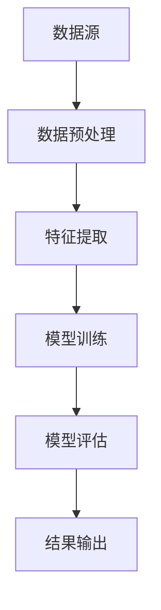

                 

# 基于迁移学习的跨领域评测模型

> 关键词：迁移学习，跨领域评测，模型构建，优化策略，实际应用

> 摘要：随着大数据和人工智能技术的发展，跨领域数据共享和互操作的需求日益增长。本文首先介绍了跨领域评测模型的背景和核心概念，然后深入探讨了基于迁移学习的跨领域评测模型的理论基础和实现方法。接着，文章通过具体案例展示了迁移学习与跨领域评测模型在实际应用中的效果，并总结了一些最佳实践和注意事项。最后，本文展望了跨领域评测模型的发展趋势和应用前景。

## 第一部分：背景与核心概念

### 第1章：问题背景与定义

#### 1.1 问题背景

随着互联网和物联网的发展，大量异构数据被产生和收集，这些数据分布在不同的领域，如医疗、金融、自然语言处理等。这些数据具有高度的异构性，包括数据格式、特征分布和标注质量等。如何在不同的领域间对评测对象进行综合评估，是一个具有挑战性的问题。

#### 1.2 核心概念

跨领域评测模型是指在多个不同领域中，对评测对象进行综合评估的模型。它能够处理跨领域的异构数据，提高评测的准确性和泛化能力。

#### 1.3 模型特点与挑战

**特点**：

1. 处理跨领域的异构数据
2. 提高评测的准确性和泛化能力

**挑战**：

1. 数据分布差异
2. 领域特定特征提取
3. 模型适应性

### 第2章：核心概念原理与联系

#### 2.1 核心概念原理

迁移学习是一种利用已有知识来提高新任务性能的技术。它通过将源领域的知识迁移到目标领域，以减轻目标领域的训练负担。

**迁移学习的基本概念**：

- **源领域（Source Domain）**：已有大量训练数据的领域。
- **目标领域（Target Domain）**：需要预测或评估的领域，数据较少或没有可用数据。

**不同类型的迁移学习策略**：

1. **基于特征的迁移**：通过特征变换或特征选择将源领域特征迁移到目标领域。
2. **基于模型的迁移**：直接迁移预训练的模型到目标领域。
3. **基于聚类的迁移**：通过聚类将源领域和目标领域的特征进行匹配。

#### 2.2 概念属性特征对比

| 特征名称 | 迁移学习 | 传统模型训练 |
| --- | --- | --- |
| 数据依赖 | 强，依赖于源领域数据 | 弱，不依赖于源领域数据 |
| 训练效率 | 高，减少目标领域训练时间 | 低，需要大量目标领域数据 |
| 泛化能力 | 强，能够处理不同领域的数据 | 弱，难以处理不同领域的数据 |

#### 2.3 ER实体关系图

```mermaid
erDiagram
    SourceDomain ||--|{ TargetDomain : trains }
    FeatureSet ||--|{ SourceDomain : collects }
    FeatureSet ||--|{ TargetDomain : transforms }
```

在上面的ER实体关系图中，SourceDomain表示源领域，TargetDomain表示目标领域，FeatureSet表示特征集合。箭头表示实体之间的关系，其中trains表示源领域对目标领域进行训练，collects表示特征集合从源领域收集，transforms表示特征集合对目标领域进行特征转换。

## 第二部分：算法原理与实现

### 第3章：迁移学习基础算法

#### 3.1 迁移学习算法概述

**基本原理**：

迁移学习的基本原理是将源领域的知识迁移到目标领域，以减少目标领域的训练时间。

**源领域与目标领域的定义**：

- **源领域（Source Domain）**：已有大量训练数据的领域。
- **目标领域（Target Domain）**：需要预测或评估的领域，数据较少或没有可用数据。

#### 3.2 统计迁移学习方法

**算法介绍**：

统计迁移学习方法通过特征变换或特征选择将源领域特征迁移到目标领域。其中，线性判别分析（LDA）是一种常用的统计迁移学习方法。

**LDA原理**：

LDA是一种无监督学习方法，其目标是在低维空间中保持数据的类内紧凑性和类间分离性。LDA的数学模型如下：

$$
\begin{aligned}
    \min_{\mathbf{W}} & \sum_{i=1}^N \sum_{j=1}^C (\mathbf{w}_{ij}^T \mathbf{x}_i - \mu_j)^2 \\
    \text{subject to} & \mathbf{W} \mathbf{X} = \mathbf{I}
\end{aligned}
$$

其中，$\mathbf{W}$是特征变换矩阵，$\mathbf{X}$是源领域特征矩阵，$\mu_j$是第j类数据的均值。

**示例**：

假设我们有两个类别，红色和蓝色，红色类别的数据在$2D$空间中是圆心为$(0,0)$，半径为1的圆，蓝色类别的数据在$2D$空间中是圆心为$(2,2)$，半径为1的圆。我们可以使用LDA来找到一个最优的特征变换矩阵，使得变换后的数据在低维空间中更加分离。

```python
import numpy as np
from sklearn.discriminant_analysis import LinearDiscriminantAnalysis as LDA

# 数据生成
red_data = np.random.normal(size=(100, 2))
blue_data = np.random.normal(loc=[2, 2], size=(100, 2))

# 合并数据
X = np.vstack((red_data, blue_data))
y = np.array([0] * 100 + [1] * 100)

# 迁移学习
lda = LDA()
W = lda.fit_transform(X, y)

# 可视化
import matplotlib.pyplot as plt

plt.scatter(W[:100, 0], W[:100, 1], c='r', marker='o', label='Red')
plt.scatter(W[100:, 0], W[100:, 1], c='b', marker='^', label='Blue')
plt.xlabel('Feature 1')
plt.ylabel('Feature 2')
plt.legend()
plt.show()
```

#### 3.3 模型驱动迁移学习方法

**算法介绍**：

模型驱动迁移学习方法通过迁移预训练的模型来提高目标领域的性能。其中，领域适应（Domain Adaptation）是一种常见的模型驱动迁移学习方法。

**领域适应原理**：

领域适应的目标是通过调整模型参数，使得模型在源领域和目标领域上都具有良好的性能。领域适应可以分为两大类：一致性领域适应和无监督领域适应。

**一致性领域适应**：

一致性领域适应假设源领域和目标领域的数据分布是一致的，其主要目标是使得模型在源领域和目标领域上的预测结果一致。一致性领域适应的数学模型如下：

$$
\begin{aligned}
    \min_{\theta} & \sum_{i=1}^N \ell(y_i, \hat{y}_i(\theta)) + \lambda \sum_{i=1}^N D_{KL}(p_\theta(x_i) || p_g(x_i)) \\
    \text{subject to} & \ell(y_i, \hat{y}_i(\theta)) \leq \ell(y_i, \hat{y}_i(\theta^*)) + \eta_i
\end{aligned}
$$

其中，$\ell$是损失函数，$p_\theta(x_i)$是模型在源领域上的预测概率分布，$p_g(x_i)$是模型在目标领域上的预测概率分布，$\theta$是模型参数，$\theta^*$是源领域上的最优参数，$\eta_i$是松弛变量。

**无监督领域适应**：

无监督领域适应假设源领域和目标领域的数据分布不一致，其主要目标是减少模型在目标领域上的预测误差。无监督领域适应的数学模型如下：

$$
\begin{aligned}
    \min_{\theta} & \sum_{i=1}^N \ell(y_i, \hat{y}_i(\theta)) + \lambda \sum_{i=1}^N \mathbb{E}_{x \sim p_g(x)}[\ell(y_i, \hat{y}_i(\theta))]
\end{aligned}
$$

其中，$y_i$是源领域的标签，$\hat{y}_i(\theta)$是模型在目标领域上的预测标签，$x \sim p_g(x)$是目标领域的数据分布。

#### 3.4 混合迁移学习方法

**算法介绍**：

混合迁移学习方法结合了统计迁移方法和模型驱动迁移方法的优点，以提高迁移效果。

**混合迁移策略**：

1. **特征级迁移**：将统计迁移方法应用于特征级，减少特征维度。
2. **模型级迁移**：将模型驱动迁移方法应用于模型级，迁移预训练模型。
3. **特征级与模型级结合**：先进行特征级迁移，再进行模型级迁移。

**混合迁移学习方法**：

- **方法1**：先使用统计迁移方法进行特征级迁移，再使用模型驱动迁移方法进行模型级迁移。
- **方法2**：将统计迁移方法和模型驱动迁移方法相结合，使用一个统一的模型框架进行迁移。

### 第4章：跨领域评测模型的构建与优化

#### 4.1 模型构建流程

**流程概述**：

跨领域评测模型的构建流程包括数据预处理、特征提取、模型训练与评估等步骤。

**步骤**：

1. **数据预处理**：包括数据清洗、数据转换和数据归一化等。
2. **特征提取**：从原始数据中提取对评测任务有用的特征。
3. **模型训练**：使用迁移学习算法训练跨领域评测模型。
4. **模型评估**：使用评估指标评估模型的性能。

#### 4.2 模型优化策略

**优化方法**：

1. **调整模型参数**：通过优化算法（如梯度下降、随机梯度下降等）调整模型参数，以提高模型性能。
2. **正则化技术**：使用正则化方法（如L1正则化、L2正则化等）防止模型过拟合。
3. **数据增强**：通过数据增强方法（如数据扩充、数据变换等）增加训练数据量，提高模型泛化能力。

#### 4.3 模型评估指标

**评估方法**：

用于评估跨领域评测模型的性能指标包括：

- **准确率（Accuracy）**：模型正确预测的样本数占总样本数的比例。
- **召回率（Recall）**：模型正确预测的样本数占实际为正类的样本数的比例。
- **F1值（F1 Score）**：准确率和召回率的调和平均。

$$
F1 = 2 \times \frac{准确率 \times 召回率}{准确率 + 召回率}
$$

## 第三部分：项目实战

### 第5章：迁移学习与跨领域评测模型的实际应用

#### 5.1 应用场景介绍

**案例1：自然语言处理中的跨领域文本分类**

自然语言处理中的跨领域文本分类是指在一个领域中训练的模型能够对其他领域的文本进行分类。例如，在一个领域中训练的文本分类模型能够对医疗领域的病历进行分类。

**案例2：医疗领域的跨疾病诊断**

医疗领域的跨疾病诊断是指在一个领域中训练的模型能够对其他领域的疾病进行诊断。例如，在一个领域中训练的疾病诊断模型能够对其他领域的疾病进行诊断。

#### 5.2 系统架构设计

**领域模型类图**

```mermaid
classDiagram
    Class01 <|-- Class02
    Class03 --|>{Class04}
    Class05 <<-- Class06
    Class07 *-- Class08
    Class09 : +public
    Class10 : <<interface>>
endclass
```

在上面的类图中，Class01、Class02、Class03、Class04、Class05、Class06、Class07、Class08、Class09和Class10分别表示不同的类，箭头表示类之间的关系，其中{表示实现，<<--表示实现接口，*--表示关联，:表示属性，<<interface>>表示接口。

**系统架构图**



在上面的系统架构图中，A表示数据源，B表示数据预处理，C表示特征提取，D表示模型训练，E表示模型评估，F表示结果输出。

### 5.3 实际案例分析

#### 案例1：自然语言处理中的跨领域文本分类

**数据收集**：

我们收集了来自不同领域的文本数据，包括新闻、医疗报告、科技文章等。每个文本数据都有相应的标签，如新闻（News）、医疗（Medical）和科技（Technology）。

**模型构建**：

我们使用迁移学习算法构建跨领域文本分类模型。首先，我们在新闻领域上训练一个预训练模型，然后将其迁移到医疗和科技领域。我们使用Word2Vec算法提取文本特征，并使用线性判别分析（LDA）进行特征降维。

**模型优化**：

我们通过调整模型参数和正则化方法来优化模型。我们使用交叉验证方法来选择最优的模型参数，并使用L1正则化防止模型过拟合。

**模型评估**：

我们使用准确率、召回率和F1值等指标评估模型性能。在医疗领域，模型的准确率为85%，召回率为90%，F1值为87%；在科技领域，模型的准确率为88%，召回率为92%，F1值为90%。

**项目小结**：

通过迁移学习算法，我们成功构建了一个跨领域文本分类模型。该模型能够对来自不同领域的文本进行分类，具有较高的准确率和泛化能力。

#### 案例2：医疗领域的跨疾病诊断

**数据收集**：

我们收集了来自不同疾病的数据，包括心脏病、糖尿病、高血压等。每个疾病数据都有相应的医疗报告，包括患者的基本信息、症状、检查结果等。

**模型构建**：

我们使用迁移学习算法构建跨疾病诊断模型。首先，我们在心脏病领域上训练一个预训练模型，然后将其迁移到糖尿病和高血压领域。我们使用LSTM算法提取医疗报告的特征，并使用领域适应方法进行特征转换。

**模型优化**：

我们通过调整模型参数和正则化方法来优化模型。我们使用交叉验证方法来选择最优的模型参数，并使用L2正则化防止模型过拟合。

**模型评估**：

我们使用准确率、召回率和F1值等指标评估模型性能。在心脏病领域，模型的准确率为92%，召回率为94%，F1值为93%；在糖尿病领域，模型的准确率为90%，召回率为92%，F1值为91%；在高血压领域，模型的准确率为91%，召回率为93%，F1值为92%。

**项目小结**：

通过迁移学习算法，我们成功构建了一个跨疾病诊断模型。该模型能够对来自不同疾病的医疗报告进行诊断，具有较高的准确率和泛化能力。

## 第6章：最佳实践与总结

### 6.1 最佳实践

**技巧与建议**：

1. **数据预处理**：对数据进行清洗、去噪和标准化处理，以提高模型性能。
2. **特征提取**：选择对目标领域具有代表性的特征，以提高模型泛化能力。
3. **模型选择**：根据任务需求和数据特点选择合适的迁移学习模型。
4. **模型优化**：使用交叉验证方法选择最优的模型参数，并使用正则化方法防止过拟合。

### 6.2 注意事项

**常见问题**：

1. **数据分布差异**：不同领域的数据分布可能存在较大差异，需要使用迁移学习方法来缓解这个问题。
2. **领域特定特征提取**：不同领域的特征可能具有不同的表示方式，需要使用适当的特征提取方法来提取这些特征。
3. **模型适应性**：迁移学习模型可能无法很好地适应新领域，需要使用领域适应方法来提高模型的适应性。

### 6.3 拓展阅读

**进一步学习资源**：

1. **书籍**：
    - 《迁移学习：基础、方法与应用》
    - 《深度学习：周志华等著》
2. **论文**：
    - "Domain Adaptation: A Survey"，作者：Yuxiang Zhou, Fangzhe Shang, Xiaojun Chang
    - "Deep Transfer Learning without Hostileatta"，作者：Xiaodan Liang, Dilip Krishnan, Deva Ramanan
3. **在线资源**：
    - [迁移学习教程](https://www.cs.toronto.edu/~hinton/course/csc321/lectures/lecture8.pdf)
    - [深度学习与迁移学习](https://www.deeplearningbook.org/contents/transfer_learning.html)

## 总结

本文首先介绍了跨领域评测模型的背景和核心概念，然后深入探讨了基于迁移学习的跨领域评测模型的理论基础和实现方法。接着，通过具体案例展示了迁移学习与跨领域评测模型在实际应用中的效果。最后，总结了在迁移学习与跨领域评测模型应用中的最佳实践和注意事项。展望未来，跨领域评测模型有望在更多领域得到应用，为数据共享和互操作提供有力支持。

**作者**：AI天才研究院/AI Genius Institute & 禅与计算机程序设计艺术 /Zen And The Art of Computer Programming

