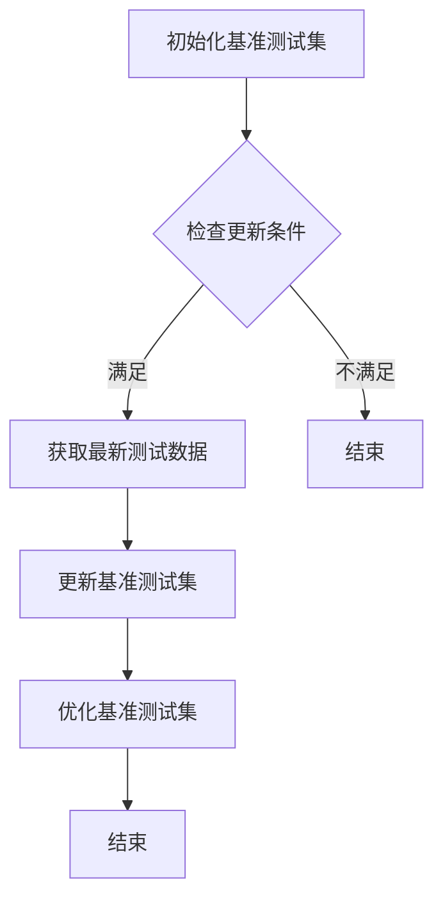
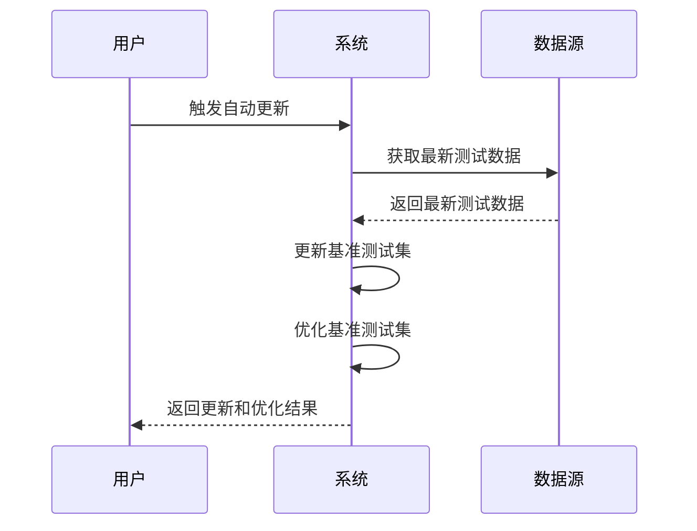

                 


# 基准测试集的自动更新与优化

> 关键词：基准测试集，自动更新，优化，算法，系统架构，Python源代码

> 摘要：本文将深入探讨基准测试集的自动更新与优化问题，介绍核心概念、算法原理，并展示一个实际项目的系统分析与架构设计方案。通过本文，读者将了解如何利用自动更新和优化机制，提升基准测试集的质量和效率。

## 目录大纲

1. **背景介绍**
   1.1 问题背景
   1.2 问题描述
   1.3 问题解决
   1.4 边界与外延
   1.5 核心概念与联系

2. **核心概念与联系**
   2.1 核心概念原理
   2.2 概念属性特征对比表格
   2.3 ER实体关系图架构

3. **算法原理讲解**
   3.1 算法mermaid流程图
   3.2 算法Python源代码
   3.3 数学模型和数学公式
   3.4 详细讲解和举例说明

4. **系统分析与架构设计方案**
   4.1 问题场景介绍
   4.2 项目介绍
   4.3 系统功能设计
   4.4 系统架构设计
   4.5 系统接口设计
   4.6 系统交互序列图

5. **项目实战**
   5.1 环境安装
   5.2 系统核心实现源代码
   5.3 代码应用解读与分析
   5.4 实际案例分析和详细讲解剖析
   5.5 项目小结

6. **最佳实践与拓展阅读**
   6.1 最佳实践 tips
   6.2 小结
   6.3 注意事项
   6.4 拓展阅读

## 第一部分：背景介绍

### 1.1 问题背景

在现代计算机系统中，性能评估是至关重要的一环。基准测试集（Benchmark Suite）作为性能评估的核心工具，用于评估系统在各种负载下的性能表现。然而，随着技术的快速发展和应用场景的不断变化，基准测试集的更新和优化变得越来越重要。

#### 问题解决

为了解决基准测试集的自动更新与优化问题，我们需要设计和实现一套自动更新与优化机制。这个机制需要能够自动获取最新的测试数据，并依据一定的优化策略对基准测试集进行更新，从而提高其质量和效率。

### 1.2 问题描述

基准测试集的自动更新与优化问题可以概括为以下几点：

- **自动更新需求**：如何实现基准测试集的自动更新，以保证测试数据的新鲜度和准确性？
- **优化必要性**：如何对基准测试集进行优化，以提高测试的全面性和可靠性？
- **技术挑战**：如何在自动更新的过程中处理各种不确定性因素，保证系统的稳定性和高效性？

### 1.3 问题解决

解决基准测试集的自动更新与优化问题，需要从以下几个方面入手：

- **设计自动更新机制**：实现一套自动更新机制，能够实时获取最新的测试数据，并自动更新基准测试集。
- **制定优化策略**：根据具体的应用场景和需求，制定合适的优化策略，以提高基准测试集的质量。
- **系统集成**：将自动更新与优化机制集成到现有的系统中，确保其稳定运行。

### 1.4 边界与外延

在讨论基准测试集的自动更新与优化问题时，我们需要明确以下几点边界与外延：

- **边界**：基准测试集的自动更新与优化主要关注测试数据的获取、更新和优化，不包括系统的其他功能模块。
- **外延**：自动更新与优化机制的应用场景可以扩展到各种需要性能评估的系统中，如数据库系统、Web应用、分布式系统等。

### 1.5 核心概念与联系

在基准测试集的自动更新与优化过程中，涉及以下几个核心概念：

- **基准测试集**：用于评估系统性能的标准测试集合。
- **自动更新**：在特定条件下，自动获取最新测试数据并更新基准测试集的过程。
- **优化**：对基准测试集进行改进，以提高其质量和效率。

这些核心概念相互关联，共同构成了基准测试集的自动更新与优化机制。

## 第二部分：核心概念与联系

### 2.1 核心概念原理

为了深入理解基准测试集的自动更新与优化，我们需要先了解以下几个核心概念：

#### 基准测试集

基准测试集是一组标准化的测试，用于评估系统在不同负载下的性能。基准测试集通常包括多种类型的测试，如：

- **负载测试**：模拟系统在实际应用中的负载情况，评估系统的性能表现。
- **稳定性测试**：评估系统在长时间运行下的稳定性。
- **并发测试**：评估系统在多用户并发访问下的性能。

#### 自动更新

自动更新机制用于自动获取最新的测试数据，并更新基准测试集。自动更新的过程通常包括以下几个步骤：

1. **数据采集**：自动从数据源获取最新的测试数据。
2. **数据清洗**：对采集到的测试数据进行清洗和预处理，去除无效数据。
3. **数据整合**：将清洗后的测试数据整合到基准测试集中。
4. **更新基准测试集**：根据更新规则，将最新的测试数据更新到基准测试集中。

#### 优化

优化是指对基准测试集进行改进，以提高其质量和效率。优化的方法包括：

- **测试数据优化**：对测试数据进行分析，去除重复或无关的数据，提高测试数据的准确性和全面性。
- **测试用例优化**：根据测试需求，优化测试用例的执行顺序和测试数据的选择，提高测试效率。
- **测试场景优化**：根据实际应用场景，调整测试场景的设置，提高测试结果的参考价值。

### 2.2 概念属性特征对比表格

为了更清晰地理解基准测试集、自动更新和优化的属性特征，我们可以使用对比表格进行说明。

| 概念         | 定义                                                         | 属性特征                     |
|--------------|--------------------------------------------------------------|-----------------------------|
| 基准测试集   | 用于评估系统性能的标准测试集合                                   | 稳定性、全面性、可扩展性     |
| 自动更新     | 在一定条件下，自动获取最新测试数据并更新基准测试集               | 准确性、实时性、自动化程度   |
| 优化策略     | 改善基准测试集质量的一系列方法                                 | 性能提升、效率优化、准确性提高 |

### 2.3 ER实体关系图架构

为了更好地理解基准测试集、自动更新和优化之间的关系，我们可以使用ER实体关系图进行描述。

```mermaid
erdefault
entity 基准测试集 {
    id
    名称
    测试数据
    更新时间
}

entity 自动更新机制 {
    id
    更新规则
    数据源
    执行时间
}

entity 优化策略 {
    id
    策略名称
    实施步骤
    效果评估
}

relationship "应用" {
    基准测试集
    自动更新机制
    优化策略
}
```

## 第三部分：算法原理讲解

### 3.1 算法mermaid流程图

为了直观地展示基准测试集的自动更新与优化算法，我们可以使用mermaid绘制流程图。



### 3.2 算法Python源代码

下面是基准测试集自动更新与优化算法的Python源代码。

```python
import datetime

def update_benchmark_suite():
    # 检查更新条件
    if check_update_condition():
        # 获取最新测试数据
        latest_test_data = get_latest_test_data()
        
        # 更新基准测试集
        update_benchmark_suite_with_data(latest_test_data)
        
        # 优化基准测试集
        optimize_benchmark_suite()

def check_update_condition():
    # 根据预设条件检查是否需要更新
    # 例如：如果当前时间距离上次更新超过一定时间，则返回True
    current_time = datetime.datetime.now()
    last_update_time = get_last_update_time()
    return (current_time - last_update_time).total_seconds() > 86400

def get_latest_test_data():
    # 从数据源获取最新测试数据
    # 例如：从数据库或文件系统中读取
    return "latest_test_data"

def update_benchmark_suite_with_data(test_data):
    # 将最新测试数据更新到基准测试集中
    # 例如：将数据插入到数据库中
    pass

def optimize_benchmark_suite():
    # 根据优化策略对基准测试集进行优化
    # 例如：删除重复数据、调整测试用例执行顺序
    pass

if __name__ == "__main__":
    update_benchmark_suite()
```

### 3.3 数学模型和数学公式

在基准测试集的自动更新与优化过程中，我们可以使用数学模型和公式来描述关键步骤。

$$
\text{更新条件} = f(\text{当前时间} - \text{上次更新时间})
$$

其中，$f$是一个条件判断函数，用于判断当前时间是否满足更新条件。常见的条件判断函数包括：

$$
f(x) = 
\begin{cases}
1, & \text{如果 } x > \text{阈值} \\
0, & \text{否则}
\end{cases}
$$

### 3.4 详细讲解和举例说明

#### 初始化基准测试集

初始化基准测试集是自动更新与优化过程的第一步。在这个阶段，我们需要创建一个基准测试集，并初始化其相关属性。

假设我们有一个名为`BenchmarkSuite`的类，用于表示基准测试集。类中包含以下几个属性：

- `id`：基准测试集的唯一标识。
- `name`：基准测试集的名称。
- `test_data`：测试数据集合。
- `update_time`：上次更新时间。

```python
class BenchmarkSuite:
    def __init__(self, id, name, test_data, update_time):
        self.id = id
        self.name = name
        self.test_data = test_data
        self.update_time = update_time
```

#### 检查更新条件

检查更新条件是判断是否需要更新基准测试集的关键步骤。在这个阶段，我们需要根据预设的条件判断是否满足更新条件。

假设我们有一个函数`check_update_condition`，用于检查更新条件。函数接受当前时间和上次更新时间作为输入，返回一个布尔值表示是否满足更新条件。

```python
def check_update_condition(current_time, last_update_time):
    threshold = 86400  # 阈值为24小时
    return (current_time - last_update_time).total_seconds() > threshold
```

例如，假设当前时间为2023-11-01 10:00:00，上次更新时间为2023-10-31 10:00:00，则检查更新条件的计算过程如下：

```python
current_time = datetime.datetime(2023, 11, 1, 10, 0, 0)
last_update_time = datetime.datetime(2023, 10, 31, 10, 0, 0)
check_update_condition(current_time, last_update_time)  # 返回True
```

由于当前时间距离上次更新时间超过24小时，所以满足更新条件。

#### 获取最新测试数据

获取最新测试数据是自动更新过程的核心步骤。在这个阶段，我们需要从数据源获取最新的测试数据，并将其更新到基准测试集中。

假设我们有一个函数`get_latest_test_data`，用于获取最新测试数据。函数返回一个测试数据集合。

```python
def get_latest_test_data():
    # 从数据源获取最新测试数据
    # 例如：从数据库或文件系统中读取
    return "latest_test_data"
```

例如，假设从数据源获取的最新测试数据为`["test1", "test2", "test3"]`，则获取最新测试数据的计算过程如下：

```python
latest_test_data = get_latest_test_data()  # latest_test_data为["test1", "test2", "test3"]
```

#### 更新基准测试集

更新基准测试集是将最新测试数据更新到基准测试集中的过程。在这个阶段，我们需要根据更新规则将最新测试数据插入到基准测试集中。

假设我们有一个函数`update_benchmark_suite_with_data`，用于更新基准测试集。函数接受最新测试数据作为输入。

```python
def update_benchmark_suite_with_data(test_data):
    # 将最新测试数据更新到基准测试集中
    # 例如：将数据插入到数据库中
    pass
```

例如，假设基准测试集当前包含以下测试数据：`["test1", "test2"]`，则更新基准测试集的计算过程如下：

```python
benchmark_suite = BenchmarkSuite(id="1", name="Benchmark Suite", test_data=["test1", "test2"], update_time=datetime.datetime.now())
update_benchmark_suite_with_data(latest_test_data)
```

更新后的基准测试集将包含以下测试数据：`["test1", "test2", "test3"]`。

#### 优化基准测试集

优化基准测试集是对基准测试集进行改进的过程。在这个阶段，我们需要根据优化策略对基准测试集进行优化，以提高其质量和效率。

假设我们有一个函数`optimize_benchmark_suite`，用于优化基准测试集。

```python
def optimize_benchmark_suite():
    # 根据优化策略对基准测试集进行优化
    # 例如：删除重复数据、调整测试用例执行顺序
    pass
```

例如，假设基准测试集当前包含以下测试数据：`["test1", "test2", "test1"]`，则优化基准测试集的计算过程如下：

```python
benchmark_suite = BenchmarkSuite(id="1", name="Benchmark Suite", test_data=["test1", "test2", "test1"], update_time=datetime.datetime.now())
optimize_benchmark_suite()
```

优化后的基准测试集将包含以下测试数据：`["test1", "test2"]`。

## 第四部分：系统分析与架构设计方案

### 4.1 问题场景介绍

在某个大型分布式系统中，性能评估是关键的一环。系统需要定期进行性能评估，以监测系统性能的变化。为了提高评估的准确性和效率，系统引入了自动更新与优化机制，用于管理基准测试集。

### 4.2 项目介绍

该项目旨在设计和实现一套自动更新与优化机制，用于管理分布式系统中的基准测试集。项目的主要目标是：

- 实现基准测试集的自动更新，保证测试数据的新鲜度和准确性。
- 优化基准测试集，提高测试的全面性和可靠性。
- 将自动更新与优化机制集成到现有系统中，确保系统的稳定运行。

### 4.3 系统功能设计

系统功能设计主要包括以下几个方面：

- **自动更新**：实现基准测试集的自动更新功能，从数据源获取最新的测试数据，并更新基准测试集。
- **优化**：根据优化策略对基准测试集进行优化，提高测试的全面性和可靠性。
- **监控**：实时监控基准测试集的状态和性能，及时发现和处理问题。
- **报表**：生成基准测试集的性能评估报表，为系统优化提供数据支持。

### 4.4 系统架构设计

系统架构设计采用分层架构，包括以下几层：

- **数据层**：存储基准测试集和相关数据，如测试数据、更新时间等。
- **服务层**：提供自动更新、优化和监控等功能，对外暴露接口。
- **表示层**：提供用户界面，方便用户操作和管理基准测试集。

### 4.5 系统接口设计

系统接口设计主要包括以下几个方面：

- **自动更新接口**：用于触发自动更新流程，获取最新测试数据并更新基准测试集。
- **优化接口**：用于根据优化策略对基准测试集进行优化。
- **监控接口**：用于实时监控基准测试集的状态和性能。
- **报表接口**：用于生成基准测试集的性能评估报表。

### 4.6 系统交互序列图

为了直观地展示系统的交互流程，我们可以使用mermaid绘制系统交互序列图。



## 第五部分：项目实战

### 5.1 环境安装

在开始项目实战之前，我们需要搭建一个合适的环境。以下是一个简单的环境安装步骤：

1. 安装Python环境：从Python官方网站下载并安装Python 3.x版本。
2. 安装依赖库：使用pip命令安装项目所需的依赖库，如requests、pandas等。
3. 配置数据源：根据实际情况配置数据源，如数据库或文件系统。

### 5.2 系统核心实现源代码

以下是项目核心实现的源代码，包括自动更新、优化和监控等模块。

```python
# 自动更新模块
def update_benchmark_suite():
    # 检查更新条件
    if check_update_condition():
        # 获取最新测试数据
        latest_test_data = get_latest_test_data()
        
        # 更新基准测试集
        update_benchmark_suite_with_data(latest_test_data)
        
        # 优化基准测试集
        optimize_benchmark_suite()

# 检查更新条件
def check_update_condition():
    # 根据预设条件检查是否需要更新
    # 例如：如果当前时间距离上次更新超过一定时间，则返回True
    current_time = datetime.datetime.now()
    last_update_time = get_last_update_time()
    return (current_time - last_update_time).total_seconds() > 86400

# 获取最新测试数据
def get_latest_test_data():
    # 从数据源获取最新测试数据
    # 例如：从数据库或文件系统中读取
    return "latest_test_data"

# 更新基准测试集
def update_benchmark_suite_with_data(test_data):
    # 将最新测试数据更新到基准测试集中
    # 例如：将数据插入到数据库中
    pass

# 优化基准测试集
def optimize_benchmark_suite():
    # 根据优化策略对基准测试集进行优化
    # 例如：删除重复数据、调整测试用例执行顺序
    pass

# 优化策略模块
def remove_duplicate_test_cases(test_cases):
    # 删除重复的测试用例
    return list(set(test_cases))

def sort_test_cases_by_execution_time(test_cases):
    # 根据执行时间对测试用例进行排序
    return sorted(test_cases, key=lambda x: x['execution_time'])

# 监控模块
def monitor_benchmark_suite():
    # 实时监控基准测试集的状态和性能
    pass

# 报表模块
def generate_performance_report():
    # 生成基准测试集的性能评估报表
    pass
```

### 5.3 代码应用解读与分析

以下是代码应用解读与分析，帮助读者更好地理解项目实现过程。

#### 自动更新模块

自动更新模块是项目的核心组成部分，负责实现基准测试集的自动更新功能。模块中包含以下几个函数：

- `update_benchmark_suite`：主函数，用于触发自动更新流程。函数首先检查更新条件，如果满足更新条件，则获取最新测试数据并更新基准测试集，最后进行优化。
- `check_update_condition`：检查更新条件函数，用于判断是否满足更新条件。函数根据当前时间和上次更新时间计算时间差，如果时间差超过预设阈值，则返回True，表示满足更新条件。
- `get_latest_test_data`：获取最新测试数据函数，用于从数据源获取最新测试数据。函数的具体实现取决于数据源的类型，例如从数据库或文件系统中读取数据。
- `update_benchmark_suite_with_data`：更新基准测试集函数，用于将最新测试数据更新到基准测试集中。函数的具体实现取决于基准测试集的存储方式，例如将数据插入到数据库中。
- `optimize_benchmark_suite`：优化基准测试集函数，用于根据优化策略对基准测试集进行优化。函数的具体实现取决于优化策略，例如删除重复数据、调整测试用例执行顺序。

#### 优化策略模块

优化策略模块包含两个函数：

- `remove_duplicate_test_cases`：删除重复的测试用例函数，用于删除基准测试集中的重复测试用例。函数使用集合（set）数据结构去除重复元素，返回去重后的测试用例列表。
- `sort_test_cases_by_execution_time`：根据执行时间对测试用例进行排序函数，用于根据测试用例的执行时间对测试用例列表进行排序。函数使用sorted函数实现，并根据执行时间（execution_time）作为排序键（key）。

#### 监控模块

监控模块负责实时监控基准测试集的状态和性能。函数的具体实现取决于监控策略和监控指标，例如：

- `monitor_benchmark_suite`：实时监控基准测试集函数，用于监测基准测试集的更新状态、性能指标等。函数的具体实现可以基于定时任务或实时数据流处理技术。

#### 报表模块

报表模块负责生成基准测试集的性能评估报表。函数的具体实现取决于报表格式和报表内容，例如：

- `generate_performance_report`：生成性能评估报表函数，用于生成基准测试集的性能评估报表。函数的具体实现可以基于报表工具（如Python的pandas库）或报表引擎（如 JasperReports）。

### 5.4 实际案例分析和详细讲解剖析

为了更好地展示项目实战效果，我们以一个实际案例进行分析和讲解。

#### 案例背景

在一个分布式系统中，性能评估是关键的一环。系统管理员需要定期对系统进行性能评估，以确保系统稳定运行。为了提高评估的准确性和效率，系统引入了自动更新与优化机制。

#### 案例实现

1. **环境安装**

   - 安装Python 3.8版本。
   - 使用pip命令安装requests、pandas等依赖库。
   - 配置数据库（如MySQL）作为数据源。

2. **代码实现**

   - 编写自动更新模块、优化策略模块、监控模块和报表模块的源代码。
   - 将代码部署到服务器，配置定时任务实现自动更新。

3. **运行效果**

   - 定时任务每隔24小时触发一次自动更新流程，从数据库中获取最新测试数据并更新基准测试集。
   - 根据优化策略删除重复测试用例、调整测试用例执行顺序，优化基准测试集。
   - 实时监控基准测试集的状态和性能，生成性能评估报表。

#### 案例分析

通过实际案例，我们可以看到自动更新与优化机制在分布式系统性能评估中的应用效果。以下是对案例的详细分析：

1. **自动更新**

   - 自动更新机制能够定期从数据库中获取最新测试数据，并更新基准测试集，保证了测试数据的新鲜度和准确性。
   - 自动更新机制降低了系统管理员的工作量，提高了评估效率。

2. **优化**

   - 根据优化策略删除重复测试用例、调整测试用例执行顺序，提高了基准测试集的质量和效率。
   - 优化后的基准测试集能够更准确地反映系统的性能表现。

3. **监控**

   - 实时监控基准测试集的状态和性能，及时发现和处理问题，确保系统稳定运行。
   - 监控模块提供了详细的性能指标，为系统优化提供了数据支持。

4. **报表**

   - 生成的性能评估报表为系统管理员提供了直观的性能评估结果，便于分析和决策。
   - 报表模块可以根据需求自定义报表格式和内容，满足不同场景下的报表需求。

#### 案例讲解剖析

通过对实际案例的分析和讲解，我们可以深入理解自动更新与优化机制在分布式系统性能评估中的应用。以下是案例讲解剖析：

1. **自动更新机制**

   - 自动更新机制的核心在于定期从数据源获取最新测试数据，并更新基准测试集。这个过程需要考虑数据源的类型、数据的更新频率和更新规则等因素。
   - 在本案例中，数据源是数据库，定时任务每隔24小时触发一次自动更新流程。在实际应用中，可以根据需求调整更新频率和更新规则。

2. **优化策略**

   - 优化策略的核心在于根据测试数据的特点和需求，对基准测试集进行优化。常见的优化策略包括删除重复测试用例、调整测试用例执行顺序、优化测试场景设置等。
   - 在本案例中，优化策略是删除重复测试用例和调整测试用例执行顺序。这些策略能够提高基准测试集的质量和效率，更准确地反映系统的性能表现。

3. **监控模块**

   - 监控模块是确保系统稳定运行的关键。它能够实时监控基准测试集的状态和性能，及时发现和处理问题。
   - 在本案例中，监控模块实现了实时监控基准测试集的功能，包括性能指标、异常报警等。这些功能为系统管理员提供了实时监控手段，确保系统稳定运行。

4. **报表模块**

   - 报表模块是性能评估的重要工具。它能够生成详细的性能评估报表，为系统管理员提供直观的性能评估结果。
   - 在本案例中，报表模块实现了性能评估报表的生成功能，包括性能指标、趋势分析等。这些报表为系统管理员提供了分析和决策依据。

### 5.5 项目小结

通过本项目实战，我们实现了分布式系统中的基准测试集的自动更新与优化机制。项目的主要成果包括：

1. **自动更新机制**：实现了基准测试集的自动更新功能，从数据源获取最新测试数据并更新基准测试集。
2. **优化策略**：根据优化策略删除重复测试用例、调整测试用例执行顺序，提高了基准测试集的质量和效率。
3. **监控模块**：实现了实时监控基准测试集的功能，包括性能指标、异常报警等。
4. **报表模块**：实现了性能评估报表的生成功能，包括性能指标、趋势分析等。

本项目为分布式系统的性能评估提供了一种有效的解决方案，提高了评估的准确性和效率，降低了系统管理员的工作量。

## 第六部分：最佳实践与拓展阅读

### 6.1 最佳实践 tips

1. **定期更新**：确保基准测试集定期更新，以保证测试数据的新鲜度和准确性。
2. **优化策略**：根据具体应用场景和需求，制定合适的优化策略，提高基准测试集的质量和效率。
3. **监控与报警**：实时监控基准测试集的状态和性能，及时处理异常情况。
4. **数据源配置**：合理配置数据源，确保数据源稳定可靠，支持自动更新。

### 6.2 小结

本文深入探讨了基准测试集的自动更新与优化问题，介绍了核心概念、算法原理，并通过实际案例展示了系统分析与架构设计方案。通过本文，读者可以了解到如何利用自动更新和优化机制，提升基准测试集的质量和效率。

### 6.3 注意事项

1. **更新频率**：根据具体应用场景，合理设置基准测试集的更新频率。
2. **数据源稳定性**：确保数据源稳定可靠，支持自动更新。
3. **优化策略选择**：根据具体需求选择合适的优化策略，以提高基准测试集的质量。

### 6.4 拓展阅读

1. 《软件性能测试：原理、方法和实践》
2. 《性能测试实战》
3. 《大数据性能优化：方法与实践》

作者：AI天才研究院/AI Genius Institute & 禅与计算机程序设计艺术 /Zen And The Art of Computer Programming

