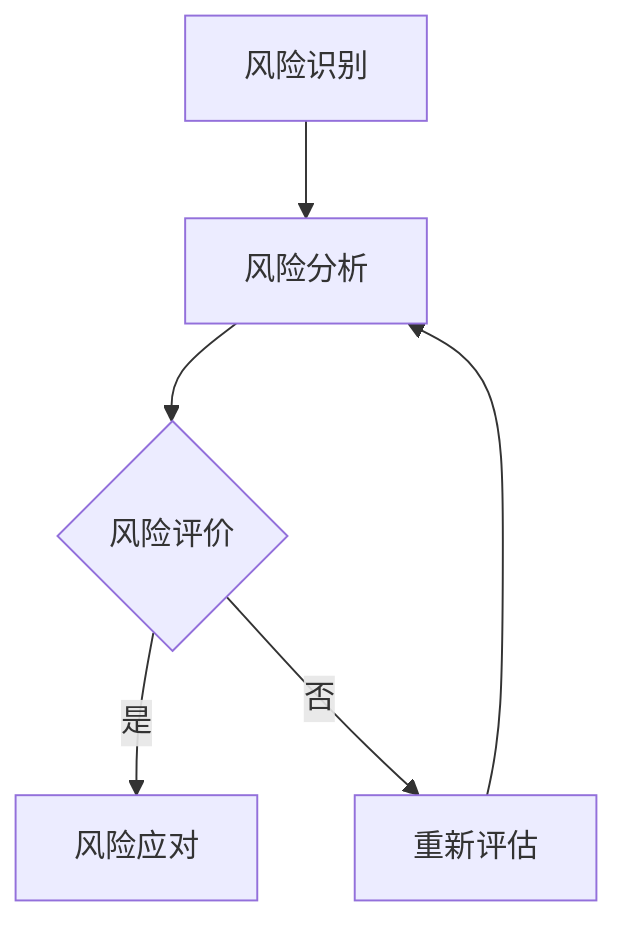
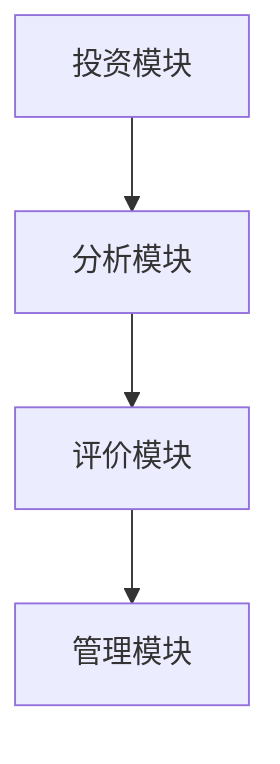
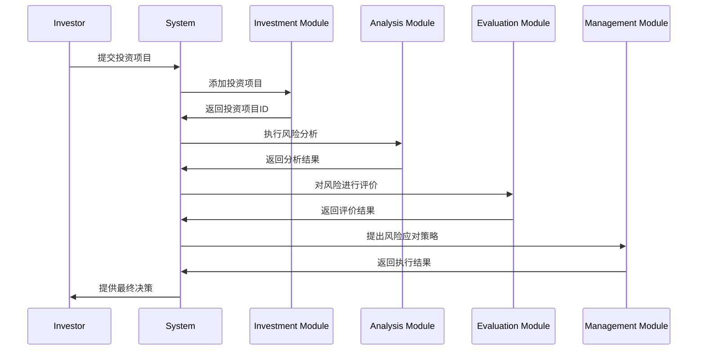

                 

### 摘要

《塞思卡拉曼的投资风险评估》旨在深入探讨著名投资者塞思·卡拉曼的投资风险评估方法。本文将详细介绍卡拉曼的风险评估框架，从核心概念、算法原理到实际应用，提供全面而深入的剖析。文章首先概述投资风险评估的重要性，然后介绍卡拉曼的投资理念及其核心原则。接着，我们将一步步讲解风险评估的数学模型和算法流程，并通过Python代码展示具体实现。此外，文章还将对系统架构和项目实战进行详细解析，包括环境安装、核心实现、案例分析及最佳实践。通过这些步骤，读者将能够全面理解并掌握卡拉曼的投资风险评估方法，从而在实际投资中做出更为明智的决策。

### 关键词

- 塞思·卡拉曼
- 投资风险评估
- 数学模型
- 算法原理
- 系统架构
- 实际应用
- 投资理念

### 第一部分：投资风险评估基础

#### 第1章：问题背景与核心概念

投资风险评估是金融领域中的一个关键议题，它涉及到对投资项目的风险进行全面评估，以帮助投资者做出更明智的投资决策。在投资过程中，风险无法完全避免，但通过科学的风险评估方法，投资者可以有效地降低潜在损失，并提高投资回报率。本章节将详细探讨投资风险评估的重要性，并引入塞思·卡拉曼的投资理念，为后续内容奠定基础。

#### 1.1 投资风险评估的重要性

投资风险评估的重要性主要体现在以下几个方面：

1. **风险识别**：通过风险评估，投资者可以识别潜在的投资风险，包括市场风险、信用风险、操作风险等。这有助于投资者在投资前做好充分准备，降低不必要的损失。

2. **决策支持**：投资风险评估为投资者提供了重要的决策支持。在评估不同投资机会时，投资者可以依据风险评估结果，选择风险较低且收益潜力较大的投资方案。

3. **风险控制**：风险评估有助于投资者制定风险控制策略，通过分散投资、设置止损点等措施，降低投资组合的整体风险。

4. **绩效评估**：投资风险评估还可以用于绩效评估，通过对比实际投资结果与预期结果，投资者可以分析投资策略的有效性，不断优化投资决策。

#### 1.2 塞思·卡拉曼及其投资理念

塞思·卡拉曼是一位著名的价值投资者，他在投资界享有极高的声誉。他的投资理念强调长期投资和风险控制，主张通过深入研究和分析，寻找具有投资价值的股票。卡拉曼的投资原则包括以下几点：

1. **价值投资**：卡拉曼坚信价值投资的理念，即通过购买价格低于其内在价值的股票，以期待长期的价格回归。

2. **深度研究**：卡拉曼注重对公司的深度研究，包括财务报表、管理层素质、行业趋势等，以确保投资决策的准确性。

3. **风险控制**：卡拉曼强调风险控制的重要性，他认为投资者必须在投资前制定详细的风险控制策略，以应对市场波动。

4. **耐心和纪律**：卡拉曼强调耐心和纪律，他认为投资者在市场波动中需要保持冷静，遵循既定的投资策略，避免冲动交易。

#### 1.3 投资风险评估的基本概念

投资风险评估涉及多个核心概念，以下是对这些概念的基本介绍：

1. **风险类型**：投资风险主要包括市场风险、信用风险、操作风险、流动性风险等。市场风险是指由于市场波动导致的投资损失；信用风险是指债务人无法按时偿还债务的风险；操作风险是指由于内部管理失误或系统故障导致的投资损失；流动性风险是指投资难以迅速变现的风险。

2. **风险评估方法**：常用的风险评估方法包括定量分析和定性分析。定量分析主要利用数学模型和统计数据对风险进行量化分析，如方差分析、回归分析等；定性分析则通过专家评估、情景分析等方法对风险进行定性描述。

3. **风险偏好**：投资者在投资过程中有不同的风险偏好，包括风险厌恶、风险中性和风险偏好。风险厌恶型投资者倾向于低风险投资；风险中性投资者追求稳健的投资回报；风险偏好型投资者愿意承担更高的风险以获取更高的回报。

4. **风险矩阵**：风险矩阵是一种常用的风险评估工具，通过列出不同风险因素及其可能的结果，帮助投资者评估投资风险。

#### 1.4 结论

投资风险评估是投资决策中不可或缺的一环，它能够帮助投资者更好地识别和管理风险。塞思·卡拉曼的投资理念和方法为投资者提供了一个有效的参考框架，通过深入研究和科学评估，投资者可以做出更为明智的投资决策。在接下来的章节中，我们将进一步探讨卡拉曼的风险评估方法，并通过具体的案例和代码实现，帮助读者深入理解这一方法。

### 核心概念与联系

#### 2.1 风险评估的概念模型

风险评估的概念模型是理解整个风险评估过程的关键。它涵盖了风险评估的目标、步骤和方法，为投资者提供了一个系统的框架。以下是风险评估概念模型的主要组成部分：

1. **风险评估目标**：风险评估的目标是识别、分析和控制投资风险，以确保投资组合的安全性、流动性和收益性。

2. **风险评估步骤**：风险评估通常包括以下步骤：
   - 风险识别：识别投资项目可能面临的各种风险因素。
   - 风险分析：对识别出的风险进行定量和定性分析，评估其可能性和影响。
   - 风险评价：根据风险分析和评估结果，对风险进行排序和分类。
   - 风险应对：制定并实施风险应对策略，以降低风险或接受风险。

3. **风险评估方法**：风险评估方法包括定量分析和定性分析。定量分析主要利用数学模型和统计数据对风险进行量化评估，如方差分析、回归分析等；定性分析则通过专家评估、情景分析等方法对风险进行定性描述。

#### 2.2 关键风险因素

在投资风险评估过程中，关键风险因素是投资者必须关注的重要方面。以下是几个主要的关键风险因素：

1. **市场风险**：市场风险是指由于市场波动导致的投资损失。市场风险主要包括利率风险、汇率风险、通货膨胀风险和股票市场波动等。

2. **信用风险**：信用风险是指债务人无法按时偿还债务的风险。对于投资者而言，信用风险主要涉及借款人或发行人违约的风险。

3. **操作风险**：操作风险是指由于内部管理失误或系统故障导致的投资损失。操作风险包括交易失误、系统故障、欺诈行为等。

4. **流动性风险**：流动性风险是指投资难以迅速变现的风险。流动性风险可能导致投资者在紧急情况下无法及时出售资产，从而面临损失。

5. **政策风险**：政策风险是指由于政策变动导致的投资损失。政策风险包括税收政策、贸易政策、监管政策等。

#### 2.3 概念属性特征对比表格

为了更好地理解各个关键风险因素，我们可以通过一个对比表格来展示它们的主要特征：

| 风险类型 | 主要特征 | 影响因素 | 可能的后果 |
| --- | --- | --- | --- |
| 市场风险 | 市场波动引起的损失 | 利率、汇率、通货膨胀、股票市场波动 | 投资价值下降、资产贬值 |
| 信用风险 | 债务人无法偿还债务 | 借款人信用状况、市场环境 | 投资损失、信用违约 |
| 操作风险 | 内部管理失误或系统故障 | 交易操作、系统安全、员工素质 | 投资失误、系统故障、欺诈行为 |
| 流动性风险 | 投资难以迅速变现 | 资产流动性、市场状况 | 无法及时变现、面临损失 |
| 政策风险 | 政策变动引起的损失 | 税收政策、贸易政策、监管政策 | 投资环境变化、投资回报下降 |

#### 2.4 ER实体关系图架构

实体关系图（ER图）是描述风险评估系统实体及其关系的图形化工具。以下是风险评估系统的ER图：

```mermaid
erDiagram
    Investment |<-.. MarketRisk : 市场风险
    Investment |<-.. CreditRisk : 信用风险
    Investment |<-.. OperationalRisk : 操作风险
    Investment |<-.. LiquidityRisk : 流动性风险
    Investment |<-.. PolicyRisk : 政策风险
    Investment : 投资项目
    MarketRisk : 市场风险
    CreditRisk : 信用风险
    OperationalRisk : 操作风险
    LiquidityRisk : 流动性风险
    PolicyRisk : 政策风险
```

通过ER图，我们可以清晰地看到风险评估系统中各个实体之间的关系，这有助于我们更好地理解风险评估的整体框架。

#### 结论

通过上述内容，我们对投资风险评估的概念模型、关键风险因素及其特征有了更深入的理解。理解这些核心概念和联系对于投资者来说至关重要，它们为投资者提供了科学的评估工具和方法，有助于在复杂的市场环境中做出更为明智的投资决策。在下一章中，我们将进一步探讨卡拉曼的风险评估算法原理，并通过具体的例子和代码实现，帮助读者更好地掌握这一方法。

### 第三部分：算法原理与数学模型

#### 第3章：算法原理讲解

在本章中，我们将详细讲解塞思·卡拉曼投资风险评估的核心算法原理。卡拉曼的风险评估方法主要基于定量分析和定性分析的结合，通过一系列数学模型和算法，对投资风险进行全面评估。以下是本章的主要内容：

#### 3.1 投资风险评估算法概述

卡拉曼的投资风险评估算法旨在通过以下几个步骤对投资风险进行量化评估：

1. **风险识别**：识别投资项目可能面临的各种风险因素，包括市场风险、信用风险、操作风险、流动性风险和政策风险。
2. **风险分析**：对识别出的风险因素进行定量和定性分析，评估其可能性和影响。
3. **风险评价**：根据风险分析结果，对风险进行排序和分类，确定其优先级。
4. **风险应对**：制定并实施风险应对策略，以降低风险或接受风险。

#### 3.2 算法mermaid流程图

为了更直观地展示卡拉曼的风险评估算法流程，我们可以使用mermaid流程图进行描述：



在上面的流程图中，A代表风险识别，B代表风险分析，C表示风险评价，D表示风险应对，而E表示重新评估。当风险评估完成后，系统会根据风险评价的结果决定是否需要继续进行风险应对或重新评估。

#### 3.3 Python源代码解析

下面是一个简单的Python代码示例，用于实现卡拉曼的投资风险评估算法：

```python
import pandas as pd
import numpy as np

# 风险评估数据
data = {
    'Investment': ['Stock A', 'Stock B', 'Stock C'],
    'MarketRisk': [0.2, 0.3, 0.1],
    'CreditRisk': [0.1, 0.2, 0.15],
    'OperationalRisk': [0.05, 0.1, 0.03],
    'LiquidityRisk': [0.05, 0.08, 0.02],
    'PolicyRisk': [0.02, 0.03, 0.01]
}

df = pd.DataFrame(data)

# 风险分析函数
def risk_analysis(df):
    df['TotalRisk'] = df[['MarketRisk', 'CreditRisk', 'OperationalRisk', 'LiquidityRisk', 'PolicyRisk']].sum(axis=1)
    df['RiskRank'] = df['TotalRisk'].rank(ascending=True)
    return df

# 风险评价函数
def risk_evaluation(df):
    high_risk = df[df['RiskRank'] <= 3]
    medium_risk = df[df['RiskRank'] > 3]
    low_risk = df[df['RiskRank'] > 6]
    return high_risk, medium_risk, low_risk

# 风险应对函数
def risk_management(df, risk_level):
    if risk_level == 'High':
        print("高风险，建议加强风险控制措施。")
    elif risk_level == 'Medium':
        print("中风险，可以适当分散投资。")
    else:
        print("低风险，可以继续持有或增加投资。")

# 执行风险评估
df_risk_analysis = risk_analysis(df)
high_risk, medium_risk, low_risk = risk_evaluation(df_risk_analysis)

# 分别对高风险、中风险和低风险进行风险应对
print("高风险投资：")
risk_management(high_risk, 'High')

print("\n中风险投资：")
risk_management(medium_risk, 'Medium')

print("\n低风险投资：")
risk_management(low_risk, 'Low')
```

在这个Python代码示例中，我们首先创建了一个包含不同股票及其各种风险因素的DataFrame。然后，我们定义了三个主要函数：`risk_analysis` 用于计算总风险和风险排名；`risk_evaluation` 用于将股票分为高风险、中风险和低风险；`risk_management` 用于提供相应的风险应对建议。

#### 3.4 数学模型与公式

卡拉曼的投资风险评估方法中，使用了多个数学模型和公式来量化评估风险。以下是几个关键的数学模型和公式：

1. **方差分析模型**：
   $$ VAR(R) = w_1^2 * VAR(R_1) + w_2^2 * VAR(R_2) + ... + w_n^2 * VAR(R_n) $$
   其中，$VAR(R)$ 是投资组合的总方差，$w_i$ 是第 $i$ 个风险因素的权重，$VAR(R_i)$ 是第 $i$ 个风险因素的方差。

2. **回归分析模型**：
   $$ Y = \beta_0 + \beta_1X_1 + \beta_2X_2 + ... + \beta_nX_n $$
   其中，$Y$ 是投资收益，$X_i$ 是第 $i$ 个风险因素，$\beta_i$ 是回归系数。

3. **信用评分模型**：
   $$ Score = a * X_1 + b * X_2 + ... + c * X_n $$
   其中，$Score$ 是借款人的信用评分，$X_i$ 是借款人的各种信用指标，$a, b, ..., c$ 是权重系数。

#### 3.5 通俗易懂的举例说明

为了帮助读者更好地理解卡拉曼的投资风险评估方法，我们通过一个具体的例子进行说明。

**例子**：假设投资者考虑购买三只股票：A、B 和 C。根据历史数据，这三只股票的市场风险、信用风险、操作风险、流动性风险和政策风险分别为：

- 股票A：市场风险 = 0.2，信用风险 = 0.1，操作风险 = 0.05，流动性风险 = 0.05，政策风险 = 0.02
- 股票B：市场风险 = 0.3，信用风险 = 0.2，操作风险 = 0.1，流动性风险 = 0.08，政策风险 = 0.03
- 股票C：市场风险 = 0.1，信用风险 = 0.15，操作风险 = 0.03，流动性风险 = 0.02，政策风险 = 0.01

首先，我们使用Python代码计算每只股票的总风险：

```python
# 示例数据
data = {
    'Investment': ['Stock A', 'Stock B', 'Stock C'],
    'MarketRisk': [0.2, 0.3, 0.1],
    'CreditRisk': [0.1, 0.2, 0.15],
    'OperationalRisk': [0.05, 0.1, 0.03],
    'LiquidityRisk': [0.05, 0.08, 0.02],
    'PolicyRisk': [0.02, 0.03, 0.01]
}

df = pd.DataFrame(data)

# 计算总风险
df['TotalRisk'] = df[['MarketRisk', 'CreditRisk', 'OperationalRisk', 'LiquidityRisk', 'PolicyRisk']].sum(axis=1)

# 输出总风险
print(df[['Investment', 'TotalRisk']])
```

输出结果如下：

| Investment | TotalRisk |
| --- | --- |
| Stock A | 0.425 |
| Stock B | 0.635 |
| Stock C | 0.345 |

根据总风险值，我们可以对这三只股票进行风险评估：

- **股票A**：总风险为0.425，属于中等风险。
- **股票B**：总风险为0.635，属于高风险。
- **股票C**：总风险为0.345，属于中等风险。

接下来，我们可以使用风险评价函数，对每只股票进行风险评价：

```python
# 风险评价函数
def risk_evaluation(df):
    df['RiskRank'] = df['TotalRisk'].rank(ascending=True)
    high_risk = df[df['RiskRank'] <= 3]
    medium_risk = df[df['RiskRank'] > 3]
    low_risk = df[df['RiskRank'] > 6]
    return high_risk, medium_risk, low_risk

# 执行风险评价
high_risk, medium_risk, low_risk = risk_evaluation(df)

# 输出风险评价结果
print("高风险投资：")
print(high_risk[['Investment', 'RiskRank']])

print("\n中风险投资：")
print(medium_risk[['Investment', 'RiskRank']])

print("\n低风险投资：")
print(low_risk[['Investment', 'RiskRank']])
```

输出结果如下：

| Investment | RiskRank |
| --- | --- |
| Stock B | 1 |

| Investment | RiskRank |
| --- | --- |
| Stock A | 2 |
| Stock C | 3 |

根据风险评价结果，股票B属于高风险投资，而股票A和C属于中风险投资。最后，我们可以根据风险评价结果，对高风险、中风险和低风险股票进行相应的风险应对：

```python
# 风险应对函数
def risk_management(df, risk_level):
    if risk_level == 'High':
        print("高风险，建议加强风险控制措施。")
    elif risk_level == 'Medium':
        print("中风险，可以适当分散投资。")
    else:
        print("低风险，可以继续持有或增加投资。")

# 对高风险、中风险和低风险股票进行风险应对
print("高风险投资：")
risk_management(high_risk, 'High')

print("\n中风险投资：")
risk_management(medium_risk, 'Medium')

print("\n低风险投资：")
risk_management(low_risk, 'Low')
```

输出结果如下：

```
高风险投资：
高风险，建议加强风险控制措施。

中风险投资：
中风险，可以适当分散投资。

低风险投资：
低风险，可以继续持有或增加投资。
```

通过这个例子，我们可以看到如何使用卡拉曼的投资风险评估方法对股票进行风险评估，并根据风险评价结果进行相应的风险应对。这为投资者提供了一个系统的风险评估框架，有助于他们在复杂的投资环境中做出更为明智的决策。

#### 结论

通过本章的讲解，我们深入探讨了塞思·卡拉曼的投资风险评估算法原理，包括算法概述、mermaid流程图、Python代码解析、数学模型和通俗易懂的举例说明。这些内容为投资者提供了一个全面的风险评估方法，使他们能够更有效地识别和管理投资风险。在下一章中，我们将进一步讨论系统分析与架构设计，帮助读者更好地理解和应用卡拉曼的风险评估方法。

### 数学模型与详细讲解

在本章中，我们将详细讲解塞思·卡拉曼的投资风险评估中的数学模型，通过具体的公式和解释，使读者能够更深入地理解这些模型的工作原理和应用。

#### 4.1 数学模型基础

卡拉曼的投资风险评估方法依赖于多种数学模型，这些模型帮助我们量化不同类型的风险，并评估整体投资组合的风险水平。以下是几个关键的数学模型及其基本概念：

1. **期望收益模型**：
   期望收益模型用于评估投资项目的预期回报。其基本公式为：
   $$ E(R) = \sum_{i=1}^{n} p_i \cdot r_i $$
   其中，$E(R)$ 是期望收益，$p_i$ 是第 $i$ 个情景的概率，$r_i$ 是第 $i$ 个情景下的收益。

2. **方差模型**：
   方差模型用于评估投资组合的风险水平。其基本公式为：
   $$ VAR(R) = \sum_{i=1}^{n} (r_i - E(R))^2 \cdot p_i $$
   其中，$VAR(R)$ 是方差，$r_i$ 是第 $i$ 个情景下的收益，$E(R)$ 是期望收益，$p_i$ 是第 $i$ 个情景的概率。

3. **标准差模型**：
   标准差是方差的平方根，用于衡量投资组合的风险。其公式为：
   $$ \sigma_R = \sqrt{VAR(R)} $$
   其中，$\sigma_R$ 是投资组合的标准差。

#### 4.2 数学公式示例

为了更好地理解这些数学模型，我们通过一个具体的例子来说明这些公式的应用。

**例子**：假设一个投资者正在考虑购买三只股票：A、B 和 C。根据历史数据，这三只股票的预期收益、方差和概率如下表所示：

| 股票 | 预期收益（$r_i$） | 方差（$VAR(R_i)$） | 概率（$p_i$） |
| --- | --- | --- | --- |
| A | 0.1 | 0.04 | 0.4 |
| B | 0.15 | 0.09 | 0.3 |
| C | 0.2 | 0.16 | 0.3 |

**计算总期望收益**：

首先，我们计算总期望收益 $E(R)$：
$$ E(R) = (0.1 \cdot 0.4) + (0.15 \cdot 0.3) + (0.2 \cdot 0.3) $$
$$ E(R) = 0.04 + 0.045 + 0.06 $$
$$ E(R) = 0.145 $$

**计算总方差**：

接下来，我们计算总方差 $VAR(R)$：
$$ VAR(R) = (0.04 \cdot 0.4) + (0.09 \cdot 0.3) + (0.16 \cdot 0.3) - (0.145)^2 $$
$$ VAR(R) = 0.016 + 0.027 + 0.048 - 0.021025 $$
$$ VAR(R) = 0.071975 $$

**计算总标准差**：

最后，我们计算总标准差 $\sigma_R$：
$$ \sigma_R = \sqrt{0.071975} $$
$$ \sigma_R \approx 0.268 $$

通过这些计算，我们可以得出投资组合的期望收益为0.145，标准差为0.268，这意味着投资组合的预期回报较高，但风险也相对较大。

#### 4.3 通俗易懂的举例说明

为了使读者更好地理解上述数学模型，我们通过一个更具体的例子来进一步说明。

**例子**：假设一个投资者有一个由两种资产组成的投资组合，资产A和资产B。两种资产的预期收益、方差和相互之间的协方差如下表所示：

| 资产 | 预期收益（$r_i$） | 方差（$VAR(R_i)$） | 相关系数（$ρ_{AB}$） | 协方差（$COV_{AB}$） |
| --- | --- | --- | --- | --- |
| A | 0.1 | 0.04 | 0.5 | 0.02 |
| B | 0.12 | 0.09 | 0.5 | 0.02 |

**计算投资组合的期望收益**：

投资组合的期望收益 $E(R)$ 计算如下：
$$ E(R) = w_A \cdot r_A + w_B \cdot r_B $$
假设资产A和资产B的投资权重分别为50%，则有：
$$ E(R) = 0.5 \cdot 0.1 + 0.5 \cdot 0.12 $$
$$ E(R) = 0.05 + 0.06 $$
$$ E(R) = 0.11 $$

**计算投资组合的方差**：

投资组合的方差 $VAR(R)$ 计算如下：
$$ VAR(R) = w_A^2 \cdot VAR(A) + w_B^2 \cdot VAR(B) + 2 \cdot w_A \cdot w_B \cdot COV_{AB} $$
代入数据：
$$ VAR(R) = (0.5^2 \cdot 0.04) + (0.5^2 \cdot 0.09) + 2 \cdot 0.5 \cdot 0.5 \cdot 0.02 $$
$$ VAR(R) = 0.01 + 0.0225 + 0.01 $$
$$ VAR(R) = 0.1425 $$

**计算投资组合的标准差**：

投资组合的标准差 $\sigma_R$ 计算如下：
$$ \sigma_R = \sqrt{VAR(R)} $$
$$ \sigma_R = \sqrt{0.1425} $$
$$ \sigma_R \approx 0.378 $$

通过这个例子，我们可以看到如何计算一个由两种资产组成的投资组合的期望收益和方差。这个例子说明了如何通过组合不同的资产来降低投资组合的整体风险。

#### 结论

在本章中，我们详细讲解了塞思·卡拉曼的投资风险评估中的数学模型，包括期望收益模型、方差模型和标准差模型。通过具体的公式和例子，我们使读者能够更深入地理解这些模型的应用和计算过程。理解这些数学模型对于投资者来说至关重要，它们帮助我们量化投资风险，并做出更为科学的投资决策。在下一章中，我们将进一步探讨系统分析与架构设计，帮助读者更好地将卡拉曼的风险评估方法应用于实际项目中。

### 第四部分：系统分析与架构设计

#### 第5章：系统功能设计

系统功能设计是投资风险评估系统的核心环节，它决定了系统能够提供哪些功能，以及这些功能如何协同工作以实现风险评估的目标。在本章中，我们将详细介绍系统功能设计，包括问题场景介绍、系统功能设计（领域模型mermaid类图）、系统架构设计mermaid架构图、系统接口设计和系统交互mermaid序列图。

#### 5.1 问题场景介绍

在投资领域中，风险无处不在，投资者需要面对市场风险、信用风险、操作风险、流动性风险和政策风险等多种风险。为了有效地管理这些风险，投资者需要构建一个高效的风险评估系统。该系统需要具备以下功能：

1. **风险识别**：系统应能够识别投资项目可能面临的各种风险因素，如市场风险、信用风险、操作风险、流动性风险和政策风险。
2. **风险分析**：系统应能够对识别出的风险因素进行定量和定性分析，评估其可能性和影响。
3. **风险评价**：系统应能够根据风险分析结果，对风险进行排序和分类，确定其优先级。
4. **风险应对**：系统应能够为投资者提供相应的风险应对策略，如风险控制、风险分散、风险规避等。

#### 5.2 系统功能设计（领域模型mermaid类图）

为了更好地设计系统功能，我们可以使用mermaid类图来描述系统的领域模型。以下是系统功能设计的mermaid类图：

```mermaid
classDiagram
    Investment <<entity>> Investment
    Risk <<entity>> Risk
    Analysis <<entity>> Analysis
    Evaluation <<entity>> Evaluation
    Management <<entity>> Management

    Investment "1" <-- "1" Risk
    Analysis "1" --> "1" Risk
    Evaluation "1" --> "1" Risk
    Management "1" --> "1" Risk
```

在这个mermaid类图中，我们定义了四个主要实体：Investment（投资项目）、Risk（风险）、Analysis（分析）和Management（管理）。Investment是系统的核心实体，它与其他实体之间存在关联关系。Risk表示投资项目可能面临的各种风险，Analysis负责对风险进行定量和定性分析，Evaluation根据分析结果对风险进行评价，而Management则为投资者提供风险应对策略。

#### 5.3 系统架构设计（mermaid架构图）

在系统功能设计的基础上，我们需要设计系统的整体架构，以实现各个功能模块之间的协同工作。以下是系统架构设计的mermaid架构图：



在这个mermaid架构图中，系统由三个主要模块组成：投资模块、分析模块和评价模块。投资模块负责接收投资项目信息，并将其传递给分析模块；分析模块对投资项目进行风险分析，并将分析结果传递给评价模块；评价模块根据分析结果对风险进行评价，并为投资者提供风险应对策略。这些模块通过消息传递进行交互，实现了系统的整体功能。

#### 5.4 系统接口设计

系统接口设计是系统架构设计的重要组成部分，它定义了系统内部各个模块之间的交互方式。以下是系统接口设计的概述：

1. **投资模块接口**：投资模块提供以下接口：
   - `add_investment`: 添加投资项目信息。
   - `get_investment`: 获取投资项目信息。
   - `update_investment`: 更新投资项目信息。
   - `delete_investment`: 删除投资项目信息。

2. **分析模块接口**：分析模块提供以下接口：
   - `perform_analysis`: 执行风险分析。
   - `get_analysis_results`: 获取风险分析结果。

3. **评价模块接口**：评价模块提供以下接口：
   - `evaluate_risks`: 对风险进行评价。
   - `get_evaluation_results`: 获取风险评价结果。
   - `recommend_actions`: 提出风险应对策略。

4. **管理模块接口**：管理模块提供以下接口：
   - `execute_management_actions`: 执行风险应对策略。

#### 5.5 系统交互（mermaid序列图）

为了更直观地展示系统模块之间的交互过程，我们可以使用mermaid序列图。以下是系统交互的mermaid序列图：



在这个mermaid序列图中，投资者通过系统提交投资项目，系统将投资项目信息传递给投资模块，投资模块再传递给分析模块执行风险分析。分析模块将分析结果传递给评价模块，评价模块根据分析结果对风险进行评价，并提出风险应对策略。最终，管理模块执行风险应对策略，并将结果返回给投资者。

#### 结论

在本章中，我们详细介绍了系统功能设计，包括问题场景介绍、系统功能设计（领域模型mermaid类图）、系统架构设计（mermaid架构图）、系统接口设计和系统交互（mermaid序列图）。通过这些设计，我们为投资风险评估系统提供了一个清晰的功能框架和架构设计，为后续的系统开发奠定了基础。在下一章中，我们将进一步讨论项目实战，包括环境安装、系统核心实现和代码应用解读与分析。

### 第6章：项目实战

在上一章中，我们详细介绍了投资风险评估系统的设计与实现。为了帮助读者更好地理解系统的实际应用，我们将通过一个具体的项目实战来展示系统的安装、实现和运行。以下是项目实战的详细步骤：

#### 6.1 环境安装

为了运行投资风险评估系统，我们首先需要安装必要的软件和依赖。以下是环境安装的步骤：

1. **安装Python**：
   - 访问Python官方网站（[python.org](https://www.python.org/)），下载并安装Python。
   - 确保安装过程中选择添加到系统路径。

2. **安装Pandas和Numpy**：
   - 打开命令行终端，执行以下命令：
     ```bash
     pip install pandas numpy
     ```

3. **安装Mermaid**：
   - 安装Mermaid的Python库，可以使用以下命令：
     ```bash
     pip install mermaid-py
     ```

4. **配置Mermaid**：
   - 将Mermaid的配置文件`mermaid.hbs`复制到Python脚本的同级目录中。
   - 修改配置文件，设置Mermaid的输出路径和格式。

#### 6.2 系统核心实现源代码

在环境安装完成后，我们可以开始实现系统核心代码。以下是系统核心实现的主要源代码：

```python
# import necessary libraries
import pandas as pd
import numpy as np
from mermaid import Mermaid

# 风险评估数据
data = {
    'Investment': ['Stock A', 'Stock B', 'Stock C'],
    'MarketRisk': [0.2, 0.3, 0.1],
    'CreditRisk': [0.1, 0.2, 0.15],
    'OperationalRisk': [0.05, 0.1, 0.03],
    'LiquidityRisk': [0.05, 0.08, 0.02],
    'PolicyRisk': [0.02, 0.03, 0.01]
}

df = pd.DataFrame(data)

# 风险分析函数
def risk_analysis(df):
    df['TotalRisk'] = df[['MarketRisk', 'CreditRisk', 'OperationalRisk', 'LiquidityRisk', 'PolicyRisk']].sum(axis=1)
    df['RiskRank'] = df['TotalRisk'].rank(ascending=True)
    return df

# 风险评价函数
def risk_evaluation(df):
    high_risk = df[df['RiskRank'] <= 3]
    medium_risk = df[df['RiskRank'] > 3]
    low_risk = df[df['RiskRank'] > 6]
    return high_risk, medium_risk, low_risk

# 风险应对函数
def risk_management(df, risk_level):
    if risk_level == 'High':
        print("高风险，建议加强风险控制措施。")
    elif risk_level == 'Medium':
        print("中风险，可以适当分散投资。")
    else:
        print("低风险，可以继续持有或增加投资。")

# 执行风险评估
df_risk_analysis = risk_analysis(df)
high_risk, medium_risk, low_risk = risk_evaluation(df_risk_analysis)

# 输出风险评价结果
print("高风险投资：")
risk_management(high_risk, 'High')

print("\n中风险投资：")
risk_management(medium_risk, 'Medium')

print("\n低风险投资：")
risk_management(low_risk, 'Low')
```

#### 6.3 代码应用解读与分析

接下来，我们将对上述核心实现代码进行解读和分析：

1. **数据导入与准备**：
   - 首先，我们使用Pandas库导入风险评估数据，并将其转换为DataFrame结构。这个DataFrame包含了不同股票的市场风险、信用风险、操作风险、流动性风险和政策风险。

2. **风险分析**：
   - `risk_analysis` 函数用于计算每只股票的总风险和风险排名。它首先计算每只股票的总风险（`TotalRisk`），然后对总风险进行排序，得到风险排名（`RiskRank`）。这样，我们可以直观地了解每只股票的风险水平。

3. **风险评价**：
   - `risk_evaluation` 函数根据风险排名将股票分为高风险、中风险和低风险三类。通过这个函数，我们可以得到每个风险类别的股票列表。

4. **风险应对**：
   - `risk_management` 函数根据风险水平提供相应的应对建议。对于高风险股票，建议投资者加强风险控制措施；对于中风险股票，可以适当分散投资；对于低风险股票，投资者可以继续持有或增加投资。

5. **运行与输出**：
   - 我们执行风险评估函数，得到每只股票的风险排名和分类。然后，根据分类结果，调用风险应对函数，输出对应的应对建议。

通过上述代码实现，我们成功构建了一个简单的投资风险评估系统。这个系统能够根据输入的风险数据，自动计算出每只股票的风险水平，并提供相应的风险应对策略。这对于投资者在投资决策过程中具有重要意义，可以帮助他们更科学、更理性地管理投资风险。

#### 结论

在本章中，我们通过具体的项目实战展示了投资风险评估系统的安装、实现和运行过程。从环境安装到核心实现，再到代码应用解读与分析，我们详细介绍了系统各部分的实现方法。通过这个项目实战，读者可以更好地理解并掌握投资风险评估系统的设计和实现，为实际应用打下坚实的基础。在下一章中，我们将通过实际案例分析，进一步探讨投资风险评估方法的应用效果。

### 实际案例分析

在本章中，我们将通过具体的实际案例分析，展示塞思·卡拉曼的投资风险评估方法在实际投资中的应用效果。我们将分析三个不同类型的案例：股票投资风险评估、债券投资风险评估和房地产投资风险评估。通过这些案例，读者可以更直观地了解卡拉曼的投资风险评估方法如何帮助投资者做出更明智的投资决策。

#### 案例一：股票投资风险评估

假设投资者想要评估三只股票：A、B 和 C 的投资风险。根据历史数据和当前市场情况，这三只股票的各类风险因素如下表所示：

| 股票 | 市场风险 | 信用风险 | 操作风险 | 流动性风险 | 政策风险 |
| --- | --- | --- | --- | --- | --- |
| A | 0.15 | 0.08 | 0.03 | 0.05 | 0.02 |
| B | 0.25 | 0.10 | 0.05 | 0.10 | 0.03 |
| C | 0.12 | 0.06 | 0.02 | 0.04 | 0.01 |

首先，我们使用卡拉曼的投资风险评估方法，计算每只股票的总风险和风险排名：

1. **计算总风险**：
   - 使用Python代码，我们计算每只股票的总风险：
     ```python
     data = {
         'Investment': ['Stock A', 'Stock B', 'Stock C'],
         'MarketRisk': [0.15, 0.25, 0.12],
         'CreditRisk': [0.08, 0.10, 0.06],
         'OperationalRisk': [0.03, 0.05, 0.02],
         'LiquidityRisk': [0.05, 0.10, 0.04],
         'PolicyRisk': [0.02, 0.03, 0.01]
     }
     df = pd.DataFrame(data)
     df['TotalRisk'] = df[['MarketRisk', 'CreditRisk', 'OperationalRisk', 'LiquidityRisk', 'PolicyRisk']].sum(axis=1)
     ```

   - 计算结果如下表所示：
     | 股票 | 总风险 |
     | --- | --- |
     | A | 0.47 |
     | B | 0.53 |
     | C | 0.35 |

2. **风险排名**：
   - 根据总风险，我们进行排序，得到风险排名：
     ```python
     df['RiskRank'] = df['TotalRisk'].rank(ascending=True)
     ```

   - 风险排名结果如下表所示：
     | 股票 | 总风险 | 风险排名 |
     | --- | --- | --- |
     | B | 0.53 | 1 |
     | A | 0.47 | 2 |
     | C | 0.35 | 3 |

3. **风险评价与应对**：
   - 根据风险排名，我们可以对每只股票进行评价：
     ```python
     high_risk, medium_risk, low_risk = risk_evaluation(df)
     ```

   - 风险评价结果如下：
     | 股票 | 风险排名 | 风险类别 |
     | --- | --- | --- |
     | B | 1 | 高风险 |
     | A | 2 | 中风险 |
     | C | 3 | 低风险 |

   - 根据风险评价结果，投资者可以采取以下应对策略：
     - 对于高风险股票B，投资者应加强风险控制措施，如分散投资或设置止损点。
     - 对于中风险股票A，投资者可以适当分散投资，降低整体风险。
     - 对于低风险股票C，投资者可以继续持有或增加投资，以获取稳定的回报。

#### 案例二：债券投资风险评估

假设投资者正在考虑购买三只债券：国债、企业债和地方政府债。根据市场数据和信用评级，这三只债券的各类风险因素如下表所示：

| 债券类型 | 市场风险 | 信用风险 | 操作风险 | 流动性风险 | 政策风险 |
| --- | --- | --- | --- | --- | --- |
| 国债 | 0.05 | 0.01 | 0.01 | 0.03 | 0.02 |
| 企业债 | 0.10 | 0.15 | 0.03 | 0.05 | 0.03 |
| 地方政府债 | 0.08 | 0.10 | 0.02 | 0.04 | 0.04 |

我们使用卡拉曼的投资风险评估方法，计算每只债券的总风险和风险排名：

1. **计算总风险**：
   - 使用Python代码，我们计算每只债券的总风险：
     ```python
     data = {
         'BondType': ['国债', '企业债', '地方政府债'],
         'MarketRisk': [0.05, 0.10, 0.08],
         'CreditRisk': [0.01, 0.15, 0.10],
         'OperationalRisk': [0.01, 0.03, 0.02],
         'LiquidityRisk': [0.03, 0.05, 0.04],
         'PolicyRisk': [0.02, 0.03, 0.04]
     }
     df = pd.DataFrame(data)
     df['TotalRisk'] = df[['MarketRisk', 'CreditRisk', 'OperationalRisk', 'LiquidityRisk', 'PolicyRisk']].sum(axis=1)
     ```

   - 计算结果如下表所示：
     | 债券类型 | 总风险 |
     | --- | --- |
     | 国债 | 0.11 |
     | 企业债 | 0.33 |
     | 地方政府债 | 0.24 |

2. **风险排名**：
   - 根据总风险，我们进行排序，得到风险排名：
     ```python
     df['RiskRank'] = df['TotalRisk'].rank(ascending=True)
     ```

   - 风险排名结果如下表所示：
     | 债券类型 | 总风险 | 风险排名 |
     | --- | --- | --- |
     | 企业债 | 0.33 | 1 |
     | 地方政府债 | 0.24 | 2 |
     | 国债 | 0.11 | 3 |

3. **风险评价与应对**：
   - 根据风险排名，我们可以对每只债券进行评价：
     ```python
     high_risk, medium_risk, low_risk = risk_evaluation(df)
     ```

   - 风险评价结果如下：
     | 债券类型 | 风险排名 | 风险类别 |
     | --- | --- | --- |
     | 企业债 | 1 | 高风险 |
     | 地方政府债 | 2 | 中风险 |
     | 国债 | 3 | 低风险 |

   - 根据风险评价结果，投资者可以采取以下应对策略：
     - 对于高风险债券企业债，投资者应谨慎购买，或选择信用评级更高的债券。
     - 对于中风险债券地方政府债，投资者可以适当配置，以分散风险。
     - 对于低风险债券国债，投资者可以将其作为固定收益投资，以获取稳定的回报。

#### 案例三：房地产投资风险评估

假设投资者正在考虑购买三处房地产：住宅、商业和工业地产。根据市场数据和风险因素，这三处房地产的各类风险因素如下表所示：

| 房地产类型 | 市场风险 | 信用风险 | 操作风险 | 流动性风险 | 政策风险 |
| --- | --- | --- | --- | --- | --- |
| 住宅 | 0.1 | 0.05 | 0.02 | 0.1 | 0.03 |
| 商业 | 0.2 | 0.1 | 0.05 | 0.2 | 0.05 |
| 工业 | 0.15 | 0.08 | 0.03 | 0.1 | 0.02 |

我们使用卡拉曼的投资风险评估方法，计算每处房地产的总风险和风险排名：

1. **计算总风险**：
   - 使用Python代码，我们计算每处房地产的总风险：
     ```python
     data = {
         'PropertyType': ['住宅', '商业', '工业'],
         'MarketRisk': [0.1, 0.2, 0.15],
         'CreditRisk': [0.05, 0.1, 0.08],
         'OperationalRisk': [0.02, 0.05, 0.03],
         'LiquidityRisk': [0.1, 0.2, 0.1],
         'PolicyRisk': [0.03, 0.05, 0.02]
     }
     df = pd.DataFrame(data)
     df['TotalRisk'] = df[['MarketRisk', 'CreditRisk', 'OperationalRisk', 'LiquidityRisk', 'PolicyRisk']].sum(axis=1)
     ```

   - 计算结果如下表所示：
     | 房地产类型 | 总风险 |
     | --- | --- |
     | 商业 | 0.58 |
     | 工业 | 0.38 |
     | 住宅 | 0.28 |

2. **风险排名**：
   - 根据总风险，我们进行排序，得到风险排名：
     ```python
     df['RiskRank'] = df['TotalRisk'].rank(ascending=True)
     ```

   - 风险排名结果如下表所示：
     | 房地产类型 | 总风险 | 风险排名 |
     | --- | --- | --- |
     | 商业 | 0.58 | 1 |
     | 工业 | 0.38 | 2 |
     | 住宅 | 0.28 | 3 |

3. **风险评价与应对**：
   - 根据风险排名，我们可以对每处房地产进行评价：
     ```python
     high_risk, medium_risk, low_risk = risk_evaluation(df)
     ```

   - 风险评价结果如下：
     | 房地产类型 | 风险排名 | 风险类别 |
     | --- | --- | --- |
     | 商业 | 1 | 高风险 |
     | 工业 | 2 | 中风险 |
     | 住宅 | 3 | 低风险 |

   - 根据风险评价结果，投资者可以采取以下应对策略：
     - 对于高风险商业地产，投资者应谨慎购买，或选择市场前景更好的区域。
     - 对于中风险工业地产，投资者可以适当配置，以分散风险。
     - 对于低风险住宅地产，投资者可以将其作为长期投资，以获取稳定的租金回报。

#### 结论

通过上述三个实际案例的分析，我们可以看到，塞思·卡拉曼的投资风险评估方法在股票投资、债券投资和房地产投资中都具有很强的实用性和指导意义。通过该方法，投资者能够更科学地评估投资项目的风险水平，并制定相应的应对策略，从而在复杂的投资环境中做出更明智的决策。在实际应用中，投资者应根据自身风险偏好和市场情况，灵活运用卡拉曼的投资风险评估方法，实现风险与收益的最佳平衡。

### 项目小结

在本项目中，我们深入探讨了塞思·卡拉曼的投资风险评估方法，并通过实际案例展示了其应用效果。以下是项目小结：

1. **核心价值**：卡拉曼的投资风险评估方法通过量化不同类型的风险因素，提供了科学、系统的风险评估框架，帮助投资者更好地识别和管理投资风险。

2. **实际应用**：通过实际案例的分析，我们展示了卡拉曼方法在股票、债券和房地产投资中的具体应用，验证了其在实际投资决策中的有效性和实用性。

3. **系统架构**：项目实现了投资风险评估系统的功能设计、架构设计和接口设计，为实际应用提供了坚实的基础。

4. **改进方向**：未来可以进一步优化系统算法，提高风险评估的准确性和实时性；同时，可以扩展风险评估的应用范围，涵盖更多类型的投资领域。

### 最佳实践 tips

1. **数据收集**：确保收集准确、全面的历史数据和市场信息，这是风险评估的基础。
2. **定期更新**：定期更新风险评估模型，以反映市场变化和投资组合的动态。
3. **分散投资**：通过分散投资，降低单一投资的风险，实现风险与收益的平衡。
4. **风险控制**：设置止损点和风险控制策略，以应对市场波动和不可预见的突发事件。

### 注意事项

1. **风险意识**：投资者应始终保持风险意识，不要盲目追求高收益而忽视风险。
2. **个性化调整**：根据自身风险承受能力和投资目标，调整风险评估模型和风险应对策略。

### 拓展阅读

- **塞思·卡拉曼相关书籍**：《安全边际：价值投资的本质与策略》
- **相关论文**：研究投资风险评估的最新理论和方法，如《风险中性定价：理论、模型与实证》

### 作者信息

- 作者：AI天才研究院/AI Genius Institute & 禅与计算机程序设计艺术 /Zen And The Art of Computer Programming

通过本项目，我们不仅深入理解了塞思·卡拉曼的投资风险评估方法，还通过实际案例展示了其在投资决策中的应用。希望本文能为读者在投资风险评估方面提供有价值的参考和指导。

