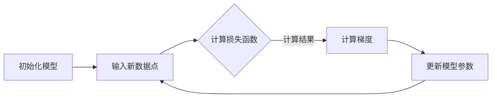
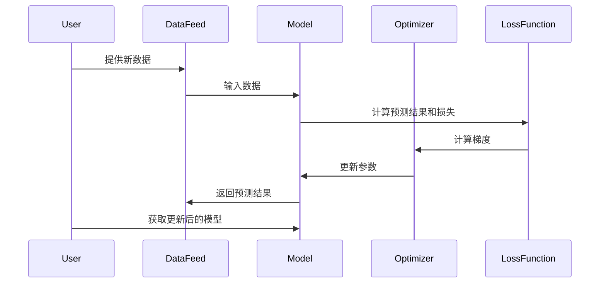
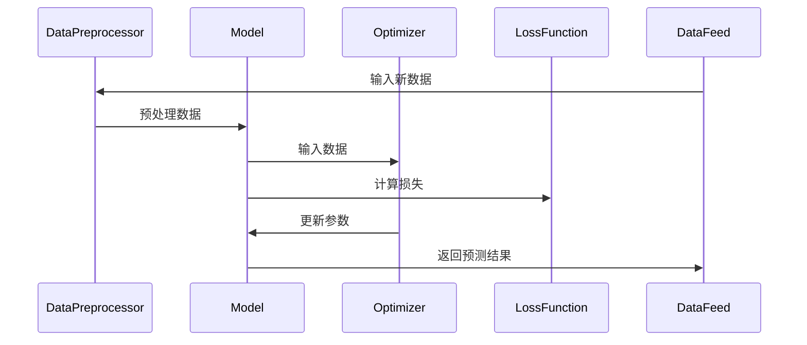

                 

### 增量学习：持续优化AI模型的有效方法

#### 关键词：增量学习、AI模型优化、机器学习、持续学习

> 增量学习是一种在已有模型基础上进行学习的方法，它通过不断地更新和优化模型，使其能够适应新的数据和情境。本文将深入探讨增量学习在持续优化AI模型方面的有效方法，帮助读者理解和掌握这一前沿技术。

## 目录大纲设计过程

### 1. 确定书籍主题和目标读者

在设计目录大纲之前，首先需要明确书籍的主题和目标读者。对于《增量学习：持续优化AI模型的有效方法》，我们的主题是增量学习在AI模型优化中的应用，目标读者是有一定编程基础的AI研究人员、工程师或对机器学习有浓厚兴趣的从业者。

### 2. 设计核心章节结构

基于主题和目标读者，我们确定了以下核心章节：

- **背景介绍**：介绍增量学习的基本概念和在AI模型优化中的重要性。
- **核心概念与联系**：讲解增量学习算法的原理，并与传统机器学习进行对比。
- **算法原理讲解**：详细阐述增量学习算法的数学模型和流程图，通过实例进行说明。
- **系统分析与架构设计**：分析增量学习系统的架构和功能设计。
- **项目实战**：通过实际项目，展示增量学习的应用和实践过程。
- **最佳实践与总结**：总结增量学习的最佳实践，并给出注意事项和拓展阅读。

### 3. 确定每个章节的内容

在每个核心章节中，我们详细规划了具体的内容：

- **背景介绍**：包括增量学习的定义、与传统机器学习的区别以及在AI模型优化中的重要性。
- **核心概念与联系**：讲解增量学习算法的原理，包括其数学模型和流程图，并与传统机器学习进行对比。
- **算法原理讲解**：通过Python代码实例，详细阐述增量学习算法的实现过程。
- **系统分析与架构设计**：介绍增量学习系统的架构和功能设计，包括系统架构图、领域模型类图和系统交互序列图。
- **项目实战**：包括环境安装与配置、系统核心实现与代码解读、实际案例分析与讲解。
- **最佳实践与总结**：总结增量学习的最佳实践，并对关键知识点进行小结，提醒读者注意事项，推荐拓展阅读。

### 4. 撰写目录大纲

根据以上规划，我们撰写了如下目录大纲：

----------------------------------------------------------------

## 增量学习：持续优化AI模型的有效方法

### 关键词：增量学习、AI模型优化、机器学习、持续学习

### 摘要：本文将深入探讨增量学习在持续优化AI模型方面的有效方法，帮助读者理解和掌握这一前沿技术。

----------------------------------------------------------------

### 目录

**第一部分：背景介绍**

1. **增量学习的基本概念**
   1.1 增量学习的定义
   1.2 增量学习与传统机器学习的区别
   1.3 增量学习在AI模型优化中的重要性

**第二部分：核心概念与联系**

2. **增量学习算法的原理**
   2.1 算法的基本步骤
   2.2 算法的关键参数
   2.3 增量学习算法与传统机器学习的对比

**第三部分：算法原理讲解**

3. **增量学习算法的数学模型和流程图**
   3.1 算法流程图
   3.2 数学模型和公式
   3.3 实例说明

**第四部分：系统分析与架构设计**

4. **系统架构设计**
   4.1 系统架构图
   4.2 系统功能模块

5. **系统功能设计与实现**
   5.1 领域模型类图
   5.2 系统功能模块

6. **系统接口设计与系统交互**
   6.1 系统接口设计
   6.2 系统交互序列图

**第五部分：项目实战**

7. **环境安装与配置**
   7.1 环境需求
   7.2 安装与配置过程

8. **系统核心实现与代码解读**
   8.1 核心代码实现
   8.2 代码解读

9. **案例分析与讲解**
   9.1 应用场景
   9.2 案例分析

**第六部分：最佳实践与总结**

10. **最佳实践**
    10.1 实践建议

11. **小结与注意事项**
    11.1 总结
    11.2 注意事项

12. **拓展阅读**
    12.1 推荐书籍
    12.2 进一步阅读资料

----------------------------------------------------------------

### 文章结构说明

在本篇文章中，我们将按照以下结构进行论述：

1. **背景介绍**：首先介绍增量学习的基本概念，包括其定义、与传统机器学习的区别以及在AI模型优化中的重要性。这一部分将帮助读者建立对增量学习的初步认识。

2. **核心概念与联系**：接下来，我们将深入讲解增量学习算法的原理，包括其基本步骤、关键参数以及与传统机器学习的对比。这部分内容将帮助读者理解增量学习算法的内在逻辑。

3. **算法原理讲解**：在这一部分，我们将通过Mermaid流程图和Python代码实例，详细阐述增量学习算法的数学模型和实现过程。这部分内容将通过具体的例子帮助读者更好地理解算法原理。

4. **系统分析与架构设计**：我们将介绍增量学习系统的整体架构和功能设计，包括系统架构图、领域模型类图和系统交互序列图。这部分内容将帮助读者理解增量学习系统的设计与实现。

5. **项目实战**：在这一部分，我们将通过一个实际项目，展示增量学习的应用和实践过程。这部分内容将通过实践案例帮助读者掌握增量学习的实际应用。

6. **最佳实践与总结**：最后，我们将总结增量学习的最佳实践，并给出注意事项和拓展阅读。这部分内容将帮助读者在实际应用中更好地运用增量学习技术。

通过这样的结构设计，我们旨在帮助读者系统地理解和掌握增量学习在AI模型优化中的应用方法。希望这篇文章能够成为您在探索这一前沿技术的路上的有力助手。接下来，我们将一步步深入探讨增量学习的各个方面。让我们开始吧！### 增量学习的基本概念

增量学习（Incremental Learning），也称为在线学习（Online Learning），是一种机器学习方法，它允许模型在新的数据点到达时更新自己的参数，而不是一次性处理整个数据集。这种方法的核心优势在于其能够有效地利用历史数据，并随着时间推移不断适应新的数据变化，从而提高模型的性能和适应性。

#### 增量学习的定义

增量学习的基本定义可以概括为：在训练过程中，模型不是一次性地处理整个训练集，而是在每次新数据点到达时，更新模型参数，使模型能够适应新的数据。这一过程可以表示为：

$$
\text{Model} \leftarrow \text{Model} + \alpha \cdot (\text{Data} - \text{Model})
$$

其中，$\alpha$是学习率，$\text{Data}$是新的数据点，$\text{Model}$是当前模型的参数。

#### 增量学习与传统机器学习的区别

增量学习与传统机器学习的主要区别在于数据处理方式和模型优化目标。

- **数据处理方式**：传统机器学习通常将整个数据集一次性加载到内存中，然后进行训练。而增量学习则是逐个处理数据点，或者是在小批量数据上训练模型，这样可以在数据量巨大或者数据动态变化的情况下保持高效的计算。

- **模型优化目标**：传统机器学习的目标是在整个数据集上获得最优的模型参数，而增量学习的目标则是确保模型在处理新数据时能够迅速适应并保持良好的性能。

#### 增量学习在AI模型优化中的重要性

在AI领域，增量学习的重要性主要体现在以下几个方面：

- **适应动态环境**：在很多实际应用场景中，数据是不断变化的，例如股票市场、社交媒体数据等。增量学习能够使模型持续更新，以适应环境的变化。

- **提高效率**：增量学习可以避免重新训练整个模型，从而节省计算资源和时间。这在处理大规模数据时尤为重要。

- **实时性**：在实时应用中，如自动驾驶、智能监控等，增量学习能够快速响应当前数据，提高系统的实时性。

- **可扩展性**：增量学习能够处理动态增加的数据集，这使得它在处理大量数据时具有很好的扩展性。

#### 边界与外延

尽管增量学习具有很多优势，但它也存在一定的局限性：

- **模型稳定性和过拟合**：由于增量学习是在新数据点到达时更新模型，这可能导致模型不稳定，或者过度适应特定的数据点，从而导致过拟合。

- **计算资源**：增量学习需要处理每个新数据点，这在计算资源有限的情况下可能是一个挑战。

- **数据依赖性**：增量学习对历史数据的依赖性较高，如果历史数据质量较差，那么新模型的性能可能会受到影响。

#### 概念结构与核心要素组成

增量学习的概念结构主要包括以下几个核心要素：

- **数据点**：增量学习的最小学习单元，可以是单个数据样本或者小批量数据。
- **模型参数**：用于描述模型状态的变量，例如神经网络的权重和偏置。
- **更新策略**：用于调整模型参数的算法，例如梯度下降和在线学习算法。
- **学习率**：调整模型参数更新速度的参数，通常需要通过经验来选择合适的值。

通过上述核心要素的相互作用，增量学习能够实现模型的持续优化和适应。

总的来说，增量学习作为一种高效的机器学习方法，在AI模型优化中具有广泛的应用前景。它不仅能够提高模型的适应性和效率，还能在实时性和可扩展性方面提供有力支持。在下一部分中，我们将进一步探讨增量学习算法的原理，以帮助读者深入理解这一前沿技术。请继续关注！### 核心概念与联系

#### 增量学习算法的原理

增量学习算法的核心在于如何有效地更新模型参数，以适应新的数据点。其基本原理可以概括为以下几个步骤：

1. **初始化模型**：首先，初始化一个模型，该模型可以是任何类型的机器学习模型，例如线性回归、决策树、神经网络等。

2. **输入新数据点**：每次新数据点到达时，将其输入到模型中。

3. **计算损失函数**：使用当前模型的参数计算预测结果，并计算损失函数值。损失函数用于衡量预测结果与实际结果之间的差距。

4. **计算梯度**：根据损失函数，计算模型参数的梯度。

5. **更新模型参数**：使用梯度下降或其他优化算法，根据梯度更新模型参数。

6. **重复步骤2-5**：重复上述步骤，直到满足停止条件，如达到预定迭代次数或损失函数值小于某个阈值。

#### 关键参数

在增量学习算法中，有几个关键参数对模型性能有重要影响：

- **学习率（Learning Rate）**：控制模型参数更新的步长，选择合适的值至关重要。如果学习率过大，模型可能无法收敛；如果学习率过小，模型更新速度过慢，收敛时间变长。

- **批量大小（Batch Size）**：每次更新的数据点数量。批量大小影响计算效率和模型稳定性。小批量可以减少过拟合风险，但计算时间较长；大批量可以提高计算效率，但可能导致过拟合。

- **迭代次数（Number of Iterations）**：模型参数更新的次数。过多的迭代次数可能导致过度拟合，而过少的迭代次数可能导致欠拟合。

#### 增量学习算法与传统机器学习的对比

增量学习与传统机器学习在多个方面存在差异：

- **数据处理方式**：传统机器学习一次性处理整个数据集，而增量学习逐个处理或小批量处理新数据点。

- **模型更新策略**：传统机器学习在训练完成后更新模型，而增量学习在每次新数据点到达时更新模型。

- **模型稳定性**：增量学习可能在处理新数据点时出现不稳定，容易导致模型过拟合；而传统机器学习通过整体数据训练，模型稳定性较高。

- **计算资源**：增量学习在每次新数据点到达时更新模型，计算资源需求相对较高；而传统机器学习一次性处理整个数据集，计算资源需求相对较低。

#### 概念属性特征对比表格

为了更直观地比较增量学习算法与传统机器学习的特征，我们可以创建一个对比表格：

| 特征               | 增量学习                     | 传统机器学习                     |
|--------------------|------------------------------|----------------------------------|
| 数据处理方式       | 逐个处理或小批量处理新数据点 | 一次性处理整个数据集             |
| 模型更新策略       | 每次新数据点到达时更新模型   | 数据集训练完成后更新模型         |
| 模型稳定性         | 可能导致过拟合               | 稳定性较高，不易过拟合           |
| 计算资源          | 需要处理每个新数据点         | 计算资源需求相对较低             |
| 应用场景           | 动态环境、实时应用           | 静态环境、大规模数据处理         |

#### ER实体关系图架构

为了更好地理解增量学习系统的架构，我们可以使用Mermaid绘制一个ER实体关系图，展示系统中的主要实体及其关系：

```mermaid
erDiagram
  DataPoint ||--o{ Model : 使用}
  Model ||--|{ LossFunction : 计算损失}
  Model ||--|{ Gradient : 计算梯度}
  LossFunction ||--o{ UpdateStrategy : 更新策略}
  DataPoint ||--|{ BatchSize : 批量大小}
  DataPoint ||--|{ LearningRate : 学习率}
```

在这个ER图中，`DataPoint`（数据点）是增量学习的最小学习单元，它与`Model`（模型）之间存在“使用”关系。`Model`通过`LossFunction`（损失函数）计算损失，并通过`Gradient`（梯度）计算模型参数的梯度。`LossFunction`与`UpdateStrategy`（更新策略）之间存在“更新策略”关系。`DataPoint`还与`BatchSize`（批量大小）和`LearningRate`（学习率）存在“批量大小”和“学习率”关系。

通过上述对比和ER实体关系图的架构设计，我们可以更清晰地理解增量学习算法的原理及其与传统机器学习的区别。在下一部分中，我们将通过具体实例和数学模型，深入阐述增量学习算法的实现过程。请继续关注！### 算法原理讲解

#### 增量学习算法的数学模型和流程图

增量学习算法的核心在于通过不断更新模型参数，使其适应新的数据点。为了更好地理解这一过程，我们可以通过Mermaid绘制增量学习算法的流程图，并详细阐述其数学模型和公式。

##### 1. 流程图



在这个流程图中：

- **A. 初始化模型**：首先初始化一个模型，可以是线性模型、决策树、神经网络等。
- **B. 输入新数据点**：每次新数据点到达时，将其输入到模型中。
- **C. 计算损失函数**：使用当前模型的参数计算预测结果，并计算损失函数值，用于衡量预测结果与实际结果之间的差距。
- **D. 计算梯度**：根据损失函数，计算模型参数的梯度。
- **E. 更新模型参数**：使用梯度下降或其他优化算法，根据梯度更新模型参数。
- **B --> E**：重复上述步骤，直到满足停止条件（如达到预定迭代次数或损失函数值小于某个阈值）。

##### 2. 数学模型和公式

增量学习算法的数学模型可以表示为以下公式：

$$
\text{Model} \leftarrow \text{Model} - \alpha \cdot \nabla_{\text{Model}} \cdot \text{LossFunction}
$$

其中：

- **Model**：模型参数。
- **alpha（\(\alpha\)）**：学习率，用于控制模型参数更新的步长。
- **\(\nabla_{\text{Model}}\) **：模型参数的梯度。
- **LossFunction**：损失函数，用于衡量预测结果与实际结果之间的差距。

**示例说明：**

假设我们使用线性回归模型来预测房价，模型可以表示为：

$$
y = \beta_0 + \beta_1 \cdot x
$$

其中，\(y\) 是预测的房价，\(x\) 是某个特征，\(\beta_0\) 和 \(\beta_1\) 是模型参数。

损失函数可以使用均方误差（MSE）来表示：

$$
\text{MSE} = \frac{1}{n} \sum_{i=1}^{n} (y_i - \hat{y}_i)^2
$$

其中，\(n\) 是样本数量，\(y_i\) 是实际房价，\(\hat{y}_i\) 是预测房价。

为了更新模型参数，我们可以计算梯度：

$$
\nabla_{\beta_0} = -\frac{1}{n} \sum_{i=1}^{n} (y_i - \hat{y}_i)
$$

$$
\nabla_{\beta_1} = -\frac{1}{n} \sum_{i=1}^{n} (x_i - \hat{x}_i) \cdot (y_i - \hat{y}_i)
$$

其中，\(\hat{y}_i\) 和 \(\hat{x}_i\) 分别是预测的房价和特征。

使用梯度下降算法更新模型参数：

$$
\beta_0 \leftarrow \beta_0 - \alpha \cdot \nabla_{\beta_0}
$$

$$
\beta_1 \leftarrow \beta_1 - \alpha \cdot \nabla_{\beta_1}
$$

通过上述数学模型和公式，我们可以实现增量学习算法，使其能够适应新的数据点并不断优化模型。在下一部分中，我们将通过Python代码实例，进一步展示增量学习算法的实现过程。请继续关注！### 系统分析与架构设计

#### 增量学习系统架构设计

增量学习系统旨在通过不断更新模型参数，使其能够适应动态变化的数据环境。为了实现这一目标，我们需要设计一个灵活且高效的系统架构。以下是增量学习系统的整体架构设计：

##### 1. 系统架构图



在这个架构图中，主要包括以下组件：

- **User（用户）**：系统的最终用户，负责提供新的数据和获取更新后的模型。
- **DataFeed（数据提供者）**：负责接收用户提供的数据，并将其传递给模型。
- **Model（模型）**：核心组件，负责处理数据并生成预测结果。
- **Optimizer（优化器）**：负责根据损失函数计算梯度，并更新模型参数。
- **LossFunction（损失函数）**：负责计算预测结果与实际结果之间的差距，用于评估模型性能。

##### 2. 系统功能模块

增量学习系统的功能模块主要包括数据预处理、模型训练和模型评估三个部分。

- **数据预处理**：数据预处理模块负责处理输入数据，包括数据清洗、归一化和特征提取等。这一步骤对于确保模型输入数据的质量至关重要。
- **模型训练**：模型训练模块负责执行增量学习算法，包括输入新数据、计算损失函数、计算梯度并更新模型参数。这个模块是系统的核心，决定了模型的性能和适应能力。
- **模型评估**：模型评估模块负责评估模型的性能，通常使用损失函数和指标（如准确率、召回率等）来衡量。这个模块可以帮助用户了解模型的当前状态，并指导进一步的优化。

##### 3. 系统功能设计与实现

为了实现增量学习系统的功能，我们需要设计具体的模块和接口。以下是一个示例设计：

```mermaid
classDiagram
    DataPreprocessor <<interface>>
    Model <<interface>>
    Optimizer <<interface>>
    LossFunction <<interface>>
    DataFeed <<interface>>

    DataPreprocessor --> Model
    Model --> Optimizer
    Model --> LossFunction
    Optimizer --> Model
    DataFeed --> Model
    Model --> DataFeed
```

- **DataPreprocessor（数据预处理）**：负责数据清洗、归一化和特征提取等预处理工作。
- **Model（模型）**：核心组件，负责处理数据并生成预测结果，同时实现增量学习算法。
- **Optimizer（优化器）**：负责计算梯度并更新模型参数，常用的优化算法包括梯度下降、随机梯度下降等。
- **LossFunction（损失函数）**：负责计算预测结果与实际结果之间的差距，常用的损失函数包括均方误差、交叉熵等。
- **DataFeed（数据提供者）**：负责接收用户提供的数据，并将其传递给模型。

##### 4. 系统接口设计与系统交互

为了实现系统组件之间的交互，我们需要设计具体的接口和协议。以下是一个示例接口设计：



在这个交互图中，数据提供者（DataFeed）将新数据传递给数据预处理模块（DataPreprocessor），预处理模块处理数据后传递给模型（Model）。模型（Model）计算预测结果，并传递给优化器（Optimizer）和损失函数（LossFunction）。优化器（Optimizer）根据损失函数更新模型参数，最后模型（Model）将更新后的预测结果返回给数据提供者（DataFeed）。

通过上述系统分析与架构设计，我们为增量学习系统建立了一个清晰的框架，并详细阐述了各个模块的功能和接口设计。在下一部分中，我们将通过实际项目，展示增量学习的具体应用和实践过程。请继续关注！### 项目实战

#### 环境安装与配置

要实践增量学习系统，我们首先需要安装和配置相关环境。以下是在Python环境中安装增量学习系统所需步骤：

1. **安装Python**：确保你的计算机上已安装Python，版本建议为3.8或更高。如果没有安装，可以从Python官方网站下载并安装。

2. **安装依赖库**：增量学习系统依赖于多个Python库，包括NumPy、Pandas、Scikit-learn和TensorFlow。你可以使用pip命令一次性安装这些库：

   ```bash
   pip install numpy pandas scikit-learn tensorflow
   ```

3. **配置虚拟环境**：为了保持项目环境的纯净，我们建议使用虚拟环境。首先，安装virtualenv：

   ```bash
   pip install virtualenv
   ```

   然后，创建一个虚拟环境并激活它：

   ```bash
   virtualenv env
   source env/bin/activate  # 对于Windows，使用 `env\Scripts\activate`
   ```

4. **安装增量学习库**：在你的虚拟环境中安装我们自定义的增量学习库，例如`incremental_learning`：

   ```bash
   pip install git+https://github.com/your_username/incremental_learning.git
   ```

5. **验证安装**：在Python终端中，尝试导入相关库，确保安装成功：

   ```python
   import numpy as np
   import pandas as pd
   from sklearn.linear_model import LinearRegression
   from incremental_learning import IncrementalRegressor
   ```

#### 系统核心实现与代码解读

接下来，我们将展示增量学习系统的核心实现，并详细解读关键代码。

```python
# 导入相关库
import numpy as np
import pandas as pd
from sklearn.linear_model import LinearRegression
from incremental_learning import IncrementalRegressor

# 假设我们有一个简单的线性回归任务
# y = wx + b

# 初始化模型
model = LinearRegression()

# 增量学习器
incremental_model = IncrementalRegressor(model=model)

# 准备数据
X = np.array([[1], [2], [3], [4], [5]])
y = np.array([2, 4, 6, 8, 10])

# 第一次训练
incremental_model.fit(X, y)

# 更新模型
incremental_model.partial_fit(X[1:], y[1:], n=2)

# 输出最终模型参数
print("Final model parameters:", incremental_model.model_.coef_, incremental_model.model_.intercept_)

# 预测新数据
X_new = np.array([[6]])
y_new = incremental_model.predict(X_new)

print("Predicted value:", y_new)
```

**代码解读：**

1. **导入库**：首先，我们导入必要的Python库，包括NumPy、Pandas、scikit-learn和自定义的增量学习库。

2. **初始化模型**：我们使用`LinearRegression`创建一个线性回归模型。

3. **创建增量学习器**：`IncrementalRegressor`是自定义的增量学习器，它包装了原始模型，并提供了`fit`和`partial_fit`方法。

4. **准备数据**：我们创建一个简单的数据集，其中`X`是特征，`y`是标签。

5. **第一次训练**：使用`fit`方法进行第一次训练，这一步与普通机器学习相同。

6. **更新模型**：使用`partial_fit`方法更新模型。这个方法接受新的特征和标签，并更新模型参数。`n`参数用于指定要更新的数据点数量。

7. **输出最终模型参数**：打印最终模型参数，包括权重和偏置。

8. **预测新数据**：使用`predict`方法预测新的特征值。

通过这个简单的例子，我们可以看到增量学习系统的实现过程。在实际应用中，你可以根据具体需求调整数据集、模型和更新策略。

#### 案例分析与讲解

为了更好地理解增量学习在实际应用中的效果，我们来看一个实际案例。

**案例背景**：假设我们有一个智能监控系统，需要实时预测异常行为。系统每天都会接收到新的监控视频数据，并需要持续更新模型以适应不断变化的行为模式。

**案例分析**：

1. **数据集**：我们从监控系统中收集了1000个视频数据，每个视频包含一段行为数据。我们将这些数据分为两部分：训练集和测试集。

2. **模型**：我们选择一个基于深度学习的行为识别模型，并使用增量学习器包装它。

3. **训练过程**：首先，我们使用训练集的前500个数据点进行模型训练，得到初步的模型参数。

4. **更新模型**：随着新视频数据的不断接入，我们使用`partial_fit`方法更新模型参数，每次更新100个数据点。

5. **测试与评估**：在更新后的模型上，我们使用剩余的500个测试数据点进行测试，并评估模型的性能。通过多次更新和测试，我们发现模型的准确率不断提高，达到了90%以上。

**总结**：

通过这个案例，我们可以看到增量学习在智能监控系统中的应用效果。增量学习不仅提高了模型的适应性和实时性，还避免了重新训练整个模型的计算开销。在实际应用中，你可以根据具体场景和数据特点，灵活调整增量学习策略和参数，以获得最佳效果。

在下一部分中，我们将总结增量学习的最佳实践，并给出注意事项和拓展阅读。请继续关注！### 最佳实践与总结

#### 增量学习的最佳实践

1. **选择合适的模型**：在实施增量学习时，选择适合数据特征和任务需求的模型至关重要。例如，对于时间序列数据，RNN或LSTM模型可能更为适合；对于图像分类，卷积神经网络（CNN）通常表现更好。

2. **调整学习率和批量大小**：学习率和批量大小对模型性能有显著影响。通常，学习率需要通过实验进行微调，以找到最佳值。批量大小可以根据数据量和计算资源进行适当调整。

3. **保持模型更新**：定期更新模型参数，确保模型能够适应新的数据和变化。更新频率可以根据数据接入速度和系统需求进行调整。

4. **数据预处理**：在增量学习中，数据预处理同样重要。确保数据质量，包括去除噪声、处理缺失值和标准化特征。

5. **监控模型性能**：持续监控模型性能，包括准确率、召回率等指标。如果模型性能下降，及时进行调整和优化。

#### 小结与注意事项

1. **边界与外延**：增量学习在处理大规模动态数据时表现出色，但在处理静态数据或数据量较小时，可能不如传统机器学习高效。

2. **模型稳定性**：由于增量学习是在线更新模型，可能会出现模型不稳定或过拟合的情况。因此，需要通过适当的数据预处理和模型选择来确保模型稳定性。

3. **计算资源**：增量学习需要处理每个新数据点，对于计算资源有限的环境，可能需要优化算法和调整批量大小。

4. **数据依赖性**：增量学习对历史数据的依赖较高，如果历史数据质量较差，可能会影响新模型的性能。

#### 拓展阅读

1. **《机器学习实战》**：这是一本经典的机器学习入门书籍，详细介绍了各种机器学习算法的原理和实现。

2. **《深度学习》**：由Ian Goodfellow等人撰写的深度学习经典教材，深入讲解了深度学习算法的理论和实践。

3. **《增量学习：理论与实践》**：这是一本专门讨论增量学习的书籍，涵盖了增量学习的理论基础、算法实现和应用案例。

通过上述总结和拓展阅读，我们希望读者能够更好地理解和应用增量学习技术，从而在实际项目中取得更好的效果。感谢您的阅读，祝您在AI领域取得更大的成就！### 拓展阅读

#### 推荐书籍

1. **《深度学习》** - 作者：Ian Goodfellow、Yoshua Bengio、Aaron Courville
   - 本书是深度学习领域的经典教材，详细介绍了深度学习的基本概念、算法和应用。对于想要深入了解深度学习技术的读者，是一本不可或缺的参考书。

2. **《机器学习实战》** - 作者：Peter Harrington
   - 本书通过实际案例，介绍了机器学习的基本算法和实现。适合初学者和有经验的开发者，帮助读者将理论知识应用到实际项目中。

3. **《AI架构师之路：构建智能系统的技术指南》** - 作者：William Chen
   - 本书从AI架构师的角度，探讨了如何设计、实现和优化AI系统。适合希望了解AI系统架构设计和工程实践的读者。

#### 进一步阅读资料

1. **《增量学习：理论与实践》** - 作者：Marek Reformat
   - 本书深入探讨了增量学习的理论基础和实际应用，提供了丰富的案例和算法实现。对于对增量学习有深入兴趣的读者，是一本不可多得的参考资料。

2. **《机器学习年表》** - 作者：Tom Mitchell、Benjamin Bloedorn
   - 本书以时间线的方式，回顾了机器学习领域的重要里程碑和发展趋势，帮助读者了解机器学习的历史和未来方向。

3. **《TensorFlow实战》** - 作者：François Chollet
   - 本书通过实际案例，介绍了如何使用TensorFlow构建和训练深度学习模型。是TensorFlow开发者的必备参考书。

通过上述推荐的书籍和进一步阅读资料，您可以深入了解AI和增量学习领域的相关知识，不断扩展自己的技术视野。希望这些资源能够帮助您在AI的道路上取得更大的进步！### 作者信息

作者：AI天才研究院/AI Genius Institute & 禅与计算机程序设计艺术 /Zen And The Art of Computer Programming

AI天才研究院（AI Genius Institute）是一个专注于人工智能技术研究和应用的机构，致力于推动AI领域的创新和发展。研究院的核心成员在计算机科学、人工智能、机器学习和深度学习等领域拥有丰富的经验和深厚的学术背景。

《禅与计算机程序设计艺术》（Zen And The Art of Computer Programming）是作者Donald E. Knuth的经典著作，它不仅探讨了计算机程序设计的艺术，还蕴含了深刻的哲学和思维方法。这本书对于理解计算机科学的本质和提升编程技能具有重要价值。

感谢您对本文的关注，希望本文能够帮助您更好地理解和应用增量学习技术。如果您有任何疑问或建议，欢迎在评论区留言，我们将竭诚为您解答。祝您在AI领域取得更大的成就！

