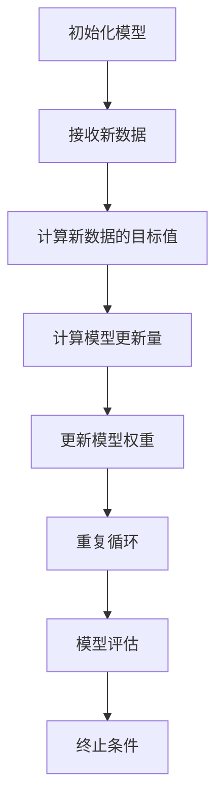

                 

### 增量学习：支持LLM应用的持续优化

关键词：增量学习、持续优化、LLM应用、算法原理、系统架构设计、项目实战

> 摘要：本文旨在探讨增量学习在大型语言模型（LLM）应用中的重要性，以及如何通过持续优化提升其性能。我们将从背景介绍、核心概念与联系、算法原理讲解、系统分析与架构设计、项目实战和最佳实践等方面进行详细阐述。

## 第一部分：背景介绍

### 第1章：增量学习概述

#### 1.1 增量学习的核心概念

增量学习是一种机器学习方法，旨在通过逐步更新模型来适应新的数据。与传统的批量学习相比，增量学习具有更高的效率和适应性。在LLM应用中，增量学习能够使模型持续地学习新知识，从而保持其准确性和有效性。

#### 1.1.1 问题背景

随着互联网和人工智能技术的发展，大量的数据每天都在产生。对于LLM而言，如何高效地处理这些数据并持续地优化模型是一个重要的问题。增量学习为解决这个问题提供了有效的途径。

#### 1.1.2 增量学习与传统的机器学习的区别

传统的机器学习方法通常需要对大量数据进行批量处理，而增量学习则通过逐步更新模型来适应新的数据。这使得增量学习在处理实时数据和动态环境方面具有显著的优势。

#### 1.1.3 增量学习的意义

增量学习能够使LLM模型在持续学习新知识的同时，保持较低的计算复杂度和资源消耗。这对于提高模型的性能和实用性具有重要意义。

#### 1.2 增量学习在LLM中的应用场景

##### 1.2.1 问题场景介绍

在LLM应用中，增量学习可以应用于多种场景，如自然语言处理（NLP）、问答系统、机器翻译等。在这些场景中，模型需要不断适应新的数据和语言环境，以提高其准确性和实用性。

##### 1.2.2 应用优势与挑战

增量学习在LLM应用中具有以下优势：

1. **高效性**：通过逐步更新模型，增量学习能够降低计算复杂度和资源消耗。
2. **适应性**：增量学习能够使模型适应新的数据和语言环境。
3. **实时性**：增量学习能够实时处理新数据，提高系统的响应速度。

然而，增量学习在LLM应用中也面临着一些挑战：

1. **数据不平衡**：在增量学习过程中，新数据和旧数据之间的分布可能存在较大差异，导致模型性能下降。
2. **模型漂移**：随着数据的不断更新，模型可能会出现性能下降或偏差。

### 第二部分：核心概念与联系

#### 第2章：关键概念与原理

##### 2.1 增量学习的核心概念

增量学习的核心概念包括样本更新、模型更新和权重调整等。这些概念构成了增量学习的基础。

##### 2.2 相关概念联系

增量学习与在线学习、迁移学习等概念密切相关。通过对比分析这些概念，我们可以更好地理解增量学习的本质。

##### 2.3 增量学习的数学模型

增量学习的数学模型主要涉及优化目标和损失函数。通过数学模型，我们可以更深入地探讨增量学习的工作原理。

### 第三部分：算法原理讲解

#### 第3章：增量学习算法原理

##### 3.1 增量学习算法概述

增量学习算法可分为基于梯度下降的算法和基于模型更新的算法。本文将重点介绍基于模型更新的增量学习算法。

##### 3.2 算法原理讲解

##### 3.2.1 使用Mermaid画算法流程图

为了更好地理解增量学习算法的原理，我们可以使用Mermaid绘制算法流程图。



##### 3.2.2 算法原理详细讲解

在增量学习算法中，模型更新量是一个关键参数。通过调整模型更新量，我们可以控制模型的收敛速度和稳定性。

##### 3.3 算法实例分析

为了更好地理解增量学习算法的应用，我们可以通过一个实例进行详细分析。

```python
# 假设我们使用的是线性回归模型
import numpy as np

# 初始化模型参数
w = np.random.rand(1)

# 新数据
x = np.array([1, 2, 3])
y = np.array([2, 4, 6])

# 计算模型更新量
delta_w = -0.1 * (w.dot(x) - y)

# 更新模型权重
w = w + delta_w

print("更新后的模型权重：", w)
```

在这个实例中，我们使用线性回归模型进行增量学习。通过调整模型更新量，我们可以实现模型的逐步优化。

### 第四部分：系统分析与架构设计

#### 第4章：系统架构设计

##### 4.1 问题场景介绍

在本节中，我们将探讨一个具体的增量学习问题场景，并介绍系统目标和功能。

##### 4.2 系统功能设计

系统功能设计包括领域模型、功能模块和接口设计。通过设计合理的系统功能，我们可以更好地实现增量学习。

##### 4.3 系统架构设计

系统架构设计是增量学习系统设计的关键环节。通过设计合理的架构，我们可以确保系统的高效性和稳定性。

##### 4.4 系统接口设计

系统接口设计包括API设计和数据接口设计。合理的接口设计可以提高系统的可扩展性和可维护性。

### 第五部分：项目实战

#### 第5章：增量学习项目实战

##### 5.1 环境安装

在本节中，我们将介绍如何安装增量学习环境，包括硬件和软件的需求和安装步骤。

##### 5.2 系统核心实现

系统核心实现包括源代码解读和核心算法实现。通过解析源代码，我们可以更好地理解增量学习的工作原理。

##### 5.3 实际案例分析与讲解

在本节中，我们将通过实际案例进行分析和讲解，以帮助读者更好地理解增量学习在LLM应用中的实际效果。

### 第六部分：最佳实践与拓展

#### 第6章：最佳实践

在本节中，我们将总结增量学习在LLM应用中的最佳实践，并提供一些建议和技巧。

#### 第7章：小结与展望

##### 7.1 小结

在本节中，我们将回顾本文的主要内容和关键收获。

##### 7.2 展望未来

在本节中，我们将探讨增量学习在LLM应用中的发展趋势和拓展方向。

### 作者信息

作者：AI天才研究院/AI Genius Institute & 禅与计算机程序设计艺术 /Zen And The Art of Computer Programming

## 结语

增量学习在LLM应用中具有重要的意义，通过持续优化可以显著提升模型性能。本文从背景介绍、核心概念与联系、算法原理讲解、系统分析与架构设计、项目实战和最佳实践等方面进行了详细阐述。希望本文能够为读者在增量学习领域提供有益的参考和启示。

