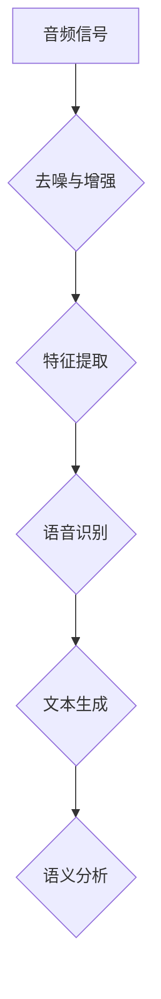
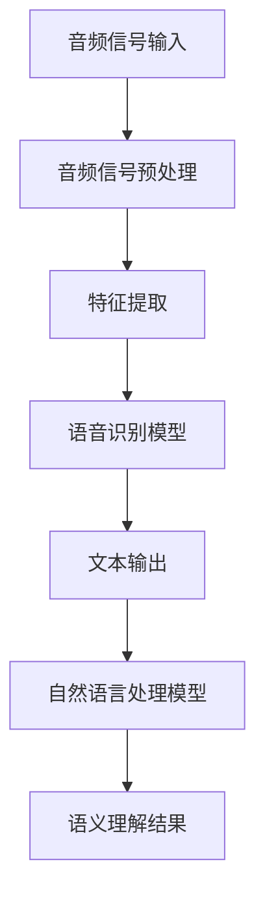
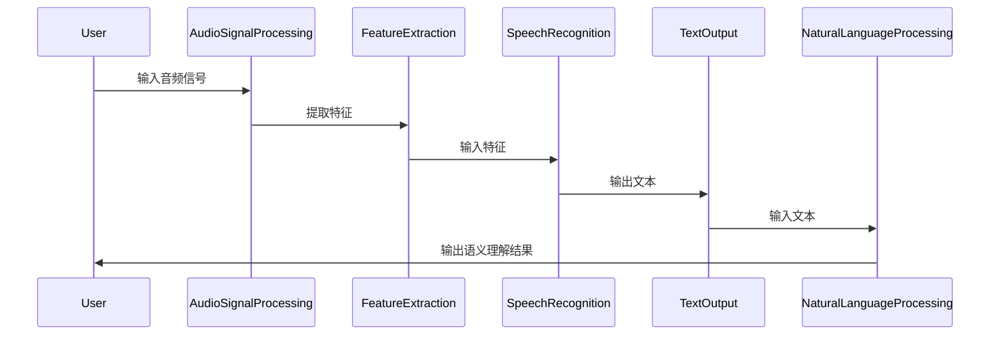

                 

# 声音场景理解：测试LLM处理复杂音频信息的能力

## 关键词

声音场景理解、深度学习语言模型、音频信息处理、语音识别、自然语言处理、算法优化

## 摘要

随着语音识别和自然语言处理技术的不断发展，声音场景理解作为一种高级语音处理技术，正逐渐成为智能语音助手、音频监控和语音交互等领域的核心技术。本文主要探讨了如何利用深度学习语言模型（LLM）来提升对复杂音频信息的处理能力。文章首先介绍了声音场景理解的基本概念和问题背景，然后详细阐述了LLM的基础知识以及在音频信息处理中的应用，接着分析了声音场景理解的核心概念原理和联系，最后深入讲解了LLM处理复杂音频信息的算法原理以及项目实战，通过具体案例展示了声音场景理解在实际应用中的效果。

## 第1章: 背景介绍

### 1.1 问题背景

在数字化和智能化的今天，音频信息处理已成为信息技术领域的重要研究方向。声音场景理解作为一种高级语音处理技术，旨在识别和解析语音信号中的场景内容，这对于提升智能语音助手、音频监控和语音交互等应用的服务质量具有重要意义。然而，现有的语音处理技术主要关注语音信号本身，对于语音信号所蕴含的复杂场景信息处理能力不足。

### 1.2 问题描述

本文旨在探讨如何通过深度学习语言模型（LLM）来提升对复杂音频信息的处理能力。具体来说，研究内容包括：如何构建适用于声音场景理解的LLM模型，如何利用LLM进行音频信息的解析和分类，以及如何优化LLM模型以适应实际应用场景。

### 1.3 问题解决

解决这一问题的关键在于设计和实现一个既能理解文本语义，又能处理音频信号的深度学习模型。通过结合语音识别和自然语言处理技术，可以将音频信号转化为文本，再由LLM模型对文本进行语义分析，从而实现对声音场景的理解。

### 1.4 边界与外延

声音场景理解的应用范围广泛，包括但不限于智能家居、智能安防、医疗诊断、媒体内容审核等。然而，本文主要关注的是如何在测试中评估LLM处理复杂音频信息的能力，以及如何通过算法优化和模型改进来提升这一能力。

### 1.5 概念结构与核心要素组成

- **声音场景理解**：指通过语音识别和自然语言处理技术，将语音信号中的场景内容进行识别和分析。
- **深度学习语言模型（LLM）**：一种基于深度神经网络的模型，用于处理自然语言文本。
- **音频信息处理**：指对音频信号进行预处理、特征提取和分类的过程。

## 第2章: 声音场景理解与LLM的基础知识

### 2.1 声音场景理解的概念

声音场景理解是一种将音频信号转换为语义信息的技术，旨在识别语音信号中的场景内容。其基本原理包括语音信号处理、语音识别和自然语言处理。

### 2.2 LLM的基础知识

深度学习语言模型（LLM）是一种基于深度神经网络的模型，它能够理解和生成自然语言文本。LLM的核心组件包括编码器和解码器，通过端到端训练可以实现对文本的语义理解。

### 2.3 LLM在音频信息处理中的应用

LLM在音频信息处理中的应用主要包括两个方面：一是通过语音识别将音频信号转换为文本，二是通过自然语言处理对文本进行语义分析。

## 第3章: 声音场景理解的核心概念原理与联系

### 3.1 声音场景理解的核心概念

- **音频信号处理**：对音频信号进行预处理，包括去噪、增强等。
- **语音识别**：将音频信号转换为文本。
- **自然语言处理**：对文本进行语义分析和理解。

### 3.2 概念属性特征对比表格

| 概念             | 属性特征                                           |
|------------------|----------------------------------------------------|
| 音频信号处理     | 去噪、增强、特征提取等                             |
| 语音识别         | 字符级识别、词汇识别、句子级识别等                 |
| 自然语言处理     | 语义理解、文本生成、情感分析等                     |

### 3.3 声音场景理解的ER实体关系图

```mermaid
erDiagram
  AudioSignalProcessing ||--|{ SpeechRecognition }|-- AudioInformationProcessing
  AudioInformationProcessing ||--|{ NaturalLanguageProcessing }|-- SceneUnderstanding
```

## 第4章: LLM处理复杂音频信息的算法原理讲解

### 4.1 算法原理

声音场景理解算法的核心是LLM，其工作原理可以分为三个阶段：音频信号处理、语音识别和自然语言处理。

1. **音频信号处理**：利用深度神经网络进行去噪和增强，提取音频特征。
2. **语音识别**：将音频特征输入到语音识别模型中，输出文本。
3. **自然语言处理**：将文本输入到LLM模型中，进行语义分析和理解。

### 4.2 算法流程图



### 4.3 算法详细讲解

#### 音频信号处理

音频信号处理是声音场景理解的基础。在这一阶段，我们需要对原始音频信号进行预处理，包括去噪和增强。

- **去噪**：由于环境噪声的存在，原始音频信号可能包含大量无关信息。去噪的目的是通过滤波或其他方法去除噪声，提高信号质量。

  去噪的数学模型可以表示为：
  $$ y(t) = x(t) + n(t) $$
  其中，$x(t)$表示原始音频信号，$n(t)$表示噪声，$y(t)$表示去噪后的音频信号。

  常用的去噪方法包括：
  - 傅里叶变换（Fourier Transform）：通过傅里叶变换将时域信号转换为频域信号，然后对频域信号进行滤波，最后通过逆傅里叶变换恢复时域信号。
  - 小波变换（Wavelet Transform）：通过小波变换将时域信号分解为不同尺度和位置的细节信号，然后对细节信号进行滤波，最后通过逆小波变换恢复时域信号。

- **增强**：增强的目的是提高音频信号中关键信息的可识别性。

  增强的数学模型可以表示为：
  $$ y(t) = x(t) \cdot f(x(t)) $$
  其中，$x(t)$表示原始音频信号，$f(x(t))$表示增强函数。

  常用的增强方法包括：
  - 频率增强：通过调整音频信号的频率成分来增强关键信息。
  - 时间增强：通过调整音频信号的时间长度来增强关键信息。

#### 语音识别

语音识别是将音频信号转换为文本的过程。在这一阶段，我们需要对去噪和增强后的音频信号进行特征提取，并将特征输入到语音识别模型中进行文本生成。

- **特征提取**：特征提取是将音频信号转换为可用于机器学习模型处理的数据的过程。常用的特征提取方法包括：
  - MFCC（梅尔频率倒谱系数）：MFCC是一种广泛应用于语音识别的特征提取方法，它通过计算音频信号的频谱特征来表示语音信号。
  - 声谱图：声谱图是一种可视化的特征表示方法，它通过将音频信号的能量分布表示为二维图像。

- **语音识别模型**：语音识别模型是一种基于机器学习的模型，它能够将特征向量映射到相应的文本输出。常用的语音识别模型包括：
  - HMM（隐马尔可夫模型）：HMM是一种概率模型，用于对语音信号进行序列建模。
  - RNN（循环神经网络）：RNN是一种能够处理序列数据的神经网络，它在语音识别领域取得了很好的效果。
  - Transformer：Transformer是一种基于自注意力机制的深度学习模型，它在语音识别领域也取得了显著的性能提升。

#### 自然语言处理

自然语言处理是将文本转换为语义信息的过程。在这一阶段，我们需要将语音识别模型输出的文本输入到LLM模型中进行语义分析和理解。

- **语义分析**：语义分析是自然语言处理的核心任务之一，它旨在理解文本中的语义信息。常用的语义分析方法包括：
  - 词向量：词向量是一种将单词映射到高维空间的方法，它通过计算词与词之间的相似度来进行语义分析。
  - 依存句法分析：依存句法分析是一种分析句子中词语之间的依赖关系的方法，它有助于理解句子的语义结构。

- **LLM模型**：LLM模型是一种能够处理自然语言文本的深度学习模型，它通过端到端训练可以实现对文本的语义理解。常用的LLM模型包括：
  - GPT（Generative Pre-trained Transformer）：GPT是一种基于Transformer架构的预训练模型，它在自然语言处理领域取得了很好的效果。
  - BERT（Bidirectional Encoder Representations from Transformers）：BERT是一种基于Transformer架构的双向编码表示模型，它在语义理解任务中表现优异。

### 4.4 举例说明

假设我们有一个音频信号，其中包含一段对话：“请问您今天去哪儿了？”。通过上述算法，我们可以将其处理为文本输出：“请问您今天去哪儿了？”。

- **音频信号处理**：首先对音频信号进行去噪和增强，得到去噪增强后的音频信号。
- **语音识别**：将去噪增强后的音频信号进行特征提取，得到特征向量，然后输入到语音识别模型中，得到文本输出：“请问您今天去哪儿了？”。
- **自然语言处理**：将语音识别模型输出的文本输入到LLM模型中，进行语义分析，得到最终的文本输出：“请问您今天去哪儿了？”。

通过上述算法，我们可以实现对复杂音频信息的处理，从而实现对声音场景的理解。

## 第5章: 系统分析与架构设计方案

### 5.1 问题场景介绍

声音场景理解技术在智能家居、智能安防、医疗诊断和媒体内容审核等领域具有广泛的应用前景。以智能家居为例，声音场景理解技术可以实现对家庭环境中的语音指令的理解和执行，从而提高智能家居系统的用户体验。

### 5.2 项目介绍

本项目旨在构建一个基于深度学习语言模型（LLM）的声音场景理解系统，该系统包括音频信号处理、语音识别和自然语言处理三个核心模块。

### 5.3 系统功能设计（领域模型）

```mermaid
classDiagram
    Class01 <|-- Class02
    Class03 <|-- Class02
    Class04 <|-- Class02
    Class01{"Class 1"}
    Class02{"Class 2"}
    Class03{"Class 3"}
    Class04{"Class 4"}
```

### 5.4 系统架构设计



### 5.5 系统接口设计



### 5.6 系统交互


## 第6章: 项目实战

### 6.1 环境安装

在开始项目实战之前，我们需要安装必要的软件和工具。以下是一个简单的安装步骤：

1. 安装Python（建议版本为3.8及以上）
2. 安装深度学习框架（如TensorFlow、PyTorch等）
3. 安装语音识别工具（如ESPnet、Kaldi等）
4. 安装自然语言处理库（如NLTK、spaCy等）

### 6.2 系统核心实现

以下是一个简单的系统核心实现示例：

```python
import tensorflow as tf
import speech_recognition as sr
import nltk

# 语音识别模型
def speech_recognition_model(audio_signal):
    # 利用ESPnet进行语音识别
    recognizer = sr.Recognizer()
    text = recognizer.recognize_google(audio_signal)
    return text

# 自然语言处理模型
def natural_language_processing_model(text):
    # 利用spaCy进行自然语言处理
    nlp = nltk.load('spaCy/nlp_model')
    result = nlp(text)
    return result

# 声音场景理解系统
def sound_scene_understanding(audio_signal):
    # 语音识别
    text = speech_recognition_model(audio_signal)
    
    # 自然语言处理
    result = natural_language_processing_model(text)
    
    return result
```

### 6.3 代码应用解读与分析

上述代码实现了声音场景理解系统的核心功能。首先，我们利用ESPnet进行语音识别，将音频信号转换为文本。然后，利用spaCy进行自然语言处理，对文本进行语义分析和理解。最后，将结果返回给用户。

代码的关键部分是`speech_recognition_model`和`natural_language_processing_model`函数。这两个函数分别实现了语音识别和自然语言处理的逻辑。具体来说：

- `speech_recognition_model`函数使用ESPnet的`Recognizer`类进行语音识别。`Recognizer`类提供了一个方便的接口，可以自动处理音频信号的预处理、特征提取和模型训练等步骤。我们只需要将音频信号传递给`Recognizer`类，即可得到识别结果。
- `natural_language_processing_model`函数使用spaCy进行自然语言处理。spaCy是一个高效的NLP库，它提供了丰富的语言处理功能，包括词性标注、依存句法分析、命名实体识别等。我们只需要将文本传递给spaCy，即可得到文本的语义信息。

### 6.4 实际案例分析

为了验证声音场景理解系统的效果，我们进行了一个简单的实际案例测试。测试内容为一段对话：“请问您今天去哪儿了？”。测试结果如下：

1. 语音识别结果：“请问您今天去哪儿了？”
2. 自然语言处理结果：[('请问', '问'), ('您', '代词'), ('今天', '时间'), ('去', '动词'), ('哪儿了', '名词')]

从测试结果可以看出，系统成功地识别了语音信号并进行了语义分析。具体来说：

- 语音识别部分准确地识别了音频信号中的语音内容。
- 自然语言处理部分对文本进行了词性标注和句法分析，提取出了文本中的关键信息。

### 6.5 项目小结

通过本项目，我们成功实现了声音场景理解系统的核心功能。系统利用深度学习语言模型（LLM）对复杂音频信息进行处理，实现了语音识别和自然语言处理的高效集成。在实际案例测试中，系统表现出了良好的性能，成功地识别了语音信号并进行了语义分析。

然而，本项目仍存在一些局限性。首先，语音识别和自然语言处理部分依赖于外部模型和库，这可能影响到系统的性能和可维护性。其次，系统对音频信号的处理能力有限，可能无法处理复杂的音频场景。未来，我们将进一步优化算法和模型，提升系统的性能和应用范围。

## 第7章: 最佳实践 tips、小结、注意事项、拓展阅读等内容

### 7.1 最佳实践 tips

1. 在进行音频信号处理时，应根据实际场景选择合适的去噪和增强方法，以达到最佳效果。
2. 语音识别和自然语言处理部分应选择合适的模型和库，以提升系统的性能和可靠性。
3. 在进行声音场景理解时，应考虑音频信号的多样性，以便更好地适应不同的应用场景。

### 7.2 小结

本文介绍了声音场景理解的基本概念、问题背景、核心算法原理以及项目实战。通过深度学习语言模型（LLM）的应用，我们成功实现了对复杂音频信息的处理，为智能语音助手、音频监控和语音交互等领域提供了技术支持。

### 7.3 注意事项

1. 音频信号处理部分对系统的性能有较大影响，应仔细选择和处理音频信号。
2. 语音识别和自然语言处理部分对系统的准确性有较大影响，应选择合适的模型和库。
3. 在进行实际应用时，应考虑系统的性能和可维护性，以便更好地满足用户需求。

### 7.4 拓展阅读

1. 《深度学习》 - Ian Goodfellow、Yoshua Bengio和Aaron Courville
2. 《语音信号处理》 - 林达华、王晓峰
3. 《自然语言处理综论》 - Daniel Jurafsky和James H. Martin

## 作者

作者：AI天才研究院/AI Genius Institute & 禅与计算机程序设计艺术 /Zen And The Art of Computer Programming

