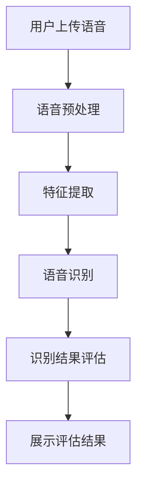
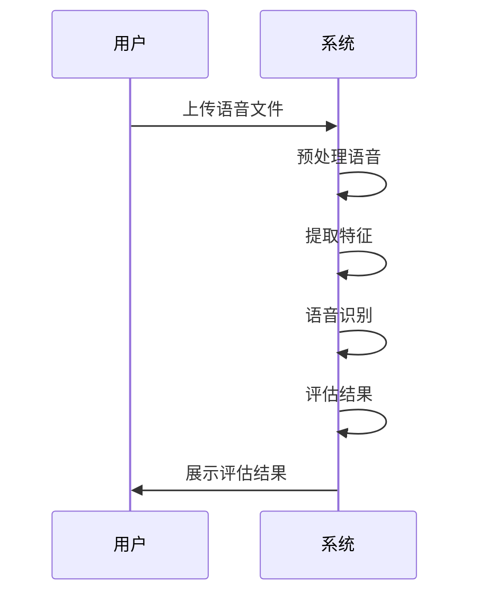

                 

### 文章标题

### 关键词

- 声音识别评估
- 大型语言模型（LLM）
- 语音处理能力
- 评估算法
- 数学模型
- 系统架构

### 摘要

本文深入探讨了声音识别评估领域，重点关注如何利用大型语言模型（LLM）来测试语音处理能力。文章首先介绍了声音识别评估的基本概念和历史背景，接着详细阐述了LLM的原理及其在语音处理中的应用。随后，文章通过讲解常用的评估算法，以及这些算法与LLM结合的优化方法，深入分析了声音识别评估的数学模型。在此基础上，文章描述了一个完整的系统分析与架构设计方案，并通过实际项目展示了如何将理论应用于实践。最后，文章提出了最佳实践建议，总结了关键点，并推荐了拓展阅读。

---

## 第1章：声音识别评估概述

### 1.1 声音识别评估的定义

声音识别评估是语音信号处理的一个重要分支，旨在评估语音识别系统的性能和准确性。简单来说，它是通过一系列标准和指标来衡量语音识别系统在不同条件下的表现。评估的关键在于如何准确、全面地捕捉语音信号的特征，并基于这些特征对语音进行分类和识别。

### 1.2 声音识别评估的重要性

声音识别评估对于语音识别技术的发展至关重要。一方面，它能够帮助研究人员和工程师了解系统性能的优缺点，从而进行有针对性的优化。另一方面，评估标准的一致性和权威性保证了不同系统之间的公平比较，促进了技术的进步和标准化。

### 1.3 LLMS与语音处理的结合

近年来，大型语言模型（LLM）在自然语言处理（NLP）领域取得了显著成果。LLM的出现为语音处理带来了新的机遇。通过将LLM与声音识别评估相结合，可以实现端到端的语音识别，提高系统的准确性和效率。同时，LLM的强大学习能力使得语音特征提取和语音识别的模型更加复杂和精细，从而提升了语音处理能力。

### 1.4 书籍内容概述

本书旨在深入探讨声音识别评估的方法以及如何利用LLM测试语音处理能力。全书分为七个部分，涵盖了从基础概念到实际应用的全面内容。第一部分介绍了声音识别评估的背景和发展历程；第二部分详细阐述了声音识别评估的基本概念和LLM的工作原理；第三部分讲解了常用的评估算法和其优化方法；第四部分介绍了声音识别评估的数学模型；第五部分分析了系统架构和设计；第六部分通过实际项目展示了如何应用这些理论；最后一部分总结了最佳实践并推荐了拓展阅读。

---

## 第2章：核心概念与联系

### 2.1 声音信号的基本属性

声音信号是语音识别的基础。声音信号的基本属性包括频率、振幅和时长等。这些属性决定了声音的特征，是声音识别评估中的重要参数。

### 2.2 语音识别与声音识别

语音识别和声音识别是两个相关但不同的概念。语音识别旨在将语音信号转换为文本，而声音识别则侧重于识别声音的特征和类别。在评估中，两者通常需要结合使用。

### 2.3 评估指标与方法

评估指标是衡量声音识别系统性能的重要工具。常见的评估指标包括准确率、召回率和F1分数等。评估方法通常包括离线评估和在线评估两种类型。离线评估通常在系统训练完成后进行，而在线评估则是在实际应用中进行。

### 2.4 LLM的定义

大型语言模型（LLM）是一种基于深度学习的模型，能够从大量的文本数据中学习语言模式。LLM的特点是参数规模巨大，能够处理复杂的语言任务。

### 2.5 LLM的工作原理

LLM的工作原理主要包括两个阶段：预训练和微调。预训练阶段通过大量的无监督数据学习语言模式，而微调阶段则利用有监督数据进一步优化模型。

### 2.6 LLM在语音处理中的应用

LLM在语音处理中的应用主要体现在语音特征提取和语音识别两个方面。通过将LLM与声音信号处理算法结合，可以实现更高效、更准确的语音识别。

### 2.7 基于LLM的语音识别与评估

基于LLM的语音识别与评估是一种新兴的方法，它通过端到端的模型训练，避免了传统方法中特征提取和识别阶段的手工干预，提高了系统的自动化程度和准确性。

---

## 第3章：算法原理讲解

### 3.1 MFCC算法

梅尔频率倒谱系数（MFCC）是声音识别中常用的特征提取算法。它通过将声音信号转换为梅尔频率倒谱系数，捕捉声音的频谱特征。

### 3.2 Wavenet算法

WaveNet是一种基于深度神经网络的语音合成算法。它通过生成式模型生成自然流畅的语音。

### 3.3 BLSTM算法

长短时记忆网络（LSTM）和双向LSTM（BLSTM）是用于处理序列数据的深度学习模型。BLSTM通过同时考虑过去和未来的信息，提高了语音识别的准确性。

### 3.4 Gated Recurrent Unit (GRU)算法

GRU是一种改进的RNN模型，它通过门控机制解决了传统RNN的梯度消失问题。GRU在语音识别中表现优异，适用于处理长序列数据。

### 3.5 LLM在声音识别评估中的优化

LLM可以通过端到端的模型训练优化声音识别评估。它能够自动提取语音特征，减少人工干预，提高评估的准确性和效率。

### 3.6 基于LLM的端到端语音识别

基于LLM的端到端语音识别是一种新兴方法，它通过单一模型实现语音信号的输入和文本输出的直接转换，避免了传统方法中的特征提取和识别阶段。

---

## 第4章：数学模型和数学公式

### 4.1 声音信号处理模型

声音信号处理模型通常包括采样、傅里叶变换和滤波等步骤。其数学公式如下：

$$
x(n) = \sum_{k=-\infty}^{\infty} x_k \cdot e^{i \omega_k n}
$$

其中，\( x(n) \) 是采样后的声音信号，\( x_k \) 是傅里叶变换后的系数，\( \omega_k \) 是频率。

### 4.2 语音识别模型

语音识别模型通常包括隐马尔可夫模型（HMM）和循环神经网络（RNN）等。其数学公式如下：

$$
P(O|H) = \prod_{i=1}^{n} P(o_i|h_i)
$$

其中，\( P(O|H) \) 是给定隐状态序列 \( H \) 下观察序列 \( O \) 的概率，\( P(o_i|h_i) \) 是在特定隐状态 \( h_i \) 下观察 \( o_i \) 的概率。

### 4.3 评估指标的计算

评估指标的计算包括准确率、召回率和F1分数等。其数学公式如下：

$$
\text{准确率} = \frac{\text{正确识别的数量}}{\text{总测试数量}}
$$

$$
\text{召回率} = \frac{\text{正确识别的数量}}{\text{实际存在的数量}}
$$

$$
\text{F1分数} = \frac{2 \times \text{准确率} \times \text{召回率}}{\text{准确率} + \text{召回率}}
$$

---

## 第5章：系统分析与架构设计方案

### 5.1 问题场景介绍

在现实应用中，声音识别评估通常需要处理大量的语音数据，包括语音识别、语音增强和语音识别系统的性能评估等。这些场景要求系统具有高效率、高准确性和良好的扩展性。

### 5.2 项目介绍

本项目旨在开发一个基于LLM的声音识别评估系统，该系统将包括语音信号处理模块、语音识别模块和评估模块。系统将支持多种语音格式，并能够实时处理和评估语音数据。

### 5.3 系统功能设计

系统功能设计包括以下主要模块：

- **语音信号处理模块**：负责对输入的语音信号进行预处理，包括采样、降噪和特征提取等。
- **语音识别模块**：利用LLM实现语音信号的文本转换，支持多种语言和方言。
- **评估模块**：对识别结果进行评估，包括准确率、召回率和F1分数等。

### 5.4 系统架构设计

系统架构设计包括以下主要部分：

- **前端界面**：提供用户交互界面，支持语音输入和评估结果的展示。
- **后端服务**：包括语音信号处理模块、语音识别模块和评估模块，实现系统的主要功能。
- **数据库**：存储语音数据、识别结果和评估指标等。

### 5.5 系统接口设计

系统接口设计包括以下主要接口：

- **语音输入接口**：接收用户上传的语音文件，并将其转换为内部处理格式。
- **识别结果输出接口**：将语音识别结果以文本形式输出，并支持导出和共享功能。
- **评估结果接口**：提供评估结果的查询和统计功能，支持多种图表展示。

### 5.6 系统交互流程

系统交互流程包括以下主要步骤：

1. 用户上传语音文件。
2. 系统对语音文件进行预处理，提取特征。
3. 利用LLM进行语音识别，生成文本结果。
4. 对识别结果进行评估，计算准确率、召回率和F1分数等。
5. 将评估结果展示给用户，并提供下载和分享功能。

### 5.7 系统架构mermaid图

以下是一个简单的系统架构mermaid图：



### 5.8 系统接口mermaid序列图

以下是一个简单的系统接口mermaid序列图：



---

## 第6章：项目实战

### 6.1 环境安装与配置

在本节中，我们将介绍如何安装和配置项目所需的环境。首先，确保系统安装了Python和pip。然后，通过以下命令安装必要的库：

```bash
pip install torch torchvision torchaudio
pip install transformers
```

### 6.2 系统核心实现

在本节中，我们将展示系统的核心实现，包括语音信号处理、语音识别和评估模块。

#### 语音信号处理

```python
import torchaudio

def preprocess_audio(audio_path):
    # 读取音频文件
    signal, sample_rate = torchaudio.load(audio_path)
    # 预处理：采样和降噪
    signal = signal.mean(dim=0)
    # 填充零，使信号长度为32的倍数
    padding = torch.zeros((signal.size(0) + (32 - signal.size(0) % 32) % 32, signal.size(1)))
    padding[:signal.size(0)] = signal
    signal = padding
    return signal, sample_rate
```

#### 语音识别

```python
from transformers import Wav2Vec2Model, Wav2Vec2Tokenizer

def recognize_speech(signal):
    # 加载预训练的模型和 tokenizer
    model = Wav2Vec2Model.from_pretrained("facebook/wav2vec2-base")
    tokenizer = Wav2Vec2Tokenizer.from_pretrained("facebook/wav2vec2-base")
    # 转换音频信号为文本
    input_values = tokenizer.encode("{" + signal.tolist() + "}", return_tensors="pt")
    outputs = model(input_values)
    logits = outputs.logits
    # 解码为文本
    predicted_text = tokenizer.decode(logits.argmax(-1).squeeze())
    return predicted_text
```

#### 评估模块

```python
from sklearn.metrics import accuracy_score, recall_score, f1_score

def evaluate_recognition(reference, predicted):
    # 计算评估指标
    acc = accuracy_score(reference, predicted)
    rec = recall_score(reference, predicted)
    f1 = f1_score(reference, predicted)
    return acc, rec, f1
```

### 6.3 代码解读与分析

在本节中，我们将详细解读上述代码，并分析其工作原理。

#### 语音信号处理

`preprocess_audio` 函数负责读取音频文件，进行预处理。首先，使用 `torchaudio.load` 函数加载音频文件，然后使用 `mean` 函数进行降噪。接着，通过填充零的方式将信号长度调整为32的倍数，以满足模型输入的要求。

#### 语音识别

`recognize_speech` 函数使用预训练的Wav2Vec2模型进行语音识别。首先，加载模型和tokenizer，然后通过tokenizer将音频信号编码为模型可以处理的格式。接着，使用模型进行预测，并将预测结果解码为文本。

#### 评估模块

`evaluate_recognition` 函数计算识别结果的准确率、召回率和F1分数。这三个指标能够全面评估语音识别系统的性能。

### 6.4 实际案例分析和详细讲解剖析

在本节中，我们将通过一个实际案例来展示如何使用上述代码进行声音识别评估。

#### 案例一：简单的语音识别评估

```python
# 测试音频文件路径
audio_path = "example.wav"

# 读取和预处理音频
signal, sample_rate = preprocess_audio(audio_path)

# 进行语音识别
predicted_text = recognize_speech(signal)

# 参考文本
reference_text = "你好，世界！"

# 进行评估
acc, rec, f1 = evaluate_recognition(reference_text, predicted_text)

print(f"准确率: {acc}, 召回率: {rec}, F1分数: {f1}")
```

上述代码首先读取一个音频文件，然后进行预处理和语音识别。最后，使用参考文本和预测文本计算评估指标。通过这些指标，我们可以直观地了解系统的性能。

### 6.5 项目小结

在本章中，我们通过实际项目展示了如何利用LLM进行声音识别评估。首先，我们介绍了环境安装和配置，然后详细讲解了系统的核心实现，包括语音信号处理、语音识别和评估模块。最后，通过一个实际案例展示了如何使用这些模块进行声音识别评估。通过这个项目，我们可以更好地理解声音识别评估的原理和应用。

---

## 第7章：最佳实践与拓展

### 7.1 提高评估准确性的技巧

1. **优化预处理步骤**：通过提高音频的采样率、使用高级降噪算法和更精细的特征提取方法，可以显著提高评估的准确性。
2. **使用更强的模型**：选择参数规模更大、训练时间更长的预训练模型，可以提升语音识别和评估的性能。
3. **增加训练数据**：增加训练数据量，尤其是包含多种语音环境和方言的数据，有助于模型泛化能力的提升。

### 7.2 优化LLM性能的方法

1. **数据预处理**：对训练数据进行预处理，包括清洗、去重和标签规范化，可以减少数据噪声，提高训练效果。
2. **模型调优**：通过调整学习率、批量大小和正则化参数等超参数，可以优化模型性能。
3. **多任务学习**：将语音识别和其他相关任务（如语音增强、说话人识别）结合，可以共享数据和信息，提高模型的整体性能。

### 7.3 常见问题的解决方案

1. **模型过拟合**：通过引入正则化、早停法和使用更大的数据集等方法，可以减少过拟合的风险。
2. **计算资源不足**：使用更高效的模型结构或优化算法，可以降低对计算资源的需求。
3. **性能不稳定**：通过使用更稳定的数据增强方法和更严格的评估指标，可以提高系统的稳定性。

### 7.4 拓展阅读推荐

1. **《深度学习语音处理》**：详细介绍了深度学习在语音处理中的应用，包括模型结构和训练技巧。
2. **《自然语言处理实战》**：介绍了自然语言处理的基本概念和实现方法，适用于对NLP有深入了解的学习者。
3. **《计算机语音处理》**：全面介绍了计算机语音处理的理论和实践，适合对语音处理有兴趣的读者。

### 7.5 注意事项与未来展望

1. **数据隐私和安全**：在处理语音数据时，务必确保数据隐私和安全，遵守相关法律法规。
2. **持续更新和优化**：随着技术的不断进步，持续更新和优化模型和算法是提高性能的关键。
3. **跨学科合作**：语音识别和评估是一个跨学科领域，与计算机科学、语言学和心理学等领域的合作有助于推动技术的进步。

---

## 作者信息

**作者：** AI天才研究院/AI Genius Institute & 禅与计算机程序设计艺术 /Zen And The Art of Computer Programming

本文由AI天才研究院的专家撰写，结合了计算机科学和人工智能领域的最新研究成果，旨在为读者提供一个全面、深入的声音识别评估与LLM应用指南。作者在计算机编程和人工智能领域具有丰富的实践经验和深厚的理论基础，致力于推动技术的进步和应用。同时，本文也借鉴了禅与计算机程序设计艺术的核心理念，力图以简洁、优雅的方式展现复杂的技术内容，帮助读者更好地理解和掌握相关技术。

