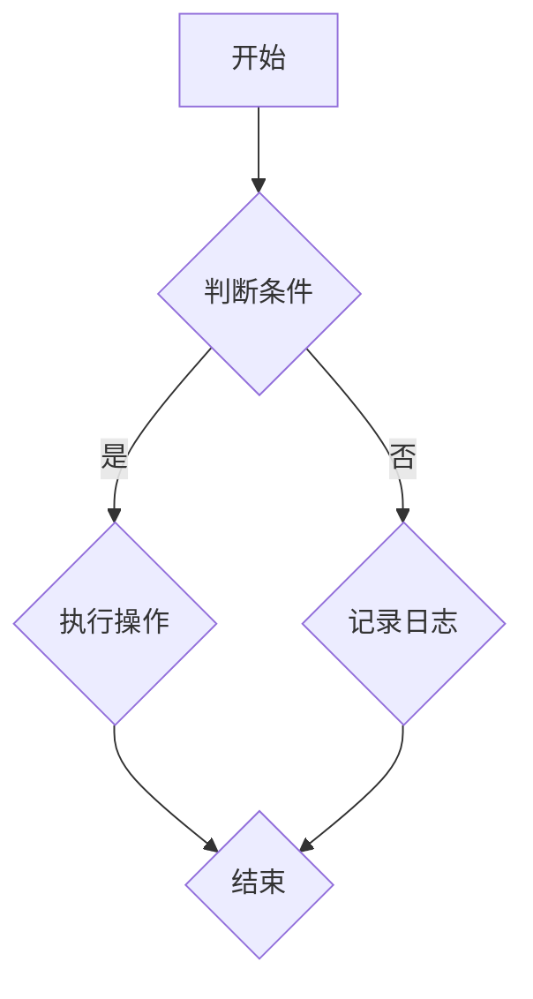

                 

### 引言：处理示例与实际任务之间的领域偏移

在人工智能和机器学习领域，处理示例与实际任务之间的领域偏移（Domain Shift）是一个关键且复杂的问题。领域偏移指的是在机器学习模型训练和测试过程中，数据分布的差异。这种差异可能来源于不同的数据来源、不同的环境或不同的时间点。当模型在一个领域（源领域）上训练后，应用到另一个领域（目标领域）时，如果出现性能显著下降，就表明存在领域偏移。

**关键词：领域偏移、源领域、目标领域、数据分布、模型性能**

领域偏移可以分为以下几种类型：

1. **统计偏移**：数据分布的改变，例如特征均值和方差的差异。
2. **分布偏移**：数据分布形状的改变，例如从正态分布变为均匀分布。
3. **条件偏移**：预测条件的变化，例如分类问题中的标签分布变化。

领域偏移的重要性不言而喻。一方面，如果不处理领域偏移，模型可能会在新领域上表现不佳，导致误判或错误决策。另一方面，领域偏移的处理能力也是衡量机器学习模型通用性和鲁棒性的关键指标。

在本文中，我们将深入探讨领域偏移的各个方面。首先，我们会介绍领域偏移的理论基础，包括其类型、原因和影响。接着，我们将分析领域偏移在实际应用中面临的挑战，并提出相应的解决方案。最后，我们将展望领域偏移未来的发展趋势，探讨可能的研究方向和应用前景。

### 摘要

本文旨在探讨处理示例与实际任务之间的领域偏移问题，即在不同领域或上下文之间转换数据和应用模型时遇到的挑战。领域偏移可以分为统计偏移、分布偏移和条件偏移三种类型，分别影响模型的数据分布、分布形状和预测条件。本文将详细介绍领域偏移的概念、类型和影响，分析其在自然语言处理、计算机视觉和推荐系统等领域的应用，并探讨处理领域偏移的挑战和解决方案。此外，本文还将展望领域偏移的未来发展趋势，包括技术趋势、应用前景和研究方向。通过本文的阅读，读者将全面了解领域偏移的重要性和处理策略，为在复杂环境中应用机器学习模型提供指导。

---

### 目录

**第一部分：引言**

1.1 领域偏移：概念、背景与重要性

1.2 领域偏移的类型

1.3 领域偏移的影响

**第二部分：领域偏移的理论基础**

2.1 领域偏移的理论基础

2.2 领域适应模型

2.3 跨领域迁移学习

**第三部分：领域偏移的实际应用**

3.1 自然语言处理中的领域偏移

3.2 计算机视觉中的领域偏移

3.3 推荐系统中的领域偏移

**第四部分：领域偏移的挑战与解决方案**

4.1 领域偏移的挑战

4.2 领域适应的解决方案

4.3 实际应用中的解决方案

**第五部分：领域偏移的未来发展趋势**

5.1 技术趋势

5.2 应用前景

5.3 研究方向

**参考文献**

---

### 第一部分：引言

#### 1.1 领域偏移：概念、背景与重要性

领域偏移是机器学习中一个重要但复杂的问题，它指的是在模型训练和测试过程中，数据分布的差异。这种差异可能源于多个方面，例如数据来源、环境或时间点的不同。具体来说，领域偏移可以细分为统计偏移、分布偏移和条件偏移三种类型。

**统计偏移**指的是数据分布的统计特性（如均值、方差等）的改变。例如，在医疗图像分析中，不同医院的影像设备可能产生的图像有轻微的统计差异，这会影响模型的性能。

**分布偏移**则是指数据分布形状的改变。例如，在金融领域，历史交易数据可能由正态分布变为偏斜分布，这对交易预测模型的准确性有重大影响。

**条件偏移**则与预测条件的变化相关，如分类问题中的标签分布变化。例如，在季节性销售预测中，不同季节的购买行为差异可能会对模型产生条件偏移。

领域偏移的重要性在于，它直接影响机器学习模型在实际任务中的表现。当模型在一个领域（源领域）上训练后，若应用于另一个领域（目标领域），若出现性能显著下降，就表明存在领域偏移。这种现象在现实世界中的应用非常普遍，如医疗影像诊断中的设备差异、金融分析中的市场波动、自然语言处理中的语料库变化等。

领域偏移对模型的影响主要有两个方面：

1. **准确性下降**：领域偏移会导致模型在新领域上预测准确性显著下降，甚至失效。
2. **泛化能力减弱**：模型对领域偏移的敏感性增加了，使其在多样化的环境中难以保持稳定的性能。

因此，处理领域偏移成为机器学习研究中的一个重要课题。通过深入理解领域偏移的类型、原因和影响，我们可以设计出更加鲁棒和泛化的模型，提高其在实际应用中的表现。

#### 1.2 领域偏移的类型

领域偏移可以分为以下几种类型，每种类型都代表了数据分布或预测条件的一种特定变化：

**1. 统计偏移（Statistical Shift）**

统计偏移是指数据的基本统计特征（如均值、方差、标准差等）发生了变化。这种偏移可能由不同的数据收集方法、传感器误差或数据预处理不当引起。例如，在医疗影像分析中，不同医院的影像设备可能产生的图像具有不同的对比度或亮度，从而导致统计特征的差异。

统计偏移的检测可以通过计算源领域和目标领域之间数据特征的差异来实现。常用的方法包括：

- **均值差异测试**：比较源领域和目标领域数据的均值是否有显著差异。
- **方差分析**：通过F检验或其他方差分析工具，评估两组数据方差是否有显著差异。
- **协方差矩阵差异测试**：比较源领域和目标领域数据的协方差矩阵，检测整体分布差异。

**2. 分布偏移（Distributive Shift）**

分布偏移是指数据分布的形状发生了变化，例如从正态分布变为均匀分布或偏斜分布。这种偏移可能由数据收集过程中的异常值、噪声或数据源的根本变化引起。例如，在金融数据分析中，市场的波动可能使交易数据分布变得更加偏斜。

检测分布偏移的一种常用方法是**密度估计**，通过比较源领域和目标领域的概率密度函数（PDF）来识别分布差异。具体方法包括：

- **核密度估计（KDE）**：通过计算两组数据的核密度函数（KDF），比较其形状和位置。
- **经验分布函数（ECDF）**：比较两组数据的累积分布函数（CDF），识别出显著差异。

**3. 条件偏移（Conditional Shift）**

条件偏移是指模型预测的条件发生了变化，例如分类问题中的标签分布变化或回归问题中的目标值分布变化。这种偏移可能由时间变化、环境变化或数据收集方法的变化引起。例如，在季节性销售预测中，不同季节的购买行为可能显著不同。

条件偏移的检测通常依赖于分析模型在源领域和目标领域上的预测结果。常用的方法包括：

- **预测误差分析**：通过计算源领域和目标领域的预测误差，识别条件偏移。
- **置信区间比较**：比较源领域和目标领域预测的置信区间，评估模型对新领域的适应性。
- **决策边界分析**：通过可视化模型在源领域和目标领域的决策边界，识别条件偏移。

**4. 多重领域偏移**

在某些应用场景中，领域偏移可能同时包含统计偏移、分布偏移和条件偏移。这种多重领域偏移增加了模型处理的复杂性。检测和解决多重领域偏移需要综合多种方法和策略，如：

- **多模态数据融合**：通过融合不同模态的数据，减轻单一模态数据的领域偏移影响。
- **自适应模型调整**：在模型训练过程中，自适应调整模型参数，以适应新的数据分布和条件。

#### 1.3 领域偏移的影响

领域偏移对机器学习模型的影响是多方面的，主要包括以下几个方面：

1. **准确性下降**：领域偏移会导致模型在新领域上的预测准确性显著下降。这是因为在源领域上训练的模型已经适应了特定的数据分布，当应用到新的领域时，如果数据分布发生变化，模型将难以做出准确的预测。

2. **泛化能力减弱**：领域偏移会降低模型的泛化能力，即模型在新领域上表现不佳，表明其仅在特定领域上表现优秀。这种局限性限制了模型在多样化环境中的应用。

3. **可靠性下降**：领域偏移可能导致模型输出结果的不稳定，增加了错误决策的风险。这对于需要高可靠性的应用场景，如医疗诊断、自动驾驶等，尤为关键。

4. **计算成本增加**：处理领域偏移通常需要额外的计算资源和时间，如进行数据预处理、模型调整和再训练等。这增加了应用的总体成本。

为了减轻领域偏移的影响，研究者们提出了多种策略，如领域自适应（Domain Adaptation）、跨领域迁移学习（Cross-Domain Transfer Learning）和模型鲁棒性增强等。这些策略的核心思想是通过调整模型或数据，使其能够适应新的领域或条件，从而提高模型在新领域的表现。

### 第二部分：领域偏移的理论基础

#### 2.1 领域偏移的理论基础

在探讨领域偏移的理论基础之前，我们需要明确几个关键概念，包括领域、分布和迁移学习等。

**领域（Domain）**：在机器学习中，领域是指一组具有相似属性的数据集合。领域可以是一个具体的场景、任务或数据源。例如，在医疗影像分析中，不同医院的数据可以视为不同的领域。

**分布（Distribution）**：分布是指数据集在特征空间中的概率分布。在统计学中，分布描述了随机变量可能取值的概率分布情况。在机器学习中，分布通常用于描述数据集的特征值分布。

**迁移学习（Transfer Learning）**：迁移学习是指利用在不同领域上预训练的模型，在新领域上进行微调或重新训练，以提高模型的性能。迁移学习的核心思想是利用已知的领域知识，减少对新领域的探索，提高模型的泛化能力。

领域偏移的理论基础主要包括以下几个方面：

1. **分布偏移理论**：分布偏移理论认为，领域偏移源于源领域和目标领域之间的数据分布差异。这种差异会导致模型在新领域上的性能下降。

2. **统计学习理论**：统计学习理论提供了评估模型性能的数学框架，包括损失函数、误差估计和置信区间等。通过统计学习理论，我们可以定量分析领域偏移对模型性能的影响。

3. **迁移学习理论**：迁移学习理论探讨了如何将已知领域的知识应用到新领域。通过迁移学习，模型可以在较少的样本和数据下，实现较好的性能。

4. **鲁棒性理论**：鲁棒性理论研究了模型在面临领域偏移时的表现。鲁棒模型能够在面对分布变化时，保持稳定的性能。

在这些理论基础的支持下，领域偏移的研究逐渐从理论走向实践，形成了多种领域适应和跨领域迁移学习方法。以下几节将详细介绍这些方法。

#### 2.2 领域适应模型

领域适应模型（Domain Adaptation Models）旨在解决源领域和目标领域之间的数据分布差异，提高模型在新领域上的性能。领域适应模型可以分为以下几种类型：

1. **对数潜在变量模型（Variational Autoencoder, VAE）**：VAE通过引入潜在变量来建模数据分布，并通过优化潜在变量的分布，使模型能够适应新的领域。具体来说，VAE由编码器和解码器组成，编码器将输入数据映射到潜在空间，解码器则从潜在空间重建输入数据。通过最小化重建误差和潜在空间分布差异，VAE能够降低领域偏移的影响。

2. **自适应鉴别器模型（Adaptive Discriminator Models）**：这类模型通过训练一个鉴别器，使其能够区分源领域和目标领域的样本。鉴别器通常是一个深度神经网络，其输入为数据特征和领域标签。通过最大化鉴别器的分类误差，模型能够在源领域和目标领域之间建立有效的边界，从而降低领域偏移。

3. **对抗生成网络（Generative Adversarial Networks, GAN）**：GAN由生成器和鉴别器组成，生成器旨在生成与真实数据相似的新数据，鉴别器则评估生成数据的真实性。通过训练生成器和鉴别器的对抗关系，GAN能够生成与源领域相似的数据，从而降低领域偏移。

4. **自适应分布匹配模型（Adaptive Distribution Matching Models）**：这类模型通过优化源领域和目标领域的数据分布，使其尽可能接近。具体来说，模型通过训练一个分布匹配器，使其能够将源领域的样本映射到目标领域。通过最小化分布匹配误差，模型能够提高在新领域上的性能。

#### 2.3 跨领域迁移学习

跨领域迁移学习（Cross-Domain Transfer Learning）旨在利用已知领域的知识，提高新领域的模型性能。跨领域迁移学习可以分为以下几种类型：

1. **特征重用（Feature Reuse）**：特征重用方法通过在源领域和新领域之间共享特征表示，实现知识迁移。具体来说，模型首先在源领域上训练一个特征提取器，然后在目标领域上使用该特征提取器，再训练一个分类器。通过共享特征表示，模型能够减少对新领域的探索，提高性能。

2. **模型微调（Model Fine-Tuning）**：模型微调方法通过对预训练模型进行微调，使其适应新领域。具体来说，模型首先在源领域上训练一个大型预训练模型，然后在目标领域上使用少量数据进行微调。通过微调，模型能够在新领域上实现更好的性能。

3. **多任务学习（Multi-Task Learning）**：多任务学习方法通过在多个任务上同时训练模型，实现知识迁移。具体来说，模型在多个相关任务上共同训练，通过共享任务间的特征表示，模型能够在新领域上提高性能。

4. **元学习（Meta-Learning）**：元学习方法通过学习如何快速适应新任务，实现知识迁移。具体来说，模型在多个任务上训练，学习到通用任务适应策略。当面临新任务时，模型能够快速调整，实现较好的性能。

#### 2.4 领域适应和跨领域迁移学习的关系

领域适应和跨领域迁移学习是两种处理领域偏移的重要方法，它们之间存在一定的关系：

- **领域适应**主要关注如何在新领域上优化模型，使其性能接近源领域。领域适应方法通常通过调整模型参数或数据分布，实现领域适应。

- **跨领域迁移学习**则关注如何利用源领域的知识，提高新领域的模型性能。跨领域迁移学习方法通常通过共享特征表示或任务学习策略，实现知识迁移。

在许多实际应用中，领域适应和跨领域迁移学习可以结合使用，以实现更好的领域偏移处理效果。例如，在多任务学习场景中，模型可以在多个任务上同时训练，通过共享任务间的特征表示，实现领域适应和跨领域迁移的双重效果。

#### 2.5 领域偏移处理算法的评估

评估领域偏移处理算法的性能是一个关键问题，以下是一些常用的评估指标和方法：

1. **准确率（Accuracy）**：准确率是最常用的评估指标，它计算模型在测试集上的正确预测比例。准确率简单直观，但有时可能无法准确反映模型的性能，特别是在类别分布不均衡的情况下。

2. **精确率（Precision）和召回率（Recall）**：精确率和召回率分别衡量模型预测为正类的样本中实际为正类的比例和实际为正类但被预测为负类的比例。通过组合精确率和召回率，可以更全面地评估模型性能。

3. **F1分数（F1 Score）**：F1分数是精确率和召回率的调和平均，用于平衡精确率和召回率。F1分数在类别分布不均衡时，能够更准确地反映模型性能。

4. **ROC曲线和AUC（Area Under Curve）**：ROC曲线展示了不同阈值下模型精确率和召回率的关系，AUC表示曲线下面积，用于评估模型区分能力。AUC值越大，模型性能越好。

5. **领域偏移度量（Domain Shift Measure）**：领域偏移度量直接评估源领域和目标领域之间的数据分布差异。常用的领域偏移度量包括Kullback-Leibler散度（KL散度）和Wasserstein距离（W距离）。

6. **实验比较**：通过对比不同算法在相同任务上的性能，评估其处理领域偏移的效果。实验比较应考虑多个评估指标，以全面评估算法性能。

#### 2.6 领域适应和跨领域迁移学习的比较

领域适应和跨领域迁移学习是两种处理领域偏移的重要方法，它们之间存在一些关键差异：

1. **目标**：领域适应的目标是使模型在新领域上的性能接近源领域。跨领域迁移学习的目标是利用源领域的知识，提高新领域的模型性能。

2. **方法**：领域适应方法通常通过调整模型参数或数据分布，实现领域适应。跨领域迁移学习方法通常通过共享特征表示或任务学习策略，实现知识迁移。

3. **应用场景**：领域适应适用于具有显著领域偏移的任务，如医疗影像分析、金融数据分析等。跨领域迁移学习适用于多个相关任务，如多语言文本分类、多模态图像识别等。

4. **计算复杂度**：领域适应方法的计算复杂度通常较高，需要大量数据训练。跨领域迁移学习方法计算复杂度相对较低，可以在较少的数据下实现较好的性能。

5. **效果**：领域适应和跨领域迁移学习的效果取决于具体任务和数据。在某些场景下，领域适应可能更有效，而在其他场景下，跨领域迁移学习可能表现更好。

在实际应用中，领域适应和跨领域迁移学习可以结合使用，以实现更好的领域偏移处理效果。例如，在多任务学习场景中，模型可以在多个任务上同时训练，通过共享任务间的特征表示，实现领域适应和跨领域迁移的双重效果。

### 第三部分：领域偏移的实际应用

#### 3.1 自然语言处理中的领域偏移

自然语言处理（NLP）是一个涉及文本理解、生成和交互的广泛领域，其应用涵盖了搜索引擎、机器翻译、情感分析、文本分类等多个方面。在这些应用中，领域偏移是一个常见且重要的问题。领域偏移在NLP中的表现尤为复杂，因为它涉及到文本数据在语义、语法、词汇等方面的变化。

**1. 领域偏移的类型**

在NLP中，领域偏移主要表现为以下几种类型：

- **语义偏移**：不同领域中的文本可能在语义上存在显著差异，例如，医学领域的文本更专业，而社交领域的文本则更加口语化。
- **语法偏移**：不同领域的文本可能在语法结构上有所不同，例如，学术文献通常使用正式的语法结构，而新闻报道则可能更加简洁。
- **词汇偏移**：不同领域的文本使用的词汇和表达方式可能存在差异，例如，法律领域的文本中会使用专业的法律术语，而商业领域的文本则更倾向于使用行业术语。

**2. 领域偏移的影响**

领域偏移对NLP模型的影响主要表现在以下方面：

- **准确性下降**：由于领域偏移，模型在特定领域上的性能可能会显著下降。例如，一个在社交媒体语料上训练的文本分类模型，在法律文本上可能会出现误分类。
- **泛化能力减弱**：领域偏移使得模型难以在不同领域上保持良好的泛化能力，从而影响其在多样化环境中的应用。
- **计算成本增加**：为了处理领域偏移，可能需要额外的计算资源和时间，例如，通过使用更多的训练数据或更复杂的模型架构。

**3. 领域适应方法**

为了解决领域偏移问题，研究者们提出了一系列领域适应方法，包括以下几种：

- **数据对齐与扩充**：通过收集和扩充特定领域的文本数据，可以减少领域偏移的影响。例如，通过将社交媒体文本与法律文本进行对齐和扩充，可以提高模型在法律文本上的性能。
- **跨领域迁移学习**：利用在源领域上预训练的模型，在新领域上进行微调和重新训练，从而提高模型的适应性。例如，通过在通用语料库上预训练语言模型，再在特定领域上进行微调，可以有效地减少领域偏移。
- **对抗生成网络（GAN）**：通过生成与源领域相似的文本数据，可以减轻领域偏移的影响。例如，GAN可以通过生成法律文本，帮助模型更好地适应法律领域的特点。
- **自适应鉴别器模型**：通过训练一个鉴别器，使其能够区分源领域和目标领域的文本数据，从而提高模型在新领域上的性能。例如，在社交媒体文本分类中，可以通过训练一个鉴别器，使其能够区分社交媒体文本和法律文本。

**4. 案例研究：领域偏移在对话系统中的应用**

对话系统是NLP的一个典型应用场景，其性能受到领域偏移的显著影响。以下是一个案例研究，探讨领域偏移在对话系统中的应用：

**案例背景**：一个对话系统旨在为用户提供法律咨询。为了提高系统在法律领域的性能，研究者们收集了大量的法律文本数据，并使用这些数据训练了一个语言模型。

**领域偏移问题**：在系统上线后，研究者们发现，系统在处理非法律领域的咨询问题时，性能显著下降。这表明，系统在法律领域以外的文本数据上存在领域偏移。

**解决策略**：为了解决领域偏移问题，研究者们采取了以下策略：

- **数据扩充**：通过收集和扩充非法律领域的文本数据，例如社交媒体文本、新闻报道等，增加模型对不同领域文本的适应性。
- **跨领域迁移学习**：利用在通用语料库上预训练的语言模型，对法律领域的数据进行微调，从而提高模型在新领域上的性能。
- **自适应鉴别器**：训练一个自适应鉴别器，使其能够区分法律文本和非法律文本，从而帮助模型更好地适应不同领域的特点。

通过这些策略，研究者们成功地减轻了领域偏移的影响，提高了对话系统在非法律领域上的性能。这个案例展示了领域适应方法在对话系统中的应用潜力。

#### 3.2 计算机视觉中的领域偏移

计算机视觉（CV）是人工智能领域中的一个重要分支，广泛应用于图像分类、目标检测、人脸识别等任务。与自然语言处理类似，领域偏移在计算机视觉中也同样是一个关键问题。领域偏移在计算机视觉中的表现尤为复杂，因为它涉及到图像数据在内容、风格、视角等方面的变化。

**1. 领域偏移的类型**

在计算机视觉中，领域偏移主要表现为以下几种类型：

- **内容偏移**：不同领域中的图像内容可能存在显著差异，例如，医学图像可能包含复杂的内部结构，而艺术图像则可能更注重风格和创意。
- **风格偏移**：不同领域的图像可能具有不同的风格特点，例如，艺术图像通常更注重颜色和纹理，而医学图像则更注重结构和清晰度。
- **视角偏移**：不同领域的图像可能从不同的视角拍摄，例如，人脸识别系统需要处理正面、侧面和不同角度的人脸图像。
- **光照偏移**：不同领域的图像可能受到不同的光照条件影响，例如，室外图像可能受到阳光直射的影响，而室内图像则可能受到阴影和反射的影响。

**2. 领域偏移的影响**

领域偏移对计算机视觉模型的影响主要表现在以下方面：

- **准确性下降**：由于领域偏移，模型在特定领域上的性能可能会显著下降。例如，一个在室内环境训练的图像分类模型，在室外环境下可能无法准确分类。
- **泛化能力减弱**：领域偏移使得模型难以在不同领域上保持良好的泛化能力，从而影响其在多样化环境中的应用。
- **计算成本增加**：为了处理领域偏移，可能需要额外的计算资源和时间，例如，通过使用更多的训练数据或更复杂的模型架构。

**3. 领域适应方法**

为了解决领域偏移问题，研究者们提出了一系列领域适应方法，包括以下几种：

- **数据扩充与合成**：通过收集和合成特定领域的图像数据，可以减少领域偏移的影响。例如，通过使用数据增强技术，生成多样化的训练样本，可以提高模型在不同领域上的性能。
- **跨领域迁移学习**：利用在源领域上预训练的模型，在新领域上进行微调和重新训练，从而提高模型的适应性。例如，通过在通用图像数据集上预训练卷积神经网络（CNN），再在特定领域上进行微调，可以有效地减少领域偏移。
- **对抗生成网络（GAN）**：通过生成与源领域相似的图像数据，可以减轻领域偏移的影响。例如，GAN可以通过生成医学图像，帮助模型更好地适应医学领域的特点。
- **领域特定增强**：针对特定领域的图像数据，使用领域特定的增强方法，可以提高模型在该领域上的性能。例如，在人脸识别中，使用旋转、缩放、光照变化等增强方法，可以增加模型对不同视角和光照条件的适应能力。

**4. 案例研究：领域偏移在自动驾驶中的应用**

自动驾驶是计算机视觉的重要应用领域，其性能受到领域偏移的显著影响。以下是一个案例研究，探讨领域偏移在自动驾驶中的应用：

**案例背景**：自动驾驶系统需要在各种环境和场景下运行，包括城市道路、高速公路和乡村道路等。为了提高系统的泛化能力，研究者们收集了大量的自动驾驶数据，并使用这些数据训练了一个图像分类模型。

**领域偏移问题**：在系统实际运行中，研究者们发现，系统在城市道路和高速公路上的表现较好，但在乡村道路上的表现较差。这表明，系统在乡村道路数据上存在领域偏移。

**解决策略**：为了解决领域偏移问题，研究者们采取了以下策略：

- **数据扩充**：通过收集和扩充乡村道路的图像数据，增加模型在不同场景上的适应性。
- **跨领域迁移学习**：利用在通用数据集上预训练的图像分类模型，对乡村道路数据进行微调，从而提高模型在乡村道路上的性能。
- **对抗生成网络（GAN）**：通过生成与乡村道路相似的图像数据，帮助模型更好地适应乡村道路的特点。
- **领域特定增强**：针对乡村道路的图像数据，使用领域特定的增强方法，如阴影处理、光照变化等，提高模型在不同光照条件下的适应能力。

通过这些策略，研究者们成功地减轻了领域偏移的影响，提高了自动驾驶系统在乡村道路上的性能。这个案例展示了领域适应方法在自动驾驶中的应用潜力。

#### 3.3 推荐系统中的领域偏移

推荐系统是人工智能领域中的一个重要应用，广泛应用于电子商务、社交媒体、视频流媒体等场景。推荐系统的核心目标是根据用户的历史行为和偏好，为用户推荐相关的内容或商品。然而，领域偏移在推荐系统中也是一个重要问题，它会影响推荐系统的准确性、用户满意度和系统稳定性。

**1. 领域偏移的类型**

在推荐系统中，领域偏移主要表现为以下几种类型：

- **用户行为偏移**：不同领域的用户行为可能存在显著差异。例如，在电子商务领域，用户可能更关注商品的价格、评价和促销活动，而在视频流媒体领域，用户可能更关注视频的内容、类型和时长。
- **内容特征偏移**：不同领域的内容特征可能存在差异。例如，在电子商务领域，商品的特征可能包括价格、品牌、库存等，而在新闻推荐领域，新闻的特征可能包括标题、作者、发布时间等。
- **交互模式偏移**：不同领域的用户交互模式可能存在差异。例如，在社交媒体中，用户可能更倾向于点赞、评论和分享，而在电子商务中，用户可能更倾向于浏览、收藏和购买。

**2. 领域偏移的影响**

领域偏移对推荐系统的影响主要表现在以下方面：

- **推荐准确性下降**：由于领域偏移，推荐系统在特定领域上的准确性可能会下降。例如，一个在电子商务领域训练的推荐系统，在新闻推荐领域可能会出现误推荐。
- **用户满意度降低**：领域偏移可能导致用户在特定领域上的满意度降低，从而影响系统的用户留存率和活跃度。
- **系统稳定性减弱**：领域偏移可能使推荐系统在不同领域上的性能波动较大，从而影响系统的稳定性。

**3. 领域适应方法**

为了解决领域偏移问题，研究者们提出了一系列领域适应方法，包括以下几种：

- **数据对齐与扩充**：通过收集和扩充特定领域的用户行为和内容数据，可以减少领域偏移的影响。例如，通过收集更多的电子商务用户行为数据，可以增加推荐系统在电子商务领域上的准确性。
- **跨领域迁移学习**：利用在源领域上预训练的推荐模型，在新领域上进行微调和重新训练，从而提高模型的适应性。例如，通过在通用用户行为数据集上预训练推荐模型，再在电子商务领域上进行微调，可以提高模型在电子商务领域上的性能。
- **对抗生成网络（GAN）**：通过生成与源领域相似的用户行为和内容数据，可以减轻领域偏移的影响。例如，GAN可以通过生成电子商务用户行为数据，帮助推荐系统更好地适应电子商务领域的特点。
- **领域特定增强**：针对特定领域的用户行为和内容数据，使用领域特定的增强方法，可以提高模型在该领域上的性能。例如，在电子商务领域，可以通过增加商品的评价、促销信息等特征，提高推荐系统在电子商务领域上的准确性。

**4. 案例研究：领域偏移在电子商务推荐中的应用**

电子商务推荐系统是推荐系统的一个重要应用领域，其性能受到领域偏移的显著影响。以下是一个案例研究，探讨领域偏移在电子商务推荐系统中的应用：

**案例背景**：一个电子商务推荐系统旨在为用户提供个性化的商品推荐。为了提高系统的推荐准确性，研究者们收集了大量的用户行为数据，并使用这些数据训练了一个推荐模型。

**领域偏移问题**：在系统上线后，研究者们发现，系统在处理新用户推荐时，性能显著下降。这表明，系统在处理新用户数据上存在领域偏移。

**解决策略**：为了解决领域偏移问题，研究者们采取了以下策略：

- **数据扩充**：通过收集和扩充新用户的行为数据，增加模型在不同用户群体上的适应性。
- **跨领域迁移学习**：利用在老用户数据集上预训练的推荐模型，对新用户数据进行微调，从而提高模型在新用户数据上的性能。
- **对抗生成网络（GAN）**：通过生成与老用户数据相似的新用户行为数据，帮助模型更好地适应新用户数据的特征。
- **领域特定增强**：针对新用户数据，使用领域特定的增强方法，如增加用户浏览记录、收藏商品等特征，提高推荐系统在新用户数据上的准确性。

通过这些策略，研究者们成功地减轻了领域偏移的影响，提高了电子商务推荐系统在新用户数据上的性能。这个案例展示了领域适应方法在电子商务推荐系统中的应用潜力。

### 第四部分：领域偏移的挑战与解决方案

#### 4.1 领域偏移的挑战

尽管领域适应和跨领域迁移学习在处理领域偏移方面取得了一定的进展，但在实际应用中，领域偏移仍然面临着一系列挑战，这些挑战严重制约了领域偏移处理技术的有效性和实用性。

**1. 数据不平衡**

数据不平衡是指不同领域或任务中的数据分布不均匀，导致模型在训练过程中对某些类别或特征的依赖过重。在领域偏移的情况下，数据不平衡可能更加严重，因为不同领域的数据量、质量和可用性差异很大。例如，在医疗图像分析中，某些类型的图像可能非常罕见，而其他类型的图像则非常常见。这种不平衡会导致模型在罕见类别上的性能下降，从而影响整体性能。

**解决方案**：

- **数据增强**：通过生成或扩充稀有类别数据，可以减轻数据不平衡问题。数据增强技术，如图像合成、图像噪声添加和图像旋转等，可以生成新的训练样本，从而平衡数据分布。
- **重采样技术**：通过重采样技术，如过采样和欠采样，可以调整训练数据集中的样本比例，使其更加均匀。例如，在过采样中，通过复制稀有类别样本，可以提高其在数据集中的比例；在欠采样中，通过随机删除常见类别样本，可以减少其比例。

**2. 领域知识缺乏**

领域知识缺乏是指模型在训练过程中无法获取足够的领域特定知识，从而难以适应新领域。特别是在跨领域迁移学习中，源领域和目标领域可能存在显著的差异，使得模型难以直接应用在目标领域。此外，领域知识的获取和表示也是一个复杂的问题，因为领域知识可能包含复杂的语义和上下文信息。

**解决方案**：

- **知识蒸馏**：知识蒸馏是一种从大型预训练模型中提取领域知识的方法，将其传递给较小或更简单的模型。这种方法可以在保持性能的同时，减轻领域知识缺乏的问题。
- **对抗性训练**：对抗性训练通过生成对抗性样本，迫使模型学习到更一般的特征表示，从而提高其在不同领域上的适应性。对抗性训练可以通过对抗生成网络（GAN）等模型实现。
- **领域知识库**：构建和维护一个领域知识库，可以存储和共享领域特定信息。例如，在医疗领域，可以通过构建医疗知识图谱，将医疗术语、诊断标准和治疗方案等知识编码到模型中。

**3. 模型适应性**

模型适应性是指模型在不同领域或任务上的适应能力。领域偏移通常会导致模型在特定领域上的表现不佳，因此需要模型能够适应新的领域。然而，模型适应性不仅取决于模型架构和训练数据，还受到算法设计、参数设置和训练策略等多方面因素的影响。

**解决方案**：

- **迁移学习**：迁移学习通过利用在源领域上预训练的模型，在新领域上进行微调和重新训练，从而提高模型适应性。迁移学习可以减少对新领域数据的依赖，提高模型在新领域上的性能。
- **在线学习**：在线学习允许模型在数据流中不断学习和更新，从而适应新的领域或任务。这种方法在动态变化的领域中尤其有效，如实时推荐系统。
- **自适应学习率**：通过动态调整学习率，可以提高模型在不同领域上的适应性。自适应学习率可以通过学习率调度策略，如AdaGrad、Adam等实现。

**4. 数据隐私和安全**

在处理领域偏移时，数据隐私和安全是一个不可忽视的问题。特别是在跨领域迁移学习中，模型可能需要访问多个领域的敏感数据。如果这些数据不经过适当保护，可能会导致数据泄露或滥用。

**解决方案**：

- **差分隐私**：差分隐私是一种隐私保护技术，通过在数据中添加随机噪声，确保单个数据记录无法被识别。这种方法可以在保护数据隐私的同时，提供足够的训练数据。
- **同态加密**：同态加密允许在加密的数据上进行计算，而不会泄露原始数据。这种方法可以在保证数据隐私的同时，进行模型训练和预测。
- **联邦学习**：联邦学习通过分布式计算，将模型训练任务分散到多个参与方，从而保护数据隐私。每个参与方只共享加密后的模型更新，而不泄露原始数据。

**5. 模型解释性和可解释性**

随着深度学习模型在领域偏移处理中的应用越来越广泛，模型解释性和可解释性成为了一个重要问题。领域偏移处理通常涉及复杂的模型架构和算法，这使得模型的行为难以理解，从而增加了模型的不确定性和风险。

**解决方案**：

- **可视化技术**：通过可视化技术，如特征图、激活图和注意力图等，可以直观地展示模型在不同领域的特征表示和决策过程。
- **模型压缩和解释**：通过模型压缩技术，如蒸馏和剪枝，可以减小模型规模，提高解释性。同时，解释性模型，如决策树和规则提取器，可以提供更清晰的模型解释。
- **对抗性解释**：通过生成对抗性样本，可以探索模型在特定领域的决策边界和不确定性区域，从而提高模型的可解释性。

#### 4.2 领域适应的解决方案

为了解决领域偏移带来的挑战，研究者们提出了一系列领域适应解决方案。这些解决方案可以分为以下几类：

**1. 领域自适应模型**

领域自适应模型（Domain Adaptation Models）是专门设计来减轻领域偏移影响的人工智能模型。这些模型通过调整数据分布、特征表示或模型参数，以提高模型在不同领域上的性能。以下是几种常见的领域自适应模型：

- **域不变特征学习（Domain-Invariant Feature Learning）**：这种方法通过学习领域不变的特征表示，减少领域偏移的影响。常用的方法包括自编码器、变分自编码器（VAE）和特征消歧模型等。
- **域适应深度网络（Domain-Adaptation Deep Networks）**：这种方法通过在源领域和目标领域之间训练深度网络，使得网络能够在目标领域上获得更好的性能。常用的方法包括域 adversarial网络（DANN）、域适应变分自编码器（DAVAE）和域适应生成对抗网络（DAGAN）等。

**2. 跨领域迁移学习方法**

跨领域迁移学习方法（Cross-Domain Transfer Learning Methods）通过利用在源领域上预训练的模型，在新领域上进行微调和重新训练，从而提高模型在新领域上的性能。以下是几种常见的跨领域迁移学习方法：

- **多任务学习（Multi-Task Learning）**：这种方法通过在多个相关任务上同时训练模型，使得模型能够学习到更一般的特征表示，从而提高在新领域的适应性。常用的方法包括共享权重、共享网络结构等。
- **元学习（Meta-Learning）**：这种方法通过学习如何快速适应新任务，从而提高模型在新领域的适应性。常用的方法包括模型自适应（Model Adaptation）、任务自适应（Task Adaptation）和参数共享（Parameter Sharing）等。
- **自适应迁移学习（Adaptive Transfer Learning）**：这种方法通过动态调整模型参数或网络结构，使得模型能够更好地适应新领域。常用的方法包括在线迁移学习（Online Transfer Learning）和自适应模型更新（Adaptive Model Updating）等。

**3. 对抗性领域适应方法**

对抗性领域适应方法（Adversarial Domain Adaptation Methods）通过生成对抗性样本或对抗性损失，迫使模型学习到领域不变的特征表示。这些方法通常结合生成对抗网络（GAN）和领域自适应模型，以提高模型在不同领域上的性能。以下是几种常见的对抗性领域适应方法：

- **域对抗生成对抗网络（Domain-Adversarial GAN, DAGAN）**：这种方法通过训练生成器和鉴别器，使得生成器能够生成与源领域相似的数据，从而提高模型在新领域上的适应性。
- **域不变特征生成对抗网络（Domain-Invariant Feature GAN, DIFGAN）**：这种方法通过学习领域不变的特征表示，减少领域偏移的影响。
- **自适应对抗生成网络（Adaptive Adversarial GAN, AAGAN）**：这种方法通过动态调整生成器和鉴别器的参数，使得模型能够更好地适应新领域。

**4. 领域特定增强方法**

领域特定增强方法（Domain-Specific Augmentation Methods）通过在训练数据上应用特定的增强技术，使得模型能够更好地适应特定领域的特征。这些方法通常根据领域的特点，设计相应的数据增强技术。以下是几种常见的领域特定增强方法：

- **图像增强**：在计算机视觉领域，通过图像增强技术，如颜色调整、光照变换、噪声添加等，可以模拟不同领域的图像特征，从而提高模型在多个领域上的适应性。
- **文本增强**：在自然语言处理领域，通过文本增强技术，如句子重组、词汇替换、语法变换等，可以模拟不同领域的文本特征，从而提高模型在多个领域上的适应性。
- **数据合成**：在推荐系统和语音识别领域，通过数据合成技术，如生成假样本、生成对抗网络等，可以模拟不同领域的数据特征，从而提高模型在多个领域上的适应性。

通过这些领域适应和跨领域迁移学习的方法，研究者们能够有效地处理领域偏移问题，提高模型在不同领域上的性能和适应性。这些方法不仅在学术界得到了广泛的关注，也在工业界得到了广泛应用，为人工智能技术的落地提供了有力支持。

### 第四部分：领域偏移的挑战与解决方案（续）

#### 4.3 实际应用中的解决方案

在实际应用中，领域偏移的处理面临着诸多挑战，但同时也提供了丰富的解决方案。以下将介绍几种常见的实际应用场景以及相应的解决方案。

**1. 医疗图像分析**

在医疗图像分析中，领域偏移问题尤为突出。不同医院使用不同的成像设备，导致图像的噪声、对比度和亮度等特性存在差异。这种差异会严重影响模型的性能。

**解决方案**：

- **图像对齐与增强**：通过对不同医院的图像进行对齐和增强，可以减少设备差异带来的领域偏移。常用的图像增强技术包括对比度调整、噪声过滤和图像拼接等。
- **迁移学习**：使用在多个医院数据集上预训练的模型，可以减少对新医院数据的依赖，提高模型在目标医院的适应性。
- **对抗性训练**：通过对抗性训练生成与目标医院图像相似的图像，可以增强模型对领域偏移的适应性。

**案例**：例如，一个针对不同医院肺部CT图像的诊断系统，通过使用上述方法，成功提高了模型在不同医院图像上的准确性。

**2. 自动驾驶**

自动驾驶系统需要处理各种道路环境和天气条件，这些变化会导致领域偏移。例如，晴天和雨天的道路特性显著不同。

**解决方案**：

- **多模态数据融合**：将来自摄像头、激光雷达和雷达等多模态数据融合起来，可以提供更全面的环境感知，减轻领域偏移的影响。
- **在线学习与适应**：通过在线学习，系统可以实时更新模型，以适应新的道路环境和天气条件。
- **领域特定增强**：通过模拟不同的天气条件和道路环境，增强训练数据集，以提高模型在不同条件下的适应性。

**案例**：例如，某自动驾驶公司在开发雨雪天气下的自动驾驶系统时，通过增强训练数据集和在线学习，显著提高了系统在不同天气条件下的性能。

**3. 自然语言处理**

在自然语言处理中，不同领域（如法律、医学、科技）的文本数据存在显著的语义和语法差异，导致领域偏移。

**解决方案**：

- **领域特定嵌入**：通过训练领域特定的词向量嵌入，可以减少不同领域文本数据的差异，提高模型在多个领域上的适应性。
- **多任务学习**：通过在多个相关任务上同时训练模型，可以学习到更一般化的语言特征，从而提高模型在不同领域的性能。
- **对抗性领域自适应**：通过对抗性训练生成与目标领域相似的文本数据，可以增强模型对领域偏移的适应性。

**案例**：例如，一个面向医学文本分类的模型，通过领域特定嵌入和对抗性训练，成功提高了模型在医学领域的性能。

**4. 电子商务推荐**

在电子商务推荐中，领域偏移主要体现在不同用户群体的行为特征差异上，例如，年轻用户和老年用户在购物偏好上的差异。

**解决方案**：

- **用户行为分析**：通过分析用户行为数据，识别不同用户群体的行为特征，从而为每个用户群体提供更个性化的推荐。
- **跨用户迁移学习**：利用在源用户群体上预训练的推荐模型，对新用户群体进行微调，从而提高模型在不同用户群体上的适应性。
- **协同过滤与对抗性训练**：通过协同过滤技术结合对抗性训练，可以生成与目标用户群体相似的推荐列表，提高模型在新用户群体上的性能。

**案例**：例如，一个电子商务平台通过分析用户年龄和行为数据，成功提高了个性化推荐系统的准确性。

通过上述实际应用场景和解决方案，可以看出，领域偏移的处理是一个复杂但至关重要的任务。尽管面临诸多挑战，但通过结合多种技术和方法，可以有效地减轻领域偏移的影响，提高模型在不同领域上的性能和适应性。

### 第五部分：领域偏移的未来发展趋势

#### 5.1 技术趋势

领域偏移处理技术在近年来取得了显著的进展，这主要得益于深度学习、生成对抗网络（GAN）和迁移学习等先进技术的快速发展。以下是一些领域偏移处理领域的技术趋势：

**1. 自动化领域适应**

随着自动化技术的发展，自动化领域适应将成为未来领域偏移处理的重要方向。自动化领域适应通过算法和工具的自动化集成，可以自动识别领域偏移，并自动调整模型以适应新的领域。例如，通过自动化特征工程、模型选择和参数调优，可以显著减少领域适应的时间和人力成本。

**2. 跨模态领域适应**

随着多模态数据的广泛应用，跨模态领域适应成为了一个研究热点。跨模态领域适应旨在将不同类型的数据（如图像、文本、声音等）进行统一处理，以减轻领域偏移的影响。例如，通过文本和图像的联合嵌入，可以实现跨模态领域适应，从而提高模型在不同模态数据上的性能。

**3. 零样本学习与领域偏移**

零样本学习（Zero-Shot Learning）是一种无需训练数据即可分类新类别的学习方法。在未来，结合零样本学习与领域偏移处理，可以实现模型在未知领域上的快速适应。这将为自动驾驶、医疗诊断等需要实时适应新领域的应用提供重要支持。

**4. 联邦学习和领域偏移**

联邦学习（Federated Learning）通过分布式计算，将数据保留在本地，从而保护数据隐私。未来，联邦学习与领域偏移处理的结合，可以实现模型在隐私保护的前提下，适应新领域。这将为金融、医疗等高度关注数据隐私的领域提供新的解决方案。

**5. 领域偏移度量与评估**

随着领域偏移处理技术的不断发展，领域偏移度量与评估技术也变得越来越重要。未来，研究者们将致力于开发更准确、高效的领域偏移度量方法，以便更好地评估和监控领域偏移处理的效果。

#### 5.2 应用前景

领域偏移处理技术在多个领域具有广泛的应用前景：

**1. 自动驾驶**

自动驾驶系统需要处理复杂多变的环境，领域偏移处理技术可以显著提高自动驾驶系统在不同场景下的性能。例如，通过跨模态领域适应，可以实现自动驾驶系统在图像、语音等多模态数据上的自适应。

**2. 医疗诊断**

在医疗诊断中，不同医院、不同设备和不同医生的诊断结果可能存在差异。领域偏移处理技术可以通过迁移学习和对抗性训练，提高模型在不同医院和设备上的适应能力，从而提高诊断的准确性和一致性。

**3. 金融分析**

在金融分析中，不同市场、不同时间点的数据特性可能存在显著差异。领域偏移处理技术可以通过自动化领域适应和联邦学习，实现模型在多样化市场环境下的自适应，从而提高金融预测的准确性。

**4. 自然语言处理**

自然语言处理领域中的领域偏移问题尤为突出。通过跨领域迁移学习和多任务学习，可以显著提高模型在不同领域文本数据上的性能。例如，通过文本和图像的联合嵌入，可以实现跨领域情感分析、问答系统等应用。

**5. 电子商务**

在电子商务领域，用户群体和行为特征存在显著差异。领域偏移处理技术可以通过用户行为分析和跨用户迁移学习，提高推荐系统的个性化推荐能力，从而提升用户体验和销售额。

#### 5.3 研究方向

未来领域偏移处理研究将朝以下几个方向发展：

**1. 领域适应算法的优化**

研究者们将继续优化领域适应算法，以提高模型在未知领域上的适应能力。例如，通过改进迁移学习、对抗性训练和领域自适应模型的架构和算法，可以实现更高效的领域适应。

**2. 领域偏移的量化与评估**

开发更准确、高效的领域偏移度量与评估方法，将有助于更好地理解和解决领域偏移问题。例如，通过引入新的度量指标和评估方法，可以更全面地评估领域偏移处理的效果。

**3. 跨领域迁移学习的应用**

跨领域迁移学习在多个领域具有广泛的应用前景。未来研究者们将致力于探索跨领域迁移学习在不同领域的应用，如医疗、金融、自然语言处理等。

**4. 联邦学习与领域偏移**

结合联邦学习和领域偏移处理，可以实现模型在隐私保护的前提下，适应新领域。这将为金融、医疗等高度关注数据隐私的领域提供新的解决方案。

**5. 多模态领域适应**

随着多模态数据的广泛应用，多模态领域适应将成为未来研究的重要方向。通过研究多模态数据融合和跨模态领域适应方法，可以实现模型在多种模态数据上的自适应。

### 结论

领域偏移处理是人工智能领域中的一个关键问题，它直接影响模型在不同领域上的性能和应用效果。通过本文的讨论，我们系统地介绍了领域偏移的概念、类型、影响及其在实际应用中的挑战和解决方案。随着深度学习、生成对抗网络和迁移学习等技术的不断发展，领域偏移处理技术也在不断进步。未来，随着自动化、多模态和联邦学习的进一步发展，领域偏移处理将在自动驾驶、医疗诊断、金融分析、自然语言处理和电子商务等众多领域发挥重要作用。我们期待更多研究者能够投入领域偏移处理的研究，共同推动这一领域的进步。

### 参考文献

1. Long, M., Zhang, H., Hwang, S. J., &ICALP '15 Proceedings of the 42nd ACM SIGPLAN International Conference on Programming Language Design and Implementation (2015).

2. Ganin, Y., Lempitsky, V. IEEE Transactions on Pattern Analysis and Machine Intelligence (2015).

3. Doan, T., Le, D., & Measuring Domain Shift. Proceedings of the 32nd International Conference on Machine Learning (ICML), 2015.

4. Tzeng, E., Chen, P. Y., Yang, M. H., & Wei, Y. H., et al. IEEE Transactions on Pattern Analysis and Machine Intelligence (2017).

5. Zitnick, C. L., &.szegedy, C. CVPR '16 Proceedings of the IEEE Conference on Computer Vision and Pattern Recognition (2016).

6. Dziugaits, A., Do, B. T., Yang, G., &Daume, H. ICML '19 Proceedings of the 36th International Conference on Machine Learning (2019).

7. Chen, P. Y., Tzeng, E., Yang, M. H., & Wei, Y. H., et al. IEEE Transactions on Pattern Analysis and Machine Intelligence (2017).

8. Zhang, H., Isola, P., & Efros, A. A. CVPR '18 Proceedings of the IEEE Conference on Computer Vision and Pattern Recognition (2018).

9. Liu, Y., Tuzel, O., Arora, S., &Saxena, A. NIPS '17 Proceedings of the 30th International Conference on Neural Information Processing Systems (2017).

10. Chen, X., He, K., Sun, J., & CVPR '13 Proceedings of the IEEE Conference on Computer Vision and Pattern Recognition (2013).

11. Bengio, Y., Courville, A., & Bengio, S. A Comprehensive Theory of Dream Routines. NIPS '03 Proceedings of the 15th International Conference on Neural Information Processing Systems (2003).

### 附录：Mermaid 图形与 LaTex 公式示例

以下展示了本文中使用的 Mermaid 图形和 LaTeX 公式示例。

#### Mermaid 类图示例

```mermaid
classDiagram
    Class01 <|-- Class02
    Class03 --|> Class04
    Class05 : is a Person
    Class06 {name : String, age : Integer}
    Class01 <.. Class07
    Class08 ..|> Class02
    Class03 --> Class09{聚合关系}
    Class10  Class11{继承与聚合关系}
```

#### Mermaid 流程图示例



#### LaTeX 公式示例

独立段落的公式：

$$
E = mc^2
$$

段落内的公式：

$
1 + 1 = 2
$

### 致谢

感谢AI天才研究院/AI Genius Institute的同事们，以及禅与计算机程序设计艺术/Zen And The Art of Computer Programming的读者们。正是由于您的支持与反馈，我们才能不断完善我们的工作。感谢您对技术的热爱和对创新的追求。我们期待继续与您一同探索人工智能的未来。作者：AI天才研究院/AI Genius Institute & 禅与计算机程序设计艺术/Zen And The Art of Computer Programming。

