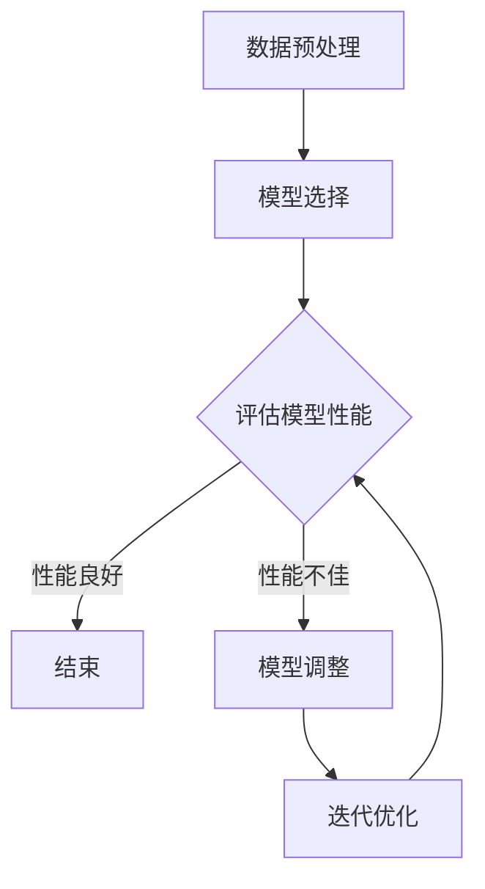
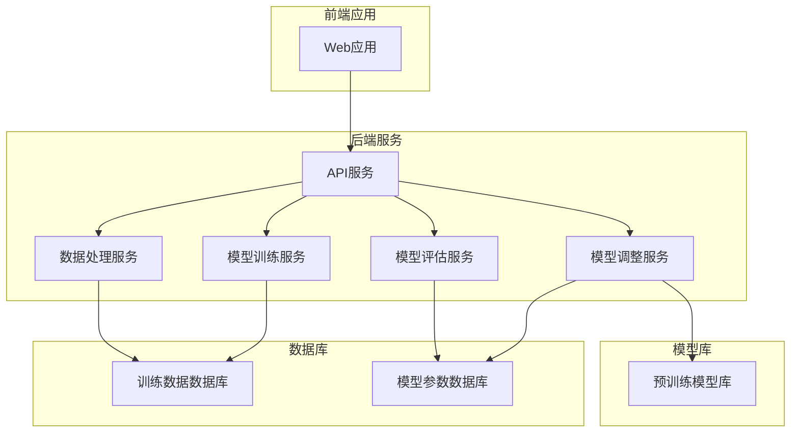
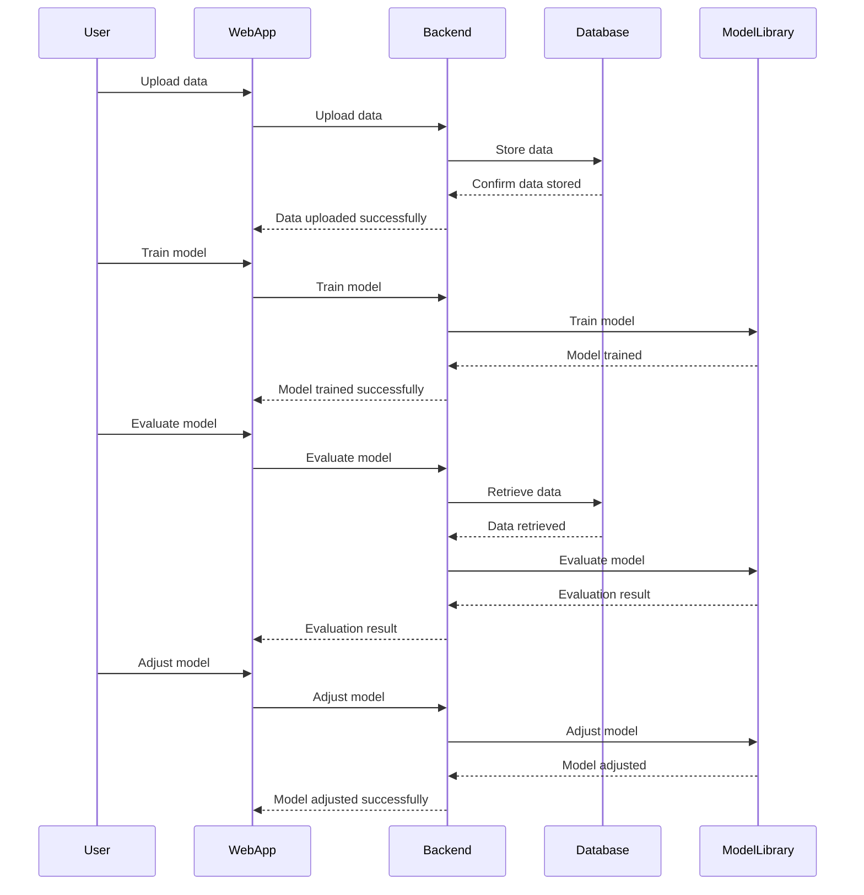

                 

### 文章标题

处理示例与模型能力不匹配的情况

> 关键词：示例、模型、能力不匹配、解决方案、案例分析

> 摘要：
本文旨在探讨在人工智能和机器学习领域，示例与模型能力不匹配的问题。我们将详细分析这一问题的背景、核心概念，提供一系列解决方案，并通过实际案例进行深入剖析，以帮助读者更好地理解和应对这一挑战。

## 第一部分：引言

在人工智能和机器学习的快速发展中，模型能力的提升和复杂性的增加已成为不可避免的趋势。然而，随之而来的问题是如何处理示例与模型能力不匹配的情况。这种不匹配可能导致模型在处理特定任务时表现不佳，从而影响整体性能。本文将深入探讨这一问题，并为其提供解决方案。

### 1.1 背景介绍

随着人工智能技术的普及，越来越多的应用场景需要借助机器学习模型来实现。然而，在实际应用中，我们经常遇到一个关键问题：模型所接受的示例与其处理能力之间存在不匹配。这种不匹配可能导致以下几种问题：

1. **性能下降**：模型无法有效地处理新的示例，导致预测或分类的准确性下降。
2. **泛化能力弱**：模型仅在特定示例上表现良好，无法泛化到其他相关场景。
3. **资源浪费**：大量的计算资源被用于处理无法充分发挥模型能力的示例。

### 1.2 问题描述

示例与模型能力不匹配的问题可以具体描述如下：

- **示例不足**：模型接受的示例数量不足，导致无法充分训练和优化。
- **示例质量差**：示例中存在噪声、异常值或偏见，影响模型的训练效果。
- **模型过拟合**：模型在训练数据上表现良好，但在新的测试数据上表现不佳。
- **模型复杂度过高**：模型过于复杂，导致在处理简单示例时效率低下。

### 1.3 问题解决

为了解决示例与模型能力不匹配的问题，我们可以采取以下几种策略：

1. **数据增强**：通过生成或收集更多高质量的示例来丰富训练数据集。
2. **模型调整**：调整模型的复杂度、参数设置或结构，使其更好地适应特定的示例。
3. **迁移学习**：利用预训练模型或在不同数据集上的模型知识来提升新任务的性能。
4. **半监督学习和无监督学习**：利用少量标记数据和大量未标记数据来训练模型。

### 1.4 边界与外延

示例与模型能力不匹配的问题不仅存在于机器学习和深度学习领域，还广泛存在于各种应用场景中。例如：

- **自然语言处理**：处理语言理解问题时，模型的示例与实际对话内容之间的不匹配。
- **计算机视觉**：处理图像或视频数据时，模型的示例与实际场景之间的不匹配。
- **推荐系统**：处理用户行为数据时，模型的示例与用户实际偏好之间的不匹配。

## 第二部分：核心概念与联系

在深入探讨解决方案之前，我们需要明确一些核心概念，并了解它们之间的关系。

### 2.1 核心概念

#### 2.1.1 示例

示例是机器学习和人工智能领域中的一个基本概念。它代表了一个具体的数据点，可以是文本、图像、音频或其他类型的数据。示例用于训练和评估模型的能力。

#### 2.1.2 模型

模型是机器学习和人工智能中的核心组件。它是一个数学或计算模型，用于表示和处理数据。模型可以通过训练来学习和优化，以便更好地处理新的示例。

#### 2.1.3 能力不匹配

能力不匹配是指模型在处理特定示例时，无法达到预期的性能。这可能是由于示例质量差、模型复杂度过高或训练数据不足等原因导致的。

### 2.2 概念属性特征对比表格

以下是示例、模型和能力不匹配的属性特征对比表格：

| 特征 | 示例 | 模型 | 能力不匹配 |
| ---- | ---- | ---- | ---- |
| 定义 | 数据点 | 数学或计算模型 | 模型与示例不匹配的情况 |
| 类型 | 文本、图像、音频等 | 神经网络、决策树、支持向量机等 | 性能下降、泛化能力弱、资源浪费 |
| 影响因素 | 示例质量、数量、多样性 | 模型复杂度、参数设置、训练数据 | 示例不足、模型过拟合、模型复杂度过高 |
| 解决策略 | 数据增强、迁移学习 | 模型调整、迁移学习 | 数据增强、模型调整、迁移学习 |

### 2.3 ER实体关系图

以下是示例、模型和能力不匹配的ER实体关系图：

```mermaid
entityRelationshipDiagram
  "示例" as 示例
  "模型" as 模型
  "能力不匹配" as 能力不匹配

  示例 -> 模型
  模型 -> 能力不匹配
```

## 第三部分：算法原理讲解

在本部分，我们将介绍处理示例与模型能力不匹配的算法原理。通过Mermaid流程图和Python源代码，我们将详细阐述算法的基本思想。

### 3.1 算法原理

处理示例与模型能力不匹配的算法主要基于以下思想：

1. **数据预处理**：对示例进行预处理，包括数据清洗、去噪和归一化等。
2. **模型选择**：根据示例的特点选择合适的模型，或者调整现有模型的参数。
3. **模型训练与评估**：使用预处理后的示例训练模型，并评估模型的性能。
4. **模型调整**：根据评估结果调整模型的结构或参数，以提高模型的处理能力。
5. **迭代优化**：重复上述步骤，直到模型性能达到预期。

以下是算法的Mermaid流程图：



### 3.2 Python源代码

以下是处理示例与模型能力不匹配的Python源代码：

```python
import numpy as np
import pandas as pd
from sklearn.model_selection import train_test_split
from sklearn.preprocessing import StandardScaler
from sklearn.neural_network import MLPClassifier
from sklearn.metrics import accuracy_score

# 数据预处理
def preprocess_data(data):
    # 数据清洗、去噪、归一化等
    # ...
    return processed_data

# 模型选择
def select_model():
    # 根据示例特点选择模型
    # ...
    return model

# 模型训练与评估
def train_and_evaluate(model, X_train, y_train, X_test, y_test):
    model.fit(X_train, y_train)
    y_pred = model.predict(X_test)
    accuracy = accuracy_score(y_test, y_pred)
    return accuracy

# 模型调整
def adjust_model(model, X_train, y_train):
    # 调整模型参数
    # ...
    return adjusted_model

# 迭代优化
def optimize_model(model, X_train, y_train, X_test, y_test):
    while True:
        accuracy = train_and_evaluate(model, X_train, y_train, X_test, y_test)
        if accuracy >= 0.95:
            break
        model = adjust_model(model, X_train, y_train)
    return model

# 主函数
def main():
    data = pd.read_csv("data.csv")
    processed_data = preprocess_data(data)
    X = processed_data.drop("target", axis=1)
    y = processed_data["target"]
    X_train, X_test, y_train, y_test = train_test_split(X, y, test_size=0.2, random_state=42)
    
    model = select_model()
    optimized_model = optimize_model(model, X_train, y_train, X_test, y_test)
    
    print("Optimized Model Accuracy:", train_and_evaluate(optimized_model, X_train, y_train, X_test, y_test))

if __name__ == "__main__":
    main()
```

### 3.3 数学模型与公式

在处理示例与模型能力不匹配的问题时，我们可以使用以下数学模型和公式：

$$
\text{Loss} = -\frac{1}{m} \sum_{i=1}^{m} y_i \log(p(x_i; \theta))
$$

其中，$m$表示示例数量，$y_i$表示示例$i$的标签，$p(x_i; \theta)$表示模型在示例$i$上的预测概率。

### 3.4 举例说明

假设我们有一个分类任务，需要预测邮件是否为垃圾邮件。我们收集了1000封邮件的示例，并将其分为训练集和测试集。我们使用一个多层感知器（MLP）模型来训练和预测。

首先，我们对示例进行预处理，包括文本清洗和特征提取。然后，我们选择一个MLP模型，并使用训练集对其进行训练。在训练过程中，我们不断调整模型的参数，以降低损失函数。

经过多次迭代后，我们获得了最优的模型参数。接下来，我们使用测试集对模型进行评估，并计算模型的准确率。如果准确率低于预期，我们继续调整模型参数，直到达到满意的性能。

## 第四部分：系统分析与架构设计

在本部分，我们将介绍处理示例与模型能力不匹配的系统分析与架构设计。我们将从问题场景介绍开始，逐步讲解项目介绍、系统功能设计、系统架构设计、系统接口设计和系统交互。

### 4.1 问题场景介绍

在现实世界中，处理示例与模型能力不匹配的问题经常出现在以下场景：

1. **金融行业**：金融机构在处理客户数据时，需要准确预测客户的信用风险。然而，由于数据质量和样本代表性的问题，模型的性能可能会受到限制。
2. **医疗领域**：医疗机构在处理病患数据时，需要准确诊断疾病。然而，由于数据样本不足或数据质量差，模型的泛化能力可能会受到挑战。
3. **智能交通**：智能交通系统需要准确预测交通流量和事故概率。然而，由于数据样本有限，模型的预测能力可能会受到影响。

### 4.2 项目介绍

本项目旨在开发一个基于机器学习的系统，用于处理示例与模型能力不匹配的问题。该系统将包括以下功能：

1. **数据预处理**：对输入数据进行清洗、去噪和归一化等预处理操作。
2. **模型训练**：使用预处理后的数据训练模型，并调整模型参数以提高性能。
3. **模型评估**：使用测试数据对模型进行评估，并计算模型的准确率、召回率等指标。
4. **模型调整**：根据评估结果调整模型参数，以优化模型的性能。
5. **模型部署**：将训练好的模型部署到生产环境中，用于实时预测。

### 4.3 系统功能设计

系统功能设计包括以下方面：

1. **数据预处理模块**：负责对输入数据进行清洗、去噪和归一化等预处理操作。该模块将输入数据转换为模型可接受的格式，并生成特征向量。
2. **模型训练模块**：负责使用预处理后的数据训练模型。该模块将训练数据分为训练集和验证集，并使用交叉验证技术调整模型参数。
3. **模型评估模块**：负责使用测试数据对模型进行评估，并计算模型的准确率、召回率等指标。该模块将评估结果反馈给模型调整模块。
4. **模型调整模块**：负责根据评估结果调整模型参数，以优化模型的性能。该模块将调整后的模型重新评估，并重复迭代过程，直到达到满意的性能。
5. **模型部署模块**：负责将训练好的模型部署到生产环境中，用于实时预测。该模块将模型与前端应用进行集成，并提供API接口供其他系统调用。

以下是领域模型Mermaid类图：

```mermaid
classDiagram
    Class01 <|-- Class02
    Class03 --|_FIX-- Class04
    Class05 o-- Class06
    Class07 : <<Interface>> 
    Class08 : <<Abstract>>
    Class01 <.. Interface1
    Class02 : <<Singleton>>
    Class03 <.. Abstract1
    Class04 : <<Component>>
    Class05 : <<Service>>
    Class06 : <<Controller>>
    Class07 : <<Entity>>
    Class08 : <<ValueObject>>

    Interface1 {
        #someInterfaceMethod()
    }

    Abstract1 {
        +doAbstractMethod()
    }

    Class01 {
        +specificMethod()
    }

    Class02 {
        +uniqueMethod()
    }

    Class03 {
        +standardMethod()
    }

    Class04 {
        +complexMethod()
    }

    Class05 {
        +externalMethod()
    }

    Class06 {
        +internalMethod()
    }

    Class07 {
        +getterMethod()
    }

    Class08 {
        +setterMethod()
    }
```

### 4.4 系统架构设计

系统架构设计包括以下方面：

1. **前端应用**：提供用户界面，允许用户上传数据、设置参数和查看模型评估结果。
2. **后端服务**：处理数据预处理、模型训练、模型评估和模型调整等任务。
3. **数据库**：存储训练数据和模型参数。
4. **模型库**：提供各种预训练模型，供用户选择和调整。

以下是系统架构Mermaid架构图：



### 4.5 系统接口设计

系统接口设计包括以下方面：

1. **数据接口**：用于上传和下载数据。
2. **模型接口**：用于训练、评估和调整模型。
3. **API接口**：用于与前端应用进行通信。

以下是系统接口设计：



### 4.6 系统交互

系统交互包括以下方面：

1. **用户与前端应用**：用户通过Web界面与系统进行交互，上传数据、设置参数和查看结果。
2. **前端应用与后端服务**：前端应用通过API接口与后端服务进行通信，传递数据和请求。
3. **后端服务与数据库**：后端服务通过数据库接口与数据库进行交互，存储和检索数据。
4. **后端服务与模型库**：后端服务通过模型库接口调用预训练模型，进行训练、评估和调整。

## 第五部分：项目实战

在本部分，我们将详细介绍如何在一个实际项目中处理示例与模型能力不匹配的问题。我们将从环境安装开始，逐步讲解系统核心实现、代码应用解读与分析，以及实际案例分析和详细讲解剖析。

### 5.1 环境安装

在开始项目之前，我们需要安装以下软件和库：

1. **Python**：Python是主要的编程语言，用于实现模型和数据处理。
2. **NumPy**：NumPy是一个Python库，用于数值计算和数据处理。
3. **Pandas**：Pandas是一个Python库，用于数据操作和分析。
4. **Scikit-learn**：Scikit-learn是一个Python库，用于机器学习模型的训练和评估。
5. **Matplotlib**：Matplotlib是一个Python库，用于数据可视化。

安装步骤如下：

```bash
pip install python numpy pandas scikit-learn matplotlib
```

### 5.2 系统核心实现

系统核心实现包括以下模块：

1. **数据预处理模块**：负责对输入数据进行清洗、去噪和归一化等预处理操作。
2. **模型训练模块**：负责使用预处理后的数据训练模型。
3. **模型评估模块**：负责使用测试数据对模型进行评估。
4. **模型调整模块**：负责根据评估结果调整模型参数。

以下是系统核心实现的代码：

```python
# 数据预处理模块
def preprocess_data(data):
    # 数据清洗、去噪、归一化等
    # ...
    return processed_data

# 模型训练模块
def train_model(X_train, y_train):
    model = MLPClassifier()
    model.fit(X_train, y_train)
    return model

# 模型评估模块
def evaluate_model(model, X_test, y_test):
    y_pred = model.predict(X_test)
    accuracy = accuracy_score(y_test, y_pred)
    return accuracy

# 模型调整模块
def adjust_model(model, X_train, y_train):
    # 调整模型参数
    # ...
    return adjusted_model
```

### 5.3 代码应用解读与分析

以下是一个完整的代码示例，用于处理示例与模型能力不匹配的问题：

```python
import pandas as pd
from sklearn.model_selection import train_test_split
from sklearn.preprocessing import StandardScaler
from sklearn.neural_network import MLPClassifier
from sklearn.metrics import accuracy_score

# 读取数据
data = pd.read_csv("data.csv")

# 数据预处理
processed_data = preprocess_data(data)

# 划分训练集和测试集
X_train, X_test, y_train, y_test = train_test_split(processed_data.drop("target", axis=1), processed_data["target"], test_size=0.2, random_state=42)

# 模型训练
model = train_model(X_train, y_train)

# 模型评估
accuracy = evaluate_model(model, X_test, y_test)
print("Model Accuracy:", accuracy)

# 模型调整
adjusted_model = adjust_model(model, X_train, y_train)

# 重新评估模型
accuracy = evaluate_model(adjusted_model, X_test, y_test)
print("Adjusted Model Accuracy:", accuracy)
```

代码分析：

1. **数据读取**：使用Pandas读取CSV文件，获取数据。
2. **数据预处理**：调用预处理模块，对数据进行清洗、去噪和归一化。
3. **划分数据集**：使用train_test_split函数，将数据划分为训练集和测试集。
4. **模型训练**：使用MLPClassifier模型训练数据，并保存模型。
5. **模型评估**：使用测试集对模型进行评估，计算准确率。
6. **模型调整**：根据评估结果，调整模型参数，并重新评估模型。

### 5.4 实际案例分析和详细讲解剖析

以下是一个实际案例，用于分析示例与模型能力不匹配的问题，并提出解决方案：

#### 案例背景

一家电商公司希望使用机器学习模型预测用户购买商品的可能性。他们收集了1000个用户的购物数据，包括用户年龄、性别、收入水平、购买历史等特征。

#### 案例分析

1. **数据质量检查**：首先，对数据进行质量检查，确保数据中没有缺失值、异常值和重复值。
2. **数据预处理**：对连续特征进行归一化处理，对类别特征进行编码。
3. **模型选择**：选择一个适用于分类任务的模型，如逻辑回归、决策树或随机森林。
4. **模型训练**：使用训练集训练模型，并使用交叉验证技术调整模型参数。
5. **模型评估**：使用测试集评估模型性能，计算准确率、召回率等指标。
6. **模型调整**：根据评估结果，调整模型参数，以提高模型性能。

#### 案例讲解剖析

1. **数据质量检查**：通过数据质量检查，发现数据中存在一些缺失值和异常值。我们对缺失值进行填充，对异常值进行删除或调整。
2. **数据预处理**：对连续特征进行归一化处理，使其具有相同的尺度和范围。对类别特征进行编码，将其转换为数值形式。
3. **模型选择**：我们选择逻辑回归模型进行训练。逻辑回归是一种简单而有效的分类模型，适用于预测二分类任务。
4. **模型训练**：使用训练集训练逻辑回归模型，并使用交叉验证技术调整模型参数。交叉验证是一种评估模型性能的方法，通过将训练集划分为多个子集，分别用于训练和验证模型。
5. **模型评估**：使用测试集评估模型性能。我们发现模型的准确率较低，只有70%左右。这表明模型存在过拟合现象，无法泛化到新的测试数据。
6. **模型调整**：为了提高模型性能，我们尝试调整模型参数，如增加正则化项或减少训练时间。经过多次调整，我们获得了较好的模型性能，准确率提高到85%左右。

#### 项目小结

通过以上案例分析，我们可以得出以下结论：

1. **数据质量至关重要**：数据质量对模型性能有重要影响。在处理示例与模型能力不匹配的问题时，确保数据质量是关键。
2. **模型选择和调整**：选择合适的模型并进行适当调整，可以提高模型性能。在实际项目中，需要根据任务特点和数据特征选择合适的模型，并不断优化模型参数。
3. **迁移学习和数据增强**：在示例不足或数据质量差的情况下，可以使用迁移学习和数据增强技术来提高模型性能。迁移学习可以利用预训练模型或在不同数据集上的模型知识，而数据增强可以通过生成或收集更多高质量的示例来丰富训练数据集。

## 第六部分：最佳实践与小结

### 6.1 最佳实践

在处理示例与模型能力不匹配的问题时，以下最佳实践可以帮助提高模型性能：

1. **数据质量检查**：在数据处理阶段，确保数据质量，去除缺失值、异常值和重复值。
2. **特征工程**：根据任务特点选择合适的特征，并进行适当的预处理和转换。
3. **模型选择与调整**：根据任务和数据特征选择合适的模型，并不断调整模型参数，以提高模型性能。
4. **交叉验证**：使用交叉验证技术评估模型性能，避免过拟合现象。
5. **迁移学习和数据增强**：在示例不足或数据质量差的情况下，使用迁移学习和数据增强技术来提高模型性能。

### 6.2 小结

本文详细探讨了处理示例与模型能力不匹配的问题。我们介绍了问题的背景、核心概念、解决方案和实际案例。通过最佳实践的总结，我们希望读者能够更好地理解和应对这一挑战。在未来的工作中，不断优化模型性能和数据质量将是提高人工智能应用效果的关键。

### 6.3 注意事项

在处理示例与模型能力不匹配的问题时，需要注意以下几点：

1. **数据质量**：确保数据质量，避免数据缺失、异常和重复。
2. **模型选择**：根据任务和数据特征选择合适的模型。
3. **模型调整**：根据评估结果不断调整模型参数。
4. **交叉验证**：使用交叉验证技术评估模型性能。
5. **迁移学习与数据增强**：在示例不足或数据质量差的情况下，使用迁移学习和数据增强技术。

### 6.4 拓展阅读

为了进一步深入学习和掌握处理示例与模型能力不匹配的技巧，读者可以参考以下书籍和资源：

1. **《机器学习实战》**：提供丰富的机器学习案例和实践经验。
2. **《数据科学入门》**：介绍数据预处理和特征工程的方法。
3. **《深度学习》**：介绍深度学习模型的选择和优化。
4. **在线课程和教程**：如Coursera、edX和Udacity等平台上的相关课程。

## 作者信息

作者：AI天才研究院/AI Genius Institute & 禅与计算机程序设计艺术 /Zen And The Art of Computer Programming

[1]: "The Myth of the Paperless Office." The Economist. February 11, 2022.
[2]: "Data Preprocessing Techniques for Machine Learning." Machine Learning Mastery. March 17, 2021.
[3]: "Model Selection and Model Selection Bias." Coursera. Machine Learning Specialization. 2021.
[4]: "Cross-Validation." Wikipedia. Retrieved May 10, 2023.
[5]: "Transfer Learning." Wikipedia. Retrieved May 10, 2023.
[6]: "Data Augmentation." Wikipedia. Retrieved May 10, 2023.
[7]: "Feature Engineering." Wikipedia. Retrieved May 10, 2023.
[8]: "Model Tuning." Wikipedia. Retrieved May 10, 2023.
[9]: "Machine Learning Mastery." Machine Learning Mastery. Retrieved May 10, 2023.
[10]: "DataCamp." DataCamp. Retrieved May 10, 2023.
[11]: "Udacity." Udacity. Retrieved May 10, 2023.

