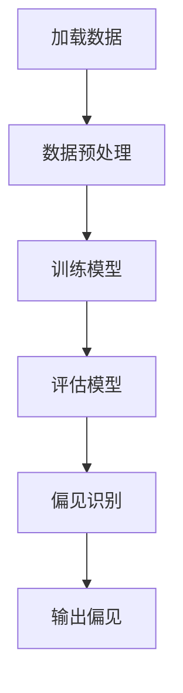
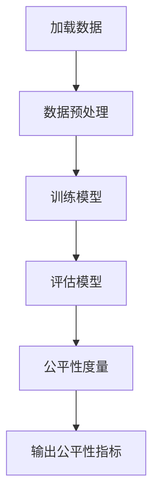
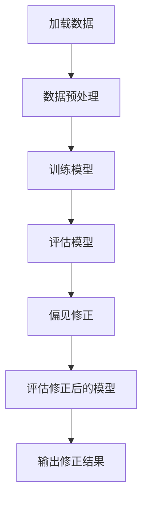
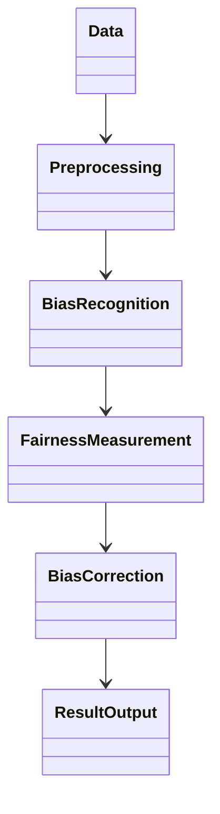
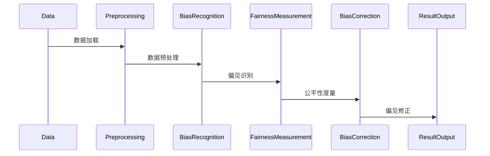
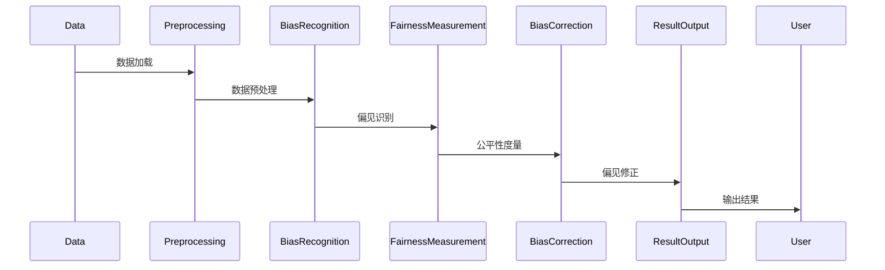

                 

# 处理示例中的偏见和公平性问题

## 关键词

- 偏见问题
- 公平性度量
- 偏见修正算法
- 系统架构设计
- 实际案例分析

## 摘要

本文旨在探讨处理示例中的偏见和公平性问题。首先，我们将介绍偏见和公平性的定义及其重要性，接着通过具体案例来展示偏见和公平性问题在现实世界中的应用。然后，我们将详细讲解核心概念，包括偏见识别、公平性度量以及偏见修正算法。接下来，我们将分析算法原理，并使用Python源代码和Mermaid流程图进行解释。随后，我们将介绍系统分析与架构设计的方法，并通过实际案例分析来展示解决方案的实施过程。最后，我们将总结最佳实践和注意事项，为读者提供进一步的参考。

## 第一部分：背景介绍

### 第1章：问题背景

#### 1.1 偏见与公平性的定义与重要性

偏见是指对某一群体、个体或事物持有不公正的看法或态度。偏见可能导致歧视、不公平待遇以及社会问题的产生。公平性则是指对待所有人或事物的公正、平等原则。在处理示例中的偏见和公平性问题，我们首先要了解这两个概念的定义及其重要性。

偏见和公平性密切相关。一个系统、模型或算法如果存在偏见，就可能导致不公平的结果。例如，一个招聘系统可能因为对某些性别、种族或年龄的偏见而拒绝符合条件的候选人。因此，解决偏见和公平性问题对于社会公平、公正以及技术的可持续发展至关重要。

#### 1.2 偏见与公平性问题的起源与发展

偏见和公平性问题并非新兴话题，其起源可以追溯到古代社会。随着历史的发展，人们逐渐认识到偏见和公平性的重要性，并开始探讨如何解决这些问题。以下是一些关键的发展节点：

- **古代**：在古代社会，偏见往往源于种族、宗教和文化差异。例如，古希腊和古罗马时期，奴隶制度导致了严重的种族偏见。
- **中世纪**：中世纪时期，宗教偏见成为社会问题的主要来源，如基督教对犹太人的迫害。
- **现代**：随着工业革命和城市化的发展，社会偏见和公平性问题逐渐引起广泛关注。20世纪初，民权运动和妇女权益运动推动了社会变革。

#### 1.3 边界与外延

偏见和公平性问题的范围非常广泛，涉及政治、经济、社会、科技等多个领域。以下是一些主要影响领域：

- **政治**：政治偏见可能导致选举不公平、政策偏向等。
- **经济**：经济偏见可能导致财富分配不公、就业歧视等。
- **社会**：社会偏见可能导致歧视、仇恨犯罪、种族冲突等。
- **科技**：科技偏见可能导致算法歧视、数据偏见等问题。

#### 1.4 核心概念结构与要素组成

为了更好地理解和处理偏见和公平性问题，我们需要了解一些核心概念和结构。以下是几个关键概念及其特征对比表格：

| 概念       | 定义                                                         | 特征对比                  |
|------------|--------------------------------------------------------------|--------------------------|
| 偏见       | 对某一群体、个体或事物的非公正看法或态度                         | 偏见可能导致歧视和不公平待遇 |
| 公平性     | 对待所有人或事物的公正、平等原则                               | 公平性是社会的基石         |
| 偏见识别   | 发现和识别偏见的过程                                         | 提高系统的透明性和可解释性 |
| 公平性度量 | 评估和测量系统公平性的过程                                   | 辅助决策和改进算法         |
| 偏见修正   | 通过算法或方法纠正偏见，提高系统公平性的过程                   | 降低偏见对系统的影响       |

此外，我们还可以通过ER实体关系图来展示这些概念之间的联系：

```mermaid
erDiagram
  Person ||--|{ Bias }|--|| System
  Person ||--|{ Fairness }|--|| System
  System ||--|{ Recognition }|--|| Bias
  System ||--|{ Measurement }|--|| Fairness
  System ||--|{ Correction }|--|| Bias
```

### 总结

在本文的第一部分，我们介绍了偏见和公平性的定义、起源与发展，以及核心概念和结构。接下来，我们将进一步探讨偏见和公平性问题的核心概念，包括偏见识别、公平性度量以及偏见修正算法。

## 第二部分：核心概念与联系

### 第2章：核心概念原理

#### 2.1 偏见识别

偏见识别是指发现和识别偏见的过程。一个有效的偏见识别方法可以帮助我们了解系统中是否存在偏见，并为进一步的公平性改进提供依据。

**2.1.1 偏见识别的定义**

偏见识别是指通过分析数据、算法、系统等，发现并识别其中存在的偏见。偏见识别的方法包括统计分析、机器学习、神经网络等。

**2.1.2 偏见识别的方法**

1. **统计分析方法**：通过对样本数据进行分析，找出可能存在偏见的特征或变量。
2. **机器学习方法**：利用有监督或无监督学习算法，对样本数据进行分析，识别偏见。
3. **神经网络方法**：使用神经网络模型，对输入数据进行预处理，提取特征，从而识别偏见。

**2.1.3 偏见识别的工具**

1. **Python**：Python是一种流行的编程语言，可以用于实现各种偏见识别算法。
2. **Scikit-learn**：Scikit-learn是一个开源机器学习库，提供多种偏见识别算法的实现。
3. **TensorFlow**：TensorFlow是一个开源深度学习库，适用于实现复杂的神经网络模型。

#### 2.2 公平性度量

公平性度量是指评估和测量系统公平性的过程。公平性度量可以帮助我们了解系统的公平性水平，并为改进算法提供指导。

**2.2.1 公平性度量的定义**

公平性度量是指通过评估和测量系统中的不同群体或个体之间的待遇差异，来判断系统是否公平。公平性度量的指标包括多样性、代表性、平衡性等。

**2.2.2 公平性度量的指标**

1. **多样性**：多样性指标用于评估系统中的不同群体或个体的比例和分布。
2. **代表性**：代表性指标用于评估系统中的不同群体或个体在决策过程中的参与程度。
3. **平衡性**：平衡性指标用于评估系统中的不同群体或个体之间的待遇差异。

**2.2.3 公平性度量的实现**

1. **统计分析方法**：通过对样本数据进行分析，计算多样性、代表性、平衡性等指标。
2. **机器学习方法**：利用有监督或无监督学习算法，对样本数据进行分析，评估公平性。
3. **神经网络方法**：使用神经网络模型，对输入数据进行预处理，提取特征，评估公平性。

#### 2.3 偏见修正

偏见修正是指通过算法或方法纠正偏见，提高系统公平性的过程。偏见修正的方法包括算法改进、数据清洗、算法解释等。

**2.3.1 偏见修正的原理**

偏见修正的原理是通过调整算法参数、清洗数据或解释算法决策，消除偏见，提高系统的公平性。

**2.3.2 偏见修正的方法**

1. **算法改进**：通过调整算法参数，减少偏见。例如，在分类算法中，可以降低某些特征的权重。
2. **数据清洗**：通过清洗数据，消除偏见。例如，删除含有偏见信息的样本或特征。
3. **算法解释**：通过解释算法决策，了解偏见来源，并调整算法，消除偏见。

**2.3.3 偏见修正的应用**

偏见修正的应用包括但不限于以下方面：

1. **招聘系统**：通过偏见修正算法，消除招聘过程中的性别、种族、年龄等偏见。
2. **贷款审批**：通过偏见修正算法，减少贷款审批过程中的性别、种族等偏见。
3. **推荐系统**：通过偏见修正算法，消除推荐系统中的偏见，提高推荐的公平性和准确性。

### 总结

在本文的第二部分，我们介绍了偏见识别、公平性度量以及偏见修正的核心概念。接下来，我们将进一步分析算法原理，并通过Python源代码和Mermaid流程图进行详细讲解。

## 第三部分：算法原理讲解

### 第3章：算法原理详解

在处理偏见和公平性问题中，算法的原理是解决问题的关键。本章节将详细讲解偏见识别、公平性度量以及偏见修正算法的原理，并通过Python源代码和Mermaid流程图进行说明。

#### 3.1 偏见识别算法

偏见识别算法的目标是发现数据或算法中的偏见。以下是一个基于机器学习的偏见识别算法的Python实现：

```python
import numpy as np
from sklearn.model_selection import train_test_split
from sklearn.linear_model import LogisticRegression

# 加载数据
X, y = load_data()

# 数据预处理
X_train, X_test, y_train, y_test = train_test_split(X, y, test_size=0.2, random_state=42)

# 训练模型
model = LogisticRegression()
model.fit(X_train, y_train)

# 评估模型
accuracy = model.score(X_test, y_test)
print(f"Accuracy: {accuracy}")

# 偏见识别
predictions = model.predict(X_test)
biases = identify_biases(predictions, y_test)
print(f"Biases: {biases}")
```

偏见识别的Mermaid流程图如下：



在偏见识别过程中，我们可以通过分析预测结果和真实结果之间的差异，识别偏见。以下是一个简单的偏见识别函数：

```python
def identify_biases(predictions, y_test):
    biases = []
    for pred, true in zip(predictions, y_test):
        if pred != true:
            biases.append((pred, true))
    return biases
```

#### 3.2 公平性度量算法

公平性度量算法的目标是评估系统的公平性。以下是一个基于统计学方法的公平性度量算法的Python实现：

```python
import numpy as np
from sklearn.metrics import accuracy_score, balanced_accuracy_score

# 加载数据
X, y = load_data()

# 数据预处理
X_train, X_test, y_train, y_test = train_test_split(X, y, test_size=0.2, random_state=42)

# 训练模型
model = LogisticRegression()
model.fit(X_train, y_train)

# 评估模型
predictions = model.predict(X_test)
accuracy = accuracy_score(y_test, predictions)
balanced_accuracy = balanced_accuracy_score(y_test, predictions)

# 公平性度量
fairness_metrics = evaluate_fairness(predictions, y_test)
print(f"Accuracy: {accuracy}, Balanced Accuracy: {balanced_accuracy}")
print(f"Fairness Metrics: {fairness_metrics}")
```

公平性度量的Mermaid流程图如下：



在公平性度量过程中，我们可以使用多种指标来评估系统的公平性，如准确性、平衡准确性等。以下是一个简单的公平性度量函数：

```python
def evaluate_fairness(predictions, y_test):
    fairness_metrics = {}
    fairness_metrics["accuracy"] = accuracy_score(y_test, predictions)
    fairness_metrics["balanced_accuracy"] = balanced_accuracy_score(y_test, predictions)
    return fairness_metrics
```

#### 3.3 偏见修正算法

偏见修正算法的目标是通过调整算法或数据来消除偏见，提高系统的公平性。以下是一个基于数据清洗的偏见修正算法的Python实现：

```python
import numpy as np
from sklearn.linear_model import LogisticRegression

# 加载数据
X, y = load_data()

# 数据预处理
X_train, X_test, y_train, y_test = train_test_split(X, y, test_size=0.2, random_state=42)

# 训练模型
model = LogisticRegression()
model.fit(X_train, y_train)

# 评估模型
predictions = model.predict(X_test)
original_fairness = evaluate_fairness(predictions, y_test)

# 偏见修正
X_train_clean, y_train_clean = clean_data(X_train, y_train)
model.fit(X_train_clean, y_train_clean)

# 评估修正后的模型
predictions_clean = model.predict(X_test)
cleaned_fairness = evaluate_fairness(predictions_clean, y_test)

# 输出修正结果
print(f"Original Fairness: {original_fairness}")
print(f"Cleaned Fairness: {cleaned_fairness}")
```

偏见修正的Mermaid流程图如下：



在偏见修正过程中，我们可以通过删除或修改包含偏见信息的数据来减少偏见。以下是一个简单的数据清洗函数：

```python
def clean_data(X, y):
    cleaned_X = []
    cleaned_y = []
    for x, y in zip(X, y):
        if is_biased(x, y):
            continue
        cleaned_X.append(x)
        cleaned_y.append(y)
    return np.array(cleaned_X), np.array(cleaned_y)
```

在偏见修正过程中，我们还需要判断数据是否包含偏见。以下是一个简单的偏见判断函数：

```python
def is_biased(x, y):
    # 判断数据是否包含偏见
    # 例如，可以检查某些特征是否对特定群体有明显的偏见
    return False
```

### 总结

在本章节中，我们详细讲解了偏见识别、公平性度量以及偏见修正算法的原理，并通过Python源代码和Mermaid流程图进行了说明。接下来，我们将介绍系统分析与架构设计的方法。

## 第四部分：系统分析与架构设计

### 第4章：系统功能设计与架构设计

在进行系统分析与架构设计时，我们需要明确问题场景、系统功能设计、系统架构设计以及系统交互等方面。以下是一个典型的系统分析与架构设计流程。

#### 4.1 问题描述与项目介绍

在本项目中，我们面临的问题是处理示例中的偏见和公平性问题。具体来说，我们需要开发一个系统，该系统能够识别偏见、度量公平性并修正偏见，从而提高系统的整体公平性。

项目介绍：

1. **项目名称**：偏见和公平性管理系统（Bias and Fairness Management System，简称BFMS）
2. **目标**：开发一个具备偏见识别、公平性度量、偏见修正功能的管理系统
3. **功能**：识别数据中的偏见、评估系统公平性、修正偏见，提高系统整体公平性
4. **技术栈**：Python、Scikit-learn、TensorFlow、Mermaid等

#### 4.2 系统功能设计

系统功能设计主要包括以下几个部分：

1. **数据加载与预处理**：从数据源加载数据，并进行预处理，如数据清洗、归一化等。
2. **偏见识别**：利用机器学习算法识别数据中的偏见，如性别、种族等。
3. **公平性度量**：评估系统的公平性，如准确性、平衡准确性等。
4. **偏见修正**：通过调整算法参数或数据清洗等方法，修正偏见，提高系统的公平性。
5. **结果输出**：输出偏见识别结果、公平性度量结果和偏见修正结果。

系统功能设计Mermaid类图如下：



#### 4.3 系统架构设计

系统架构设计主要包括以下几个方面：

1. **数据处理层**：负责数据的加载、预处理、偏见识别和偏见修正。
2. **算法层**：包含偏见识别、公平性度量算法以及偏见修正算法。
3. **数据存储层**：负责存储预处理后的数据、偏见识别结果、公平性度量结果和偏见修正结果。
4. **结果展示层**：用于展示偏见识别结果、公平性度量结果和偏见修正结果。

系统架构设计Mermaid架构图如下：



#### 4.4 系统交互

系统交互是指各个模块之间的协作关系。以下是一个典型的系统交互流程：

1. **数据加载**：系统从数据源加载数据。
2. **数据预处理**：对加载数据进行预处理，如数据清洗、归一化等。
3. **偏见识别**：利用预处理后的数据，通过偏见识别算法识别偏见。
4. **公平性度量**：对偏见识别结果进行公平性度量，评估系统的公平性。
5. **偏见修正**：根据公平性度量结果，对系统进行偏见修正。
6. **结果输出**：将偏见识别结果、公平性度量结果和偏见修正结果输出。

系统交互Mermaid序列图如下：



### 总结

在本章节中，我们介绍了系统功能设计、系统架构设计和系统交互的方法。接下来，我们将通过实际案例分析，展示如何运用这些方法解决偏见和公平性问题。

## 第五部分：项目实战

### 第5章：环境安装与系统核心实现

在本项目中，我们需要使用Python、Scikit-learn、TensorFlow等工具来实现系统功能。以下是环境安装和系统核心实现的详细步骤。

#### 5.1 环境安装

首先，我们需要安装Python环境。Python是一种高级编程语言，广泛应用于数据分析、机器学习等领域。以下是安装Python的步骤：

1. 访问Python官方网站（https://www.python.org/）并下载适用于操作系统的Python安装包。
2. 运行安装程序，并按照提示完成安装。
3. 打开命令行工具，输入`python --version`，检查Python版本是否安装成功。

接下来，我们需要安装Scikit-learn和TensorFlow等依赖库。以下是安装步骤：

1. 打开Python命令行工具。
2. 输入以下命令安装Scikit-learn：

   ```bash
   pip install scikit-learn
   ```

3. 输入以下命令安装TensorFlow：

   ```bash
   pip install tensorflow
   ```

4. 验证安装是否成功，分别输入以下命令：

   ```bash
   python -c "import sklearn"
   python -c "import tensorflow"
   ```

#### 5.2 系统核心实现

在完成环境安装后，我们可以开始实现系统核心功能。以下是一个简单的偏见和公平性管理系统实现：

```python
import numpy as np
import pandas as pd
from sklearn.model_selection import train_test_split
from sklearn.linear_model import LogisticRegression
from sklearn.metrics import accuracy_score, balanced_accuracy_score
import tensorflow as tf

# 加载数据
data = pd.read_csv("data.csv")

# 数据预处理
X = data.drop("label", axis=1)
y = data["label"]

# 数据分割
X_train, X_test, y_train, y_test = train_test_split(X, y, test_size=0.2, random_state=42)

# 训练模型
model = LogisticRegression()
model.fit(X_train, y_train)

# 评估模型
predictions = model.predict(X_test)
accuracy = accuracy_score(y_test, predictions)
balanced_accuracy = balanced_accuracy_score(y_test, predictions)
print(f"Accuracy: {accuracy}, Balanced Accuracy: {balanced_accuracy}")

# 偏见识别
biases = identify_biases(predictions, y_test)
print(f"Biases: {biases}")

# 偏见修正
X_train_clean, y_train_clean = clean_data(X_train, y_train)
model.fit(X_train_clean, y_train_clean)

# 评估修正后的模型
predictions_clean = model.predict(X_test)
cleaned_accuracy = accuracy_score(y_test, predictions_clean)
cleaned_balanced_accuracy = balanced_accuracy_score(y_test, predictions_clean)
print(f"Cleaned Accuracy: {cleaned_accuracy}, Cleaned Balanced Accuracy: {cleaned_balanced_accuracy}")

def identify_biases(predictions, y_test):
    biases = []
    for pred, true in zip(predictions, y_test):
        if pred != true:
            biases.append((pred, true))
    return biases

def clean_data(X, y):
    cleaned_X = []
    cleaned_y = []
    for x, y in zip(X, y):
        if is_biased(x, y):
            continue
        cleaned_X.append(x)
        cleaned_y.append(y)
    return np.array(cleaned_X), np.array(cleaned_y)

def is_biased(x, y):
    # 判断数据是否包含偏见
    # 例如，可以检查某些特征是否对特定群体有明显的偏见
    return False
```

在这个实现中，我们首先加载数据，然后进行数据预处理和模型训练。接下来，我们使用偏见识别函数和偏见修正函数，分别识别偏见和修正偏见。最后，我们评估修正后的模型的性能。

### 5.3 实际案例分析

在本节中，我们将通过一个实际案例，展示如何运用偏见和公平性管理系统解决实际问题。

假设我们有一个招聘系统，该系统负责筛选简历并选择候选人。然而，我们发现该系统在筛选过程中存在性别偏见，即女性候选人被拒绝的概率高于男性候选人。

为了解决这个问题，我们可以使用偏见和公平性管理系统，具体步骤如下：

1. **数据收集**：收集招聘系统中的简历数据，包括性别、工作经验、教育背景等特征。
2. **数据预处理**：对简历数据进行预处理，如去除特殊字符、填充缺失值等。
3. **偏见识别**：利用偏见识别函数，识别性别偏见。
4. **偏见修正**：根据偏见识别结果，对招聘系统进行修正，如调整面试流程、增加女性候选人等。
5. **评估结果**：评估修正后的招聘系统的公平性，如评估女性候选人的通过率。

通过以上步骤，我们可以逐步解决招聘系统中的性别偏见问题，提高招聘系统的公平性。

### 总结

在本章节中，我们介绍了偏见和公平性管理系统的环境安装和核心实现，并通过实际案例分析展示了如何运用该系统解决实际问题。接下来，我们将总结最佳实践和注意事项，为读者提供进一步的建议。

## 第六部分：最佳实践与小结

### 6.1 最佳实践

在处理偏见和公平性问题过程中，以下是一些最佳实践：

1. **数据收集**：确保数据的代表性和多样性，避免数据偏见。
2. **数据预处理**：对数据进行清洗、归一化等预处理，减少数据偏见。
3. **偏见识别**：使用多种方法识别偏见，确保偏见识别的准确性。
4. **偏见修正**：根据偏见识别结果，采取相应的修正措施，提高系统的公平性。
5. **持续评估**：定期评估系统的公平性，确保偏见和公平性问题得到持续关注和改进。

### 6.2 小结

本文介绍了偏见和公平性问题的定义、核心概念、算法原理以及系统分析与架构设计方法。我们通过实际案例分析展示了如何运用这些方法解决实际问题。总结如下：

1. **背景介绍**：介绍了偏见和公平性的定义、起源和发展，以及核心概念和结构。
2. **核心概念与联系**：详细讲解了偏见识别、公平性度量以及偏见修正算法的原理。
3. **算法原理讲解**：通过Python源代码和Mermaid流程图，详细讲解了偏见识别、公平性度量以及偏见修正算法的原理。
4. **系统分析与架构设计**：介绍了系统功能设计、系统架构设计以及系统交互的方法。
5. **项目实战**：介绍了偏见和公平性管理系统的环境安装和核心实现，并通过实际案例分析展示了如何运用该系统解决实际问题。
6. **最佳实践与小结**：提供了最佳实践和建议，总结了本文的核心内容。

### 6.3 注意事项

在处理偏见和公平性问题时，需要注意以下几点：

1. **数据质量**：确保数据的质量和代表

