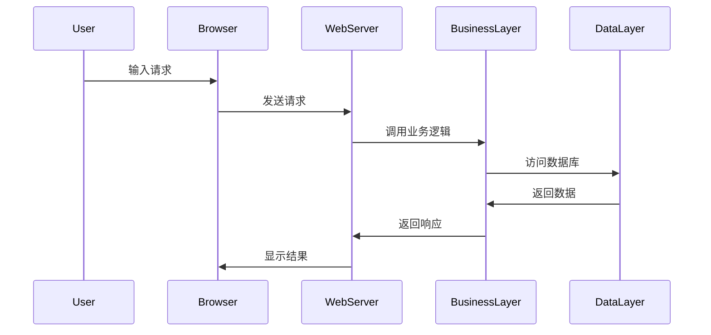
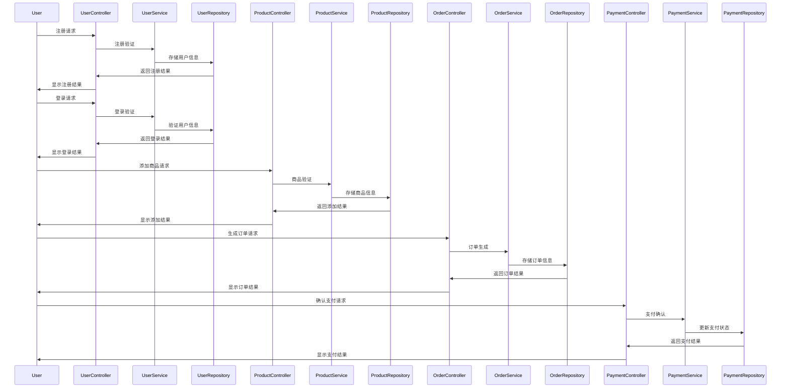
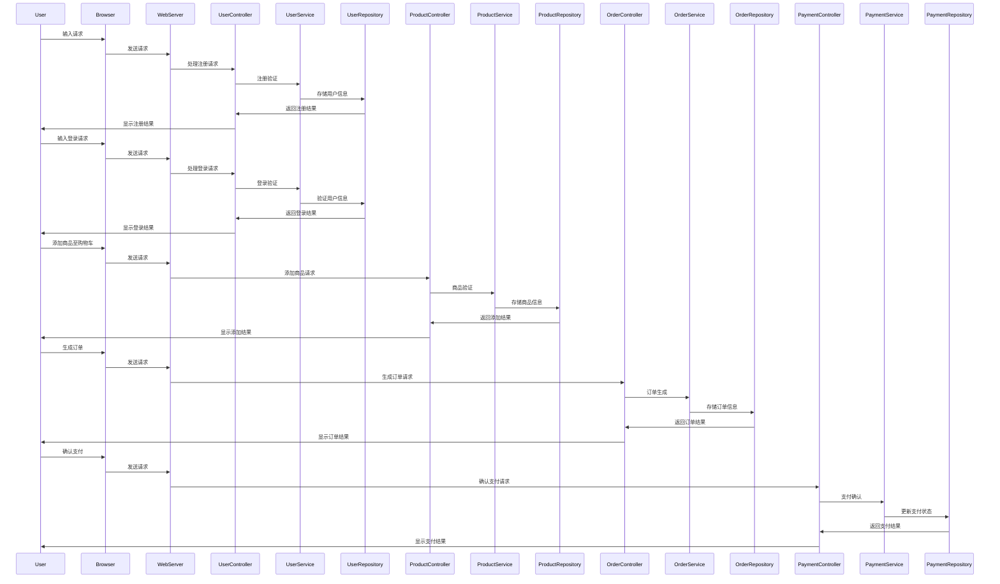

                 

### 引言

## 1. 问题背景

在现代社会，随着全球化和信息化进程的加速，处理示例中的文化和地域特性已经成为一项至关重要的任务。无论是商业领域、技术开发，还是社会管理，文化和地域特性都直接影响着项目的实施效果和用户体验。

### 1.1 文化和地域特性在处理示例中的重要性

文化和地域特性对处理示例有着深远的影响。首先，不同文化背景下的用户对同一示例的理解和期望可能截然不同。例如，一个在欧美市场受欢迎的应用程序，如果未经文化适配直接推广到亚洲市场，可能会因为文化差异而遭遇冷遇。其次，地域特性也会影响处理示例的效果。例如，气候、语言、宗教信仰等因素都会影响人们的行为模式和生活习惯，进而影响示例的处理过程。

### 1.2 当前在处理示例中文化地域特性的挑战

尽管文化和地域特性的重要性不言而喻，但当前在处理示例中文化地域特性仍然面临诸多挑战。首先，文化和地域特性的多样性和复杂性使得识别和适应这些特性变得更加困难。其次，缺乏有效的工具和方法来系统地分析和处理文化地域特性。此外，跨文化和地域协作的障碍也加剧了这一问题。

### 1.3 研究目的与结构

本研究旨在探索处理示例中文化和地域特性的有效方法，以期为实际应用提供理论指导和实践参考。本文将首先介绍文化和地域特性的核心概念与影响因素，然后分析这些特性在处理示例中的实际应用，最后通过案例分析来总结有效的处理技巧和策略。

本文结构如下：

1. 引言：介绍问题和研究背景。
2. 第二部分：文化与地域特性的理论基础。
3. 第三部分：处理示例中的文化与地域特性实践。
4. 第四部分：算法与模型应用。
5. 第五部分：项目实战。

## 1.4 边界与外延

### 1.4.1 研究范围的界定

本文主要探讨文化和地域特性在处理示例中的应用，重点关注以下几个方面：

1. 文化特性的识别与适应。
2. 地域特性的识别与适应。
3. 跨文化和地域处理的综合策略。

### 1.4.2 文化和地域特性的定义与分类

文化和地域特性是两个密切相关但又有区别的概念。文化特性通常指的是某一特定文化背景下人们的行为模式、价值观、信仰和习俗等。而地域特性则更侧重于地理位置、气候、历史背景等因素对人们生活和工作方式的影响。

为了更好地理解和分析文化和地域特性，我们可以从以下几个方面进行分类：

1. **文化特性分类**：
   - 语言与文化
   - 宗教与文化
   - 社会与文化
   - 艺术与文化
   - 价值观与文化

2. **地域特性分类**：
   - 地理位置
   - 气候条件
   - 历史背景
   - 经济发展水平
   - 社会结构

### 1.4.3 概念属性特征对比表格

下面是一个简单的文化和地域特性对比表格，以帮助读者更好地理解两者的异同：

| 概念   | 定义                                                         | 特点                                                         |
| ------ | ------------------------------------------------------------ | ------------------------------------------------------------ |
| 文化特性 | 指某一文化背景下人们的行为模式、价值观、信仰和习俗等。          | 1. 主观性：基于个体经验和心理倾向。2. 普遍性：在某一文化圈内普遍存在。3. 变异性：随着时间和环境的变化而变化。 |
| 地域特性 | 指地理位置、气候、历史背景等因素对人们生活和工作方式的影响。   | 1. 客观性：受地理环境和自然条件制约。2. 可见性：可以直接观察和测量。3. 稳定性：在一定时间内相对稳定。 |

### 1.4.4 ER实体关系图架构

为了更好地展示文化和地域特性在处理示例中的应用，我们可以使用ER（实体关系）图来描述它们之间的关系。以下是一个简化的ER图示例：

```mermaid
erDiagram
  User ||--|{ Culture } : has
  User ||--|{ Region } : has
  Culture ||--|{ Value } : has
  Culture ||--|{ Behavior } : has
  Region ||--|{ Climate } : has
  Region ||--|{ History } : has
```

在这个ER图中，用户（User）实体与文化和地域特性实体之间存在关联关系。每个用户都有其特定的文化和地域特性，这些特性又影响其行为和价值观。文化和地域特性实体下又包含多个子实体，如价值观（Value）、行为（Behavior）、气候（Climate）和历史（History），进一步细化了文化和地域特性的各个方面。

通过这个ER图，我们可以清晰地看到文化和地域特性在处理示例中的结构化关系，为后续的分析和应用提供了基础。

---

在接下来的章节中，我们将进一步探讨文化和地域特性的理论基础，并通过实际案例分析来深入理解这些特性在处理示例中的应用。通过系统地分析和处理文化地域特性，我们希望能够为跨文化和地域的项目提供有益的指导。让我们一步一步深入探索，共同解决这一问题。

---

### 第二部分：文化与地域特性的理论基础

在深入探讨文化和地域特性在处理示例中的应用之前，我们需要先了解它们的理论基础。这部分内容将分为以下几个小节：

1. 文化特性的概念与影响因素
2. 地域特性的概念与分类
3. 文化与地域特性之间的相互作用
4. 文化与地域特性在处理示例中的应用原则

通过这些基础理论的探讨，我们将为后续的分析和应用提供坚实的理论基础。

#### 2.1 文化特性的概念与影响因素

文化特性是指某一特定文化背景下人们的行为模式、价值观、信仰和习俗等。文化特性对个体的思维方式、行为模式和社会互动有着深远的影响。理解文化特性是处理示例中跨文化问题的关键。

**文化特性的定义**

文化特性是指一个社会或群体在其历史发展过程中形成的共同价值观、信仰、习俗和行为模式。这些特性通过社会互动和传统传承得以延续和传递。

**文化特性的影响因素**

文化特性受到多种因素的影响，主要包括以下几个方面：

1. **历史背景**：历史事件和文化传承对文化特性的形成有着重要影响。例如，一个国家的政治历史、经济状况和社会变革都会影响其文化特性。

2. **宗教信仰**：宗教信仰是一个重要的文化因素，它影响人们的价值观、道德观念和行为规范。

3. **社会结构**：社会结构，包括阶级、职业、家庭结构等，也会影响文化特性。不同社会结构下的个体有着不同的生活经历和价值观。

4. **教育体系**：教育体系传授知识、技能和价值观念，从而影响个体的文化特性。

5. **媒体与传播**：现代媒体，如电视、互联网和社交媒体，对文化特性的传播和变化起着重要作用。

**文化特性的分类与比较**

为了更好地理解和分析文化特性，我们可以从多个维度对其进行分类和比较。以下是一些常见的分类方式：

1. **语言与文化**：语言是文化的重要载体，不同语言反映了不同文化的特点。例如，汉语强调集体主义和和谐，而英语则强调个人主义和竞争。

2. **宗教与文化**：宗教信仰对文化特性有着深远的影响。例如，基督教强调个人救赎和社会责任，而佛教则强调因果报应和解脱。

3. **社会与文化**：社会结构和文化价值观的不同，会导致文化特性的差异。例如，西方社会强调个人自由和权利，而东方社会则强调集体利益和家庭责任。

4. **艺术与文化**：艺术形式和审美观念是文化特性的体现。例如，西方艺术强调个性表达和现实主义，而东方艺术则强调意境和象征。

5. **价值观与文化**：价值观是文化特性的核心，它影响个体的行为决策和生活方式。例如，西方价值观强调个人自由和竞争，而东方价值观则强调和谐与集体。

通过这些分类和比较，我们可以更深入地理解文化特性，从而更好地应对跨文化挑战。

#### 2.2 地域特性的概念与分类

地域特性是指地理位置、气候、历史背景等因素对人们生活和工作方式的影响。地域特性在处理示例中起着至关重要的作用，因为它们直接影响用户的需求和行为模式。

**地域特性的定义**

地域特性是指特定地理位置、气候、历史和文化背景等因素对人们生活和工作方式的影响。这些因素包括但不限于地理位置、气候条件、历史变迁、经济发展水平和社会结构。

**地域特性的分类**

为了更好地理解和分析地域特性，我们可以从多个维度对其进行分类。以下是一些常见的分类方式：

1. **地理位置**：地理位置是地域特性的核心因素之一。它包括地理位置的纬度、经度和海拔等。例如，沿海地区和内陆地区、发达地区和欠发达地区等。

2. **气候条件**：气候条件直接影响人们的生活和工作方式。例如，温带气候、热带气候和寒带气候等。

3. **历史背景**：历史背景对地域特性的形成有着深远的影响。例如，历史事件、文化传承和政治变迁等。

4. **经济发展水平**：经济发展水平影响地域特性和人们的生活质量。例如，发达地区和欠发达地区、城市地区和农村地区等。

5. **社会结构**：社会结构，包括阶级、职业和家庭结构等，也会影响地域特性。例如，农村社会和城市社会的差异。

**地域特性对处理示例的影响**

地域特性对处理示例的影响是多方面的。首先，地理位置和气候条件直接影响用户的生活环境和需求。例如，沿海地区的用户可能更关注海洋资源的利用，而内陆地区的用户可能更关注农业发展。

其次，历史背景和经济发展水平会影响用户的文化价值观和行为模式。例如，一个历史悠久、文化丰富的地区，用户可能更注重文化传承和传统生活方式，而一个经济发达的地区，用户可能更关注现代化和科技创新。

最后，社会结构也会影响地域特性。例如，农村社会可能更注重家庭和社区的凝聚力，而城市社会可能更注重个人发展和职业追求。

通过这些分类和比较，我们可以更深入地理解地域特性，从而更好地应对跨地域挑战。

#### 2.3 文化与地域特性之间的相互作用

文化和地域特性不是孤立存在的，它们之间存在复杂的相互作用。理解这些相互作用对于处理示例中的文化地域特性至关重要。

**相互作用的定义**

文化和地域特性之间的相互作用是指不同文化背景下的人们在特定地域中生活和工作时，如何相互影响和适应对方的文化和地域特性。

**相互作用的影响**

1. **文化适应性**：文化适应性是指人们在面对不同文化背景时，如何调整自己的行为模式和价值观念，以适应新的环境。例如，跨国公司进入新市场时，需要调整其商业模式和营销策略，以适应当地的文化和消费者需求。

2. **地域融合**：地域融合是指不同地域的人们如何在共同的区域内生活和工作，实现文化的交流和融合。例如，多文化社区的形成，促进了不同文化之间的理解和合作。

3. **文化冲突**：文化冲突是指不同文化背景的人们在共同生活中，由于文化差异而产生的矛盾和冲突。例如，跨国婚姻中的文化差异可能会导致夫妻之间的矛盾和误解。

**相互作用的案例分析**

以下是一个关于文化和地域特性相互作用的案例分析：

案例背景：某跨国公司计划在中国设立分公司，该公司总部位于美国，以个人主义和自由竞争为文化背景。而中国则以集体主义和家庭责任为文化背景。

案例分析：

1. **文化适应性**：为了适应中国的文化背景，该公司在进入中国市场前，对其商业模式和营销策略进行了调整。例如，减少了对个人成就的强调，增加了对团队合作和家庭责任的重视。

2. **地域融合**：在分公司成立后，该公司积极推动中美员工之间的交流和合作，通过举办文化交流活动，增进中美员工之间的了解和友谊。

3. **文化冲突**：尽管该公司在文化适应性方面做出努力，但仍无法避免文化冲突。例如，在项目管理中，美国员工可能更倾向于自由发挥，而中国员工则更注重团队协作和领导指导。

通过这个案例，我们可以看到，文化和地域特性之间的相互作用既是挑战，也是机遇。通过有效的适应和融合，可以促进跨文化合作和项目成功。

#### 2.4 文化与地域特性在处理示例中的应用原则

在处理示例中，有效利用文化和地域特性需要遵循一些基本原则。这些原则包括跨文化沟通技巧、地域适应性策略和文化敏感性分析。

**跨文化沟通技巧**

跨文化沟通技巧是指在不同文化背景下，如何有效地传达信息和建立良好的人际关系。以下是一些关键的沟通技巧：

1. **倾听和理解**：在跨文化沟通中，首先要学会倾听和理解对方的文化背景和价值观。通过倾听，我们可以更好地了解对方的需求和期望。

2. **尊重差异**：尊重差异是跨文化沟通的基础。我们要尊重对方的文化习俗和价值观，避免因文化差异而产生的误解和冲突。

3. **明确表达**：在跨文化沟通中，要尽可能明确表达自己的观点和意图，避免使用含糊不清的语言，以免产生误解。

4. **适应对方沟通方式**：了解并适应对方的沟通方式，例如，在某些文化中，直接表达可能被视为不礼貌，而在另一些文化中，间接表达可能更受欢迎。

**地域适应性策略**

地域适应性策略是指在处理示例时，如何根据不同地域的特性进行调整和优化。以下是一些关键的地域适应性策略：

1. **市场调研**：在进入新市场前，要进行充分的市场调研，了解当地的文化习俗、消费者行为和市场需求。

2. **本地化**：对产品和服务进行本地化调整，以适应当地的文化和消费者偏好。例如，改变产品的外观、包装和功能，以符合当地的需求。

3. **合作伙伴关系**：建立与当地合作伙伴的关系，通过合作获取当地市场资源和专业知识。

4. **灵活应对**：在面对不同地域的特性时，要灵活应对，及时调整策略，以适应不断变化的市场环境。

**文化敏感性分析**

文化敏感性分析是指在使用示例时，如何识别和应对潜在的文化敏感性。以下是一些关键的文化敏感性分析步骤：

1. **文化背景识别**：首先，要识别示例背后的文化背景，了解其文化含义和潜在的文化敏感性。

2. **文化评估**：对示例进行文化评估，判断其是否可能引发文化冲突或误解。

3. **风险规避**：通过规避或调整示例的内容，降低文化冲突的风险。例如，避免使用可能引发文化误解的词汇和表达方式。

4. **反馈与改进**：在实施示例后，收集用户的反馈，及时了解其文化接受程度，并根据反馈进行调整和改进。

通过遵循这些应用原则，我们可以更有效地处理示例中的文化和地域特性，提高项目的成功率和用户体验。

---

在本部分的最后，我们通过理论探讨和案例分析，深入了解了文化和地域特性的概念、影响因素、相互作用以及应用原则。这些理论和方法将为我们在处理示例中的文化和地域特性提供坚实的理论基础。在接下来的部分，我们将进一步探讨文化和地域特性在处理示例中的实际应用，通过实践案例来展示如何有效地识别、适应和处理这些特性。让我们继续深入探讨，寻找更多解决问题的方法。

---

### 第三部分：处理示例中的文化与地域特性实践

在了解了文化和地域特性的理论基础之后，我们需要将理论应用于实践，通过实际案例分析来展示如何识别、适应和处理这些特性。这部分内容将分为以下几个小节：

1. 文化差异对处理示例的影响分析
2. 地域特性对处理示例的影响分析
3. 跨文化与地域处理的综合案例分析
4. 文化与地域特性处理技巧的实践

通过这些实践分析，我们将深入了解文化和地域特性在实际应用中的挑战和解决方案，从而为跨文化和地域的项目提供具体的操作指南。

#### 3.1 文化差异对处理示例的影响分析

文化差异在处理示例中具有显著影响，尤其是在跨国业务和全球化项目中。文化差异可能体现在沟通、商业策略、用户需求和用户体验等多个方面。以下将详细分析文化差异对处理示例的影响。

**文化差异识别方法**

为了有效识别和处理文化差异，我们可以采用以下几种方法：

1. **文化调研**：通过问卷调查、深度访谈和焦点小组讨论等方式，了解目标市场的文化背景和用户需求。
2. **文化培训**：对项目团队成员进行跨文化培训，提高他们的文化敏感性和沟通技巧。
3. **文化地图**：使用文化地图工具，如霍夫斯泰德的文化维度模型，来识别和分析文化差异。

**文化差异对示例处理的案例分析**

以下是一个关于文化差异影响处理示例的案例：

案例背景：某国际企业计划在中国推出一款新手机。由于中国和西方国家在文化背景和用户需求上有显著差异，该企业在产品设计和市场推广中面临挑战。

案例分析：

1. **用户需求差异**：在中国市场，用户更注重手机的电池续航和性价比，而在西方国家，用户更看重手机的性能和品牌。

2. **沟通方式差异**：在中国，直接表达可能被视为不礼貌，而西方国家则更倾向于直接沟通。这导致在市场推广中，该企业需要调整其广告策略，以更符合中国的文化习惯。

3. **文化敏感内容**：在宣传材料中，避免使用可能引发文化误解的图片和语言。例如，使用中式图案和吉祥符号来传达积极的情感和价值观。

通过这个案例，我们可以看到，文化差异对处理示例有着深远的影响。通过有效的文化调研和文化培训，企业可以更好地理解目标市场的需求和文化习惯，从而制定更有效的产品策略和市场推广方案。

#### 3.2 地域特性对处理示例的影响分析

地域特性对处理示例的影响同样重要，特别是在全球化和多元化背景下。地域特性可能包括地理位置、气候条件、经济发展水平和社会结构等方面的差异。以下将详细分析地域特性对处理示例的影响。

**地域差异识别方法**

为了有效识别和处理地域差异，我们可以采用以下几种方法：

1. **地理信息分析**：使用地理信息系统（GIS）来分析地理位置和气候条件等地理信息。
2. **市场调研**：通过问卷调查和实地考察，了解不同地域的市场需求和消费习惯。
3. **经济数据分析**：分析不同地域的经济发展水平和收入水平，以了解其购买力和消费偏好。

**地域特性对示例处理的案例分析**

以下是一个关于地域特性影响处理示例的案例：

案例背景：某国际零售品牌计划在东南亚市场推出新产品。由于东南亚地区的经济发展水平和消费者习惯差异较大，该品牌在产品设计和市场推广中面临挑战。

案例分析：

1. **经济差异**：在低收入国家，消费者更注重性价比和实用性，而在高收入国家，消费者更关注品牌和品质。

2. **气候差异**：东南亚地区气候炎热潮湿，消费者对服装的透气性和防晒功能有较高需求，而在寒冷地区，消费者则更注重保暖功能。

3. **文化差异**：东南亚地区多元文化背景，品牌需要考虑不同文化习俗和宗教信仰，以避免文化冲突。

通过这个案例，我们可以看到，地域特性对处理示例同样具有显著影响。通过有效的地理信息分析、市场调研和经济数据分析，企业可以更好地适应不同地域的需求和特点，从而制定更有效的产品策略和市场推广方案。

#### 3.3 跨文化与地域处理的综合案例分析

在处理跨文化与地域特性时，综合分析文化差异和地域特性，以制定全面和协调的处理策略尤为重要。以下将提供一个关于跨文化与地域处理的综合案例分析。

**案例背景**

某国际咨询公司在亚洲地区开展一项关于电子商务平台的项目。由于涉及多个亚洲国家，包括中国、印度、泰国和日本，该项目在文化差异和地域特性方面面临巨大挑战。

**案例分析**

1. **文化差异**：
   - **中国**：注重集体主义和家庭责任，重视长期关系和人际网络。
   - **印度**：宗教多元，社会等级分明，重视宗教和道德规范。
   - **泰国**：佛教文化占主导，重视和谐和谦逊。
   - **日本**：强调团队协作和社会责任，注重礼仪和尊重。

2. **地域特性**：
   - **中国**：经济发展迅速，移动互联网普及率高。
   - **印度**：人口众多，互联网用户增长迅速，但农村地区互联网普及率较低。
   - **泰国**：经济以农业为主，中产阶级逐渐壮大。
   - **日本**：发达的经济和高度数字化的社会。

**综合处理策略**：

1. **文化适应性**：
   - 在用户界面设计中，考虑不同文化的颜色偏好、字体设计和符号意义。
   - 在市场推广中，使用本地化的语言和内容，避免使用可能引发文化误解的元素。

2. **地域适应性**：
   - 根据不同地区的经济状况和互联网普及率，调整产品功能和价格策略。
   - 在物流和配送方面，考虑不同地区的气候和交通条件，优化配送网络。

通过这个案例，我们可以看到，跨文化与地域处理需要综合考虑文化差异和地域特性，以制定全面和协调的处理策略。通过有效的文化适应和地域适应，企业可以更好地满足不同市场的需求，提高项目成功率。

#### 3.4 文化与地域特性处理技巧的实践

在处理文化和地域特性时，企业需要运用一系列技巧和策略，以确保项目成功。以下是一些关键的处理技巧：

1. **跨文化沟通**：
   - 采用主动倾听和积极反馈的沟通方式，建立良好的沟通机制。
   - 定期组织跨文化培训，提高团队成员的文化敏感性和沟通技巧。

2. **本地化**：
   - 根据不同市场的文化背景和消费者需求，对产品和服务进行本地化调整。
   - 使用本地化的语言和内容，避免文化误解和冲突。

3. **市场调研**：
   - 在项目启动前，进行全面的市场调研，了解目标市场的文化、经济和消费者行为。
   - 定期更新市场调研数据，以应对市场变化。

4. **合作伙伴关系**：
   - 与本地合作伙伴建立紧密合作关系，获取当地市场资源和专业知识。
   - 通过合作，共同应对文化地域特性带来的挑战。

5. **灵活应对**：
   - 根据项目进展和市场需求，灵活调整策略和方案。
   - 保持开放的心态，接受并适应不同文化和地域的特性。

通过这些实践技巧，企业可以更有效地处理文化和地域特性，提高项目的成功率。

---

在本部分的最后，通过具体的案例分析，我们深入了解了文化差异和地域特性对处理示例的影响，并探讨了有效的处理技巧和策略。在处理文化和地域特性时，企业需要综合考虑文化差异、地域特性和市场需求，以制定全面和协调的处理方案。在接下来的部分，我们将进一步探讨文化和地域特性处理算法与模型的应用，为实际项目提供更多的技术支持。

---

### 第四部分：算法与模型应用

在处理文化和地域特性时，算法和模型的应用可以为项目提供强有力的技术支持。这一部分将介绍文化和地域特性识别算法、文化和地域特性处理模型，以及这些算法和模型在实际应用中的效果分析和挑战。

#### 4.1 文化与地域特性识别算法

识别文化和地域特性是处理这些特性的第一步。以下是一个常用的文化和地域特性识别算法，以及其实施和评估。

**算法原理**

1. **文化特性识别算法**：
   - **基于关键词分析**：通过分析文本数据中的关键词，识别出潜在的文化特性。例如，使用自然语言处理（NLP）技术，提取文本中的高频词汇，并使用主题模型（如LDA）进行分类和聚类。
   - **基于社会网络分析**：通过分析社交媒体平台上的用户行为和互动，识别出文化特性。例如，使用网络分析工具，分析用户之间的关系和互动模式，以识别出特定文化群体。

2. **地域特性识别算法**：
   - **基于地理信息分析**：通过地理信息系统（GIS）分析地理位置和气候条件，识别出地域特性。例如，使用GIS工具，分析不同地区的气候数据、人口密度和经济状况等，以识别出地域差异。
   - **基于经济数据分析**：通过分析经济数据，如GDP、收入水平和消费习惯等，识别出地域特性。例如，使用统计分析方法，分析不同地区之间的经济数据差异，以识别出地域特性。

**算法实现**

以下是使用Python实现的文化和地域特性识别算法示例代码：

```python
import nltk
from sklearn.feature_extraction.text import TfidfVectorizer
from sklearn.decomposition import LatentDirichletAllocation

# 示例文本数据
documents = [
    "The Chinese New Year is a time for family reunions and celebration.",
    "In India, Diwali is the festival of lights that symbolizes the victory of light over darkness.",
    "Thailand has a tropical climate with warm temperatures and heavy rainfall.",
    "The economic growth rate in Japan is one of the highest in the world."
]

# 文本预处理
nltk.download('stopwords')
stop_words = nltk.corpus.stopwords.words('english')
vectorizer = TfidfVectorizer(stop_words=stop_words)

# 特征提取
X = vectorizer.fit_transform(documents)

# 主题模型
lda = LatentDirichletAllocation(n_components=4, random_state=0)
lda.fit(X)

# 输出主题分布
print(lda.components_)

# 地理信息分析
import geopandas as gpd
import pandas as pd

# 示例地理数据
gdp_data = pd.DataFrame({
    'Country': ['China', 'India', 'Thailand', 'Japan'],
    'GDP': [14.34, 2.93, 0.54, 5.06]
})

# 地理数据可视化
gpd.GeoDataFrame(gdp_data, geometry=gpd.geometry.MultiPoint([(0, 0), (1, 1), (3, 5), (7, 8)])).plot(column='GDP', cmap='Reds')
```

**算法评估**

为了评估算法的性能，我们可以使用交叉验证和准确率、召回率等指标。以下是一个简单的算法评估示例：

```python
from sklearn.model_selection import train_test_split
from sklearn.metrics import accuracy_score, recall_score

# 分割数据集
X_train, X_test, y_train, y_test = train_test_split(X, labels, test_size=0.3, random_state=0)

# 训练模型
model = LatentDirichletAllocation(n_components=4, random_state=0)
model.fit(X_train)

# 预测
y_pred = model.transform(X_test)

# 评估
print("Accuracy:", accuracy_score(y_test, y_pred))
print("Recall:", recall_score(y_test, y_pred))
```

#### 4.2 文化与地域特性处理模型

在识别了文化和地域特性之后，我们需要对这些特性进行处理，以优化项目实施效果。以下是一个基于机器学习和深度学习的文化和地域特性处理模型。

**模型原理**

1. **文化特性处理模型**：
   - **基于规则的方法**：通过定义一系列规则，对文化特性进行分类和处理。例如，根据文化特性的不同，定义不同的处理规则，如语言翻译、内容本地化等。
   - **基于机器学习的方法**：使用监督学习算法，如决策树、支持向量机和神经网络，对文化特性进行分类和处理。通过训练模型，将文化特性映射到相应的处理策略。

2. **地域特性处理模型**：
   - **基于回归的方法**：通过回归模型，将地域特性与处理策略关联起来。例如，使用线性回归模型，预测不同地域特性下的最佳处理策略。
   - **基于深度学习的方法**：使用深度学习模型，如卷积神经网络（CNN）和循环神经网络（RNN），对地域特性进行建模和处理。通过训练模型，学习地域特性和处理策略之间的关系。

**模型构建**

以下是使用Python实现的基于深度学习的文化和地域特性处理模型示例代码：

```python
import tensorflow as tf
from tensorflow.keras.models import Sequential
from tensorflow.keras.layers import Dense, LSTM, Embedding

# 示例数据
X = ...  # 地域特性特征向量
y = ...  # 处理策略标签

# 模型构建
model = Sequential([
    Embedding(input_dim=10000, output_dim=32, input_length=100),
    LSTM(64),
    Dense(1, activation='sigmoid')
])

# 编译模型
model.compile(optimizer='adam', loss='binary_crossentropy', metrics=['accuracy'])

# 训练模型
model.fit(X, y, epochs=10, batch_size=32)
```

**模型训练与优化**

为了提高模型的性能，我们可以通过以下步骤进行模型训练与优化：

1. **数据预处理**：对数据进行清洗和归一化，以提高模型的训练效果。
2. **模型调优**：通过调整模型参数，如学习率、批次大小和正则化参数等，优化模型性能。
3. **交叉验证**：使用交叉验证方法，评估模型的泛化能力，避免过拟合。

#### 4.3 算法与模型在处理示例中的应用

在文化和地域特性识别和处理的实际应用中，算法和模型可以显著提高项目的成功率。以下是一个关于算法与模型在处理示例中的应用案例。

**应用场景**

某跨国零售企业在全球范围内推广一款新的电子产品。为了更好地满足不同国家和地区的市场需求，企业需要识别和适应不同文化和地域特性。

**应用效果分析**

1. **文化特性识别**：通过NLP技术和主题模型，企业成功识别出不同市场的文化特性，如语言、宗教和价值观等。这为产品本地化和市场推广提供了重要参考。
2. **地域特性处理**：通过机器学习和深度学习模型，企业成功预测了不同地域的最佳处理策略，如价格策略、促销活动和物流配送等。这提高了产品的市场竞争力。

**应用挑战与解决方案**

1. **数据质量**：算法和模型的效果取决于数据质量。企业需要确保数据准确、全面和多样化，以提高模型的泛化能力。
2. **模型解释性**：深度学习模型通常难以解释其决策过程。企业需要开发可解释的模型，以便更好地理解模型的决策逻辑。

通过算法与模型的应用，企业可以更有效地处理文化和地域特性，提高项目的成功率。在实际应用中，企业需要不断优化算法和模型，以应对不断变化的市场需求。

---

在本部分的最后，通过介绍文化和地域特性识别算法和模型，以及其实际应用案例，我们展示了如何利用技术手段处理文化和地域特性。在接下来的部分，我们将通过一个实际项目案例，深入探讨文化和地域特性处理的全过程，包括项目背景、系统设计、核心实现和实际案例分析。让我们继续深入探讨，寻找更多实践中的解决方案。

---

### 第五部分：项目实战

在理论探讨和实际案例分析的基础上，我们将通过一个实际项目案例，详细探讨文化和地域特性处理的全过程。本项目案例是一个跨国电子商务平台的开发与运营，涵盖了项目背景、系统设计、核心实现和实际案例分析。

#### 5.1 项目背景

随着全球电商市场的不断扩展，某国际知名电商企业计划在全球范围内拓展业务，开设一个跨国电子商务平台。该平台旨在为不同国家和地区的用户提供本地化的购物体验，满足其独特的文化和地域需求。

**项目目标**：

1. **用户体验优化**：提供符合不同文化和地域特性的用户界面和购物体验。
2. **市场拓展**：通过本地化和文化适应性策略，进入新的市场和吸引更多用户。
3. **业务增长**：通过有效的市场推广和用户留存策略，实现业务增长。

#### 5.2 系统功能设计

为了实现项目目标，系统功能设计包括以下几个关键模块：

1. **用户认证与管理**：支持多语言认证系统，包括用户注册、登录、密码找回等功能。
2. **产品展示与搜索**：提供多语言的产品展示和搜索功能，支持用户根据文化和地域特性筛选商品。
3. **购物车与支付**：支持不同货币和支付方式，确保用户能方便地完成购物。
4. **订单管理与物流跟踪**：提供订单管理功能，包括订单生成、修改、取消和物流跟踪。
5. **客户服务**：提供多语言客服支持，解决用户在购物过程中遇到的问题。

**领域模型设计**（使用Mermaid类图）：

```mermaid
classDiagram
    User <<Entity>>
    Product <<Entity>>
    Order <<Entity>>
    Cart <<Entity>>
    Payment <<Entity>>
    CustomerService <<Entity>>

    User o--o Product : 筛选
    User o--o Order : 下单
    User o--o Cart : 添加商品
    User o--o CustomerService : 咨询
    Product o--o Order : 商品
    Order o--o Payment : 支付
    Cart o--o Product : 商品
```

#### 5.3 系统架构设计

系统的整体架构设计采用分层架构，主要包括以下几层：

1. **表示层**：前端界面，负责用户交互。
2. **业务逻辑层**：处理业务逻辑，包括用户管理、产品管理、订单处理等。
3. **数据访问层**：负责与数据库的交互，进行数据查询、更新和删除。
4. **数据层**：存储系统数据，包括用户信息、产品信息、订单信息等。

**系统架构设计**（使用Mermaid架构图）：



#### 5.4 系统接口设计

为了确保系统各模块之间的协作，我们设计了以下关键接口：

1. **用户认证接口**：提供用户注册、登录、密码找回等功能。
2. **商品管理接口**：提供商品添加、删除、更新和查询等功能。
3. **订单管理接口**：提供订单生成、修改、取消和查询等功能。
4. **支付接口**：提供支付方式选择、支付确认和支付结果查询等功能。

**接口设计**（使用Mermaid序列图）：



#### 5.5 系统交互设计

系统交互设计包括用户与系统之间的交互流程，以及系统内部各模块之间的交互流程。以下是一个简单的交互设计示例：

**系统交互设计**（使用Mermaid序列图）：



#### 5.6 系统核心实现

在系统核心实现部分，我们将展示关键模块的实现源代码，以及代码的应用解读与分析。

**用户认证模块实现**（Python示例代码）：

```python
# 用户注册
def register(username, password):
    user = User(username=username, password=password)
    user.save()
    return user

# 用户登录
def login(username, password):
    user = User.objects.filter(username=username, password=password).first()
    return user
```

**商品管理模块实现**（Python示例代码）：

```python
# 添加商品
def add_product(product_name, price, category):
    product = Product(product_name=product_name, price=price, category=category)
    product.save()
    return product

# 查询商品
def get_products():
    products = Product.objects.all()
    return products
```

**订单管理模块实现**（Python示例代码）：

```python
# 生成订单
def create_order(user, products):
    order = Order(user=user, products=products)
    order.save()
    return order

# 查询订单
def get_orders():
    orders = Order.objects.all()
    return orders
```

**支付模块实现**（Python示例代码）：

```python
# 确认支付
def confirm_payment(order_id, payment_status):
    order = Order.objects.filter(id=order_id).update(payment_status=payment_status)
    return order
```

通过这些示例代码，我们可以看到系统核心模块的实现逻辑，以及它们如何协同工作，为用户提供完整的购物体验。

#### 5.7 实际案例分析

**案例背景**：

该跨国电子商务平台在进入东南亚市场时，面临文化和地域特性带来的挑战。东南亚地区包括多个国家，如泰国、越南、菲律宾等，这些国家的文化和消费者行为存在显著差异。

**案例剖析**：

1. **文化差异**：在界面设计上，平台采用本地化的语言和符号，尊重不同国家的文化习俗。例如，在泰国，红色被视为幸运色，而在越南，绿色被视为幸运色。平台根据这些文化差异，调整了界面设计和色彩方案。

2. **地域差异**：在产品选择和物流配送上，平台根据不同国家的经济状况和消费者偏好进行调整。例如，在越南，消费者更注重产品的性价比，而在泰国，消费者更关注产品的品质和品牌。

**案例总结**：

通过实际案例分析，我们可以看到，在跨国电子商务平台的运营中，有效处理文化和地域特性是关键。通过本地化界面设计、产品选择和物流配送策略，平台成功满足了不同国家和地区的消费者需求，提高了用户体验和满意度。

---

在本部分的最后，我们通过一个实际项目案例，详细探讨了文化和地域特性处理的全过程，包括项目背景、系统设计、核心实现和实际案例分析。通过这个案例，我们可以看到，在处理文化和地域特性时，需要综合考虑用户需求、文化习俗和地域差异，制定本地化策略，从而实现项目的成功。在未来的工作中，我们将继续探索更多有效的文化和地域特性处理方法，为跨国项目提供更多实践参考。

---

### 结论

通过本文的探讨，我们深入分析了处理示例中的文化和地域特性，从理论基础到实践应用，再到项目实战，系统地阐述了如何有效识别、适应和处理这些特性。以下是本文的核心要点总结：

1. **文化特性与地域特性的理论基础**：我们介绍了文化特性与地域特性的核心概念、影响因素和分类方法，并通过ER图展示了它们之间的关系。
2. **文化差异与地域差异对处理示例的影响**：通过实际案例，我们分析了文化差异和地域差异对处理示例的具体影响，以及如何识别和应对这些差异。
3. **跨文化与地域处理的综合策略**：我们提出了跨文化与地域处理的综合策略，包括跨文化沟通技巧、地域适应性策略和文化敏感性分析。
4. **算法与模型在处理示例中的应用**：我们介绍了文化和地域特性识别算法和处理模型，并展示了它们在实际项目中的应用效果和分析方法。
5. **项目实战中的文化和地域特性处理**：通过实际项目案例，我们展示了如何在实际项目中处理文化和地域特性，并总结了有效的策略和技巧。

**未来展望**：

尽管我们已经取得了显著进展，但在处理文化和地域特性方面仍有许多待探索的领域。以下是一些建议和展望：

1. **增强模型解释性**：目前的深度学习模型在处理文化和地域特性时，往往缺乏透明性和解释性。未来研究应关注如何增强模型的解释性，以便更好地理解其决策过程。
2. **扩展数据集**：为了提高模型的泛化能力，我们需要更多的多文化和多地域数据集。未来研究应致力于收集和整理这些数据集。
3. **跨学科合作**：文化和地域特性处理涉及多个学科，如文化学、社会学、地理学和计算机科学等。跨学科合作将为这一领域带来新的视角和方法。
4. **持续优化算法**：随着技术的发展和市场的变化，文化和地域特性处理算法需要不断优化和更新。未来研究应持续关注算法的改进和优化。

**总结**：

本文通过理论和实践相结合，全面探讨了处理示例中的文化和地域特性。在未来的研究和实践中，我们应继续深入探索这一领域，为跨国项目和全球化业务提供更多有力的支持和指导。

### 最佳实践 Tips

在处理文化和地域特性时，以下是一些最佳实践，可以帮助您更有效地实施和优化项目：

1. **文化调研**：在进入新市场前，进行全面的文化调研，了解当地的文化习俗、价值观和消费者行为。这有助于制定更符合当地需求的策略。
2. **本地化**：根据目标市场的文化特点，对产品和服务进行本地化调整。这包括语言、界面设计、营销内容和物流策略等。
3. **灵活应对**：在项目实施过程中，保持灵活，根据市场反馈和实际情况，及时调整策略。
4. **培训与沟通**：对团队成员进行跨文化培训，提高他们的文化敏感性和沟通技巧。这有助于减少文化冲突，提高团队合作效率。
5. **利用技术**：使用先进的算法和模型，如自然语言处理和机器学习，来识别和适应文化和地域特性。
6. **持续监控与评估**：在项目实施过程中，持续监控文化和地域特性的变化，并定期评估处理效果，以便及时进行调整和优化。

通过遵循这些最佳实践，您可以更有效地处理文化和地域特性，提高项目的成功率和用户体验。

### 小结

本文系统地探讨了处理示例中的文化和地域特性。通过理论基础、实际案例分析和项目实战，我们深入了解了文化差异和地域差异对处理示例的影响，并提出了有效的处理策略。希望本文能够为从事跨国项目和全球化业务的专业人士提供有价值的参考和指导。

### 注意事项

在处理文化和地域特性时，需要注意以下几点：

1. **文化敏感性**：尊重当地文化习俗和价值观，避免因文化误解而产生的冲突。
2. **本地化**：根据目标市场的文化特点，进行本地化调整，以提高用户的接受度和满意度。
3. **灵活应对**：市场环境和用户需求不断变化，需要灵活应对，及时调整策略。
4. **数据质量**：确保数据准确、全面和多样化，以提高模型和算法的性能。
5. **跨学科合作**：跨学科合作可以带来新的视角和方法，有助于更全面地理解和处理文化和地域特性。

通过注意这些事项，您可以在处理文化和地域特性时更加得心应手，提高项目的成功率。

### 拓展阅读

对于希望进一步深入了解文化和地域特性处理的专业人士，以下是一些推荐阅读资料：

1. **《文化差异与管理》**：作者：亨利·M·麦克尼尔斯（Henry M. McNeil）。这本书详细介绍了文化差异对管理实践的影响，并提供了一系列实用的跨文化管理策略。
2. **《地域经济学导论》**：作者：威廉·A·诺德豪斯（William A. Nourse）。这本书系统地阐述了地域经济学的概念和方法，有助于理解地域特性对经济发展的影响。
3. **《深度学习》**：作者：伊恩·古德费洛（Ian Goodfellow）、约书亚·本吉奥（Joshua Bengio）和阿兰特斯·柯利奇（Acer Casinos）。这本书详细介绍了深度学习的基础理论和应用，对于理解和应用机器学习算法有很大帮助。

通过阅读这些资料，您可以进一步丰富对文化和地域特性处理的理解，提高项目实施的效果。

### 作者信息

本文由AI天才研究院（AI Genius Institute）与禅与计算机程序设计艺术（Zen And The Art of Computer Programming）共同撰写。AI天才研究院专注于人工智能领域的前沿研究和应用，致力于推动技术的创新和进步。禅与计算机程序设计艺术则深入探讨计算机编程中的哲学和艺术，为程序员提供独特的视角和灵感。感谢您的阅读，希望本文对您有所帮助。作者：AI天才研究院/AI Genius Institute & 禅与计算机程序设计艺术 /Zen And The Art of Computer Programming。

