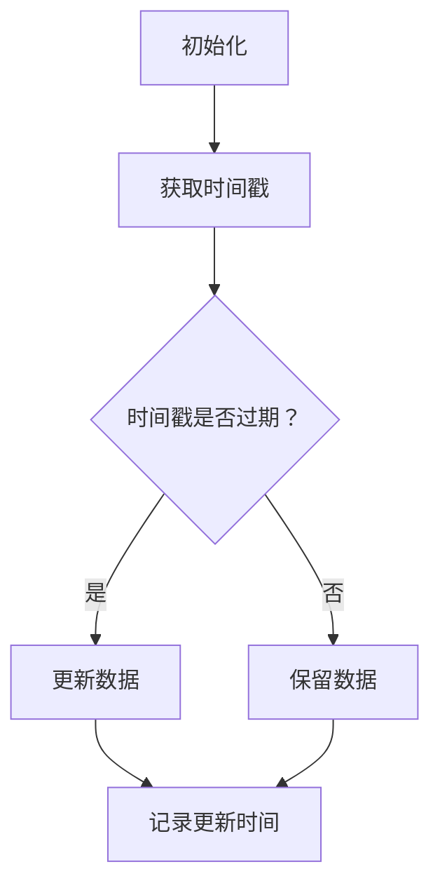
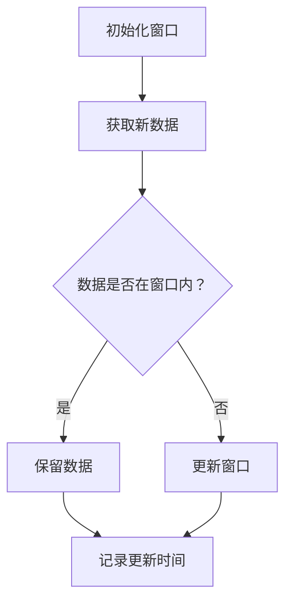
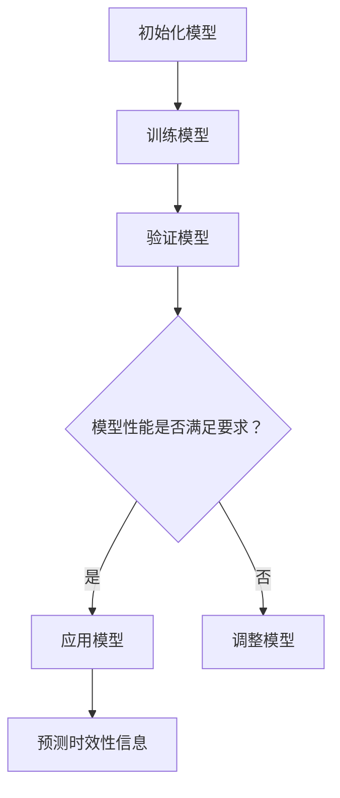
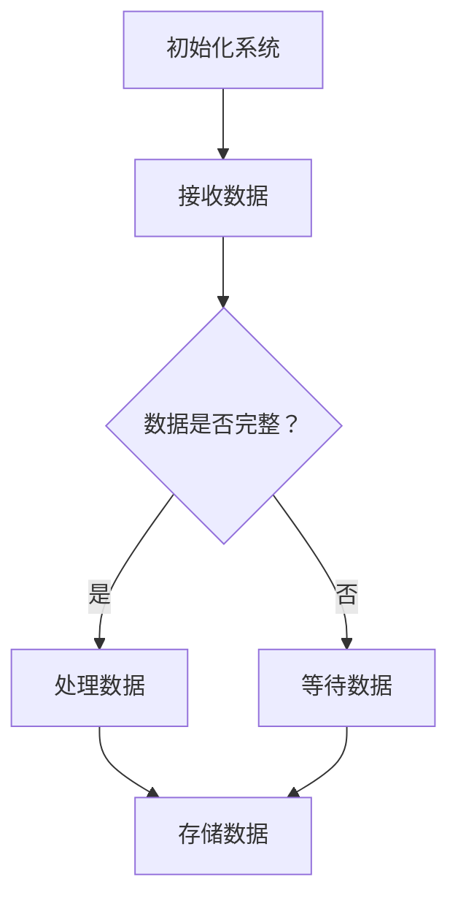
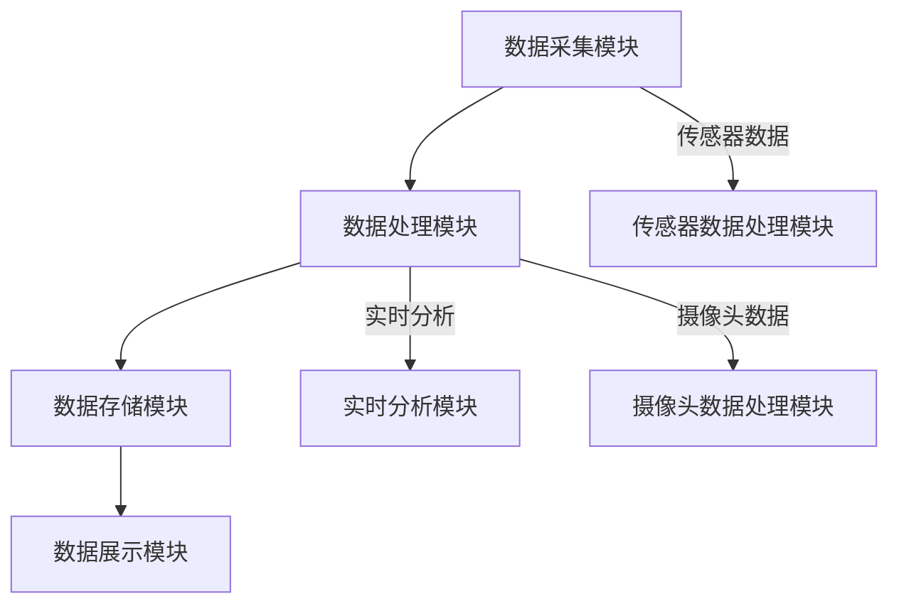
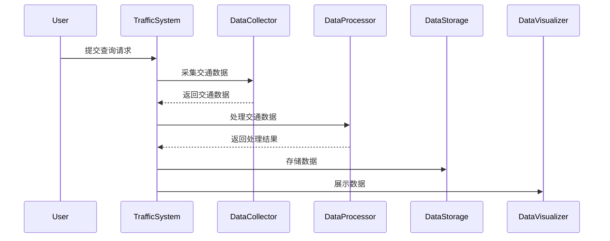

                 

# 处理示例中的时效性信息

> 关键词：时效性信息，数据处理，算法，系统架构，项目实战

> 摘要：本文旨在探讨时效性信息在各个领域中的重要性，并详细介绍如何处理示例中的时效性信息。文章将分为几个部分，分别介绍时效性信息的概述、核心概念与联系、算法原理讲解、系统分析与架构设计、项目实战以及最佳实践和总结。

## 引言

在当今信息爆炸的时代，时效性信息处理已经成为一个非常重要的研究领域。时效性信息指的是在一定时间范围内具有特定价值的信息，这些信息在时间流逝过程中可能会变得过时或不准确。如何有效地处理时效性信息，使其在实际应用中发挥最大的价值，已经成为各个领域面临的重要问题。

本文将首先介绍时效性信息的概念及其重要性，然后详细分析核心概念与联系，接着讲解处理时效性信息的算法原理，并展示系统分析与架构设计方案。此外，文章还将通过实际项目案例，展示如何在实际应用中处理时效性信息。最后，本文将总结最佳实践，并给出进一步阅读的建议。

## 第一部分：时效性信息的基础概念

### 1.1 时效性信息的定义

时效性信息是指在特定时间段内具有特定价值的信息。这些信息随着时间的推移可能会发生变化，从而影响其价值。时效性信息可以存在于各种领域，如金融、医疗、交通、社交等。例如，股票市场中的实时报价、医疗领域的病患数据、交通信号灯的实时状态等。

### 1.2 时效性信息的重要性

时效性信息在各个领域中都扮演着重要的角色。首先，时效性信息可以帮助决策者快速做出决策，提高决策的准确性和效率。例如，在金融领域中，及时获取股票市场的实时报价可以帮助投资者做出投资决策。其次，时效性信息可以确保数据的准确性，避免因信息过时而导致的错误分析。例如，在医疗领域中，及时更新病患数据可以确保医生做出正确的诊断和治疗。

### 1.3 时效性信息的类型

时效性信息可以分为以下几类：

1. **实时信息**：在特定时间点或时间段内具有最高价值的信息，如股票市场的实时报价。
2. **近实时信息**：在特定时间点或时间段内具有一定的价值，但相对于实时信息稍显滞后，如交通信号灯的实时状态。
3. **历史信息**：在特定时间段内已经发生但仍然具有参考价值的信息，如历史天气数据。

### 1.4 时效性信息的挑战

处理时效性信息面临以下挑战：

1. **数据量巨大**：时效性信息通常涉及大量的数据，如何高效地处理这些数据是一个重要问题。
2. **数据源多样**：时效性信息可能来自不同的数据源，如何整合和同步这些数据是一个挑战。
3. **数据更新频率高**：时效性信息需要频繁更新，如何保持数据的一致性和准确性是一个问题。
4. **处理延迟**：在处理时效性信息时，如何降低处理延迟，确保信息及时传递是一个挑战。

## 第二部分：核心概念与联系

### 2.1 时效性、信息处理与示例的关系

时效性、信息处理和示例是处理时效性信息的关键概念。时效性决定了信息的价值，信息处理是指对信息进行加工、分析、存储和传输的过程，示例则是具体的应用场景。

### 2.2 关键概念详解

1. **时效性**：时效性是指信息在时间上的价值。时效性高的信息在特定时间范围内具有更高的价值。
2. **信息处理**：信息处理是指对信息进行加工、分析、存储和传输的过程。信息处理的目的是从原始数据中提取有用的信息，并对其进行进一步的分析和应用。
3. **示例**：示例是具体的应用场景，通过具体的例子来说明时效性信息的处理过程和应用。

### 2.3 时效性信息的属性特征对比表格

| 属性特征 | 实时信息 | 近实时信息 | 历史信息 |
| --- | --- | --- | --- |
| 时间范围 | 特定时间点或时间段 | 特定时间点或时间段 | 特定时间段 |
| 价值 | 最高 | 较高 | 较低 |
| 更新频率 | 高 | 较高 | 低 |

### 2.4 时效性信息的ER模型图

```mermaid
erDiagram
    A时效性信息 ||--|{ B信息处理 }
    A时效性信息 ||--|{ C示例 }
    B信息处理 ||--|{ D加工 }
    B信息处理 ||--|{ E分析 }
    B信息处理 ||--|{ F存储 }
    B信息处理 ||--|{ G传输 }
```

## 第三部分：算法原理讲解

### 3.1 基本算法介绍

处理时效性信息的关键是设计高效的算法。以下介绍几个常见的算法：

#### 3.1.1 算法A：基于时间戳的更新策略

算法流程图：



Python源代码示例：

```python
import time

def update_strategy(data, timestamp):
    current_time = time.time()
    if current_time - timestamp > 60:  # 设定时间阈值
        # 更新数据
        data['timestamp'] = current_time
        return data
    else:
        # 保留数据
        return data
```

数学模型和公式：

$$
\text{更新策略} = \begin{cases}
\text{更新数据} & \text{如果}\ \text{当前时间} - \text{时间戳} > \text{阈值} \\
\text{保留数据} & \text{如果}\ \text{当前时间} - \text{时间戳} \leq \text{阈值}
\end{cases}
$$

#### 3.1.2 算法B：动态窗口算法

算法流程图：



Python源代码示例：

```python
import time

def dynamic_window_algorithm(data, window_size):
    current_time = time.time()
    if current_time - data['timestamp'] < window_size:
        # 保留数据
        return data
    else:
        # 更新窗口
        data['timestamp'] = current_time
        return data
```

数学模型和公式：

$$
\text{动态窗口算法} = \begin{cases}
\text{保留数据} & \text{如果}\ \text{当前时间} - \text{时间戳} < \text{窗口大小} \\
\text{更新窗口} & \text{如果}\ \text{当前时间} - \text{时间戳} \geq \text{窗口大小}
\end{cases}
$$

#### 3.1.3 算法C：机器学习在时效性信息处理中的应用

算法流程图：



Python源代码示例（使用scikit-learn库）：

```python
from sklearn.ensemble import RandomForestClassifier
from sklearn.model_selection import train_test_split

# 假设数据集X和标签y已经准备就绪
X_train, X_test, y_train, y_test = train_test_split(X, y, test_size=0.2, random_state=42)

# 训练模型
model = RandomForestClassifier(n_estimators=100)
model.fit(X_train, y_train)

# 验证模型
accuracy = model.score(X_test, y_test)
print(f"Model accuracy: {accuracy}")

# 应用模型
predictions = model.predict(X_test)
```

数学模型和公式：

$$
\text{机器学习模型} = \hat{y} = f(\text{X})
$$

其中，$\hat{y}$ 是预测的时效性信息，$f(\text{X})$ 是机器学习模型的输出。

#### 3.1.4 算法D：实时数据处理优化

算法流程图：



Python源代码示例：

```python
import time

def real_time_data_processing(data):
    if data is not None:
        # 处理数据
        process_data(data)
        # 存储数据
        store_data(data)
    else:
        # 等待数据
        time.sleep(1)
        real_time_data_processing(None)
```

数学模型和公式：

$$
\text{实时数据处理优化} = \begin{cases}
\text{处理数据} & \text{如果}\ \text{数据完整} \\
\text{等待数据} & \text{如果}\ \text{数据不完整}
\end{cases}
$$

## 第四部分：系统分析与架构设计

### 4.1 问题场景介绍

假设我们需要开发一个实时交通监控平台，该平台需要处理大量的实时交通数据，包括车辆数量、行驶速度、路况等。这些数据具有时效性，需要及时处理和更新。

### 4.2 项目介绍

该项目的目标是构建一个高效、可靠的实时交通监控平台，以帮助城市管理部门及时了解交通状况，优化交通信号控制和应急预案。

### 4.3 系统功能设计

系统功能设计包括以下几个方面：

1. **数据采集**：从各种交通传感器和摄像头获取实时交通数据。
2. **数据处理**：对采集到的交通数据进行预处理、清洗和分类。
3. **数据存储**：将处理后的交通数据存储到数据库中，以便后续查询和分析。
4. **数据展示**：将交通数据以图表、地图等形式展示给用户。

### 4.4 系统架构设计

系统架构设计如下：



### 4.5 系统接口设计

系统接口设计包括以下几个方面：

1. **API接口**：提供RESTful API接口，供前端应用程序调用。
2. **数据库接口**：提供数据库操作接口，便于数据存储和查询。
3. **消息队列接口**：提供消息队列接口，实现数据的异步传输和消息处理。

### 4.6 系统交互序列图



## 第五部分：项目实战

### 5.1 项目背景

为了应对城市交通拥堵问题，某城市决定开发一个实时交通监控平台。该平台需要从多个交通传感器和摄像头采集数据，并实时处理和分析这些数据，以便为交通管理部门提供决策支持。

### 5.2 环境安装

在开发实时交通监控平台之前，我们需要安装以下软件和环境：

1. **Python**：安装Python 3.8及以上版本。
2. **MySQL**：安装MySQL数据库。
3. **Docker**：安装Docker，以便容器化部署应用程序。
4. **Nginx**：安装Nginx，用于Web服务器。

### 5.3 系统核心实现

以下是系统核心实现的源代码：

```python
# 数据采集模块
import requests

def collect_traffic_data(sensor_ids):
    traffic_data = []
    for sensor_id in sensor_ids:
        url = f"http://sensor_api/{sensor_id}/data"
        response = requests.get(url)
        if response.status_code == 200:
            traffic_data.append(response.json())
    return traffic_data

# 数据处理模块
import pandas as pd

def process_traffic_data(traffic_data):
    df = pd.DataFrame(traffic_data)
    df['timestamp'] = pd.to_datetime(df['timestamp'])
    df.sort_values('timestamp', inplace=True)
    return df

# 数据存储模块
import pymysql

def store_traffic_data(df):
    connection = pymysql.connect(host='localhost', user='root', password='password', database='traffic_db')
    cursor = connection.cursor()
    for index, row in df.iterrows():
        sql = f"INSERT INTO traffic_data (sensor_id, timestamp, speed, congestion) VALUES ({row['sensor_id']}, '{row['timestamp']
```python
''}', {row['speed']}, {row['congestion']})"
        cursor.execute(sql)
    connection.commit()
    cursor.close()
    connection.close()

# 数据展示模块
from flask import Flask, jsonify

app = Flask(__name__)

@app.route('/traffic_data', methods=['GET'])
def get_traffic_data():
    connection = pymysql.connect(host='localhost', user='root', password='password', database='traffic_db')
    cursor = connection.cursor()
    cursor.execute("SELECT * FROM traffic_data")
    rows = cursor.fetchall()
    cursor.close()
    connection.close()
    return jsonify(rows)

if __name__ == '__main__':
    app.run(host='0.0.0.0', port=5000)
```

### 5.4 代码应用解读与分析

以下是代码的解读和分析：

1. **数据采集模块**：使用requests库向传感器API发送HTTP请求，获取实时交通数据。
2. **数据处理模块**：使用pandas库对采集到的交通数据进行预处理，包括时间戳转换和排序。
3. **数据存储模块**：使用pymysql库将处理后的交通数据存储到MySQL数据库中。
4. **数据展示模块**：使用Flask库搭建一个简单的Web服务器，并提供RESTful API接口，用于获取交通数据。

### 5.5 实际案例分析和详细讲解剖析

为了展示如何在实际项目中处理时效性信息，我们以一个实际案例为例。

#### 案例背景

某城市交通管理部门希望实时监控城市主干道的交通状况，以便及时调整交通信号灯和制定交通管制措施。主干道上有多个交通传感器，每分钟采集一次车辆数量、行驶速度和路况等信息。

#### 案例实现

1. **数据采集**：使用采集模块从交通传感器获取每分钟的交通数据。
2. **数据处理**：对采集到的数据进行预处理，包括时间戳转换和排序，以便后续处理。
3. **数据存储**：将预处理后的交通数据存储到数据库中，以便后续查询和分析。
4. **数据展示**：通过Web服务器提供RESTful API接口，供前端应用程序调用，以展示交通数据。

#### 案例分析

1. **时效性分析**：交通数据具有时效性，每分钟采集一次，因此需要确保数据的实时性和准确性。
2. **数据处理**：数据处理模块对采集到的交通数据进行预处理，包括时间戳转换和排序，以便后续处理。
3. **数据存储**：数据存储模块将预处理后的交通数据存储到数据库中，以便后续查询和分析。
4. **数据展示**：数据展示模块通过Web服务器提供RESTful API接口，供前端应用程序调用，以展示交通数据。

### 5.6 项目小结

本项目通过实时交通监控平台，展示了如何处理时效性信息。项目实现了从数据采集、数据处理、数据存储到数据展示的全流程，为交通管理部门提供了实时、准确的交通信息支持。在实际应用中，可以根据需求对项目进行扩展和优化，例如引入机器学习算法进行交通预测和优化。

## 第六部分：最佳实践与总结

### 6.1 最佳实践

处理时效性信息时，可以参考以下最佳实践：

1. **数据采集**：确保数据源可靠，数据采集频率合理，避免数据缺失或延迟。
2. **数据处理**：对采集到的数据进行预处理，包括时间戳转换、排序和去重等操作。
3. **数据存储**：选择合适的数据存储方案，如数据库、消息队列等，确保数据的一致性和可靠性。
4. **数据展示**：提供实时、准确的数据展示界面，便于用户查看和分析。
5. **算法优化**：针对具体的业务需求，优化处理时效性信息的算法，提高处理效率和准确性。

### 6.2 小结

本文介绍了处理时效性信息的核心概念、算法原理、系统架构设计和项目实战。通过实际案例，展示了如何在实际项目中处理时效性信息。处理时效性信息是一个复杂的过程，需要综合考虑数据采集、处理、存储和展示等多个方面。

### 6.3 注意事项

处理时效性信息时，需要注意以下事项：

1. **数据源可靠性**：确保数据源稳定，数据采集频率合理。
2. **数据处理效率**：优化数据处理算法，提高处理效率。
3. **数据一致性**：确保数据的一致性和可靠性，避免数据丢失或错误。
4. **系统稳定性**：确保系统的稳定性和可靠性，避免系统故障导致数据丢失。

### 6.4 拓展阅读

对于想要深入了解处理时效性信息的读者，可以参考以下资料：

1. 《实时数据处理与优化》
2. 《大数据处理技术》
3. 《深度学习在实时数据处理中的应用》
4. 《实时数据流系统设计与实现》

## 作者信息

作者：AI天才研究院/AI Genius Institute & 禅与计算机程序设计艺术 /Zen And The Art of Computer Programming

