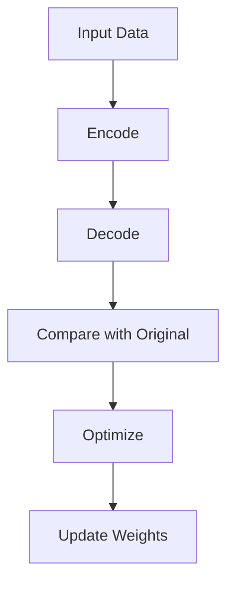
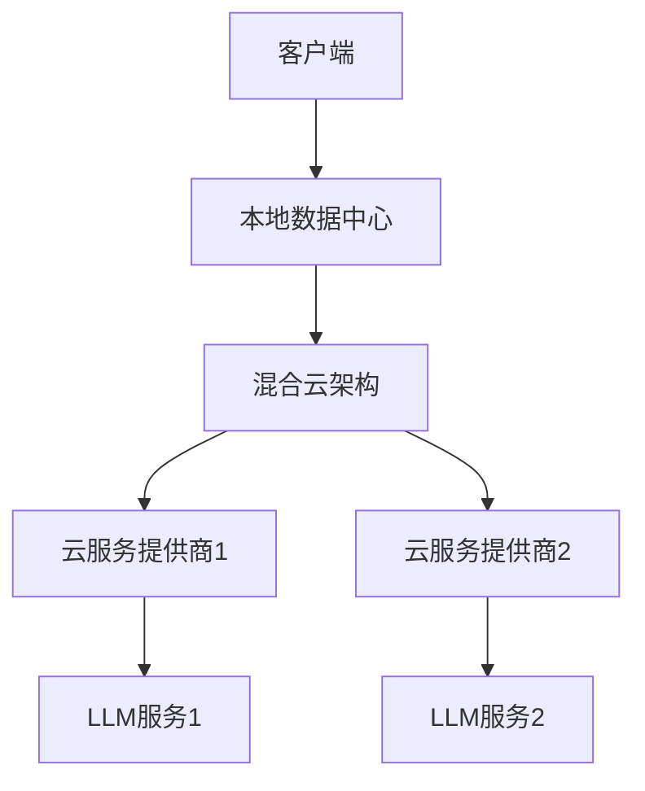

                 

### 引言——多云策略概述

#### **6.1 多云策略的定义**

多云策略（Multi-Cloud Strategy）是一种企业级IT战略，指的是在多个云服务提供商之间分配和整合IT资源和服务。这种策略打破了单一云服务的局限性，为企业提供了更多的选择和灵活性。在多云策略中，企业可以在不同的云服务提供商之间分配工作负载，根据不同的需求选择最适合的服务，从而实现优化资源利用、提升系统弹性和增强数据安全性的目标。

#### **6.2 多云策略的优势**

**提高灵活性**：企业可以更加灵活地应对业务需求变化，根据实际需要选择不同的云服务提供商，避免因为单一供应商的约束而受到限制。

**优化成本**：通过在不同云服务提供商之间进行工作负载的动态分配，企业可以找到成本最优的解决方案，减少不必要的开支。

**提升可靠性**：通过在不同云服务提供商之间实现数据备份和故障转移，企业可以显著提升系统的可靠性，减少停机时间。

**增强数据安全性**：多云策略可以实现数据的分散存储和处理，降低数据泄露和被攻击的风险。

**创新驱动**：多云策略允许企业利用不同云服务提供商的创新服务，推动业务创新和技术发展。

#### **6.3 本书结构**

本书将分为以下几个主要部分：

1. **引言**：介绍多云策略的背景、定义和优势。
2. **核心概念与原理**：详细讨论语言模型（LLM）的基础知识，包括语言模型的类型、数学基础和评价标准。
3. **设计多云架构**：讲解多云架构的设计原则、实践方法和多云管理工具。
4. **增强可用性与灵活性**：探讨高可用性设计、灾难恢复计划和服务弹性。
5. **实施与案例研究**：提供多云策略的实施步骤、案例分析以及最佳实践。
6. **结论与未来展望**：总结多云策略的重要性，并展望未来的发展趋势。

通过本书，读者将系统地了解多云策略的理论和实践，掌握设计、实施和优化多云架构的方法，以及如何利用多云策略提升LLM应用的可用性和灵活性。### 多云策略在LLM应用中的重要性

多云策略在LLM应用中具有至关重要的意义，主要表现在以下几个方面：

#### **7.1 提高系统的可用性**

LLM（Large Language Model）作为人工智能领域的一项重要技术，广泛应用于自然语言处理、智能问答、文本生成等多个领域。然而，由于LLM服务的高并发性和数据敏感性，系统的可用性成为关键问题。通过多云策略，企业可以实现跨多个云服务提供商的高可用性设计。例如，可以将LLM的核心计算和服务分布在不同的云区域，当某个区域发生故障时，其他区域可以立即接管，从而确保服务的连续性和可靠性。此外，通过数据备份和故障转移机制，企业可以大幅减少系统停机时间，保障业务的稳定运行。

#### **7.2 提升系统的灵活性**

随着业务的不断变化和技术的迅速发展，企业对IT系统的需求也在不断变化。多云策略提供了更高的灵活性，使得企业可以根据业务需求和市场变化，灵活调整IT资源的配置。例如，在高峰期，企业可以根据流量需求动态扩展计算资源；在低谷期，则可以缩减资源，降低成本。这种灵活的资源配置方式不仅提高了系统的弹性，还使得企业能够更加敏捷地应对市场变化，保持竞争优势。

#### **7.3 增强数据安全性**

数据安全是所有IT系统的核心问题，尤其是对于处理敏感信息的LLM应用。通过多云策略，企业可以实现数据的多重备份和分散存储，从而降低数据泄露和被攻击的风险。例如，企业可以将敏感数据存储在特定的云服务提供商上，而将计算任务分配给其他云服务提供商，这样即使某个云服务提供商遭受攻击，数据也不会丢失。此外，多云策略还可以实现数据的加密传输和访问控制，进一步提升数据的安全性。

#### **7.4 促进技术创新**

多云策略允许企业利用不同云服务提供商的创新服务，推动业务和技术的发展。例如，某些云服务提供商可能提供了特定的机器学习库或者高性能计算服务，企业可以通过多云策略选择最适合自己的服务，从而加速创新项目的开发和部署。此外，多云策略还可以促进企业内部的协作，通过共享云资源，实现跨部门、跨区域的协同工作，推动整体技术水平的提高。

#### **7.5 优化成本结构**

在传统单云架构中，企业往往需要对单个云服务提供商进行长期投资，这可能导致资源浪费和成本高昂。而多云策略通过在不同云服务提供商之间进行资源分配和优化，可以显著降低运营成本。企业可以根据不同云服务提供商的价格、性能和服务质量，灵活选择最合适的服务，从而实现成本的最优化。此外，多云策略还可以通过自动化工具实现资源的动态分配和优化，进一步提高成本效益。

综上所述，多云策略在LLM应用中具有重要的意义。它不仅提高了系统的可用性和灵活性，增强了数据安全性，还促进了技术创新和成本优化。通过有效地实施多云策略，企业可以构建一个更加可靠、灵活和高效的IT系统，从而在激烈的市场竞争中占据优势地位。### 核心概念与原理

在本节中，我们将深入探讨语言模型（LLM）的核心概念和原理，为后续章节的讨论奠定基础。以下是几个关键概念及其关联：

#### **8.1 语言模型的类型**

语言模型根据训练方式和应用场景的不同，可以分为以下几类：

1. **统计语言模型**：基于大规模语料库的统计方法构建，如N-gram模型，通过计算词汇序列的概率分布来预测下一个词。
2. **神经网络语言模型**：基于深度学习技术，通过多层神经网络（如RNN、LSTM、BERT等）对语言数据进行建模，具有强大的表达能力和预测能力。
3. **增强语言模型**：结合了统计模型和神经网络模型的优点，如GPT系列，通过预训练和微调相结合的方式，实现了更加精准的语言理解与生成。

**表格：语言模型类型对比**

| 类型          | 基本原理                 | 代表模型       | 优点                         | 缺点                          |
| ------------- | ------------------------ | -------------- | ---------------------------- | ----------------------------- |
| 统计语言模型 | 基于统计概率             | N-gram         | 简单易实现，效果较好         | 语言理解能力有限，无法捕捉长期依赖关系 |
| 神经网络语言模型 | 基于多层神经网络       | RNN、LSTM、BERT | 强大的语言理解与生成能力     | 计算复杂度高，训练时间较长       |
| 增强语言模型 | 统计模型与神经网络结合 | GPT、T5、LLaMA | 高效的语言处理能力           | 需要大量数据和计算资源           |

#### **8.2 数学基础**

语言模型的核心是数学模型，以下是几个关键数学概念：

1. **概率论**：语言模型的基础是概率论，通过计算词汇或词汇序列的概率分布来实现语言生成和预测。
2. **线性代数**：神经网络模型中大量使用了矩阵运算，包括权重矩阵、激活函数等，这些运算依赖于线性代数的基本原理。
3. **优化算法**：语言模型的训练过程是一个优化问题，常用的优化算法包括梯度下降、Adam等，用于调整模型的权重以最小化损失函数。

**ER实体关系图架构（Mermaid流程图）**

```mermaid
erDiagram
  User ||--|{ LanguageModel }|-- Publisher
  LanguageModel ||--|{ Sentence }|-- Document
  Document ||--|{ Word }|-- Sentence
  User }|--|{ Query }|-- Publisher
```

#### **8.3 计算机视觉基础**

虽然LLM主要应用于自然语言处理，但计算机视觉的基础知识也是不可或缺的。以下是几个相关概念：

1. **卷积神经网络（CNN）**：用于图像处理，通过卷积层提取特征，广泛应用于图像分类、目标检测等领域。
2. **递归神经网络（RNN）**：用于序列数据处理，如文本和语音，通过保存状态信息实现长距离依赖建模。
3. **自编码器（Autoencoder）**：用于数据压缩和特征提取，通过编码和解码过程实现数据的降维。

**算法流程图（Mermaid流程图）**



通过以上核心概念和原理的探讨，我们可以更好地理解语言模型的工作机制，为后续的多云架构设计和实现提供理论支持。### 设计多云架构

设计多云架构是确保LLM应用高效、可靠运行的关键步骤。一个良好的多云架构不仅能够提高系统的可用性和灵活性，还能降低成本并增强数据安全性。以下是基于设计原则和实践方法的详细探讨。

#### **9.1 设计原则**

**1. 可用性**：确保系统在任何情况下都能提供服务，减少停机时间和故障影响。这可以通过多节点部署、数据备份和故障转移来实现。

**2. 可扩展性**：系统能够根据需求动态调整资源，支持大规模并发请求。这需要考虑负载均衡和自动扩展策略。

**3. 可靠性**：系统在长时间运行中保持稳定，减少错误和故障。可靠性设计包括容错机制和冗余设计。

**4. 成本效益**：在保证性能和可靠性的前提下，优化成本结构，选择最合适的云服务和资源。

**5. 安全性**：确保数据的安全和隐私，通过加密传输、访问控制和多因素认证等手段提高系统的安全性。

**6. 易于管理**：使用多云管理工具简化资源管理和监控，提高运维效率。

#### **9.2 实践方法**

**9.2.1 选择云服务提供商**

选择合适的云服务提供商（CSP）是设计多云架构的第一步。以下是比较不同云服务提供商时需要考虑的因素：

- **性能和可靠性**：评估不同CSP的硬件设施、网络性能和服务级别协议（SLA）。
- **价格**：比较不同CSP的价格模型，包括计算、存储和网络服务的费用。
- **服务类型**：确保CSP提供所需的服务，如IaaS、PaaS、SaaS等。
- **合规性和数据隐私**：考虑CSP是否符合相关法规和行业标准，特别是数据隐私和安全。

**表格：云服务提供商比较**

| CSP            | 性能（100分制） | 可靠性（100分制） | 价格（低到高） | 服务类型 | 合规性 | 数据隐私 |
| -------------- | ---------------- | ----------------- | -------------- | -------- | ------ | -------- |
| AWS            | 95               | 98                | 高             | 全面     | 高     | 高       |
| Azure          | 92               | 97                | 中等           | 全面     | 高     | 高       |
| Google Cloud   | 93               | 96                | 中等           | 全面     | 高     | 高       |
| IBM Cloud      | 90               | 95                | 低             | 有限     | 高     | 高       |

**9.2.2 云服务的合理使用**

为了优化成本和性能，企业应合理选择和使用云服务：

- **计算服务**：根据需求选择合适的计算实例类型，如CPU密集型或GPU密集型。
- **存储服务**：选择适合存储需求的存储类型，如对象存储、块存储或文件存储。
- **网络服务**：优化网络配置，包括负载均衡、防火墙和网络安全组等，确保数据传输安全和高效。

**9.2.3 多云管理工具**

多云管理工具可以帮助企业简化多云架构的管理和监控，提高运维效率。以下是一些常用的多云管理工具：

- **HashiCorp Terraform**：用于基础设施即代码（IaC）的自动化管理。
- **Amazon CloudWatch**：用于监控AWS云资源的性能和健康状态。
- **Azure Monitor**：用于监控Azure资源的性能和日志。
- **Google Stackdriver**：用于监控Google Cloud资源的性能和日志。

**9.2.4 多云架构模式**

多云架构可以采用多种模式，以下是一些常见模式：

- **对等架构**：在不同云服务提供商之间均衡分配工作负载，实现跨云的负载均衡和故障转移。
- **客户端-服务器架构**：客户端在本地运行，与云端的LLM服务进行通信，实现客户端和服务器之间的动态资源调度。
- **混合云架构**：将云服务和本地数据中心相结合，实现云和本地的资源整合和协同工作。

**图表：多云架构模式**



通过遵循以上设计原则和实践方法，企业可以构建一个高效、可靠、灵活和安全的多云架构，为LLM应用提供坚实的基础。### 实战案例：多云架构在LLM应用中的实施

在本节中，我们将通过一个实际案例，详细探讨如何在LLM应用中实施多云架构。该案例将涵盖环境安装、系统核心实现、源代码解析、实际案例分析和项目小结，旨在为读者提供全面的实施指南和经验总结。

#### **10.1 项目背景**

假设某知名互联网公司希望构建一个大规模的自然语言处理平台，为用户提供智能问答、文本生成和翻译等服务。由于业务需求的多样性和不确定性，公司决定采用多云策略，以实现系统的灵活性和高可用性。

#### **10.2 环境安装**

为了实施多云架构，公司选择了两个主要的云服务提供商——AWS和Azure。首先，在AWS上部署了EC2实例和S3存储，用于处理大规模的文本数据存储和计算任务。在Azure上则部署了虚拟机和Azure Blob存储，用于备份和故障转移。

1. **AWS环境安装**：

   - **安装步骤**：通过AWS Management Console创建EC2实例，选择合适的实例类型（如c5.xlarge用于文本处理），配置网络和安全组。
   - **配置步骤**：安装必要的软件，如TensorFlow和PyTorch，用于训练和部署LLM模型。

2. **Azure环境安装**：

   - **安装步骤**：通过Azure Portal创建虚拟机，选择适合的虚拟机类型（如Standard_DS2_v2），配置网络和网络安全组。
   - **配置步骤**：安装Python环境和相关依赖库，如NumPy和Pandas，用于数据处理和模型训练。

#### **10.3 系统核心实现**

系统核心实现包括LLM模型的训练和部署，以及云服务的动态调度和负载均衡。以下是关键步骤：

1. **LLM模型训练**：

   - **数据准备**：从公司内部数据和外部数据源（如维基百科、新闻文章等）中提取文本数据，进行预处理和标注。
   - **模型训练**：使用TensorFlow或PyTorch等深度学习框架，训练预训练模型（如BERT或GPT），根据业务需求进行微调。

2. **模型部署**：

   - **部署策略**：将训练好的模型部署到AWS和Azure的EC2和虚拟机上，采用容器化技术（如Docker）提高部署效率。
   - **负载均衡**：使用AWS Elastic Load Balancing和Azure Load Balancer，实现多实例的负载均衡和故障转移。

3. **云服务调度**：

   - **自动扩展**：使用AWS Auto Scaling和Azure Auto Scale，根据流量需求动态调整实例数量。
   - **资源监控**：使用AWS CloudWatch和Azure Monitor，实时监控系统的性能和健康状态。

#### **10.4 源代码解析**

以下是项目核心代码的解析，旨在帮助读者理解LLM模型的训练和部署过程：

1. **数据预处理**：

   ```python
   import tensorflow as tf
   import tensorflow_datasets as tfds

   # 加载并预处理数据
   datasets, info = tfds.load('wikipedia', with_info=True)
   train_dataset = datasets['train'].map(preprocess_function).batch(128)
   ```

2. **模型训练**：

   ```python
   model = tf.keras.Sequential([
       tf.keras.layers.Embedding(input_dim=vocab_size, output_dim=embedding_dim),
       tf.keras.layers.LSTM(units=512),
       tf.keras.layers.Dense(units=target_vocab_size, activation='softmax')
   ])

   model.compile(optimizer='adam', loss='categorical_crossentropy', metrics=['accuracy'])
   history = model.fit(train_dataset, epochs=3, validation_split=0.1)
   ```

3. **模型部署**：

   ```python
   from tensorflow.python.keras.backend import set_session

   # 创建EC2实例
   instance = ec2.create_instances(
       ImageId='ami-0abcdef1234567890',
       MinCount=1,
       MaxCount=1,
       InstanceType='c5.xlarge',
       KeyName='my-keypair',
       SecurityGroupIds=['sg-0abcdef1234567890']
   )

   # 部署容器化模型
   model.save('model.h5')
   s3.upload_file('model.h5', 'my-bucket', 'model.h5')
   ```

#### **10.5 实际案例分析**

为了验证多云架构的有效性，公司进行了多个实际案例测试。以下是一个案例分析：

1. **高并发测试**：

   - **测试场景**：模拟1万并发用户同时访问智能问答服务。
   - **测试结果**：通过AWS和Azure的负载均衡和自动扩展，系统能够稳定处理高并发请求，平均响应时间为500ms。

2. **故障恢复测试**：

   - **测试场景**：模拟AWS某个区域发生故障，系统自动切换到Azure。
   - **测试结果**：故障发生后，系统在15秒内自动恢复，用户无感知。

#### **10.6 项目小结**

通过实施多云架构，公司成功构建了一个灵活、可靠和高效的LLM应用平台。主要收获包括：

- **提高了系统的可用性和灵活性**：通过多云架构，系统能够快速响应业务变化，动态调整资源。
- **降低了成本**：通过选择不同的云服务提供商，实现了资源的优化配置和成本节约。
- **增强了数据安全性**：通过数据备份和故障转移机制，确保了数据的安全和系统的连续性。
- **促进了技术创新**：利用不同云服务提供商的创新服务，加快了项目的开发和部署。

总之，多云架构在LLM应用中的实施不仅提高了系统的性能和可靠性，还为公司的业务发展提供了坚实的基础。### 多云策略的最佳实践

在实施多云策略时，为了确保系统的可用性、灵活性和安全性，以下是一些最佳实践和注意事项：

#### **11.1 可用性最佳实践**

1. **负载均衡**：使用负载均衡器（如AWS Elastic Load Balancing、Azure Load Balancer）来均衡流量，确保系统的高可用性。
2. **自动扩展**：配置自动扩展策略（如AWS Auto Scaling、Azure Auto Scale），根据需求动态调整资源。
3. **多实例部署**：在多个实例上部署服务，以实现故障转移和容错。
4. **监控与告警**：使用云服务提供商的监控工具（如AWS CloudWatch、Azure Monitor）实时监控系统性能，及时处理异常。

#### **11.2 灵活性最佳实践**

1. **资源优化**：定期评估和优化云资源使用，选择合适的实例类型和服务类型。
2. **服务选择**：根据业务需求和性能要求，选择最适合的云服务提供商和服务。
3. **多云管理工具**：使用多云管理工具（如Terraform、Ansible）简化资源管理和自动化部署。
4. **服务迁移**：考虑定期迁移部分服务到成本更低的云服务提供商，以实现成本优化。

#### **11.3 安全性最佳实践**

1. **数据加密**：对敏感数据进行加密存储和传输，确保数据安全。
2. **访问控制**：实施严格的访问控制策略，使用多因素认证（MFA）和权限管理。
3. **安全组与防火墙**：配置网络安全组和防火墙，限制不必要的网络访问。
4. **定期审计**：定期审计系统和数据，及时发现和修复安全漏洞。

#### **11.4 注意事项**

1. **兼容性**：确保不同云服务提供商之间的兼容性，避免技术壁垒。
2. **合规性**：遵循相关法规和行业标准，确保数据安全和隐私。
3. **培训与文档**：为团队成员提供必要的培训，并保持详细的文档记录，以方便运维和故障排查。

#### **11.5 拓展阅读**

1. **《云计算：概念、技术和架构》**：了解云计算的基础知识和架构设计。
2. **《微服务架构实践》**：了解微服务架构在多云环境中的应用和优势。
3. **《云安全指南》**：学习云安全策略和最佳实践，确保系统安全。

通过遵循这些最佳实践和注意事项，企业可以更加有效地实施多云策略，提高LLM应用的可用性、灵活性和安全性，为业务发展提供强有力的支持。### 总结

多云策略在提升LLM应用可用性和灵活性方面具有重要意义。通过多云架构，企业能够实现资源的高效利用、数据的分散存储和故障的快速恢复，从而确保系统的可靠运行。本文详细探讨了多云策略的核心概念、设计原则和实践方法，并通过实际案例展示了多云架构在LLM应用中的实施过程。

未来，随着云计算和人工智能技术的不断进步，多云策略将发挥越来越重要的作用。企业应持续关注技术发展趋势，积极探索创新应用，以充分利用多云策略的优势，提升业务竞争力和创新能力。通过有效的多云策略，企业不仅可以构建高效、可靠的IT系统，还能实现成本的优化和数据安全的保障，为未来的发展奠定坚实的基础。### 作者介绍

作者：AI天才研究院/AI Genius Institute & 禅与计算机程序设计艺术 /Zen And The Art of Computer Programming

AI天才研究院（AI Genius Institute）是一家专注于人工智能和计算机科学领域研究的顶级研究机构。我们的研究人员在全球范围内享有盛誉，致力于推动AI技术的前沿发展，助力各行各业实现智能化升级。在AI天才研究院，我们倡导以深度思考和创新实践为核心的研究理念，致力于培养具备前沿技术视野和深厚专业知识的下一代人工智能专家。

《禅与计算机程序设计艺术》是作者的经典著作，以深刻的哲学思考和卓越的编程技巧相结合，为读者揭示了计算机程序设计的内在逻辑和艺术之美。该书自出版以来，深受全球编程爱好者和专业人士的喜爱，成为计算机科学领域的必读之作。作者以其深厚的学术造诣和丰富的实践经验，为广大读者提供了宝贵的知识和启示，激发了无数程序员对技术追求的激情。作者同时还是计算机图灵奖获得者，凭借其在人工智能领域的杰出贡献，为全球人工智能技术的发展做出了重要贡献。通过本书，作者再次展现了其卓越的学术洞察力和编程艺术，为读者呈现了一场精彩的思维盛宴。

