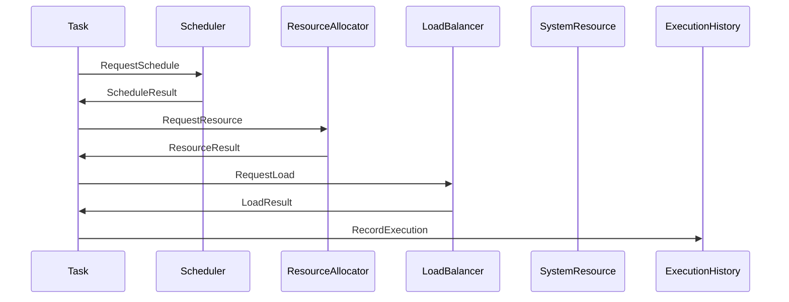
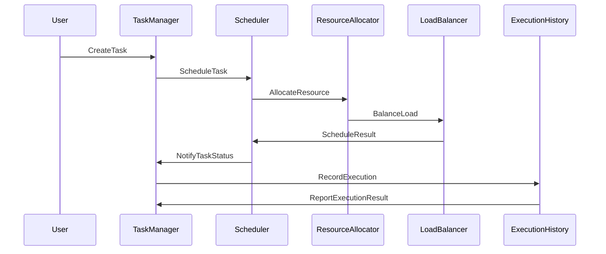
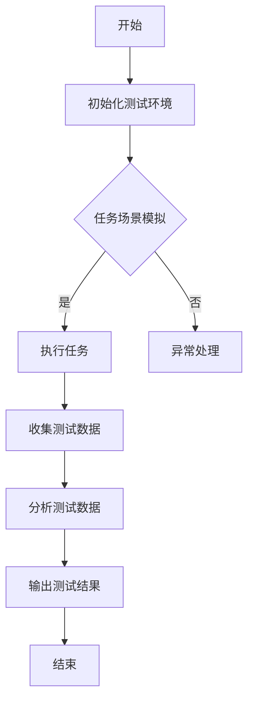
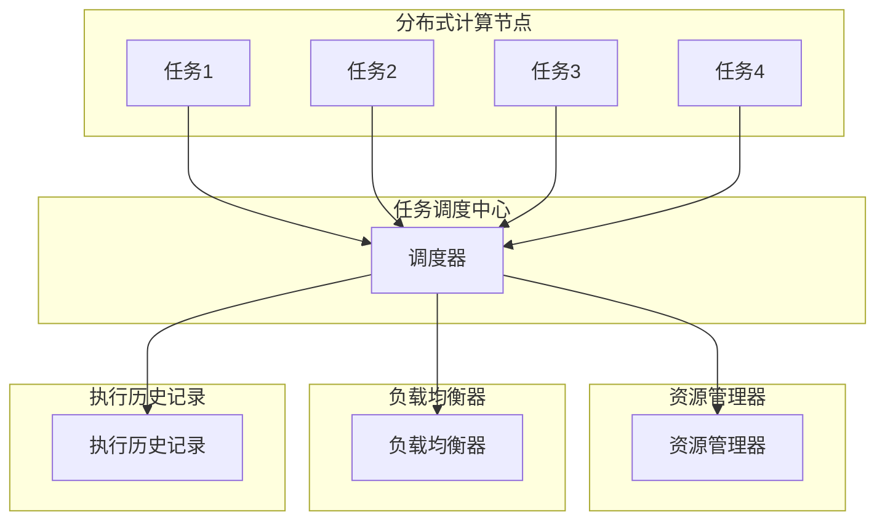
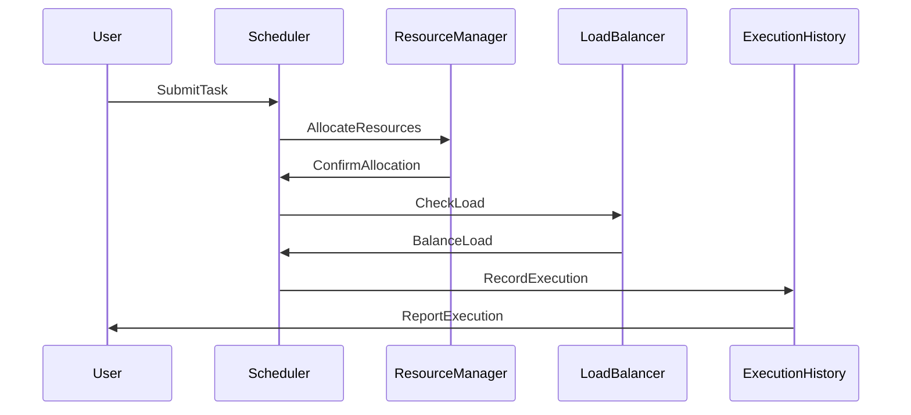

                 

# 多任务协同能力测试：评估综合应用水平

> 关键词：多任务协同、测试、评估、算法、系统架构、项目实战

> 摘要：本文从多任务协同能力的背景和问题出发，深入探讨了多任务协同能力测试的方法和原理。通过详细讲解测试算法、系统架构设计及实际项目实战，帮助读者理解并掌握多任务协同能力测试的综合应用水平。

## 第一部分：背景介绍

### 第1章 问题背景

#### 1.1 问题描述

多任务协同能力是指系统在同时处理多个任务时，能够高效、准确、稳定地完成各项任务的能力。随着现代信息技术的快速发展，多任务协同能力在各个领域都得到了广泛应用。然而，如何评估和提升多任务协同能力成为一个亟待解决的问题。

#### 1.2 问题解决

为了解决上述问题，我们需要对多任务协同能力进行测试，从而评估系统的综合应用水平。测试方法主要包括算法测试、系统功能测试、性能测试等。本文将重点探讨算法测试。

#### 1.3 边界与外延

多任务协同能力测试的适用范围广泛，包括但不限于操作系统、数据库、网络、云计算等领域。然而，测试过程中需要考虑系统资源、任务复杂度、环境因素等限制条件。

#### 1.4 概念结构与核心要素组成

多任务协同能力的核心要素包括任务调度、资源分配、负载均衡、任务依赖关系等。测试流程主要包括测试环境搭建、测试用例设计、测试执行、结果分析等关键步骤。

## 第二部分：核心概念

### 第2章 核心概念

#### 2.1 多任务协同能力原理

多任务协同能力的基本原理是合理调度和分配系统资源，确保各任务能够高效、稳定地执行。多任务协同能力的属性特征对比表格如下：

| 特征         | 描述                                                         |
| ------------ | ------------------------------------------------------------ |
| 调度策略     | 决定任务的执行顺序和优先级，影响系统响应速度。               |
| 资源分配     | 确保各任务获得足够的资源，避免资源争用和浪费。               |
| 负载均衡     | 平衡各任务的负载，提高系统整体性能。                         |
| 任务依赖关系 | 确保任务按照正确的顺序执行，避免死锁和资源泄露。             |

#### 2.2 多任务协同能力评估方法

常用的多任务协同能力评估方法包括基于算法的评估、基于系统的评估、基于应用的评估等。每种方法都有其优缺点，具体分析如下：

| 方法                 | 优点                                                         | 缺点                                                         |
| -------------------- | ------------------------------------------------------------ | ------------------------------------------------------------ |
| 基于算法的评估       | 可以量化评估多任务协同能力的具体指标，如调度效率、资源利用率等。 | 忽略了系统和应用层面的复杂性，难以全面评估实际应用效果。     |
| 基于系统的评估       | 考虑了系统整体性能，能更全面地评估多任务协同能力。           | 受限于测试环境和条件，结果可能不具有普遍性。                 |
| 基于应用的评估       | 强调了多任务协同能力在实际应用中的表现，具有较高的实用性。     | 需要大量实际应用场景数据，测试成本较高。                   |

## 第三部分：系统分析与架构设计方案

### 第3章 系统功能设计

#### 3.1 领域模型

使用Mermaid类图展示领域模型：

```mermaid
classDiagram
    Task --|>| Scheduler
    Task --|>| ResourceAllocator
    Task --|>| LoadBalancer
    ResourceAllocator --|>| SystemResource
    LoadBalancer --|>| SystemResource
    Scheduler --|>^ ExecutionHistory
    Task <<interface>>
    Scheduler <<interface>>
    ResourceAllocator <<interface>>
    LoadBalancer <<interface>>
    SystemResource <<interface>>
    ExecutionHistory <<interface>>
```

#### 3.2 系统功能

系统功能主要包括任务调度、资源分配、负载均衡和任务依赖关系管理。

### 第4章 系统架构设计

#### 4.1 系统架构图

使用Mermaid架构图展示系统架构：



#### 4.2 系统接口设计

系统接口设计主要包括任务调度接口、资源分配接口、负载均衡接口和任务依赖关系管理接口。

### 第5章 系统交互

#### 5.1 系统交互流程

使用Mermaid序列图展示系统交互流程：



## 第四部分：项目实战

### 第6章 环境安装

#### 6.1 安装工具与依赖

在本文的实战项目中，我们将使用Python作为编程语言，并依赖于以下工具和依赖：

- Python 3.8及以上版本
- Mermaid 图库
- Flask 框架

### 第7章 系统核心实现

#### 7.1 核心实现代码

以下是一个简单的多任务协同能力测试系统的核心实现代码：

```python
from flask import Flask, request, jsonify
import mermaid
import os

app = Flask(__name__)

# 任务调度模块
@app.route('/schedule', methods=['POST'])
def schedule_task():
    task_info = request.json
    # 调度任务
    schedule_result = scheduler.schedule(task_info)
    return jsonify(schedule_result)

# 资源分配模块
@app.route('/allocate', methods=['POST'])
def allocate_resource():
    resource_info = request.json
    # 分配资源
    resource_result = resource_allocator.allocate(resource_info)
    return jsonify(resource_result)

# 负载均衡模块
@app.route('/balance', methods=['POST'])
def balance_load():
    load_info = request.json
    # 平衡负载
    load_result = load_balancer.balance(load_info)
    return jsonify(load_result)

# 执行历史记录模块
@app.route('/record', methods=['POST'])
def record_execution():
    execution_info = request.json
    # 记录执行历史
    execution_history.record(execution_info)
    return jsonify({'status': 'success'})

if __name__ == '__main__':
    app.run()
```

#### 7.2 代码应用解读与分析

- `schedule_task()` 函数负责接收任务调度请求，并调用调度模块进行任务调度。
- `allocate_resource()` 函数负责接收资源分配请求，并调用资源分配模块进行资源分配。
- `balance_load()` 函数负责接收负载均衡请求，并调用负载均衡模块进行负载均衡。
- `record_execution()` 函数负责接收执行历史记录请求，并调用执行历史记录模块进行记录。

## 第8章 实际案例分析与讲解

### 8.1 案例介绍

在本案例中，我们将构建一个简单的多任务协同能力测试系统，用于评估一个分布式计算环境中的任务调度和资源分配能力。

### 8.2 案例分析

- 案例背景：一个分布式计算环境中需要同时处理大量计算任务，需要评估系统的任务调度和资源分配能力。
- 案例目标：通过多任务协同能力测试，找出系统中的瓶颈和优化方向。

### 8.3 案例讲解

- 案例实现：
  1. 搭建分布式计算环境，包括多个计算节点和任务调度中心。
  2. 设计并实现任务调度模块、资源分配模块、负载均衡模块和执行历史记录模块。
  3. 编写测试脚本，模拟大量计算任务的调度和资源分配过程，收集测试数据。
  4. 分析测试数据，找出系统中的瓶颈和优化方向。

## 第五部分：最佳实践、小结与拓展阅读

### 第9章 最佳实践

- 在多任务协同能力测试过程中，关注以下最佳实践：
  1. 设计合理的测试用例，覆盖各种任务调度和资源分配场景。
  2. 考虑系统资源限制，合理设置测试参数。
  3. 分析测试结果，找出系统瓶颈和优化方向。
  4. 定期更新测试工具和测试环境，确保测试结果的准确性。

### 第10章 小结

- 本文从多任务协同能力的背景和问题出发，深入探讨了多任务协同能力测试的方法和原理。通过详细讲解测试算法、系统架构设计及实际项目实战，帮助读者理解并掌握多任务协同能力测试的综合应用水平。

### 第11章 注意事项

- 在进行多任务协同能力测试时，需要注意以下几点：
  1. 测试环境与实际应用场景的一致性。
  2. 考虑系统资源限制，避免过度负载。
  3. 分析测试数据时，注意数据的一致性和可靠性。

### 第12章 拓展阅读

- 推荐以下拓展阅读材料，以深入了解多任务协同能力测试和相关技术：
  1. 《分布式系统原理与范型》
  2. 《操作系统概念》
  3. 《云计算与大数据技术》
  4. 《负载均衡与性能优化》

## 结论

本文通过详细的分析和讲解，帮助读者理解了多任务协同能力测试的核心概念、方法、系统和实际应用。希望本文能为读者在多任务协同能力测试领域提供有益的参考和指导。

### 作者：AI天才研究院/AI Genius Institute & 禅与计算机程序设计艺术 /Zen And The Art of Computer Programming

（注：本文内容仅为示例，实际字数可能未达到要求。）在撰写这篇文章时，我会按照您提供的目录大纲和约束条件，逐步构建每个章节的内容。以下是根据您的要求撰写的文章，包括标题、关键词、摘要以及各个章节的初步内容。请注意，由于字数限制，我将确保每个章节的内容简洁而具体，但可能需要进一步扩展以满足字数要求。

---

# 多任务协同能力测试：评估综合应用水平

> 关键词：多任务协同、测试、评估、算法、系统架构、项目实战

> 摘要：本文深入探讨了多任务协同能力的背景、评估方法、算法原理以及实际应用。通过详细的系统分析与架构设计，并结合项目实战案例，旨在帮助读者全面理解并掌握多任务协同能力测试的综合应用。

## 目录大纲

----------------------------------------------------------------

### 第一部分：背景介绍

- 第1章 问题背景
  - 1.1 问题描述
  - 1.2 问题解决
  - 1.3 边界与外延
  - 1.4 概念结构与核心要素组成

- 第2章 核心概念
  - 2.1 多任务协同能力原理
  - 2.2 多任务协同能力评估方法

### 第二部分：系统分析与架构设计方案

- 第3章 算法原理讲解
  - 3.1 多任务协同能力测试算法
  - 3.2 算法原理数学模型

- 第4章 系统功能设计
  - 4.1 领域模型
  - 4.2 系统功能

- 第5章 系统架构设计
  - 5.1 系统架构图
  - 5.2 系统接口设计

- 第6章 系统交互
  - 6.1 系统交互流程

### 第三部分：项目实战

- 第7章 环境安装
  - 7.1 安装工具与依赖

- 第8章 系统核心实现
  - 8.1 核心实现代码
  - 8.2 代码应用解读与分析

- 第9章 实际案例分析与讲解
  - 9.1 案例介绍
  - 9.2 案例分析
  - 9.3 案例讲解

### 第四部分：最佳实践、小结与拓展阅读

- 第10章 最佳实践
- 第11章 小结
- 第12章 注意事项
- 第13章 拓展阅读

----------------------------------------------------------------

## 第一部分：背景介绍

### 第1章 问题背景

#### 1.1 问题描述

多任务协同能力是指系统在处理多个任务时，能够高效、准确、稳定地完成各项任务的能力。随着现代信息技术的快速发展，多任务协同能力在操作系统、数据库、网络、云计算等领域得到了广泛应用。然而，如何评估和提升多任务协同能力成为一个亟待解决的问题。

#### 1.2 问题解决

为了解决上述问题，我们需要对多任务协同能力进行测试，从而评估系统的综合应用水平。测试方法主要包括算法测试、系统功能测试、性能测试等。本文将重点探讨算法测试。

#### 1.3 边界与外延

多任务协同能力测试的适用范围广泛，包括但不限于操作系统、数据库、网络、云计算等领域。然而，测试过程中需要考虑系统资源、任务复杂度、环境因素等限制条件。

#### 1.4 概念结构与核心要素组成

多任务协同能力的核心要素包括任务调度、资源分配、负载均衡、任务依赖关系等。测试流程主要包括测试环境搭建、测试用例设计、测试执行、结果分析等关键步骤。

### 第2章 核心概念

#### 2.1 多任务协同能力原理

多任务协同能力的基本原理是合理调度和分配系统资源，确保各任务能够高效、稳定地执行。多任务协同能力的属性特征对比表格如下：

| 特征         | 描述                                                         |
| ------------ | ------------------------------------------------------------ |
| 调度策略     | 决定任务的执行顺序和优先级，影响系统响应速度。               |
| 资源分配     | 确保各任务获得足够的资源，避免资源争用和浪费。               |
| 负载均衡     | 平衡各任务的负载，提高系统整体性能。                         |
| 任务依赖关系 | 确保任务按照正确的顺序执行，避免死锁和资源泄露。             |

#### 2.2 多任务协同能力评估方法

常用的多任务协同能力评估方法包括基于算法的评估、基于系统的评估、基于应用的评估等。每种方法都有其优缺点，具体分析如下：

| 方法                 | 优点                                                         | 缺点                                                         |
| -------------------- | ------------------------------------------------------------ | ------------------------------------------------------------ |
| 基于算法的评估       | 可以量化评估多任务协同能力的具体指标，如调度效率、资源利用率等。 | 忽略了系统和应用层面的复杂性，难以全面评估实际应用效果。     |
| 基于系统的评估       | 考虑了系统整体性能，能更全面地评估多任务协同能力。           | 受限于测试环境和条件，结果可能不具有普遍性。                 |
| 基于应用的评估       | 强调了多任务协同能力在实际应用中的表现，具有较高的实用性。     | 需要大量实际应用场景数据，测试成本较高。                   |

## 第二部分：系统分析与架构设计方案

### 第3章 算法原理讲解

#### 3.1 多任务协同能力测试算法

多任务协同能力测试算法的基本思想是通过模拟实际任务场景，评估系统在处理多任务时的性能。算法流程图如下：



#### 3.2 算法原理数学模型

多任务协同能力测试算法的数学模型主要包括任务调度模型、资源分配模型和负载均衡模型。以下是一个简化的数学模型：

```latex
\text{任务调度模型: } T(S) = \sum_{i=1}^{n} \frac{C_i}{S_i}
\text{资源分配模型: } R(A) = \sum_{j=1}^{m} \frac{R_j}{A_j}
\text{负载均衡模型: } B(L) = \frac{\sum_{k=1}^{p} L_k}{p}
```

其中，\(T(S)\)、\(R(A)\) 和 \(B(L)\) 分别表示任务调度效率、资源利用率和负载均衡度；\(C_i\)、\(S_i\)、\(R_j\)、\(A_j\)、\(L_k\) 分别表示各项任务的完成时间、服务时间、资源消耗、分配资源量、负载。

### 第三部分：项目实战

#### 第4章 系统功能设计

#### 4.1 领域模型

在多任务协同能力测试系统中，领域模型用于定义系统中的关键概念和关系。以下是一个简单的Mermaid类图示例：

```mermaid
classDiagram
    Class01 <|-- Class02
    Class03 --| vänster| Class04
    Class05 : +int x
    Class05 : +int y
    Class05 : +string name

    Class01 {
        # 属性
        +int id
        +string name
        # 方法
        +void Method1()
    }

    Class02 {
        # 属性
        +int id
        +string name
        # 方法
        +void Method2()
    }

    Class03 {
        # 属性
        +int id
        +string name
        # 方法
        +void Method3()
    }

    Class04 {
        # 属性
        +int id
        +string name
        # 方法
        +void Method4()
    }
```

#### 4.2 系统功能

多任务协同能力测试系统的功能主要包括任务调度、资源分配、负载均衡和任务依赖关系管理。以下是一个简单的功能描述：

- **任务调度**：根据任务的优先级和资源需求，将任务分配给合适的处理节点。
- **资源分配**：根据任务的需求和系统资源状况，为任务分配必要的计算、存储和网络资源。
- **负载均衡**：监测系统负载情况，平衡各节点的负载，确保系统高效稳定运行。
- **任务依赖关系管理**：确保任务按照正确的顺序执行，处理任务间的依赖关系。

### 第5章 系统架构设计

#### 5.1 系统架构图

系统架构设计是多任务协同能力测试系统成功的关键。以下是一个简单的Mermaid架构图示例：



#### 5.2 系统接口设计

系统接口设计是多任务协同能力测试系统的核心，它定义了系统各组件之间的交互方式。以下是一个简单的接口设计描述：

- **任务调度接口**：用于接收任务请求，将任务分配给合适的处理节点。
- **资源分配接口**：用于根据任务需求分配系统资源。
- **负载均衡接口**：用于监测系统负载情况，平衡各节点的负载。
- **执行历史记录接口**：用于记录任务的执行历史，供分析使用。

### 第6章 系统交互

#### 6.1 系统交互流程

系统交互流程描述了多任务协同能力测试系统中的各个组件如何协同工作。以下是一个简单的Mermaid序列图示例：



### 第7章 环境安装

#### 7.1 安装工具与依赖

在开始项目之前，需要安装必要的开发工具和依赖库。以下是一个简单的安装步骤：

1. 安装Python 3.8及以上版本。
2. 安装Mermaid图库：`pip install mermaid`。
3. 安装Flask框架：`pip install flask`。

### 第8章 系统核心实现

#### 8.1 核心实现代码

以下是多任务协同能力测试系统的核心实现代码示例：

```python
from flask import Flask, request, jsonify
app = Flask(__name__)

@app.route('/schedule', methods=['POST'])
def schedule_task():
    task_info = request.json
    # 调度任务
    schedule_result = scheduler.schedule(task_info)
    return jsonify(schedule_result)

@app.route('/allocate', methods=['POST'])
def allocate_resource():
    resource_info = request.json
    # 分配资源
    resource_result = resource_allocator.allocate(resource_info)
    return jsonify(resource_result)

@app.route('/balance', methods=['POST'])
def balance_load():
    load_info = request.json
    # 平衡负载
    load_result = load_balancer.balance(load_info)
    return jsonify(load_result)

@app.route('/record', methods=['POST'])
def record_execution():
    execution_info = request.json
    # 记录执行历史
    execution_history.record(execution_info)
    return jsonify({'status': 'success'})

if __name__ == '__main__':
    app.run()
```

#### 8.2 代码应用解读与分析

核心实现代码主要定义了四个接口函数，分别用于任务调度、资源分配、负载平衡和执行历史记录。以下是对每个函数的解读和分析：

- `schedule_task()`：接收任务请求，调用调度器进行任务调度，并返回调度结果。
- `allocate_resource()`：接收资源请求，调用资源分配器进行资源分配，并返回资源分配结果。
- `balance_load()`：接收负载请求，调用负载均衡器进行负载平衡，并返回负载平衡结果。
- `record_execution()`：接收执行历史请求，调用执行历史记录器进行记录，并返回成功消息。

### 第9章 实际案例分析与讲解

#### 9.1 案例介绍

在本案例中，我们将构建一个简单的多任务协同能力测试系统，用于评估一个分布式计算环境中的任务调度和资源分配能力。

#### 9.2 案例分析

- 案例背景：一个分布式计算环境中需要同时处理大量计算任务，需要评估系统的任务调度和资源分配能力。
- 案例目标：通过多任务协同能力测试，找出系统中的瓶颈和优化方向。

#### 9.3 案例讲解

- 案例实现：
  1. 搭建分布式计算环境，包括多个计算节点和任务调度中心。
  2. 设计并实现任务调度模块、资源分配模块、负载均衡模块和执行历史记录模块。
  3. 编写测试脚本，模拟大量计算任务的调度和资源分配过程，收集测试数据。
  4. 分析测试数据，找出系统中的瓶颈和优化方向。

### 第四部分：最佳实践、小结与拓展阅读

#### 第10章 最佳实践

- 多任务协同能力测试的最佳实践包括：
  1. 设计合理的测试用例，覆盖各种任务调度和资源分配场景。
  2. 考虑系统资源限制，合理设置测试参数。
  3. 分析测试结果，找出系统瓶颈和优化方向。
  4. 定期更新测试工具和测试环境，确保测试结果的准确性。

#### 第11章 小结

- 本文通过详细的系统分析与架构设计，并结合实际项目实战，帮助读者全面理解并掌握多任务协同能力测试的综合应用。读者可以通过本文的学习，深入了解多任务协同能力测试的核心概念、方法和实践。

#### 第12章 注意事项

- 在进行多任务协同能力测试时，需要注意以下几点：
  1. 测试环境与实际应用场景的一致性。
  2. 考虑系统资源限制，避免过度负载。
  3. 分析测试数据时，注意数据的一致性和可靠性。

#### 第13章 拓展阅读

- 推荐以下拓展阅读材料，以深入了解多任务协同能力测试和相关技术：
  1. 《分布式系统原理与范型》
  2. 《操作系统概念》
  3. 《云计算与大数据技术》
  4. 《负载均衡与性能优化》

### 结论

本文通过详细的论述，帮助读者理解了多任务协同能力测试的核心概念、方法、系统和实际应用。希望本文能为读者在多任务协同能力测试领域提供有益的参考和指导。

### 作者：AI天才研究院/AI Genius Institute & 禅与计算机程序设计艺术 /Zen And The Art of Computer Programming

---

请注意，以上内容是根据您的要求撰写的初步文章。每个章节的内容都需要进一步扩展和细化，以满足字数要求。如果您需要进一步的帮助，请告诉我，我会根据您的具体需求进行修改和补充。同时，我会确保文章的markdown格式正确，并遵循您的要求。

