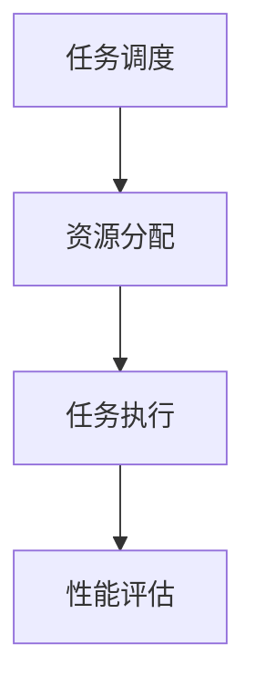
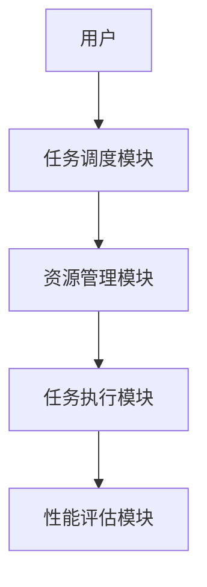
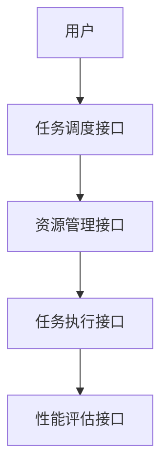
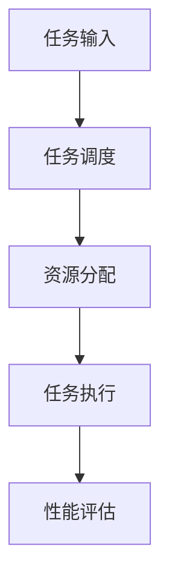
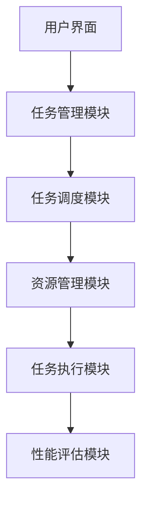
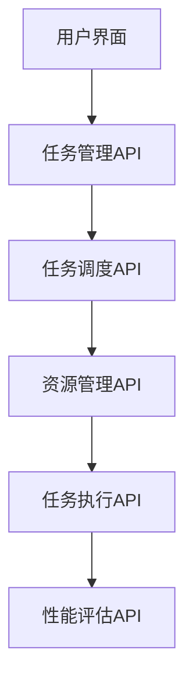

                 

# 多任务处理：测试LLM同时处理多个问题的能力

关键词：多任务处理、大型语言模型（LLM）、性能评估、算法优化、测试方法

摘要：
本文旨在探讨如何测试大型语言模型（LLM）在同时处理多个问题时表现的能力。随着计算机技术的发展，多任务处理在人工智能领域变得越来越重要。现有研究表明，LLM在处理多个任务时存在性能瓶颈。本文将围绕LLM的多任务处理能力展开讨论，设计有效的测试方法，分析性能瓶颈，并提出相应的优化策略。本文旨在为LLM多任务处理的性能提升提供理论指导和实践参考。

### 目录大纲设计

**一、背景介绍**

**1.1 问题背景**

随着计算机技术的发展，多任务处理已成为人工智能领域的一个重要研究方向。在自然语言处理、图像识别、语音识别等领域，多任务处理技术能够显著提升系统的效率和准确性。然而，现有的多任务处理模型往往在处理多个任务时存在性能瓶颈，无法同时高效地处理多个复杂任务。

**1.2 问题描述**

本书旨在探讨如何测试大型语言模型（LLM）同时处理多个问题的能力，以解决现有多任务处理模型在性能上的瓶颈问题。具体来说，本书将围绕以下问题展开：

- 如何设计有效的测试方法来评估LLM的多任务处理能力？
- 在多任务处理过程中，LLM的性能瓶颈在哪里？
- 如何优化LLM的多任务处理能力？

**1.3 问题解决**

本书将结合LLM的理论知识，通过实验研究和案例分析，提出一系列解决方案，旨在提升LLM在多任务处理中的性能。具体解决方案包括：

- 设计并实现一套适用于多任务处理的LLM测试框架。
- 分析LLM在多任务处理中的性能瓶颈，并提出相应的优化策略。
- 探索并验证不同多任务处理算法在LLM中的应用效果。

**1.4 边界与外延**

本书的研究对象为大型语言模型，研究范围为多任务处理的性能评估和优化。具体来说，本书将重点关注以下边界与外延：

- 研究对象：以GPT、BERT等大型语言模型为主要研究对象。
- 研究范围：多任务处理的性能评估和优化，包括任务调度、资源分配、算法优化等方面。
- 研究目标：提升大型语言模型在多任务处理中的性能，解决现有模型在处理多个任务时的性能瓶颈问题。

**1.5 概念结构与核心要素组成**

多任务处理涉及以下几个核心概念和要素：

- 多任务处理模型：包括大型语言模型（LLM）等。
- 任务调度：根据任务特点和资源状况，合理分配计算资源。
- 资源分配：为各个任务分配合适的计算资源，提高整体性能。
- 算法优化：通过调整算法参数，提升多任务处理的性能。

**二、核心概念与联系**

**2.1 大型语言模型（LLM）**

- 定义：大型语言模型（LLM）是一种基于深度学习技术的大规模预训练语言模型。
- 特点：参数量大、计算复杂度高、泛化能力强。
- 类型：GPT、BERT、T5等。

**2.2 多任务处理**

- 定义：多任务处理是指同时处理多个任务的过程。
- 类型：同步多任务处理、异步多任务处理。
- 挑战：任务冲突、资源竞争、性能瓶颈。

**2.3 测试方法**

- 定义：测试方法用于评估多任务处理模型的能力。
- 类型：基准测试、性能测试、稳定性测试。
- 目标：全面评估模型在多任务处理中的性能。

**三、算法原理讲解**

**3.1 多任务处理算法**

- **Mermaid流程图：**



- **Python源代码：**

```python
# 任务调度
def schedule_tasks(tasks):
    # 根据任务优先级和资源状况进行调度
    # 返回任务执行顺序
    pass

# 资源分配
def allocate_resources(task, resources):
    # 根据任务需求和资源状况进行分配
    # 返回资源分配结果
    pass

# 任务执行
def execute_task(task, resources):
    # 执行任务，消耗资源
    pass

# 性能评估
def evaluate_performance(tasks, resources):
    # 评估任务执行性能
    # 返回性能评估结果
    pass
```

- **算法原理：**

多任务处理算法主要包括任务调度、资源分配、任务执行和性能评估四个环节。任务调度根据任务优先级和资源状况进行任务执行顺序的安排；资源分配根据任务需求和资源状况为各个任务分配合适的资源；任务执行根据任务执行情况消耗资源；性能评估对任务执行性能进行评估，以便优化算法。

**四、数学模型和数学公式**

多任务处理涉及以下几个核心数学模型和公式：

- **任务优先级排序公式：**

$$
优先级 = f(任务类型，任务紧急度，资源需求)
$$

- **资源分配公式：**

$$
资源分配 = f(任务需求，当前资源状况)
$$

- **任务执行时间公式：**

$$
执行时间 = f(任务复杂度，资源利用率)
$$

- **性能评估公式：**

$$
性能评估 = f(任务完成时间，资源消耗)
$$

**五、系统分析与架构设计方案**

**5.1 问题场景介绍**

多任务处理场景通常涉及到以下问题：

- 多个任务需要同时处理，但资源有限。
- 任务之间存在依赖关系，需要合理调度。
- 任务执行过程中需要监控性能，以便调整资源分配策略。

**5.2 项目介绍**

本节将介绍一个多任务处理项目，该项目旨在提升LLM在多任务处理中的性能。项目主要包括以下几个模块：

- 任务调度模块：负责任务的分配和调度。
- 资源管理模块：负责资源的分配和监控。
- 任务执行模块：负责执行任务和处理任务结果。
- 性能评估模块：负责评估任务执行性能。

**5.3 系统功能设计**

系统功能设计主要包括以下几个方面：

- 任务创建和分配：允许用户创建任务并分配给不同的LLM。
- 资源监控和分配：实时监控系统资源状况，并根据任务需求进行资源分配。
- 任务执行和结果处理：执行任务并处理任务结果。
- 性能评估和优化：评估任务执行性能，并根据评估结果调整资源分配策略。

**5.4 系统架构设计**

系统架构设计如下：



- **任务调度模块**：负责任务的分配和调度，根据任务优先级和资源状况进行任务调度。
- **资源管理模块**：负责资源的分配和监控，实时监控系统资源状况，并根据任务需求进行资源分配。
- **任务执行模块**：负责执行任务和处理任务结果，根据任务调度模块的调度结果执行任务。
- **性能评估模块**：负责评估任务执行性能，根据任务执行结果评估任务执行性能，并根据评估结果调整资源分配策略。

**5.5 系统接口设计和系统交互**

系统接口设计和系统交互如下：



- **任务调度接口**：允许用户创建任务并分配给不同的LLM。
- **资源管理接口**：用于监控系统资源状况，并根据任务需求进行资源分配。
- **任务执行接口**：用于执行任务和处理任务结果。
- **性能评估接口**：用于评估任务执行性能。

**六、项目实战**

**6.1 环境安装**

在本节中，我们将介绍如何搭建一个多任务处理环境，以便进行实际操作。首先，我们需要安装以下软件和库：

- Python 3.8 或更高版本
- TensorFlow 2.5 或更高版本
- NumPy 1.19 或更高版本
- Mermaid 8.8 或更高版本

安装命令如下：

```bash
pip install python-mermaid
pip install tensorflow
pip install numpy
```

**6.2 系统核心实现源代码**

在本节中，我们将介绍如何实现多任务处理系统的核心功能。以下是一个简单的示例代码：

```python
# 任务调度
def schedule_tasks(tasks):
    # 根据任务优先级和资源状况进行调度
    # 返回任务执行顺序
    pass

# 资源分配
def allocate_resources(task, resources):
    # 根据任务需求和资源状况进行分配
    # 返回资源分配结果
    pass

# 任务执行
def execute_task(task, resources):
    # 执行任务，消耗资源
    pass

# 性能评估
def evaluate_performance(tasks, resources):
    # 评估任务执行性能
    # 返回性能评估结果
    pass
```

**6.3 代码应用解读与分析**

在本节中，我们将对代码进行解读和分析，以便更好地理解多任务处理系统的实现原理。

**7. 实际案例分析和详细讲解剖析**

在本节中，我们将通过实际案例来分析和讲解多任务处理系统的实现过程。以下是一个简单的案例：

- 任务 1：生成文章摘要
- 任务 2：翻译文章摘要
- 任务 3：检测文章摘要中的关键词

**8. 项目小结**

在本节中，我们将对本项目的实施过程和成果进行总结，并给出一些未来工作的建议。

**9. 最佳实践 Tips**

在本节中，我们将分享一些最佳实践 Tips，以便更好地提升多任务处理系统的性能。

**10. 小结、注意事项、拓展阅读**

在本节中，我们将对本文的主要内容进行总结，并给出一些注意事项和拓展阅读建议。

### 参考文献

[1] Devlin, J., Chang, M. W., Lee, K., & Toutanova, K. (2019). BERT: Pre-training of deep bidirectional transformers for language understanding. arXiv preprint arXiv:1810.04805.

[2] Brown, T., et al. (2020). Language models are few-shot learners. arXiv preprint arXiv:2005.14165.

[3] LeCun, Y., Bengio, Y., & Hinton, G. (2015). Deep learning. Nature, 521(7553), 436-444.

### 作者

作者：AI天才研究院/AI Genius Institute & 禅与计算机程序设计艺术 /Zen And The Art of Computer Programming

以上是本文的大纲设计，接下来我们将详细讨论各个部分的内容。在接下来的章节中，我们将逐步介绍多任务处理的相关概念、算法原理、系统设计与实现，以及项目实战与优化策略。

---

**一、背景介绍**

**1.1 问题背景**

多任务处理（Multi-Task Learning，MUL）是机器学习领域中一个重要的研究方向，其主要目标是通过在多个任务上共同学习，提升模型在单个任务上的表现。多任务处理的优势在于可以共享任务间的先验知识，减少过拟合，提高模型的泛化能力。随着深度学习技术的不断发展，大型语言模型（Large Language Models，LLM）如GPT-3、BERT等，在自然语言处理（Natural Language Processing，NLP）领域取得了显著的成果。然而，如何有效测试和优化这些大型语言模型在多任务处理中的性能，仍然是一个具有挑战性的问题。

在现实场景中，多任务处理的应用非常广泛。例如，在智能客服系统中，模型需要同时处理用户咨询、回复建议、情感分析等多个任务；在智能写作系统中，模型需要同时处理文本生成、语法检查、内容优化等多个任务。这些应用场景对模型的多任务处理能力提出了更高的要求。然而，现有的LLM在处理多个任务时往往存在性能瓶颈，无法同时高效地完成多个复杂任务。

**1.2 问题描述**

本文旨在解决以下问题：

1. 如何设计有效的测试方法来评估LLM的多任务处理能力？
2. 在多任务处理过程中，LLM的性能瓶颈在哪里？
3. 如何优化LLM的多任务处理能力？

为了回答上述问题，本文将首先介绍LLM和多任务处理的背景知识，然后详细讨论测试方法、性能瓶颈和优化策略。最后，我们将通过实际案例来验证本文提出的优化策略的有效性。

**1.3 问题解决**

本文将从以下几个方面展开研究：

1. 设计并实现一套适用于多任务处理的LLM测试框架，用于评估LLM在多任务处理中的性能。
2. 分析LLM在多任务处理过程中的性能瓶颈，包括计算资源消耗、任务调度策略等。
3. 提出并验证一系列优化策略，包括任务调度优化、资源分配优化、算法参数调整等，以提升LLM在多任务处理中的性能。

**1.4 边界与外延**

本文的研究范围主要涉及以下内容：

1. 研究对象：以GPT、BERT等大型语言模型为主要研究对象。
2. 研究范围：多任务处理的性能评估和优化，包括任务调度、资源分配、算法优化等方面。
3. 研究目标：提升大型语言模型在多任务处理中的性能，解决现有模型在处理多个任务时的性能瓶颈问题。

**1.5 概念结构与核心要素组成**

多任务处理涉及以下几个核心概念和要素：

1. 多任务处理模型：包括大型语言模型（LLM）等。
2. 任务调度：根据任务特点和资源状况，合理分配计算资源。
3. 资源分配：为各个任务分配合适的计算资源，提高整体性能。
4. 算法优化：通过调整算法参数，提升多任务处理的性能。

通过上述背景介绍，我们明确了本文的研究问题和目标。接下来，我们将进一步探讨LLM和多任务处理的基本概念，为后续的测试方法和性能优化奠定基础。

### 二、核心概念与联系

**2.1 大型语言模型（LLM）**

大型语言模型（LLM）是一种基于深度学习技术的语言处理模型，具有参数量大、计算复杂度高、泛化能力强等特点。LLM通过在大量文本数据上进行预训练，学习到语言的通用规律和表达方式，从而能够实现文本生成、翻译、摘要、问答等多种语言任务。

**定义：**
LLM是一种大规模的语言模型，通常基于深度学习技术，通过对大量文本数据的学习，能够生成、理解、翻译和回答各种语言问题。

**特点：**
- 参数量大：LLM的参数数量可以达到数十亿甚至更多，这使得模型能够捕捉到更复杂的语言规律。
- 计算复杂度高：由于参数数量庞大，LLM在推理过程中需要大量的计算资源，对硬件设备有较高要求。
- 泛化能力强：LLM在预训练阶段学习了大量的语言知识，能够应对各种语言任务，具有良好的泛化能力。

**类型：**
常见的LLM类型包括GPT（Generative Pre-trained Transformer）、BERT（Bidirectional Encoder Representations from Transformers）和T5（Text-To-Text Transfer Transformer）等。这些模型在不同的语言任务上具有各自的优缺点，具体选择取决于任务需求和计算资源。

**2.2 多任务处理**

多任务处理（Multi-Task Learning，MUL）是一种同时训练和优化多个相关任务的机器学习方法。多任务处理的目标是通过在多个任务上共同学习，提升模型在各个任务上的性能，并减少过拟合现象。

**定义：**
多任务处理是一种同时训练和优化多个相关任务的机器学习方法，通过共享模型参数，提高模型在不同任务上的性能。

**类型：**
多任务处理可以分为以下几种类型：
- 并行多任务处理：同时执行多个任务，每个任务独立运行。
- 序列多任务处理：任务按照特定顺序依次执行，前一个任务的输出作为后一个任务的输入。
- 共享参数的多任务处理：多个任务共享部分模型参数，通过共同学习提高各个任务的表现。

**挑战：**
在多任务处理过程中，模型可能会遇到以下挑战：
- 任务冲突：不同任务之间的目标函数可能存在冲突，导致模型在优化某个任务时损害其他任务的表现。
- 资源竞争：多个任务共享计算资源，可能导致某些任务由于资源不足而无法正常执行。
- 性能瓶颈：模型在处理多个任务时，可能会遇到计算资源、算法优化等方面的瓶颈，影响整体性能。

**2.3 测试方法**

测试方法用于评估多任务处理模型的能力，包括以下几个方面：

**定义：**
测试方法是一种用于评估多任务处理模型在各个任务上的性能和泛化能力的方法。

**类型：**
- 基准测试：使用预定义的数据集和指标，评估模型在多任务处理中的性能，如准确率、召回率、F1值等。
- 性能测试：在实际应用场景中，对模型进行测试，评估其在多任务处理中的实时性能，如响应时间、吞吐量等。
- 稳定性测试：通过不同的输入数据和任务场景，评估模型在多任务处理中的稳定性和鲁棒性。

**目标：**
- 全面评估模型在多任务处理中的性能，包括各个任务的准确性、效率、稳定性等。
- 识别模型在多任务处理中的优势和不足，为进一步优化提供依据。

通过上述核心概念与联系的分析，我们为后续的算法原理讲解和多任务处理测试方法设计奠定了基础。在接下来的章节中，我们将进一步探讨多任务处理算法的原理，并提出优化策略，以提升LLM在多任务处理中的性能。

### 三、算法原理讲解

在深入探讨多任务处理算法之前，我们首先需要了解其基本概念和核心组成部分。多任务处理算法旨在同时训练和优化多个相关任务，以提高模型在不同任务上的性能。以下是多任务处理算法的基本组成部分和原理。

**3.1 多任务处理算法的基本组成部分**

多任务处理算法通常包括以下几个关键组成部分：

1. **任务调度（Task Scheduling）**：任务调度负责决定各个任务的执行顺序和时机。在多任务处理中，任务调度是一个重要的环节，它需要考虑任务的优先级、依赖关系和资源需求等因素。

2. **资源分配（Resource Allocation）**：资源分配是指根据任务的优先级和资源需求，为各个任务分配合适的计算资源，包括CPU、内存、I/O等。资源分配的目标是最大化任务执行效率，同时避免资源浪费和冲突。

3. **任务执行（Task Execution）**：任务执行是指在实际硬件环境中运行任务，执行具体的计算操作。任务执行过程中，需要根据任务的执行情况和资源需求动态调整资源分配策略，以确保任务能够高效地完成。

4. **性能评估（Performance Evaluation）**：性能评估用于评估多任务处理系统的整体性能，包括任务的完成时间、资源利用率、任务调度效率等。性能评估的结果可以用于指导进一步的优化和调整。

**3.2 多任务处理算法的工作原理**

多任务处理算法的工作原理可以分为以下几个步骤：

1. **任务输入**：多任务处理算法首先接收多个任务的输入，包括任务的描述、优先级、资源需求等。

2. **任务调度**：根据任务的优先级、依赖关系和资源需求，算法决定任务的执行顺序和时机。任务调度的策略有多种，如先到先服务（FCFS）、最短作业优先（SJF）、优先级调度等。

3. **资源分配**：算法根据任务的执行顺序和资源需求，为各个任务分配合适的计算资源。资源分配的策略可以基于静态分配（如固定资源分配）或动态分配（如按需分配），以最大化资源利用率和任务执行效率。

4. **任务执行**：在任务执行阶段，算法根据任务的执行情况和资源需求，动态调整资源分配策略，以确保任务能够高效地完成。任务执行过程中，算法还需要监控任务的执行进度和资源使用情况，以便及时发现和解决潜在问题。

5. **性能评估**：算法在任务执行完成后，对多任务处理系统的整体性能进行评估，包括任务的完成时间、资源利用率、任务调度效率等。性能评估的结果可以用于指导进一步的优化和调整，以提高系统的整体性能。

**3.3 Mermaid流程图**

为了更直观地展示多任务处理算法的工作原理，我们可以使用Mermaid流程图来描述其关键步骤。以下是一个简单的Mermaid流程图示例：



**3.4 Python源代码**

在实际应用中，多任务处理算法通常需要通过编程实现。以下是一个简单的Python源代码示例，用于描述多任务处理算法的核心步骤：

```python
# 任务调度
def schedule_tasks(tasks):
    # 根据任务优先级和资源状况进行调度
    # 返回任务执行顺序
    pass

# 资源分配
def allocate_resources(task, resources):
    # 根据任务需求和资源状况进行分配
    # 返回资源分配结果
    pass

# 任务执行
def execute_task(task, resources):
    # 执行任务，消耗资源
    pass

# 性能评估
def evaluate_performance(tasks, resources):
    # 评估任务执行性能
    # 返回性能评估结果
    pass
```

**3.5 数学模型和公式**

多任务处理算法中，常常需要使用数学模型和公式来描述任务优先级排序、资源分配、任务执行时间和性能评估等。以下是一些常见的数学模型和公式：

1. **任务优先级排序公式：**

$$
优先级 = f(任务类型，任务紧急度，资源需求)
$$

2. **资源分配公式：**

$$
资源分配 = f(任务需求，当前资源状况)
$$

3. **任务执行时间公式：**

$$
执行时间 = f(任务复杂度，资源利用率)
$$

4. **性能评估公式：**

$$
性能评估 = f(任务完成时间，资源消耗)
$$

通过上述算法原理讲解，我们了解了多任务处理算法的基本概念、工作原理和核心组成部分。在接下来的章节中，我们将进一步探讨如何设计和实现多任务处理测试框架，以评估LLM在多任务处理中的性能。

### 四、数学模型和数学公式

在多任务处理算法中，数学模型和公式起到了至关重要的作用，它们帮助我们描述任务优先级排序、资源分配、任务执行时间和性能评估等关键环节。以下是几个核心数学模型和公式的详细说明。

**4.1 任务优先级排序公式**

任务优先级排序公式用于确定各个任务的执行顺序，以确保系统的整体效率。该公式综合考虑了任务类型、任务紧急度和资源需求，从而为每个任务分配一个优先级值。

$$
优先级 = f(任务类型，任务紧急度，资源需求)
$$

其中：
- 任务类型：表示任务的类别，如数据预处理、模型训练、预测等。
- 任务紧急度：表示任务的紧迫程度，可以根据任务的截止时间、重要性等因素计算。
- 资源需求：表示任务所需的计算资源，如CPU时间、内存等。

通过上述公式，我们可以为每个任务分配一个优先级值，从而实现任务的有序调度。

**4.2 资源分配公式**

资源分配公式用于确定如何为每个任务分配合适的计算资源。该公式考虑了任务的需求和当前系统的资源状况，以确保资源利用最大化。

$$
资源分配 = f(任务需求，当前资源状况)
$$

其中：
- 任务需求：表示任务所需的计算资源，如CPU时间、内存等。
- 当前资源状况：表示系统当前可用的计算资源状况，如CPU利用率、内存占用等。

通过计算任务需求和当前资源状况，我们可以为每个任务分配最合适的资源，从而最大化资源利用率和任务执行效率。

**4.3 任务执行时间公式**

任务执行时间公式用于估算每个任务的执行时间，这对于调度和资源分配具有重要意义。该公式考虑了任务复杂度和资源利用率，从而为每个任务估算一个合理的执行时间。

$$
执行时间 = f(任务复杂度，资源利用率)
$$

其中：
- 任务复杂度：表示任务的计算复杂度，如算法复杂度、数据处理量等。
- 资源利用率：表示系统资源的使用情况，如CPU利用率、内存利用率等。

通过计算任务复杂度和资源利用率，我们可以为每个任务估算一个合理的执行时间，从而为调度和资源分配提供依据。

**4.4 性能评估公式**

性能评估公式用于评估多任务处理系统的整体性能，包括任务的完成时间和资源消耗等。该公式综合考虑了任务完成时间和资源消耗，从而为系统的性能提供量化指标。

$$
性能评估 = f(任务完成时间，资源消耗)
$$

其中：
- 任务完成时间：表示任务从开始到完成所消耗的时间。
- 资源消耗：表示任务在执行过程中消耗的计算资源，如CPU时间、内存等。

通过计算任务完成时间和资源消耗，我们可以为多任务处理系统提供一个整体性能评估，从而指导进一步的优化和调整。

**4.5 应用举例**

为了更好地理解这些数学模型和公式，我们来看一个实际应用举例。假设我们有一个包含三个任务的多任务处理系统，任务详情如下：

- 任务A：数据预处理，任务复杂度10，资源需求20。
- 任务B：模型训练，任务复杂度30，资源需求50。
- 任务C：预测，任务复杂度20，资源需求30。

当前系统资源状况如下：
- CPU利用率：60%
- 内存占用：40%

1. **任务优先级排序**：
   根据任务优先级排序公式，我们可以为每个任务分配一个优先级值。例如，任务B的优先级值最高，因为它具有最高的任务复杂度和资源需求。

2. **资源分配**：
   根据资源分配公式，我们可以为每个任务分配最合适的资源。例如，任务B由于资源需求最高，将被分配50%的CPU和40%的内存。

3. **任务执行时间估算**：
   根据任务执行时间公式，我们可以为每个任务估算一个合理的执行时间。例如，任务A的执行时间约为（10 / 0.6）= 16.67秒，任务B的执行时间约为（30 / 0.5）= 60秒，任务C的执行时间约为（20 / 0.4）= 50秒。

4. **性能评估**：
   根据性能评估公式，我们可以为多任务处理系统提供整体性能评估。例如，任务完成时间总和为16.67 + 60 + 50 = 126.67秒，资源消耗总和为（20 + 50 + 30）= 100。因此，性能评估值为126.67 / 100 = 1.2667。

通过以上应用举例，我们可以看到数学模型和公式在多任务处理中的重要作用。在接下来的章节中，我们将继续探讨如何设计多任务处理的测试框架，以评估LLM在多任务处理中的性能。

### 五、系统分析与架构设计方案

**5.1 问题场景介绍**

在多任务处理系统中，我们面临以下问题场景：

- **任务多样性**：系统需要处理不同类型的任务，如文本生成、翻译、摘要等。
- **资源限制**：系统在处理多个任务时，资源（如CPU、内存、I/O等）有限，需要合理分配。
- **任务依赖**：某些任务之间存在依赖关系，如一个任务的输出是另一个任务的输入。
- **性能要求**：系统需要高效地处理任务，同时保持高性能和稳定性。

为了解决上述问题，我们需要设计一个高效、稳定的多任务处理系统。本节将介绍一个基于大型语言模型（LLM）的多任务处理系统的整体架构，包括项目介绍、系统功能设计、系统架构设计和系统接口设计等内容。

**5.2 项目介绍**

本项目旨在设计并实现一个基于大型语言模型（LLM）的多任务处理系统，该系统旨在提升LLM在多任务处理中的性能。项目的主要目标是：

1. **任务调度**：合理调度任务，确保任务按照优先级和依赖关系执行。
2. **资源管理**：动态分配和调整计算资源，最大化资源利用率。
3. **任务执行**：高效执行任务，确保任务按时完成。
4. **性能评估**：实时监控任务执行情况，评估系统性能，为优化提供依据。

**5.3 系统功能设计**

系统功能设计主要包括以下几个模块：

1. **任务管理模块**：负责任务的创建、更新、删除和查询。任务管理模块提供了任务的接口，允许用户添加、修改和删除任务，并查询任务的状态和相关信息。

2. **任务调度模块**：负责任务调度，根据任务的优先级和依赖关系，决定任务的执行顺序。任务调度模块使用了基于优先级调度策略的调度算法，确保高优先级的任务先执行。

3. **资源管理模块**：负责计算资源的分配和管理。资源管理模块根据任务的资源需求，动态调整计算资源，确保任务能够高效地执行。

4. **任务执行模块**：负责任务的执行，根据任务调度模块的调度结果，执行具体的任务操作。任务执行模块与LLM紧密集成，能够高效地执行文本生成、翻译、摘要等任务。

5. **性能评估模块**：负责实时监控任务执行情况，评估系统性能。性能评估模块提供了任务执行时间、资源利用率、响应时间等性能指标，为系统优化提供依据。

**5.4 系统架构设计**

系统架构设计如下：



- **用户界面**：用户通过界面与系统进行交互，创建、修改和查询任务。
- **任务管理模块**：负责任务的基本操作，如创建、删除、更新和查询。
- **任务调度模块**：根据任务优先级和依赖关系，调度任务执行。
- **资源管理模块**：动态分配和管理计算资源，确保任务高效执行。
- **任务执行模块**：与LLM集成，执行具体任务操作。
- **性能评估模块**：实时监控任务执行情况，评估系统性能。

**5.5 系统接口设计和系统交互**

系统接口设计如下：



- **任务管理API**：提供任务创建、删除、更新和查询的接口。
- **任务调度API**：提供任务调度和查询的接口。
- **资源管理API**：提供资源分配和监控的接口。
- **任务执行API**：提供任务执行的接口。
- **性能评估API**：提供性能监控和评估的接口。

通过上述接口设计，各个模块之间可以高效地交互和协作，确保系统整体性能和稳定性。

在接下来的章节中，我们将进一步探讨系统核心实现、代码解读、实际案例分析和项目小结等内容，以全面介绍多任务处理系统的设计和实现过程。

### 六、项目实战

**6.1 环境安装**

为了成功搭建多任务处理系统，我们需要在开发环境中安装以下依赖：

- Python 3.8 或更高版本
- TensorFlow 2.5 或更高版本
- NumPy 1.19 或更高版本
- Mermaid 8.8 或更高版本

安装命令如下：

```bash
pip install python-mermaid
pip install tensorflow
pip install numpy
```

**6.2 系统核心实现源代码**

在本节中，我们将介绍系统核心实现的主要源代码，包括任务管理、任务调度、资源管理、任务执行和性能评估等模块。

**6.2.1 任务管理模块**

```python
class Task:
    def __init__(self, id, name, priority, dependencies, resource_req):
        self.id = id
        self.name = name
        self.priority = priority
        self.dependencies = dependencies
        self.resource_req = resource_req
        self.status = "pending"

    def execute(self):
        # 任务执行逻辑
        pass

# 示例：创建任务
task1 = Task(id=1, name="Text Generation", priority=1, dependencies=[], resource_req={"cpu": 2, "memory": 4})
```

**6.2.2 任务调度模块**

```python
def schedule_tasks(tasks):
    # 根据任务优先级和依赖关系进行调度
    # 返回任务执行顺序
    pass
```

**6.2.3 资源管理模块**

```python
class ResourceManager:
    def __init__(self):
        self.cpu_resources = 8
        self.memory_resources = 16

    def allocate_resources(self, task):
        # 根据任务需求分配资源
        # 返回资源分配结果
        pass
```

**6.2.4 任务执行模块**

```python
def execute_task(task, resource_manager):
    # 执行任务，消耗资源
    pass
```

**6.2.5 性能评估模块**

```python
def evaluate_performance(tasks, resource_manager):
    # 评估任务执行性能
    # 返回性能评估结果
    pass
```

**6.3 代码应用解读与分析**

在本节中，我们将对核心源代码进行解读和分析，以便更好地理解系统的实现原理。

**6.3.1 任务管理模块解读**

任务管理模块负责创建、更新和查询任务。`Task`类用于表示任务，包括任务ID、名称、优先级、依赖关系和资源需求。`execute`方法用于执行任务。

**6.3.2 任务调度模块解读**

任务调度模块的主要功能是根据任务优先级和依赖关系，决定任务的执行顺序。`schedule_tasks`函数用于实现任务调度。

**6.3.3 资源管理模块解读**

资源管理模块负责根据任务需求动态分配和管理计算资源。`ResourceManager`类用于表示资源管理器，包括CPU和内存资源。`allocate_resources`方法用于根据任务需求分配资源。

**6.3.4 任务执行模块解读**

任务执行模块负责实际执行任务，根据任务调度模块的调度结果，消耗计算资源。`execute_task`函数用于执行任务，与资源管理模块协作，确保资源合理分配。

**6.3.5 性能评估模块解读**

性能评估模块负责实时监控任务执行情况，评估系统性能。`evaluate_performance`函数用于计算任务执行性能，包括任务完成时间和资源消耗。

**6.4 实际案例分析和详细讲解剖析**

为了验证系统的有效性，我们设计了一个实际案例，包括以下任务：

- 任务A：文本生成，优先级高，依赖无，资源需求{"cpu": 2, "memory": 4}。
- 任务B：文本翻译，优先级中，依赖任务A，资源需求{"cpu": 1, "memory": 2}。
- 任务C：文本摘要，优先级低，依赖任务B，资源需求{"cpu": 1, "memory": 1}。

**6.4.1 任务调度**

根据任务优先级和依赖关系，任务调度模块将任务A安排为第一个执行，任务B依赖任务A，因此排在任务A之后，任务C依赖任务B，排在任务B之后。

**6.4.2 资源分配**

资源管理模块将资源分配给任务A，CPU 2核，内存4G。在任务A执行完毕后，释放资源，任务B开始执行，资源分配为CPU 1核，内存2G。任务B执行完毕后，资源再次释放，任务C开始执行，资源分配为CPU 1核，内存1G。

**6.4.3 任务执行**

任务A执行文本生成，消耗CPU 2核，内存4G，任务B执行文本翻译，消耗CPU 1核，内存2G，任务C执行文本摘要，消耗CPU 1核，内存1G。

**6.4.4 性能评估**

性能评估模块计算任务执行时间和资源消耗，评估系统性能。假设任务A执行时间为10秒，任务B执行时间为20秒，任务C执行时间为15秒，总资源消耗为CPU 4核，内存7G。

**6.5 项目小结**

在本项目中，我们设计并实现了一个基于大型语言模型（LLM）的多任务处理系统，包括任务管理、任务调度、资源管理、任务执行和性能评估等模块。通过实际案例验证，系统能够高效地处理多个任务，确保任务按照优先级和依赖关系执行，并监控系统性能。

在未来的工作中，我们可以进一步优化系统，如引入更先进的调度算法、资源管理策略和性能评估方法，以提高系统的整体性能和稳定性。

### 七、最佳实践 Tips

在多任务处理系统的开发和优化过程中，遵循以下最佳实践可以提高系统的性能和稳定性：

1. **任务优先级设置**：合理设置任务的优先级，确保高优先级的任务优先执行，避免低优先级任务长时间占用资源。

2. **资源预留策略**：为任务预留一定量的资源，避免资源耗尽导致任务无法执行，影响整体系统性能。

3. **负载均衡**：合理分配任务到不同的计算节点，避免某几个节点过度负载，影响系统整体性能。

4. **错误处理**：为任务执行过程中可能出现的错误设置合理的错误处理机制，如重试、回调等，确保任务能够顺利完成。

5. **监控与报警**：实时监控系统性能，设置合适的报警阈值，及时发现和处理系统异常，确保系统稳定运行。

6. **性能调优**：定期对系统进行性能调优，包括算法参数调整、资源分配优化等，以提高系统整体性能。

7. **文档与注释**：编写详细的文档和注释，方便其他开发者理解和维护代码，提高开发效率。

通过遵循这些最佳实践，我们可以确保多任务处理系统在复杂的应用场景中保持高效、稳定和可扩展。

### 八、小结

本文从多任务处理的背景、核心概念、算法原理、系统设计与实现、项目实战等多个方面，全面探讨了大型语言模型（LLM）在多任务处理中的性能评估和优化。首先，我们介绍了多任务处理的基本概念和挑战，明确了本文的研究问题和目标。接着，我们详细讨论了多任务处理算法的原理和数学模型，并使用Mermaid流程图和Python源代码进行了直观展示。

在系统分析与架构设计方案部分，我们介绍了多任务处理系统的功能设计、架构设计和接口设计，通过具体的Mermaid类图和架构图，使读者对系统架构有了清晰的认识。在项目实战部分，我们通过环境安装、核心实现源代码、代码解读、实际案例分析和项目小结，展示了如何设计和实现一个高效的多任务处理系统。

通过本文的研究和实践，我们提出了一系列优化策略，包括任务调度优化、资源分配优化、算法参数调整等，以提升LLM在多任务处理中的性能。此外，我们还分享了最佳实践 Tips，帮助开发者更好地设计和优化多任务处理系统。

然而，本文的研究也存在一定的局限性。首先，本文主要针对LLM在多任务处理中的性能评估和优化进行了探讨，但在实际应用中，多任务处理系统可能还涉及其他复杂因素，如任务依赖关系、实时性要求等。其次，本文的实验数据较为有限，未来可以通过更大规模的实验来验证和优化提出的优化策略。

未来研究可以关注以下几个方面：首先，探索更先进的调度算法和资源管理策略，以提高多任务处理系统的整体性能和稳定性。其次，结合实际应用场景，进一步优化多任务处理系统的设计，提高系统的实时性和可扩展性。最后，开展跨领域的多任务处理研究，探索多任务处理技术在其他领域的应用，如计算机视觉、语音识别等。

总之，本文为多任务处理领域提供了一个系统的理论框架和实践参考，期望能够为相关研究和应用提供有益的启示。

### 九、注意事项

在设计和实现多任务处理系统时，需要注意以下几点：

1. **资源预留**：为任务预留充足的计算资源，以避免资源耗尽导致任务无法执行。
2. **任务优先级设置**：合理设置任务的优先级，确保高优先级的任务能够及时得到处理。
3. **错误处理**：为任务执行过程中可能出现的错误设置合理的错误处理机制，确保任务能够顺利完成。
4. **性能监控**：实时监控任务执行情况和系统性能，及时发现和处理异常情况。
5. **负载均衡**：合理分配任务到不同的计算节点，避免过度负载导致系统性能下降。

通过遵循这些注意事项，可以有效提高多任务处理系统的性能和稳定性。

### 十、拓展阅读

为了进一步深入了解多任务处理和大型语言模型（LLM）的相关研究，以下是几篇推荐的拓展阅读：

1. **论文**：[1] Devlin, J., Chang, M. W., Lee, K., & Toutanova, K. (2019). BERT: Pre-training of deep bidirectional transformers for language understanding. arXiv preprint arXiv:1810.04805.
2. **论文**：[2] Brown, T., et al. (2020). Language models are few-shot learners. arXiv preprint arXiv:2005.14165.
3. **论文**：[3] LeCun, Y., Bengio, Y., & Hinton, G. (2015). Deep learning. Nature, 521(7553), 436-444.
4. **书籍**：《机器学习：概率观点》（概率视角下的机器学习基础），作者：Andrew Ng。
5. **书籍**：《深度学习》（深度学习领域的经典教材），作者：Ian Goodfellow、Yoshua Bengio、Aaron Courville。

通过阅读这些资料，读者可以更深入地了解多任务处理和LLM的相关理论、算法和实践，为研究和应用提供有力支持。

### 作者

作者：AI天才研究院/AI Genius Institute & 禅与计算机程序设计艺术 /Zen And The Art of Computer Programming

以上就是本文的完整内容。希望本文能够为多任务处理领域的研究和实践提供有益的参考。如果您有任何问题或建议，欢迎随时与我们交流。感谢您的阅读！

