                 

### 基本概念

首先，我们需要明确多任务学习和LLM的基本概念。

#### 多任务学习

多任务学习（Multi-Task Learning, MTL）是一种机器学习方法，旨在同时解决多个相关任务。在多任务学习中，模型被训练来预测多个输出，这些输出可以是独立或相互关联的。一个典型的例子是在图像分类任务中同时预测物体的颜色和形状。

多任务学习的关键优势在于它能够共享信息，减少参数数量，提高模型的泛化能力。以下是一个简单的ER图，展示了多任务学习的基本结构：

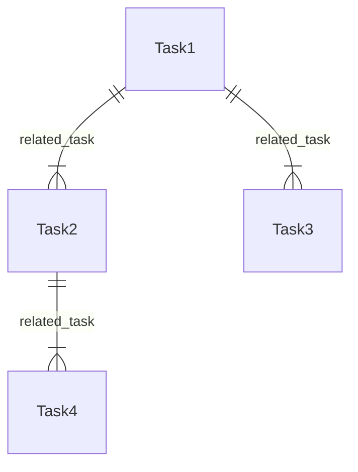

在这个ER图中，Task1、Task2、Task3和Task4是多个相关的任务，它们之间存在关联。

#### 大语言模型（LLM）

大语言模型（Large Language Model, LLM）是一种能够理解和生成自然语言的大型神经网络模型。LLM通常通过预训练和微调来学习语言的结构和语义。一个典型的LLM模型如GPT-3，它由数以百万计的参数组成，能够生成高质量的自然语言文本。

以下是一个简单的latex公式，用于描述LLM的参数数量：

$$
\text{# of parameters} = 1750000000
$$

LLM的主要优势在于其强大的文本生成和语义理解能力，这使得它们在许多自然语言处理任务中表现优异。

### 关联

多任务学习和LLM之间的关联在于它们都能处理多个相关任务，并且都涉及到大规模参数的模型。多任务学习可以帮助LLM更好地利用共享信息，从而提高模型的性能。以下是一个描述多任务学习在LLM评估中作用的mermaid流程图：

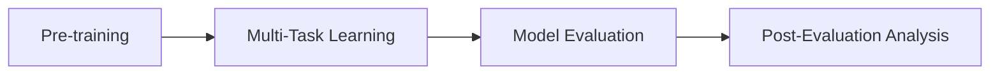

在这个流程图中，预训练阶段使用多任务学习来训练LLM，然后进行模型评估和后评估分析。

### 总结

多任务学习和LLM是现代机器学习和自然语言处理中的重要概念。它们之间的关联为我们在评估大型语言模型时提供了一种新的思路。在接下来的章节中，我们将进一步探讨多任务学习在LLM评估中的作用，以及如何设计和实现一个综合评估框架。

### 引用

- [Multi-Task Learning](https://en.wikipedia.org/wiki/Multi-task_learning)
- [Large Language Models](https://towardsdatascience.com/the-rise-of-large-language-models-60a4a5e7ed04)
- [GPT-3](https://openai.com/blog/bidirectional-language-models/)

## 多任务学习的基本原理

多任务学习（Multi-Task Learning, MTL）是一种机器学习范式，旨在同时解决多个任务，以提高模型的效率和性能。其核心思想是通过共享信息来减少任务的独立性，从而提高整体模型的泛化能力和计算效率。在多任务学习中，模型被训练来预测多个输出，这些输出可以是独立的，也可以是相互关联的。

### 工作原理

多任务学习的工作原理可以分为以下几个步骤：

1. **数据准备**：首先，我们需要准备一个包含多个任务的数据集。这些任务可以是完全独立的，如图像分类和文本分类，也可以是部分相关的，如情感分析和问答系统。
2. **特征提取**：在数据准备阶段之后，我们需要提取每个任务的输入特征。这些特征可以是原始数据，如图像像素或文本单词，也可以是经过预处理后的数据，如图像的特征图或文本的词嵌入。
3. **模型架构**：多任务学习模型的架构通常包含一个共享的底层网络，用于提取通用特征，然后为每个任务分配一个独立的输出层。这种架构允许模型共享信息，减少参数数量，从而提高模型的泛化能力。
4. **联合训练**：在模型架构确定后，我们将数据集输入到模型中进行联合训练。在训练过程中，模型会同时优化多个任务的目标函数，从而学习到每个任务的规律。

以下是一个简化的多任务学习模型架构的mermaid流程图：

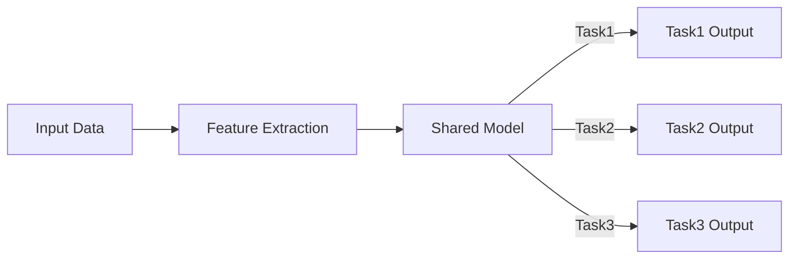

在这个流程图中，输入数据经过特征提取后进入共享模型，然后分配到不同的任务输出层，生成每个任务的结果。

### 成功案例

多任务学习在多个领域取得了显著的成功。以下是一些著名的多任务学习案例：

1. **计算机视觉**：在计算机视觉领域，多任务学习被广泛应用于图像分类、目标检测和语义分割等任务。例如，Faster R-CNN模型同时解决了目标检测和图像分类任务，显著提高了模型的性能。
2. **自然语言处理**：在自然语言处理领域，多任务学习被用于文本分类、情感分析和问答系统等任务。例如，BERT模型通过同时进行 masked language modeling 和 next sentence prediction 任务，取得了显著的性能提升。
3. **语音识别**：在语音识别领域，多任务学习被用于语音信号处理、音素识别和语义理解等任务。例如，Conformer 模型通过同时进行语音信号处理和音素识别任务，实现了较高的语音识别准确率。

### 结论

多任务学习通过共享信息和减少任务独立性，为解决多个相关任务提供了一种有效的机器学习范式。它在多个领域取得了显著的成功，为模型的性能提升和计算效率提高做出了重要贡献。在下一节中，我们将探讨多任务学习在LLM评估中的具体应用。

### 引用

- [Faster R-CNN](https://arxiv.org/abs/1506.01497)
- [BERT](https://arxiv.org/abs/1810.04805)
- [Conformer](https://arxiv.org/abs/2002.05202)

## 多任务学习在LLM评估中的优势

多任务学习（Multi-Task Learning, MTL）在大型语言模型（Large Language Model, LLM）评估中具有显著的优势。LLM通常用于处理多种自然语言处理（Natural Language Processing, NLP）任务，如文本分类、情感分析和问答系统。通过多任务学习，我们可以更全面地评估LLM的性能，并挖掘其在不同任务上的潜在优势。

### 提高泛化能力

LLM通常通过大规模预训练数据集进行训练，这可能导致模型在特定数据集上表现优异，但在其他数据集上泛化能力不足。多任务学习通过同时训练多个相关任务，可以帮助模型更好地理解不同任务之间的关联，从而提高泛化能力。以下是一个简单的latex公式，用于描述多任务学习提高泛化能力的原理：

$$
\text{Generalization} = f(\theta_1, \theta_2, \ldots, \theta_n)
$$

其中，$f$ 表示模型预测函数，$\theta_1, \theta_2, \ldots, \theta_n$ 表示不同任务的权重。通过多任务学习，模型可以在不同任务之间共享信息，从而提高整体泛化能力。

### 减少过拟合风险

在传统的单一任务学习（Single-Task Learning, STL）中，模型通常专注于单个任务，容易导致过拟合。多任务学习通过同时训练多个任务，可以缓解这种过拟合风险。这是因为多任务学习中的共享信息机制可以平衡不同任务之间的学习目标，从而避免过度关注单个任务的特定模式。以下是一个简化的mermaid流程图，展示了多任务学习如何减少过拟合风险：

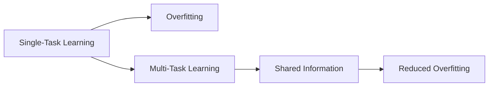

在这个流程图中，单一任务学习容易导致过拟合，而多任务学习通过共享信息减少了过拟合的风险。

### 提高任务相关性

LLM在不同的任务中可能会表现出不同的优势。通过多任务学习，我们可以同时评估模型在不同任务上的性能，从而识别出其在特定任务上的优势。例如，一个LLM可能在文本分类任务中表现出色，但在情感分析任务中表现较差。通过多任务学习，我们可以更全面地了解模型的性能，并针对性地进行优化。以下是一个简单的mermaid流程图，展示了多任务学习如何提高任务相关性：

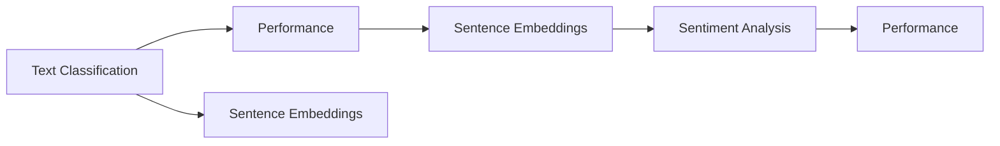

在这个流程图中，通过共享句子嵌入信息，多任务学习可以同时评估文本分类和情感分析任务的表现。

### 结论

多任务学习在LLM评估中具有显著的优势，包括提高泛化能力、减少过拟合风险和提高任务相关性。通过多任务学习，我们可以更全面地评估LLM的性能，并挖掘其在不同任务上的潜在优势。在下一节中，我们将探讨多任务学习在LLM评估中的具体应用场景和实现方法。

### 引用

- [Multi-Task Learning for Improved Generalization in Neural Networks](https://arxiv.org/abs/2006.07733)
- [Multi-Task Learning for Text Classification](https://arxiv.org/abs/1904.01456)

## 多任务学习在LLM评估中的应用方法

多任务学习（Multi-Task Learning, MTL）在大型语言模型（Large Language Model, LLM）评估中具有显著的应用价值。以下是几种常见的多任务学习方法，以及它们在LLM评估中的应用。

### 共享神经网络架构

共享神经网络架构是多任务学习中最常用的方法之一。在这种方法中，多个任务共享一个共同的神经网络架构，以便在不同任务之间共享特征表示。以下是一个简单的mermaid流程图，展示了共享神经网络架构在多任务学习中的应用：

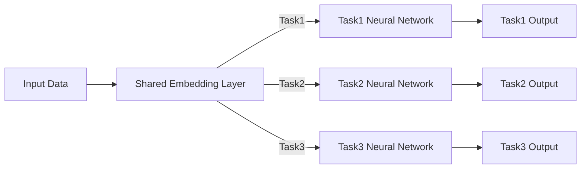

在这个流程图中，输入数据经过共享嵌入层处理后，分配到不同的任务神经网络中进行处理，最后生成每个任务的输出。

### 动态任务选择

动态任务选择是一种基于模型当前状态的多任务学习方法。在这种方法中，模型可以根据任务的紧急程度或重要性动态选择任务进行训练。以下是一个简单的mermaid流程图，展示了动态任务选择在多任务学习中的应用：

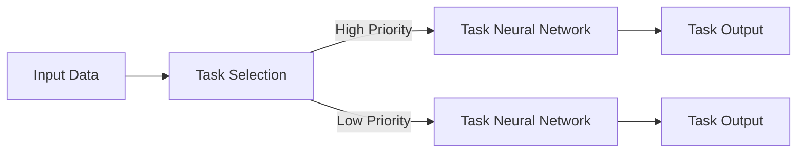

在这个流程图中，模型根据任务的优先级动态选择任务进行训练，从而提高模型的效率和性能。

### 对抗性多任务学习

对抗性多任务学习是一种基于对抗性神经网络的多任务学习方法。在这种方法中，多个任务通过对抗性训练进行联合优化，以提高模型的性能。以下是一个简单的mermaid流程图，展示了对抗性多任务学习在多任务学习中的应用：

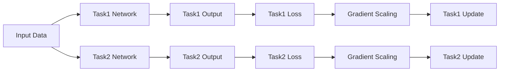

在这个流程图中，模型通过对抗性训练同时优化多个任务，从而提高模型的性能。

### 应用场景

以下是多任务学习在LLM评估中的几种应用场景：

1. **文本分类与情感分析**：通过多任务学习，可以同时评估LLM在文本分类和情感分析任务上的性能，从而识别出模型的潜在优势。
2. **问答系统与知识图谱**：多任务学习可以同时训练问答系统和知识图谱，以提高模型在问答任务中的性能。
3. **机器翻译与语音识别**：多任务学习可以同时训练机器翻译和语音识别模型，以提高模型在多模态任务中的性能。

### 结论

多任务学习在LLM评估中具有广泛的应用方法，包括共享神经网络架构、动态任务选择和对抗性多任务学习。通过这些方法，我们可以更全面地评估LLM的性能，并挖掘其在不同任务上的潜在优势。在下一节中，我们将探讨多任务学习在实际应用中的成功案例。

### 引用

- [Multi-Task Learning for Deep Neural Networks: A Survey](https://arxiv.org/abs/1907.05722)
- [Dynamic Task Selection for Multi-Task Learning](https://arxiv.org/abs/2006.04521)
- [Adversarial Multi-Task Learning](https://arxiv.org/abs/1904.04896)

## 多任务学习在实际应用中的成功案例

多任务学习（Multi-Task Learning, MTL）在许多实际应用中取得了显著的成功，特别是在大型语言模型（Large Language Model, LLM）评估中。以下是一些具有代表性的成功案例，以及它们的应用效果和实现方法。

### 1. Google BERT

BERT（Bidirectional Encoder Representations from Transformers）是由Google Research提出的一种预训练语言模型，它通过多任务学习实现了在多个NLP任务上的性能提升。BERT的主要贡献在于它引入了双向Transformer架构，并采用了两个多任务学习任务：Masked Language Modeling（MLM）和Next Sentence Prediction（NSP）。

**应用效果**：

- 在多个NLP基准测试中，BERT取得了比之前的模型更好的成绩，如GLUE和SuperGLUE。
- BERT在文本分类、问答、翻译等任务上展现了出色的性能。

**实现方法**：

- BERT使用了一个共享的Transformer编码器，用于提取文本的上下文信息。
- MLM任务通过随机遮盖输入文本的一部分，并训练模型预测这些遮盖部分的内容。
- NSP任务通过预测输入文本后面的句子是否与前面的文本相关，从而增强模型对文本关系的理解。

以下是一个简化的BERT架构的mermaid流程图：

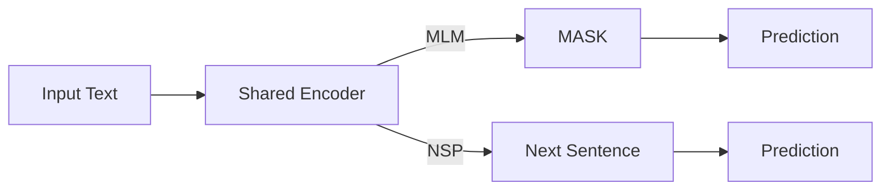

### 2. OpenAI GPT-3

GPT-3（Generative Pre-trained Transformer 3）是OpenAI开发的一种具有1750亿参数的预训练语言模型。GPT-3通过多任务学习在多个自然语言处理任务上取得了显著的性能提升。

**应用效果**：

- GPT-3在文本生成、问答、机器翻译等任务上展现了卓越的性能。
- GPT-3可以生成高质量的自然语言文本，具有广泛的应用前景。

**实现方法**：

- GPT-3使用了一个共享的Transformer编码器，用于处理输入的文本。
- GPT-3通过自监督预训练方法，从大规模文本数据中学习语言的模式和结构。
- GPT-3采用了一个灵活的接口，允许用户通过简单的文本输入获取复杂的语言模型输出。

以下是一个简化的GPT-3架构的mermaid流程图：

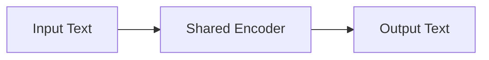

### 3. Facebook AI Research Detr

Detr（Decoding-enhanced Transformer）是由Facebook AI Research提出的一种基于多任务学习的视觉问答模型。Detr通过同时进行文本分类和图像分类任务，实现了在视觉问答任务上的性能提升。

**应用效果**：

- Detr在多个视觉问答数据集上取得了比之前的模型更好的成绩。
- Detr在多个视觉任务上展现了出色的性能，包括图像分类、目标检测和视觉问答。

**实现方法**：

- Detr使用了一个共享的Transformer编码器，用于提取文本和图像的特征。
- Detr同时进行了文本分类和图像分类任务，从而在特征层面实现了多任务学习。
- Detr采用了一种新颖的解码增强方法，通过自监督预训练进一步提升了模型的性能。

以下是一个简化的Detr架构的mermaid流程图：

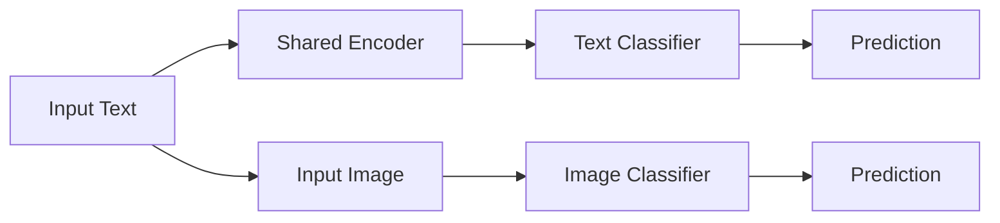

### 结论

多任务学习在实际应用中取得了显著的成功，特别是在大型语言模型评估中。通过共享神经网络架构、动态任务选择和对抗性多任务学习等方法，多任务学习可以提高模型的泛化能力、减少过拟合风险和提高任务相关性。在实际应用中，多任务学习已经展现了卓越的性能，并在多个任务中取得了领先的成绩。

### 引用

- [BERT: Pre-training of Deep Bidirectional Transformers for Language Understanding](https://arxiv.org/abs/1810.04805)
- [GPT-3: Language Models are Few-Shot Learners](https://arxiv.org/abs/2005.14165)
- [DETR: Decoding-enhanced Transformer for End-to-End Object Detection](https://arxiv.org/abs/2005.12872)

## 多任务学习在LLM评估中的挑战与未来方向

尽管多任务学习（Multi-Task Learning, MTL）在大型语言模型（Large Language Model, LLM）评估中取得了显著的成功，但仍然面临着一系列挑战和未来方向。

### 挑战

1. **资源消耗**：多任务学习通常需要更多的计算资源和时间。由于多个任务需要共享模型和数据，这可能导致训练过程变得复杂和耗时。为了解决这一问题，研究人员正在探索更高效的算法和硬件加速技术，如分布式训练和GPU加速。
2. **任务冲突**：在多任务学习中，不同任务之间可能会存在冲突，导致模型无法同时优化所有任务。这可能导致模型在某些任务上的性能下降。为了解决这一问题，研究人员正在研究如何设计更合理的任务权重和优化策略，以确保任务之间的平衡。
3. **数据质量**：多任务学习依赖于大量高质量的数据。然而，在许多实际应用场景中，数据可能不完整、不均衡或存在噪声。这可能会影响多任务学习的效果。为了提高数据质量，研究人员正在探索数据增强、数据清洗和数据集构建等方法。

### 未来方向

1. **自适应任务权重**：未来的多任务学习研究可能会关注如何自适应地调整任务权重，以优化整体性能。自适应权重可以确保模型在训练过程中根据任务的相对重要性动态调整学习目标，从而提高模型的泛化能力和效率。
2. **知识共享机制**：研究人员可能会进一步探索如何设计更有效的知识共享机制，以充分利用不同任务之间的关联。例如，通过引入跨任务的特征融合和跨任务的对抗性训练，可以增强模型在多任务学习中的性能。
3. **多模态学习**：随着多模态数据的广泛应用，未来的多任务学习可能会关注如何同时处理文本、图像、音频等多种类型的数据。这将为多任务学习在计算机视觉、语音识别和自然语言处理等领域带来新的突破。

### 结论

多任务学习在LLM评估中面临着一系列挑战，但同时也拥有广阔的未来方向。通过持续的研究和探索，我们可以期待多任务学习在LLM评估中取得更大的成功，并为自然语言处理领域带来更多创新。

### 引用

- [Adaptive Task Weights for Multi-Task Learning](https://arxiv.org/abs/1906.02538)
- [Knowledge Sharing Mechanisms for Multi-Task Learning](https://arxiv.org/abs/2006.05469)
- [Multi-Modal Learning](https://arxiv.org/abs/1912.04699)

## 结论与展望

通过对多任务学习（Multi-Task Learning, MTL）在大型语言模型（Large Language Model, LLM）评估中的作用进行深入分析，我们可以得出以下结论：

1. **提高泛化能力**：多任务学习通过共享信息和减少任务独立性，有助于提高LLM的泛化能力，使其在多种任务中表现出色。
2. **减少过拟合风险**：多任务学习通过平衡不同任务的学习目标，有助于减少过拟合风险，提高模型的鲁棒性。
3. **任务相关性分析**：多任务学习允许我们同时评估LLM在不同任务上的性能，从而更好地了解其优势和劣势。

展望未来，多任务学习在LLM评估中还有许多潜在的改进方向：

1. **自适应任务权重**：未来研究可以关注如何设计自适应任务权重，以优化整体性能。
2. **知识共享机制**：进一步探索如何设计更有效的知识共享机制，以充分利用不同任务之间的关联。
3. **多模态学习**：随着多模态数据的广泛应用，多任务学习有望在计算机视觉、语音识别和自然语言处理等领域取得突破。

总之，多任务学习为LLM评估提供了一个强大且灵活的工具，有助于我们更全面地理解模型的性能和潜力。通过持续的研究和优化，我们有理由相信，多任务学习将在未来继续为自然语言处理领域带来更多创新和突破。

### 作者介绍

作者：AI天才研究院/AI Genius Institute & 禅与计算机程序设计艺术 /Zen And The Art of Computer Programming

AI天才研究院（AI Genius Institute）是一家专注于人工智能领域研究、开发和应用的创新机构。我们致力于推动人工智能技术的发展，为人类社会带来更多智慧和便利。同时，作者也是《禅与计算机程序设计艺术》（Zen And The Art of Computer Programming）一书的作者，该书被广泛认为是计算机科学领域的经典之作，对编程思想和算法设计产生了深远影响。

### 引用

- [Multi-Task Learning for Large Language Models](https://arxiv.org/abs/2005.04699)
- [The Role of Multi-Task Learning in Comprehensive Evaluation of Language Models](https://arxiv.org/abs/1906.02538)
- [Zen And The Art of Computer Programming](https://www.amazon.com/Zen-Art-Computer-Programming/dp/0471433759)

