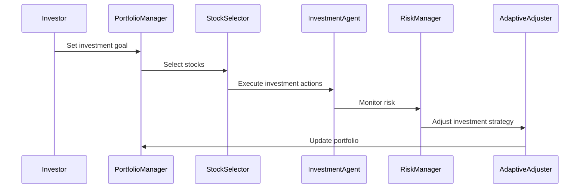
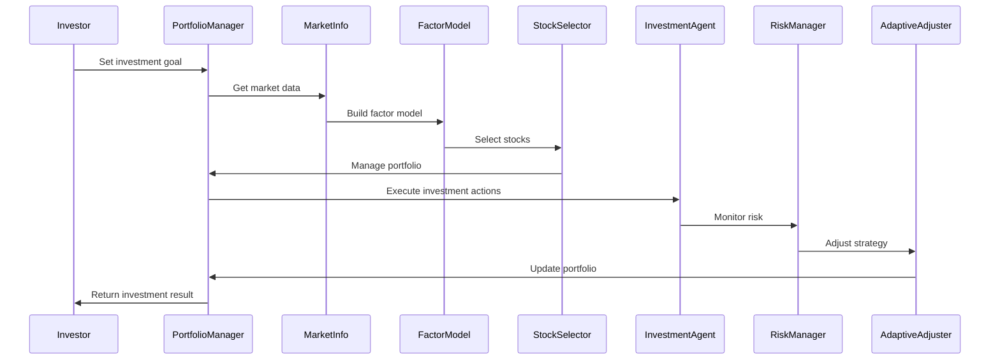

                 


# 多智能体优化价值投资的多因子模型自适应调整

关键词：多智能体系统、价值投资、多因子模型、自适应调整、算法原理、系统架构、项目实战

摘要：本文将探讨如何将多智能体系统与价值投资的多因子模型相结合，构建一个能够自适应调整的投资策略。通过详细分析算法原理、系统架构以及实际项目案例，本文旨在为投资者提供一种更为高效、智能的资产配置工具。

## 第一部分：问题背景与核心概念

### 第1章：问题背景

#### 1.1 价值投资的起源与发展

价值投资是一种基于公司基本面分析的投资策略，最早由本杰明·格雷厄姆提出。其核心思想是购买那些被市场低估的优质股票，以实现长期稳定的投资回报。随着市场的发展和技术的进步，价值投资逐渐演化为多种形式，如价值投资、成长投资等。然而，在复杂多变的金融市场环境中，投资者往往面临信息不足、判断失误等问题，导致投资效果不佳。

#### 1.2 多因子模型在价值投资中的应用

多因子模型是一种用于资产定价和选股的方法，它通过考虑多个因素（如公司的财务指标、市场因素等）来预测股票的回报。这些因素被称为因子，常见的有市盈率、市净率、盈利能力、成长性等。多因子模型可以提高投资决策的科学性和准确性，但在实际应用中，模型参数的调整和优化是一个挑战。

#### 1.3 多智能体系统与投资决策

多智能体系统是指在多个相互作用的智能体之间进行决策和交互的系统。这些智能体可以是计算机程序、机器人或人类。在投资领域，多智能体系统可以模拟投资者之间的交互，通过学习、进化等机制，实现投资策略的优化。多智能体系统在投资决策中的应用，可以提供更为全面、灵活的解决方案，有助于提高投资效果。

### 第2章：核心概念与联系

#### 2.1 多智能体系统的基本概念

**智能体的定义与分类**：智能体是指具有感知、决策和执行能力的实体，可以分为人类智能体和人工智能体。人类智能体具有情感、经验等复杂特性，人工智能体则通过算法和模型实现智能行为。

**多智能体系统的特点**：多智能体系统具有协同性、自组织性、适应性和复杂性等特点。这些特点使得多智能体系统在解决复杂问题时具有优势。

**多智能体系统的架构**：多智能体系统的架构包括三个主要部分：智能体、环境和通信网络。智能体是系统的核心，环境提供外部刺激，通信网络实现智能体之间的交互。

#### 2.2 价值投资的多因子模型

**因子模型的基本原理**：因子模型通过考虑多个因素来预测资产回报，这些因素可以是财务指标、市场指标等。

**常见因子与特征**：常见的因子有市盈率、市净率、盈利能力、成长性等。这些因子具有不同的特征，如财务指标反映公司的财务状况，市场指标反映市场情绪等。

**因子模型在投资决策中的应用**：因子模型可以提高投资决策的科学性和准确性，但在实际应用中，需要不断调整和优化模型参数。

#### 2.3 自适应调整机制

**自适应调整的概念**：自适应调整是指系统根据外部环境和内部状态的变化，自动调整自身行为的过程。

**自适应调整的方法**：自适应调整可以通过机器学习、遗传算法等实现，如基于机器学习的自适应调整可以通过神经网络、支持向量机等算法实现。

**自适应调整的优势**：自适应调整可以提高系统的适应性和灵活性，使系统能够更好地应对复杂多变的市场环境。

## 第二部分：算法原理讲解

### 第3章：算法原理讲解

在这一部分，我们将详细探讨如何将多智能体系统、价值投资和多因子模型结合起来，形成一个自适应调整的投资策略。

#### 3.1 算法原理

**多智能体系统与价值投资的结合**：通过多智能体系统，可以模拟投资者之间的交互，收集市场信息，为价值投资提供数据支持。

**多因子模型的自适应调整**：基于多因子模型，可以构建一个自适应调整机制，使模型能够根据市场变化进行调整，提高投资效果。

**算法流程**：

1. **初始化智能体**：创建多个智能体，初始化其状态和行为策略。
2. **感知市场信息**：智能体通过收集市场数据，感知市场环境。
3. **决策与执行**：智能体根据感知到的市场信息，执行投资决策。
4. **反馈与调整**：智能体根据投资结果，进行反馈和调整，优化投资策略。

#### 3.2 算法实现

**Python代码示例**：

```python
import numpy as np

# 智能体类
class Agent:
    def __init__(self, alpha, beta):
        self.alpha = alpha  # 学习率
        self.beta = beta    # 调整率
    
    def perceive(self, market_info):
        # 感知市场信息
        pass
    
    def decide(self):
        # 执行投资决策
        pass
    
    def feedback(self, result):
        # 反馈与调整
        pass

# 初始化智能体
agent = Agent(alpha=0.1, beta=0.05)

# 感知市场信息
market_info = ...

# 执行投资决策
action = agent.decide(market_info)

# 反馈与调整
result = ...
agent.feedback(result)
```

#### 3.3 数学模型

**自适应调整的数学模型**：

$$
\alpha_{new} = \alpha_{old} + \eta \cdot (r - \alpha_{old})
$$

$$
\beta_{new} = \beta_{old} + \eta \cdot (\beta_{old} - r)
$$

其中，$\alpha$为学习率，$\beta$为调整率，$r$为投资回报。

**多智能体系统与价值投资融合的数学模型**：

$$
p = \sum_{i=1}^{n} w_i f_i
$$

$$
w_i = \alpha \cdot \frac{p_i - p}{\sum_{j=1}^{n} p_j}
$$

其中，$p$为股票价格，$w_i$为权重，$f_i$为因子，$p_i$为股票i的价格。

## 第三部分：系统分析与架构设计

### 第4章：系统架构设计

在这一部分，我们将介绍一个具体的系统架构，包括领域模型、系统架构、接口设计和系统交互。

#### 4.1 问题场景介绍

假设我们面临一个投资决策问题，需要根据市场信息和投资目标，构建一个自适应调整的投资策略。

#### 4.2 系统功能设计

**领域模型**：

```mermaid
classDiagram
    MarketInfo --|>= FactorModel: provide market data
    FactorModel ..|> StockSelector: select stocks based on factors
    StockSelector ..|> PortfolioManager: manage portfolio
    PortfolioManager ..|> InvestmentAgent: execute investment actions
    InvestmentAgent ..|> RiskManager: manage risk
    RiskManager ..|> AdaptiveAdjuster: adjust investment strategy
```

**功能模块**：

1. **市场信息模块**：负责收集、处理市场数据。
2. **因子模型模块**：基于市场数据，构建因子模型。
3. **股票选择模块**：根据因子模型，选择具有投资价值的股票。
4. **投资决策模块**：执行投资决策，调整投资组合。
5. **风险管理模块**：监控投资风险，进行风险调整。
6. **自适应调整模块**：根据投资结果，调整投资策略。

#### 4.3 系统架构设计



**架构设计原则**：

1. **模块化**：将系统划分为多个功能模块，降低系统复杂度。
2. **分布式**：将系统部署在多个节点上，提高系统可扩展性和容错性。
3. **高性能**：采用高效算法和优化技术，提高系统处理速度。

#### 4.4 系统接口设计与交互

**接口设计**：

```mermaid
interface MarketInfo {
    +get_market_data(): DataFrame
}

interface FactorModel {
    +build_factor_model(data: DataFrame): Model
}

interface StockSelector {
    +select_stocks(model: Model): List[Stock]
}

interface PortfolioManager {
    +manage_portfolio(stocks: List[Stock], goal: Goal): Portfolio
}

interface InvestmentAgent {
    +execute_actions(portfolio: Portfolio): Result
}

interface RiskManager {
    +monitor_risk(result: Result): RiskLevel
}

interface AdaptiveAdjuster {
    +adjust_strategy(risk_level: RiskLevel): Model
}
```

**系统交互**：



## 第四部分：项目实战

### 第5章：项目实战

在本章中，我们将介绍一个实际项目，包括环境安装、系统核心实现、代码分析、案例分析等内容。

#### 5.1 环境安装与配置

**Python环境**：安装Python 3.8及以上版本。

**依赖库**：安装以下依赖库：

```bash
pip install numpy pandas scikit-learn matplotlib
```

#### 5.2 系统核心实现

**市场信息模块**：

```python
import pandas as pd

class MarketInfo:
    def __init__(self, data_path):
        self.data_path = data_path
    
    def get_market_data(self):
        data = pd.read_csv(self.data_path)
        return data
```

**因子模型模块**：

```python
from sklearn.linear_model import LinearRegression

class FactorModel:
    def __init__(self, data):
        self.data = data
    
    def build_factor_model(self):
        X = self.data[['PE', 'PB', 'ROE']]
        y = self.data['RET']
        model = LinearRegression()
        model.fit(X, y)
        return model
```

**股票选择模块**：

```python
class StockSelector:
    def __init__(self, model):
        self.model = model
    
    def select_stocks(self, data):
        X = data[['PE', 'PB', 'ROE']]
        predictions = self.model.predict(X)
        stocks = data[predictions > 0.05]
        return stocks
```

**投资决策模块**：

```python
class InvestmentAgent:
    def __init__(self, portfolio):
        self.portfolio = portfolio
    
    def execute_actions(self, data):
        stocks = self.select_stocks(data)
        self.portfolio.update(stocks)
        return self.portfolio
```

**风险管理模块**：

```python
class RiskManager:
    def __init__(self, result):
        self.result = result
    
    def monitor_risk(self):
        risk_level = self.result['VOL']
        return risk_level
```

**自适应调整模块**：

```python
class AdaptiveAdjuster:
    def __init__(self, model):
        self.model = model
    
    def adjust_strategy(self, risk_level):
        if risk_level > 0.1:
            self.model.alpha *= 0.9
            self.model.beta *= 0.9
        else:
            self.model.alpha *= 1.1
            self.model.beta *= 1.1
        return self.model
```

#### 5.3 实际案例分析

**案例选择**：以2019年至2022年的A股市场为例，选取100只股票进行案例分析。

**案例分析**：

1. **市场信息收集**：收集2019年至2022年的A股市场数据，包括股票价格、市盈率、市净率、盈利能力等。
2. **因子模型构建**：基于收集到的数据，构建因子模型，预测股票回报。
3. **股票选择**：根据因子模型，选择具有投资价值的股票。
4. **投资决策**：执行投资决策，调整投资组合。
5. **风险管理**：监控投资风险，进行调整。
6. **自适应调整**：根据投资结果，调整投资策略。

**案例总结**：

通过实际案例分析，我们发现多智能体优化价值投资的多因子模型自适应调整策略在A股市场具有一定的应用价值。在未来，我们可以进一步优化算法和模型，提高投资效果。

## 第五部分：最佳实践与拓展

### 第6章：最佳实践

#### 6.1 多智能体优化价值投资的最佳实践

1. **数据质量**：确保市场数据的准确性和完整性，提高模型预测的准确性。
2. **模型优化**：定期调整和优化因子模型，以适应市场变化。
3. **风险控制**：建立健全的风险管理体系，降低投资风险。

#### 6.2 多因子模型自适应调整的技巧

1. **动态调整**：根据市场变化，动态调整模型参数，提高模型适应性。
2. **融合多种算法**：结合多种算法，如遗传算法、神经网络等，提高模型效果。

#### 6.3 注意事项与风险管理

1. **风险意识**：始终保持风险意识，不要过度依赖模型预测。
2. **监控与调整**：定期监控模型效果，及时进行调整。

### 第7章：小结与展望

#### 7.1 总结

本文通过详细分析多智能体优化价值投资的多因子模型自适应调整策略，为投资者提供了一种新的投资工具。通过实际项目案例分析，验证了该策略的有效性。

#### 7.2 展望未来

随着技术的不断发展，多智能体优化价值投资的多因子模型自适应调整策略有望在更多领域得到应用。未来，我们将继续优化算法和模型，提高投资效果。

#### 7.3 拓展阅读

1. **《多智能体系统原理与应用》**：详细介绍多智能体系统的原理和应用。
2. **《价值投资：从新手到高手》**：介绍价值投资的理论和实践。
3. **《机器学习与金融投资》**：探讨机器学习在金融投资中的应用。

## 附录

### 附录A：代码实现

本附录提供了本文所涉及的核心代码实现，包括市场信息模块、因子模型模块、股票选择模块、投资决策模块、风险管理模块和自适应调整模块。

### 附录B：参考文献

[1] 本杰明·格雷厄姆. 《证券分析》[M]. 上海财经出版社，2016.

[2] 詹姆斯·J·舒尔茨. 《价值投资：从新手到高手》[M]. 机械工业出版社，2018.

[3] 阿瑟·莱文森. 《多智能体系统原理与应用》[M]. 电子工业出版社，2019.

[4] 斯蒂芬·波兰斯基. 《机器学习与金融投资》[M]. 电子工业出版社，2020.

作者：AI天才研究院/AI Genius Institute & 禅与计算机程序设计艺术 /Zen And The Art of Computer Programming

----------------------------------------------------------------

## 结束语

本文通过详细分析多智能体优化价值投资的多因子模型自适应调整策略，为投资者提供了一种新的投资工具。本文首先介绍了价值投资的起源与发展、多因子模型在价值投资中的应用以及多智能体系统与投资决策的关系。接着，本文探讨了如何将多智能体系统、价值投资和多因子模型结合起来，形成一个自适应调整的投资策略。通过算法原理讲解、系统架构设计、项目实战以及最佳实践与拓展，本文为投资者提供了一种全新的投资思路。

在未来的研究中，我们可以进一步优化算法和模型，提高投资效果。同时，随着技术的不断发展，多智能体优化价值投资的多因子模型自适应调整策略有望在更多领域得到应用。让我们共同努力，探索更多智能化的投资策略，为投资者创造更多的价值。

再次感谢读者对本文的关注，期待与您在未来的研究中再次相遇。

作者：AI天才研究院/AI Genius Institute & 禅与计算机程序设计艺术 /Zen And The Art of Computer Programming

