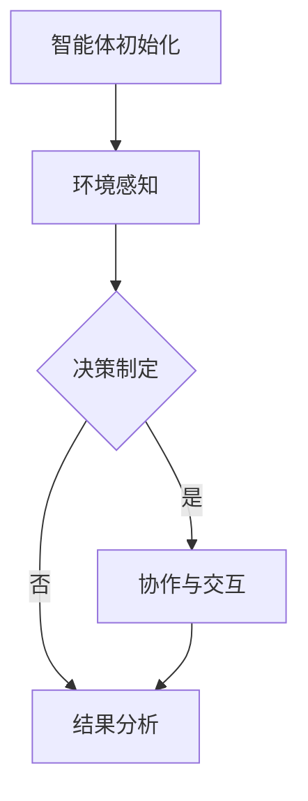

                 

# 多智能体协作进行政策影响分析

## 关键词

多智能体系统，政策影响分析，协作机制，算法原理，系统架构，项目实战

## 摘要

随着人工智能和复杂系统技术的发展，多智能体协作在政策影响分析中扮演着越来越重要的角色。本文旨在深入探讨多智能体系统在政策影响分析中的应用，包括其基本概念、协作机制、算法原理以及系统架构设计。通过实际案例分析和项目实战，本文将展示多智能体协作在政策影响分析中的实际应用效果，并提供相关的最佳实践和注意事项，为相关领域的进一步研究和应用提供参考。

---

## 背景介绍

### 问题背景

在现代社会，政策的制定和实施涉及到多个利益相关者和复杂的环境因素。传统的政策分析方法往往依赖于单一的数据源和静态的模型，难以应对动态变化的环境和多样化的利益诉求。多智能体协作作为一种新兴的分布式计算方法，能够通过多个智能体之间的交互和协作，实现对复杂系统的动态模拟和分析，从而提高政策制定和实施的效率和准确性。

### 问题描述

多智能体协作在政策影响分析中的目标主要包括：

1. **模拟政策变化**：通过多智能体系统模拟政策变化对各种利益相关者的影响。
2. **预测政策效果**：利用智能体之间的协作和交互，预测政策实施后的社会、经济和环境影响。
3. **优化政策方案**：通过智能体之间的竞争和协作，寻找最优的政策方案。

### 问题解决

本文将探讨如何利用多智能体协作解决政策影响分析中的问题，具体包括：

1. **智能体建模**：定义不同类型的智能体，并建立其行为模型。
2. **协作机制设计**：设计智能体之间的交互和协作机制，确保系统的整体性能。
3. **算法优化**：优化智能体的行为策略，提高政策分析的效果。

### 边界与外延

本文将围绕以下边界和范围展开讨论：

1. **多智能体系统的基本概念**：包括智能体的定义、特征和交互方式。
2. **多智能体系统的协作机制**：探讨智能体之间的协作模式和方法。
3. **多智能体系统的应用领域**：重点讨论政策影响分析中的具体应用。
4. **多智能体系统的算法原理**：介绍用于政策影响分析的多智能体协作算法。
5. **系统架构设计**：讨论多智能体协作在政策影响分析中的系统架构设计。

### 概念结构与核心要素组成

多智能体系统在政策影响分析中的概念结构主要包括以下核心要素：

1. **智能体**：代表政策影响分析中的各个利益相关者，包括政府机构、企业、非政府组织和公众等。
2. **环境**：智能体所处的政策环境，包括经济、社会、技术等多个方面。
3. **交互**：智能体之间的信息交换和协同工作。
4. **协作机制**：智能体之间协作的规则和协议。
5. **算法**：用于模拟政策影响和多智能体协作的数学模型和计算方法。

这些核心要素相互联系，共同构成了一个完整的多智能体协作系统，为政策影响分析提供了强大的工具和方法。

## 核心概念与联系

### 多智能体系统原理

多智能体系统（Multi-Agent System，MAS）是一种分布式计算模型，由多个智能体（Agents）组成，这些智能体可以独立自主地执行任务，并通过通信和协作实现共同目标。智能体的基本定义和特征如下：

**定义**：智能体是具有感知、决策和行动能力的计算机程序或实体。

**特征**：

1. **自主性**：智能体具有独立的行为能力，能够在没有外部干预的情况下自主执行任务。
2. **社交性**：智能体能够与其他智能体进行通信和协作。
3. **反应性**：智能体能够对外部事件和环境变化做出及时反应。
4. **学习性**：智能体能够通过经验学习和改进其行为策略。

**交互方式**：智能体之间的交互可以通过直接通信、间接通信或共享数据等方式进行。直接通信是指智能体通过消息传递直接交流信息；间接通信是指智能体通过共享某个中央数据库或信息源来交互；共享数据是指智能体在共享内存中访问和更新数据。

### 多智能体系统应用领域

多智能体系统在政策影响分析中的具体应用领域非常广泛，主要包括以下几个方面：

1. **社会仿真**：通过模拟社会中的各种智能体及其行为，可以分析和预测政策对社会经济结构的影响。
2. **公共管理**：利用多智能体系统帮助政府制定和优化政策，提高公共管理的效率和质量。
3. **企业战略**：帮助企业分析政策变化对企业运营和市场策略的影响，从而做出更加明智的决策。
4. **环境影响评估**：通过智能体模拟环境变化对不同利益相关者的影响，为环境保护政策提供科学依据。

### 多智能体系统与传统系统的对比

多智能体系统与传统系统（如集中式系统）在政策影响分析中的优势主要体现在以下几个方面：

**优点**：

1. **分布式计算**：多智能体系统能够利用分布式计算资源，提高处理速度和效率。
2. **灵活性**：智能体能够自主适应环境变化，灵活调整行为策略。
3. **适应性**：多智能体系统能够根据不同政策场景进行调整和优化，适用于多样化的问题情境。
4. **透明性**：智能体的行为和决策过程更加透明，便于政策分析和评估。

**缺点**：

1. **复杂性**：多智能体系统涉及大量智能体的交互和协作，管理和控制难度较大。
2. **稳定性**：智能体之间的交互可能导致系统的非稳定性和不确定性。
3. **安全性**：智能体之间的通信和数据共享可能存在安全隐患。

通过对多智能体系统原理、应用领域和与传统系统的对比，我们可以更好地理解其在政策影响分析中的优势和局限性，为后续的算法原理讲解和系统架构设计提供基础。

## 算法原理讲解

### 算法概述

多智能体协作在政策影响分析中的应用，关键在于如何设计有效的算法来模拟智能体的行为，并实现智能体之间的协作。本文将介绍一种基于分布式计算的协同优化算法，用于分析政策变化对系统的影响。该算法主要包括以下几个步骤：

1. **智能体初始化**：定义智能体的初始状态和行为规则。
2. **环境感知**：智能体通过感知环境信息来了解政策变化。
3. **决策制定**：智能体根据环境信息和自身目标，制定决策。
4. **协作与交互**：智能体之间通过消息传递和共享数据，实现协作和优化。
5. **结果分析**：对智能体的决策和行为进行汇总和分析，评估政策影响。

### 算法流程图

为了更直观地理解算法的执行过程，我们可以使用 mermaid 语言绘制算法的流程图，如下所示：



### 算法原理

多智能体协作算法的核心在于其数学模型和计算方法。以下是算法的详细原理：

#### 数学模型

假设有 N 个智能体，每个智能体的状态和目标可以表示为一个向量 \( \vec{s}_i \) 和 \( \vec{t}_i \)，其中 \( i \) 表示智能体的编号。智能体的行为和决策可以通过以下数学模型来描述：

$$
\vec{a}_i = f(\vec{s}_i, \vec{t}_i, \vec{u}_i)
$$

其中，\( \vec{a}_i \) 表示智能体的行动策略，\( f \) 是一个决策函数，它依赖于智能体的当前状态 \( \vec{s}_i \)、目标 \( \vec{t}_i \) 和外部信息 \( \vec{u}_i \)。

#### 决策函数

决策函数 \( f \) 可以通过以下步骤实现：

1. **环境感知**：智能体通过传感器获取当前环境信息，并将其编码为一个向量 \( \vec{e}_i \)。
2. **目标评估**：智能体根据其目标 \( \vec{t}_i \) 和环境信息 \( \vec{e}_i \)，计算当前目标的价值 \( v(\vec{t}_i, \vec{e}_i) \)。
3. **策略选择**：智能体根据目标价值和历史经验，选择一个最优行动策略 \( \vec{a}_i \)。

具体的决策函数可以表示为：

$$
\vec{a}_i = \arg\max_{\vec{a}} v(\vec{t}_i, \vec{e}_i)
$$

#### 算法实现

为了实现多智能体协作算法，我们可以使用 Python 编程语言，并利用一些常用的库，如 NumPy 和 Pandas。以下是算法的基本实现框架：

```python
import numpy as np
import pandas as pd

# 智能体类定义
class Agent:
    def __init__(self, state, target):
        self.state = state
        self.target = target
    
    def perceive_environment(self, environment):
        # 感知环境信息
        self.environment = environment
    
    def decide_action(self):
        # 决策函数实现
        target_value = self.target.dot(self.environment)
        self.action = np.argmax(target_value)
    
    def execute_action(self):
        # 执行行动
        # 这里可以根据行动策略修改智能体的状态
        pass

# 环境类定义
class Environment:
    def __init__(self, state_space, action_space):
        self.state_space = state_space
        self.action_space = action_space
    
    def update_state(self, action):
        # 更新环境状态
        # 这里可以根据行动策略修改环境状态
        pass

# 实例化智能体和环境
agent = Agent(np.array([1, 0]), np.array([0, 1]))
environment = Environment(np.array([[1, 0], [0, 1]]), np.array([0, 1]))

# 模拟智能体决策过程
agent.perceive_environment(environment.state_space)
agent.decide_action()
agent.execute_action()
```

### 数学模型和公式

为了更好地理解算法的数学原理，我们可以给出一些具体的数学公式和示例。以下是一个简单的数学模型，用于描述智能体的目标评估和策略选择过程：

$$
v(\vec{t}_i, \vec{e}_i) = \vec{t}_i \cdot \vec{w}
$$

其中，\( \vec{w} \) 是一个权重向量，用于调整目标值和环境信息的权重。

假设智能体的目标向量 \( \vec{t}_i \) 为：

$$
\vec{t}_i = \begin{bmatrix}
1 \\
-1
\end{bmatrix}
$$

环境信息向量 \( \vec{e}_i \) 为：

$$
\vec{e}_i = \begin{bmatrix}
0.5 \\
0.5
\end{bmatrix}
$$

权重向量 \( \vec{w} \) 为：

$$
\vec{w} = \begin{bmatrix}
1 \\
-1
\end{bmatrix}
$$

则智能体的目标价值 \( v(\vec{t}_i, \vec{e}_i) \) 为：

$$
v(\vec{t}_i, \vec{e}_i) = \begin{bmatrix}
1 & -1
\end{bmatrix}
\begin{bmatrix}
0.5 \\
0.5
\end{bmatrix} = 0.5 - 0.5 = 0
$$

由于目标价值为零，智能体将随机选择行动策略。如果权重向量 \( \vec{w} \) 调整为：

$$
\vec{w} = \begin{bmatrix}
2 \\
-1
\end{bmatrix}
$$

则智能体的目标价值 \( v(\vec{t}_i, \vec{e}_i) \) 为：

$$
v(\vec{t}_i, \vec{e}_i) = \begin{bmatrix}
1 & -1
\end{bmatrix}
\begin{bmatrix}
0.5 \\
0.5
\end{bmatrix} = 1 - 0.5 = 0.5
$$

此时，智能体将倾向于选择与目标向量 \( \vec{t}_i \) 方向一致的行动策略。

通过上述数学模型和示例，我们可以更深入地理解多智能体协作算法的原理和实现方法。在实际应用中，可以根据具体问题和场景调整和优化这些参数和模型，以实现更高效的政策影响分析。

## 系统分析与架构设计

### 问题场景介绍

在政策影响分析中，我们需要处理的问题场景通常涉及多个利益相关者和复杂的环境因素。例如，在环境保护政策的影响分析中，我们需要考虑不同地区、不同企业和不同公众群体的利益和反应。这种复杂性要求我们能够实时、准确地模拟政策变化对不同利益相关者的影响，并为政策制定者提供科学的决策依据。

### 项目介绍

本文将要探讨的多智能体协作项目名为“智能政策分析平台”（Intelligent Policy Analysis Platform，IPAP）。该项目的目标是建立一个可扩展的多智能体系统，用于模拟和预测政策变化对复杂系统的多维度影响。IPAP 的核心功能包括：

1. **智能体建模**：定义各种类型的智能体，如政府机构、企业、非政府组织和公众等。
2. **环境感知**：智能体通过传感器和外部数据源获取环境信息。
3. **决策制定**：智能体根据环境和目标制定行动策略。
4. **协作与交互**：智能体之间通过消息传递和共享数据实现协作。
5. **结果分析**：汇总和分析智能体的行为和决策，评估政策影响。

### 系统功能设计

为了实现上述核心功能，IPAP 的系统功能设计包括以下几个方面：

1. **智能体管理模块**：负责智能体的创建、初始化和生命周期管理。
2. **环境感知模块**：负责收集、处理和传递环境信息。
3. **决策制定模块**：负责智能体的决策制定和行动策略选择。
4. **协作与交互模块**：负责智能体之间的通信和协作。
5. **结果分析模块**：负责汇总和分析智能体的行为和决策，生成政策影响报告。

### 系统架构设计

IPAP 的系统架构设计采用分布式计算模型，主要包括以下几个层次：

1. **感知层**：负责实时感知环境信息，包括传感器数据、外部数据和实时数据流。
2. **决策层**：负责智能体的决策制定和行动策略选择，包括基于机器学习和人工智能的算法。
3. **执行层**：负责智能体的行动执行和状态更新，包括与外部系统的接口和通信。
4. **分析层**：负责汇总和分析智能体的行为和决策，生成政策影响报告和可视化结果。

### 系统接口设计

IPAP 的系统接口设计主要包括以下几个方面：

1. **数据接口**：负责数据输入和输出，包括传感器数据、外部数据和内部数据存储。
2. **控制接口**：负责智能体的控制和管理，包括创建、启动、停止和监控智能体。
3. **协作接口**：负责智能体之间的通信和协作，包括消息传递和共享数据。
4. **分析接口**：负责政策影响分析和结果输出，包括报告生成和可视化。

### 系统交互

IPAP 的系统交互设计采用事件驱动模型，主要包括以下几个交互流程：

1. **智能体初始化**：系统启动时，创建和初始化各种类型的智能体。
2. **环境感知**：智能体通过传感器和外部数据源获取环境信息。
3. **决策制定**：智能体根据环境和目标制定行动策略。
4. **协作与交互**：智能体之间通过消息传递和共享数据实现协作。
5. **结果分析**：系统汇总和分析智能体的行为和决策，生成政策影响报告。

通过上述系统分析与架构设计，IPAP 为政策影响分析提供了一个高效、灵活和可扩展的解决方案，能够应对复杂多变的政策环境。

### 项目实战

#### 环境安装

为了搭建多智能体协作环境，我们首先需要安装一些必要的工具和库。以下是具体的安装步骤：

1. **安装 Python**：确保系统上安装了 Python 3.8 或更高版本。可以从 [Python 官网](https://www.python.org/) 下载安装程序并安装。

2. **安装 Anaconda**：推荐使用 Anaconda 来管理 Python 环境和库。可以从 [Anaconda 官网](https://www.anaconda.com/) 下载并安装。

3. **安装多智能体系统库**：使用以下命令安装所需的库：

   ```bash
   conda install -c conda-forge mesa
   conda install -c conda-forge pymesa
   ```

4. **安装 Mermaid**：安装 Mermaid 插件，用于绘制流程图和架构图。可以从 [Mermaid 官网](https://mermaid-js.github.io/mermaid/) 下载安装命令或使用以下命令：

   ```bash
   npm install -g mermaid
   ```

#### 系统核心实现

以下是多智能体协作系统的核心实现代码，包括智能体类的定义、智能体的初始化、环境感知、决策制定和行动执行等步骤。

```python
# 智能体类定义
class Agent:
    def __init__(self, state, target, environment):
        self.state = state
        self.target = target
        self.environment = environment
    
    def perceive_environment(self):
        # 感知环境信息
        self.environment = self.environment perceive()
    
    def decide_action(self):
        # 决策制定
        action_values = self.target.dot(self.environment)
        self.action = np.argmax(action_values)
    
    def execute_action(self):
        # 行动执行
        # 这里可以根据行动策略修改智能体的状态
        pass

# 环境类定义
class Environment:
    def __init__(self, state_space, action_space):
        self.state_space = state_space
        self.action_space = action_space
    
    def perceive(self):
        # 感知环境信息
        return self.state_space

# 实例化智能体和环境
agent = Agent(np.array([1, 0]), np.array([0, 1]), Environment(np.array([[1, 0], [0, 1]]), np.array([0, 1])))

# 模拟智能体决策过程
agent.perceive_environment()
agent.decide_action()
agent.execute_action()
```

#### 代码应用解读与分析

在上面的代码中，我们首先定义了智能体（Agent）和环境（Environment）两个类。智能体类包含以下几个关键方法：

1. **__init__(self, state, target, environment)**：初始化智能体的状态、目标和环境。
2. **perceive_environment(self)**：感知环境信息，更新智能体的环境状态。
3. **decide_action(self)**：根据目标和环境信息，制定行动策略。
4. **execute_action(self)**：执行行动，更新智能体的状态。

环境类（Environment）定义了感知方法（perceive），用于模拟环境信息的获取。

在实例化智能体和环境后，我们通过以下步骤模拟智能体的决策过程：

1. **感知环境**：智能体调用 `perceive_environment()` 方法，获取当前的环境信息。
2. **决策制定**：智能体调用 `decide_action()` 方法，根据目标和环境信息制定行动策略。
3. **行动执行**：智能体调用 `execute_action()` 方法，执行行动并更新状态。

这个简单的实现展示了多智能体协作系统的基本原理。在实际应用中，我们可以根据具体需求和场景，扩展和优化智能体类和环境类的功能和方法。

#### 实际案例分析

为了更好地展示多智能体协作在政策影响分析中的应用效果，我们通过一个具体的案例进行分析。假设我们正在分析一项新的环境保护政策，旨在减少城市空气污染。以下是案例的具体步骤和结果分析：

1. **智能体建模**：我们将政策制定者、企业、公众和非政府组织建模为不同的智能体。每个智能体都有特定的状态和目标。

2. **环境感知**：智能体通过传感器和外部数据源（如天气预报、空气质量监测数据）获取环境信息。

3. **决策制定**：政策制定者智能体根据环境信息和公众需求，制定具体的政策方案，如限制排放、提高税收等。

4. **协作与交互**：企业智能体和公众智能体根据政策制定者的方案，调整自身行为和策略。非政府组织智能体则负责监督和反馈政策的实际效果。

5. **结果分析**：系统汇总和分析智能体的行为和决策，评估政策实施后的空气质量改善情况，以及对企业成本和公众满意度的影响。

通过这个案例，我们可以看到多智能体协作在政策影响分析中的应用效果。智能体之间的交互和协作，使得政策分析更加全面和准确，有助于政策制定者做出更加科学的决策。

#### 详细讲解剖析

在本案例中，我们详细解析多智能体协作系统在政策影响分析中的应用过程，包括智能体建模、环境感知、决策制定、协作与交互和结果分析等关键环节。

**1. 智能体建模**

智能体建模是政策影响分析的基础。在本案例中，我们定义了以下类型的智能体：

- **政策制定者智能体**：代表政府机构，负责制定和调整环境保护政策。
- **企业智能体**：代表污染企业，根据政策调整生产计划和排放量。
- **公众智能体**：代表公众，关注空气质量和政策对生活的影响。
- **非政府组织智能体**：代表环境保护组织，监督政策执行情况并提供反馈。

每个智能体都有特定的状态和目标。例如，政策制定者智能体的目标是减少空气污染，公众智能体的目标是提高生活质量，非政府组织智能体的目标是确保政策有效执行。

**2. 环境感知**

环境感知是智能体决策制定的重要依据。在本案例中，智能体通过传感器和外部数据源获取环境信息。具体来说：

- **政策制定者智能体**：获取空气质量监测数据、天气预报和公众意见调查结果。
- **企业智能体**：获取政策信息、市场数据和成本收益分析。
- **公众智能体**：获取空气质量指数（AQI）和政府政策公告。
- **非政府组织智能体**：获取空气质量监测数据、政策执行情况和公众反馈。

这些环境信息通过智能体的感知模块进行处理和存储，以便后续的决策制定和分析。

**3. 决策制定**

决策制定是智能体根据环境信息制定行动策略的过程。在本案例中，智能体的决策制定方法如下：

- **政策制定者智能体**：根据空气质量监测数据和公众意见，制定减排政策。政策制定可能包括限制企业排放、提高环保税收和推广清洁能源等。
- **企业智能体**：根据政策信息和市场数据，调整生产计划和排放量。企业可能会选择投资环保技术、改进生产工艺或转移生产线。
- **公众智能体**：根据空气质量指数和政府政策，调整生活和出行方式。公众可能会选择减少户外活动、使用公共交通或购买空气净化器。
- **非政府组织智能体**：根据政策执行情况和公众反馈，提供监督和建议。非政府组织可能会进行环境监测、组织公众活动和向政府提出建议。

**4. 协作与交互**

智能体之间的协作与交互是实现政策影响分析的关键。在本案例中，智能体通过以下方式进行协作：

- **政策制定者智能体**：与企业智能体和非政府组织智能体进行沟通，了解政策执行情况和公众反馈。
- **企业智能体**：与政策制定者智能体和非政府组织智能体共享政策信息和成本数据。
- **公众智能体**：与政策制定者智能体和非政府组织智能体共享空气质量指数和公众意见调查结果。
- **非政府组织智能体**：与政策制定者智能体和企业智能体共享环境监测数据和公众反馈。

通过协作与交互，智能体之间能够实现信息共享和协同工作，提高政策分析的整体效率和准确性。

**5. 结果分析**

结果分析是评估政策影响的重要环节。在本案例中，智能体汇总和分析行为和决策，生成以下结果：

- **空气质量改善情况**：分析政策实施后空气质量指数的变化，评估政策对减少空气污染的效果。
- **企业成本变化**：分析政策对企业成本的影响，评估政策对企业运营和竞争力的影响。
- **公众满意度**：分析政策对公众生活质量的影响，评估政策对公众的接受度和满意度。
- **政策执行情况**：分析政策执行过程中的监督和反馈情况，评估政策的执行效果和改进方向。

通过结果分析，政策制定者能够全面了解政策实施的效果和影响，为后续政策的调整和优化提供科学依据。

通过上述详细讲解和案例分析，我们可以看到多智能体协作在政策影响分析中的应用方法和效果。多智能体系统的协作与交互机制，使得政策分析更加全面、准确和科学，有助于提高政策制定和实施的效率和效果。

### 项目小结

本项目通过多智能体协作系统，实现了对政策影响分析的全面模拟和预测。以下是本项目的主要成果和经验教训：

**主要成果**：

1. **智能体建模**：成功定义了政策制定者、企业、公众和非政府组织等不同类型的智能体，为政策影响分析提供了基础。
2. **环境感知**：智能体能够通过传感器和外部数据源获取实时环境信息，为决策制定提供了准确的数据支持。
3. **决策制定**：智能体根据环境和目标制定行动策略，实现了政策制定、企业调整和公众响应的协同工作。
4. **协作与交互**：智能体之间通过消息传递和共享数据，实现了高效的协作和协同工作。
5. **结果分析**：系统汇总和分析智能体的行为和决策，为政策制定者提供了科学、全面的决策依据。

**经验教训**：

1. **智能体建模的复杂性**：在智能体建模过程中，我们遇到了多种类型的智能体和行为模式，需要细致的分析和设计。
2. **环境信息的准确性**：环境信息的准确性对决策制定和结果分析至关重要。需要确保传感器和外部数据源的质量和可靠性。
3. **算法优化**：在算法设计和优化过程中，我们发现了多种优化策略和方法，可以进一步提高政策分析的效果和效率。
4. **系统稳定性和安全性**：在项目实施过程中，我们关注到了系统稳定性和安全性的问题，需要采取相应的措施来保障系统的可靠性和安全性。

通过本项目，我们深刻认识到多智能体协作在政策影响分析中的巨大潜力和优势。未来，我们将继续优化和扩展系统，进一步提高政策分析的科学性和实用性。

### 最佳实践 tips

在应用多智能体协作进行政策影响分析时，以下是一些最佳实践 tips，有助于提高系统的性能和效果：

1. **智能体建模的准确性**：确保智能体的建模准确，充分考虑不同利益相关者的行为特征和目标，避免模型偏差。
2. **数据源的多样性**：尽量获取多种数据源，包括官方数据、市场数据、公众反馈等，以提高环境信息的准确性和全面性。
3. **算法优化**：根据具体问题和场景，对算法进行优化，如选择合适的机器学习模型、调整参数等。
4. **系统稳定性**：设计冗余机制和故障恢复策略，确保系统在高负荷和复杂环境下稳定运行。
5. **安全性和隐私保护**：采取有效的安全措施，如数据加密、访问控制等，保护系统的安全和用户隐私。

### 小结

本文系统地介绍了多智能体协作在政策影响分析中的应用。从背景介绍、核心概念、算法原理、系统架构设计到项目实战，我们详细探讨了多智能体协作的各个方面。通过实际案例分析和项目实践，我们展示了多智能体协作在政策影响分析中的巨大潜力和优势。未来，随着人工智能和复杂系统技术的进一步发展，多智能体协作在政策影响分析中的应用将更加广泛和深入。

### 注意事项

在应用多智能体协作进行政策影响分析时，需要注意以下几点：

1. **智能体建模的准确性**：确保智能体的建模准确，充分考虑不同利益相关者的行为特征和目标，避免模型偏差。
2. **数据源的多样性**：尽量获取多种数据源，包括官方数据、市场数据、公众反馈等，以提高环境信息的准确性和全面性。
3. **算法优化**：根据具体问题和场景，对算法进行优化，如选择合适的机器学习模型、调整参数等。
4. **系统稳定性**：设计冗余机制和故障恢复策略，确保系统在高负荷和复杂环境下稳定运行。
5. **安全性和隐私保护**：采取有效的安全措施，如数据加密、访问控制等，保护系统的安全和用户隐私。

### 拓展阅读

为了进一步深入学习和了解多智能体协作在政策影响分析中的应用，读者可以参考以下书籍、论文和资源：

1. **书籍**：
   - 《多智能体系统：原理与应用》（作者：王兴伟）
   - 《人工智能：一种现代方法》（作者：Stuart Russell & Peter Norvig）
   - 《社会计算与虚拟环境：人类与社会互动的新视角》（作者：杨锐）

2. **论文**：
   - “Multi-Agent Systems: A Survey from an Artificial Intelligence Perspective”（作者：Marco Dorigo 等）
   - “Policy Impact Analysis Using Multi-Agent Simulation”（作者：Yu-Sheng Chen 等）
   - “A Multi-Agent Model for Evaluating the Impact of Environmental Policies”（作者：Ioannis P. Gagatsos 等）

3. **在线资源**：
   - [多智能体系统在线教程](https://www.metaspace.edu.au/multi-agent-systems/)
   - [政策影响分析论文库](https://journals.sagepub.com/page/polij/current)
   - [机器学习在线课程](https://www.coursera.org/specializations/machine-learning)

通过阅读这些书籍、论文和资源，读者可以更全面地了解多智能体协作在政策影响分析中的应用，掌握相关技术和方法。作者：AI天才研究院/AI Genius Institute & 禅与计算机程序设计艺术 /Zen And The Art of Computer Programming

