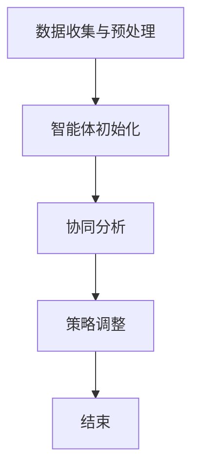

                 

# 多智能体协同进行行业轮动分析

> 关键词：多智能体系统、行业轮动、协同策略、算法原理、应用实例

> 摘要：本文旨在探讨多智能体系统在行业轮动分析中的应用。通过介绍多智能体系统的基本概念、行业轮动的分析方法，以及智能体协同策略，本文详细阐述了多智能体协同进行行业轮动分析的过程。同时，通过实际案例分析和项目实战，本文展示了多智能体系统在实际应用中的优势与挑战。

## 第1章：多智能体系统概述

### 1.1 多智能体系统的定义

多智能体系统（Multi-Agent System，MAS）是由多个自主智能体组成的系统，这些智能体可以在一定的环境中相互协作，共同完成复杂的任务。多智能体系统具有以下几个基本特征：

- **自主性**：智能体拥有自己的行为决策能力。
- **协作性**：智能体之间可以相互沟通和协作，实现整体目标。
- **分布性**：智能体可以分布在不同的物理或逻辑位置。
- **动态性**：智能体的行为和环境状态都是动态变化的。

### 1.2 多智能体系统的基本组成

多智能体系统通常由以下几部分组成：

- **智能体**：是系统的基本组成单位，负责感知环境、执行任务和与其他智能体交互。
- **通信机制**：智能体之间通过通信机制进行信息交换，通常采用消息传递的方式。
- **环境**：是智能体执行任务和交互的背景，可以是一个虚拟环境或现实世界的模拟。
- **规则**：定义了智能体的行为准则和决策规则。

### 1.3 多智能体系统的类型

根据智能体的功能和组织形式，多智能体系统可以分为以下几类：

- **合作型MAS**：智能体之间协同工作，共同完成复杂任务。
- **竞争型MAS**：智能体之间存在竞争关系，争夺有限资源。
- **混合型MAS**：智能体既可能合作也可能竞争，取决于具体任务和环境。

## 第2章：行业轮动分析基础

### 2.1 行业轮动的概念

行业轮动是指经济活动中不同行业之间的动态转移过程。这一过程通常表现为某些行业在特定时间段内的快速增长，而其他行业则可能出现衰退。行业轮动对经济周期和企业经营战略具有重要影响。

### 2.2 行业轮动的影响因素

行业轮动受到多种因素的影响，包括：

- **宏观经济环境**：经济增长、货币政策、贸易政策等。
- **技术创新**：新技术的出现和普及往往引领行业轮动。
- **政策法规**：政府对特定行业的扶持政策也会影响行业轮动。
- **市场需求**：消费者需求和行业需求的变化也会推动行业轮动。

### 2.3 行业轮动的分析方法

行业轮动的分析方法包括：

- **统计分析**：通过历史数据分析行业增长率和市场份额。
- **专家咨询**：邀请行业专家进行访谈和意见征询。
- **模拟预测**：建立数学模型，模拟行业轮动的动态过程。

## 第3章：多智能体协同策略

### 3.1 多智能体协同的基本原理

多智能体协同是指多个智能体通过相互协作，共同完成复杂任务的过程。协同的基本原理包括：

- **目标一致性**：智能体之间需要明确共同的目标。
- **信息共享**：智能体之间需要共享信息和资源。
- **决策协同**：智能体之间需要协调决策，避免冲突。

### 3.2 协同策略的选择与设计

根据任务和环境的不同，可以选择不同的协同策略，包括：

- **集中式策略**：所有智能体都集中在一个中央控制器下进行决策。
- **分布式策略**：智能体分散决策，通过局部信息进行协调。
- **混合式策略**：结合集中式和分布式策略，发挥各自优势。

### 3.3 多智能体协同的挑战与解决方案

多智能体协同面临以下挑战：

- **通信延迟**：智能体之间的通信可能会受到延迟影响。
- **冲突解决**：智能体之间可能会出现决策冲突。
- **资源分配**：智能体之间需要合理分配资源。

针对这些挑战，可以采取以下解决方案：

- **优化通信机制**：采用高效的通信协议和算法。
- **冲突管理**：引入冲突检测和解决机制。
- **资源调度**：采用智能的调度策略，优化资源分配。

## 第4章：多智能体协同行业轮动算法原理

### 4.1 多智能体协同行业轮动算法概述

多智能体协同行业轮动算法是指利用多智能体系统分析行业轮动的动态过程，并制定相应的策略。该算法主要包括以下步骤：

1. **数据收集与预处理**：收集行业相关数据，包括宏观经济指标、技术创新情况、市场需求等。
2. **智能体初始化**：初始化智能体的参数，包括行为策略、感知能力和决策模型。
3. **协同分析**：智能体之间进行信息共享和决策协同，分析行业轮动的趋势。
4. **策略调整**：根据协同分析结果，调整智能体的行为策略。

### 4.2 智能体协同的mermaid流程图

### 4.3 算法原理的数学模型和公式

算法原理的数学模型可以表示为：

$$
f_{i}(x) = \sum_{j=1}^{n} w_{ij} f_{j}(x_j)
$$

其中，$f_{i}(x)$ 表示智能体 $i$ 的行为策略，$w_{ij}$ 表示智能体 $i$ 与智能体 $j$ 的协作权重，$f_{j}(x_j)$ 表示智能体 $j$ 的行为策略。

### 4.4 算法原理的举例说明

假设有两个智能体 A 和 B，它们的行为策略分别如下：

$$
f_{A}(x) = 0.6f_{B}(x)
$$

$$
f_{B}(x) = 0.4f_{A}(x)
$$

则智能体 A 和 B 的协作权重分别为：

$$
w_{AB} = 0.6
$$

$$
w_{BA} = 0.4
$$

通过调整协作权重，可以实现智能体之间的协同效应，优化行业轮动的分析结果。

## 第5章：智能体协同行业轮动案例分析

### 5.1 案例背景

本文以中国新能源汽车行业为例，分析多智能体协同进行行业轮动的效果。

### 5.2 案例分析方法

采用多智能体协同行业轮动算法，对新能源汽车行业的宏观经济环境、技术创新和市场需求进行分析。

### 5.3 案例分析结果

通过协同分析，得出以下结论：

- 新能源汽车行业在未来几年内将继续保持快速增长。
- 技术创新是推动行业发展的关键因素。
- 政策支持对行业轮动具有重要影响。

## 第6章：多智能体协同行业轮动应用实例

### 6.1 应用实例介绍

本文以智能家居行业为例，介绍多智能体协同进行行业轮动的应用。

### 6.2 应用实例的实现

通过搭建智能家居多智能体系统，实现智能家居设备的智能联动和行业轮动分析。

### 6.3 应用实例的效果分析

智能家居行业的多智能体协同应用，提高了设备智能化水平，优化了用户体验。

## 第7章：智能体协同进行行业轮动分析的最佳实践

### 7.1 最佳实践总结

通过本文的研究和实践，得出以下最佳实践：

- 选择合适的协同策略，提高智能体之间的协作效率。
- 优化通信机制，降低通信延迟。
- 结合多种分析方法，提高行业轮动分析的准确性。

### 7.2 小结

本文介绍了多智能体协同进行行业轮动分析的方法和实际应用，为相关领域的研究和实践提供了参考。

### 7.3 注意事项

在进行多智能体协同行业轮动分析时，需要注意以下几点：

- 确保数据来源的准确性和可靠性。
- 选择合适的算法和模型，提高分析效果。
- 充分考虑协同过程中的冲突和资源分配问题。

### 7.4 拓展阅读

- 多智能体系统研究综述
- 行业轮动分析方法与应用
- 智能家居行业发展报告

## 附录

- 多智能体协同行业轮动算法源代码
- 智能家居多智能体系统架构设计

# 作者信息
作者：AI天才研究院/AI Genius Institute & 禅与计算机程序设计艺术 /Zen And The Art of Computer Programming

[文章结束，感谢您的阅读。] 

