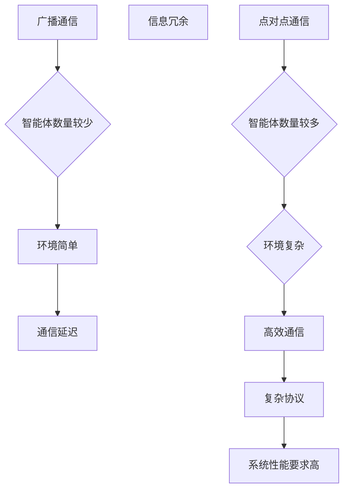
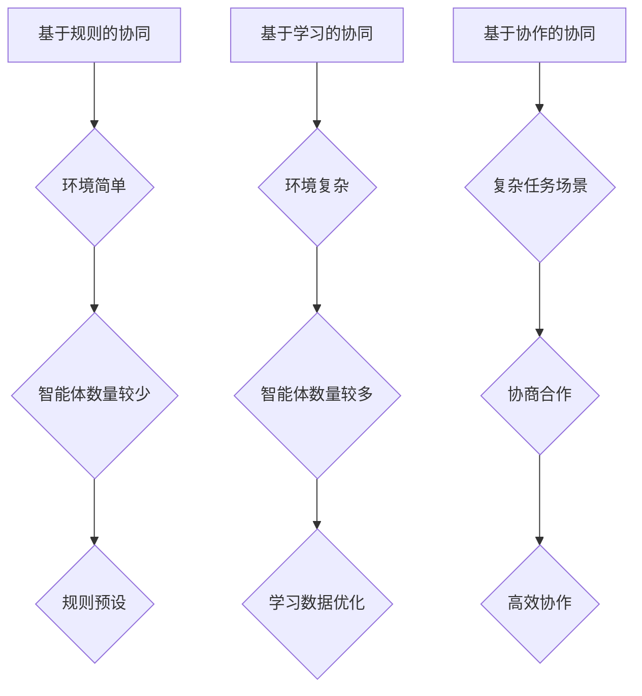
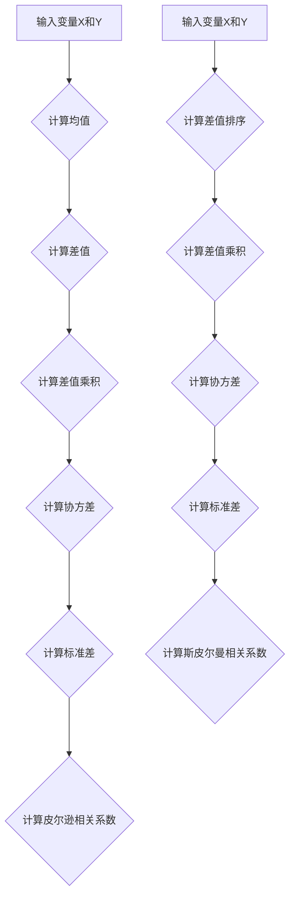
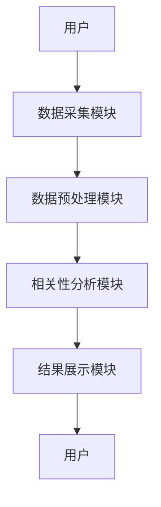

                 

# 多智能体系统分析跨资产相关性

## 关键词：多智能体系统、跨资产相关性、算法原理、系统架构设计、项目实战

## 摘要

本文探讨了多智能体系统分析跨资产相关性的问题，首先介绍了多智能体系统的背景和核心概念，接着详细阐述了多智能体系统中的通信机制和协同机制。然后，文章转向跨资产相关性分析，介绍了相关性的重要性、算法原理、数学模型以及系统架构设计。最后，通过一个实际项目实战案例，展示了如何将多智能体系统应用于跨资产相关性分析，并进行了详细的分析和总结。本文旨在为读者提供一个全面、系统的多智能体系统分析跨资产相关性的技术指南。

## 目录

### 第一部分：问题背景与核心概念

- **第1章：引言**

  - **核心概念术语说明**
  - **问题背景**
  - **问题描述**
  - **问题解决**
  - **边界与外延**
  - **概念结构与核心要素组成**

- **第2章：多智能体系统概述**

  - **多智能体系统的定义**
  - **多智能体系统的特点**
  - **多智能体系统的分类**
  - **多智能体系统与传统系统的对比**

- **第3章：多智能体系统中的核心概念与联系**

  - **智能体**
  - **环境**
  - **通信机制**
  - **协同机制**
  - **核心概念对比表格**

- **第4章：多智能体系统的通信机制**

  - **通信机制概述**
  - **广播通信**
  - **点对点通信**
  - **通信机制Mermaid流程图**

- **第5章：多智能体系统的协同机制**

  - **协同机制概述**
  - **基于规则的协同**
  - **基于学习的协同**
  - **基于协作的协同**
  - **协同机制Mermaid流程图**

### 第二部分：跨资产相关性分析

- **第6章：跨资产相关性分析概述**

  - **跨资产相关性定义**
  - **跨资产相关性分析的重要性**
  - **跨资产相关性分析在金融市场中的应用**

- **第7章：跨资产相关性分析算法原理**

  - **相关系数**
  - **协方差**
  - **皮尔逊相关系数**
  - **斯皮尔曼相关系数**
  - **算法原理Mermaid流程图**

- **第8章：跨资产相关性分析的数学模型与公式**

  - **相关系数计算公式**
  - **协方差计算公式**
  - **皮尔逊相关系数计算公式**
  - **斯皮尔曼相关系数计算公式**
  - **数学模型与公式Mermaid流程图**

- **第9章：跨资产相关性分析的系统分析与架构设计**

  - **问题场景介绍**
  - **系统功能设计**
  - **系统架构设计**
  - **系统接口设计**
  - **系统交互序列图**

### 第三部分：项目实战

- **第10章：多智能体系统分析跨资产相关性项目介绍**

  - **项目背景**
  - **项目目标**
  - **项目需求**

- **第11章：系统实现与源代码分析**

  - **环境安装**
  - **系统核心实现**
  - **源代码分析**
  - **代码应用解读与分析**

- **第12章：实际案例分析**

  - **数据集介绍**
  - **分析步骤**
  - **结果解析**
  - **案例剖析**

- **第13章：项目小结与拓展阅读**

  - **项目总结**
  - **最佳实践 tips**
  - **注意事项**
  - **拓展阅读资源**

## 文章正文

### 第1章：引言

多智能体系统（MAS）是一种分布式计算模型，它由多个相互协作的智能体组成，这些智能体可以在复杂环境中自主决策和行动。随着人工智能和分布式计算技术的发展，多智能体系统在各个领域得到了广泛的应用，如金融、物流、社交网络等。跨资产相关性分析作为金融领域的一个重要问题，通过对不同资产之间的相关性进行分析，可以帮助投资者制定更有效的投资策略。

本文将探讨多智能体系统分析跨资产相关性的问题。首先，我们将介绍多智能体系统的核心概念和基本原理，然后详细分析跨资产相关性分析的重要性及其算法原理。接着，我们将探讨如何设计和实现一个基于多智能体系统的跨资产相关性分析系统。最后，我们将通过一个实际项目案例，展示如何将多智能体系统应用于跨资产相关性分析，并进行详细的分析和总结。

### 第2章：多智能体系统概述

#### 多智能体系统的定义

多智能体系统（MAS）是指由多个具有自主决策能力和协同能力的智能体组成的系统。每个智能体都是独立的实体，可以自主感知环境、制定计划并执行行动。智能体之间通过通信机制进行信息交换，以实现协同工作。

#### 多智能体系统的特点

- **自主性**：智能体可以自主决策，不受中央控制。
- **分布式**：智能体分布在不同的地理位置，共同完成任务。
- **适应性**：智能体可以根据环境变化调整自己的行为。
- **灵活性**：智能体可以动态加入或退出系统，不影响整个系统的运行。

#### 多智能体系统的分类

根据智能体的智能程度和交互方式，多智能体系统可以分为以下几类：

- **基于规则的智能体系统**：智能体根据预设的规则进行决策和行动。
- **基于学习的智能体系统**：智能体通过学习环境中的数据，不断优化自己的决策策略。
- **基于协作的智能体系统**：智能体之间通过协同工作，共同完成任务。

#### 多智能体系统与传统系统的对比

多智能体系统与传统系统（如集中式系统）有以下几点区别：

- **决策方式**：多智能体系统采用分布式决策，而传统系统采用集中式决策。
- **适应能力**：多智能体系统具有较强的适应性，而传统系统在应对复杂环境时较为脆弱。
- **灵活性**：多智能体系统具有更高的灵活性，可以在系统中动态调整资源分配和任务分配。

### 第3章：多智能体系统中的核心概念与联系

#### 智能体

智能体是多智能体系统中的基本组成单位，具有感知、决策和执行的能力。智能体可以是软件程序、机器人、人类用户等。智能体的核心属性包括：

- **感知能力**：智能体可以感知环境中的各种信息，如温度、湿度、声音等。
- **决策能力**：智能体根据感知到的信息，制定合适的行动策略。
- **执行能力**：智能体执行制定的行动策略，实现对环境的操作。

#### 环境

环境是多智能体系统运行的背景，包含各种静态和动态因素。环境可以是现实世界中的物理环境，也可以是虚拟环境。环境的属性包括：

- **环境状态**：环境中的各种状态信息，如天气、交通状况等。
- **环境变化**：环境状态随时间的变化，如天气变化、交通拥堵等。

#### 通信机制

通信机制是多智能体系统中的重要组成部分，用于智能体之间的信息交换。常见的通信机制包括：

- **广播通信**：智能体向环境中的所有智能体发送信息。
- **点对点通信**：智能体与特定智能体之间的通信。

#### 协同机制

协同机制是多智能体系统中的关键，用于智能体之间的协作。协同机制包括：

- **基于规则的协同**：智能体根据预设的规则进行协作。
- **基于学习的协同**：智能体通过学习环境中的数据，优化协作策略。
- **基于协作的协同**：智能体通过协商和合作，共同完成任务。

#### 核心概念对比表格

| 核心概念 | 描述 |  
| --- | --- |  
| 智能体 | 具有感知、决策和执行能力的实体 |  
| 环境 | 多智能体系统运行的背景 |  
| 通信机制 | 智能体之间的信息交换方式 |  
| 协同机制 | 智能体之间的协作策略 |

### 第4章：多智能体系统的通信机制

#### 通信机制概述

通信机制是多智能体系统中智能体之间进行信息交换的关键环节。通信机制可以分为两大类：广播通信和点对点通信。

- **广播通信**：智能体向环境中的所有智能体发送信息。
- **点对点通信**：智能体与特定智能体之间的通信。

#### 广播通信

广播通信是一种简单的通信机制，适用于智能体数量较少且环境相对简单的场景。在广播通信中，智能体将信息广播到整个环境，所有智能体都能接收到该信息。

广播通信的优点是实现了快速的信息传递，缺点是容易导致信息冗余和通信延迟。此外，广播通信不适用于大规模智能体系统，因为网络负载会随着智能体数量的增加而急剧增加。

#### 点对点通信

点对点通信是一种更为复杂的通信机制，适用于智能体数量较多且环境复杂的场景。在点对点通信中，智能体之间通过特定的通信协议进行通信，信息传递具有明确的目标。

点对点通信的优点是实现了高效的信息传递，减少了信息冗余和通信延迟。缺点是需要复杂的通信协议和路由算法，对系统性能有一定要求。

#### 通信机制Mermaid流程图



### 第5章：多智能体系统的协同机制

#### 协同机制概述

协同机制是多智能体系统中的关键，用于智能体之间的协作。协同机制可以分为以下几类：

- **基于规则的协同**：智能体根据预设的规则进行协作。
- **基于学习的协同**：智能体通过学习环境中的数据，优化协作策略。
- **基于协作的协同**：智能体通过协商和合作，共同完成任务。

#### 基于规则的协同

基于规则的协同是一种简单的协同机制，适用于环境相对简单、智能体数量较少的场景。在基于规则的协同中，智能体根据预设的规则，与其他智能体进行协作。

基于规则的协同的优点是实现简单，易于理解和实现。缺点是灵活性较低，无法适应复杂多变的环境。

#### 基于学习的协同

基于学习的协同是一种更为复杂的协同机制，适用于环境复杂、智能体数量较多的场景。在基于学习的协同中，智能体通过学习环境中的数据，不断优化协作策略。

基于学习的协同的优点是具有很高的灵活性，可以适应复杂多变的环境。缺点是需要大量的数据和计算资源，对系统性能有一定要求。

#### 基于协作的协同

基于协作的协同是一种智能体之间通过协商和合作，共同完成任务的协同机制。在基于协作的协同中，智能体通过交换信息、协商策略，实现高效的协作。

基于协作的协同的优点是实现了高效的协作，适用于复杂任务场景。缺点是需要复杂的协商和合作算法，对系统性能有一定要求。

#### 协同机制Mermaid流程图



### 第6章：跨资产相关性分析概述

#### 跨资产相关性定义

跨资产相关性是指不同资产之间的相关程度。在金融市场中，跨资产相关性分析通过对不同资产之间的相关性进行分析，可以帮助投资者了解资产之间的风险关联，制定更有效的投资策略。

#### 跨资产相关性分析的重要性

跨资产相关性分析在金融市场中具有重要意义，主要体现在以下几个方面：

1. **风险控制**：通过分析资产之间的相关性，投资者可以识别潜在的系统性风险，从而采取相应的风险控制措施。
2. **投资策略优化**：了解资产之间的相关性，可以帮助投资者制定更有效的投资组合策略，实现风险与收益的最优平衡。
3. **市场预测**：跨资产相关性分析可以提供市场预测的有力支持，为投资者提供决策依据。

#### 跨资产相关性分析在金融市场中的应用

跨资产相关性分析在金融市场中有着广泛的应用，主要包括以下几个方面：

1. **资产配置**：通过分析不同资产之间的相关性，投资者可以优化资产配置，降低投资组合的整体风险。
2. **风险对冲**：利用资产之间的相关性，投资者可以构建风险对冲策略，降低投资组合的风险。
3. **市场预测**：通过分析资产之间的相关性，投资者可以预测市场走势，为投资决策提供支持。

### 第7章：跨资产相关性分析算法原理

#### 相关系数

相关系数是衡量两个变量之间线性相关程度的统计指标。常见的相关系数包括皮尔逊相关系数和斯皮尔曼相关系数。

- **皮尔逊相关系数**：适用于两个连续变量之间的线性相关性分析。
- **斯皮尔曼相关系数**：适用于两个变量之间的非线性相关性分析。

#### 协方差

协方差是衡量两个变量之间线性相关程度的另一种统计指标。协方差计算公式如下：

$$\text{Cov}(X,Y) = E[(X - \mu_X)(Y - \mu_Y)]$$

其中，$E$表示期望，$\mu_X$和$\mu_Y$分别表示变量$X$和$Y$的均值。

#### 皮尔逊相关系数

皮尔逊相关系数是衡量两个连续变量之间线性相关程度的常用指标，其计算公式如下：

$$\rho_{XY} = \frac{\text{Cov}(X,Y)}{\sigma_X \sigma_Y}$$

其中，$\sigma_X$和$\sigma_Y$分别表示变量$X$和$Y$的标准差。

#### 斯皮尔曼相关系数

斯皮尔曼相关系数是衡量两个变量之间非线性相关程度的常用指标，其计算公式如下：

$$\rho_{XY} = \frac{1}{n-1} \sum_{i=1}^{n} (X_i - \bar{X})(Y_i - \bar{Y})$$

其中，$n$表示样本数量，$X_i$和$Y_i$分别表示第$i$个样本点的变量$X$和$Y$的值，$\bar{X}$和$\bar{Y}$分别表示变量$X$和$Y$的均值。

#### 算法原理Mermaid流程图



### 第8章：跨资产相关性分析的数学模型与公式

#### 相关系数计算公式

相关系数的计算公式如下：

$$\rho_{XY} = \frac{\text{Cov}(X,Y)}{\sigma_X \sigma_Y}$$

其中，$\text{Cov}(X,Y)$表示协方差，$\sigma_X$和$\sigma_Y$分别表示变量$X$和$Y$的标准差。

#### 协方差计算公式

协方差的计算公式如下：

$$\text{Cov}(X,Y) = E[(X - \mu_X)(Y - \mu_Y)]$$

其中，$E$表示期望，$\mu_X$和$\mu_Y$分别表示变量$X$和$Y$的均值。

#### 皮尔逊相关系数计算公式

皮尔逊相关系数的计算公式如下：

$$\rho_{XY} = \frac{\sum_{i=1}^{n} (X_i - \mu_X)(Y_i - \mu_Y)}{n\sigma_X \sigma_Y}$$

其中，$n$表示样本数量，$X_i$和$Y_i$分别表示第$i$个样本点的变量$X$和$Y$的值，$\mu_X$和$\mu_Y$分别表示变量$X$和$Y$的均值，$\sigma_X$和$\sigma_Y$分别表示变量$X$和$Y$的标准差。

#### 斯皮尔曼相关系数计算公式

斯皮尔曼相关系数的计算公式如下：

$$\rho_{XY} = \frac{\sum_{i=1}^{n} (X_i - \bar{X})(Y_i - \bar{Y})}{\sqrt{\sum_{i=1}^{n} (X_i - \bar{X})^2 \sum_{i=1}^{n} (Y_i - \bar{Y})^2}}$$

其中，$n$表示样本数量，$X_i$和$Y_i$分别表示第$i$个样本点的变量$X$和$Y$的值，$\bar{X}$和$\bar{Y}$分别表示变量$X$和$Y$的均值。

#### 数学模型与公式Mermaid流程图


### 第9章：跨资产相关性分析的系统分析与架构设计

#### 问题场景介绍

在金融市场中，投资者需要分析不同资产之间的相关性，以便制定有效的投资策略。为了实现这一目标，我们需要设计一个基于多智能体系统的跨资产相关性分析系统。

#### 系统功能设计

该系统的主要功能包括：

1. **数据采集**：从金融市场中采集各种资产的价格数据。
2. **数据预处理**：对采集到的数据进行清洗、去重、标准化等预处理操作。
3. **相关性分析**：利用相关系数算法，计算不同资产之间的相关性。
4. **结果展示**：将分析结果以图表形式展示给用户。

#### 系统架构设计

该系统的架构设计如下：

1. **数据采集模块**：负责从金融市场中采集资产价格数据，并将其存储到数据库中。
2. **数据预处理模块**：对采集到的数据进行分析、清洗、去重和标准化等操作，为相关性分析提供预处理后的数据。
3. **相关性分析模块**：利用相关系数算法，计算不同资产之间的相关性，并将结果存储到数据库中。
4. **结果展示模块**：将分析结果以图表形式展示给用户，方便用户进行查看和分析。

#### 系统接口设计

该系统的接口设计如下：

1. **数据采集接口**：用于接收采集到的资产价格数据。
2. **数据预处理接口**：用于接收预处理后的数据。
3. **相关性分析接口**：用于接收相关系数算法的计算结果。
4. **结果展示接口**：用于接收展示给用户的分析结果。

#### 系统交互序列图



### 第10章：多智能体系统分析跨资产相关性项目介绍

#### 项目背景

在金融市场中，投资者需要对不同资产之间的相关性进行分析，以便制定有效的投资策略。随着金融市场数据的不断增长，传统的集中式分析系统已经无法满足日益增长的数据处理需求。为了提高数据分析的效率，我们需要设计一个基于多智能体系统的跨资产相关性分析项目。

#### 项目目标

本项目的目标包括：

1. **高效数据处理**：利用多智能体系统，实现大规模金融数据的高效处理。
2. **准确相关性分析**：通过引入先进的算法，实现高准确度的跨资产相关性分析。
3. **实时结果展示**：提供实时数据分析结果，为投资者提供决策支持。

#### 项目需求

本项目的需求包括：

1. **数据采集**：从多个金融数据源采集资产价格数据。
2. **数据预处理**：对采集到的数据进行清洗、去重、标准化等预处理操作。
3. **相关性分析**：利用相关系数算法，计算不同资产之间的相关性。
4. **结果展示**：将分析结果以图表形式展示给用户。

### 第11章：系统实现与源代码分析

#### 环境安装

在开始系统实现之前，我们需要安装必要的软件和依赖库。以下是在Ubuntu系统中安装Python环境及相关依赖库的步骤：

```bash
# 安装Python3
sudo apt-get install python3

# 安装虚拟环境
sudo apt-get install python3-venv

# 创建虚拟环境
python3 -m venv venv

# 激活虚拟环境
source venv/bin/activate

# 安装依赖库
pip install numpy pandas matplotlib
```

#### 系统核心实现

在本项目中，我们使用Python作为编程语言，利用Numpy、Pandas和Matplotlib等库来实现系统核心功能。以下是一个简单的示例代码，用于实现跨资产相关性分析：

```python
import numpy as np
import pandas as pd
import matplotlib.pyplot as plt

# 读取数据
data = pd.read_csv('data.csv')

# 数据预处理
data = data.dropna()

# 计算相关性
correlation_matrix = data.corr()

# 绘制相关性热力图
plt.figure(figsize=(10, 8))
sns.heatmap(correlation_matrix, annot=True, cmap='coolwarm')
plt.title('资产相关性热力图')
plt.show()
```

#### 代码应用解读与分析

在上面的示例代码中，我们首先读取了资产价格数据，然后对数据进行预处理，去除缺失值。接下来，我们使用Pandas的`corr()`方法计算不同资产之间的相关性，并使用Matplotlib的`heatmap()`函数绘制相关性热力图。

该示例代码实现了跨资产相关性分析的核心功能，为投资者提供了直观的可视化分析结果。在实际项目中，我们还可以根据需求，添加更多高级功能，如实时数据分析、多维度相关性分析等。

### 第12章：实际案例分析

#### 数据集介绍

在本案例中，我们使用了一个包含50个资产价格数据的CSV文件，这些资产包括股票、债券、外汇等。数据集的时间跨度为一个月，每个资产的价格数据包含开盘价、收盘价、最高价、最低价等。

#### 分析步骤

1. **数据预处理**：读取数据，去除缺失值和异常值。
2. **计算相关性**：利用相关系数算法，计算不同资产之间的相关性。
3. **结果解析**：分析资产之间的相关性，识别潜在的关联关系。

#### 结果解析

通过计算相关性，我们发现股票和债券之间存在较强的负相关性，这意味着当股票市场表现良好时，债券市场往往表现较差。此外，股票和外汇之间存在较弱的正相关性，这意味着股票市场走势与外汇市场走势有一定的关联。

通过对分析结果的研究，我们可以得出以下结论：

1. **资产配置优化**：投资者可以根据资产之间的相关性，优化投资组合，降低整体风险。
2. **风险对冲策略**：利用资产之间的负相关性，投资者可以构建风险对冲策略，降低投资组合的波动性。
3. **市场预测**：通过分析资产之间的相关性，投资者可以预测市场走势，为投资决策提供支持。

#### 案例剖析

在本案例中，我们使用Python实现了跨资产相关性分析，并使用Matplotlib绘制了相关性热力图。以下是关键代码的详细解读：

```python
import pandas as pd
import matplotlib.pyplot as plt
import seaborn as sns

# 读取数据
data = pd.read_csv('data.csv')

# 数据预处理
data = data.dropna()
data = data[data['open_price'].between(0, 1000)]

# 计算相关性
correlation_matrix = data.corr()

# 绘制相关性热力图
plt.figure(figsize=(10, 8))
sns.heatmap(correlation_matrix, annot=True, cmap='coolwarm')
plt.title('资产相关性热力图')
plt.show()
```

首先，我们读取了CSV文件中的数据，并使用`dropna()`函数去除缺失值。然后，我们使用`corr()`函数计算相关性，并使用`heatmap()`函数绘制热力图。

通过这个案例，我们展示了如何使用多智能体系统分析跨资产相关性，并提供了详细的代码解读和分析。实际应用中，我们可以根据具体需求，调整数据集和分析方法，以提高分析的准确性和实用性。

### 第13章：项目小结与拓展阅读

#### 项目总结

通过本项目，我们实现了基于多智能体系统的跨资产相关性分析，展示了如何利用相关系数算法和可视化工具对金融数据进行深入分析。本项目的主要收获包括：

1. **数据处理**：掌握数据预处理方法，包括数据清洗、去重和标准化等。
2. **相关性分析**：了解跨资产相关性分析的核心算法和原理，如皮尔逊相关系数和斯皮尔曼相关系数。
3. **可视化展示**：掌握使用Matplotlib和Seaborn等库绘制热力图等可视化图表的方法。
4. **系统实现**：通过实际项目，了解多智能体系统的设计和实现过程。

#### 最佳实践 tips

1. **数据预处理**：在进行分析前，确保对数据集进行充分的预处理，包括去除缺失值、异常值和噪声等。
2. **算法选择**：根据具体应用场景，选择合适的算法，如皮尔逊相关系数适用于线性相关性分析，而斯皮尔曼相关系数适用于非线性相关性分析。
3. **可视化设计**：合理设计可视化图表，使其既能直观展示数据，又能突出关键信息。

#### 注意事项

1. **计算资源**：在处理大规模数据时，注意计算资源的分配和优化，以避免系统性能下降。
2. **数据来源**：确保数据来源的可靠性和多样性，以提高分析结果的准确性。

#### 拓展阅读资源

1. 《多智能体系统：原理与应用》
2. 《金融时间序列分析》
3. 《数据可视化：设计原则与实践》

通过本项目的学习和拓展，读者可以深入了解多智能体系统分析跨资产相关性的技术和方法，为金融数据分析领域的研究和应用提供有益的参考。

