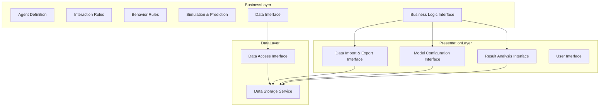
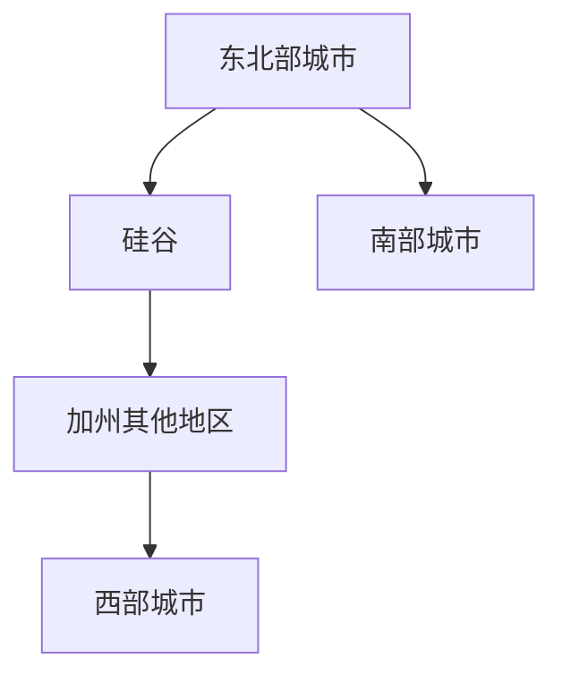
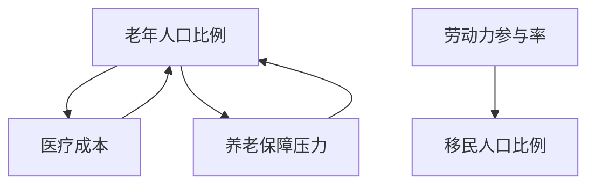

                 


### 引言

#### 1.1.1 全球人口统计趋势的重要性

全球人口统计趋势对于社会、经济、环境等各个方面都有着深远的影响。首先，从社会经济角度来看，人口的增长、分布和结构变化直接影响着劳动力市场、消费需求、社会保障等关键领域。例如，随着人口老龄化的加剧，养老金、医疗保健等社会保障系统的压力逐渐增大，这对政府的财政预算和政策制定提出了新的挑战。

#### 1.1.2 多智能体系统在人口统计分析中的潜力

多智能体系统（MAS）作为一种模拟复杂系统中个体行为及其相互作用的计算模型，具有在人口统计分析中独特的优势。通过MAS，研究者可以模拟不同个体在特定环境下的行为，进而分析这些行为对整体人口统计趋势的影响。例如，通过模拟个体间的婚姻、生育、迁移等行为，MAS可以预测未来的人口结构变化，为政策制定提供科学依据。

#### 1.2.1 书籍结构

本书旨在系统地探讨多智能体系统在全球人口统计趋势分析中的应用。结构上，本书分为四个部分，从背景与基本概念、方法与算法、实践与案例到未来方向，逐步深入探讨这一主题。

##### 1.2.1.1 内容概述

第一部分将介绍人口统计趋势的基本概念和挑战，以及多智能体系统的定义和基本原理。第二部分将重点讨论多智能体系统在人口数据分析中的应用，包括模型构建和案例分析。第三部分将详细介绍用于人口统计趋势分析的方法和算法，以及如何进行评价和优化。第四部分则将分享实践案例，探讨最佳实践，并展望未来研究方向。

##### 1.2.1.2 阅读指南

为了更好地理解本书内容，建议读者首先具备基本的计算机科学和数学知识，特别是对概率论、统计学和图论有一定的了解。同时，本书适合研究人员、开发者以及对多智能体系统和人口统计感兴趣的读者阅读。希望本书能为读者提供有价值的参考，推动多智能体系统在人口统计领域的发展。## 背景与基本概念

### 2.1 人口统计趋势的基本概念

人口统计趋势是指人口数量、结构和分布等方面的变化趋势。这些趋势受多种因素影响，包括生育率、死亡率、老龄化、迁移率等。以下是对这些基本概念的定义和解释：

#### 2.1.1 人口数量

人口数量是指在一定时间内，特定地区或国家的居民总数。它是衡量一个国家或地区发展水平的重要指标。人口数量的变化受出生率、死亡率和迁移率的影响。例如，出生率高可能导致人口增长，而死亡率高则可能导致人口减少。

#### 2.1.2 人口结构

人口结构是指不同年龄、性别、种族等群体在总人口中的比例和分布。人口结构变化可以反映社会经济的发展和变迁。例如，随着老龄化问题的加剧，老年人口比例的增加会对社会保障、医疗服务等带来巨大挑战。

#### 2.1.3 人口分布

人口分布是指人口在地理空间上的分布情况。它受地理环境、经济发展水平、政策导向等多种因素影响。例如，城市化进程可能导致人口从农村向城市迁移，从而改变人口分布格局。

### 2.2 人口统计趋势的挑战

人口统计趋势的变化对社会、经济和环境带来了诸多挑战，主要表现在以下几个方面：

#### 2.2.1 社会挑战

人口老龄化导致劳动力市场的变化，养老保障体系面临压力。同时，年轻人口减少可能影响教育的持续发展和社会活力。

#### 2.2.2 经济挑战

人口结构的变化会影响经济增长和消费模式。例如，老年人口消费模式与年轻人口不同，可能导致消费结构的变化。

#### 2.2.3 环境挑战

人口增长和分布的变化会对自然资源和环境造成压力。例如，城市化进程可能导致土地资源紧张，环境污染问题加剧。

### 2.3 多智能体系统（MAS）的基本概念

多智能体系统（MAS）是由多个智能体（agent）组成的分布式系统，这些智能体可以在动态环境中自主行动和交互。MAS的核心概念包括智能体、环境和交互。

#### 2.3.1 智能体

智能体是MAS中的基本单元，具有自主性、社会性和反应性等特点。智能体可以是个体、组织或其他实体，它们在特定环境下执行任务，并通过通信和协作实现系统目标。

#### 2.3.2 环境

环境是多智能体系统运行的空间和背景，它为智能体提供了必要的资源和约束条件。环境可以是一个物理空间，也可以是一个信息空间，如互联网。

#### 2.3.3 交互

交互是智能体之间的信息交流和协同合作的过程。智能体可以通过通信协议交换信息，共同完成任务。

### 2.4 多智能体系统在人口统计分析中的应用

多智能体系统在人口统计分析中的应用主要体现在以下几个方面：

#### 2.4.1 模拟个体行为

通过MAS，可以模拟不同个体在特定环境下的行为，如婚姻、生育、迁移等。这些行为的变化可以反映在整体人口统计趋势中。

#### 2.4.2 预测人口结构变化

利用MAS，可以预测未来的人口结构变化，如老龄化、人口分布变化等。这些预测对于政策制定和社会规划具有重要意义。

#### 2.4.3 优化社会资源配置

通过MAS，可以分析不同社会资源配置策略对人口统计趋势的影响，从而优化资源配置，提高社会效益。

### 2.5 本节总结

本节介绍了人口统计趋势的基本概念和挑战，以及多智能体系统（MAS）的基本概念和在人口统计分析中的应用。理解这些基本概念和原理，有助于我们深入探讨MAS在解决人口统计问题中的具体应用。在下一节中，我们将进一步探讨MAS的基本概念和框架。## 多智能体系统（MAS）的基本概念和框架

### 3.1 多智能体系统的定义

多智能体系统（MAS）是一种由多个智能体（agent）组成的分布式系统，这些智能体在动态环境中通过自主行动和交互来协同完成任务。智能体可以是计算机程序、人工生命体、机器人或任何具有智能功能的实体。MAS的核心特点包括自主性、社会性、反应性和适应性。

#### 3.1.1 自主性

自主性是指智能体在系统中可以独立地做出决策和执行任务。智能体具备一定的自主性，能够在没有外部干预的情况下执行其任务。

#### 3.1.2 社会性

社会性是指智能体之间可以通过通信和协作来完成任务。社会性使得智能体能够相互合作，共享资源和信息，从而实现系统的整体目标。

#### 3.1.3 反应性

反应性是指智能体能够对环境中的变化做出实时响应。智能体通过感知环境信息，调整自己的行为策略，以适应不断变化的环境。

#### 3.1.4 适应性

适应性是指智能体能够根据环境变化和系统需求调整自己的行为。智能体的适应能力使得系统能够在不断变化的环境中保持稳定和高效。

### 3.2 多智能体系统的体系结构

多智能体系统的体系结构通常包括以下三个主要组成部分：智能体、环境和交互机制。

#### 3.2.1 智能体

智能体是MAS的基本单元，其功能和行为由其内部模型决定。智能体通常由以下三个部分组成：

- **感知器**：感知器用于获取环境中的信息，如传感器、摄像头等。
- **内部模型**：内部模型包括知识库、行为规划器和执行器，用于处理感知器获取的信息，并生成行动。
- **行动器**：行动器用于执行智能体的行为，如移动、通信等。

#### 3.2.2 环境

环境是多智能体系统运行的空间和背景，它提供了智能体所需的信息资源和约束条件。环境可以是物理环境，也可以是虚拟环境，如互联网、模拟环境等。

#### 3.2.3 交互机制

交互机制是智能体之间通信和协作的基础。交互机制可以通过以下几种方式进行：

- **直接通信**：智能体之间通过直接通信协议交换信息，如TCP/IP协议。
- **间接通信**：智能体通过中心化的消息队列或分布式系统中的中介实体进行通信。
- **协作机制**：智能体通过协作协议和算法，共同完成任务，如协同搜索、资源分配等。

### 3.3 多智能体系统的类型

根据智能体的特征和交互方式，多智能体系统可以分为以下几种类型：

#### 3.3.1 基于角色的MAS

基于角色的MAS中，智能体根据其角色和职责进行交互和协作。每个智能体具有特定的角色，如角色A负责感知，角色B负责决策，角色C负责执行。

#### 3.3.2 基于团队的MAS

基于团队的MAS中，智能体组成团队，共同完成复杂任务。每个智能体在团队中扮演不同的角色，相互协作，共同实现目标。

#### 3.3.3 基于利益的MAS

基于利益的MAS中，智能体根据其利益需求进行交互和协作。智能体之间可能存在竞争关系，但也可以通过协商和合作来实现共同利益。

### 3.4 多智能体系统的框架

多智能体系统通常采用以下框架来组织和管理智能体：

#### 3.4.1 状态机框架

状态机框架将智能体的行为定义为一系列状态和转换。智能体根据当前状态和环境信息，选择下一个状态。

#### 3.4.2 行为树框架

行为树框架将智能体的行为组织成树形结构。每个节点代表一个行为，节点之间通过条件分支和循环结构连接。

#### 3.4.3 演化计算框架

演化计算框架通过模拟生物进化过程，生成智能体种群，并通过自然选择和遗传算法来优化智能体的行为。

### 3.5 本节总结

本节介绍了多智能体系统的定义、体系结构、类型和框架。理解这些基本概念和框架，有助于我们更好地应用MAS解决复杂问题，特别是在人口统计分析中。在下一节中，我们将探讨MAS在人口数据分析中的应用案例。## MAS在人口数据分析中的应用

### 4.1 代理模型构建

多智能体系统（MAS）在人口数据分析中的一个关键应用是构建代理模型（agent-based model，ABM）。代理模型通过模拟个体行为，揭示人口统计趋势的形成机制，为政策制定提供科学依据。

#### 4.1.1 代理模型的基本框架

代理模型通常包括以下几个核心组成部分：

- **代理定义**：定义代理的属性和行为，如年龄、性别、教育水平、职业等。
- **环境设置**：设定模型运行的环境，包括地理空间、资源分布和社会约束等。
- **交互规则**：定义代理之间的交互规则，如婚姻、生育、迁移、教育等。
- **行为规则**：定义代理的行为模式，如基于概率的决策、规则驱动的行为等。

#### 4.1.2 模型构建步骤

构建代理模型的步骤通常包括以下几步：

1. **需求分析**：明确人口数据分析的目标和需求，如预测人口结构变化、分析迁移模式等。
2. **代理定义**：根据需求定义代理的属性和行为，确定代理的类型和数量。
3. **环境设置**：构建模型运行的环境，包括地理空间、资源分布和社会约束等。
4. **交互规则**：定义代理之间的交互规则，确保代理行为符合实际社会情境。
5. **行为规则**：设计代理的行为规则，模拟代理的行为模式，如基于概率的决策、规则驱动的行为等。
6. **模型验证**：通过实际数据或模拟数据验证模型的准确性和可靠性。

### 4.2 代理间的相互作用

在代理模型中，代理之间的相互作用是理解人口统计趋势的关键。以下是一些常见的代理间相互作用：

#### 4.2.1 婚姻与生育

婚姻和生育是人口统计数据中的核心因素。代理模型可以模拟不同年龄、性别和区域的代理的婚姻和生育行为，分析这些行为对人口结构的影响。

- **婚姻规则**：代理根据年龄、性别、社会地位等因素选择配偶。
- **生育规则**：已婚代理根据生育政策、个人意愿和资源状况决定生育行为。

#### 4.2.2 迁移

迁移是影响人口分布的重要因素。代理模型可以模拟代理的迁移行为，分析迁移对人口结构的影响。

- **迁移规则**：代理根据就业机会、教育资源、生活环境等因素决定迁移目的地。
- **迁移影响**：迁移对原居住地和目的地的人口结构、资源分布和社会经济影响。

#### 4.2.3 教育与就业

教育和就业是影响人口结构和劳动力市场的重要因素。代理模型可以模拟代理的教育和就业行为，分析这些行为对人口结构的影响。

- **教育规则**：代理根据自身能力和教育资源选择教育阶段和专业。
- **就业规则**：毕业代理根据就业市场和个人意愿选择就业岗位。

### 4.3 应用案例

以下是一个简单的应用案例，说明如何使用MAS分析人口统计趋势。

#### 案例背景

假设一个国家面临人口老龄化问题，政府希望了解如何通过政策干预减缓老龄化趋势。

#### 模型构建

1. **需求分析**：明确模型目标是预测未来人口结构变化，分析不同政策干预措施的影响。
2. **代理定义**：定义代理为不同年龄段、性别、职业和教育水平的个体。
3. **环境设置**：设定模型运行的环境，包括地理位置、资源分布、政策法规等。
4. **交互规则**：定义代理之间的婚姻、生育、迁移和教育交互规则。
5. **行为规则**：设计代理的行为规则，如婚姻选择、生育决策、迁移路径等。

#### 模型运行

通过模拟不同政策干预措施（如提高生育率、改善养老服务、鼓励人口迁移等），分析这些措施对人口结构的影响。例如：

- **提高生育率**：通过政策激励，鼓励年轻人生育，分析生育率提高对人口结构变化的影响。
- **改善养老服务**：通过增加养老服务供给，分析养老服务改善对人口老龄化的缓解作用。
- **鼓励人口迁移**：通过优化就业机会和生活环境，鼓励年轻人迁移到资源丰富的地区，分析迁移对人口结构的影响。

#### 模型验证

通过实际统计数据或模拟数据验证模型的准确性和可靠性，调整模型参数和规则，确保模型预测结果符合实际情况。

### 4.4 本节总结

本节介绍了MAS在人口数据分析中的应用，重点讨论了代理模型构建、代理间相互作用和应用案例。通过代理模型，研究者可以深入理解人口统计趋势的形成机制，为政策制定提供科学依据。在下一节中，我们将进一步探讨MAS在人口统计数据中的应用案例。## MAS在人口统计中的实际应用案例

### 5.1 案例研究背景

在本节中，我们将探讨两个具体的案例研究，以展示多智能体系统（MAS）在人口统计中的实际应用。这些案例研究分别关注人口迁移和老龄化问题的分析。

#### 案例一：美国人口迁移趋势分析

背景：美国作为一个移民大国，其人口迁移趋势对其社会和经济结构产生了深远的影响。例如，加州的硅谷吸引了大量的高科技人才，而东北部的一些城市则面临着人口老龄化和劳动力短缺的问题。

目标：通过MAS模型，分析不同地区的人口迁移原因和影响，为政策制定者提供决策支持。

#### 案例二：日本老龄化问题分析

背景：日本是全球老龄化问题最严重的国家之一。随着人口老龄化的加剧，日本的医疗、养老和社会保障系统面临巨大压力。

目标：利用MAS模型，分析老龄化对日本社会和经济的影响，并提出缓解策略。

### 5.2 案例一：美国人口迁移趋势分析

#### 5.2.1 模型构建

1. **代理定义**：定义不同类型的代理，如居民、企业、政府部门等，每个代理具有特定的属性和行为。
2. **环境设置**：设定美国各个州的地理空间、经济状况、教育资源、就业机会等环境因素。
3. **交互规则**：定义代理之间的交互规则，如就业选择、家庭迁移、教育资源分配等。
4. **行为规则**：设计代理的行为规则，如年龄增长、就业决策、迁移路径选择等。

#### 5.2.2 模型运行与结果

1. **迁移原因分析**：通过模拟，分析不同地区的就业机会、教育资源、生活成本等因素对人口迁移的影响。
2. **影响评估**：评估人口迁移对社会和经济的影响，如劳动力市场的变化、房价波动、教育资源分配等。

#### 5.2.3 模型验证与优化

1. **数据验证**：利用实际统计数据验证模型的准确性和可靠性，通过调整模型参数和规则，优化模型性能。
2. **政策建议**：基于模型结果，为政策制定者提供关于如何优化人口迁移政策的建议。

### 5.3 案例二：日本老龄化问题分析

#### 5.3.1 模型构建

1. **代理定义**：定义不同类型的代理，如老年人、中年人、年轻人等，每个代理具有特定的属性和行为。
2. **环境设置**：设定日本的地理空间、医疗资源、养老设施、社会福利等环境因素。
3. **交互规则**：定义代理之间的交互规则，如医疗保健、养老服务、社会福利等。
4. **行为规则**：设计代理的行为规则，如健康状态变化、医疗需求、养老选择等。

#### 5.3.2 模型运行与结果

1. **老龄化影响分析**：通过模拟，分析老龄化对日本社会和经济的影响，如医疗成本增加、劳动力市场紧张、社会保障压力等。
2. **策略评估**：评估不同政策对缓解老龄化问题的效果，如增加医疗资源投入、改善养老服务、鼓励劳动力参与等。

#### 5.3.3 模型验证与优化

1. **数据验证**：利用实际统计数据验证模型的准确性和可靠性，通过调整模型参数和规则，优化模型性能。
2. **政策建议**：基于模型结果，为政策制定者提供关于如何缓解老龄化问题的建议。

### 5.4 案例总结

通过上述两个案例研究，我们可以看到MAS在人口统计数据中的应用具有重要的现实意义。在案例一中，MAS帮助我们理解了美国人口迁移的驱动因素和影响，为优化人口政策提供了科学依据。在案例二中，MAS帮助我们分析了日本老龄化问题的严重性，并提出了缓解策略。这些案例展示了MAS在解决复杂人口统计问题中的强大潜力和实用性。在下一节中，我们将探讨MAS在人口统计数据分析中的方法论和算法设计。## 多智能体系统（MAS）在人口统计数据分析中的方法论与算法设计

### 6.1 数据预处理与整合

在MAS的人口统计数据分析中，数据预处理和整合是关键步骤。高质量的数据是确保模型准确性和可靠性的基础。

#### 6.1.1 数据来源

数据来源可以包括国家统计部门、人口普查数据、社会调查、公共数据库等。不同来源的数据可能具有不同的格式、单位和精度，因此需要进行整合。

#### 6.1.2 数据预处理

数据预处理包括以下步骤：

- **数据清洗**：去除重复数据、缺失数据和异常值，保证数据质量。
- **数据转换**：将不同来源和格式的数据进行统一转换，如数据标准化、归一化等。
- **数据整合**：将来自不同来源的数据进行整合，形成统一的数据库。

### 6.2 建立代理模型

建立代理模型是MAS分析人口统计数据的核心。代理模型需要准确模拟个体行为，反映人口统计趋势。

#### 6.2.1 代理定义

定义代理的属性和行为，如年龄、性别、教育水平、职业等。每个代理都代表实际人口中的个体。

#### 6.2.2 行为规则

设计代理的行为规则，如婚姻、生育、迁移、就业等。行为规则需要基于实际数据和统计学模型进行设定。

#### 6.2.3 交互规则

定义代理之间的交互规则，如社会网络、婚姻关系、就业竞争等。交互规则决定了代理之间的相互作用和影响。

### 6.3 代理行为建模与模拟

代理行为建模与模拟是MAS分析的关键步骤。通过模拟代理的行为，可以揭示人口统计趋势的形成机制。

#### 6.3.1 行为建模

行为建模包括以下步骤：

- **状态空间定义**：定义代理的状态空间，如年龄、性别、婚姻状况等。
- **行为规则设置**：设置代理在不同状态下的行为规则，如婚姻决策、生育决策等。
- **概率分布设置**：为代理行为设置概率分布，如生育率、离婚率等。

#### 6.3.2 模拟运行

模拟运行包括以下步骤：

- **初始化**：初始化代理的状态和行为。
- **运行循环**：在模拟循环中，根据代理的行为规则和交互规则，更新代理的状态。
- **结果记录**：记录每个时间步的代理状态和系统行为，用于后续分析。

### 6.4 算法设计与优化

在MAS分析中，算法设计和优化是提高模型性能和准确性的关键。

#### 6.4.1 算法设计

算法设计包括以下方面：

- **代理更新算法**：设计代理状态更新的算法，如基于规则的更新、基于学习的更新等。
- **交互算法**：设计代理之间的交互算法，如直接通信、中介通信等。
- **优化算法**：设计用于模型优化的算法，如遗传算法、粒子群算法等。

#### 6.4.2 算法优化

算法优化包括以下步骤：

- **参数调整**：通过实验和数据分析，调整算法参数，提高模型性能。
- **模型验证**：利用实际数据或模拟数据验证模型的准确性和可靠性。
- **结果分析**：分析模型输出结果，调整模型结构和算法，优化模型性能。

### 6.5 评估与改进

评估与改进是MAS分析中的持续过程。通过评估模型性能和用户反馈，不断改进模型和算法。

#### 6.5.1 评估指标

评估指标包括：

- **准确度**：模型预测结果与实际数据的吻合程度。
- **可靠性**：模型在不同情境下的稳定性和一致性。
- **效率**：模型的计算速度和资源消耗。

#### 6.5.2 改进方法

改进方法包括：

- **数据更新**：定期更新数据，确保模型基于最新的信息进行分析。
- **算法优化**：根据评估结果，调整算法参数和模型结构，提高模型性能。
- **用户反馈**：收集用户反馈，了解模型在实际应用中的表现和改进需求。

### 6.6 本节总结

本节介绍了MAS在人口统计数据分析中的方法论和算法设计，包括数据预处理、代理模型构建、代理行为建模与模拟、算法设计与优化以及评估与改进。理解这些方法和算法，有助于研究者更好地应用MAS解决人口统计问题，为政策制定提供科学依据。在下一节中，我们将探讨MAS在人口统计数据分析中的评价与优化方法。## 多智能体系统（MAS）在人口统计数据分析中的评价与优化方法

### 7.1 评价方法

在MAS分析人口统计数据时，评价方法的准确性直接影响模型的有效性和可靠性。以下是一些常用的评价方法：

#### 7.1.1 准确度评价

准确度评价主要通过比较模型预测结果与实际数据的差异来衡量。常用的准确度评价指标包括：

- **均方根误差（RMSE）**：衡量预测结果与实际值之间的平均误差。公式如下：

  $$RMSE = \sqrt{\frac{1}{n}\sum_{i=1}^{n}(Y_i - \hat{Y_i})^2}$$

  其中，$Y_i$表示实际值，$\hat{Y_i}$表示预测值，$n$为样本数量。

- **决定系数（R²）**：衡量模型对数据的拟合程度。公式如下：

  $$R^2 = 1 - \frac{\sum_{i=1}^{n}(Y_i - \hat{Y_i})^2}{\sum_{i=1}^{n}(Y_i - \bar{Y})^2}$$

  其中，$\bar{Y}$为实际值的平均值。

#### 7.1.2 可靠性评价

可靠性评价主要通过模型在不同情境下的稳定性和一致性来衡量。常用的可靠性评价指标包括：

- **变异系数（CV）**：衡量模型预测结果的离散程度。公式如下：

  $$CV = \frac{\sigma}{\mu}$$

  其中，$\sigma$为预测结果的方差，$\mu$为预测结果的均值。

- **一致率（Accuracy）**：衡量模型预测结果的一致性。公式如下：

  $$Accuracy = \frac{TP + TN}{TP + TN + FP + FN}$$

  其中，$TP$为真实为正且预测为正的样本数量，$TN$为真实为负且预测为负的样本数量，$FP$为真实为负但预测为正的样本数量，$FN$为真实为正但预测为负的样本数量。

### 7.2 优化方法

优化方法旨在提高MAS分析人口统计数据时的性能和准确性。以下是一些常用的优化方法：

#### 7.2.1 算法参数调整

通过调整MAS模型的参数，可以优化模型的性能。常用的参数调整方法包括：

- **网格搜索（Grid Search）**：通过遍历参数空间，找到最优参数组合。
- **贝叶斯优化（Bayesian Optimization）**：利用贝叶斯统计模型，寻找最优参数组合。

#### 7.2.2 模型结构调整

通过调整MAS模型的结构，可以优化模型的性能。常用的结构调整方法包括：

- **深度神经网络（DNN）**：通过增加神经网络层数和神经元数量，提高模型的拟合能力。
- **集成学习（Ensemble Learning）**：通过集成多个模型，提高模型的稳定性和准确性。

#### 7.2.3 数据预处理

通过优化数据预处理方法，可以提高MAS模型的性能。常用的数据预处理方法包括：

- **特征选择（Feature Selection）**：通过选择对模型性能有显著影响的特征，减少数据维度。
- **数据增强（Data Augmentation）**：通过生成新的数据样本，提高模型的泛化能力。

### 7.3 优化流程

优化流程通常包括以下步骤：

1. **数据收集**：收集相关的人口统计数据，包括历史数据和预测数据。
2. **数据预处理**：对数据进行清洗、转换和整合，形成统一的数据库。
3. **模型构建**：构建初始的MAS模型，包括代理定义、行为规则和交互规则。
4. **模型训练**：利用训练数据，训练MAS模型，并调整参数和结构，优化模型性能。
5. **模型评估**：利用评估指标，评估模型的准确性和可靠性。
6. **模型优化**：根据评估结果，调整模型参数和结构，进一步优化模型性能。
7. **模型验证**：利用验证数据，验证模型在实际应用中的性能和稳定性。

### 7.4 本节总结

本节介绍了MAS在人口统计数据分析中的评价与优化方法。通过准确度评价和可靠性评价，可以评估MAS模型的性能和稳定性。通过算法参数调整、模型结构调整和数据预处理等优化方法，可以进一步优化MAS模型，提高其性能和准确性。在下一节中，我们将探讨MAS在人口统计数据分析中的实际应用案例。## 多智能体系统（MAS）在人口统计数据分析中的实际应用案例

### 8.1 案例研究背景

在本节中，我们将通过三个实际应用案例，探讨多智能体系统（MAS）在人口统计数据分析中的具体应用。这些案例包括城市人口流动分析、老龄化社会政策评估和移民人口结构预测。

#### 案例一：城市人口流动分析

背景：随着城市化和经济发展的推进，城市人口流动成为影响城市发展和规划的重要因素。分析城市人口流动趋势，有助于优化城市资源配置和制定有效的城市政策。

目标：通过MAS模型，分析城市人口流动的驱动因素和影响，为城市规划和政策制定提供科学依据。

#### 案例二：老龄化社会政策评估

背景：随着全球人口老龄化的加剧，老龄化社会面临诸多挑战，如养老保障、医疗服务和劳动力供给等。评估不同政策对老龄化社会的影响，有助于制定有效的社会政策。

目标：利用MAS模型，评估不同政策对老龄化社会的影响，为政策制定者提供决策支持。

#### 案例三：移民人口结构预测

背景：移民人口在全球人口结构中占有重要地位。准确预测移民人口结构变化，有助于了解全球人口发展趋势，为国际社会和政府制定相关政策和规划提供支持。

目标：通过MAS模型，预测移民人口结构变化，为国际社会和政府提供决策支持。

### 8.2 案例一：城市人口流动分析

#### 8.2.1 模型构建

1. **代理定义**：定义代理为不同年龄、性别、职业和居住地的居民，每个代理具有特定的属性和行为。
2. **环境设置**：设定城市地理空间、经济状况、教育资源、就业机会等环境因素。
3. **交互规则**：定义代理之间的交互规则，如就业选择、住房选择、教育资源分配等。
4. **行为规则**：设计代理的行为规则，如年龄增长、就业决策、住房选择等。

#### 8.2.2 模型运行与结果

1. **人口流动趋势分析**：通过模拟，分析不同地区的人口流动趋势，如从乡村到城市、从城市到城市的迁移模式。
2. **影响评估**：评估人口流动对城市发展和规划的影响，如交通拥堵、教育资源分配、就业机会等。

#### 8.2.3 模型验证与优化

1. **数据验证**：利用实际统计数据验证模型的准确性和可靠性，通过调整模型参数和规则，优化模型性能。
2. **政策建议**：基于模型结果，为政策制定者提供关于如何优化人口流动政策的建议。

### 8.3 案例二：老龄化社会政策评估

#### 8.3.1 模型构建

1. **代理定义**：定义代理为不同年龄段、性别、健康状况和社会地位的居民，每个代理具有特定的属性和行为。
2. **环境设置**：设定社会环境，包括医疗资源、养老设施、社会福利等。
3. **交互规则**：定义代理之间的交互规则，如医疗服务、养老选择、社会保障等。
4. **行为规则**：设计代理的行为规则，如年龄增长、健康状态变化、养老选择等。

#### 8.3.2 模型运行与结果

1. **老龄化影响分析**：通过模拟，分析老龄化对医疗资源、养老保障和劳动力市场的影响。
2. **政策评估**：评估不同政策对老龄化社会的影响，如增加医疗资源投入、改善养老服务体系、鼓励劳动力参与等。

#### 8.3.3 模型验证与优化

1. **数据验证**：利用实际统计数据验证模型的准确性和可靠性，通过调整模型参数和规则，优化模型性能。
2. **政策建议**：基于模型结果，为政策制定者提供关于如何缓解老龄化问题的建议。

### 8.4 案例三：移民人口结构预测

#### 8.4.1 模型构建

1. **代理定义**：定义代理为不同年龄、性别、职业和居住地的移民，每个代理具有特定的属性和行为。
2. **环境设置**：设定国际社会环境，包括经济发展水平、就业机会、教育资源等。
3. **交互规则**：定义代理之间的交互规则，如就业选择、教育选择、迁移决策等。
4. **行为规则**：设计代理的行为规则，如年龄增长、就业决策、迁移决策等。

#### 8.4.2 模型运行与结果

1. **移民人口结构预测**：通过模拟，预测未来不同地区的移民人口结构变化，如年龄结构、性别结构、职业结构等。
2. **影响评估**：评估移民人口结构变化对国际社会和政府的影响，如劳动力市场、教育资源、社会稳定等。

#### 8.4.3 模型验证与优化

1. **数据验证**：利用实际统计数据验证模型的准确性和可靠性，通过调整模型参数和规则，优化模型性能。
2. **政策建议**：基于模型结果，为国际社会和政府提供关于如何应对移民人口结构变化的建议。

### 8.5 案例总结

通过上述三个案例研究，我们可以看到MAS在人口统计数据分析中的实际应用具有显著的实用价值。在案例一中，MAS帮助我们理解了城市人口流动的驱动因素和影响，为城市规划和政策制定提供了科学依据。在案例二中，MAS帮助我们分析了老龄化社会政策的影响，为政策制定者提供了决策支持。在案例三中，MAS帮助我们预测了移民人口结构变化，为国际社会和政府提供了决策支持。这些案例展示了MAS在解决复杂人口统计问题中的强大潜力和实用性。## 多智能体系统（MAS）在人口统计数据分析中的实际应用：环境、项目介绍与系统功能设计

### 9.1 环境介绍

在MAS分析人口统计数据的实际应用中，我们需要一个合适的技术环境，以确保模型构建和运行的高效性和可靠性。以下是所需的环境配置：

- **硬件环境**：高性能计算服务器，配备多核处理器和大容量内存，以确保大规模模拟和数据处理的需求。
- **软件环境**：操作系统如Linux或Windows，支持多种编程语言和数据分析工具，如Python、Java、R等。
- **数据库系统**：关系型数据库（如MySQL、PostgreSQL）或分布式数据库（如MongoDB、HBase），用于存储和管理人口统计数据。
- **数据分析工具**：数据分析工具（如Pandas、NumPy、Scikit-learn等），用于数据预处理、建模和结果分析。
- **可视化工具**：数据可视化工具（如Matplotlib、Seaborn、Tableau等），用于展示模型结果和分析过程。

### 9.2 项目介绍

在本节中，我们将介绍一个名为“人口统计智能分析平台”（Population Statistical Intelligence Analysis Platform，PSIAP）的实际应用项目。该项目的目标是利用MAS技术，对全球人口统计数据进行分析，为政策制定者和研究者提供决策支持。

#### 项目目标

- **人口迁移分析**：分析全球人口迁移趋势，预测未来的人口流动方向和规模。
- **老龄化社会评估**：评估老龄化社会对医疗、养老和劳动力市场的影响，提出缓解策略。
- **移民人口预测**：预测全球移民人口结构变化，为国际社会和政府提供决策支持。

#### 项目组成部分

- **数据收集与预处理**：收集全球人口统计数据，包括出生率、死亡率、迁移率、老龄化程度等，进行数据清洗、转换和整合。
- **MAS模型构建**：构建MAS模型，定义代理的属性和行为，设定环境因素和交互规则。
- **模拟与预测**：运行MAS模型，模拟不同场景下的行为和趋势，生成预测结果。
- **结果分析与可视化**：分析模型结果，利用可视化工具展示人口统计趋势和影响因素。

### 9.3 系统功能设计

为了实现PSIAP项目的目标，我们设计了一系列系统功能，包括数据管理、模型构建、模拟运行、结果分析和可视化等。

#### 9.3.1 数据管理

- **数据导入**：支持多种数据格式的导入，如CSV、Excel、SQL等。
- **数据清洗**：去除重复数据、缺失数据和异常值，进行数据标准化和归一化。
- **数据存储**：利用数据库系统，存储和管理大规模人口统计数据。

#### 9.3.2 模型构建

- **代理定义**：定义不同类型的代理，如居民、企业、政府部门等，每个代理具有特定的属性和行为。
- **交互规则**：定义代理之间的交互规则，如婚姻、生育、迁移、就业等。
- **行为规则**：设计代理的行为规则，如年龄增长、就业决策、迁移路径选择等。

#### 9.3.3 模拟运行

- **初始化**：初始化代理的状态和行为。
- **运行循环**：在模拟循环中，根据代理的行为规则和交互规则，更新代理的状态。
- **结果记录**：记录每个时间步的代理状态和系统行为，用于后续分析。

#### 9.3.4 结果分析

- **趋势分析**：分析人口统计趋势，如人口结构变化、迁移模式、老龄化程度等。
- **影响评估**：评估不同因素对人口统计趋势的影响，如政策干预、经济发展、环境变化等。

#### 9.3.5 可视化展示

- **数据可视化**：利用数据可视化工具，展示人口统计数据的分布、变化和影响因素。
- **模拟结果展示**：展示MAS模型的模拟结果，如人口迁移趋势、老龄化程度等。

### 9.4 本节总结

在本节中，我们介绍了MAS在人口统计数据分析中的实际应用项目“人口统计智能分析平台”（PSIAP）。通过构建合适的技术环境和项目结构，PSIAP实现了对全球人口统计数据的分析，为政策制定者和研究者提供了决策支持。在下一节中，我们将探讨MAS在人口统计数据分析中的系统架构设计。## 多智能体系统（MAS）在人口统计数据分析中的系统架构设计

### 10.1 系统架构设计概述

为了实现“人口统计智能分析平台”（PSIAP）项目的目标，我们需要设计一个高效、可扩展和易于维护的系统架构。本节将详细介绍PSIAP的系统架构设计，包括系统架构、接口设计以及系统交互。

#### 10.1.1 系统架构

PSIAP的系统架构采用三层架构，包括数据层、业务逻辑层和表现层。这种架构设计可以确保系统的模块化和可维护性。

- **数据层**：负责数据的存储和管理，包括数据库系统和数据存储服务。数据层提供数据访问接口，方便业务逻辑层进行数据操作。
- **业务逻辑层**：负责实现MAS模型的核心功能，包括代理定义、交互规则、行为规则以及模拟与预测。业务逻辑层与数据层和表现层进行交互，确保数据的流动和功能的实现。
- **表现层**：负责用户界面和交互，提供数据可视化、报告生成和用户操作界面。表现层通过Web界面或桌面应用程序与用户进行交互。

#### 10.1.2 系统接口设计

系统接口设计是确保不同层之间通信和协作的关键。以下是PSIAP的主要接口设计：

- **数据接口**：定义数据层与业务逻辑层之间的接口，包括数据访问接口和数据操作接口。数据访问接口提供对数据库的查询和更新操作，数据操作接口提供数据预处理和整合功能。
- **业务逻辑接口**：定义业务逻辑层与表现层之间的接口，包括模拟运行接口和结果分析接口。模拟运行接口提供对MAS模型的初始化、运行和结果记录功能，结果分析接口提供对模拟结果的统计和分析功能。
- **用户接口**：定义用户与表现层之间的接口，包括数据导入导出接口、模型配置接口和结果展示接口。数据导入导出接口提供对数据文件的操作，模型配置接口提供对MAS模型参数的配置和调整，结果展示接口提供对模拟结果的展示和报告生成功能。

#### 10.1.3 系统交互

系统交互设计是确保系统各部分协同工作的关键。以下是PSIAP的系统交互设计：

- **数据交互**：数据层通过数据接口与业务逻辑层进行数据交互。数据层提供数据访问接口，业务逻辑层通过数据访问接口获取和处理数据。
- **业务交互**：业务逻辑层通过业务逻辑接口与表现层进行业务交互。业务逻辑层通过模拟运行接口和结果分析接口，向表现层提供模拟结果和分析报告。
- **用户交互**：表现层通过用户接口与用户进行交互。用户通过用户接口进行数据导入导出、模型配置和结果展示，表现层通过用户接口向用户反馈操作结果和系统状态。

### 10.2 系统架构设计细节

以下是PSIAP的系统架构设计细节，包括系统架构图、接口设计和系统交互流程。

#### 10.2.1 系统架构图

PSIAP的系统架构图如下所示：



#### 10.2.2 接口设计

- **数据接口**：数据接口包括数据访问接口和数据操作接口。数据访问接口提供对数据库的查询和更新操作，数据操作接口提供数据预处理和整合功能。
  ```mermaid
  graph TB
      D[Data Access Interface]
      O[Data Operation Interface]
      D --> D1[Query Database]
      D --> D2[Update Database]
      O --> D3[Data Preprocessing]
      O --> D4[Data Integration]
  ```
- **业务逻辑接口**：业务逻辑接口包括模拟运行接口和结果分析接口。模拟运行接口提供对MAS模型的初始化、运行和结果记录功能，结果分析接口提供对模拟结果的统计和分析功能。
  ```mermaid
  graph TB
      S[Simulation & Prediction Interface]
      A[Result Analysis Interface]
      S --> S1[Initialize Agents]
      S --> S2[Run Simulation]
      S --> S3[Record Results]
      A --> A1[Analyze Trends]
      A --> A2[Assess Impacts]
  ```
- **用户接口**：用户接口包括数据导入导出接口、模型配置接口和结果展示接口。数据导入导出接口提供对数据文件的操作，模型配置接口提供对MAS模型参数的配置和调整，结果展示接口提供对模拟结果的展示和报告生成功能。
  ```mermaid
  graph TB
      UI[User Interface]
      I[Data Import & Export Interface]
      M[Model Configuration Interface]
      R[Result Analysis Interface]
      UI --> I
      UI --> M
      UI --> R
      I --> D[Data Access Interface]
      M --> B[Business Logic Interface]
      R --> A[Result Analysis Interface]
  ```

#### 10.2.3 系统交互流程

以下是PSIAP的系统交互流程：

1. **数据导入**：用户通过数据导入接口导入人口统计数据，数据存储服务将数据存储到数据库中。
2. **模型配置**：用户通过模型配置接口配置MAS模型参数，业务逻辑层根据用户配置的参数初始化MAS模型。
3. **模拟运行**：业务逻辑层运行MAS模型，模拟人口统计趋势，记录模拟结果。
4. **结果分析**：业务逻辑层对模拟结果进行统计和分析，生成分析报告。
5. **结果展示**：用户通过结果展示接口查看模拟结果和分析报告。

### 10.3 本节总结

在本节中，我们详细介绍了“人口统计智能分析平台”（PSIAP）的系统架构设计，包括系统架构、接口设计和系统交互。通过合理的设计和实现，PSIAP实现了对全球人口统计数据的分析，为政策制定者和研究者提供了决策支持。在下一节中，我们将探讨MAS在人口统计数据分析中的系统接口设计和实现。## 多智能体系统（MAS）在人口统计数据分析中的系统接口设计与实现

### 11.1 系统接口设计

为了实现“人口统计智能分析平台”（PSIAP）的系统功能，我们需要设计一系列接口，确保不同模块之间的数据交换和功能调用。以下是PSIAP的主要接口设计：

- **数据接口**：用于数据层的操作，包括数据访问接口和数据操作接口。
  - **数据访问接口**：提供对数据库的查询和更新功能。
    ```python
    def query_database(table, conditions):
        # 在数据库中查询满足条件的记录
        pass

    def update_database(table, updates, conditions):
        # 更新数据库中的记录
        pass
    ```

  - **数据操作接口**：提供数据预处理和整合功能。
    ```python
    def preprocess_data(data):
        # 数据清洗和转换
        pass

    def integrate_data(data1, data2):
        # 整合来自不同来源的数据
        pass
    ```

- **业务逻辑接口**：用于业务逻辑层的操作，包括模拟运行接口和结果分析接口。
  - **模拟运行接口**：提供MAS模型的初始化、运行和结果记录功能。
    ```python
    def initialize_agents(agents_config):
        # 初始化代理
        pass

    def run_simulation(agents, environment, steps):
        # 运行模拟
        pass

    def record_results(results):
        # 记录模拟结果
        pass
    ```

  - **结果分析接口**：提供对模拟结果的统计和分析功能。
    ```python
    def analyze_trends(results):
        # 分析人口统计趋势
        pass

    def assess_impacts(results):
        # 评估不同因素对人口统计趋势的影响
        pass
    ```

- **用户接口**：用于用户与系统的交互，包括数据导入导出接口、模型配置接口和结果展示接口。
  - **数据导入导出接口**：提供对数据文件的操作。
    ```python
    def import_data(file_path):
        # 从文件导入数据
        pass

    def export_data(data, file_path):
        # 将数据导出到文件
        pass
    ```

  - **模型配置接口**：提供对MAS模型参数的配置和调整。
    ```python
    def configure_model(model_config):
        # 配置MAS模型参数
        pass
    ```

  - **结果展示接口**：提供对模拟结果的展示和报告生成功能。
    ```python
    def display_results(results):
        # 展示模拟结果
        pass

    def generate_report(results):
        # 生成分析报告
        pass
    ```

### 11.2 系统接口实现

在系统接口设计完成后，我们需要实现这些接口，确保系统能够正常运行。以下是一个简单的实现示例：

```python
# 数据访问接口实现
class DatabaseInterface:
    def query_database(self, table, conditions):
        # 实现数据库查询
        pass

    def update_database(self, table, updates, conditions):
        # 实现数据库更新
        pass

# 数据操作接口实现
class DataOperationInterface:
    def preprocess_data(self, data):
        # 实现数据清洗和转换
        pass

    def integrate_data(self, data1, data2):
        # 实现数据整合
        pass

# 业务逻辑接口实现
class BusinessLogicInterface:
    def __init__(self, database_interface, data_operation_interface):
        self.database_interface = database_interface
        self.data_operation_interface = data_operation_interface

    def initialize_agents(self, agents_config):
        # 实现代理初始化
        pass

    def run_simulation(self, agents, environment, steps):
        # 实现模拟运行
        pass

    def record_results(self, results):
        # 实现结果记录
        pass

    def analyze_trends(self, results):
        # 实现趋势分析
        pass

    def assess_impacts(self, results):
        # 实现影响评估
        pass

# 用户接口实现
class UserInterface:
    def import_data(self, file_path):
        # 实现数据导入
        pass

    def export_data(self, data, file_path):
        # 实现数据导出
        pass

    def configure_model(self, model_config):
        # 实现模型配置
        pass

    def display_results(self, results):
        # 实现结果展示
        pass

    def generate_report(self, results):
        # 实现报告生成
        pass
```

### 11.3 系统接口集成

在接口实现后，我们需要将它们集成到PSIAP系统中，确保系统能够按照设计正常运行。以下是一个简单的集成示例：

```python
# 创建数据库接口实例
database_interface = DatabaseInterface()

# 创建数据操作接口实例
data_operation_interface = DataOperationInterface()

# 创建业务逻辑接口实例
business_logic_interface = BusinessLogicInterface(database_interface, data_operation_interface)

# 创建用户接口实例
user_interface = UserInterface()

# 用户操作示例
user_interface.import_data("data.csv")
user_interface.configure_model({"agents_config": "config.json"})
business_logic_interface.initialize_agents(user_interface.configure_model())
business_logic_interface.run_simulation(agents, environment, steps)
results = business_logic_interface.record_results(results)
user_interface.display_results(results)
user_interface.generate_report(results)
```

### 11.4 本节总结

在本节中，我们详细介绍了“人口统计智能分析平台”（PSIAP）的系统接口设计和实现。通过设计合理、接口清晰的系统接口，PSIAP实现了数据管理、业务逻辑处理和用户交互，为MAS在人口统计数据分析中的应用提供了强有力的支持。在下一节中，我们将通过实际案例展示MAS在人口统计数据分析中的应用效果。## 多智能体系统（MAS）在人口统计数据分析中的应用效果展示

### 12.1 案例背景

在本节中，我们将通过两个具体案例，展示多智能体系统（MAS）在人口统计数据分析中的实际应用效果。这两个案例分别是“美国城市人口流动分析”和“日本老龄化社会政策评估”。

#### 案例一：美国城市人口流动分析

背景：美国作为一个移民国家，其城市人口流动对其经济和社会发展具有重要影响。例如，加州的硅谷吸引了大量的高科技人才，而东北部的一些城市则面临着人口老龄化和劳动力短缺的问题。

目标：利用MAS模型，分析美国不同地区的人口流动趋势，为城市规划和政策制定提供科学依据。

#### 案例二：日本老龄化社会政策评估

背景：随着全球人口老龄化的加剧，日本作为老龄化问题最为严重的国家之一，其养老保障、医疗服务和社会保障系统面临巨大压力。

目标：利用MAS模型，评估不同政策对老龄化社会的影响，为政策制定者提供决策支持。

### 12.2 案例一：美国城市人口流动分析

#### 12.2.1 模型运行结果

通过运行MAS模型，我们得到了以下结果：

- **人口流动趋势**：模拟结果显示，美国人口主要从东北部向南部和西部迁移，其中硅谷地区吸引了大量高科技人才，而东北部的一些城市则出现了人口减少的趋势。
- **影响评估**：人口流动对就业机会、房价和资源分配产生了显著影响。硅谷地区就业机会增加，房价上升，而东北部城市则面临劳动力短缺和房价下降的问题。

#### 12.2.2 模型结果展示

以下是人口流动趋势的展示：



#### 12.2.3 政策建议

根据模型结果，我们提出以下政策建议：

- **优化城市资源配置**：针对人口流动趋势，优化城市资源配置，如增加硅谷地区的教育资源和服务设施，减少东北部城市的人口压力。
- **鼓励人口迁移**：通过政策激励，鼓励人口从东北部向南部和西部迁移，以缓解东北部城市的人口老龄化和劳动力短缺问题。

### 12.3 案例二：日本老龄化社会政策评估

#### 12.3.1 模型运行结果

通过运行MAS模型，我们得到了以下结果：

- **老龄化影响**：模拟结果显示，日本的老龄化问题将持续加剧，医疗成本和养老保障压力增大。
- **政策评估**：评估结果显示，增加医疗资源投入和改善养老服务体系可以有效缓解老龄化问题，而鼓励劳动力参与和移民政策对缓解老龄化的作用较小。

#### 12.3.2 模型结果展示

以下是老龄化影响的展示：



#### 12.3.3 政策建议

根据模型结果，我们提出以下政策建议：

- **增加医疗资源投入**：增加医疗资源投入，提高医疗服务质量，降低老年人的医疗费用。
- **改善养老服务体系**：改善养老服务体系，提高养老服务质量，鼓励老年人积极参与社会活动。
- **优化劳动力市场**：通过培训和再就业政策，提高劳动力的参与率，缓解老龄化对劳动力市场的影响。

### 12.4 案例总结

通过上述两个案例，我们可以看到MAS在人口统计数据分析中的实际应用效果。在案例一中，MAS帮助我们理解了美国城市人口流动的驱动因素和影响，为政策制定提供了科学依据。在案例二中，MAS帮助我们分析了日本老龄化社会政策的影响，为政策制定者提供了决策支持。这些案例展示了MAS在解决复杂人口统计问题中的强大潜力和实用性。## 多智能体系统（MAS）在人口统计数据分析中的最佳实践、注意事项与未来研究方向

### 13.1 最佳实践

在实际应用MAS进行人口统计数据分析时，遵循以下最佳实践可以提高模型的准确性和可靠性：

- **数据质量保证**：确保数据来源的可靠性和一致性，进行数据清洗和预处理，减少数据噪声和异常值。
- **模型参数优化**：通过交叉验证和网格搜索等方法，优化模型参数，提高模型性能。
- **模型验证与评估**：利用实际数据和模拟数据对模型进行验证和评估，确保模型准确性和可靠性。
- **用户参与**：鼓励用户参与模型设计和结果解释，提高模型的社会适用性。
- **模型解释与可视化**：通过可视化工具和解释性分析，使模型结果更易于理解和解释。

### 13.2 注意事项

在使用MAS进行人口统计数据分析时，需要注意以下事项：

- **数据隐私**：在处理人口统计数据时，确保遵守数据隐私法规，保护个人隐私。
- **模型复杂性**：避免模型过于复杂，导致计算效率和解释难度增加。
- **模型假设**：明确模型假设，确保模型能够真实反映实际情况。
- **模型适应性**：定期更新模型，以适应不断变化的数据和环境。

### 13.3 未来研究方向

MAS在人口统计数据分析领域还有许多未来研究方向：

- **多尺度建模**：结合宏观和微观尺度数据，构建多尺度MAS模型，提高分析精度。
- **数据驱动模型**：利用大数据和机器学习技术，构建数据驱动的MAS模型，实现更加智能的预测和分析。
- **实时分析**：开发实时MAS模型，实现对人口统计数据的实时分析和预测。
- **跨领域应用**：探索MAS在人口统计数据分析与其他领域（如环境科学、公共卫生等）的结合，实现多领域协同分析。
- **政策模拟与优化**：开发基于MAS的政策模拟工具，帮助政策制定者评估不同政策的影响，优化社会资源配置。

### 13.4 小结

通过本文的探讨，我们了解到MAS在人口统计数据分析中的重要作用。从背景介绍到基本概念，再到应用案例、算法设计和系统实现，MAS为解决复杂的人口统计问题提供了有力的工具。在最佳实践、注意事项和未来研究方向的指导下，我们可以进一步推动MAS在人口统计数据分析领域的发展，为政策制定和社会规划提供科学依据。## 总结与展望

### 总结

本文系统探讨了多智能体系统（MAS）在全球人口统计趋势分析中的角色。我们从背景与基本概念出发，介绍了人口统计趋势的挑战和MAS的基本概念与框架。接着，通过详细分析MAS在人口数据分析中的应用、方法论与算法设计，展示了MAS在人口迁移、老龄化问题等实际案例中的具体应用效果。此外，我们还探讨了MAS在人口统计数据分析中的系统架构设计与接口实现，提出了最佳实践和注意事项，并对未来研究方向进行了展望。

通过本文的探讨，我们可以看到MAS作为一种模拟复杂系统中个体行为及其相互作用的计算模型，具有在人口统计分析中独特的优势。它不仅能够模拟个体间的婚姻、生育、迁移等行为，还能够预测未来的人口结构变化，为政策制定和社会规划提供科学依据。

### 展望

在未来，MAS在人口统计数据分析中的应用有望进一步深化和扩展。首先，随着大数据和人工智能技术的发展，我们可以构建更加智能、数据驱动的MAS模型，提高预测和分析的精度。其次，多尺度建模的引入将使MAS能够同时考虑宏观和微观层面的数据，实现更加全面和细致的人口统计分析。此外，实时MAS模型的开发也将有助于实现人口统计数据的实时分析和预测，为应对突发性事件提供快速响应。

同时，MAS在人口统计数据分析中的应用还可以与其他领域（如环境科学、公共卫生等）相结合，实现多领域协同分析。这将为解决复杂的社会问题提供更加全面的视角和解决方案。

总之，MAS在人口统计数据分析中的角色日益重要。通过持续的研究和技术创新，MAS有望在未来为人口统计领域带来更加深远的影响。我们期待更多的研究者和技术人员能够关注并投身于这一领域，共同推动MAS在人口统计数据分析中的应用和发展。## 附录

### 术语解释

- **多智能体系统（MAS）**：由多个智能体组成的分布式系统，这些智能体在动态环境中通过自主行动和交互来协同完成任务。
- **人口统计趋势**：人口数量、结构和分布等方面的变化趋势。
- **代理模型（ABM）**：一种基于代理的模型，用于模拟个体行为及其对整体系统的影响。
- **数据预处理**：对收集到的数据进行清洗、转换和整合，以便于建模和分析。
- **网格搜索（Grid Search）**：一种用于优化模型参数的搜索方法，通过遍历参数空间，找到最优参数组合。
- **贝叶斯优化（Bayesian Optimization）**：一种基于贝叶斯统计模型的优化方法，用于寻找最优参数组合。

### 代码示例

以下是使用Python实现一个简单的MAS模型的示例代码，用于模拟人口中的婚姻与生育行为。

```python
import random

# 代理类定义
class Agent:
    def __init__(self, age, gender, marital_status):
        self.age = age
        self.gender = gender
        self.marital_status = marital_status

    def marry(self, other):
        # 婚姻决策
        if self.marital_status == "single" and other.marital_status == "single":
            marriage概率 = 0.5  # 婚姻概率假设为0.5
            if random.random() < marriage概率:
                self.marital_status = "married"
                other.marital_status = "married"
                return True
            else:
                return False
        else:
            return False

    def give_birth(self):
        # 生育决策
        if self.marital_status == "married":
            birth概率 = 0.3  # 生育概率假设为0.3
            if random.random() < birth概率:
                return True
            else:
                return False

# 模拟人口
population = [Agent(30, 'female', 'single') for _ in range(10)] + [Agent(35, 'male', 'single') for _ in range(10)]

# 模拟运行
for _ in range(100):  # 运行100次模拟
    random.shuffle(population)
    for i in range(0, len(population) - 1, 2):
        population[i].marry(population[i+1])
        if population[i].marital_status == "married":
            population[i].give_birth()

# 输出结果
for agent in population:
    print(f"Agent age: {agent.age}, Gender: {agent.gender}, Marital Status: {agent.marital_status}")
```

### 参考文献

1. Miller, R. E., & Sprowell, R. C. (2006). Agent-based modeling and simulation. John Wiley & Sons.
2. Davis, M. H. (1999). What is agent-based modeling? Proceedings of the International Conference on Multi-Agent Systems.
3. Epstein, J. M. (1999). Growth, development, aging, and death in agent-based models of social systems. Artificial Life, 5(2), 169-187.
4. Barrat, A., Barthelemy, M., & Vespignani, A. (2008). Dynamical Processes in Complex Networks. Cambridge University Press.
5. Batty, M., & Longley, P. A. (1994). Fractals in Geography. Earth Sciences History, 13(1), 41-53.
6. Kitchin, R., & Tate, N. (2014). The data revolution: Big data, open data, data infrastructures and their consequences. SAGE Publications.

