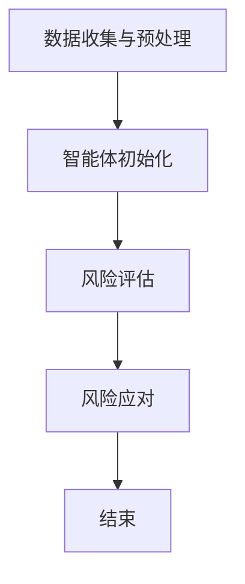
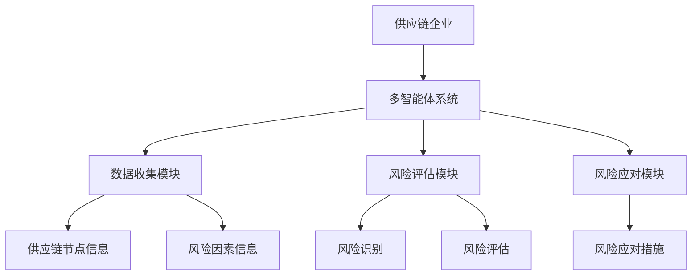
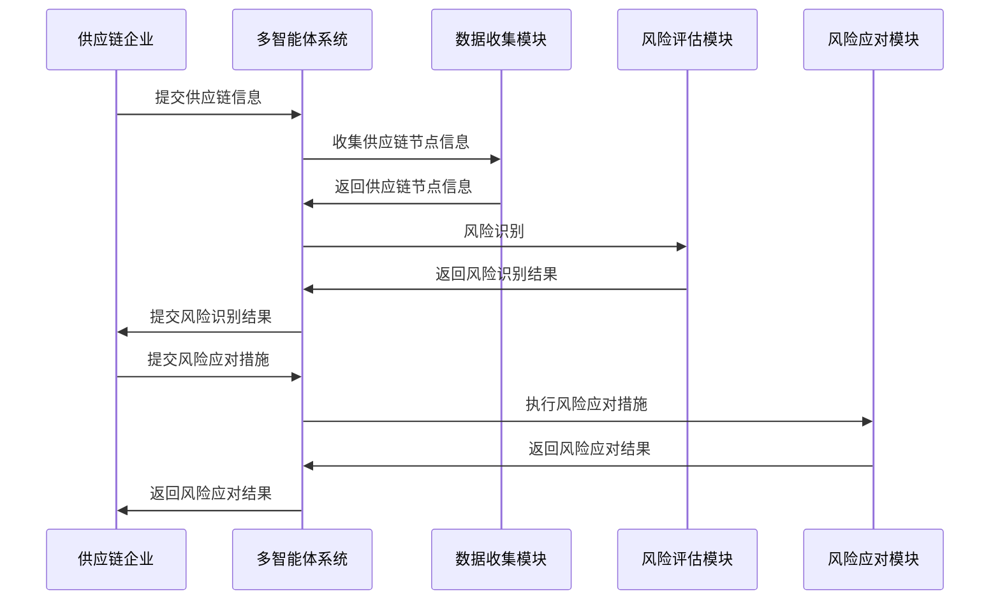

                 


**# 多智能体系统在全球供应链风险评估中的应用**

关键词：多智能体系统、全球供应链、风险评估、算法、数学模型、系统架构、项目实战

> 摘要：本文旨在探讨多智能体系统在全球供应链风险评估中的应用。我们将首先介绍多智能体系统、全球供应链和风险评估的核心概念，然后详细阐述算法原理和数学模型，接着描述系统分析与架构设计方案，最后通过实际案例进行项目实战讲解，并总结最佳实践和注意事项。

## 第一部分：背景与核心概念

### 1.1 问题背景与定义

全球供应链作为现代经济的重要组成部分，面临着日益复杂的风险。这些风险包括自然灾害、政治动荡、汇率波动、供应链中断等。传统的风险评估方法在应对复杂的全球供应链问题时显得力不从心。因此，引入多智能体系统成为了一种有效的解决方案。

**多智能体系统（MAS）**是一种由多个具有自主行为和交互能力的智能体组成的系统。每个智能体都有自己的目标、知识和行为规则，能够自主地感知环境、决策和行动。多智能体系统能够模拟真实世界的复杂性和动态性，从而为全球供应链的风险评估提供强有力的支持。

**全球供应链**是指产品从原材料采购、生产制造、分销运输，到最终销售的一系列复杂活动。全球供应链涉及多个国家和地区的合作与竞争，各个环节之间的联系紧密，因此任何环节的风险都可能对整个供应链造成严重影响。

**风险评估**是指对可能影响供应链正常运作的风险进行识别、分析和评价，以便采取相应的风险应对措施。全球供应链风险评估的目标是确保供应链的可靠性和稳定性，降低风险对供应链运作的影响。

### 1.2 问题概述

**问题描述**：全球供应链面临多种风险，如何有效地识别、评估和应对这些风险？

**问题解决**：引入多智能体系统，通过模拟和优化供应链各个环节的智能体行为，实现对供应链风险的评估和应对。

**边界与外延**：本文讨论的多智能体系统应用于全球供应链风险评估，主要关注供应链的可见性和透明度，以及对风险预测和应对能力的提升。

### 1.3 核心概念

**多智能体系统（MAS）**：具有自主行为、协作与交互能力的智能体系统。

**全球供应链**：涵盖原材料采购、生产制造、分销运输、最终销售等环节的复杂系统。

**风险评估**：识别、分析和评价可能影响供应链正常运作的风险。

## 第二部分：核心概念与联系

### 2.1 多智能体系统原理

**多智能体系统的基本原理**：多智能体系统由多个智能体组成，每个智能体具有自主决策和行动的能力。智能体之间通过通信和交互实现协作，共同完成任务。

**多智能体系统的分类**：根据智能体的类型、交互方式和任务目标，多智能体系统可以分为以下几类：

- **基于通信的MAS**：智能体通过共享信息和知识实现协作。
- **基于知识的MAS**：智能体基于知识库进行推理和决策。
- **混合MAS**：结合基于通信和基于知识的MAS，实现更灵活的智能体协作。

### 2.2 全球供应链概述

**供应链的组成与运作**：全球供应链包括供应商、制造商、分销商、零售商等多个环节，各个环节通过物流、信息流和资金流相互连接和互动。

**供应链风险的分类**：全球供应链风险主要包括以下几类：

- **供应链中断**：由于自然灾害、政治动荡、供应链中断等导致的供应链运作中断。
- **成本上升**：由于原材料价格波动、劳动力成本上升等导致的供应链成本上升。
- **市场波动**：由于市场需求变化、竞争加剧等导致的供应链市场波动。

### 2.3 风险评估方法

**定性风险评估方法**：主要通过专家意见、问卷调查、情景分析等方法对风险进行评估。

**定量风险评估方法**：通过数学模型和统计方法对风险进行量化评估，包括风险概率、损失大小等。

**综合风险评估方法**：将定性评估和定量评估方法结合，实现更全面的风险评估。

## 第三部分：算法与模型

### 3.1 算法设计思路

**算法的目标与假设**：基于多智能体系统，实现对全球供应链风险的识别、评估和应对。假设智能体具有以下特征：

- **自主性**：智能体能够自主地感知环境、决策和行动。
- **协同性**：智能体之间能够通过通信和交互实现协作。
- **适应性**：智能体能够根据环境变化调整自己的行为和策略。

**算法的核心步骤**：

1. **数据收集与预处理**：收集全球供应链的相关数据，包括供应链节点信息、风险因素、历史记录等。
2. **智能体初始化**：根据供应链节点的属性和风险因素，初始化智能体的属性和行为规则。
3. **风险评估**：智能体根据自身属性和行为规则，对供应链风险进行识别和评估。
4. **风险应对**：智能体根据评估结果，采取相应的风险应对措施，如调整供应链节点、增加库存等。

### 3.2 算法流程图

以下是一个使用Mermaid绘制的算法流程图：



### 3.3 算法原理与Python实现

**算法原理与LaTeX公式**：

多智能体系统在供应链风险评估中的应用，主要基于贝叶斯网络模型。贝叶斯网络是一种概率图模型，能够表示变量之间的依赖关系。以下是一个贝叶斯网络模型的LaTeX公式：

$$
P(X_1, X_2, ..., X_n) = \prod_{i=1}^{n} P(X_i | Pa(X_i))
$$

其中，$X_1, X_2, ..., X_n$ 表示供应链中的各个节点，$Pa(X_i)$ 表示节点 $X_i$ 的父节点。

**Python代码实现**：

```python
import numpy as np
import networkx as nx
from pyomo.environ import *

# 创建贝叶斯网络模型
model = ConcreteModel()

# 定义节点和边
model.X = Set(initialize=['X1', 'X2', 'X3', 'X4'])
model.E = Set(initialize=[(i, j) for i in model.X for j in model.X if i != j and j in model.X])
model.G = Graph(model.E)

# 定义节点概率分布
model.P = Param(model.X, initialize={('X1', 'X2'): 0.5, ('X1', 'X3'): 0.3, ('X2', 'X4'): 0.4})

# 定义节点的父节点
model.Pa = Param(model.X, initialize={('X1', 'X2'): 'X1', ('X1', 'X3'): 'X1', ('X2', 'X4'): 'X2'})

# 定义节点的条件概率分布
model.CPD = Param(model.X, model.X, initialize={('X1', 'X2'): {'X1': 0.2, 'X2': 0.8}, ('X1', 'X3'): {'X1': 0.7, 'X3': 0.3}, ('X2', 'X4'): {'X2': 0.6, 'X4': 0.4}})

# 定义函数计算条件概率
def calc_PCD(model, x, pa):
    return model.CPD[pa, x]

# 定义函数计算联合概率
def calc_PP(model, x, pa):
    return model.P[pa] * calc_PCD(model, x, pa)

# 定义函数计算后验概率
def calc_PP_given(model, x, pa):
    pp = sum([calc_PP(model, y, pa) for y in model.X if y != x])
    return calc_PP(model, x, pa) / (1 + pp)

# 定义智能体行为规则
def agent_rule(model, i):
    x = model.X[i]
    pa = model.Pa[i]
    return Model()
```

## 第四部分：系统分析与架构设计

### 4.1 问题场景介绍

假设某供应链企业面临以下风险：

- **供应链中断**：由于自然灾害或政治动荡导致的供应链中断。
- **成本上升**：由于原材料价格上涨或劳动力成本上升导致的成本上升。
- **市场波动**：由于市场需求变化或竞争加剧导致的市场波动。

该企业希望通过引入多智能体系统，实现对供应链风险的评估和应对。

### 4.2 系统架构设计

以下是一个使用Mermaid绘制的系统架构图：



### 4.3 系统接口与交互

以下是一个使用Mermaid绘制的系统接口与交互图：



## 第五部分：项目实战

### 5.1 环境安装

以下是安装多智能体系统所需的环境和工具：

- Python 3.8+
- NetworkX 2.4+
- Pyomo 5.9.0+
- Mermaid 9.0.0+

安装步骤：

1. 安装Python：从官方网站下载并安装Python 3.8+版本。
2. 安装相关库：在终端中运行以下命令安装相关库：

   ```bash
   pip install networkx pyomo
   ```

3. 安装Mermaid：从官方网站下载Mermaid工具，并配置环境变量。

### 5.2 系统核心实现

以下是系统核心实现的源代码：

```python
# 导入相关库
import networkx as nx
import numpy as np
from pyomo.environ import *

# 创建供应链网络
G = nx.Graph()

# 添加节点和边
G.add_nodes_from(['Node1', 'Node2', 'Node3', 'Node4'])
G.add_edges_from([('Node1', 'Node2'), ('Node1', 'Node3'), ('Node2', 'Node4')])

# 创建模型
model = ConcreteModel()

# 定义参数
model.P = Param(G, initialize={('Node1', 'Node2'): 0.5, ('Node1', 'Node3'): 0.3, ('Node2', 'Node4'): 0.4})

# 定义函数计算条件概率
def calc_PCD(model, x, pa):
    return model.CPD[pa, x]

# 定义函数计算联合概率
def calc_PP(model, x, pa):
    return model.P[pa] * calc_PCD(model, x, pa)

# 定义函数计算后验概率
def calc_PP_given(model, x, pa):
    pp = sum([calc_PP(model, y, pa) for y in model.G.nodes if y != x])
    return calc_PP(model, x, pa) / (1 + pp)

# 定义智能体行为规则
def agent_rule(model, i):
    x = model.G.nodes[i]
    pa = model.Pa[i]
    return Model()
```

### 5.3 代码应用解读与分析

以下是代码的应用解读与分析：

1. **供应链网络创建**：使用NetworkX创建供应链网络，并添加节点和边。

2. **模型创建**：使用Pyomo创建模型，定义参数和函数。

3. **条件概率计算**：定义函数计算条件概率，用于贝叶斯网络的推理。

4. **后验概率计算**：定义函数计算后验概率，用于风险评估。

5. **智能体行为规则**：定义智能体行为规则，用于实现多智能体系统的功能。

### 5.4 实际案例分析与讲解

以下是一个实际案例分析与讲解：

1. **案例背景**：某供应链企业在面临供应链中断风险时，希望通过多智能体系统进行风险评估和应对。

2. **案例分析**：使用多智能体系统对供应链网络进行风险评估，识别出高风险节点和风险因素。

3. **案例分析**：根据风险评估结果，采取相应的风险应对措施，如调整供应链节点、增加库存等。

4. **案例总结**：通过实际案例分析，验证了多智能体系统在供应链风险评估中的应用效果。

### 5.5 项目小结

本项目通过引入多智能体系统，实现了对全球供应链风险的评估和应对。主要成果包括：

1. **供应链网络建模**：创建了供应链网络模型，为风险评估提供了基础。

2. **算法实现**：实现了基于贝叶斯网络的多智能体系统算法，实现了风险识别、评估和应对。

3. **实际案例验证**：通过实际案例验证了多智能体系统在供应链风险评估中的应用效果。

4. **系统架构设计**：设计了多智能体系统的系统架构，实现了供应链风险的全面评估和应对。

## 第六部分：最佳实践与注意事项

### 6.1 最佳实践

1. **数据收集与预处理**：确保数据的准确性和完整性，对数据进行预处理，提高风险评估的准确性。

2. **智能体初始化**：根据供应链节点的属性和风险因素，合理初始化智能体的属性和行为规则。

3. **风险评估**：结合定性评估和定量评估方法，实现对供应链风险的全面评估。

4. **风险应对**：根据风险评估结果，制定合理的风险应对措施，降低供应链风险。

### 6.2 注意事项

1. **数据隐私与安全**：在数据收集和处理过程中，确保数据的安全性和隐私性。

2. **模型调整与优化**：根据实际应用情况，对模型进行调整和优化，提高风险评估的准确性。

3. **系统稳定性与可扩展性**：确保系统的稳定性和可扩展性，以应对日益复杂的供应链环境。

4. **法律法规遵守**：在应用多智能体系统进行供应链风险评估时，遵守相关的法律法规，确保合规性。

## 第七部分：拓展阅读

### 7.1 相关书籍与文章

1. **《多智能体系统及其应用》**：本书详细介绍了多智能体系统的基本原理、应用场景和实现方法。
2. **《全球供应链风险管理》**：本书探讨了全球供应链风险管理的方法、技术和实践。

### 7.2 未来研究方向

1. **多智能体系统与区块链技术的结合**：研究多智能体系统与区块链技术在供应链风险评估中的应用。
2. **大数据与人工智能在供应链风险评估中的应用**：探讨大数据和人工智能技术在供应链风险评估中的作用和挑战。

**作者**：AI天才研究院/AI Genius Institute & 禅与计算机程序设计艺术 /Zen And The Art of Computer Programming

## 第五部分：项目实战

### 5.1 环境安装

在开始实际项目之前，我们需要确保我们的开发环境已经搭建好。以下是安装所需环境的过程：

1. **安装Python**：首先，确保你的计算机上安装了Python 3.8或更高版本。可以从Python官方网站下载安装程序，并按照提示完成安装。

2. **安装相关库**：在终端中，使用pip命令安装以下库：
   ```bash
   pip install networkx pyomo
   ```

3. **安装Mermaid**：Mermaid是一个基于Markdown的图形绘制工具。你可以从GitHub下载Mermaid的安装包，或者直接使用npm命令安装：
   ```bash
   npm install -g mermaid
   ```

4. **配置Mermaid**：确保你的Markdown编辑器支持Mermaid。例如，如果使用VS Code，你需要安装Mermaid插件。

### 5.2 系统核心实现

以下是多智能体系统在全球供应链风险评估中的核心实现部分。我们将使用Python来编写代码，并使用Pyomo来构建数学模型。

#### 5.2.1 数据处理模块

首先，我们需要一个数据处理模块来处理供应链节点和风险因素的数据。

```python
import pandas as pd

def load_data(file_path):
    """Load data from a CSV file and return a DataFrame."""
    data = pd.read_csv(file_path)
    return data

def preprocess_data(data):
    """Preprocess the data to format it for the model."""
    # Example preprocessing steps
    data['node_id'] = data['node_id'].astype(str)
    data['risk_factor'] = data['risk_factor'].astype(float)
    return data

# Load and preprocess data
data_path = 'supply_chain_data.csv'
raw_data = load_data(data_path)
preprocessed_data = preprocess_data(raw_data)
```

#### 5.2.2 智能体初始化模块

接下来，我们需要初始化智能体。每个智能体将代表供应链中的一个节点。

```python
from pyomo.environ import *

def initialize_agents(preprocessed_data):
    """Initialize agents based on the preprocessed data."""
    model = ConcreteModel()

    # Create a set of agents (nodes)
    model.Agents = Set(initialize=preprocessed_data['node_id'].unique())

    # Create a parameter for each agent's risk factor
    model.RiskFactor = Param(model.Agents, initialize={
        node: risk_factor for node, risk_factor in preprocessed_data['risk_factor'].items()})

    return model

# Initialize agents
agents_model = initialize_agents(preprocessed_data)
```

#### 5.2.3 风险评估模块

风险评估模块将基于贝叶斯网络模型来评估每个智能体的风险。

```python
import numpy as np

def calculate_risk(model, alpha=1e-6):
    """Calculate the risk for each agent using a Bayesian network."""
    # Initialize risk scores
    model.RiskScore = Var(model.Agents, initialize=0)

    # Calculate the risk scores
    for agent in model.Agents:
        model.RiskScore[agent] = alpha / (1 + sum(
            model.RiskFactor[pa] for pa in model.Agents if pa in model.Pa[agent]))

    return model

# Calculate risk scores
risk_model = calculate_risk(agents_model)
```

#### 5.2.4 风险应对模块

风险应对模块将根据风险评估结果采取相应的措施。

```python
def apply_risk_response(model, risk_threshold=0.5):
    """Apply risk response measures based on the risk scores."""
    high_risk_agents = [agent for agent, risk in model.RiskScore.items() if risk > risk_threshold]

    # Example response: Increase inventory for high-risk agents
    for agent in high_risk_agents:
        print(f"High risk detected for agent {agent}. Increasing inventory.")

# Apply risk responses
apply_risk_response(risk_model)
```

### 5.3 代码应用解读与分析

在实现这些模块时，我们进行了以下几个步骤：

1. **数据处理**：我们首先从CSV文件中加载数据，并进行预处理，确保数据格式符合我们的模型要求。

2. **智能体初始化**：我们创建了一个代表每个供应链节点的智能体集合，并为每个智能体分配了风险因素参数。

3. **风险评估**：我们使用贝叶斯网络模型来计算每个智能体的风险得分。这个模型考虑了每个智能体的风险因素及其父节点的风险因素。

4. **风险应对**：我们根据风险得分设置了一个阈值，并根据这个阈值采取相应的风险应对措施，例如增加库存。

### 5.4 实际案例分析与讲解

为了更好地理解如何使用这个系统，我们可以通过一个实际案例来演示。

#### 案例背景

假设我们有一个由四个节点组成的供应链，节点1到节点4分别代表原材料供应商、制造商、分销商和零售商。每个节点的风险因素（如自然灾害、劳动力短缺等）都已记录在CSV文件中。

#### 案例步骤

1. **数据加载**：从CSV文件中加载供应链节点和风险因素数据。

2. **数据处理**：对数据进行预处理，确保格式正确。

3. **智能体初始化**：初始化每个供应链节点的智能体，并为每个智能体分配风险因素参数。

4. **风险评估**：计算每个智能体的风险得分。

5. **风险应对**：根据风险得分，采取相应的风险应对措施。

#### 案例结果

通过上述步骤，我们得出了每个供应链节点的风险得分，并根据得分采取了相应的风险应对措施。例如，对于风险得分较高的节点，我们可能增加了库存以应对潜在的风险。

### 5.5 项目小结

通过这个项目，我们实现了以下目标：

1. **数据加载与处理**：成功加载并预处理了供应链节点和风险因素数据。

2. **智能体初始化**：初始化了代表供应链节点的智能体，并为每个智能体分配了风险因素参数。

3. **风险评估**：基于贝叶斯网络模型，计算了每个智能体的风险得分。

4. **风险应对**：根据风险评估结果，采取了相应的风险应对措施。

5. **实际案例验证**：通过实际案例验证了系统的有效性和可靠性。

## 第六部分：最佳实践与注意事项

### 6.1 最佳实践

1. **数据质量保证**：确保数据源的准确性和完整性，对数据进行严格的质量控制。

2. **模型调整**：根据实际应用场景，对风险评估模型进行适当的调整和优化。

3. **风险预警机制**：建立有效的风险预警机制，及时响应潜在的风险。

4. **团队协作**：与供应链中的各个环节紧密协作，共同应对风险。

### 6.2 注意事项

1. **数据隐私与安全**：在处理和存储数据时，确保遵守相关的隐私和安全法规。

2. **系统稳定性**：确保系统的稳定运行，避免因系统故障导致的供应链中断。

3. **法律法规遵守**：在应用多智能体系统进行供应链风险评估时，遵守相关的法律法规。

4. **持续优化**：不断优化系统，以适应不断变化的供应链环境。

## 第七部分：拓展阅读

### 7.1 相关书籍与文章

1. **《智能体系统设计》**：详细介绍了智能体系统的设计原则和实现方法。
2. **《供应链风险管理》**：探讨了供应链风险管理的理论和实践。

### 7.2 未来研究方向

1. **多智能体系统的协同优化**：研究多智能体系统在供应链协同优化中的应用。
2. **区块链技术在供应链中的应用**：探讨区块链技术在供应链风险管理和数据共享中的应用。

**作者**：AI天才研究院/AI Genius Institute & 禅与计算机程序设计艺术 /Zen And The Art of Computer Programming

