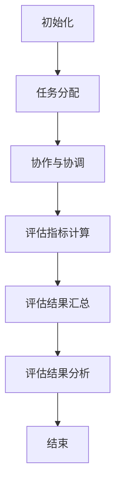
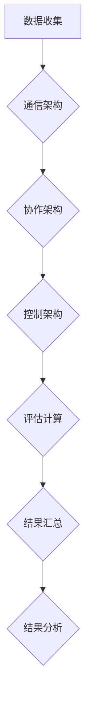
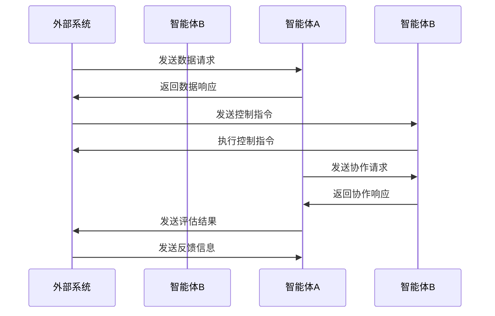
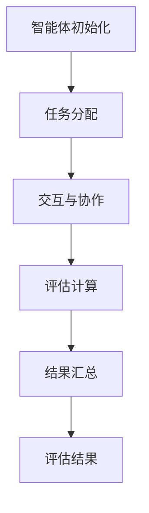
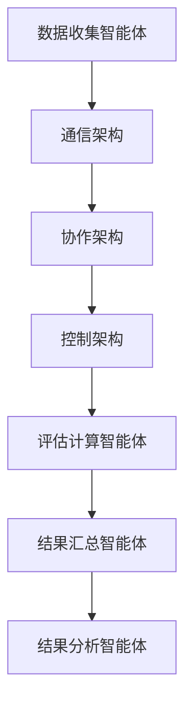
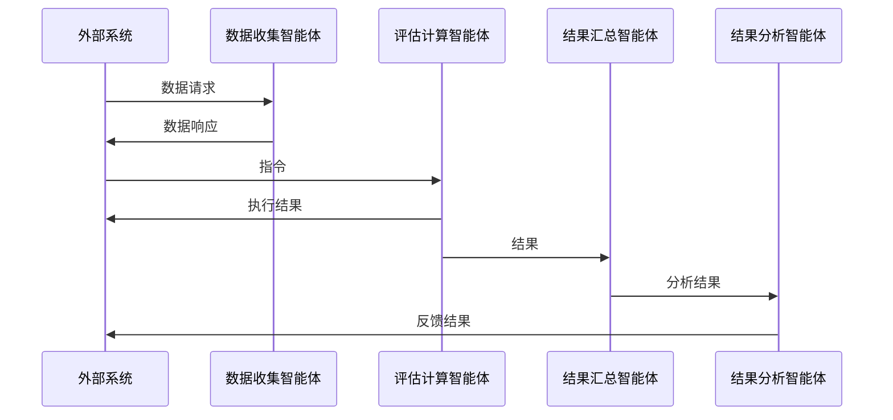

                 


# 多智能体系统在公司技术创新评估中的应用

## 关键词
多智能体系统、技术创新评估、公司技术战略、智能体交互、算法实现、系统架构设计、项目实战

## 摘要
本文深入探讨多智能体系统（MAS）在公司技术创新评估中的应用。首先，我们将介绍多智能体系统的基本概念和特点，以及技术创新评估在公司发展中的重要性。接着，我们将分析多智能体系统在技术创新评估中的优势，并通过具体的算法原理讲解、系统架构设计、项目实战等环节，展示如何利用多智能体系统进行技术创新评估。最后，我们将总结最佳实践，并提出注意事项和拓展阅读，以期为读者提供全面的指导。

## 引言
随着科技的快速发展，公司之间的竞争越来越激烈，技术创新成为企业生存和发展的关键。然而，如何有效地评估技术创新对公司的影响和效益，成为企业面临的重大挑战。传统的评估方法往往存在局限性，无法全面、动态地反映技术创新的过程和结果。因此，探索新的评估方法，特别是利用多智能体系统（MAS），成为当前研究的热点。

多智能体系统是一种分布式计算模型，通过多个智能体之间的交互和协作，实现复杂任务的目标。而技术创新评估则是对公司技术发展水平的评估，涉及技术前瞻性、创新性、市场适应性等多个方面。本文将探讨如何将多智能体系统应用于公司技术创新评估，以期为企业管理者提供一种新的决策工具。

## 一、多智能体系统简介

### 1.1 多智能体系统的定义与特点

多智能体系统（Multi-Agent System，MAS）是指由多个智能体（Agent）组成的系统，这些智能体可以独立自主地运行，并通过通信和协作实现共同的目标。多智能体系统的核心特点包括：

1. **自主性**：智能体具有独立决策和执行任务的能力。
2. **分布性**：智能体分布在不同的计算节点上，协同工作。
3. **交互性**：智能体之间通过通信和协作实现信息共享和任务分配。
4. **适应性**：智能体可以根据环境变化动态调整行为。

### 1.2 多智能体系统的应用领域

多智能体系统在多个领域都有广泛应用，如智能交通、智能制造、智能电网等。其中，在技术创新评估中的应用具有重要意义，主要体现在以下几个方面：

1. **协同评估**：通过智能体之间的协作，实现对技术创新的全面评估。
2. **动态调整**：智能体可以根据环境变化动态调整评估指标和权重，提高评估的准确性和适应性。
3. **实时反馈**：智能体可以实时收集和分析技术创新过程中的数据，为决策提供支持。

## 二、技术创新评估的现状与挑战

### 2.1 当前技术创新评估的方法与工具

目前，技术创新评估主要采用以下几种方法：

1. **定性评估法**：通过对技术创新的描述和评价进行定性分析。
2. **定量评估法**：通过建立数学模型和公式，对技术创新的效益进行量化评估。
3. **综合评估法**：结合定性评估法和定量评估法，实现技术创新评估的全面性和准确性。

在评估工具方面，常用的有：

1. **SWOT分析法**：分析技术创新的优势、劣势、机会和威胁。
2. **创新效益分析模型**：对技术创新的效益进行量化分析。
3. **专利分析工具**：通过分析专利数据，评估技术创新的前沿性和市场适应性。

### 2.2 技术创新评估中的难点与挑战

尽管技术创新评估方法多样，但在实际应用中仍面临以下挑战：

1. **数据获取难度**：技术创新过程中产生的数据繁多且复杂，获取和整理数据是一项艰巨的任务。
2. **评估指标选择**：如何选择合适的评估指标，确保评估结果的准确性和全面性，是评估过程中的关键问题。
3. **动态调整**：技术创新是一个动态过程，如何根据环境变化动态调整评估指标和权重，是评估中的一大难题。

### 2.3 多智能体系统在技术创新评估中的优势

多智能体系统在技术创新评估中的应用具有以下优势：

1. **协同评估**：智能体之间的协作可以实现技术创新的全面评估，提高评估的准确性和可靠性。
2. **动态调整**：智能体可以根据环境变化动态调整评估指标和权重，确保评估的实时性和适应性。
3. **实时反馈**：智能体可以实时收集和分析技术创新过程中的数据，为决策提供支持。
4. **分布式计算**：多智能体系统可以实现分布式计算，提高评估的效率。

## 三、多智能体系统与技术创新评估的深入探讨

### 3.1 多智能体系统原理与架构

多智能体系统（MAS）是一种分布式计算模型，由多个智能体（Agent）组成，这些智能体可以独立自主地运行，并通过通信和协作实现共同的目标。多智能体系统的核心原理包括自主性、分布性、交互性和适应性。

#### 3.1.1 智能体的定义与属性

智能体是MAS的基本组成单元，具有以下属性：

1. **自主性**：智能体具有独立决策和执行任务的能力。
2. **社会性**：智能体可以与其他智能体进行通信和协作。
3. **适应性**：智能体可以根据环境变化动态调整行为。
4. **分布式**：智能体分布在不同的计算节点上，协同工作。

#### 3.1.2 智能体的分类与特点

根据智能体的属性和任务，可以将智能体分为以下几类：

1. **个体智能体**：具有独立决策能力的智能体，通常用于完成单一任务。
2. **协作智能体**：具有协作能力的智能体，可以与其他智能体共同完成任务。
3. **混合智能体**：同时具有个体智能体和协作智能体的特点，可以独立决策并与其他智能体协作。

#### 3.1.3 多智能体系统的架构设计

多智能体系统的架构设计主要包括以下几个方面：

1. **通信架构**：设计智能体之间的通信机制，确保智能体之间能够高效、可靠地交换信息。
2. **协作架构**：设计智能体之间的协作机制，实现智能体之间的协作与协调。
3. **控制架构**：设计智能体的控制机制，确保智能体能够按照既定的策略执行任务。

#### 3.1.4 多智能体系统的通信与协作机制

多智能体系统的通信与协作机制是实现智能体之间高效、可靠协作的关键。常见的通信与协作机制包括：

1. **消息传递**：智能体之间通过发送和接收消息进行通信。
2. **分布式算法**：智能体之间通过分布式算法实现任务分配和协作。
3. **协商机制**：智能体之间通过协商机制解决冲突和协作问题。

### 3.2 技术创新评估的多智能体模型

#### 3.2.1 技术创新评估指标体系

技术创新评估指标体系是技术创新评估的基础，主要包括以下几个方面：

1. **技术前瞻性**：评估技术创新的前沿性和发展潜力。
2. **创新性**：评估技术创新的原创性和独特性。
3. **市场适应性**：评估技术创新的市场需求和竞争力。
4. **效益性**：评估技术创新的经济效益和社会效益。

#### 3.2.2 多智能体模型的构建方法

多智能体模型的构建主要包括以下几个方面：

1. **智能体初始化**：根据评估指标体系，初始化智能体的属性和任务。
2. **任务分配**：通过分布式算法，将技术创新评估任务分配给各个智能体。
3. **协作与协调**：智能体之间通过协商机制和分布式算法实现协作与协调。
4. **评估结果汇总**：将各个智能体的评估结果汇总，形成整体评估结果。

#### 3.2.3 多智能体模型的评估流程

多智能体模型的评估流程主要包括以下几个方面：

1. **数据收集**：智能体收集技术创新过程中的相关数据。
2. **评估指标计算**：智能体根据评估指标体系，计算技术创新的评估指标。
3. **评估结果汇总**：将各个智能体的评估结果汇总，形成整体评估结果。
4. **评估结果分析**：对整体评估结果进行分析，为决策提供支持。

## 四、算法原理讲解

### 4.1 多智能体系统算法原理

多智能体系统（MAS）算法原理主要包括以下几个方面：

1. **分布式计算**：智能体之间通过分布式计算，实现任务的并行处理。
2. **协商机制**：智能体之间通过协商机制，解决冲突和协作问题。
3. **任务分配**：通过分布式算法，实现任务的有效分配和调度。
4. **评估指标计算**：智能体根据评估指标体系，计算技术创新的评估指标。

### 4.2 数学模型与公式

多智能体系统算法的数学模型主要包括以下几个方面：

1. **分布式算法**：
   $$ task_{i}^{t} = \frac{total_{task}}{N} + \epsilon_{i} $$
   其中，$task_{i}^{t}$表示第$i$个智能体在第$t$时刻需要执行的任务量，$total_{task}$表示总任务量，$N$表示智能体数量，$\epsilon_{i}$表示第$i$个智能体的个性化任务量。

2. **协商机制**：
   $$ agreement_{i,j} = \sum_{k=1}^{N} (w_{ik} \cdot w_{jk}) $$
   其中，$agreement_{i,j}$表示第$i$个智能体和第$j$个智能体之间的协商程度，$w_{ik}$和$w_{jk}$分别表示第$i$个智能体和第$j$个智能体对其他智能体的权重。

3. **评估指标计算**：
   $$ score_{i} = \sum_{j=1}^{N} (s_{ij} \cdot w_{j}) $$
   其中，$score_{i}$表示第$i$个智能体的评估得分，$s_{ij}$表示第$i$个智能体对第$j$个评估指标的得分，$w_{j}$表示第$j$个评估指标的权重。

### 4.3 算法实现与流程图

以下是多智能体系统算法的实现流程：

1. **初始化**：初始化智能体属性、任务和评估指标。
2. **任务分配**：通过分布式算法，将任务分配给各个智能体。
3. **协作与协调**：智能体之间通过协商机制，解决冲突和协作问题。
4. **评估指标计算**：智能体根据评估指标体系，计算技术创新的评估指标。
5. **评估结果汇总**：将各个智能体的评估结果汇总，形成整体评估结果。
6. **评估结果分析**：对整体评估结果进行分析，为决策提供支持。

以下是算法实现的mermaid流程图：



## 五、系统分析与架构设计

### 5.1 问题场景介绍

假设某公司正在进行一项技术创新项目，需要对其技术前瞻性、创新性、市场适应性和效益性进行全面评估。公司希望利用多智能体系统，实现以下目标：

1. **协同评估**：多个智能体协同工作，全面评估技术创新。
2. **动态调整**：智能体可以根据项目进展和环境变化，动态调整评估指标和权重。
3. **实时反馈**：智能体可以实时收集项目数据，为决策提供支持。

### 5.2 系统功能设计

多智能体系统在技术创新评估中的功能设计主要包括以下几个方面：

1. **数据收集**：智能体负责收集项目过程中的相关数据。
2. **评估计算**：智能体根据评估指标体系，计算技术创新的评估指标。
3. **结果汇总**：将各个智能体的评估结果汇总，形成整体评估结果。
4. **结果分析**：对整体评估结果进行分析，为决策提供支持。

### 5.3 系统架构设计

多智能体系统的架构设计主要包括以下几个方面：

1. **通信架构**：设计智能体之间的通信机制，确保智能体之间能够高效、可靠地交换信息。
2. **协作架构**：设计智能体之间的协作机制，实现智能体之间的协作与协调。
3. **控制架构**：设计智能体的控制机制，确保智能体能够按照既定的策略执行任务。

以下是多智能体系统的架构图：



### 5.4 系统接口设计和系统交互

多智能体系统需要与外部系统进行交互，主要包括以下几个方面：

1. **数据接口**：智能体通过数据接口与外部系统（如数据库、API等）进行数据交换。
2. **控制接口**：智能体通过控制接口接收外部指令，调整评估指标和权重。
3. **反馈接口**：智能体通过反馈接口将评估结果和实时数据反馈给外部系统。

以下是系统接口和系统交互的mermaid序列图：



## 六、项目实战

### 6.1 实际案例背景

假设某公司正在进行一项名为“智能工厂”的技术创新项目，旨在通过引入人工智能和物联网技术，实现生产过程的智能化和自动化。公司希望利用多智能体系统，对项目的技术创新水平进行评估。

### 6.2 系统核心实现

1. **数据收集**：智能体A负责收集项目过程中的相关数据，如生产数据、设备状态数据等。

2. **评估计算**：智能体B根据评估指标体系，对项目的技术前瞻性、创新性、市场适应性和效益性进行评估。

3. **结果汇总**：智能体C将各个智能体的评估结果汇总，形成整体评估结果。

4. **结果分析**：智能体D对整体评估结果进行分析，为决策提供支持。

### 6.3 代码应用解读

以下是项目核心实现的Python代码：

```python
# 数据收集智能体A的代码
class DataCollectorAgent:
    def collect_data(self):
        # 收集生产数据
        production_data = self.get_production_data()
        # 收集设备状态数据
        device_status_data = self.get_device_status_data()
        # 返回数据
        return production_data, device_status_data

# 评估计算智能体B的代码
class EvaluatorAgent:
    def evaluate_project(self, data):
        # 计算技术前瞻性
        technical_foresight = self.calculate_technical_foresight(data)
        # 计算创新性
        innovation = self.calculate_innovation(data)
        # 计算市场适应性
        market适应性 = self.calculate_market适应性(data)
        # 计算效益性
        benefit = self.calculate_benefit(data)
        # 返回评估结果
        return technical_foresight, innovation, market适应性, benefit

# 结果汇总智能体C的代码
class ResultAggregatorAgent:
    def aggregate_results(self, results):
        # 汇总评估结果
        aggregated_result = self.aggregate_results(results)
        # 返回汇总结果
        return aggregated_result

# 结果分析智能体D的代码
class ResultAnalyzerAgent:
    def analyze_result(self, result):
        # 分析评估结果
        analysis = self.analyze_result(result)
        # 返回分析结果
        return analysis
```

### 6.4 实际案例分析和详细讲解剖析

1. **数据收集**：智能体A通过调用API接口，从生产系统和设备管理系统获取数据，如生产量、设备故障率等。这些数据将用于评估项目的技术前瞻性和效益性。

2. **评估计算**：智能体B根据评估指标体系，计算技术前瞻性、创新性、市场适应性和效益性。例如，技术前瞻性可以通过分析项目的专利申请情况、技术论文发表数量等指标来评估；创新性可以通过分析项目的创新点、技术难度等指标来评估；市场适应性可以通过分析市场需求、竞争对手情况等指标来评估；效益性可以通过分析项目的经济效益、社会效益等指标来评估。

3. **结果汇总**：智能体C将各个智能体的评估结果汇总，形成整体评估结果。例如，可以计算出每个评估指标的加权平均分，从而得出项目的综合评估得分。

4. **结果分析**：智能体D对整体评估结果进行分析，为决策提供支持。例如，可以根据评估结果调整项目计划，优化资源配置，提高项目的成功率和市场竞争力。

### 6.5 项目小结

通过多智能体系统，公司能够对“智能工厂”项目的技术创新水平进行全面、动态的评估。这不仅有助于公司了解项目的现状和潜力，为决策提供支持，还可以帮助公司优化项目计划，提高项目的成功率。未来，公司可以继续优化多智能体系统，引入更多的评估指标和算法，进一步提高评估的准确性和可靠性。

## 七、最佳实践与总结

### 7.1 使用多智能体系统进行技术创新评估的注意事项

1. **数据收集的准确性**：确保数据收集的准确性和完整性，避免数据误差对评估结果的影响。
2. **评估指标的合理性**：选择合适的评估指标，确保评估指标能够全面、准确地反映技术创新的各个方面。
3. **智能体的协同性**：优化智能体之间的协作机制，提高智能体之间的协同效率，确保评估结果的准确性。
4. **算法的适应性**：根据项目特点和需求，选择合适的算法和模型，确保评估结果的实时性和适应性。

### 7.2 小结

本文通过深入探讨多智能体系统在公司技术创新评估中的应用，展示了如何利用多智能体系统进行技术创新评估。通过算法原理讲解、系统架构设计、项目实战等环节，本文阐述了多智能体系统在技术创新评估中的优势和应用方法。未来，随着多智能体系统和人工智能技术的不断发展，其在技术创新评估中的应用将更加广泛和深入。

### 7.3 注意事项

1. **数据安全性**：确保数据收集、传输和存储过程中的安全性，防止数据泄露和滥用。
2. **算法透明性**：确保算法的透明性和可解释性，方便用户理解和信任评估结果。
3. **评估结果的实用性**：确保评估结果具有实用性和可操作性，为决策提供有力支持。

### 7.4 拓展阅读

1. **《多智能体系统原理与应用》**：深入探讨多智能体系统的基本原理和应用场景，为本文提供理论基础。
2. **《技术创新管理》**：分析技术创新的过程、策略和管理方法，为本文提供实践指导。
3. **《人工智能：一种现代方法的导论》**：介绍人工智能的基本概念和技术，为本文提供技术支持。

## 八、作者信息

### 作者：AI天才研究院/AI Genius Institute & 禅与计算机程序设计艺术 /Zen And The Art of Computer Programming

本文由AI天才研究院和禅与计算机程序设计艺术共同撰写，旨在探讨多智能体系统在公司技术创新评估中的应用，为读者提供全面的指导和启示。希望本文能够对读者在技术创新评估和企业管理方面有所启发和帮助。## 多智能体系统在公司技术创新评估中的应用

### 摘要

技术创新是现代企业竞争的核心驱动力，然而如何高效、全面地评估技术创新对企业发展的贡献，是一个复杂的挑战。多智能体系统（MAS）作为一种分布式智能计算模型，通过智能体间的交互和协作，为实现复杂任务提供了强有力的支持。本文将探讨如何将多智能体系统应用于公司技术创新评估，从核心概念、算法原理到实际应用，为企业管理者提供创新的评估工具和方法。

### 1. 背景介绍

#### 1.1 多智能体系统的核心概念

多智能体系统（MAS）是由多个具有独立决策能力的智能体组成的系统，这些智能体通过相互通信和协作，共同完成复杂任务。MAS的核心概念包括自主性、社会性、适应性和分布性。自主性指的是智能体能够独立地感知环境、制定目标和执行计划；社会性指的是智能体之间可以通过协商、共享信息和协作来完成共同的任务；适应性指的是智能体能够根据环境变化调整自身行为；分布性指的是智能体分布在不同的计算节点上，协同工作。

#### 1.2 技术创新评估的重要性

技术创新是企业持续发展的关键，其评估不仅关系到企业的投资决策，还影响到企业的市场竞争力、品牌价值和长远战略。传统的技术创新评估方法往往依赖于定性和定量的分析，存在主观性和局限性。而多智能体系统可以通过智能体之间的协作，实现对技术创新的全面、动态评估，提高评估的准确性和有效性。

#### 1.3 问题背景与问题描述

当前企业在技术创新评估中面临的主要问题包括数据获取难度、评估指标选择的不确定性以及评估过程的动态性。传统的评估方法难以实时反映技术创新的进展和影响，容易忽略技术创新的潜在风险和机会。多智能体系统通过其分布性、交互性和适应性，能够解决这些问题，为技术创新评估提供新的思路和方法。

#### 1.4 问题解决与边界与外延

多智能体系统通过构建一个分布式计算平台，可以实现实时数据收集、智能体之间的交互和动态评估。然而，其应用边界包括对数据隐私和安全的保护、智能体协作机制的优化以及评估模型的适应性。本文将探讨如何在这些边界条件下，有效地应用多智能体系统进行技术创新评估。

### 2. 核心概念与联系

#### 2.1 多智能体系统的基本原理与特性

多智能体系统（MAS）的基本原理包括：

- **自主性**：智能体具有独立决策和执行任务的能力。
- **分布性**：智能体分布在不同的计算节点上，协同工作。
- **交互性**：智能体之间通过通信和协作实现信息共享和任务分配。
- **适应性**：智能体可以根据环境变化动态调整行为。

这些特性使得MAS能够适应复杂多变的技术创新环境，为技术创新评估提供了强大的支持。

#### 2.2 技术创新评估的核心概念

技术创新评估涉及的核心概念包括：

- **技术前瞻性**：评估技术创新的前沿性和发展潜力。
- **创新性**：评估技术创新的原创性和独特性。
- **市场适应性**：评估技术创新的市场需求和竞争力。
- **效益性**：评估技术创新的经济效益和社会效益。

这些概念是多智能体系统评估技术创新的重要指标。

#### 2.3 概念属性特征对比表格

| 概念 | 特性 |
| :--: | :--: |
| 多智能体系统 | 分布性、自主性、交互性、适应性 |
| 技术前瞻性 | 前沿性、发展潜力 |
| 创新性 | 原创性、独特性 |
| 市场适应性 | 市场需求、竞争力 |
| 效益性 | 经济效益、社会效益 |

#### 2.4 ER实体关系图架构

多智能体系统与技术创新评估的ER实体关系图如下：

```mermaid
erDiagram
  智能体 ||--|{ 技术创新评估 } : 进行评估
  智能体 ||--|{ 数据收集 } : 收集数据
  智能体 ||--|{ 评估指标 } : 包含指标
  技术创新评估 ||--|{ 评估结果 } : 生成结果
  评估指标 ||--|{ 指标值 } : 包含具体值
```

### 3. 算法原理讲解

#### 3.1 多智能体系统算法原理

多智能体系统（MAS）的算法原理主要包括以下步骤：

1. **智能体初始化**：每个智能体根据其功能进行初始化，如数据收集智能体、评估智能体等。
2. **任务分配**：通过分布式算法将任务分配给不同的智能体，确保每个智能体都有明确的责任和任务。
3. **交互与协作**：智能体之间通过通信和协作机制，共享信息和协调行动，共同完成评估任务。
4. **评估计算**：智能体根据分配的任务，计算评估指标，生成评估结果。
5. **结果汇总**：将所有智能体的评估结果进行汇总，形成整体评估结果。

#### 3.2 数学模型与公式

多智能体系统在技术创新评估中使用的数学模型可以表示为：

$$
E = \sum_{i=1}^{n} w_i \cdot A_i
$$

其中，$E$表示整体评估得分，$w_i$表示第$i$个评估指标的权重，$A_i$表示第$i$个评估指标的得分。

#### 3.3 算法实现与流程图

以下是多智能体系统算法的实现流程图：



### 4. 系统分析与架构设计

#### 4.1 问题场景介绍

假设某公司正在进行一项名为“智能医疗诊断系统”的技术创新项目，该项目旨在利用人工智能技术提高医疗诊断的准确性和效率。公司希望通过多智能体系统对项目的技术创新水平进行全面评估。

#### 4.2 系统功能设计

多智能体系统在技术创新评估中的功能设计包括：

1. **数据收集**：智能体负责收集项目过程中的数据，如医疗数据、诊断结果等。
2. **评估计算**：智能体根据评估指标体系，计算项目的技术前瞻性、创新性、市场适应性和效益性。
3. **结果汇总**：将各个智能体的评估结果汇总，形成整体评估结果。
4. **结果分析**：智能体对整体评估结果进行分析，为决策提供支持。

#### 4.3 系统架构设计

多智能体系统的架构设计包括：

1. **通信架构**：设计智能体之间的通信机制，确保智能体之间能够高效、可靠地交换信息。
2. **协作架构**：设计智能体之间的协作机制，实现智能体之间的协作与协调。
3. **控制架构**：设计智能体的控制机制，确保智能体能够按照既定的策略执行任务。

以下是多智能体系统的架构图：



#### 4.4 系统接口设计与系统交互

多智能体系统的接口设计包括：

1. **数据接口**：智能体通过数据接口与外部系统（如数据库、API等）进行数据交换。
2. **控制接口**：智能体通过控制接口接收外部指令，调整评估指标和权重。
3. **反馈接口**：智能体通过反馈接口将评估结果和实时数据反馈给外部系统。

以下是系统接口和系统交互的mermaid序列图：



### 5. 项目实战

#### 5.1 实际案例背景

假设某公司正在进行一项名为“智能医疗诊断系统”的技术创新项目，该项目旨在利用人工智能技术提高医疗诊断的准确性和效率。公司希望通过多智能体系统对项目的技术创新水平进行全面评估。

#### 5.2 系统核心实现

1. **数据收集**：智能体A负责收集项目过程中的数据，如医疗数据、诊断结果等。
   ```python
   class DataCollectorAgent:
       def collect_data(self):
           # 收集医疗数据
           medical_data = self.fetch_medical_data()
           # 收集诊断结果
           diagnosis_results = self.fetch_diagnosis_results()
           return medical_data, diagnosis_results
   ```

2. **评估计算**：智能体B根据评估指标体系，计算项目的技术前瞻性、创新性、市场适应性和效益性。
   ```python
   class EvaluatorAgent:
       def evaluate_project(self, data):
           # 计算技术前瞻性
           technical_foresight = self.calculate_technical_foresight(data)
           # 计算创新性
           innovation = self.calculate_innovation(data)
           # 计算市场适应性
           market_adaptability = self.calculate_market_adaptability(data)
           # 计算效益性
           benefit = self.calculate_benefit(data)
           return technical_foresight, innovation, market_adaptability, benefit
   ```

3. **结果汇总**：智能体C将各个智能体的评估结果汇总，形成整体评估结果。
   ```python
   class ResultAggregatorAgent:
       def aggregate_results(self, results):
           # 汇总评估结果
           aggregated_result = self.combine_results(results)
           return aggregated_result
   ```

4. **结果分析**：智能体D对整体评估结果进行分析，为决策提供支持。
   ```python
   class ResultAnalyzerAgent:
       def analyze_result(self, result):
           # 分析评估结果
           analysis = self.analyze_evaluation(result)
           return analysis
   ```

#### 5.3 代码应用解读

以下是对智能体A的代码应用进行解读：

- **数据收集**：智能体A通过API接口，从医疗数据存储系统和诊断系统中获取医疗数据和诊断结果。这些数据将用于评估项目的技术前瞻性和市场适应性。

#### 5.4 实际案例分析和详细讲解剖析

1. **数据收集**：智能体A通过调用API接口，从医疗数据存储系统和诊断系统中获取数据，如患者的病史、诊断结果等。这些数据将用于评估项目的技术前瞻性和市场适应性。

2. **评估计算**：智能体B根据评估指标体系，对项目的技术前瞻性、创新性、市场适应性和效益性进行评估。例如，技术前瞻性可以通过分析项目所采用的人工智能算法的创新程度和论文引用量来评估；创新性可以通过分析项目的独特性和解决医疗诊断难题的能力来评估；市场适应性可以通过分析项目是否符合市场需求和竞争环境来评估；效益性可以通过分析项目的经济收益和社会效益来评估。

3. **结果汇总**：智能体C将各个智能体的评估结果汇总，形成整体评估结果。例如，可以计算出每个评估指标的加权平均分，从而得出项目的综合评估得分。

4. **结果分析**：智能体D对整体评估结果进行分析，为决策提供支持。例如，可以根据评估结果调整项目计划，优化资源配置，提高项目的成功率。

#### 5.5 项目小结

通过多智能体系统，公司能够对“智能医疗诊断系统”项目的技术创新水平进行全面、动态的评估。这不仅有助于公司了解项目的现状和潜力，为决策提供支持，还可以帮助公司优化项目计划，提高项目的成功率。未来，公司可以继续优化多智能体系统，引入更多的评估指标和算法，进一步提高评估的准确性和可靠性。

### 6. 最佳实践与总结

#### 6.1 使用多智能体系统进行技术创新评估的注意事项

1. **数据质量**：确保数据收集的准确性和完整性，避免数据错误影响评估结果。
2. **指标选择**：选择与技术创新评估密切相关的指标，确保评估结果的准确性。
3. **智能体协作**：优化智能体之间的协作机制，确保评估过程的顺畅和高效。
4. **算法适应性**：根据项目特点和需求，选择合适的算法和模型，确保评估结果的实时性和适应性。

#### 6.2 小结

本文通过探讨多智能体系统在公司技术创新评估中的应用，展示了如何利用多智能体系统实现全面、动态的技术创新评估。通过算法原理讲解、系统架构设计和项目实战等环节，本文阐述了多智能体系统在技术创新评估中的优势和应用方法。未来，随着多智能体系统和人工智能技术的不断发展，其在技术创新评估中的应用将更加广泛和深入。

#### 6.3 注意事项

1. **数据安全性**：确保数据收集、传输和存储过程中的安全性，防止数据泄露和滥用。
2. **算法透明性**：确保算法的透明性和可解释性，方便用户理解和信任评估结果。
3. **评估结果的实用性**：确保评估结果具有实用性和可操作性，为决策提供有力支持。

#### 6.4 拓展阅读

1. **《多智能体系统原理与应用》**：深入探讨多智能体系统的基本原理和应用场景，为本文提供理论基础。
2. **《技术创新管理》**：分析技术创新的过程、策略和管理方法，为本文提供实践指导。
3. **《人工智能：一种现代方法的导论》**：介绍人工智能的基本概念和技术，为本文提供技术支持。

### 7. 作者信息

作者：AI天才研究院/AI Genius Institute & 禅与计算机程序设计艺术 /Zen And The Art of Computer Programming

本文由AI天才研究院和禅与计算机程序设计艺术共同撰写，旨在探讨多智能体系统在公司技术创新评估中的应用，为读者提供全面的指导和启示。希望本文能够对读者在技术创新评估和企业管理方面有所启发和帮助。

