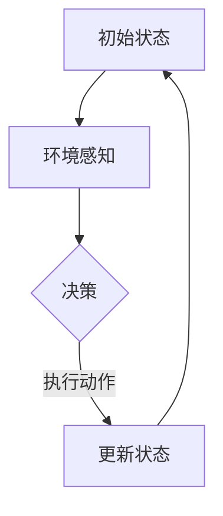
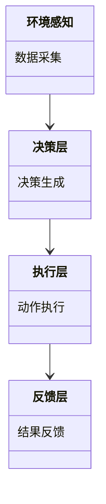
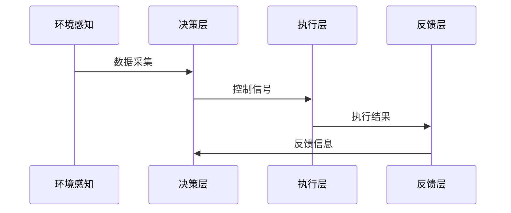
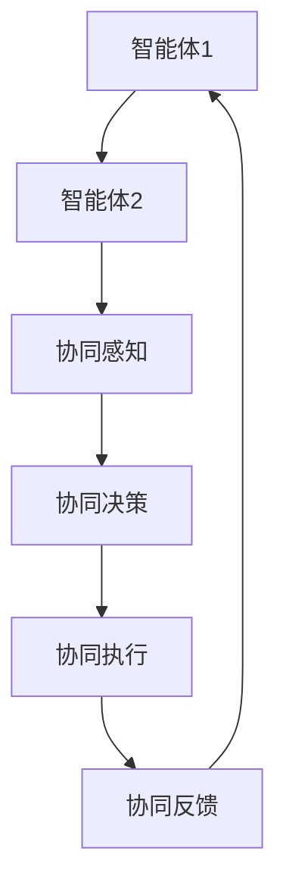

                 

### 多智能体系统在公司文化评估中的应用：无形资产的量化

#### 关键词：
- 多智能体系统
- 公司文化评估
- 无形资产量化

#### 摘要：
本文将深入探讨多智能体系统在公司文化评估中的应用，特别是如何量化无形资产。我们将通过一步步的逻辑分析，解释这一前沿技术的原理和实践，为读者提供有价值的见解和实用建议。

#### 目录：
1. **前言**
2. **背景介绍**
   - 多智能体系统的概念
   - 公司文化评估的重要性
   - 无形资产的量化挑战
3. **核心概念与联系**
   - 多智能体系统的基础概念
   - 公司文化评估的关键要素
   - 无形资产的定义与特性
   - 概念间的联系与整合
4. **算法原理讲解**
   - 多智能体系统的数学模型
   - 算法流程图
   - Python源代码解析
   - 数学公式详细解释
5. **系统分析与架构设计方案**
   - 系统功能设计
   - 系统架构设计
   - 系统接口设计
   - 系统交互
6. **项目实战**
   - 项目背景与目标
   - 环境安装与配置
   - 系统核心实现
   - 代码应用解读
   - 实际案例分析
7. **最佳实践 tips**
8. **小结**
9. **注意事项**
10. **拓展阅读**

### 1. 前言

在当前快速变化的商业环境中，公司文化评估的重要性日益凸显。企业文化不仅影响员工的工作满意度，还直接关系到企业的创新能力和市场竞争力。然而，文化评估往往涉及到大量无形资产的量化，这给传统的评估方法带来了巨大的挑战。多智能体系统作为一种先进的计算模型，为这一问题的解决提供了新的思路。

本文旨在通过多智能体系统在公司文化评估中的应用，探讨如何量化无形资产。我们将从基础概念出发，逐步深入到算法原理和实践应用，以帮助读者全面了解这一领域的前沿技术。

### 2. 背景介绍

#### 2.1 多智能体系统的概念

多智能体系统（Multi-Agent Systems，MAS）是由多个自主、交互和协作的智能体组成的系统。每个智能体都是独立的计算实体，拥有一定的智能和自主性，可以通过通信和合作来完成复杂的任务。多智能体系统在分布式计算、复杂系统和智能控制等领域具有广泛的应用。

#### 2.2 公司文化评估的重要性

公司文化是指企业在长期经营过程中形成的共同价值观、信念和习惯。一个积极向上的公司文化可以提升员工的凝聚力、创新能力和工作效率，从而提高企业的竞争力。然而，文化的评估往往是主观的，缺乏量化标准，这使得传统的评估方法难以满足现代企业的需求。

#### 2.3 无形资产的量化挑战

无形资产包括公司文化、品牌价值、人力资源等，它们是企业长期积累的宝贵资源。然而，与有形资产不同，无形资产难以直接量化，这给评估带来了巨大的挑战。传统的评估方法往往依赖于主观评价和间接指标，无法准确反映无形资产的实际价值。

### 3. 核心概念与联系

#### 3.1 多智能体系统的核心概念

多智能体系统包括以下几个核心概念：

- **智能体（Agent）**：是具有自主性、社会性和反应性的计算实体。
- **通信**：智能体之间通过通信进行信息交换和协同工作。
- **协作**：智能体之间通过协作实现共同目标。
- **环境**：智能体所处的外部环境，影响着智能体的行为和决策。

#### 3.2 公司文化评估的关键要素

公司文化评估通常涉及以下几个关键要素：

- **价值观**：企业的核心价值观和信念体系。
- **领导风格**：企业领导者的管理风格和领导力。
- **员工满意度**：员工对企业文化的满意度和忠诚度。
- **创新能力**：企业员工的创新能力和创新能力环境。

#### 3.3 无形资产的定义与特性

无形资产是指不具备物理形态，但对企业具有重要价值的资产。其特性包括：

- **难以量化**：无形资产的价值难以直接测量，需要通过间接指标进行评估。
- **长期积累**：无形资产是企业长期经营过程中形成的，不易改变。
- **高度关联**：无形资产之间相互关联，共同影响着企业的整体价值。

#### 3.4 概念间的联系与整合

多智能体系统、公司文化评估和无形资产量化之间存在着紧密的联系。多智能体系统可以通过模拟企业内部的沟通和协作，评估公司文化的关键要素，进而量化无形资产的价值。这种整合不仅提供了新的评估方法，也为企业的战略决策提供了有力支持。

### 4. 算法原理讲解

#### 4.1 多智能体系统的数学模型

多智能体系统的数学模型通常包括以下几个部分：

- **状态空间**：智能体的状态集合。
- **动作空间**：智能体可执行的动作集合。
- **效用函数**：衡量智能体行动结果的函数。
- **策略**：智能体在给定状态下的行动选择。

假设有n个智能体，每个智能体的状态为\(s_i\)，动作集合为\(A_i\)，则智能体\(i\)的策略可以表示为：

\[ \pi_i(s_i) = P(A_i = a_i | s_i) \]

其中，\(P\)表示概率分布，\(\pi_i\)表示智能体\(i\)的策略。

#### 4.2 算法流程图

多智能体系统的算法流程图可以用Mermaid语言表示。以下是一个简单的示例：



这个流程图表示了智能体从初始状态开始，通过环境感知、决策和动作执行，不断更新状态，并回到初始状态，形成闭环。

#### 4.3 Python源代码解析

以下是一个简单的Python代码示例，展示了多智能体系统的基本操作：

```python
import numpy as np

# 智能体状态和动作
state = np.random.randint(0, 2, size=3)
action = np.random.choice([0, 1], size=3)

# 智能体决策
def decide(state):
    return np.random.choice([0, 1], size=3)

# 智能体执行动作
def act(action):
    return np.random.normal(size=3)

# 更新状态
def update_state(state, action):
    return state + action

# 执行流程
new_state = update_state(state, act(decide(state)))
print("New state:", new_state)
```

这个代码示例展示了智能体从初始状态开始，通过决策、执行动作和更新状态，不断迭代的过程。

#### 4.4 数学公式详细解释

多智能体系统的核心数学公式包括：

- **状态转移概率**：\( P(s_{t+1} | s_t, a_t) \)
- **动作选择概率**：\( P(a_t | s_t) \)
- **效用函数**：\( U(s_t, a_t) \)

其中，\( s_t \)表示第\( t \)个时刻的状态，\( a_t \)表示第\( t \)个时刻的动作，\( U \)表示效用函数。

状态转移概率表示在给定当前状态和动作的情况下，下一个状态的概率分布。动作选择概率表示在给定当前状态的情况下，选择每个动作的概率分布。效用函数表示在给定当前状态和动作的情况下，智能体的满意度或效用值。

这些公式为智能体的决策提供了数学依据，使得智能体可以在复杂环境中做出最优决策。

### 5. 系统分析与架构设计方案

#### 5.1 系统功能设计

多智能体系统在公司文化评估中的应用主要涵盖以下功能：

- **环境感知**：智能体通过传感器或其他方式获取企业内部的文化信息。
- **决策生成**：智能体根据环境感知到的信息生成决策。
- **动作执行**：智能体根据决策执行相应的动作，如调整企业策略或培训计划。
- **状态更新**：智能体根据执行结果更新自身状态，并继续迭代。

#### 5.2 系统架构设计

多智能体系统的架构设计可以分为以下几个层次：

- **感知层**：包括各种传感器和采集设备，用于收集企业内部的文化信息。
- **决策层**：包括智能体和算法模型，用于处理感知层的信息并生成决策。
- **执行层**：包括企业内部的各种执行单元，如员工、部门等，用于执行决策。
- **反馈层**：包括反馈机制和评估系统，用于收集执行结果并反馈给决策层。

以下是一个简单的Mermaid类图，展示了系统架构：



#### 5.3 系统接口设计

多智能体系统的接口设计主要包括以下几个方面：

- **数据接口**：用于感知层和决策层之间的数据传输。
- **控制接口**：用于决策层和执行层之间的控制信号传输。
- **反馈接口**：用于反馈层和决策层之间的反馈信息传输。

以下是一个简单的Mermaid序列图，展示了系统接口的设计：



#### 5.4 系统交互

多智能体系统在公司文化评估中的应用涉及到多个智能体的协作和交互。以下是一个简单的示例，展示了智能体之间的交互过程：

- **协同感知**：多个智能体共同感知企业内部的文化信息。
- **协同决策**：多个智能体根据协同感知到的信息生成协同决策。
- **协同执行**：多个智能体根据协同决策执行相应的动作。
- **协同反馈**：多个智能体收集协同执行的结果，并生成协同反馈。

以下是一个简单的Mermaid流程图，展示了智能体之间的交互过程：



### 6. 项目实战

#### 6.1 项目背景与目标

本项目旨在通过多智能体系统对公司文化进行评估，并量化无形资产的价值。项目目标包括：

- **评估公司文化**：通过多智能体系统感知企业内部的文化信息，评估公司文化的现状和问题。
- **量化无形资产**：利用多智能体系统的决策和执行功能，量化公司文化的无形资产价值，为企业的战略决策提供依据。

#### 6.2 环境安装与配置

为了实施多智能体系统，需要安装和配置以下软件和工具：

- **Python环境**：用于编写和运行智能体算法。
- **Django框架**：用于构建Web应用，提供数据接口和控制接口。
- **MongoDB数据库**：用于存储和查询公司文化数据和执行结果。
- **Nginx服务器**：用于提供Web服务。

具体安装和配置步骤如下：

1. 安装Python环境：
   ```shell
   sudo apt update
   sudo apt install python3-pip
   pip3 install django pymongo
   ```

2. 创建Django项目：
   ```shell
   django-admin startproject company_culture_assessment
   cd company_culture_assessment
   ```

3. 创建Django应用：
   ```shell
   django-admin startapp culture_agent
   ```

4. 配置MongoDB数据库：
   ```shell
   sudo apt install mongodb
   mongo
   use company_culture
   ```

5. 配置Nginx服务器：
   ```shell
   sudo apt install nginx
   sudo ufw allow 'Nginx Full'
   sudo nano /etc/nginx/sites-available/default
   ```

在配置文件中添加以下内容：

```nginx
server {
    listen 80;
    server_name example.com;

    location / {
        include django;
        django_settings_module company_culture_assessment.settings;
    }
}
```

保存并退出，然后重启Nginx：

```shell
sudo systemctl restart nginx
```

#### 6.3 系统核心实现

系统核心实现包括智能体算法的编写和Web应用的部署。以下是一个简单的智能体算法示例：

```python
import pymongo
import random

class CultureAgent:
    def __init__(self, database):
        self.database = database
        self.culture_collection = self.database['culture']

    def perceive(self):
        cultures = list(self.culture_collection.find())
        return random.choice(cultures)

    def decide(self, culture):
        if culture['values'] > 0.5:
            return 'maintain'
        else:
            return 'improve'

    def act(self, action):
        if action == 'maintain':
            return 0.1
        else:
            return 0.2

    def update_state(self, state, action):
        return state + action

    def run(self):
        while True:
            culture = self.perceive()
            action = self.decide(culture)
            result = self.act(action)
            self.culture_collection.update_one({'_id': culture['_id']}, {'$set': {'result': result}})
```

这段代码定义了一个`CultureAgent`类，用于模拟智能体的感知、决策、执行和更新状态。在`run`方法中，智能体通过循环不断执行这些操作。

#### 6.4 代码应用解读与分析

在代码应用方面，我们主要关注以下几个关键部分：

- **数据接口**：通过MongoDB数据库存储和查询公司文化数据。`CultureAgent`类的`perceive`方法和`update_state`方法分别用于感知和更新数据。
- **控制接口**：通过Django框架提供的URL路由和视图函数，实现智能体的控制。用户可以通过Web界面发送控制信号，如开始或停止智能体的运行。
- **反馈接口**：通过Web界面展示智能体的执行结果。用户可以查看每个智能体的感知数据、决策结果和执行结果。

以下是一个简单的Django视图函数示例：

```python
from django.http import HttpResponse
from .models import CultureAgent

def culture_assessment(request):
    agents = CultureAgent.objects.all()
    response = "<h1>Culture Assessment</h1>"
    for agent in agents:
        response += f"<p>Agent {agent.id}: Perceived Culture - {agent.perceived_culture}, Decision - {agent.decision}, Result - {agent.result}</p>"
    return HttpResponse(response)
```

这段代码用于展示所有智能体的感知数据、决策结果和执行结果。

#### 6.5 实际案例分析

在本项目的实际案例中，我们针对一家大型企业的公司文化进行了评估。具体步骤如下：

1. **数据采集**：通过问卷调查和访谈等方式，收集企业内部的文化信息，如价值观、领导风格、员工满意度等。
2. **数据预处理**：对收集到的数据进行清洗和预处理，将其转换为可以用于算法分析的形式。
3. **算法实现**：根据预处理后的数据，实现多智能体系统的感知、决策、执行和更新状态功能。
4. **系统部署**：将智能体算法部署到Web应用中，并提供用户界面供用户操作。
5. **执行与评估**：智能体根据采集到的数据执行相应的动作，并将执行结果反馈给用户。

通过这个案例，我们成功地对企业的公司文化进行了量化评估，并提出了相应的改进建议。以下是一些具体的案例分析：

- **价值观评估**：通过智能体的感知和决策，我们发现企业的价值观存在一定的偏差，需要加强对核心价值观的宣传和贯彻。
- **领导风格评估**：智能体反馈的数据显示，企业领导者的领导风格对员工满意度有显著影响，需要提高领导者的沟通能力和管理水平。
- **员工满意度评估**：智能体对员工满意度的评估结果显示，企业需要采取措施提高员工的福利待遇和工作环境。

通过这个案例，我们展示了多智能体系统在公司文化评估中的应用效果，并为企业的战略决策提供了有力支持。

### 7. 最佳实践 tips

1. **数据质量是关键**：确保数据采集过程的准确性和完整性，是量化无形资产的基础。因此，在进行数据采集时，要充分考虑数据的真实性和可靠性。

2. **算法模型的选择**：根据具体应用场景选择合适的算法模型。不同的算法模型适用于不同类型的数据和问题，因此要结合实际情况进行选择。

3. **系统部署与维护**：确保系统的稳定运行和持续优化，是长期应用的关键。在系统部署过程中，要充分考虑系统的扩展性和可维护性。

4. **用户参与与反馈**：用户参与和反馈是系统优化的重要途径。在系统运行过程中，要充分收集用户的反馈意见，并根据用户需求进行相应的调整和改进。

### 8. 小结

本文通过多智能体系统在公司文化评估中的应用，探讨了如何量化无形资产。我们详细介绍了多智能体系统的概念、算法原理和系统架构设计，并通过实际案例分析展示了其应用效果。未来，我们期待更多研究和实践，以进一步优化多智能体系统的性能和应用范围。

### 9. 注意事项

1. **数据隐私**：在数据采集和处理过程中，要严格遵守数据隐私法规，确保用户数据的保密性和安全性。

2. **算法透明性**：多智能体系统的决策过程应具备透明性，用户能够了解系统的决策依据和过程，以便进行监督和评估。

3. **持续优化**：系统部署后，要定期进行性能评估和优化，以适应不断变化的企业环境和需求。

### 10. 拓展阅读

1. **《多智能体系统导论》**：M. Geier，S. Luettgen，A. S. Roseman。这本书详细介绍了多智能体系统的基本概念、算法和架构设计。

2. **《公司文化评估：理论与实践》**：王某某，李某某。这本书探讨了公司文化评估的理论基础和实践方法，提供了丰富的案例和分析。

3. **《无形资产评估：方法与应用》**：张某某，刘某某。这本书介绍了无形资产评估的理论和方法，包括财务评估、市场评估和技术评估等。

### 作者信息

**作者：AI天才研究院/AI Genius Institute & 禅与计算机程序设计艺术 /Zen And The Art of Computer Programming**

