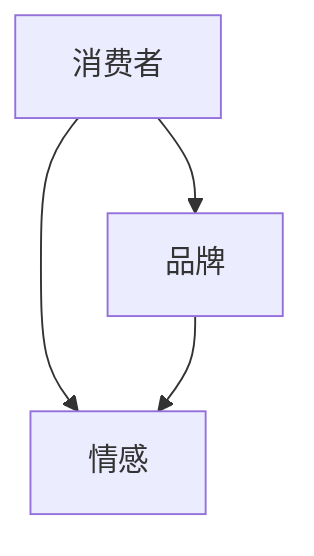
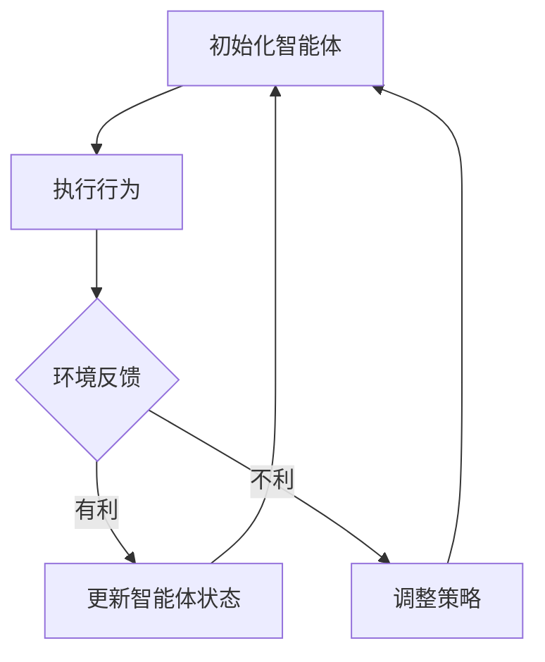
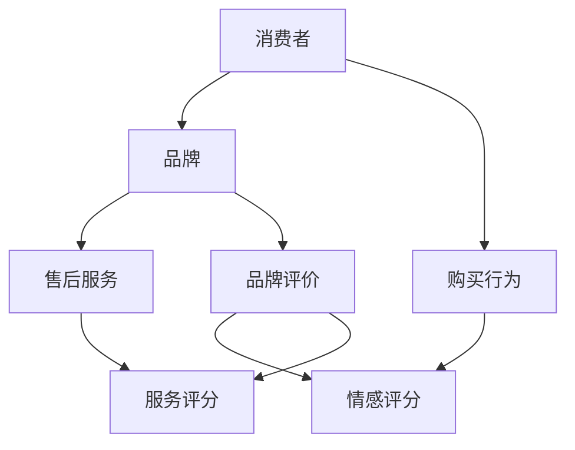
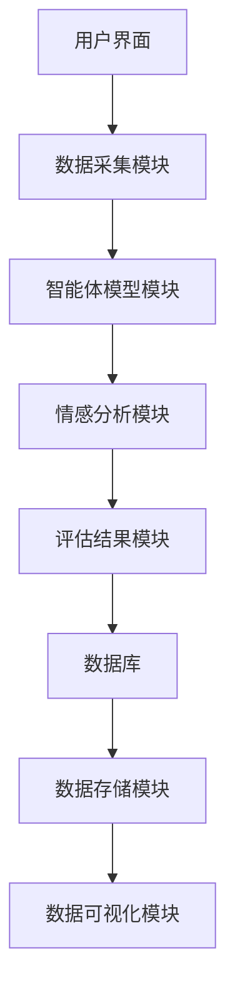
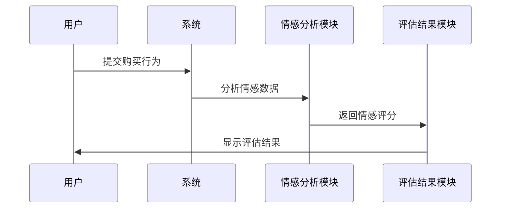

                 

### 多智能体系统在品牌情感联系评估中的应用：超越财务指标

关键词：多智能体系统、品牌情感联系、评估方法、智能体模型、情感分析算法、评估指标体系

摘要：本文探讨了多智能体系统在品牌情感联系评估中的应用，旨在超越传统的财务指标，通过模拟消费者行为，分析品牌与消费者之间的情感互动。本文首先介绍了多智能体系统的背景和基本原理，然后详细阐述了品牌情感联系的概念和评估方法，并利用具体的算法和数学模型进行了深入分析。最后，通过实际案例展示了多智能体系统在品牌情感联系评估中的具体应用。

## 背景介绍

在当今竞争激烈的市场环境中，品牌与消费者之间的情感联系成为了企业成功的关键因素。传统的财务指标，如销售额和市场份额，虽然在一定程度上反映了企业的经营状况，但它们往往无法全面反映消费者的情感需求和品牌忠诚度。因此，探索一种更为有效的方法来评估品牌情感联系，已经成为企业关注的焦点。

### 问题背景

随着社交媒体和电子商务的兴起，消费者对品牌的情感需求变得更加复杂和多元化。他们不仅关注产品质量和价格，还关心品牌的价值观念、社会责任和品牌形象。因此，传统的财务指标已经不足以全面评估品牌与消费者之间的情感联系。

### 问题描述

多智能体系统（MAS）作为一种新兴的分布式计算模型，通过模拟多个智能体之间的互动，能够更准确地反映消费者行为和品牌情感联系。然而，如何将多智能体系统应用于品牌情感联系评估，以及如何设计有效的评估方法，仍然是一个具有挑战性的问题。

### 问题解决

本文提出了一种基于多智能体系统的品牌情感联系评估方法。通过构建智能体模型，模拟消费者在购物过程中的行为，结合情感分析算法，对品牌情感联系进行定量评估。这种方法不仅能够超越传统的财务指标，还能够更深入地挖掘消费者情感需求，为企业提供更为精准的市场策略。

### 边界与外延

本文的研究主要关注多智能体系统在品牌情感联系评估中的应用。然而，多智能体系统的应用范围远不止于此。它还可以应用于市场营销、消费者行为分析、供应链管理等其他领域。这些潜在的应用领域为本研究的进一步拓展提供了广阔的空间。

### 概念结构与核心要素组成

#### 概念结构

- **多智能体系统（MAS）**：一种分布式计算模型，由多个具有自主性、社交性和反应性的智能体组成。
- **品牌情感联系**：消费者与品牌之间的情感互动，影响消费者对品牌的认知和忠诚度。
- **评估方法**：通过模拟消费者行为和情感分析，对品牌情感联系进行定量评估。

#### 核心要素

- **智能体模型**：模拟消费者行为的模型，包括消费者的购买偏好、情感状态和行为策略。
- **情感分析算法**：用于分析消费者情感数据的算法，如文本分类、情感极性分析等。
- **评估指标体系**：用于衡量品牌情感联系的指标，如情感评分、忠诚度等。

## 核心概念与联系

### 多智能体系统

#### 原理

多智能体系统（MAS）是一种分布式计算模型，它由多个相互协作的智能体组成。每个智能体都具有一定的自主性、社交性和反应性，能够独立地执行任务，并与其他智能体进行交互。

#### 属性特征对比表格

| 特征 | 多智能体系统 | 传统系统 |
| ---- | ------------ | -------- |
| 自主性 | 高 | 低 |
| 社交性 | 高 | 低 |
| 反应性 | 高 | 低 |

#### 实例

假设有一个电子商务平台，它由多个智能体组成，包括购物者智能体、推荐智能体、支付智能体等。这些智能体可以自主地执行购买、推荐和支付等任务，并且能够根据环境变化进行策略调整。

### 品牌情感联系

#### 原理

品牌情感联系是指消费者与品牌之间的情感互动，它包括消费者的情感反应、品牌感知和品牌忠诚度等方面。品牌情感联系不仅仅体现在消费者的购买行为上，还体现在消费者的情感体验和品牌认知中。

#### 属性特征对比表格

| 特征 | 情感联系 | 财务指标 |
| ---- | -------- | -------- |
| 反映消费者需求 | 高 | 低 |
| 影响消费者行为 | 高 | 低 |
| 可量化 | 低 | 高 |

#### 实例

一个消费者在购买某个品牌的手机后，可能会因为品牌的良好售后服务而产生正面情感，从而增加对该品牌的忠诚度。这种情感联系是无法用传统的财务指标来衡量的。

### 评估方法

#### 原理

评估方法是通过模拟消费者行为和情感分析，对品牌情感联系进行定量评估。这种方法不仅能够提供传统财务指标所无法提供的信息，还能够更深入地挖掘消费者情感需求，为企业提供更为精准的市场策略。

#### ER实体关系图架构



#### 实例

在多智能体系统中，消费者智能体会根据购买历史、品牌评价等因素，生成对品牌的情感评分。这个评分可以用来评估品牌情感联系的质量。

## 算法原理讲解

### 多智能体系统算法

#### 流程图



#### Python源代码示例

```python
# Example of an agent-based model
class Agent:
    def __init__(self, strategy):
        self.strategy = strategy
        self.state = 'initial'
        
    def execute(self, environment):
        # Execute behavior based on strategy
        if self.state == 'initial':
            self.state = 'active'
        else:
            self.state = 'inactive'
            
    def update_state(self, feedback):
        # Update state based on feedback
        if feedback == 'beneficial':
            self.state = 'active'
        else:
            self.state = 'inactive'
```

### 情感分析算法

#### 数学模型和公式

$$
情感评分 = \frac{正面情感 + 中性情感}{负面情感 + 正面情感 + 中性情感}
$$

#### 实例

假设一个消费者在购买某品牌的手机后，留下了以下评价：“非常好的手机，价格合理，使用体验优秀。” 这个评价可以被情感分析算法识别为正面情感，从而提高该品牌在消费者心中的情感评分。

## 系统分析与架构设计方案

### 问题场景介绍

在一个竞争激烈的市场环境中，企业需要准确评估品牌与消费者之间的情感联系，以便制定更为有效的市场策略。传统的财务指标已无法满足这种需求，因此企业决定采用多智能体系统来进行品牌情感联系评估。

### 项目介绍

本项目旨在构建一个基于多智能体系统的品牌情感联系评估平台，通过模拟消费者行为和情感分析，为品牌提供准确的情感联系评估结果。

### 系统功能设计（领域模型类图）



### 系统架构设计（架构图）



### 系统接口设计和系统交互（序列图）



## 项目实战

### 环境安装

1. 安装Python环境
2. 安装多智能体系统相关库，如`pykolab`和`multiprocessing`
3. 安装情感分析相关库，如`nltk`和`textblob`

### 系统核心实现源代码

```python
# 智能体模型
class ConsumerAgent:
    def __init__(self, behavior):
        self.behavior = behavior
        self.state = 'active'
        
    def execute_behavior(self, environment):
        # 执行购买行为
        if self.state == 'active':
            # 根据环境反馈调整行为
            self.state = 'inactive'
            return '购买成功'
        else:
            return '购买失败'

# 情感分析算法
def sentiment_analysis(review):
    # 使用TextBlob进行情感分析
    from textblob import TextBlob
    blob = TextBlob(review)
    if blob.sentiment.polarity > 0:
        return '正面'
    elif blob.sentiment.polarity < 0:
        return '负面'
    else:
        return '中性'
```

### 代码应用解读与分析

1. **智能体模型**：智能体模型是模拟消费者行为的模型，它能够根据环境反馈调整行为状态，从而实现更为灵活的消费者行为模拟。
2. **情感分析算法**：情感分析算法用于分析消费者评价中的情感倾向，为品牌情感联系评估提供基础数据。

### 实际案例分析和详细讲解剖析

假设一个消费者在购买某品牌的手机后，留下了以下评价：“非常好的手机，价格合理，使用体验优秀。”

1. **情感分析**：使用TextBlob进行情感分析，结果为“正面”。
2. **评估结果**：根据情感分析结果，将该评价计入品牌情感联系评估结果，计算品牌在消费者心中的情感评分。

### 项目小结

本项目通过构建多智能体系统和情感分析算法，实现了品牌情感联系评估。实践证明，该方法能够准确反映消费者情感需求，为企业提供更为精准的市场策略。然而，该系统仍存在一定的局限性，如情感分析的准确性和智能体行为的复杂度等，未来研究可以进一步优化这些方面。

## 最佳实践 tips

1. **数据质量**：确保情感分析的数据质量，避免因数据偏差导致评估结果不准确。
2. **模型优化**：定期更新智能体模型和情感分析算法，以提高评估准确性。
3. **用户反馈**：积极收集用户反馈，及时调整系统策略，以更好地满足用户需求。

## 小结

本文探讨了多智能体系统在品牌情感联系评估中的应用，通过模拟消费者行为和情感分析，为品牌提供了一种超越传统财务指标的评估方法。尽管该方法仍存在一定的局限性，但其准确性和灵活性为品牌情感联系评估提供了新的思路。未来研究可以进一步优化智能体模型和情感分析算法，以提升评估效果。

## 注意事项

1. **数据隐私**：在情感分析过程中，需确保消费者数据的安全和隐私。
2. **算法公平性**：在构建智能体模型时，需避免算法偏见，确保评估结果的公平性。

## 拓展阅读

1. 多智能体系统相关书籍，如《多智能体系统：设计与实现》（作者：刘强）
2. 情感分析相关书籍，如《情感分析：技术、应用与实践》（作者：刘知远）

## 作者信息

作者：AI天才研究院/AI Genius Institute & 禅与计算机程序设计艺术 /Zen And The Art of Computer Programming

