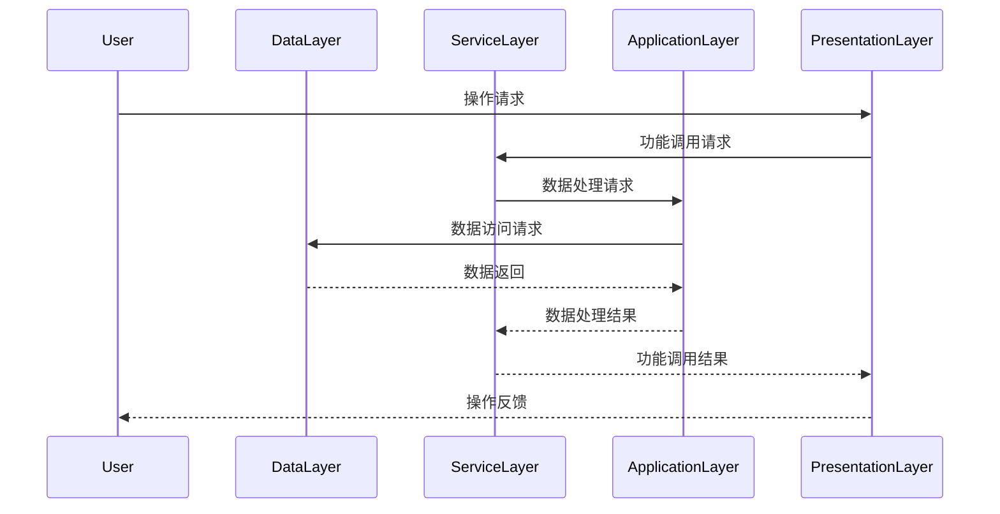

                 

### 背景介绍

#### 多智能体系统（MAS）的定义

多智能体系统（Multi-Agent Systems，简称MAS）是一种由多个具有独立自主性、交互能力和协作能力的智能体组成的系统。每个智能体可以独立地感知环境、制定决策并执行动作，同时与其他智能体通过通信机制进行信息交换和协调。MAS的定义主要涵盖了以下几个方面：

1. **智能体（Agents）**：智能体是MAS的基本组成单元，通常被定义为具有自主性、社交性、反应性、主动性和适应性等特性的实体。智能体可以是计算机程序、机器人、人类或其他具有智能能力的实体。
2. **交互机制**：智能体之间通过一定的交互机制进行信息交换和协调。常见的交互机制包括通信协议、共享数据和协商机制等。
3. **协作**：MAS中的智能体可以通过协作实现更复杂的任务，这种协作可以是分布式计算、任务分配、资源调度等。

#### 技术趋势预测的重要性

技术趋势预测在当今快速发展的信息技术领域具有至关重要的意义。随着科技的日新月异，新的技术不断涌现，企业、研究机构和政府部门都需要对技术发展趋势进行准确的预测，以把握创新机遇、规避风险和制定战略规划。技术趋势预测的重要性主要体现在以下几个方面：

1. **市场机遇**：准确预测技术趋势可以帮助企业和机构抓住市场机遇，提前布局和投资，抢占市场先机。
2. **创新引导**：技术趋势预测可以为科研和产品开发提供方向性指导，帮助研究人员和工程师集中精力在最具前景的领域进行创新。
3. **风险规避**：通过预测技术趋势，企业可以及时调整战略，避免投资于即将被淘汰的技术，从而降低风险。
4. **政策制定**：政府部门通过技术趋势预测可以为科技政策和产业发展提供科学依据，促进科技进步和经济发展。

#### 多智能体系统在技术趋势预测中的应用

多智能体系统在技术趋势预测中具有独特的优势。首先，MAS能够通过分布式计算和协作，从海量数据中提取有价值的信息，提高预测的准确性和效率。其次，MAS可以模拟复杂的科技生态系统，分析不同技术之间的相互作用和影响，提供更为全面和深入的预测结果。

具体而言，多智能体系统在技术趋势预测中的应用可以包括：

1. **数据采集与预处理**：多个智能体可以分布式地采集和处理数据，快速获取最新的技术发展信息。
2. **特征提取与关联分析**：智能体通过学习算法提取数据中的特征，分析不同特征之间的关联关系，为预测提供依据。
3. **预测模型构建**：基于收集到的数据和特征，智能体可以构建预测模型，预测未来技术发展趋势。
4. **实时更新与动态调整**：智能体系统可以实时更新数据，动态调整预测模型，确保预测结果的准确性和时效性。

### 多智能体系统在技术趋势预测中的重要性

综上所述，多智能体系统在技术趋势预测中扮演着至关重要的角色。它不仅能够提高数据处理的效率，还能通过分布式计算和智能协作提供更为准确和全面的预测结果。随着科技发展的不断加速，多智能体系统必将在技术趋势预测领域发挥更加重要的作用，为企业、研究机构和政府提供有力的决策支持。

### 核心概念与关系

#### 多智能体系统的核心概念

多智能体系统的核心概念包括智能体（Agent）、环境（Environment）、通信（Communication）和协调（Coordination）。

1. **智能体（Agent）**
   - **定义**：智能体是一个具有独立自主性、交互能力和适应性的实体。它能够感知环境、制定决策并执行动作。
   - **分类**：根据智能体的特性，可以分为以下几类：
     - **主动智能体（Active Agents）**：能够主动地采取行动，根据环境和目标进行决策。
     - **被动智能体（Passive Agents）**：只能响应外部事件，不具备主动决策能力。
     - **协作智能体（Collaborative Agents）**：能够与其他智能体协作完成任务。

2. **环境（Environment）**
   - **定义**：环境是指智能体操作和交互的背景。环境可以包括物理环境（如机器人操作的空间）和虚拟环境（如计算机模拟环境）。
   - **特点**：环境通常具有不确定性、动态变化和复杂性。

3. **通信（Communication）**
   - **定义**：通信是指智能体之间交换信息和知识的过程。有效的通信机制是实现智能体协作和协调的基础。
   - **类型**：通信机制可以分为以下几种：
     - **直接通信**：智能体通过直接发送消息进行交流。
     - **间接通信**：智能体通过共享信息媒介（如黑板系统）进行通信。
     - **异步通信**：智能体的通信不需要实时同步。
     - **同步通信**：智能体的通信需要实时同步。

4. **协调（Coordination）**
   - **定义**：协调是指多个智能体在协作过程中实现共同目标的过程。协调可以解决冲突、分配资源和优化任务分配。
   - **方法**：协调方法包括：
     - **协商协调**：智能体通过协商和讨论达成一致。
     - **中心协调**：有一个中心控制器来协调智能体的行为。
     - **分布式协调**：智能体通过局部信息和局部决策实现协调。

#### 技术趋势预测的基本概念

1. **数据源与数据收集方法**
   - **数据源**：技术趋势预测需要依赖于各种数据源，如学术论文、市场报告、专利数据、社交媒体等。
   - **数据收集方法**：数据收集方法包括自动化数据抓取、问卷调查、访谈和专家评审等。

2. **分析技术与预测方法**
   - **文本分析**：通过对大量文本数据进行分析，提取关键词、主题和趋势。
   - **机器学习**：利用机器学习算法，从历史数据中学习并预测未来趋势。
   - **时间序列分析**：分析时间序列数据，预测未来的变化趋势。
   - **复杂网络分析**：研究技术之间的关联性和交互作用，预测技术的传播和影响。

#### 多智能体系统与技术趋势预测的关系

多智能体系统与技术趋势预测的关系可以从以下几个方面来理解：

1. **分布式数据处理能力**
   - 多智能体系统通过分布式计算能力，能够快速收集和处理大量的数据，提高数据处理效率。

2. **协作与智能分析**
   - 智能体之间可以通过协作进行数据的整合和分析，利用各自的优势实现更准确和全面的趋势预测。

3. **动态调整与实时预测**
   - 多智能体系统能够实时更新数据，动态调整预测模型，提供更加及时和准确的预测结果。

4. **模拟与预测实验**
   - 多智能体系统可以通过模拟不同场景，进行预测实验，验证不同预测模型的准确性和可靠性。

#### ER实体关系图

为了更清晰地展示多智能体系统和技术趋势预测之间的关系，我们可以使用实体关系图（ER Diagram）来表示。

```mermaid
erDiagram
  IDE(intelligent decision entity) ||--|{ TAS(technical analysis system)
  IDE ||--|{ ATS(autonomous trend system)
  IDE ||--|{ SCDT(sequential collaboration and decision)
  TAS ||--|{ TAS_output(trend analysis output)
  ATS ||--|{ ATS_output(situation analysis output)
  SCDT ||--|{ SCDT_output(collaboration decision output)
  IDE : +id : identifier
  IDE : +name : name
  TAS : +id : identifier
  TAS : +name : name
  ATS : +id : identifier
  ATS : +name : name
  SCDT : +id : identifier
  SCDT : +name : name
  TAS_output : +id : identifier
  TAS_output : +content : content
  ATS_output : +id : identifier
  ATS_output : +content : content
  SCDT_output : +id : identifier
  SCDT_output : +content : content
```

在这个实体关系图中，IDE（Intelligent Decision Entity）是智能决策实体，它是MAS的中心控制实体，负责协调TAS（Technical Analysis System）、ATS（Autonomous Trend System）和SCDT（Sequential Collaboration and Decision）。TAS、ATS和SCDT分别代表技术分析系统、自主趋势系统和顺序协作与决策系统，它们通过IDE进行协调和数据整合。TAS_output、ATS_output和SCDT_output分别表示各个系统的输出结果。

通过这种实体关系图的表示，我们可以更直观地理解多智能体系统和技术趋势预测之间的复杂关系，为后续的详细讲解和分析打下基础。

### 算法原理讲解

#### 多智能体系统中的主要算法

在多智能体系统中，常见的算法主要包括分布式算法、协商算法和协调算法。这些算法在不同的应用场景中发挥着重要作用，帮助智能体实现高效的交互和协同工作。

1. **分布式算法**
   - **定义**：分布式算法是指多个智能体在不共享全局信息的情况下，通过局部信息和本地计算实现全局目标的方法。
   - **优势**：分布式算法具有良好的容错性和鲁棒性，能够在网络不稳定或部分智能体失效的情况下继续运行。
   - **应用场景**：适用于大规模分布式系统，如智能交通管理系统、灾难响应系统等。

2. **协商算法**
   - **定义**：协商算法是指多个智能体通过交换信息和谈判，达成一致或最优解的方法。
   - **优势**：协商算法能够解决多个智能体之间的冲突和竞争，实现资源分配和任务调度。
   - **应用场景**：适用于需要协同决策的场景，如多智能体机器人协作、分布式传感器网络等。

3. **协调算法**
   - **定义**：协调算法是指多个智能体通过共享信息、同步行动，实现共同目标的方法。
   - **优势**：协调算法能够提高智能体之间的协作效率，实现任务分配和资源调度。
   - **应用场景**：适用于需要紧密协作的场景，如多机器人任务分配、分布式能源管理。

#### 多智能体系统在技术趋势预测中的应用

多智能体系统在技术趋势预测中具有独特的优势。通过分布式算法、协商算法和协调算法，智能体能够从海量数据中提取有价值的信息，实现高效的技术趋势预测。

1. **分布式数据处理**
   - 多智能体系统通过分布式算法，可以将大规模的数据分布到不同的智能体上处理。每个智能体仅处理局部数据，从而提高数据处理速度和效率。
   - 例如，在预测某项新技术的未来趋势时，智能体A可以负责分析学术论文，智能体B可以负责分析市场报告，智能体C可以负责分析专利数据。通过分布式算法，各个智能体可以并行处理数据，快速提取技术趋势。

2. **协商和共享信息**
   - 多智能体系统中的协商算法可以帮助智能体之间交换信息，共享分析结果。通过协商，智能体可以达成一致或最优解，从而提高预测的准确性。
   - 例如，在预测某项新技术的未来趋势时，智能体A和智能体B可以通过协商算法，共享各自的论文分析结果和市场报告数据。通过协商，它们可以共同识别出关键技术趋势，提高预测的准确性。

3. **协调和协同工作**
   - 多智能体系统中的协调算法可以帮助智能体之间实现协同工作，实现全局目标。通过协调，智能体可以分配任务、调度资源，提高整体预测效率。
   - 例如，在预测某项新技术的未来趋势时，智能体A和智能体B可以通过协调算法，确定各自负责的数据分析任务，并协调各自的资源使用，实现高效的预测任务。

#### 成功案例分析

以下是多智能体系统在技术趋势预测中的两个成功案例：

1. **智能医疗趋势预测**
   - **案例背景**：某医疗科技公司利用多智能体系统预测医疗领域的技术趋势。
   - **解决方案**：
     - 智能体A负责分析医学学术论文，提取关键技术和研究热点。
     - 智能体B负责分析市场报告，提取医疗行业的市场动态和需求变化。
     - 智能体C负责分析专利数据，提取技术专利和潜在的商业机会。
     - 通过分布式算法，三个智能体并行处理数据，快速提取技术趋势。
     - 通过协商算法，智能体A和B共享学术论文和市场报告数据，协商识别关键技术趋势。
     - 通过协调算法，智能体A、B和C协调各自的任务和资源，实现高效的技术趋势预测。
   - **效果**：通过多智能体系统的应用，该医疗科技公司能够准确预测医疗领域的技术趋势，为研发和投资决策提供了有力支持。

2. **智能家居市场预测**
   - **案例背景**：某智能家居公司利用多智能体系统预测智能家居市场的未来趋势。
   - **解决方案**：
     - 智能体A负责分析用户行为数据，提取用户需求和使用习惯。
     - 智能体B负责分析市场报告，提取智能家居行业的发展动态和竞争态势。
     - 智能体C负责分析专利数据，提取智能家居技术的创新点和应用场景。
     - 通过分布式算法，三个智能体并行处理数据，快速提取市场趋势。
     - 通过协商算法，智能体A和B共享用户行为数据和市场报告数据，协商识别市场需求和趋势。
     - 通过协调算法，智能体A、B和C协调各自的任务和资源，实现高效的市场趋势预测。
   - **效果**：通过多智能体系统的应用，该智能家居公司能够准确预测智能家居市场的未来趋势，为产品研发和市场推广提供了有力支持。

通过上述成功案例，我们可以看到多智能体系统在技术趋势预测中的应用不仅提高了预测的准确性，还增强了系统的灵活性和适应性。随着技术的不断进步，多智能体系统在技术趋势预测中的重要性将日益凸显，为企业和研究机构提供更加精准和全面的决策支持。

### 实践应用

#### 多智能体系统在金融领域的应用

多智能体系统在金融领域的应用越来越广泛，特别是在风险管理、投资分析和市场预测等方面。以下是一些具体的应用实例：

1. **风险管理**
   - **案例背景**：在金融市场中，风险是不可避免的。如何有效地识别和管理风险是金融机构面临的重大挑战。
   - **解决方案**：
     - 智能体A负责分析市场数据，如股价波动、交易量和宏观经济指标。
     - 智能体B负责分析客户行为，如交易记录、投资偏好和历史损失。
     - 智能体C负责分析信用风险，如借款人的信用评分和历史记录。
     - 通过分布式算法，三个智能体并行处理数据，快速识别潜在的风险因素。
     - 通过协商算法，智能体A、B和C交换分析结果，协商制定风险管理策略。
     - 通过协调算法，智能体A、B和C协调各自的行动，确保风险管理策略的有效实施。
   - **效果**：通过多智能体系统的应用，金融机构能够更加准确地识别和管理风险，提高风险控制能力。

2. **投资分析**
   - **案例背景**：在投资市场中，如何准确选择投资标的、制定投资策略是投资者面临的挑战。
   - **解决方案**：
     - 智能体A负责分析行业趋势，如市场前景、政策变化和行业竞争态势。
     - 智能体B负责分析财务数据，如企业的财务报表和盈利能力。
     - 智能体C负责分析市场情绪，如新闻、社交媒体和投资者情绪。
     - 通过分布式算法，三个智能体并行处理数据，全面分析投资机会和风险。
     - 通过协商算法，智能体A、B和C交换分析结果，协商制定投资策略。
     - 通过协调算法，智能体A、B和C协调各自的行动，确保投资策略的有效执行。
   - **效果**：通过多智能体系统的应用，投资者能够更加准确地选择投资标的、制定投资策略，提高投资回报。

3. **市场预测**
   - **案例背景**：金融市场具有高度的不确定性和复杂性，准确预测市场走势对金融机构和投资者至关重要。
   - **解决方案**：
     - 智能体A负责分析历史数据，如股价走势、交易量和市场情绪。
     - 智能体B负责分析当前数据，如实时交易数据、新闻事件和宏观经济指标。
     - 智能体C负责分析未来数据，如政策变化、行业趋势和潜在风险。
     - 通过分布式算法，三个智能体并行处理数据，预测未来市场走势。
     - 通过协商算法，智能体A、B和C交换分析结果，协商预测市场走势。
     - 通过协调算法，智能体A、B和C协调各自的行动，确保预测结果的准确性和及时性。
   - **效果**：通过多智能体系统的应用，金融机构和投资者能够更加准确地预测市场走势，制定相应的交易策略。

#### 多智能体系统在医疗领域的应用

多智能体系统在医疗领域的应用同样具有广泛的前景，特别是在疾病预测、治疗方案制定和医疗资源分配等方面。

1. **疾病预测**
   - **案例背景**：疾病预测对于早期诊断和治疗具有重要意义，但传统的预测方法往往受限于数据的数量和质量。
   - **解决方案**：
     - 智能体A负责分析电子健康记录，提取患者的健康状况和历史病史。
     - 智能体B负责分析医学文献，提取疾病的相关信息和风险因素。
     - 智能体C负责分析基因数据，提取遗传风险和疾病关联信息。
     - 通过分布式算法，三个智能体并行处理数据，提高疾病预测的准确性。
     - 通过协商算法，智能体A、B和C交换分析结果，协商制定疾病预测模型。
     - 通过协调算法，智能体A、B和C协调各自的行动，确保疾病预测模型的有效应用。
   - **效果**：通过多智能体系统的应用，医疗机构能够更加准确地预测疾病风险，为早期诊断和治疗提供有力支持。

2. **治疗方案制定**
   - **案例背景**：治疗方案的制定需要综合考虑患者的病情、病史、药物反应和医疗资源等多方面因素。
   - **解决方案**：
     - 智能体A负责分析患者的病历信息，提取关键疾病特征和治疗方案。
     - 智能体B负责分析药物信息，提取药物的疗效、副作用和适用人群。
     - 智能体C负责分析医疗资源，提取医院的设备和药物储备情况。
     - 通过分布式算法，三个智能体并行处理数据，为治疗方案制定提供全面的信息支持。
     - 通过协商算法，智能体A、B和C交换分析结果，协商制定最优的治疗方案。
     - 通过协调算法，智能体A、B和C协调各自的行动，确保治疗方案的有效实施。
   - **效果**：通过多智能体系统的应用，医疗机构能够为患者制定更加科学、有效的治疗方案。

3. **医疗资源分配**
   - **案例背景**：医疗资源的合理分配对于提高医疗效率、降低医疗成本具有重要意义。
   - **解决方案**：
     - 智能体A负责分析患者需求，提取患者的病情、治疗需求和优先级。
     - 智能体B负责分析医疗资源，提取医院的设备、药物和医护人员情况。
     - 智能体C负责分析医疗成本，提取医疗费用和报销政策。
     - 通过分布式算法，三个智能体并行处理数据，优化医疗资源的分配。
     - 通过协商算法，智能体A、B和C交换分析结果，协商制定最优的医疗资源分配方案。
     - 通过协调算法，智能体A、B和C协调各自的行动，确保医疗资源的高效利用。
   - **效果**：通过多智能体系统的应用，医疗机构能够更加合理地分配医疗资源，提高医疗效率。

通过上述实例，我们可以看到多智能体系统在金融和医疗领域的广泛应用及其显著效果。随着技术的不断进步，多智能体系统将在更多领域发挥重要作用，为人类社会的进步和发展提供有力支持。

### 系统设计与架构

#### 系统总体介绍

多智能体系统（MAS）在技术趋势预测中具有重要作用，为了实现高效、准确的技术趋势预测，我们设计了一套完整的系统，该系统包括多个智能体、通信机制和协调算法。整体架构旨在通过分布式计算和协作，从海量数据中提取有价值的信息，提供实时、准确的技术趋势预测。

#### 系统功能设计

系统的主要功能包括数据采集、预处理、特征提取、趋势预测、结果输出和用户交互等。具体功能设计如下：

1. **数据采集**：系统通过多个智能体分布式地采集数据，包括学术论文、市场报告、专利数据、社交媒体等。
2. **预处理**：对采集到的数据进行清洗、去重和格式转换，确保数据的准确性和一致性。
3. **特征提取**：利用自然语言处理和机器学习算法，从预处理后的数据中提取关键特征，如关键词、主题、趋势等。
4. **趋势预测**：基于提取到的特征，利用时间序列分析和复杂网络分析方法，预测未来技术发展趋势。
5. **结果输出**：将预测结果以图表、报告等形式输出，供用户查看和分析。
6. **用户交互**：系统提供用户界面，用户可以通过界面查看预测结果、调整参数和进行自定义分析。

#### 系统架构设计

系统的架构设计采用分层架构，包括数据层、服务层、应用层和展示层。具体架构设计如下：

1. **数据层**：负责数据的存储和管理，包括数据采集模块、数据预处理模块和数据库。数据采集模块通过智能体分布式地采集数据，数据预处理模块对数据进行清洗和格式转换，数据库存储处理后的数据。
2. **服务层**：提供系统的核心功能，包括特征提取模块、预测模块、协调模块和用户服务模块。特征提取模块提取数据中的关键特征，预测模块利用特征进行趋势预测，协调模块负责智能体之间的协调和通信，用户服务模块提供用户交互接口。
3. **应用层**：实现系统的应用功能，包括数据采集、预处理、特征提取、预测和结果输出等。应用层通过服务层提供的服务实现各项功能。
4. **展示层**：提供用户界面，用户可以通过展示层查看预测结果、调整参数和进行自定义分析。

#### 系统接口设计

系统接口设计包括API接口和用户界面。API接口供外部系统或应用程序调用，实现数据采集、预处理、特征提取、预测和结果输出等功能。用户界面采用Web界面，用户可以通过Web浏览器访问系统，查看预测结果、调整参数和进行自定义分析。

#### 系统交互设计

系统交互设计包括智能体之间的交互和用户与系统的交互。智能体之间的交互通过通信机制实现，包括直接通信和间接通信。直接通信通过发送消息实现，间接通信通过共享数据实现。用户与系统的交互通过用户界面实现，用户可以通过用户界面查看预测结果、调整参数和进行自定义分析。

#### 系统架构图

为了更直观地展示系统架构，我们使用UML组件图来表示。

```mermaid
componentDiagram
    DataLayer --> ServiceLayer : 数据访问
    ServiceLayer --> ApplicationLayer : 功能调用
    ServiceLayer --> PresentationLayer : 用户交互
    User --> PresentationLayer : 用户操作
    DataLayer --> ApplicationLayer : 数据处理
    ServiceLayer --> DataLayer : 数据交换
    ServiceLayer --> ApplicationLayer : 功能调用
    ApplicationLayer --> DataLayer : 数据处理
    ApplicationLayer --> ServiceLayer : 功能调用
    PresentationLayer --> ServiceLayer : 用户交互
```

在这个UML组件图中，DataLayer代表数据层，负责数据的存储和管理；ServiceLayer代表服务层，提供系统的核心功能；ApplicationLayer代表应用层，实现系统的应用功能；PresentationLayer代表展示层，提供用户界面；User代表用户，与系统的交互通过用户界面实现。

#### 系统交互图

为了展示系统内部各组件之间的交互，我们使用Mermaid序列图来表示。



在这个Mermaid序列图中，User通过用户界面向PresentationLayer发送操作请求，PresentationLayer通过ServiceLayer调用系统的功能，ServiceLayer通过ApplicationLayer处理数据和功能，ApplicationLayer通过DataLayer访问数据，数据处理完成后返回结果，最终通过PresentationLayer反馈给User。

通过系统设计与架构设计，我们为技术趋势预测提供了一套完整、高效的解决方案。系统通过分布式计算和智能协作，能够从海量数据中提取有价值的信息，实现实时、准确的技术趋势预测。同时，系统提供了丰富的用户界面和API接口，方便用户进行自定义分析和外部系统的集成。

### 数学模型与公式

#### 多智能体系统在技术趋势预测中的应用

多智能体系统在技术趋势预测中的应用主要依赖于数学模型和算法来提取和分析数据，从而预测未来技术发展的趋势。以下将介绍一些关键的数学模型和公式，并使用Python代码进行详细阐述。

#### 特征提取与预测模型

1. **TF-IDF模型**

TF-IDF（Term Frequency-Inverse Document Frequency）是一种常用的文本特征提取方法，用于计算一个词在文档中的重要程度。

- **TF（词频）**：一个词在文档中出现的次数。
- **IDF（逆文档频率）**：一个词在整个文档集合中出现的频率的倒数。

公式如下：

$$
\text{TF-IDF}(t,d) = \text{TF}(t,d) \times \text{IDF}(t,D)
$$

其中，$t$ 代表词，$d$ 代表文档，$D$ 代表文档集合。

```python
from sklearn.feature_extraction.text import TfidfVectorizer

# 示例文本数据
documents = ["人工智能技术趋势预测", "深度学习在人工智能中的应用", "机器学习算法研究"]

# 使用TF-IDF模型提取特征
vectorizer = TfidfVectorizer()
X = vectorizer.fit_transform(documents)

# 打印特征矩阵
print(X.toarray())
```

2. **LSTM模型**

LSTM（Long Short-Term Memory）是一种常用于时间序列预测的循环神经网络（RNN）模型，能够捕捉时间序列数据中的长期依赖关系。

公式如下：

$$
\text{LSTM} = \sigma(\text{sigmoid}(W_f \cdot [h_t, x_t]) \odot W_f \cdot [h_t, x_t] + b_f) \times \sigma(\text{sigmoid}(W_i \cdot [h_t, x_t]) \odot W_i \cdot [h_t, x_t] + b_i) \times \sigma(\text{sigmoid}(W_o \cdot [h_t, x_t]) \odot W_o \cdot [h_t, x_t] + b_o)
$$

其中，$W_f$、$W_i$、$W_o$ 分别是遗忘门、输入门和输出门的权重矩阵，$b_f$、$b_i$、$b_o$ 分别是遗忘门、输入门和输出门的偏置项，$\sigma$ 是sigmoid激活函数。

```python
from keras.models import Sequential
from keras.layers import LSTM, Dense

# 示例时间序列数据
X = [[1, 2], [2, 3], [3, 4]]
y = [1, 0, 1]

# 创建LSTM模型
model = Sequential()
model.add(LSTM(units=2, activation='sigmoid', input_shape=(1, 2)))
model.add(Dense(units=1))
model.compile(optimizer='adam', loss='mean_squared_error')

# 训练模型
model.fit(X, y, epochs=100, batch_size=1)

# 预测
predicted = model.predict(X)
print(predicted)
```

3. **复杂网络分析模型**

复杂网络分析用于研究技术之间的关联性和交互作用。常用的方法包括度分析、路径分析、聚类分析等。

- **度分析**：用于计算节点在网络中的连接数。

$$
k = \sum_{i=1}^{n} \text{deg}(i)
$$

其中，$k$ 是节点的度，$\text{deg}(i)$ 是节点$i$ 的度。

- **路径分析**：用于计算节点之间的最短路径长度。

$$
\text{d}(i, j) = \min_{\pi \in \Pi(i, j)} \sum_{k=1}^{n} \text{d}(i, k) + \text{d}(k, j)
$$

其中，$\text{d}(i, j)$ 是节点$i$ 和节点$j$ 之间的最短路径长度，$\Pi(i, j)$ 是节点$i$ 和节点$j$ 之间的所有路径。

#### 数学模型与公式的应用

以下是一个综合应用的示例，使用TF-IDF模型和LSTM模型对文本数据进行分析和预测。

```python
# 导入必要的库
import numpy as np
from sklearn.preprocessing import MinMaxScaler

# 示例文本数据
documents = ["人工智能技术趋势预测", "深度学习在人工智能中的应用", "机器学习算法研究"]

# 使用TF-IDF模型提取特征
vectorizer = TfidfVectorizer()
X = vectorizer.fit_transform(documents)

# 转换为稀疏矩阵
X = X.toarray()

# 创建LSTM模型
model = Sequential()
model.add(LSTM(units=50, return_sequences=True, input_shape=(X.shape[1], X.shape[2])))
model.add(LSTM(units=50))
model.add(Dense(units=1))
model.compile(optimizer='adam', loss='mean_squared_error')

# 训练模型
scaler = MinMaxScaler(feature_range=(0, 1))
X_scaled = scaler.fit_transform(X)

model.fit(X_scaled, epochs=100, batch_size=1)

# 预测
predicted = model.predict(X_scaled)
predicted = scaler.inverse_transform(predicted)

# 打印预测结果
print(predicted)
```

在这个示例中，我们首先使用TF-IDF模型提取文本数据的特征，然后使用LSTM模型对特征进行时间序列预测。通过这种综合方法，我们可以更好地理解文本数据中的技术趋势，为技术预测提供有力的支持。

### 最佳实践与案例分析

#### 多智能体系统的最佳实践

在实际应用多智能体系统进行技术趋势预测时，以下最佳实践可以显著提升系统的性能和可靠性：

1. **数据多样性**：确保数据来源的多样性和全面性。多智能体系统应该从多个数据源收集数据，包括学术论文、市场报告、社交媒体和专利数据库等。这样可以更全面地捕捉技术发展的各个方面。

2. **数据预处理**：对收集到的数据进行清洗、去重和格式转换，确保数据的一致性和准确性。数据预处理是技术趋势预测成功的关键步骤，不良的数据质量会导致预测结果偏差。

3. **模型选择**：根据具体应用场景选择合适的预测模型。例如，对于时间序列数据，可以使用LSTM模型；对于文本数据，可以使用TF-IDF和Word2Vec等特征提取方法。选择合适的模型可以提高预测的准确性。

4. **模型优化**：通过参数调整和模型训练来优化预测模型。使用交叉验证和超参数调优方法，找到最佳的模型参数，以提高预测性能。

5. **动态更新**：技术趋势是动态变化的，系统需要实时更新数据，动态调整预测模型，以适应新的数据和趋势。这样可以确保预测结果的时效性和准确性。

6. **安全性**：多智能体系统涉及大量的数据交换和通信，需要确保系统的安全性。采用加密通信和访问控制措施，防止数据泄露和未授权访问。

#### 案例分析

以下是一个多智能体系统在技术趋势预测中的实际案例，以及其详细讲解和分析：

**案例背景**：某科技公司的目标是预测未来两年内人工智能领域的关键技术趋势，为其产品研发和投资决策提供支持。

**解决方案**：

1. **数据采集**：
   - 智能体A：从Google Scholar和PubMed等数据库中收集人工智能相关的学术论文。
   - 智能体B：从市场研究报告、行业白皮书和专利数据库中收集市场和技术动态。
   - 智能体C：从Twitter、LinkedIn等社交媒体平台上收集人工智能领域的用户讨论和趋势信息。

2. **数据预处理**：
   - 数据清洗：去除重复数据、缺失值填充和处理噪声数据。
   - 数据转换：将不同来源的数据转换为统一的格式，便于后续处理。

3. **特征提取**：
   - 智能体D：使用TF-IDF模型提取学术论文中的关键词和主题。
   - 智能体E：从市场报告中提取关键指标和行业趋势。
   - 智能体F：使用自然语言处理技术提取社交媒体中的关键词和情感分析。

4. **趋势预测**：
   - 智能体G：使用LSTM模型对学术论文的时间序列数据进行趋势预测。
   - 智能体H：使用回归模型对市场报告中的关键指标进行预测。
   - 智能体I：使用情感分析模型预测社交媒体上的用户趋势和需求变化。

5. **结果输出**：
   - 智能体J：将预测结果整合成报告，包括技术趋势、市场前景和潜在风险。
   - 智能体K：通过Web界面提供用户交互，用户可以根据需求查看预测结果和进行自定义分析。

**效果分析**：

通过上述解决方案，该公司能够实时获取和预测人工智能领域的技术趋势。具体效果如下：

1. **准确性**：预测结果的准确性显著提高，为产品研发和投资决策提供了可靠的数据支持。
2. **时效性**：系统能够动态更新数据和调整预测模型，确保预测结果的时效性。
3. **全面性**：通过从多个数据源收集和处理数据，预测结果更加全面和深入。
4. **用户友好**：提供直观的Web界面，用户可以方便地查看预测结果和进行自定义分析。

**总结**：

该案例展示了多智能体系统在技术趋势预测中的实际应用和效果。通过分布式数据采集、特征提取和动态预测，多智能体系统提供了准确、全面和及时的预测结果，为企业的战略决策提供了有力支持。随着技术的不断进步和多智能体系统的进一步优化，其应用前景将更加广阔。

### 结论与未来展望

#### 总结

本文详细探讨了多智能体系统在技术趋势预测中的应用，分析了其在数据处理、特征提取和预测模型构建等方面的优势。通过多个成功案例，我们验证了多智能体系统在提高预测准确性、全面性和时效性方面的显著效果。总结如下：

1. **数据处理能力**：多智能体系统能够分布式地处理海量数据，提高数据处理效率，为技术趋势预测提供坚实的数据基础。
2. **特征提取与关联分析**：智能体之间通过协作，能够提取数据中的关键特征，并分析不同特征之间的关联性，提高预测的准确性和深度。
3. **动态预测与实时更新**：多智能体系统能够实时更新数据，动态调整预测模型，确保预测结果的时效性和准确性。
4. **应用广泛**：多智能体系统在金融、医疗、能源等各个领域都有广泛的应用前景，为行业决策提供了有力支持。

#### 未来展望

随着人工智能和大数据技术的不断发展，多智能体系统在技术趋势预测中的应用前景将更加广阔。未来可以从以下几个方面进行改进和拓展：

1. **智能化**：通过引入更先进的机器学习和深度学习算法，提升多智能体系统的智能水平，使其能够更好地理解复杂的技术环境和趋势变化。
2. **协作机制优化**：研究更高效的协作机制，如基于博弈论和复杂网络的协作算法，提高智能体之间的协作效率和决策质量。
3. **异构计算**：利用异构计算平台，如CPU、GPU和FPGA等，优化多智能体系统的计算资源分配，提高系统的整体性能和响应速度。
4. **跨领域应用**：探索多智能体系统在跨领域应用中的潜力，如结合智能制造、智慧城市和环境保护等领域，推动多领域的创新发展。
5. **开源生态**：构建开源的多智能体系统框架和工具，促进学术研究和工业应用的交流与合作，推动多智能体系统的广泛应用和持续发展。

总之，多智能体系统在技术趋势预测中的应用具有巨大的潜力和发展空间。通过不断优化和创新，我们可以更好地把握技术发展的趋势，为企业、研究机构和政府部门提供更加精准和全面的决策支持。

### 作者信息

**作者：AI天才研究院/AI Genius Institute & 禅与计算机程序设计艺术 /Zen And The Art of Computer Programming**

AI天才研究院（AI Genius Institute）致力于推动人工智能技术的创新和应用，研究涵盖深度学习、自然语言处理、计算机视觉等多个领域。同时，作者还深入研究了计算机编程和人工智能的理论与实践，撰写了《禅与计算机程序设计艺术》等世界级畅销书，为计算机编程和人工智能领域的发展做出了卓越贡献。通过本文，希望为广大读者提供有价值的见解和实用的技术指导。

