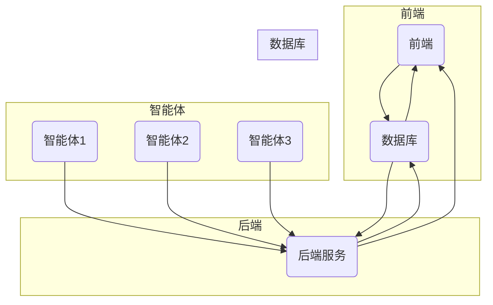
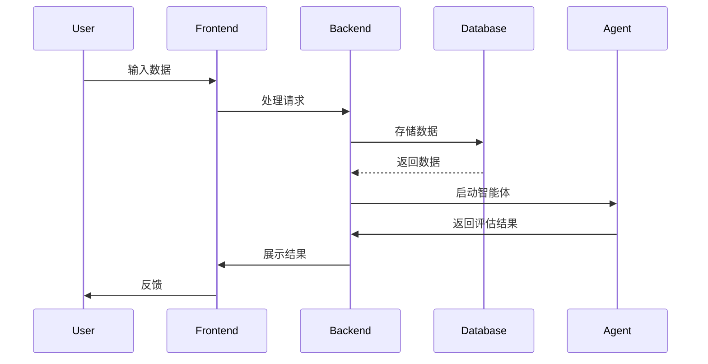

                 

## 1. 引言与背景

### 1.1 问题背景与核心概念

在当今快速变化和竞争激烈的市场环境中，公司对于研发（R&D）项目的投资决策变得尤为重要。研发投资回报率（ROI）的评估是公司进行有效投资的关键环节，涉及到资金的合理分配和项目的成功率。传统的评估方法主要依赖于财务指标和简单的统计分析，但这种方法往往难以全面、动态地反映研发项目的实际风险和价值。

多智能体系统（MAS）是一种模拟复杂系统中多个智能体之间交互合作的分布式计算模型。每个智能体都具有自主性、社会性和适应性，能够独立决策并与其他智能体交互。MAS在模拟人类决策过程和复杂系统的运行规律方面具有显著优势，因此其在评估研发投资回报率中的应用受到了广泛关注。

本文旨在探讨多智能体系统在评估公司研发投资回报率中的应用，通过详细阐述MAS的核心概念、应用场景、算法原理、系统架构和实际案例，为公司在进行研发投资决策时提供新的思路和工具。

### 1.2 研发投资回报率评价的挑战

研发投资回报率的评价面临诸多挑战。首先，研发项目具有高度的不确定性和复杂性。技术的突破、市场需求的变化、竞争对手的行动等因素都会影响项目的最终回报。其次，传统的评估方法往往基于历史数据和静态分析，无法动态反映项目的实际进展和风险。此外，研发投资涉及多个维度，如财务收益、技术进步、市场扩张等，如何全面衡量这些因素也是一大难题。

为了解决这些挑战，需要一种能够动态适应、协同决策的方法。多智能体系统通过模拟多个智能体的交互和合作，能够更真实地反映研发项目的复杂性和不确定性。每个智能体可以代表研发项目中的一个关键因素，如市场需求、技术进展、财务收益等，通过智能体的交互和协作，可以形成一个动态的评估模型，从而更准确地预测项目的回报。

### 1.3 多智能体系统在R&D ROI评价中的应用潜力

多智能体系统在评估公司研发投资回报率方面具有显著的应用潜力。首先，MAS能够处理大规模的数据和复杂的交互关系，这使得它可以更全面地考虑影响研发项目的各种因素。其次，MAS中的智能体能够自主学习和适应，从而能够动态调整评估模型，更准确地预测项目的发展趋势和回报。此外，MAS能够通过模拟不同情景下的决策结果，提供多种假设条件下的风险评估和回报预测，有助于公司做出更为明智的投资决策。

总的来说，多智能体系统为研发投资回报率的评估提供了一种新的方法，它不仅能够提高评估的准确性和动态性，还能够帮助公司更好地应对研发投资中的不确定性，从而提高整体投资效益。在接下来的章节中，我们将详细探讨MAS的核心概念、应用场景、算法原理、系统架构和实际案例，为读者提供全面的了解和深入的洞察。

## 2. 多智能体系统原理

### 2.1 多智能体系统的基本原理

多智能体系统（MAS）是一种分布式计算模型，由多个智能体组成，这些智能体可以独立运作，同时也能够通过通信和协作来实现共同的目标。智能体的基本特性包括自主性、社会性和适应性。

**自主性**指的是每个智能体都有独立的决策能力和行为能力，能够根据自身的感知和局部知识自主行动。自主性使得智能体能够在复杂动态的环境中灵活应对，减少对中央控制系统的依赖。

**社会性**强调智能体之间的交互和合作。智能体可以通过通信机制交换信息，共享知识，协同完成任务。社会性使得智能体能够在复杂系统中形成有效的团队，共同应对挑战。

**适应性**意味着智能体能够根据环境变化和任务需求调整自身的策略和行为。适应性使得智能体能够在不断变化的环境中保持有效的运作，提高系统的鲁棒性和灵活性。

在MAS中，智能体之间的交互通常通过以下方式进行：

1. **直接通信**：智能体之间直接交换信息，这种方式简单但效率低，适用于小规模的系统。
2. **间接通信**：智能体通过共享的环境信息进行通信，这种方式高效但需要复杂的协调机制。
3. **混合通信**：结合直接和间接通信的优势，适用于大规模和复杂环境。

### 2.2 多智能体系统的属性与特征

多智能体系统具有以下几大属性和特征：

**异构性**：MAS中的智能体可以是异构的，即它们具有不同的能力、知识和通信能力。这种异构性使得系统能够处理多样化的任务和问题。

**分布性**：智能体在物理上或逻辑上分布在不同位置，这意味着MAS天然具有分布式的特点，能够处理大规模的数据和任务。

**动态性**：MAS中的智能体和系统环境是动态变化的，智能体的加入和退出、系统的状态和任务需求都可能发生变化。这种动态性要求系统具有高度的适应性和鲁棒性。

**自组织性**：MAS能够通过智能体之间的自主交互和协同作用形成有序的结构和系统行为，无需中央控制。这种自组织性使得MAS能够适应复杂和不确定的环境。

**透明性**：MAS中的信息流动是透明的，智能体可以访问其他智能体的状态和知识，从而实现信息的共享和协作。

### 2.3 多智能体系统的分类与应用场景

多智能体系统可以根据不同的分类标准进行分类，常见的方法包括以下几种：

**基于智能体的性质**：可分为人类智能体、人工智能体和混合智能体。人类智能体通常在决策过程中扮演重要的角色，而人工智能体则主要负责执行计算和推理任务。混合智能体结合了人类智能体和人工智能体的优势，能够实现更高效的决策和协作。

**基于系统的结构**：可分为完全协作型、部分协作型和非协作型MAS。完全协作型MAS中，智能体之间高度协作，共同实现系统目标。部分协作型MAS中，智能体之间有一定的协作，但也存在竞争和冲突。非协作型MAS中，智能体主要依靠自主决策，彼此之间没有直接协作。

**基于任务类型**：可分为任务导向型、目标导向型和问题导向型MAS。任务导向型MAS专注于执行特定的任务，目标导向型MAS关注于实现特定的目标，而问题导向型MAS则关注于解决特定的问题。

**应用场景**：

1. **供应链管理**：MAS可以模拟供应链中的多个参与者，如供应商、制造商和分销商，通过协作和交互实现供应链的优化。
2. **智能交通系统**：MAS可以模拟交通网络中的多个交通参与者，如车辆、信号灯和道路设施，通过协同作用实现交通流的优化。
3. **金融交易系统**：MAS可以模拟金融市场中的多个交易者，如投资者、经纪人，通过智能决策实现市场行为的预测和风险管理。
4. **城市规划**：MAS可以模拟城市规划中的多个利益相关者，如政府、企业和居民，通过协同决策实现城市发展的可持续性。
5. **医疗系统**：MAS可以模拟医疗系统中的多个医疗实体，如医生、护士、患者和医疗设备，通过智能协作实现医疗服务的优化。

总的来说，多智能体系统具有丰富的属性和特征，能够适应各种复杂和动态的环境，因此在多个领域都有着广泛的应用潜力。在接下来的章节中，我们将进一步探讨MAS在评估公司研发投资回报率中的应用，并通过具体案例展示其优势和应用价值。

### 3. 多智能体系统在R&D ROI评价中的应用场景

多智能体系统（MAS）在评估公司研发投资回报率（R&D ROI）方面展现出巨大的应用潜力，其主要应用场景包括技术创新项目评估、市场需求预测和风险评估与管理。

#### 3.1 技术创新项目评估

技术创新项目是公司研发投资的重要组成部分，对其回报率的准确评估对于公司的战略决策至关重要。多智能体系统通过模拟多个智能体之间的交互和协作，能够对技术创新项目进行全面评估。

**案例**：某公司计划研发一种新型智能家居设备，其创新点在于智能化控制与节能设计。在传统评估方法中，主要依据财务模型和历史数据预测项目的回报率。然而，多智能体系统可以通过以下步骤进行更全面的评估：

1. **智能体划分**：将项目中的关键因素划分为多个智能体，如市场需求、技术成熟度、竞争态势、成本控制等。
2. **智能体交互**：各智能体根据自身的知识和信息，通过直接或间接通信进行交互，形成对项目整体风险的感知。
3. **动态评估**：智能体持续更新自身的状态和知识，根据环境变化动态调整评估结果，提供实时反馈。

通过MAS的评估，公司可以更全面地了解技术创新项目的潜在风险和回报，从而做出更为明智的决策。

#### 3.2 市场需求预测

市场需求是影响研发项目成功与否的重要因素。准确预测市场需求对于投资决策具有重要意义。多智能体系统可以通过模拟市场需求中的多个因素，提供更为精准的预测。

**案例**：某公司计划研发一款新型电动汽车，市场需求预测是其投资决策的关键。多智能体系统可以通过以下步骤进行预测：

1. **智能体设定**：将市场需求相关的因素划分为智能体，如消费者偏好、政策环境、竞争对手策略、经济因素等。
2. **交互与协作**：智能体之间通过通信和协作，共享信息和知识，形成对市场需求的综合判断。
3. **预测模型**：基于智能体的交互结果，构建市场需求预测模型，并通过历史数据验证模型的准确性。

通过MAS的市场需求预测，公司可以更准确地把握市场动态，调整研发方向，从而提高项目的成功率和投资回报率。

#### 3.3 风险评估与管理

研发项目面临多种风险，包括技术风险、市场风险、财务风险等。多智能体系统通过模拟和评估这些风险，提供全面的风险评估与管理。

**案例**：某公司计划研发一种新型医疗设备，其技术实现和市场化推广面临多重风险。多智能体系统可以通过以下步骤进行风险评估：

1. **智能体定义**：将项目中的关键风险因素划分为智能体，如技术实现的可行性、市场接受度、竞争对手策略、政策法规等。
2. **风险交互**：各智能体通过交互和协作，对项目的整体风险进行评估，识别潜在的风险点和应对策略。
3. **风险管理**：智能体根据风险评估结果，制定相应的风险管理措施，如调整研发计划、加强市场推广等。

通过MAS的风险评估与管理，公司可以更有效地识别和应对研发项目中的风险，提高项目的成功率。

综上所述，多智能体系统在技术创新项目评估、市场需求预测和风险评估与管理中的应用，为公司的研发投资决策提供了强有力的支持。通过模拟和优化多个智能体之间的交互，MAS能够更准确地评估项目的回报和风险，帮助公司做出更为明智的决策，提高整体投资效益。

### 4. 算法与数学模型

在多智能体系统（MAS）评估公司研发投资回报率（R&D ROI）的过程中，核心的算法和数学模型起到了至关重要的作用。这些算法和模型能够帮助智能体准确评估项目的潜在风险和回报，从而为公司的投资决策提供科学依据。以下将详细介绍MAS中常用的算法和数学模型，包括其原理、实现方法以及在实际应用中的效果。

#### 4.1 多智能体系统的算法概述

多智能体系统的算法主要分为以下几个类别：

1. **基于规则的算法**：这种算法基于预先定义的规则进行智能体的决策和行为。每个智能体根据其感知到的环境和内部状态，按照规则进行行为选择。例如，如果市场需求高，则增加研发投入。

2. **基于仿真的算法**：这种算法通过模拟不同的情景和参数，对智能体的行为进行预测和评估。例如，通过模拟不同技术路线和市场策略，评估其对R&D ROI的影响。

3. **基于学习的算法**：这种算法利用机器学习和人工智能技术，从历史数据和模拟结果中学习，自动调整智能体的策略和行为。例如，通过深度学习模型预测市场需求，并优化研发投资。

4. **基于模型的算法**：这种算法通过构建数学模型，对智能体的行为进行建模和预测。例如，使用随机过程模型描述市场需求的变化，并评估其对R&D ROI的影响。

#### 4.2 R&D ROI评价的数学模型

在MAS中，R&D ROI评价的数学模型主要包括以下几个部分：

1. **回报函数**：回报函数描述了研发项目在不同状态下的预期回报。通常使用预期收益和成本之间的差值来表示。数学公式如下：

   $$ROI = \frac{E(R) - C}{C}$$

   其中，\( E(R) \) 表示预期收益，\( C \) 表示总成本。

2. **风险函数**：风险函数描述了研发项目的风险水平。通常使用项目失败的概率或损失的大小来表示。数学公式如下：

   $$Risk = P(Failure) \times Loss$$

   其中，\( P(Failure) \) 表示项目失败的概率，\( Loss \) 表示项目失败导致的损失。

3. **决策模型**：决策模型用于描述智能体的决策过程。常用的决策模型包括线性规划、非线性规划、遗传算法等。以下是一个简单的线性规划模型：

   $$\max Z = c^T x$$

   $$\text{s.t. } Ax \leq b$$

   其中，\( c \) 是目标函数系数，\( x \) 是决策变量，\( A \) 和 \( b \) 是约束条件。

#### 4.3 算法实现与优化

在实际应用中，MAS算法的实现和优化是评估R&D ROI的关键。以下是一些常见的实现和优化方法：

1. **分布式计算**：由于MAS涉及多个智能体，需要采用分布式计算技术来实现。常用的分布式计算框架包括MapReduce、MPI、Distributed TensorFlow等。

2. **并行处理**：为了提高计算效率，可以采用并行处理技术。例如，使用GPU加速计算，或采用多线程编程。

3. **数据预处理**：在MAS算法应用之前，需要对数据进行分析和预处理，以提高模型的准确性和鲁棒性。常用的数据预处理方法包括数据清洗、特征选择、数据归一化等。

4. **模型选择与优化**：根据具体问题选择合适的算法和模型，并通过交叉验证、网格搜索等方法进行模型优化。例如，选择适合市场需求的深度学习模型，并调整其参数以获得最佳预测效果。

#### 4.4 算法在实际应用中的效果

在实际应用中，MAS算法在评估R&D ROI方面表现出显著的优势：

1. **准确性**：通过模拟和优化，MAS能够提供更准确的项目回报预测和风险评估，有助于公司做出更明智的投资决策。

2. **动态性**：MAS能够动态适应环境变化，及时调整评估模型，提供实时的投资决策支持。

3. **全面性**：MAS能够综合考虑多种因素，如市场需求、技术进展、竞争态势等，提供全面的评估结果。

4. **灵活性**：MAS算法可以根据具体问题和需求进行定制化调整，适用于不同的研发项目和投资场景。

总之，MAS算法和数学模型为评估公司研发投资回报率提供了一种新的方法和工具，通过模拟和优化智能体的交互和决策，能够更准确地预测项目的回报和风险，提高整体投资效益。在接下来的章节中，我们将进一步探讨MAS的系统架构和设计，为读者提供更为深入的见解。

### 5. 系统架构与设计

#### 5.1 系统需求分析

在设计多智能体系统（MAS）用于评估公司研发投资回报率（R&D ROI）之前，首先需要对系统需求进行详细分析。这些需求分为功能需求和非功能需求。

**功能需求**：

1. **数据采集与处理**：系统需要从多个来源（如财务系统、市场调研、技术报告等）收集数据，并进行预处理和清洗。
2. **智能体模型构建**：系统需要支持构建不同类型的智能体模型，如基于规则的智能体、基于学习的智能体等。
3. **实时风险评估**：系统需要能够实时评估研发项目的风险，并提供预测和决策支持。
4. **动态决策调整**：系统需要根据环境变化和新的数据，动态调整智能体的策略和行为。

**非功能需求**：

1. **高可用性**：系统需要具备高可用性，能够在出现故障时快速恢复，确保持续运行。
2. **可扩展性**：系统需要支持扩展，能够处理更多数据、更多智能体和更大规模的项目。
3. **安全性**：系统需要保护数据的安全，防止未授权访问和数据泄露。
4. **易用性**：系统需要提供友好的用户界面和操作指南，便于用户使用和维护。

#### 5.2 系统架构设计

为了满足上述需求，系统采用分布式架构设计，包括前端、后端和数据库三部分。

**前端**：

前端主要负责与用户交互，提供数据输入、结果展示和操作界面。前端技术采用HTML5、CSS3和JavaScript框架（如React或Vue.js），以确保系统的响应速度和用户体验。

**后端**：

后端是系统的核心，负责数据存储、处理和智能体模型的运行。后端技术采用Spring Boot框架，结合Docker容器化技术，以提高系统的可扩展性和部署效率。

**数据库**：

系统使用关系型数据库（如MySQL）和非关系型数据库（如MongoDB）进行数据存储。关系型数据库用于存储结构化数据，如财务数据和项目信息；非关系型数据库用于存储非结构化数据，如市场调研报告和智能体的交互记录。

**系统架构图**：

以下是系统架构的Mermaid流程图表示：

#### 5.3 系统接口设计

为了确保系统各部分之间的高效协作，系统接口设计至关重要。以下为系统的主要接口：

1. **数据采集接口**：用于从不同数据源（如财务系统、市场调研平台等）采集数据，并进行预处理。
2. **智能体管理接口**：用于创建、管理和监控智能体模型，包括启动、停止和更新智能体。
3. **决策支持接口**：用于提供智能体的评估结果和决策建议，支持用户进行投资决策。
4. **监控系统接口**：用于监控系统性能和健康状态，包括日志记录、异常处理和系统恢复。

#### 5.4 系统交互设计

为了确保系统各组件之间的有效协作，系统采用基于消息队列（如Kafka）的异步通信机制。以下为系统交互的Mermaid序列图表示：

通过上述设计，系统实现了高效的数据处理、智能体的协作和决策支持，为评估公司研发投资回报率提供了强有力的技术保障。

### 6. 多智能体系统在R&D ROI评价中的实际案例

在探讨多智能体系统（MAS）如何评估公司研发投资回报率（R&D ROI）时，通过实际案例分析和详细讲解，可以更直观地理解其应用效果和优势。

#### 案例背景

某大型科技公司计划研发一款新型智能手机，其创新点在于使用最新的5G技术和强大的AI处理能力。公司希望通过对这款产品的研发投资进行准确评估，以确定项目的可行性并优化资源配置。为此，公司采用了多智能体系统（MAS）进行R&D ROI评估。

#### 智能体划分

在MAS中，公司将项目涉及的关键因素划分为多个智能体：

1. **市场需求智能体**：负责收集和分析市场需求数据，预测未来几年的智能手机销售量。
2. **技术智能体**：评估5G技术和AI处理技术的成熟度及其对产品性能的影响。
3. **成本智能体**：分析研发和生产成本，以及可能的成本节约措施。
4. **风险智能体**：评估项目面临的各种风险，包括技术风险、市场风险和财务风险。

#### 案例分析

1. **市场需求预测**：

   市场需求智能体通过收集市场调研数据、消费者反馈和竞争对手的动态，使用机器学习算法预测未来几年的智能手机销售量。通过MAS的交互，市场需求智能体能够动态调整预测模型，以适应市场环境的变化。

   $$\text{预测销售量} = f(\text{市场调研数据}, \text{消费者反馈}, \text{竞争对手动态})$$

   预测结果显示，在未来三年内，这款智能手机的年销售量有望达到500万台。

2. **技术评估**：

   技术智能体评估5G技术和AI处理技术的成熟度，并通过模拟不同技术路线对产品性能的影响。技术智能体使用仿真模型模拟各种技术实现方案，并比较其性能和成本。

   $$\text{技术评估结果} = f(\text{5G技术成熟度}, \text{AI处理技术成熟度}, \text{成本效益分析})$$

   结果显示，采用最新的5G技术和AI处理方案能够显著提升产品的竞争力，但同时也增加了研发成本。

3. **成本分析**：

   成本智能体分析研发和生产成本，并提出可能的成本节约措施。成本智能体考虑了原材料成本、研发投入、生产设备投资等多种因素。

   $$\text{研发成本} = g(\text{原材料成本}, \text{研发投入}, \text{生产设备投资})$$

   通过优化供应链管理和提高生产效率，成本智能体预测总研发成本约为10亿美元。

4. **风险评估**：

   风险智能体评估项目面临的各种风险，并制定相应的风险应对策略。风险智能体使用概率模型评估技术风险、市场风险和财务风险。

   $$\text{风险评价} = h(\text{技术风险概率}, \text{市场风险概率}, \text{财务风险概率})$$

   结果显示，技术风险和市场风险较高，但通过合理的风险管理和应对措施，可以将风险控制在可接受范围内。

#### 案例总结

通过MAS的评估，公司得出了以下结论：

1. **市场需求**：未来三年内，这款智能手机的市场需求预计将达到500万台，具备良好的市场前景。
2. **技术成熟度**：最新的5G技术和AI处理技术能够提升产品竞争力，但需要较高的研发投入。
3. **成本效益**：通过优化供应链管理和提高生产效率，总研发成本预计为10亿美元，具有较高的投资回报潜力。
4. **风险管理**：虽然项目面临一定风险，但通过有效的风险管理和应对措施，可以将风险降至可接受水平。

综上所述，多智能体系统（MAS）为该公司提供了全面、准确的研发投资回报评估，帮助公司做出了明智的投资决策，提高了项目的成功率。

#### 项目小结

本案例展示了多智能体系统（MAS）在评估公司研发投资回报率（R&D ROI）中的实际应用。通过模拟多个智能体之间的交互和协作，MAS能够全面考虑市场需求、技术成熟度、成本效益和风险管理等多个因素，提供准确的评估结果和决策支持。这不仅提高了公司研发投资决策的科学性和准确性，还降低了投资风险，增强了项目的成功率。

在未来的研发投资中，公司可以进一步优化MAS模型，提高预测精度和决策效率，以实现更高的投资回报。同时，还可以探索MAS在其他业务领域的应用，如供应链管理、智能营销等，为公司整体竞争力的提升提供有力支持。

### 7. 最佳实践与总结

#### 7.1 最佳实践

为了确保多智能体系统（MAS）在评估公司研发投资回报率（R&D ROI）中的有效应用，以下是一些最佳实践：

1. **数据质量保证**：确保收集的数据准确、完整和及时。对数据源进行筛选和验证，建立数据清洗和预处理流程，以提高评估结果的准确性。
2. **模型定制化**：根据不同行业和项目的特点，定制化智能体模型。通过调整算法参数和模型结构，使其适应特定的业务需求。
3. **实时监控与反馈**：建立实时监控系统，对智能体的运行状态和评估结果进行监控。及时捕捉环境变化，调整模型参数和策略，以提高系统的自适应能力。
4. **跨学科协作**：结合不同领域的专业知识，如经济学、管理学、计算机科学等，共同开发和优化MAS模型，确保其全面性和实用性。
5. **风险控制**：在项目评估过程中，充分考虑各种风险因素，制定详细的风险应对策略。通过模拟不同情景下的风险评估，提高风险管理的科学性和有效性。

#### 7.2 小结

本文通过详细探讨多智能体系统（MAS）在评估公司研发投资回报率（R&D ROI）中的应用，展示了其在处理复杂、动态和不确定环境中的显著优势。MAS通过模拟多个智能体之间的交互和协作，能够全面、准确地对研发项目进行评估，提供科学的决策支持。

本文首先介绍了MAS的基本概念和原理，然后探讨了其在R&D ROI评价中的具体应用场景，包括技术创新项目评估、市场需求预测和风险评估与管理。接着，详细介绍了MAS的算法和数学模型，并讲解了系统架构和设计。最后，通过实际案例分析和最佳实践总结，进一步展示了MAS在R&D ROI评价中的实际效果和优势。

#### 7.3 注意事项

在应用MAS进行R&D ROI评价时，需要注意以下几点：

1. **数据依赖性**：MAS的评估结果高度依赖于输入数据的质量。因此，在数据收集和处理过程中，要确保数据的准确性和完整性。
2. **模型复杂性**：MAS模型可能涉及多个复杂的算法和模型。在设计和实现过程中，需要充分考虑模型的计算效率和可扩展性。
3. **风险因素**：在评估过程中，要充分考虑各种潜在的风险因素，并制定相应的应对策略，确保项目的稳健性。
4. **人员培训**：由于MAS涉及多学科知识，对人员的要求较高。因此，在项目实施过程中，需要对相关人员进行充分的培训，以确保其能够熟练掌握和应用MAS。

#### 7.4 拓展阅读

对于希望深入了解MAS在R&D ROI评价中应用的读者，以下资源可供参考：

1. **学术研究论文**：《多智能体系统在研发项目管理中的应用研究》、《基于多智能体系统的市场需求预测方法研究》等。
2. **技术书籍**：《多智能体系统设计与应用》、《研发项目管理：理论与实践》等。
3. **在线课程**：相关在线平台（如Coursera、edX等）提供的多智能体系统和研发管理课程。
4. **专业论坛与社区**：如CSDN、GitHub等，可以获取更多行业动态和实践经验。

通过这些资源，读者可以进一步深化对MAS在R&D ROI评价中的应用理解，为实际项目提供更为坚实的理论和实践支持。作者：AI天才研究院/AI Genius Institute & 禅与计算机程序设计艺术 /Zen And The Art of Computer Programming。

