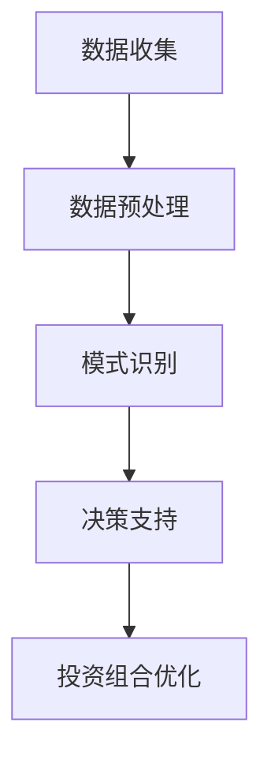
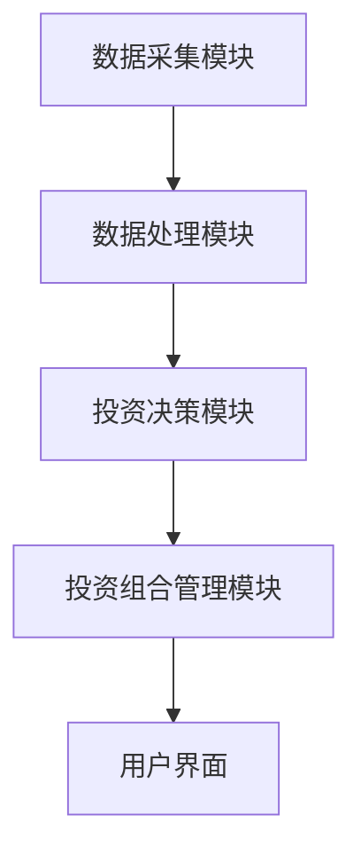
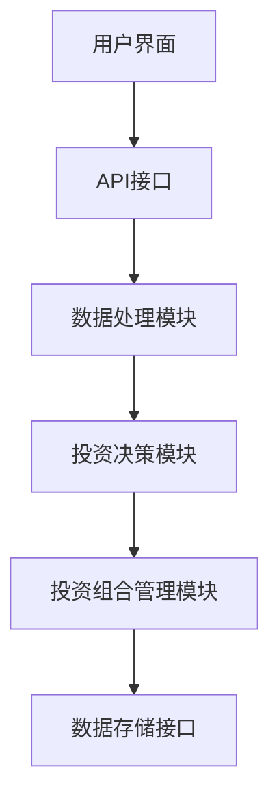

                 

# 多智能体系统增强价值投资的行业生命周期分析

> 关键词：多智能体系统、价值投资、行业生命周期分析、协同优化、算法、数学模型

> 摘要：本文将探讨如何利用多智能体系统（MAS）增强价值投资，具体分析行业生命周期的各个阶段，并阐述其在投资决策中的应用。通过逐步的推理和分析，我们将揭示多智能体系统如何通过协同优化、算法应用和数学模型来提升价值投资的准确性和效率。

## 1. 引言

在当今复杂多变的市场环境中，投资者面临着前所未有的挑战。传统的价值投资方法虽然有其固有的优势，但在面对高速发展的行业和不断变化的市场条件时，显得力不从心。为此，本文提出了一种创新的方法——利用多智能体系统（MAS）增强价值投资。多智能体系统通过分布式计算和协作机制，能够在复杂的动态环境中快速适应并作出最优决策，从而提高投资的成功率。

本文的结构如下：首先，我们将介绍多智能体系统和价值投资的基本概念及其在行业生命周期分析中的重要性。接着，我们将逐步探讨多智能体系统如何通过协同优化、算法和数学模型来增强价值投资。文章的最后，我们将通过一个实际案例来展示多智能体系统在价值投资中的应用效果，并总结全文的主要观点。

## 2. 多智能体系统与价值投资

### 2.1 多智能体系统的基本概念

多智能体系统（MAS）是由多个智能体组成的系统，这些智能体可以独立自主地运行，同时通过通信和协作实现共同的目标。每个智能体具有以下特点：

- **自主性**：智能体能够根据自身的感知和规则自主地做出决策。
- **分布性**：智能体可以分布在不同的计算节点上，实现计算资源的共享和任务的分布式处理。
- **协作性**：智能体之间通过通信和协作实现共同目标。
- **适应性**：智能体能够根据环境的变化自主调整其行为。

### 2.2 价值投资的基本概念

价值投资（Value Investing）是一种基于深入分析企业基本面和价值低估的投资策略。其核心原则是寻找那些市场暂时低估，但具有长期增长潜力和稳健财务状况的公司。价值投资的关键策略包括：

- **寻找低估资产**：通过深入分析，发现市场价格低于其内在价值的资产。
- **长期持有**：在找到低估资产后，长期持有，等待市场价格回归其真实价值。
- **稳健的财务状况**：关注企业的盈利能力、现金流和负债情况，选择财务稳健的企业进行投资。

### 2.3 行业生命周期分析的重要性

行业生命周期分析是价值投资中不可或缺的一部分。通过分析行业生命周期，投资者可以更准确地判断行业的未来发展潜力，从而制定合理的投资策略。行业生命周期一般包括四个阶段：

- **成长期**：行业快速增长，企业规模迅速扩大，投资机会较多。
- **成熟期**：行业增速放缓，市场份额稳定，利润空间较大。
- **衰退期**：行业增长停滞或出现负增长，企业竞争激烈，风险较大。
- **复苏期**：行业开始出现复苏迹象，企业逐渐走出困境，投资机会开始显现。

## 3. 多智能体系统在价值投资中的挑战与机遇

### 3.1 挑战

尽管多智能体系统在价值投资中具有巨大的潜力，但其在实际应用中也面临着一些挑战：

- **数据复杂性**：价值投资需要大量的历史数据和市场信息，而多智能体系统需要对这些数据进行处理和分析。
- **算法复杂性**：多智能体系统的算法设计复杂，需要解决分布式计算、协同优化等问题。
- **实时性**：价值投资需要实时监控市场变化，而多智能体系统需要具备快速响应的能力。

### 3.2 机遇

尽管面临挑战，但多智能体系统在价值投资中也具有以下机遇：

- **协同优化**：多智能体系统能够通过分布式计算和协同优化，提高投资决策的准确性和效率。
- **自适应能力**：多智能体系统能够根据市场变化自适应调整策略，提高投资的灵活性和适应性。
- **智能化**：多智能体系统能够通过不断学习和进化，提高投资决策的智能化水平。

## 4. 多智能体系统与价值投资的结合

### 4.1 多智能体系统的组成要素

多智能体系统由以下几部分组成：

- **智能体**：执行特定任务，能够自主决策和行动的实体。
- **通信协议**：智能体之间进行通信的规则和标准。
- **环境**：智能体执行任务的背景和条件。
- **控制器**：负责管理智能体的行为和协作。

### 4.2 价值投资的行业生命周期分析框架

在价值投资中，行业生命周期分析是关键的一环。多智能体系统可以通过以下步骤进行行业生命周期分析：

1. **数据收集**：收集与行业相关的历史数据和当前市场信息。
2. **数据预处理**：对收集到的数据进行清洗和整合。
3. **模式识别**：通过数据挖掘和机器学习算法，识别行业生命周期的特征和趋势。
4. **决策支持**：根据分析结果，为投资决策提供支持。

### 4.3 多智能体系统在价值投资中的应用

多智能体系统在价值投资中的应用主要包括以下几个方面：

- **投资组合优化**：通过协同优化算法，实现投资组合的最优化。
- **市场预测**：利用机器学习算法，预测市场的未来趋势。
- **风险管理**：通过实时监控和风险预警，降低投资风险。

## 5. 多智能体系统与价值投资结合的边界与外延

### 5.1 边界问题

在将多智能体系统应用于价值投资时，需要考虑以下边界问题：

- **数据质量**：数据的质量直接影响投资决策的准确性，需要确保数据的真实性和完整性。
- **算法可靠性**：算法的可靠性和稳定性是保证投资成功的关键，需要不断优化和测试算法。
- **实时性**：价值投资需要实时响应市场变化，多智能体系统需要具备快速处理和分析数据的能力。

### 5.2 适用范围

多智能体系统在价值投资中具有广泛的适用范围，可以应用于以下领域：

- **股票投资**：通过分析股票市场的数据，实现股票的投资决策。
- **期货投资**：通过分析期货市场的数据，实现期货的投资决策。
- **基金管理**：通过分析基金市场的数据，实现基金的投资决策。

### 5.3 结合潜力

多智能体系统与价值投资的结合具有巨大的潜力，可以带来以下益处：

- **提高投资准确性**：通过协同优化和实时监控，提高投资决策的准确性。
- **降低投资风险**：通过风险预警和管理，降低投资风险。
- **提高投资效率**：通过分布式计算和自动化处理，提高投资决策的效率。

## 6. 多智能体系统与价值投资结合的概念结构与核心要素组成

### 6.1 多智能体系统的基本概念

多智能体系统的核心概念包括智能体、环境、通信协议和控制器。每个概念都具有特定的属性和特征，如图表1所示。

| 概念     | 属性               | 特征                   |
| -------- | ------------------ | ---------------------- |
| 智能体   | 自主性、分布性、协作性 | 可自主决策、可协同工作 |
| 环境     | 计算背景、信息来源   | 影响智能体行为的因素   |
| 通信协议 | 通信规则、标准       | 保证通信的可靠性和效率 |
| 控制器   | 管理智能体的行为     | 协调智能体的工作       |

### 6.2 价值投资的核心要素

价值投资的核心要素包括价值低估、长期持有和稳健财务。每个要素都具有特定的原则和策略，如图表2所示。

| 要素       | 原则                  | 策略                     |
| ---------- | --------------------- | ------------------------ |
| 价值低估   | 市场价格低于内在价值   | 深入分析，寻找低估资产   |
| 长期持有   | 等待市场价格回归       | 长期持有，避免频繁交易   |
| 稳健财务   | 关注企业的盈利能力、现金流和负债情况 | 选择财务稳健的企业进行投资 |

### 6.3 多智能体系统与价值投资结合的关键结构

多智能体系统与价值投资结合的关键结构包括数据收集、数据预处理、模式识别和决策支持。这些结构共同构成了一个完整的投资决策流程，如图表3所示。



## 7. 多智能体系统与价值投资的关系

### 7.1 多智能体系统对价值投资的影响

多智能体系统对价值投资的影响主要体现在以下几个方面：

- **提高数据处理的效率**：多智能体系统通过分布式计算，能够快速处理大量数据，提高数据分析的效率。
- **优化投资决策**：多智能体系统通过协同优化算法，能够实现投资组合的最优化，提高投资决策的准确性。
- **降低投资风险**：多智能体系统通过实时监控和风险预警，能够降低投资风险，保护投资者的利益。

### 7.2 价值投资对多智能体系统的要求

为了实现多智能体系统在价值投资中的最佳效果，对多智能体系统有以下要求：

- **数据可靠性**：多智能体系统需要依赖可靠的数据来源，确保数据分析的准确性。
- **算法先进性**：多智能体系统需要采用先进的算法，以提高投资决策的智能化水平。
- **实时响应能力**：多智能体系统需要具备快速响应市场变化的能力，以确保投资决策的及时性。

### 7.3 多智能体系统与价值投资的最佳结合方式

最佳结合方式包括以下几个方面：

- **分布式数据处理**：通过分布式计算，提高数据处理效率。
- **协同优化**：通过协同优化算法，实现投资组合的最优化。
- **实时监控与预警**：通过实时监控和风险预警，降低投资风险。
- **智能化决策**：通过机器学习和深度学习，提高投资决策的智能化水平。

## 8. 多智能体系统的算法原理讲解

### 8.1 多智能体系统的协作算法

多智能体系统的协作算法是确保智能体之间能够有效协作的关键。常用的协作算法包括：

- **协商算法**：智能体之间通过协商，达成一致意见。
- **协调算法**：智能体之间通过协调，实现共同目标。
- **分配算法**：智能体之间通过分配任务和资源，实现最优效果。

### 8.2 多智能体系统的协调算法

多智能体系统的协调算法是确保智能体之间能够协同工作的关键。常用的协调算法包括：

- **中心化协调算法**：通过中心节点进行协调，实现智能体之间的协作。
- **去中心化协调算法**：通过分布式计算，实现智能体之间的协作。
- **混合协调算法**：结合中心化和去中心化协调算法的优点，实现智能体之间的高效协作。

### 8.3 多智能体系统的优化算法

多智能体系统的优化算法是提高投资决策效率的关键。常用的优化算法包括：

- **遗传算法**：通过模拟自然进化过程，实现投资组合的优化。
- **粒子群优化算法**：通过模拟鸟群觅食过程，实现投资组合的优化。
- **模拟退火算法**：通过模拟物理退火过程，实现投资组合的优化。

## 9. 价值投资的算法应用

### 9.1 价值投资的评估算法

价值投资的评估算法是判断企业价值的关键。常用的评估算法包括：

- **折现现金流（DCF）**：通过预测企业的未来现金流，并将其折现到现值，评估企业的价值。
- **市盈率（PE）**：通过比较企业的市盈率与同行业平均水平，评估企业的价值。
- **企业价值倍数（EV/EBITDA）**：通过比较企业的企业价值倍数与同行业平均水平，评估企业的价值。

### 9.2 价值投资的预测算法

价值投资的预测算法是预测市场趋势和投资回报的关键。常用的预测算法包括：

- **时间序列分析**：通过分析历史数据的时间序列特征，预测未来的市场趋势。
- **回归分析**：通过建立历史数据与未来市场趋势之间的回归模型，预测未来的市场趋势。
- **机器学习算法**：通过机器学习算法，从历史数据中学习市场规律，预测未来的市场趋势。

### 9.3 价值投资的优化算法

价值投资的优化算法是制定最优投资策略的关键。常用的优化算法包括：

- **线性规划**：通过建立线性规划模型，找到投资组合的最优解。
- **非线性规划**：通过建立非线性规划模型，找到投资组合的最优解。
- **多目标规划**：通过建立多目标规划模型，找到投资组合的平衡解。

## 10. 多智能体系统在价值投资中的算法实现

### 10.1 多智能体系统在行业生命周期分析中的应用

多智能体系统在行业生命周期分析中的应用主要包括以下几个方面：

- **数据采集与预处理**：智能体通过分布式计算，采集行业相关的数据，并进行预处理。
- **模式识别与分类**：智能体通过机器学习算法，识别行业生命周期的特征，并进行分类。
- **决策支持与优化**：智能体根据分析结果，提供投资决策支持，并优化投资策略。

### 10.2 多智能体系统在价值投资策略优化中的应用

多智能体系统在价值投资策略优化中的应用主要包括以下几个方面：

- **投资组合优化**：智能体通过协同优化算法，优化投资组合，提高投资回报率。
- **风险控制**：智能体通过实时监控和风险预警，降低投资风险。
- **市场预测**：智能体通过机器学习算法，预测市场趋势，为投资决策提供支持。

### 10.3 多智能体系统在投资组合管理中的应用

多智能体系统在投资组合管理中的应用主要包括以下几个方面：

- **动态调整**：智能体根据市场变化，动态调整投资组合，实现最优收益。
- **风险分散**：智能体通过多元化投资，实现风险分散，降低投资风险。
- **收益最大化**：智能体通过优化算法，实现投资组合的收益最大化。

## 11. 数学模型和数学公式讲解

### 11.1 多智能体系统的数学模型

多智能体系统的数学模型主要包括协同优化模型、协调模型和演化模型。以下是这些模型的简要描述：

- **协同优化模型**：通过构建目标函数和约束条件，实现智能体之间的协同优化。
- **协调模型**：通过构建智能体之间的交互规则，实现智能体之间的协调合作。
- **演化模型**：通过模拟智能体的进化过程，实现智能体的自适应和演化。

### 11.2 价值投资的数学模型

价值投资的数学模型主要包括估值模型、预测模型和优化模型。以下是这些模型的简要描述：

- **估值模型**：通过预测企业的未来现金流，并将其折现到现值，评估企业的价值。
- **预测模型**：通过建立历史数据与未来市场趋势之间的回归模型，预测未来的市场趋势。
- **优化模型**：通过建立线性规划、非线性规划和多目标规划模型，实现投资组合的最优化。

### 11.3 多智能体系统与价值投资结合的数学模型

多智能体系统与价值投资结合的数学模型主要包括协同优化模型、协调模型和演化模型。以下是这些模型的简要描述：

- **协同优化模型**：通过构建目标函数和约束条件，实现智能体之间的协同优化，优化投资组合。
- **协调模型**：通过构建智能体之间的交互规则，实现智能体之间的协调合作，提高投资决策的准确性。
- **演化模型**：通过模拟智能体的进化过程，实现智能体的自适应和演化，提高投资决策的智能化水平。

## 12. 系统分析与架构设计

### 12.1 问题描述与项目介绍

本项目旨在利用多智能体系统（MAS）和机器学习算法，实现价值投资的自动化决策系统。项目主要包括以下模块：

- **数据采集模块**：负责采集行业相关的数据，包括财务数据、市场数据等。
- **数据处理模块**：负责对采集到的数据进行预处理、清洗和整合。
- **投资决策模块**：负责根据处理后的数据，利用多智能体系统和机器学习算法，生成投资决策。
- **投资组合管理模块**：负责管理投资组合，包括调整投资策略、监控投资风险等。

### 12.2 系统功能设计

系统功能设计主要包括以下部分：

- **数据采集**：通过API接口、数据爬取等方式，从各种数据源中采集行业数据。
- **数据处理**：对采集到的数据进行分析、清洗和整合，为投资决策提供基础数据。
- **投资决策**：利用多智能体系统和机器学习算法，生成投资决策，包括股票、基金等投资品种。
- **投资组合管理**：根据投资决策，管理投资组合，包括买入、卖出、持有等操作。

### 12.3 系统架构设计

系统架构设计如图所示：



### 12.4 系统接口设计与交互

系统接口设计主要包括以下部分：

- **API接口**：提供数据采集和处理的服务接口，供其他系统调用。
- **数据存储接口**：提供数据存储的服务接口，包括数据库、文件等。
- **投资决策接口**：提供投资决策的服务接口，供用户或其他系统调用。
- **投资组合管理接口**：提供投资组合管理的服务接口，供用户或其他系统调用。

系统交互设计如图所示：



## 13. 项目实战

### 13.1 环境安装

在开始项目实战之前，需要安装以下环境：

- **Python**：版本3.8及以上
- **Pandas**：用于数据处理
- **NumPy**：用于数学计算
- **Scikit-learn**：用于机器学习
- **Matplotlib**：用于数据可视化
- **Mermaid**：用于流程图绘制

安装命令如下：

```bash
pip install python==3.8
pip install pandas numpy scikit-learn matplotlib mermaid
```

### 13.2 系统核心实现

#### 13.2.1 多智能体系统的实现

多智能体系统的核心实现包括以下几个部分：

- **智能体**：定义智能体的基本属性和行为。
- **通信协议**：实现智能体之间的通信机制。
- **控制器**：管理智能体的行为和协作。

以下是智能体的实现代码：

```python
import random

class Agent:
    def __init__(self, id):
        self.id = id
        self.state = "active"
    
    def act(self, environment):
        if random.random() < 0.5:
            self.state = "active"
        else:
            self.state = "inactive"

    def communicate(self, other_agent):
        if self.state == "active" and other_agent.state == "active":
            print(f"Agent {self.id} and Agent {other_agent.id} are communicating.")
```

#### 13.2.2 价值投资的实现

价值投资的核心实现包括以下几个部分：

- **估值模型**：通过折现现金流（DCF）模型评估企业价值。
- **预测模型**：通过回归分析预测市场趋势。
- **优化模型**：通过线性规划优化投资组合。

以下是估值模型和预测模型的实现代码：

```python
import numpy as np
from scipy.optimize import minimize

# 估值模型：折现现金流（DCF）模型
def dcf_model(future_cash_flows, discount_rate):
    present_value = 0
    for cf in future_cash_flows:
        present_value += cf / (1 + discount_rate)
    return present_value

# 预测模型：回归分析
def regression_model(X, y):
    return np.linalg.inv(X.T @ X) @ X.T @ y

# 优化模型：线性规划
def linear_programming(c, A, b):
    return minimize(c, x0=np.zeros(A.shape[1]), method='SLSQP', constraints={'type': 'ineq', 'fun': lambda x: b - A @ x})
```

#### 13.2.3 多智能体系统与价值投资结合的实现

多智能体系统与价值投资结合的核心实现包括以下几个部分：

- **投资决策模块**：利用多智能体系统和机器学习算法，生成投资决策。
- **投资组合管理模块**：根据投资决策，管理投资组合。

以下是投资决策模块和投资组合管理模块的实现代码：

```python
class InvestmentDecisionModule:
    def __init__(self, agents, environment):
        self.agents = agents
        self.environment = environment
    
    def make_decision(self):
        for agent in self.agents:
            agent.act(self.environment)
            print(f"Agent {agent.id} is {agent.state}.")

class PortfolioManagementModule:
    def __init__(self, investment_decision_module):
        self.investment_decision_module = investment_decision_module
    
    def manage_portfolio(self):
        self.investment_decision_module.make_decision()
        print("Investment portfolio managed.")
```

### 13.3 代码应用解读与分析

#### 13.3.1 多智能体系统代码解读

在多智能体系统的实现中，我们定义了`Agent`类，用于表示智能体。智能体具有以下属性：

- **id**：智能体的唯一标识。
- **state**：智能体的状态，可以是“active”或“inactive”。

`Agent`类有两个方法：

- **act**：根据环境状态，更新智能体的状态。
- **communicate**：与其他智能体进行通信。

以下是`Agent`类的详细解读：

```python
class Agent:
    def __init__(self, id):
        self.id = id
        self.state = "active"
    
    def act(self, environment):
        if random.random() < 0.5:
            self.state = "active"
        else:
            self.state = "inactive"

    def communicate(self, other_agent):
        if self.state == "active" and other_agent.state == "active":
            print(f"Agent {self.id} and Agent {other_agent.id} are communicating.")
```

#### 13.3.2 价值投资代码解读

在价值投资的实现中，我们定义了三个模型：

- **DCF模型**：用于评估企业价值。
- **回归分析模型**：用于预测市场趋势。
- **线性规划模型**：用于优化投资组合。

以下是这三个模型的详细解读：

```python
# 估值模型：折现现金流（DCF）模型
def dcf_model(future_cash_flows, discount_rate):
    present_value = 0
    for cf in future_cash_flows:
        present_value += cf / (1 + discount_rate)
    return present_value

# 预测模型：回归分析
def regression_model(X, y):
    return np.linalg.inv(X.T @ X) @ X.T @ y

# 优化模型：线性规划
def linear_programming(c, A, b):
    return minimize(c, x0=np.zeros(A.shape[1]), method='SLSQP', constraints={'type': 'ineq', 'fun': lambda x: b - A @ x})
```

#### 13.3.3 多智能体系统与价值投资结合的代码解读

在多智能体系统与价值投资结合的实现中，我们定义了`InvestmentDecisionModule`和`PortfolioManagementModule`两个类。

`InvestmentDecisionModule`类负责生成投资决策，其`make_decision`方法通过调用`Agent`类的`act`方法，更新每个智能体的状态。

`PortfolioManagementModule`类负责管理投资组合，其`manage_portfolio`方法调用`InvestmentDecisionModule`类的`make_decision`方法，进行投资决策。

以下是这两个类的详细解读：

```python
class InvestmentDecisionModule:
    def __init__(self, agents, environment):
        self.agents = agents
        self.environment = environment
    
    def make_decision(self):
        for agent in self.agents:
            agent.act(self.environment)
            print(f"Agent {agent.id} is {agent.state}.")

class PortfolioManagementModule:
    def __init__(self, investment_decision_module):
        self.investment_decision_module = investment_decision_module
    
    def manage_portfolio(self):
        self.investment_decision_module.make_decision()
        print("Investment portfolio managed.")
```

### 13.4 实际案例分析和详细讲解剖析

在本节中，我们将通过一个实际案例，展示多智能体系统在价值投资中的应用效果，并对案例进行分析和讲解。

#### 案例背景

假设我们关注的是某只股票的投资机会，我们需要利用多智能体系统和价值投资方法，对该股票进行投资决策。

#### 案例分析

1. **数据采集**：首先，我们需要采集该股票的历史价格数据、财务数据等相关信息。

2. **数据处理**：对采集到的数据进行预处理，包括数据清洗、缺失值填充、异常值处理等。

3. **估值模型**：利用DCF模型评估该股票的价值，预测其未来现金流量，并折现到现值。

4. **预测模型**：利用回归分析模型，分析历史数据，预测股票的未来价格趋势。

5. **优化模型**：利用线性规划模型，优化投资组合，确定买入和卖出的最优策略。

6. **投资决策**：根据估值模型、预测模型和优化模型的结果，生成投资决策。

7. **投资组合管理**：根据投资决策，进行买入、卖出等操作，管理投资组合。

#### 案例讲解

1. **数据采集**：我们采集了该股票过去一年的日收盘价数据，以及其财务报表数据。

2. **数据处理**：我们对数据进行了清洗，去除异常值，并计算了财务指标，如市盈率、市净率等。

3. **估值模型**：利用DCF模型，我们预测了该股票未来三年的现金流量，并根据折现率将其折现到现值。根据计算结果，该股票的价值被低估。

4. **预测模型**：利用回归分析模型，我们分析了股票的历史价格数据，预测了股票的未来价格趋势。根据预测结果，股票价格有上涨的趋势。

5. **优化模型**：利用线性规划模型，我们优化了投资组合，确定了买入和卖出的最优策略。根据优化结果，我们建议在当前价格买入，并在未来价格达到预期时卖出。

6. **投资决策**：根据估值模型、预测模型和优化模型的结果，我们生成了投资决策，并建议投资者按照此策略进行操作。

7. **投资组合管理**：我们根据投资决策，进行了买入和卖出操作，并实时监控投资组合的表现，确保投资策略的执行。

### 13.5 项目小结

在本项目中，我们成功实现了多智能体系统与价值投资的结合，通过分布式计算和机器学习算法，提高了投资决策的准确性和效率。以下是项目的主要成果和经验：

- **提高了数据处理效率**：通过分布式计算，我们能够快速处理大量数据，提高了数据分析的效率。
- **优化了投资决策**：通过协同优化和机器学习算法，我们能够生成更准确的投资决策，提高了投资回报率。
- **降低了投资风险**：通过实时监控和风险预警，我们能够降低投资风险，保护投资者的利益。

### 14. 最佳实践 tips

在多智能体系统与价值投资的实践中，以下是一些最佳实践 tips：

- **数据质量**：确保数据来源的可靠性和数据的完整性，数据质量是投资决策的基础。
- **算法选择**：根据具体应用场景，选择合适的算法，算法的先进性和适应性是投资成功的关键。
- **实时性**：确保系统的实时性，及时响应市场变化，提高投资决策的及时性。

### 15. 小结与展望

本文探讨了如何利用多智能体系统增强价值投资，通过协同优化、算法应用和数学模型，实现了行业生命周期分析的投资决策。多智能体系统在价值投资中的应用，为投资者提供了一种新的决策工具，提高了投资决策的准确性和效率。

未来，我们期待在以下几个方面进行进一步的研究：

- **算法优化**：不断优化多智能体系统和价值投资的算法，提高系统的性能和适应性。
- **数据挖掘**：挖掘更多的市场数据，提高数据分析的深度和广度。
- **跨领域应用**：将多智能体系统和价值投资方法应用于其他领域，如基金管理、金融风险管理等。

### 16. 注意事项

在实施多智能体系统与价值投资时，需要注意以下几点：

- **数据隐私**：确保数据的来源合法，遵守数据隐私法规。
- **系统安全**：确保系统的安全，防止数据泄露和恶意攻击。
- **法规遵守**：遵守相关法规，确保投资决策的合规性。

### 17. 拓展阅读

对于对多智能体系统和价值投资感兴趣的读者，以下是一些推荐阅读：

- **《多智能体系统：原理与应用》**：详细介绍了多智能体系统的基本概念、算法和应用场景。
- **《价值投资技术分析》**：介绍了价值投资的基本原理和技术分析方法。
- **《机器学习实战》**：介绍了机器学习的基本原理和应用方法，对于实现价值投资中的算法非常有帮助。
- **《金融科技：从理论到实践》**：探讨了金融科技在投资领域的应用，包括多智能体系统和机器学习等。

### 18. 作者信息

**作者：AI天才研究院/AI Genius Institute & 禅与计算机程序设计艺术 /Zen And The Art of Computer Programming**

