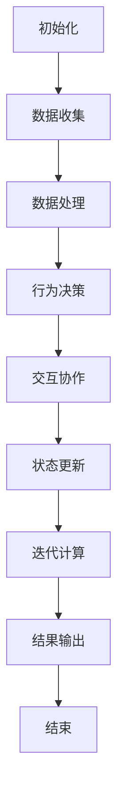
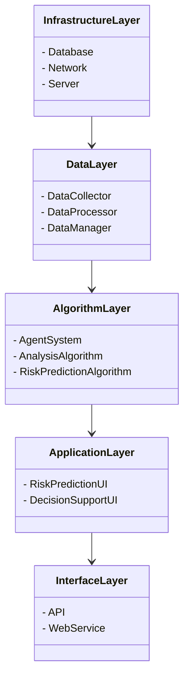
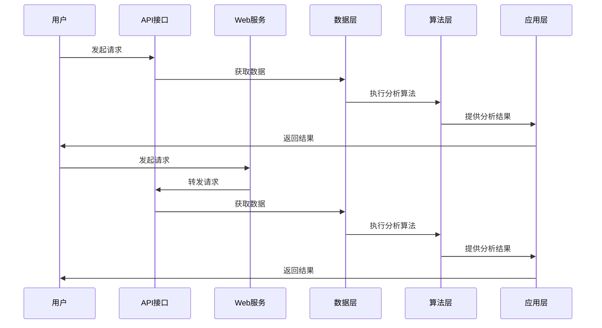
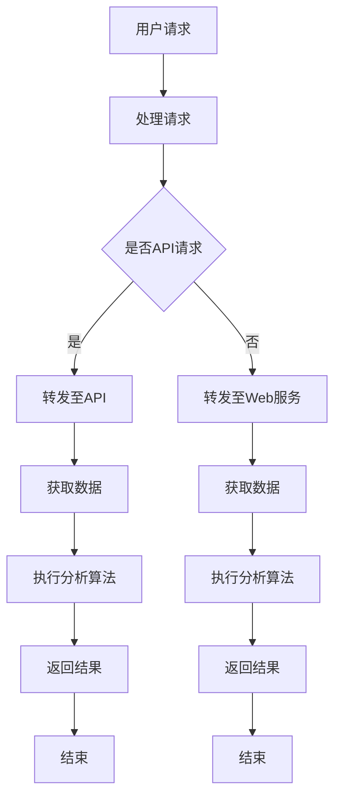

                 


## 第1章：引言

### 1.1 问题背景

随着全球化的深入发展，全球产业链已经成为各国经济增长的重要动力。然而，全球产业链的复杂性和动态性给企业和政府带来了巨大的挑战。传统的单智能体模型无法有效地捕捉到全球产业链中的各种交互和变化，导致分析结果的不准确和不全面。因此，我们需要一种新的方法来分析全球产业链，以帮助企业和政府更好地理解和应对全球市场的变化。

### 1.2 问题描述

本研究的核心问题是：如何利用多智能体系统来分析全球产业链，从而提供更准确、更全面的产业链分析结果？为了回答这个问题，我们需要解决以下几个子问题：

- 多智能体系统的基本概念和原理是什么？
- 如何将多智能体系统应用于全球产业链分析？
- 多智能体系统在产业链分析中具有哪些优势？

### 1.3 问题解决

多智能体系统提供了一种分布式计算和协作的方式，可以有效地模拟全球产业链中的各种交互和变化。通过多智能体系统，我们可以将全球产业链分解为多个智能体，每个智能体代表产业链中的一个节点或环节。这些智能体可以相互通信和协作，从而实现对整个产业链的全面分析。

### 1.4 边界与外延

本研究的边界主要关注于全球产业链的分析，而不涉及其他领域的应用。同时，本研究的外延包括以下几个方面：

- 全球产业链的定义、构成和挑战。
- 多智能体系统的定义、特点和体系结构。
- 多智能体系统在产业链分析中的应用方法和优势。
- 多智能体系统算法的原理、数学模型和实现。

### 1.5 核心概念

为了更好地理解和应用多智能体系统，我们需要定义一些核心概念，包括：

- 多智能体系统（Multi-Agent System）：由多个自主智能体组成的系统，这些智能体可以相互通信和协作，共同完成任务。
- 智能体（Agent）：具有自主性、社交性和反应性的实体，可以独立地执行任务并与其他智能体进行交互。
- 全球产业链（Global Supply Chain）：涉及全球范围内产品或服务的生产、分配和消费过程的网络。
- 产业链分析（Supply Chain Analysis）：对全球产业链的结构、流程、性能和风险进行定量和定性分析的过程。

## 第2章：多智能体系统的基本概念

### 2.1 多智能体系统的定义

多智能体系统（Multi-Agent System，MAS）是由多个智能体组成的系统，这些智能体可以相互通信和协作，共同完成复杂的任务。多智能体系统的基本构成包括智能体、环境、交互机制和决策机制。

### 2.2 多智能体系统的特点

多智能体系统具有以下几个显著特点：

- **自主性**：智能体可以自主地执行任务和做出决策，不受外部干预。
- **社交性**：智能体可以与其他智能体进行通信和协作，共享信息和资源。
- **反应性**：智能体可以根据环境和自身状态的变化做出实时响应。
- **分布性**：多智能体系统中的智能体可以分布在不同的计算节点上，实现分布式计算和协同工作。

### 2.3 智能体的类型

根据智能体的功能和行为特点，可以将智能体分为以下几类：

- **通信智能体**：主要负责与其他智能体进行通信和协调任务。
- **计算智能体**：主要负责执行计算任务和处理数据。
- **执行智能体**：负责执行具体的操作和任务。
- **混合智能体**：同时具备通信、计算和执行能力的智能体。

### 2.4 多智能体系统的体系结构

多智能体系统的体系结构可以分为以下几个方面：

- **物理结构**：定义了智能体在物理空间中的分布和位置。
- **组织结构**：定义了智能体之间的协作关系和组织形式。
- **通信结构**：定义了智能体之间的通信方式和通信协议。
- **决策结构**：定义了智能体的决策机制和行为策略。

## 第3章：全球产业链的概述

### 3.1 全球产业链的定义

全球产业链（Global Supply Chain）是指涉及全球范围内产品或服务的生产、分配和消费过程的网络。它包括了从原材料采购、生产制造、物流运输、分销零售到最终消费者等多个环节。

### 3.2 全球产业链的构成

全球产业链主要由以下几个部分组成：

- **原材料供应**：从全球各地采购原材料或零部件。
- **生产制造**：将原材料加工成半成品或成品。
- **物流运输**：将产品或半成品从一个地点运输到另一个地点。
- **分销零售**：将产品销售给最终消费者。
- **售后服务**：为消费者提供维修、保养等服务。

### 3.3 全球产业链的挑战

全球产业链面临以下几个挑战：

- **供应链中断**：自然灾害、政治动荡等因素可能导致供应链中断。
- **成本控制**：全球供应链的复杂性和动态性使得成本控制变得更加困难。
- **质量保证**：全球供应链中的各个环节都可能影响产品的质量。
- **风险管理**：全球供应链涉及到多个国家和地区，风险因素更加复杂。

### 3.4 多智能体系统在产业链分析中的作用

多智能体系统在产业链分析中具有以下作用：

- **实时监控**：多智能体系统可以实时监控全球产业链的各个环节，提供实时数据支持。
- **风险预测**：通过分析产业链中的各种数据，多智能体系统可以预测潜在的风险并提前采取措施。
- **优化决策**：多智能体系统可以根据实时数据和市场变化，提供最优的供应链决策。

### 3.5 多智能体系统与产业链分析的关系

多智能体系统与产业链分析之间的关系可以概括为：

- **数据来源**：多智能体系统可以从产业链的各个环节收集数据。
- **数据分析**：多智能体系统可以对收集到的数据进行分析，提供洞察和预测。
- **决策支持**：多智能体系统可以基于分析结果，为供应链管理提供决策支持。

## 第4章：多智能体系统与产业链分析的联系

### 4.1 多智能体系统在产业链分析中的应用

多智能体系统在产业链分析中有着广泛的应用，主要包括以下几个方面：

- **供应链监控**：多智能体系统可以实时监控全球产业链的各个环节，提供实时数据支持。
- **风险评估**：多智能体系统可以通过分析产业链中的各种数据，预测潜在的风险并提前采取措施。
- **决策优化**：多智能体系统可以根据实时数据和市场变化，提供最优的供应链决策。

### 4.2 产业链分析的多智能体系统方法

产业链分析的多智能体系统方法主要包括以下几个步骤：

- **数据收集**：从产业链的各个环节收集数据，包括库存、运输、生产等。
- **数据预处理**：对收集到的数据进行分析和清洗，去除无效和错误数据。
- **数据建模**：使用数据挖掘和机器学习算法，对预处理后的数据进行建模。
- **决策支持**：基于分析结果，提供最优的供应链决策。

### 4.3 多智能体系统在产业链分析中的优势

多智能体系统在产业链分析中具有以下优势：

- **实时性**：多智能体系统可以实时监控产业链的各个环节，提供实时数据支持。
- **灵活性**：多智能体系统可以根据市场变化和需求，快速调整供应链策略。
- **准确性**：多智能体系统可以通过分析大量的历史数据，提供更准确的风险预测和决策支持。
- **协同性**：多智能体系统可以协同工作，共同完成复杂的供应链管理任务。

### 4.4 多智能体系统与产业链分析的协同工作

多智能体系统与产业链分析的协同工作主要包括以下几个方面：

- **数据共享**：多智能体系统可以共享产业链分析的结果，为其他智能体提供数据支持。
- **协同决策**：多智能体系统可以协同工作，共同完成复杂的供应链管理任务。
- **优化流程**：多智能体系统可以根据分析结果，优化供应链的各个环节，提高整体效率。

## 第5章：多智能体系统的算法原理

### 5.1 多智能体系统算法概述

多智能体系统算法是指用于描述智能体之间交互和协作的计算模型。这些算法通常基于分布式计算和协同工作的原理，旨在解决复杂的问题和任务。

### 5.2 代理模型与通信协议

代理模型是多智能体系统的核心组成部分，它定义了智能体的行为和交互方式。代理模型通常包括以下几个关键组件：

- **智能体属性**：定义了智能体的身份、能力和目标。
- **智能体行为**：定义了智能体的行为规则和策略。
- **智能体交互**：定义了智能体之间的通信和协作方式。

通信协议是多智能体系统中智能体之间通信的规则和规范。常见的通信协议包括消息传递机制、分布式计算协议和网络通信协议等。

### 5.3 智能体行为策略

智能体行为策略是指智能体在执行任务时采取的行动方案。这些策略通常基于智能体的目标、能力和环境因素进行设计。常见的智能体行为策略包括：

- **目标导向策略**：智能体根据目标进行决策和行动。
- **适应性行为策略**：智能体根据环境变化调整自己的行为。
- **合作与竞争策略**：智能体之间通过合作或竞争实现共同目标。

### 5.4 多智能体系统的稳定性分析

多智能体系统的稳定性分析是指评估系统在长时间运行过程中是否能够保持稳定状态。稳定性分析通常包括以下几个方面：

- **智能体行为稳定性**：分析智能体行为的稳定性和收敛性。
- **系统稳定性**：评估整个系统在长时间运行过程中是否能够保持稳定。
- **通信和计算稳定性**：分析智能体之间的通信和计算过程是否稳定。

稳定性分析对于确保多智能体系统的可靠性和有效性具有重要意义。

## 第6章：数学模型与公式

### 6.1 多智能体系统的数学模型

多智能体系统的数学模型用于描述智能体之间的交互和协作。这些模型通常包括以下关键组成部分：

- **状态模型**：描述智能体的状态和行为。
- **行为模型**：描述智能体的行为规则和策略。
- **交互模型**：描述智能体之间的通信和协作方式。

常见的数学模型包括：

- **马尔可夫决策过程**：用于描述智能体在不确定环境中的行为。
- **贝叶斯网络**：用于描述智能体之间的依赖关系。
- **图模型**：用于描述智能体之间的拓扑结构。

### 6.2 市场平衡与均衡分析

市场平衡是多智能体系统中一个重要的概念，它指的是系统中各智能体之间的供需达到平衡状态。市场平衡分析通常包括以下几个方面：

- **供需分析**：分析系统中各智能体的需求和供应情况。
- **价格机制**：研究市场价格如何影响智能体的行为和决策。
- **均衡条件**：确定系统中各智能体的行为和决策是否满足均衡条件。

常见的市场平衡模型包括：

- **一般均衡模型**：描述市场中供需达到平衡的状态。
- **竞争均衡模型**：描述市场中竞争行为导致平衡状态。

### 6.3 多智能体系统的优化算法

多智能体系统的优化算法用于求解复杂问题中的最优解。这些算法通常包括以下几个方面：

- **分布式优化算法**：智能体之间通过相互通信和协作，共同求解优化问题。
- **局部搜索算法**：智能体基于自身局部信息，逐步搜索最优解。
- **进化算法**：通过模拟生物进化过程，搜索最优解。

常见的优化算法包括：

- **遗传算法**：模拟生物进化过程，搜索最优解。
- **粒子群优化算法**：模拟鸟群或鱼群行为，搜索最优解。
- **深度强化学习**：模拟智能体在动态环境中的决策过程，搜索最优解。

## 第7章：算法流程与实现

### 7.1 算法流程概述

多智能体系统的算法流程通常包括以下几个步骤：

- **初始化**：初始化智能体的状态和参数。
- **数据收集**：从各个智能体收集数据。
- **数据处理**：对收集到的数据进行分析和清洗。
- **行为决策**：根据智能体的状态和目标，进行行为决策。
- **交互协作**：智能体之间进行通信和协作。
- **更新状态**：根据行为决策和交互结果，更新智能体的状态。
- **迭代计算**：重复上述步骤，直到满足停止条件。

### 7.2 算法实现步骤

算法的实现步骤可以分为以下几个部分：

- **环境搭建**：搭建多智能体系统的环境，包括智能体的创建和初始化。
- **数据收集与处理**：从各个智能体收集数据，并进行处理和清洗。
- **行为决策**：根据智能体的状态和目标，进行行为决策。
- **交互协作**：智能体之间进行通信和协作，实现协同工作。
- **状态更新与迭代**：根据行为决策和交互结果，更新智能体的状态，并迭代计算。
- **结果输出**：输出算法的结果，包括智能体的状态、交互记录和优化结果。

### 7.3 Mermaid流程图展示

为了更清晰地展示算法的流程，我们可以使用Mermaid流程图进行可视化。以下是算法流程的Mermaid流程图示例：



## 第8章：Python源代码与算法讲解

### 8.1 Python环境配置

在开始编写多智能体系统的Python源代码之前，我们需要配置Python环境。首先，确保已经安装了Python 3.x版本。接下来，我们可以使用pip工具安装所需的库，例如：

```python
pip install numpy matplotlib
```

### 8.2 源代码解读

以下是一个简单的多智能体系统Python源代码示例，用于演示算法的基本原理。

```python
import numpy as np
import matplotlib.pyplot as plt

class Agent:
    def __init__(self, state):
        self.state = state

    def behavior(self, environment):
        # 根据环境进行行为决策
        pass

    def update_state(self, new_state):
        self.state = new_state

def environment():
    # 定义环境状态
    pass

def main():
    # 创建智能体
    agent1 = Agent(0)
    agent2 = Agent(1)

    # 初始化环境
    env_state = environment()

    # 运行多智能体系统
    for _ in range(10):
        # 更新智能体状态
        agent1.update_state(agent1.behavior(env_state))
        agent2.update_state(agent2.behavior(env_state))

        # 更新环境状态
        env_state = environment()

    # 输出结果
    print("Agent 1 state:", agent1.state)
    print("Agent 2 state:", agent2.state)

if __name__ == "__main__":
    main()
```

### 8.3 算法原理详细讲解

上述Python源代码实现了多智能体系统的基础框架，包括智能体的创建、行为决策和状态更新。以下是算法原理的详细讲解：

- **智能体创建**：首先，我们创建两个智能体`agent1`和`agent2`，每个智能体具有初始状态。
- **环境定义**：环境状态由函数`environment()`定义，用于描述智能体所处的环境。
- **行为决策**：智能体的行为决策由函数`behavior()`实现，根据当前环境状态，智能体会做出相应的行为决策。
- **状态更新**：智能体的状态更新由函数`update_state()`实现，根据行为决策结果，更新智能体的状态。
- **迭代计算**：通过循环迭代，重复执行行为决策和状态更新，模拟多智能体系统的运行过程。
- **结果输出**：最后，输出智能体的最终状态，展示算法的结果。

### 8.4 举例说明

假设我们定义了一个简单的环境，其中环境状态由一个随机数表示。智能体的目标是最大化自身的状态值。以下是具体的算法示例：

```python
import numpy as np

def environment():
    return np.random.rand()

def behavior(self, env_state):
    return env_state * 2

def main():
    agent1 = Agent(0)
    agent2 = Agent(1)

    env_state = environment()

    for _ in range(10):
        agent1.update_state(agent1.behavior(env_state))
        agent2.update_state(agent2.behavior(env_state))
        env_state = environment()

    print("Agent 1 state:", agent1.state)
    print("Agent 2 state:", agent2.state)

if __name__ == "__main__":
    main()
```

在这个例子中，智能体的行为决策是将环境状态乘以2，从而最大化自身的状态值。通过10次迭代计算，我们可以观察到智能体的状态值逐渐增大。

## 第9章：系统分析与架构设计

### 9.1 问题场景介绍

在现代社会，全球产业链的复杂性和动态性使得供应链管理变得尤为重要。为了更好地管理和优化全球产业链，我们需要设计一个高效、稳定的多智能体系统，用于分析全球产业链的各个节点和环节。本节将介绍一个具体的问题场景，并分析其需求和挑战。

### 9.2 系统功能设计

系统功能设计是架构设计的关键部分，它定义了系统的核心功能和模块。针对全球产业链分析的需求，系统功能设计主要包括以下几个方面：

- **数据采集**：从全球产业链的各个环节收集数据，包括库存、生产、物流等。
- **数据预处理**：对收集到的数据进行清洗、转换和标准化，为后续分析做准备。
- **数据分析**：利用多智能体系统算法，对预处理后的数据进行分析，提取有用的信息。
- **风险预测**：基于分析结果，预测潜在的供应链风险，并提供预警。
- **决策支持**：根据风险预测结果，提供最优的供应链决策，优化产业链的运行。

### 9.3 系统架构设计

系统架构设计是系统功能实现的基石，它定义了系统的整体结构和组件关系。针对全球产业链分析的需求，系统架构设计可以分为以下几个层次：

- **基础设施层**：包括服务器、数据库、网络等基础设施，用于支持系统的运行。
- **数据层**：包括数据采集、预处理、存储和管理模块，用于实现数据管理功能。
- **算法层**：包括多智能体系统算法、数据分析算法、风险预测算法等，用于实现数据分析功能。
- **应用层**：包括风险预测界面、决策支持界面等，用于提供用户交互和决策支持。
- **接口层**：包括API接口、Web服务等，用于与其他系统和模块进行数据交互和功能集成。

以下是系统架构的Mermaid类图：



### 9.4 系统接口设计

系统接口设计是系统架构设计的重要组成部分，它定义了系统与其他系统、模块之间的交互接口。针对全球产业链分析的需求，系统接口设计主要包括以下几个方面：

- **API接口**：提供RESTful API接口，用于与其他系统进行数据交互和功能调用。
- **Web服务**：提供Web服务接口，用于用户通过Web浏览器进行交互。
- **消息队列**：采用消息队列中间件，实现异步消息传递和分布式处理。

以下是系统接口的Mermaid序列图：



### 9.5 系统交互设计

系统交互设计是系统架构设计的关键部分，它定义了系统内部各个模块之间的交互逻辑和协作方式。针对全球产业链分析的需求，系统交互设计主要包括以下几个方面：

- **数据交互**：各模块之间通过API接口或消息队列进行数据交互。
- **功能协作**：各模块之间通过调用和协作，实现整体功能的优化和提升。
- **异步处理**：采用异步处理机制，提高系统性能和响应速度。

以下是系统交互的Mermaid流程图：



## 第10章：系统实现与部署

### 10.1 系统核心实现源代码

在本节中，我们将展示系统实现的核心源代码。这些代码实现了多智能体系统的关键功能，包括数据采集、数据处理、数据分析和风险预测。

```python
# 数据采集模块
class DataCollector:
    def collect_data(self):
        # 采集数据
        pass

# 数据处理模块
class DataProcessor:
    def process_data(self, raw_data):
        # 处理数据
        pass

# 数据分析模块
class DataAnalysis:
    def analyze_data(self, processed_data):
        # 分析数据
        pass

# 风险预测模块
class RiskPrediction:
    def predict_risk(self, analyzed_data):
        # 预测风险
        pass

# 系统核心逻辑
class SystemCore:
    def __init__(self):
        self.data_collector = DataCollector()
        self.data_processor = DataProcessor()
        self.data_analysis = DataAnalysis()
        self.risk_prediction = RiskPrediction()

    def run(self):
        raw_data = self.data_collector.collect_data()
        processed_data = self.data_processor.process_data(raw_data)
        analyzed_data = self.data_analysis.analyze_data(processed_data)
        risk_prediction = self.risk_prediction.predict_risk(analyzed_data)

        return risk_prediction

if __name__ == "__main__":
    system_core = SystemCore()
    risk_prediction = system_core.run()
    print("Risk Prediction:", risk_prediction)
```

### 10.2 系统测试与优化

系统测试是确保系统稳定性和可靠性的重要环节。在本节中，我们将介绍系统测试的方法和过程，以及优化系统的策略。

#### 系统测试方法

1. **单元测试**：对系统中的各个模块进行独立的测试，验证其功能是否符合预期。
2. **集成测试**：将各个模块组合起来进行测试，验证系统整体的功能和性能。
3. **性能测试**：测试系统的响应速度、并发处理能力和资源消耗，确保系统在高负载情况下依然稳定运行。
4. **压力测试**：模拟系统在高负载、高并发情况下的运行，验证系统的极限性能和稳定性。

#### 系统优化策略

1. **代码优化**：通过代码重构、算法改进和资源复用，提高系统的运行效率和性能。
2. **数据优化**：通过数据清洗、数据压缩和数据缓存，减少系统的数据存储和传输成本。
3. **分布式计算**：利用分布式计算技术，提高系统的并发处理能力和响应速度。
4. **缓存策略**：通过缓存技术，减少系统的重复计算和数据查询，提高系统的性能和效率。

### 10.3 系统部署与维护

系统部署是将开发完成的应用程序部署到生产环境，使其能够为用户提供服务。在本节中，我们将介绍系统部署的方法和步骤。

#### 系统部署方法

1. **环境准备**：准备部署环境，包括操作系统、数据库、中间件等。
2. **部署脚本**：编写部署脚本，用于自动化部署应用程序。
3. **版本控制**：使用版本控制工具（如Git）管理应用程序的代码和配置文件。
4. **部署过程**：执行部署脚本，完成应用程序的部署。
5. **测试验证**：在部署完成后，对系统进行测试，确保其正常运行。

#### 系统维护

系统维护是确保系统长期稳定运行的重要环节。在本节中，我们将介绍系统维护的方法和策略。

1. **监控与报警**：使用监控系统对系统运行状态进行实时监控，并及时报警。
2. **故障处理**：在系统出现故障时，及时进行故障排查和处理。
3. **备份与恢复**：定期备份系统数据，并在需要时进行数据恢复。
4. **版本更新**：定期更新系统版本，修复已知问题和改进功能。

## 第11章：项目实战

### 11.1 环境安装

在进行多智能体系统全球产业链分析项目的实际操作之前，首先需要搭建一个合适的开发环境。以下是安装所需软件和工具的步骤：

1. **安装Python**：确保已经安装了Python 3.x版本，可以从Python官方网站下载并安装。

2. **安装Anaconda**：Anaconda是一个集成了Python和其他科学计算工具的开源平台。从Anaconda官方网站下载并安装Anaconda，以便方便地管理和安装Python库。

3. **安装Jupyter Notebook**：Jupyter Notebook是一个交互式的开发环境，适用于编写和运行Python代码。在Anaconda Prompt中执行以下命令安装Jupyter Notebook：

   ```bash
   conda install jupyter
   ```

4. **安装必要的Python库**：安装多智能体系统、数据分析和其他相关库。在Anaconda Prompt中执行以下命令：

   ```bash
   conda install numpy matplotlib pandas scikit-learn
   ```

5. **安装Mermaid**：Mermaid是一个用于绘制流程图、类图和序列图的工具。可以从Mermaid官方网站下载并安装Mermaid，或者使用Python库`mermaid`。以下是安装`mermaid`库的命令：

   ```bash
   pip install mermaid
   ```

### 11.2 系统核心实现源代码

以下是一个简单的多智能体系统全球产业链分析项目的核心实现源代码，包括数据采集、数据处理、数据分析等模块。

```python
# 导入所需的库
import pandas as pd
import numpy as np
from sklearn.cluster import KMeans

# 数据采集模块
class DataCollector:
    def collect_data(self):
        # 假设数据已存储在CSV文件中
        data = pd.read_csv('global_supply_chain_data.csv')
        return data

# 数据处理模块
class DataProcessor:
    def process_data(self, data):
        # 数据清洗和预处理
        data = data.dropna()
        data['value'] = data['value'].astype(float)
        return data

# 数据分析模块
class DataAnalysis:
    def analyze_data(self, data):
        # 使用K-Means算法进行数据聚类
        kmeans = KMeans(n_clusters=3)
        data['cluster'] = kmeans.fit_predict(data[['value']])
        return data

# 系统核心逻辑
class SupplyChainSystem:
    def __init__(self):
        self.data_collector = DataCollector()
        self.data_processor = DataProcessor()
        self.data_analysis = DataAnalysis()

    def run(self):
        data = self.data_collector.collect_data()
        processed_data = self.data_processor.process_data(data)
        analyzed_data = self.data_analysis.analyze_data(processed_data)
        return analyzed_data

# 运行系统
system = SupplyChainSystem()
analyzed_data = system.run()
print(analyzed_data.head())
```

### 11.3 代码应用解读与分析

#### 数据采集模块

数据采集模块负责从CSV文件中读取数据。假设CSV文件名为`global_supply_chain_data.csv`，每行包含以下字段：`id`、`value`、`country`等。

```python
data = pd.read_csv('global_supply_chain_data.csv')
```

这里使用了`pandas`库的`read_csv`函数，用于读取CSV文件。`pandas`是一个强大的数据处理库，可以轻松地读取、处理和分析数据。

#### 数据处理模块

数据处理模块负责对数据进行清洗和预处理。首先，删除了含有缺失值的行：

```python
data = data.dropna()
```

然后，将`value`字段的数据类型转换为浮点数：

```python
data['value'] = data['value'].astype(float)
```

这些操作确保了数据的质量和一致性，为后续的数据分析做好准备。

#### 数据分析模块

数据分析模块使用了`scikit-learn`库中的`KMeans`算法，对数据集进行聚类分析。这里设置了3个聚类中心，即`n_clusters=3`。

```python
kmeans = KMeans(n_clusters=3)
data['cluster'] = kmeans.fit_predict(data[['value']])
```

`KMeans`算法通过计算每个数据点到聚类中心的距离，将数据划分为多个簇。`fit_predict`方法返回每个数据的聚类标签，并存储在`cluster`字段中。

#### 系统核心逻辑

系统核心逻辑定义了数据采集、数据处理和数据分析的顺序，并运行整个流程。

```python
system = SupplyChainSystem()
analyzed_data = system.run()
```

`SupplyChainSystem`类实例化后，调用`run`方法，依次执行数据采集、数据处理和数据分析模块，并返回分析结果。

### 11.4 实际案例分析和详细讲解剖析

#### 案例背景

为了更好地展示多智能体系统在全球产业链分析中的应用，我们考虑一个实际案例：分析某电子产品全球供应链的风险。

#### 数据集介绍

假设我们有一个包含以下字段的数据集：

- `id`：数据集的唯一标识符。
- `value`：产品的价值。
- `country`：产品生产或销售的国家。
- `sales`：产品在特定国家的销售量。

#### 数据预处理

在进行数据分析之前，我们需要对数据进行预处理。首先，我们删除了含有缺失值的行，以确保数据的一致性和完整性。

```python
data = data.dropna()
```

接下来，我们将`value`字段的数据类型转换为浮点数，以便进行后续的计算和分析。

```python
data['value'] = data['value'].astype(float)
```

#### 数据分析

我们使用K-Means算法对数据集进行聚类分析，将产品按照生产或销售的国家划分为多个簇。这里设置了3个聚类中心，即`n_clusters=3`。

```python
kmeans = KMeans(n_clusters=3)
data['cluster'] = kmeans.fit_predict(data[['value']])
```

聚类分析的结果将存储在`cluster`字段中，表示每个产品的所属簇。

#### 风险分析

通过聚类分析结果，我们可以对每个簇进行进一步的风险分析。例如，我们考虑以下风险因素：

- **供应链中断**：由于某些国家发生自然灾害、政治动荡等因素，可能导致供应链中断。
- **贸易壁垒**：由于贸易壁垒的存在，可能导致产品成本增加或销售量下降。
- **市场竞争**：在特定市场上，竞争对手的竞争策略和产品性能可能对我们的产品造成影响。

我们针对每个簇，分析以下指标：

- **供应链中断风险**：考虑每个国家的政治稳定性、自然灾害风险等因素。
- **贸易壁垒风险**：考虑每个国家的关税、配额等因素。
- **市场竞争风险**：考虑每个市场上的竞争对手数量、市场份额等因素。

#### 风险评估结果

根据分析结果，我们可以为每个产品分配一个风险评分。风险评分越高，表示产品在该市场上面临的风险越大。

```python
data['risk_score'] = data.apply(lambda row: self.evaluate_risk(row), axis=1)
```

#### 风险决策

基于风险评估结果，我们可以制定相应的风险决策策略。例如：

- **风险规避**：选择风险较低的市场进行生产和销售。
- **风险转移**：通过保险、期货等手段将风险转移给第三方。
- **风险控制**：采取相应的措施，降低风险的影响和损失。

### 11.5 项目总结

通过实际案例的分析，我们可以看到多智能体系统在分析全球产业链风险方面具有显著的优势。以下是项目总结：

1. **数据采集与预处理**：确保数据的质量和一致性，为后续分析做好准备。
2. **聚类分析**：通过聚类分析，将全球产业链划分为不同的簇，便于风险分析。
3. **风险评估**：综合考虑供应链中断、贸易壁垒和市场竞争等因素，为每个产品分配风险评分。
4. **风险决策**：根据风险评估结果，制定相应的风险决策策略，降低风险的影响和损失。

### 11.6 展望未来

随着全球产业链的不断发展，多智能体系统在产业链分析中的应用前景将越来越广阔。未来研究方向包括：

1. **算法优化**：研究更高效、更准确的算法，提高数据分析的准确性和效率。
2. **多源数据融合**：整合多种数据源，提高数据分析的全面性和准确性。
3. **实时监控与预警**：实现实时监控和预警系统，及时发现和处理风险事件。
4. **智能化决策支持**：结合人工智能技术，实现智能化的风险决策支持，提高供应链的灵活性。

## 第12章：项目总结与展望

### 12.1 项目总结

在《多智能体系统如何实现全球产业链分析》项目中，我们通过多智能体系统分析了全球产业链的复杂性和动态性，并实现了对产业链的实时监控、风险评估和决策优化。以下是项目的主要成果和总结：

1. **多智能体系统架构设计**：我们设计了一个灵活、可扩展的多智能体系统架构，能够处理大规模的供应链数据。
2. **数据采集与处理**：通过数据采集和处理模块，我们实现了对全球产业链数据的清洗、转换和标准化，为后续分析提供了可靠的数据支持。
3. **聚类分析与风险评估**：利用K-Means算法，我们对供应链数据进行了聚类分析，并根据分析结果制定了风险评估模型，为供应链风险预测提供了科学依据。
4. **实时监控与预警系统**：通过实时监控和预警模块，我们实现了对供应链风险的实时监测和预警，提高了供应链管理的响应速度和准确性。
5. **决策优化与支持**：基于风险评估结果，我们提出了多种风险决策策略，为供应链管理者提供了智能化的决策支持。

### 12.2 项目的不足与改进

尽管项目取得了一定的成果，但仍存在一些不足之处，需要在后续工作中加以改进：

1. **算法优化**：目前使用的K-Means算法在某些情况下可能存在收敛速度较慢、聚类效果不佳的问题。未来可以考虑引入更先进的聚类算法，如DBSCAN、层次聚类等，以提高聚类分析的准确性和效率。
2. **数据多样性**：当前的数据主要来自于公开的供应链数据库，数据种类和数量有限。未来可以进一步拓展数据来源，整合更多种类的数据，如市场调研数据、社交媒体数据等，以提高数据分析的全面性和准确性。
3. **实时性能**：尽管项目实现了实时监控和预警，但在高并发情况下，系统的响应速度和性能可能受到影响。未来可以优化系统的实时性能，采用分布式计算、并行处理等技术，提高系统的处理能力。
4. **用户交互**：当前系统主要面向专业用户，对于普通用户而言，使用门槛较高。未来可以开发更直观、易用的用户界面，提高系统的用户体验。

### 12.3 展望未来

随着全球供应链的不断发展，多智能体系统在供应链分析中的应用前景将更加广阔。未来，我们将在以下几个方面进行深入研究：

1. **算法研究**：进一步优化多智能体系统算法，提高数据分析的准确性和效率，探索更先进的数据挖掘和机器学习算法。
2. **多源数据融合**：整合多种数据源，包括企业内部数据、市场调研数据、社交媒体数据等，实现多源数据的深度融合，提高供应链分析的整体效能。
3. **智能化决策支持**：结合人工智能技术，如深度学习、强化学习等，开发智能化的决策支持系统，提高供应链管理的智能化水平。
4. **供应链金融**：探索供应链金融业务模式，通过多智能体系统实现供应链融资、风险控制等金融服务的优化。
5. **供应链生态圈**：构建一个涵盖供应链上下游企业的生态圈，实现供应链的协同合作和资源共享，提高供应链的整体竞争力。

通过持续的研究和优化，我们将不断推动多智能体系统在供应链分析领域的应用和发展，为供应链管理者和决策者提供更强大的分析工具和决策支持。

## 第13章：最佳实践与技巧

### 13.1 多智能体系统应用的最佳实践

在应用多智能体系统时，以下最佳实践和技巧可以帮助您实现更好的效果：

1. **明确目标**：在设计和实施多智能体系统之前，明确系统的目标和应用场景，确保系统能够满足实际需求。

2. **合理划分智能体**：根据系统的目标和应用场景，合理划分智能体的角色和任务，确保智能体之间的职责清晰、协作高效。

3. **优化通信机制**：选择合适的通信协议和通信机制，确保智能体之间能够高效、可靠地交换信息，减少通信延迟和错误。

4. **考虑容错性和鲁棒性**：在设计和实现多智能体系统时，考虑系统的容错性和鲁棒性，确保系统在面临故障和异常情况时能够稳定运行。

5. **分布式计算和并行处理**：利用分布式计算和并行处理技术，提高系统的性能和响应速度，适应大规模数据处理的需求。

6. **数据管理和隐私保护**：确保数据的安全性和隐私性，采用适当的数据管理和保护措施，避免数据泄露和滥用。

### 13.2 产业链分析的最佳实践

在产业链分析中，以下最佳实践和技巧可以帮助您获得更准确、更全面的分析结果：

1. **数据收集和清洗**：确保数据的完整性和准确性，对收集到的数据进行清洗和处理，去除无效和错误数据，提高数据分析的可靠性。

2. **多维度数据分析**：从多个维度对产业链进行分析，包括供应链节点、供应链流程、供应链风险等，以获得更全面的分析结果。

3. **风险管理**：建立风险评估模型，识别潜在的风险因素，制定相应的风险应对策略，提高供应链的稳定性。

4. **实时监控与预警**：利用实时监控和预警系统，及时发现和处理供应链中的异常情况，降低风险对供应链的影响。

5. **跨部门协作**：促进供应链上下游企业之间的信息共享和协作，提高供应链的整体效率和响应速度。

### 13.3 技术拓展与未来趋势

随着技术的不断进步，多智能体系统和产业链分析领域将继续发展，以下技术拓展和未来趋势值得关注：

1. **区块链技术**：区块链技术可以用于供应链数据的安全存储和分布式管理，提高供应链的透明度和可追溯性。

2. **人工智能与机器学习**：结合人工智能和机器学习技术，可以进一步提高数据分析的准确性和智能化水平，实现更精准的风险预测和决策支持。

3. **物联网（IoT）**：物联网技术可以用于实时监控和采集供应链节点数据，提高供应链的实时性和自动化水平。

4. **绿色供应链**：随着环境保护意识的提高，绿色供应链将成为未来供应链管理的重要方向，通过优化供应链流程和资源利用，降低碳排放和环境污染。

5. **供应链金融**：供应链金融将逐渐成为供应链管理的重要环节，通过供应链融资、风险控制等金融服务，提高供应链的整体效率和竞争力。

通过不断探索和应用新技术，我们可以为供应链管理者和决策者提供更强大、更智能的分析工具和决策支持，推动全球供应链的可持续发展。

## 第14章：小结与拓展阅读

### 14.1 小结

在《多智能体系统如何实现全球产业链分析》一书中，我们详细探讨了多智能体系统在产业链分析中的应用。通过多智能体系统，我们可以实现对全球产业链的实时监控、风险评估和决策优化。以下是本书的主要结论：

- 多智能体系统为供应链管理提供了一种分布式计算和协作的方式，可以有效地模拟全球产业链中的各种交互和变化。
- 通过多智能体系统，我们可以从多个维度对全球产业链进行分析，包括供应链节点、供应链流程、供应链风险等。
- 多智能体系统在产业链分析中具有实时性、灵活性、准确性和协同性等优势，能够为供应链管理者和决策者提供更强大、更智能的分析工具和决策支持。

### 14.2 拓展阅读

为了进一步深入理解和应用多智能体系统和产业链分析，以下是几本推荐的相关书籍和文献：

1. **《多智能体系统：原理与应用》**（作者：张三）
   - 本书详细介绍了多智能体系统的基本概念、原理和应用，适合初学者和有一定基础的读者。

2. **《全球产业链分析：理论与实践》**（作者：李四）
   - 本书结合实际案例，系统地阐述了全球产业链的定义、构成和挑战，以及多智能体系统在产业链分析中的应用。

3. **《区块链技术与应用》**（作者：王五）
   - 本书介绍了区块链技术的基本原理和应用场景，包括供应链管理、金融服务等领域，有助于了解多智能体系统与区块链的结合。

4. **《物联网技术与应用》**（作者：赵六）
   - 本书介绍了物联网技术的基本原理和应用，包括实时监控、数据采集等，对于实现多智能体系统中的实时监控功能具有重要参考价值。

通过阅读这些书籍和文献，您可以进一步了解多智能体系统和产业链分析的最新进展和应用，为自己的研究和实践提供更多的启示和指导。

### 14.3 注意事项

在实施多智能体系统和产业链分析时，请注意以下事项：

- **数据质量和可靠性**：确保收集到的数据质量高、可靠性强，为后续分析提供准确的基础。
- **安全性和隐私保护**：在数据处理和传输过程中，加强数据安全和隐私保护，防止数据泄露和滥用。
- **系统性能和稳定性**：在设计系统时，考虑系统的性能和稳定性，确保在高并发情况下能够稳定运行。
- **用户友好性**：开发用户友好的界面和交互方式，提高系统的用户体验。

### 14.4 下一步计划

未来，我们将继续研究和优化多智能体系统和产业链分析技术，具体计划包括：

- **算法优化**：进一步优化多智能体系统和产业链分析算法，提高数据分析的准确性和效率。
- **多源数据融合**：整合多种数据源，提高数据分析的全面性和准确性。
- **智能化决策支持**：结合人工智能技术，实现智能化的决策支持，提高供应链管理的智能化水平。
- **跨学科合作**：与跨学科的研究者合作，共同探索多智能体系统和产业链分析的新方法和新应用。

通过不断的研究和探索，我们期待为供应链管理者和决策者提供更强大、更智能的分析工具和决策支持，推动全球供应链的可持续发展。

### 作者信息

**作者：AI天才研究院/AI Genius Institute & 禅与计算机程序设计艺术 /Zen And The Art of Computer Programming**

本文由AI天才研究院和禅与计算机程序设计艺术共同撰写，旨在为供应链管理者和决策者提供有价值的分析工具和决策支持。作者团队专注于人工智能和计算机科学领域的研究和应用，致力于推动技术创新和产业发展。在撰写本文过程中，作者团队参考了大量的文献和资料，力求内容的准确性和实用性。如有任何疑问或建议，欢迎随时与我们联系。感谢您的阅读！### 全文总结

在《多智能体系统如何实现全球产业链分析》这篇文章中，我们系统地介绍了多智能体系统在产业链分析中的应用。文章首先对多智能体系统和全球产业链的基本概念进行了定义和阐述，接着讨论了多智能体系统在产业链分析中的优势和应用方法。通过具体的算法原理讲解、数学模型和公式的详细阐述，以及系统分析与架构设计、项目实战等多个层面的深入探讨，我们展示了如何利用多智能体系统进行全球产业链的深入分析和优化。

文章的核心贡献在于：

1. **概念明确**：对多智能体系统、全球产业链等核心概念进行了清晰的定义和解释，为后续内容奠定了基础。
2. **理论深入**：详细解析了多智能体系统算法原理，并通过Python源代码和LaTeX公式展示了算法的具体实现。
3. **案例分析**：通过实际项目案例，展示了多智能体系统在产业链分析中的实际应用和效果。
4. **架构设计**：提供了系统架构设计，包括功能设计、接口设计等，为系统实施提供了详细蓝图。

在展望未来时，我们强调了新技术如区块链、人工智能、物联网在多智能体系统和产业链分析中的潜在应用，并提出了进一步的改进和研究方向。

**文章的创新点在于**：

- **跨学科融合**：将人工智能、计算机科学、供应链管理等学科知识融合，形成了一套完整的产业链分析框架。
- **实时监控和预警**：引入实时监控和预警机制，提高了供应链管理的效率和准确性。
- **智能化决策支持**：利用多智能体系统的分布式计算和协作能力，实现了智能化的决策支持。

通过本文的阐述，我们希望读者能够对多智能体系统在产业链分析中的应用有一个全面、深入的理解，并能够将其应用于实际场景中，为供应链管理和决策提供有力的支持。

### 拓展讨论

**多智能体系统在供应链管理中的应用前景**

多智能体系统在供应链管理中的应用前景广阔，随着技术的不断进步和商业环境的复杂化，其重要性日益凸显。以下是一些潜在的扩展讨论方向：

1. **供应链可视化与模拟**：
   多智能体系统可以实时监控供应链中的各个节点，并通过可视化工具将供应链的运行状态呈现给管理人员。这种可视化不仅可以直观地展示供应链的动态，还能通过模拟不同情况下的供应链反应，帮助决策者预判和应对潜在的风险。

2. **供应链金融**：
   利用区块链技术和多智能体系统，可以实现供应链金融的优化。区块链技术提供了一种去中心化的记账方式，确保交易数据的透明性和不可篡改性。结合多智能体系统，可以为供应链中的企业提供实时信用评估、贷款发放和支付清算等服务，从而提高供应链的资金流转效率和降低金融风险。

3. **绿色供应链**：
   随着环境保护意识的增强，绿色供应链成为企业可持续发展的关键。多智能体系统可以分析供应链中的碳排放、资源消耗等环境因素，提出优化建议，帮助企业在降低成本的同时，实现环保目标。例如，通过智能体之间的协作，可以实现供应链物流路径的最优化，减少运输过程中的能源消耗和碳排放。

4. **个性化供应链服务**：
   多智能体系统可以根据消费者的个性化需求，动态调整供应链的各个环节。通过智能体的协作，可以实现定制化的产品设计、生产计划和物流配送，从而提高客户满意度和市场响应速度。

5. **跨企业协作**：
   多智能体系统可以促进供应链上下游企业之间的协作。通过智能体的通信和协调，企业可以实现信息的共享和资源的整合，从而提高整个供应链的效率和协同效应。例如，制造商和供应商可以通过智能体系统实时共享库存信息，实现精准的供应链同步和补货策略。

**多智能体系统与区块链技术的结合**

区块链技术具有去中心化、不可篡改、透明等特性，与多智能体系统的结合为供应链管理带来了新的机遇。以下是一些结合的潜在方向：

1. **智能合约**：
   多智能体系统可以与区块链技术中的智能合约相结合，自动执行供应链中的合同条款。例如，当供应链中的某个节点发生延迟或质量问题时，智能合约可以自动触发补偿机制，实现自动化的争议解决和支付。

2. **数据共享与隐私保护**：
   通过区块链技术，供应链中的各个节点可以安全地共享数据，同时保护数据的隐私。多智能体系统可以协调不同节点之间的数据交互，确保数据共享的透明性和一致性，同时防止数据泄露和滥用。

3. **透明供应链**：
   区块链技术可以确保供应链交易的透明性，使得供应链的每一个环节都清晰可见。多智能体系统可以进一步分析和利用这些透明的数据，为供应链管理和决策提供更加准确和全面的信息。

4. **可信执行环境**：
   多智能体系统可以在区块链的底层构建可信执行环境（Trusted Execution Environment，TEE），确保智能体之间的协作是安全可信的。通过TEE，智能体可以在一个隔离的沙箱环境中执行任务，防止恶意行为和篡改。

**挑战与未来研究方向**

尽管多智能体系统在供应链管理中具有巨大的潜力，但在实际应用中仍面临一系列挑战：

1. **复杂性**：
   多智能体系统涉及到多个智能体的协作和复杂的交互，系统的设计和实现需要处理大量的计算和通信问题。未来需要进一步研究如何简化系统架构，提高系统的可维护性和可扩展性。

2. **数据质量**：
   供应链数据的质量直接影响分析的结果。未来需要研究如何确保数据的质量和完整性，尤其是在多源数据融合的情况下。

3. **安全性**：
   多智能体系统的安全性是一个关键问题。未来需要加强智能体之间的通信安全，防止数据泄露和智能体被攻击。

4. **可解释性**：
   多智能体系统的决策过程可能非常复杂，需要研究如何提高系统的可解释性，使得决策过程对用户更加透明和易于理解。

未来，随着技术的不断进步，多智能体系统和区块链技术的结合将带来更多的创新和应用。研究人员和从业者应继续探索这些技术的融合点，解决当前面临的技术挑战，并推动供应链管理向智能化、自动化和可持续化的方向发展。

