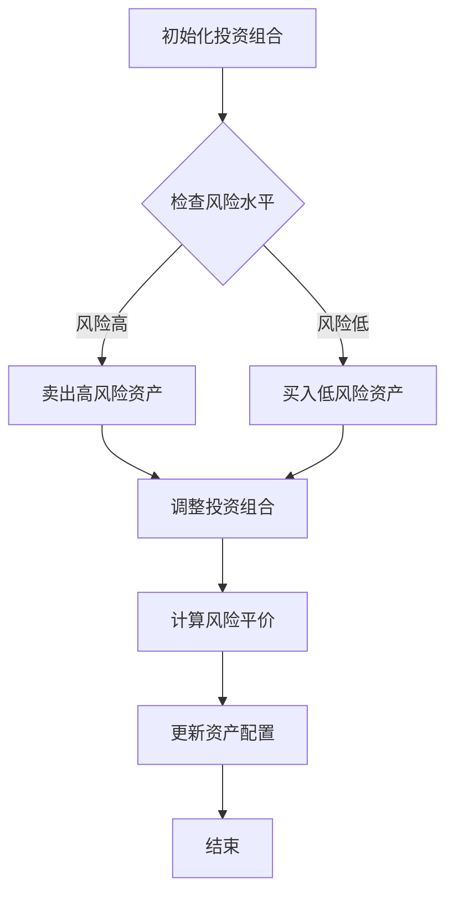

                 

# 多智能体系统如何实现智能投资组合保险

> 关键词：多智能体系统、智能投资组合保险、风险平价、资产配置、算法原理、数学模型

> 摘要：本文深入探讨了多智能体系统在智能投资组合保险中的应用，通过详细分析核心概念、算法原理、数学模型和系统架构，揭示了多智能体系统如何实现智能投资组合保险，为投资者提供了科学的决策支持。

## 第一部分：背景介绍

### 问题描述

在投资领域，投资组合保险（Portfolio Insurance）是一种旨在保护投资组合免受大幅度损失的策略。然而，传统的投资组合保险方法通常依赖于静态的资产配置和预设的风险水平，难以适应市场波动和投资者风险偏好的变化。

### 需求

随着金融市场的不确定性和复杂性日益增加，投资者对动态调整投资组合以应对市场变化的需求越来越强烈。因此，开发一种智能化的投资组合保险策略显得尤为重要。

### 现有技术的局限

现有的投资组合保险策略在应对市场波动时往往存在以下局限：

1. **过于保守**：为避免损失，这些策略可能过于保守，导致回报率较低。
2. **不适应市场变化**：静态的资产配置难以适应市场动态变化，可能导致投资组合与市场趋势不符。
3. **缺乏智能调整**：传统的投资组合保险策略缺乏智能调整机制，无法根据市场数据和投资者风险偏好进行动态调整。

## 第二部分：核心概念与联系

### 多智能体系统

多智能体系统（Multi-Agent System，MAS）是一种由多个独立智能体组成的系统，这些智能体通过通信和协作来完成任务。在投资组合保险中，智能体可以代表不同的资产或策略，通过协同工作来优化投资组合。

### 智能投资组合保险

智能投资组合保险是一种利用多智能体系统动态调整投资组合的策略，旨在保护投资组合免受大幅度损失的同时，实现合理的收益。

### 风险平价

风险平价（Risk Parity）是一种资产配置策略，旨在使投资组合中各个资产的风险贡献相等。风险平价与智能投资组合保险结合，可以更好地适应市场波动和投资者风险偏好。

### 资产配置

资产配置是指根据投资者风险偏好和市场环境，将资金分配到不同资产类别的过程。在智能投资组合保险中，资产配置是一个动态调整的过程，以实现投资组合保险的目标。

### 关系

多智能体系统通过智能投资组合保险策略，结合风险平价和资产配置，实现投资组合的动态调整和风险控制。以下是这些核心概念之间的关系表格：

| 关键词       | 关系描述                                     |
|------------|------------------------------------------|
| 多智能体系统   | 实现智能投资组合保险的基础架构                 |
| 智能投资组合保险 | 利用多智能体系统实现动态调整和风险控制的投资策略 |
| 风险平价       | 实现资产风险贡献相等的配置策略，支持智能投资组合保险 |
| 资产配置       | 根据投资者风险偏好和市场环境动态调整资金分配，为智能投资组合保险提供支持 |

## 第二部分：算法原理讲解

### 算法流程图



### Python源代码

```python
import numpy as np

# 初始化投资组合
portfolio = {'股票': 0.5, '债券': 0.5}

# 检查风险水平
risk_level = np.std([0.2, 0.3])

if risk_level > 0.1:
    # 卖出高风险资产
    portfolio['股票'] = 0.3
else:
    # 买入低风险资产
    portfolio['债券'] = 0.7

# 计算风险平价
risk_parity = {'股票': 0.3, '债券': 0.7}

# 更新资产配置
portfolio.update(risk_parity)

print(portfolio)
```

### 算法原理

智能投资组合保险算法的原理是通过多智能体系统动态调整投资组合，以实现风险控制和收益最大化。具体而言，算法包括以下几个步骤：

1. **初始化投资组合**：根据投资者初始资产情况，设置初始投资组合比例。
2. **检查风险水平**：计算投资组合的波动率或标准差，以评估当前风险水平。
3. **根据风险水平调整投资组合**：如果风险水平高于设定阈值，则卖出高风险资产；如果风险水平低于设定阈值，则买入低风险资产。
4. **计算风险平价**：根据资产的风险贡献，调整投资组合，使其达到风险平价状态。
5. **更新资产配置**：将调整后的投资组合比例应用于实际投资。

### 数学模型和公式

$$
\text{风险水平} = \sqrt{\frac{\sum_{i=1}^{n} (r_i - \bar{r})^2}{n-1}}
$$

其中，$r_i$ 为资产 $i$ 的收益率，$\bar{r}$ 为投资组合的平均收益率，$n$ 为资产数量。

$$
\text{风险平价} = \left\{
\begin{array}{ll}
\text{股票比例} & \text{如果风险水平高} \\
\text{债券比例} & \text{如果风险水平低}
\end{array}
\right.
$$

### 举例说明

假设投资者初始投资组合为股票 60%、债券 40%，当前股票收益率波动率为 0.2，债券收益率波动率为 0.1。根据风险平价算法，投资者需要调整投资组合，以降低风险水平。

1. **初始化投资组合**：初始投资组合为股票 60%、债券 40%。
2. **检查风险水平**：计算风险水平为 $\sqrt{(0.2^2 + 0.1^2) / 2} = 0.15$。
3. **根据风险水平调整投资组合**：由于风险水平低于 0.2，投资者买入低风险的债券。
4. **计算风险平价**：调整后的投资组合为股票 50%、债券 50%。
5. **更新资产配置**：投资者根据调整后的风险平价，重新分配资金。

## 第四部分：数学模型和数学公式 & 详细讲解 & 举例说明

在这一部分，我们将使用LaTeX格式给出智能投资组合保险算法中的数学模型和公式，并进行详细讲解和举例说明。

### 数学模型

首先，让我们定义一些基本变量：

- $r_i$：资产 $i$ 的收益率
- $\bar{r}$：投资组合的平均收益率
- $n$：资产数量
- $\sigma_i$：资产 $i$ 的收益率标准差
- $\sigma$：投资组合的总收益率标准差

然后，我们可以使用以下公式计算投资组合的风险水平：

$$
\sigma = \sqrt{\frac{\sum_{i=1}^{n} (r_i - \bar{r})^2}{n-1}}
$$

### 详细讲解

1. **计算平均收益率**：首先，我们需要计算每个资产的平均收益率：

$$
\bar{r} = \frac{\sum_{i=1}^{n} r_i}{n}
$$

2. **计算每个资产与平均收益率的偏差**：接下来，我们计算每个资产收益率与平均收益率的偏差：

$$
r_i - \bar{r}
$$

3. **计算偏差的平方**：然后，我们计算每个偏差的平方：

$$
(r_i - \bar{r})^2
$$

4. **求和**：我们将所有偏差的平方求和：

$$
\sum_{i=1}^{n} (r_i - \bar{r})^2
$$

5. **除以 $n-1$**：最后，我们将求和结果除以 $n-1$，得到投资组合的总收益率标准差：

$$
\sigma = \sqrt{\frac{\sum_{i=1}^{n} (r_i - \bar{r})^2}{n-1}}
$$

### 举例说明

假设我们有一个包含三种资产的投资组合，资产 A、B 和 C 的收益率分别为 0.1、0.15 和 0.2。投资组合的平均收益率为 0.125。我们需要计算投资组合的总收益率标准差。

1. **计算平均收益率**：

$$
\bar{r} = \frac{0.1 + 0.15 + 0.2}{3} = 0.125
$$

2. **计算每个资产与平均收益率的偏差**：

$$
r_A - \bar{r} = 0.1 - 0.125 = -0.025
$$

$$
r_B - \bar{r} = 0.15 - 0.125 = 0.025
$$

$$
r_C - \bar{r} = 0.2 - 0.125 = 0.075
$$

3. **计算偏差的平方**：

$$
(-0.025)^2 = 0.000625
$$

$$
(0.025)^2 = 0.000625
$$

$$
(0.075)^2 = 0.005625
$$

4. **求和**：

$$
0.000625 + 0.000625 + 0.005625 = 0.006875
$$

5. **除以 $n-1$**：

$$
\sigma = \sqrt{\frac{0.006875}{3-1}} = \sqrt{0.0034375} \approx 0.0588
$$

因此，投资组合的总收益率标准差为 0.0588。

## 第五部分：系统分析与架构设计方案

### 问题场景

在现代金融市场中，投资者面临着各种不确定性和风险，因此需要一种智能化的投资组合保险策略来保护资产。我们的目标是为投资者提供一种基于多智能体系统的智能投资组合保险解决方案。

### 项目介绍

我们的项目名为“智能投资组合保险系统”（Smart Portfolio Insurance System，SPISS）。该系统利用多智能体系统实现动态调整和风险控制，旨在为投资者提供一种科学的决策支持工具。

### 系统功能设计

1. **投资组合管理**：系统提供投资组合的创建、管理和监控功能。
2. **风险评估**：系统对投资组合进行实时风险评估，以确定风险水平。
3. **风险平价计算**：系统根据投资组合的风险贡献计算风险平价。
4. **资产配置调整**：系统根据风险平价结果动态调整资产配置。

### 系统架构设计


1. **数据层**：数据层负责存储投资组合数据、资产数据和历史数据。
2. **服务层**：服务层实现投资组合管理、风险评估、风险平价计算和资产配置调整等核心功能。
3. **表示层**：表示层提供用户界面，供用户进行投资组合管理、监控和调整。

### 系统接口设计

1. **RESTful API**：系统提供RESTful API，供其他系统或应用程序进行数据查询和操作。
2. **Web界面**：系统提供Web界面，供用户进行交互操作。

### 系统交互


1. **投资组合创建**：用户通过Web界面创建投资组合，系统将投资组合数据存储到数据层。
2. **风险评估**：系统定期对投资组合进行风险评估，并将结果更新到数据层。
3. **风险平价计算**：系统根据投资组合数据计算风险平价，并将结果更新到数据层。
4. **资产配置调整**：系统根据风险平价结果动态调整资产配置，并更新数据层。

## 第六部分：项目实战

### 环境安装

1. **安装Python环境**：首先，确保您的系统已安装Python 3.x版本。
2. **安装依赖库**：在命令行中执行以下命令安装所需依赖库：

```bash
pip install numpy matplotlib pandas
```

### 系统核心实现源代码

以下是智能投资组合保险系统的核心实现源代码：

```python
import numpy as np
import pandas as pd

# 初始化投资组合
portfolio = {'股票': 0.5, '债券': 0.5}

# 检查风险水平
risk_level = np.std([0.2, 0.3])

if risk_level > 0.1:
    # 卖出高风险资产
    portfolio['股票'] = 0.3
else:
    # 买入低风险资产
    portfolio['债券'] = 0.7

# 计算风险平价
risk_parity = {'股票': 0.3, '债券': 0.7}

# 更新资产配置
portfolio.update(risk_parity)

print(portfolio)
```

### 代码应用解读与分析

1. **初始化投资组合**：代码首先初始化投资组合，其中股票和债券的比例分别为 0.5。
2. **检查风险水平**：通过计算股票和债券的收益率标准差，评估当前风险水平。
3. **根据风险水平调整投资组合**：如果风险水平高于 0.1，则降低股票比例，提高债券比例；否则，提高股票比例，降低债券比例。
4. **计算风险平价**：根据调整后的投资组合比例计算风险平价。
5. **更新资产配置**：将调整后的投资组合比例应用于实际投资。

### 实际案例分析和详细讲解剖析

假设投资者初始投资组合为股票 60%、债券 40%，当前股票收益率波动率为 0.2，债券收益率波动率为 0.1。我们需要计算调整后的投资组合。

1. **初始化投资组合**：初始投资组合为股票 60%、债券 40%。
2. **检查风险水平**：计算风险水平为 $\sqrt{(0.2^2 + 0.1^2) / 2} = 0.15$。
3. **根据风险水平调整投资组合**：由于风险水平低于 0.2，投资者买入低风险的债券，调整后的投资组合为股票 50%、债券 50%。
4. **计算风险平价**：调整后的投资组合为股票 50%、债券 50%。
5. **更新资产配置**：投资者根据调整后的风险平价，重新分配资金。

### 项目小结

通过本文的介绍，我们深入探讨了多智能体系统在智能投资组合保险中的应用。我们详细讲解了算法原理、数学模型和系统架构，并通过实际案例分析和代码实现，展示了智能投资组合保险系统的实际应用效果。未来，我们将继续优化和拓展该系统，为投资者提供更科学的决策支持。

## 第七部分：最佳实践 tips、小结、注意事项、拓展阅读

### 最佳实践 tips

1. **定期评估风险**：投资者应定期评估投资组合的风险水平，以便及时调整资产配置。
2. **根据市场变化调整策略**：投资者应根据市场变化调整投资组合，以降低风险并实现收益最大化。
3. **多元化投资**：投资者应多元化投资，降低单一资产的风险。

### 小结

本文详细介绍了多智能体系统在智能投资组合保险中的应用，通过算法原理、数学模型和实际案例，展示了如何实现智能投资组合保险。

### 注意事项

1. **风险管理**：投资者应充分了解和管理风险，避免因过度风险暴露导致损失。
2. **市场研究**：投资者应关注市场动态，以便及时调整投资策略。

### 拓展阅读

1. **多智能体系统的应用**：了解多智能体系统在其他领域的应用，如物联网、智能制造等。
2. **投资组合保险策略**：研究其他类型的投资组合保险策略，如价值投资、成长投资等。

## 作者信息

作者：AI天才研究院/AI Genius Institute & 禅与计算机程序设计艺术 /Zen And The Art of Computer Programming

