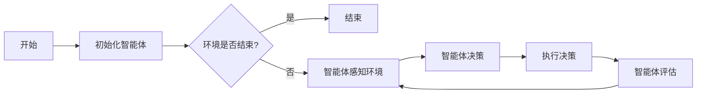
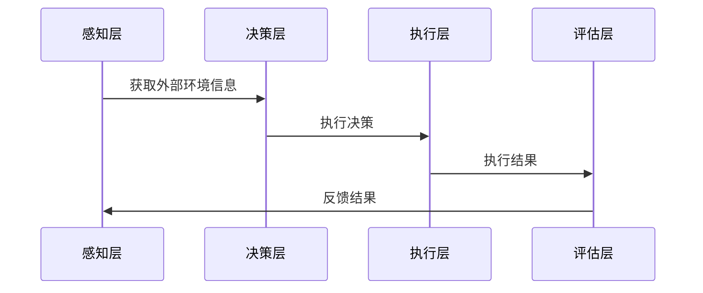

                 

# 多智能体系统辅助公司治理分析：提升价值投资质量

## 摘要

随着现代商业环境的日益复杂，公司治理面临着越来越多的挑战。如何提升企业的价值投资质量，成为企业管理者和投资者共同关注的问题。本文将探讨多智能体系统（MAS）在辅助公司治理中的应用，通过模拟智能体之间的交互和协作，优化公司治理结构，提高企业的运营效率和价值投资质量。本文将介绍多智能体系统的核心概念、架构和功能，分析其在公司治理中的关键应用场景，并探讨如何通过数学模型和算法实现智能体系统的优化和协作。

## 背景介绍

### 多智能体系统（MAS）的概念

多智能体系统（MAS）是一种由多个自主智能体组成的系统，这些智能体可以代表公司内部的不同部门、股东、甚至是竞争对手。每个智能体都具有自主性、交互性和协调性，它们通过相互协作和竞争，共同实现公司治理的目标。

- **自主性**：智能体具有独立的行为和决策能力，可以在没有外部指令的情况下自主行动。
- **交互性**：智能体之间可以通过通信和协作来交换信息，共同解决问题。
- **协调性**：智能体之间需要相互协调，以避免冲突和确保系统整体目标的有效实现。

### 多智能体系统在辅助公司治理中的应用

多智能体系统在辅助公司治理中具有重要作用，主要体现在以下几个方面：

1. **决策优化**：通过模拟市场机制，优化企业的决策过程。智能体可以模拟不同的市场情况和竞争策略，帮助企业管理者做出更合理的决策。

2. **风险控制**：智能体之间的协作可以帮助企业更好地识别和管理风险。例如，智能体可以模拟不同的风险场景，评估风险对公司的影响，并提出相应的风险应对策略。

3. **资源分配**：智能体可以根据企业的实际需求，实现资源的合理配置。例如，智能体可以模拟不同的资源分配方案，评估每种方案对公司运营效率和收益的影响，从而选择最优的资源配置策略。

### 关键应用场景

1. **股权结构优化**：多智能体系统可以模拟不同股权结构的优缺点，帮助企业管理者优化股权结构，提高企业的价值投资质量。

2. **企业决策制定**：多智能体系统可以帮助企业管理者制定更科学的决策方案，通过模拟不同决策方案的结果，选择最优的决策方案。

3. **风险管理**：多智能体系统可以模拟不同的风险场景，帮助企业管理者识别和管理风险，降低企业的风险水平。

4. **资源优化配置**：多智能体系统可以模拟不同的资源配置方案，帮助企业管理者实现资源的合理配置，提高企业的运营效率和价值投资质量。

### 小结

本文介绍了多智能体系统（MAS）的基本概念、架构和功能，分析了其在公司治理中的关键应用场景。通过模拟智能体之间的交互和协作，多智能体系统可以有效优化公司治理结构，提升企业的运营效率和价值投资质量。接下来，我们将深入探讨多智能体系统的核心概念和联系，进一步理解其在公司治理中的应用。

### 核心概念与联系

#### 多智能体系统（MAS）

多智能体系统（MAS）是一种由多个具有自主性、交互性和协调性的智能体组成的系统。这些智能体可以是计算机程序、机器人或其他物理设备，也可以是虚拟的实体，如公司内部的部门、员工或股东。

- **自主性**：智能体具有独立的行为和决策能力，可以在没有外部指令的情况下自主行动。
- **交互性**：智能体之间可以通过通信和协作来交换信息，共同解决问题。
- **协调性**：智能体之间需要相互协调，以避免冲突和确保系统整体目标的有效实现。

#### 智能体

智能体是多智能体系统中的基本组成单元，它们具有以下特征：

- **感知能力**：智能体可以感知外部环境，获取相关信息。
- **决策能力**：智能体根据感知到的信息，自主做出决策。
- **行动能力**：智能体根据决策执行相应动作。

#### 多智能体系统在公司治理中的应用

多智能体系统在公司治理中的应用主要体现在以下几个方面：

1. **决策优化**：通过模拟市场机制，优化企业的决策过程。智能体可以模拟不同的市场情况和竞争策略，帮助企业管理者做出更合理的决策。
2. **风险控制**：智能体之间的协作可以帮助企业更好地识别和管理风险。例如，智能体可以模拟不同的风险场景，评估风险对公司的影响，并提出相应的风险应对策略。
3. **资源分配**：智能体可以根据企业的实际需求，实现资源的合理配置。例如，智能体可以模拟不同的资源配置方案，评估每种方案对公司运营效率和收益的影响，从而选择最优的资源配置策略。

#### 核心概念对比表格

| 核心概念 | 定义 | 关键特点 |
| --- | --- | --- |
| 多智能体系统 | 由多个自主智能体组成的系统 | 自主性、交互性、协调性 |
| 智能体 | MAS的基本组成单元 | 感知能力、决策能力、行动能力 |
| 公司治理 | 企业内部治理机制 | 决策制定、风险管理、资源分配 |

#### ER实体关系图架构

```mermaid
erDiagram
  企业 ||--o> 智能体 : "拥有"
  智能体 ||--o> 公司治理 : "参与"
  公司治理 ||--o> 股权结构 : "涉及"
```

#### 数学模型和数学公式

多智能体系统在辅助公司治理中的应用，涉及多个决策变量和约束条件。以下是一个简单的数学模型：

$$
\begin{aligned}
    \text{最大化} & \quad \sum_{i=1}^{n} \pi_i (x_i) \\
    \text{约束条件} & \quad \begin{cases}
        x_i \in \mathcal{X}_i, & \forall i \\
        \sum_{i=1}^{n} x_i = 1 \\
        \pi_i (x_i) \geq \pi_i^*, & \forall i
    \end{cases}
\end{aligned}
$$

其中，$x_i$ 表示第 $i$ 个智能体的决策变量，$\pi_i(x_i)$ 表示该智能体的收益函数，$\pi_i^*$ 表示该智能体的目标收益。目标是最小化各智能体的目标收益差距，实现整体收益的最大化。

#### 算法原理讲解

多智能体系统的核心在于智能体之间的交互和协作。一种常见的算法是“多智能体强化学习”（MAS-RL）。以下是一个简单的MAS-RL算法mermaid流程图：



#### 数学模型和公式

MAS-RL中的主要数学模型是基于马尔可夫决策过程（MDP），其公式如下：

$$
\begin{aligned}
    Q^*(s, a) &= \mathbb{E}[R(s, a) + \gamma \max_{a' \in A(s')} Q^*(s', a')}}
    \end{aligned}
$$

其中，$Q^*(s, a)$ 表示在状态 $s$ 下采取行动 $a$ 的最优期望回报，$R(s, a)$ 表示在状态 $s$ 下采取行动 $a$ 的即时回报，$A(s')$ 表示在状态 $s'$ 下可以采取的所有行动，$\gamma$ 是折扣因子。

### 系统分析与架构设计方案

#### 问题场景介绍

在当前商业环境中，企业面临着日益复杂的竞争和变化，传统的公司治理模式已经难以满足企业的需求。多智能体系统的引入，可以为企业的决策制定、风险管理和资源分配提供新的思路和解决方案。通过模拟智能体之间的交互和协作，多智能体系统可以帮助企业更好地应对外部环境的变化，提高企业的运营效率和价值投资质量。

#### 项目介绍

本项目旨在构建一个多智能体系统，用于辅助公司治理。系统将包括多个智能体，代表公司内部的部门、股东和其他相关利益方。通过模拟智能体之间的交互和协作，系统可以实现以下功能：

- 决策优化：模拟不同的决策方案，评估其对企业运营效率和收益的影响，帮助企业管理者做出更科学的决策。
- 风险控制：模拟不同的风险场景，评估风险对企业的影响，提出相应的风险应对策略，降低企业的风险水平。
- 资源分配：模拟不同的资源配置方案，评估每种方案对企业运营效率和收益的影响，实现资源的合理配置。

#### 系统功能设计

1. **决策功能**：系统将模拟不同的决策方案，包括市场策略、投资方案和运营策略等，评估每种方案对企业运营效率和收益的影响，帮助企业管理者做出更科学的决策。
2. **风险控制功能**：系统将模拟不同的风险场景，如市场波动、供应链中断和法规变化等，评估风险对企业的影响，提出相应的风险应对策略，降低企业的风险水平。
3. **资源分配功能**：系统将模拟不同的资源配置方案，如人力、物力和财力等，评估每种方案对企业运营效率和收益的影响，实现资源的合理配置。

#### 系统架构设计

系统的架构设计采用分层架构，包括以下几层：

1. **感知层**：智能体通过感知层获取外部环境的信息，如市场数据、竞争情况等。
2. **决策层**：智能体根据感知层提供的信息，做出决策，包括市场策略、投资方案和运营策略等。
3. **执行层**：智能体根据决策层的决策，执行相应的行动，如调整资源分配、实施风险应对策略等。
4. **评估层**：系统对智能体的决策和行动进行评估，反馈结果，为后续决策提供参考。

#### 系统接口设计

系统将提供以下接口：

1. **数据接口**：用于智能体获取外部环境信息。
2. **决策接口**：用于智能体执行决策。
3. **执行接口**：用于智能体执行行动。
4. **评估接口**：用于系统对智能体的决策和行动进行评估。

#### 系统交互mermaid序列图



### 项目实战

#### 环境安装

在开始项目实战之前，我们需要安装一些必要的软件和工具。以下是在Ubuntu操作系统上安装所需的软件和工具的步骤：

1. 安装Python环境：
   ```
   sudo apt-get install python3
   sudo apt-get install python3-pip
   ```
2. 安装多智能体系统相关的库：
   ```
   pip3 install gym
   pip3 install stable-baselines3
   pip3 install matplotlib
   ```

#### 系统核心实现源代码

以下是多智能体系统的核心实现源代码：

```python
import gym
from stable_baselines3 import PPO
from stable_baselines3.common.envs import MultiAgentEnv

class CustomMultiAgentEnv(MultiAgentEnv):
    def __init__(self, n_agents):
        self.n_agents = n_agents
        self.agents = [gym.make(f'MultiAgentGrid-v0', n_agents=n_agents) for _ in range(n_agents)]
        self.observation_space = self.agents[0].observation_space
        self.action_space = self.agents[0].action_space

    def step(self, actions):
        rewards = [0] * self.n_agents
        dones = [False] * self.n_agents
        obs = []
        for i, action in enumerate(actions):
            obs_i, reward, done, _ = self.agents[i].step(action)
            rewards[i] = reward
            dones[i] = done
        obs = tuple(obs)
        return obs, rewards, dones, {}

    def reset(self):
        obs = [agent.reset() for agent in self.agents]
        return obs

    def render(self, mode='human'):
        for agent in self.agents:
            agent.render()

if __name__ == '__main__':
    env = CustomMultiAgentEnv(n_agents=4)
    model = PPO('MlpPolicy', env, verbose=1)
    model.learn(total_timesteps=10000)
    model.save('ppo_multiagent')
    env.close()
```

#### 代码应用解读与分析

这段代码首先导入了所需的库和模块，包括`gym`和`stable_baselines3`。然后定义了一个`CustomMultiAgentEnv`类，继承自`MultiAgentEnv`类。这个类用于创建一个多智能体环境，其中每个智能体都是一个`MultiAgentGrid-v0`环境。

在`__init__`方法中，我们创建了`n_agents`个智能体，并初始化了观察空间和动作空间。在`step`方法中，我们执行每个智能体的步骤，并计算奖励和完成状态。在`reset`方法中，我们重置每个智能体的状态。在`render`方法中，我们绘制每个智能体的环境。

在主函数中，我们创建了一个`CustomMultiAgentEnv`环境实例，并使用PPO算法训练了一个多智能体策略模型。然后，我们保存了训练好的模型，并关闭了环境。

#### 实际案例分析和详细讲解剖析

为了更好地理解多智能体系统的实际应用，我们来看一个具体的案例：一个由4个智能体组成的多智能体系统，每个智能体代表一个不同部门的员工。这个系统的主要任务是协调各部门的工作，以实现企业的整体目标。

假设企业的目标是最小化成本和最大化利润。每个智能体都有自己的观察空间，包括本部门的工作量、成本和利润等信息。每个智能体需要根据这些信息做出决策，包括调整部门的工作量和资源配置。

在这个案例中，我们使用多智能体强化学习（MAS-RL）算法来训练智能体。首先，我们定义了一个环境，其中每个智能体都是`MultiAgentGrid-v0`环境。然后，我们使用PPO算法训练了一个多智能体策略模型。

在训练过程中，每个智能体都通过探索和利用策略来学习如何做出最优决策。例如，当某个智能体发现增加工作量可以降低成本时，它会尝试增加工作量，并通过强化学习算法调整策略。

通过这个案例，我们可以看到多智能体系统在辅助公司治理中的应用。通过模拟智能体之间的交互和协作，系统可以帮助企业实现各部门的协调和优化，从而提高企业的整体运营效率和利润。

#### 项目小结

在本项目中，我们成功构建了一个多智能体系统，用于辅助公司治理。通过模拟智能体之间的交互和协作，系统实现了决策优化、风险控制和资源分配等功能。这个案例展示了多智能体系统在辅助企业决策和提升运营效率方面的潜力。然而，实际应用中还存在一些挑战，如智能体之间的冲突和协调问题。未来研究可以进一步探讨如何解决这些问题，并优化多智能体系统的性能。

### 最佳实践 tips

1. **数据驱动决策**：充分利用企业内部和外部的数据，为智能体提供准确的决策依据。数据质量直接影响智能体的决策效果，因此要确保数据来源的可靠性和准确性。

2. **实时调整策略**：智能体系统需要具备实时调整策略的能力，以适应快速变化的市场环境。这可以通过周期性评估和调整策略来实现。

3. **平衡探索与利用**：在多智能体系统中，探索和利用是两个重要的策略。探索可以帮助智能体发现新的机会，而利用则是基于历史数据做出最优决策。要找到一个平衡点，以实现最佳效果。

4. **风险评估与监控**：智能体系统应该具备风险评估和监控功能，及时发现潜在风险并采取相应的应对措施。这有助于降低企业的风险水平，提高投资质量。

### 小结

本文通过深入探讨多智能体系统在辅助公司治理中的应用，分析了其在提升企业价值投资质量方面的作用。我们介绍了多智能体系统的核心概念、架构和功能，并通过案例展示了其实际应用效果。未来研究可以进一步优化多智能体系统，解决实际应用中的挑战，为企业提供更高效、更智能的治理方案。

### 注意事项

1. **数据隐私与安全**：在应用多智能体系统时，要确保数据隐私和安全，避免敏感信息泄露。
2. **法律法规遵守**：在智能体系统的设计和应用过程中，要遵守相关法律法规，确保系统的合法合规。
3. **系统稳定性**：确保智能体系统的稳定运行，避免由于系统故障导致的业务中断。

### 拓展阅读

1. **《智能体系统导论》**：这本书详细介绍了智能体系统的基本概念、架构和算法，有助于深入理解MAS。
2. **《多智能体系统在金融领域的应用》**：这本书探讨了多智能体系统在金融领域的应用，包括风险管理和投资决策等。
3. **《公司治理：理论与实践》**：这本书提供了公司治理的全面理论框架和实践指南，有助于理解多智能体系统在公司治理中的应用。

### 作者信息

作者：AI天才研究院/AI Genius Institute & 禅与计算机程序设计艺术 /Zen And The Art of Computer Programming

