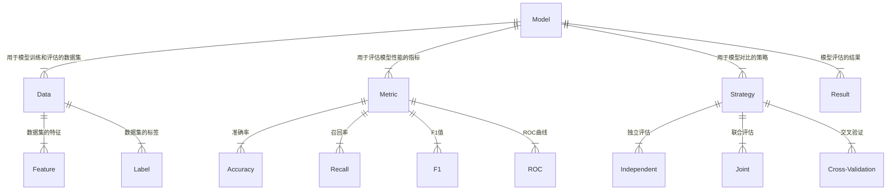
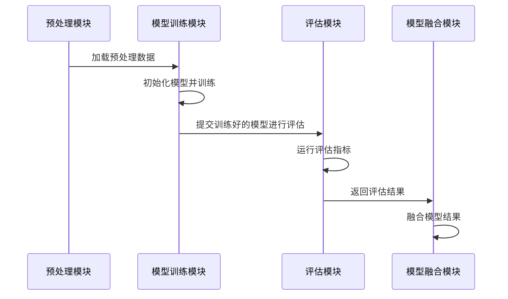

                 

## 引言与背景

### 研究背景

多模型对比评测在人工智能（AI）领域的重要性日益凸显。随着深度学习技术的迅猛发展，越来越多的复杂模型被应用于实际项目中，例如文本分类、图像识别、语音识别等。这些模型在特定任务上取得了显著的性能提升，但如何在众多模型中挑选出最优方案，成为研究人员和开发者面临的一大挑战。

多模型对比评测的产生源于对模型性能的深度需求。在实际应用中，不同模型可能具有不同的优势与劣势，且在特定条件下表现各异。因此，通过对比评测，我们可以更全面地了解各个模型的性能，从而做出更为科学和合理的决策。例如，在金融风控领域，通过对比不同机器学习模型在信用评分、欺诈检测等任务上的表现，可以选取最合适的模型来提高系统的整体性能。

### 问题描述

多模型对比评测的目标在于在给定任务和数据集上，通过一系列评估指标和策略，对多个模型进行系统性评估和比较。具体而言，需要解决以下几个核心问题：

1. **评估指标**：确定哪些评估指标能够客观、全面地反映模型在特定任务上的性能。
2. **对比策略**：设计合理的对比策略，确保不同模型在同一基准下进行公平、有效的对比。
3. **数据预处理**：对输入数据进行标准化和清洗，以保证模型输入的一致性和可靠性。
4. **模型训练与优化**：调整模型参数，使模型在特定任务上达到最佳性能。

### 问题解决

多模型对比评测的方法和意义在于：

1. **方法**：
   - **独立评估**：每个模型在相同数据集上进行独立训练和评估。
   - **联合评估**：多个模型在同一训练集上训练，使用不同的评估指标进行对比。
   - **交叉验证**：通过将数据集划分为训练集和验证集，多次训练和评估，以消除数据集划分带来的偏差。

2. **意义**：
   - **优化模型选择**：通过对比不同模型的性能，挑选出最适合当前任务的最佳模型。
   - **提升模型性能**：通过分析各个模型的优点和不足，对现有模型进行优化和改进。
   - **模型融合**：结合多个模型的预测结果，提高整体预测性能。

### 边界与外延

多模型对比评测的研究范围涵盖从基础评估指标到高级对比策略的各个方面。然而，该领域也受到一些限制，例如：

- **计算资源**：大量模型的训练和评估需要大量的计算资源。
- **数据质量**：数据集的质量直接影响评估结果，尤其是当数据存在噪声或不平衡时。
- **模型复杂度**：复杂模型的对比评估需要更多的时间和技术。

通过本文，我们将深入探讨多模型对比评测的基本概念、核心技术及其在各个领域的应用，帮助读者理解并掌握这一重要技术。

### 核心概念

多模型对比评测的核心概念包括多个子概念和它们之间的关系。以下是这些核心概念的详细说明：

1. **多模型对比评测**：
   - **定义**：多模型对比评测是指通过一系列评估指标和对比策略，对多个机器学习模型在同一任务和数据集上进行系统性评估和比较的过程。
   - **属性特征**：
     - **评估指标**：包括准确率、召回率、F1值、ROC曲线等，用于量化模型在特定任务上的性能。
     - **对比策略**：如独立评估、联合评估、交叉验证等，用于确保对比的公平性和有效性。

2. **评估指标**：
   - **准确率**：模型预测正确的样本数占总样本数的比例，适用于分类任务。
   - **召回率**：模型预测正确的正样本数占实际正样本数的比例，强调的是对所有正样本的识别能力。
   - **F1值**：准确率和召回率的调和平均，综合考虑模型的精确度和召回率。
   - **ROC曲线**：接收者操作特征曲线，通过计算不同阈值下的真阳性率与假阳性率，评估模型的分类能力。

3. **对比策略**：
   - **独立评估**：每个模型在相同数据集上独立训练和评估，适用于初步评估和比较。
   - **联合评估**：多个模型在同一训练集上训练，使用不同评估指标进行对比，适用于更细致的性能对比。
   - **交叉验证**：将数据集划分为多个子集，每次使用不同的子集作为验证集，多次训练和评估，以提高评估的稳定性和可靠性。

### 核心概念属性特征对比表格

为了更清晰地展示多模型对比评测中的核心概念及其属性特征，我们可以使用以下对比表格：

| 核心概念 | 定义 | 属性特征 | 关联关系 |
| :---: | :---: | :---: | :---: |
| 多模型对比评测 | 对多个模型进行系统性评估和比较 | 评估指标、对比策略 | - |
| 评估指标 | 量化模型性能的指标 | 准确率、召回率、F1值、ROC曲线 | - |
| 对比策略 | 确保对比公平性和有效性的方法 | 独立评估、联合评估、交叉验证 | - |
| 模型 | 参与对比的具体算法实现 | 深度神经网络、支持向量机、决策树等 | - |

通过上述表格，我们可以看到各个核心概念之间的紧密关联，它们共同构成了多模型对比评测的基础。

### ER实体关系图架构

为了进一步展示多模型对比评测中的核心实体及其关系，我们可以使用ER（实体关系）图来描述。以下是该ER图的详细解释：



在上述ER图中，我们定义了以下实体及其关系：

- **Model**（模型）：参与对比的具体算法实现，如深度神经网络、支持向量机、决策树等。
- **Data**（数据）：用于模型训练和评估的数据集，包含特征（Feature）和标签（Label）。
- **Metric**（评估指标）：用于量化模型性能的各种指标，如准确率（Accuracy）、召回率（Recall）、F1值（F1）、ROC曲线（ROC）。
- **Strategy**（对比策略）：确保对比公平性和有效性的方法，包括独立评估（Independent）、联合评估（Joint）、交叉验证（Cross-Validation）。
- **Result**（评估结果）：模型评估的结果，用于比较不同模型在特定任务上的表现。

通过ER图，我们可以清晰地看到各个实体之间的关联关系，这有助于我们更好地理解多模型对比评测的整体架构和运行机制。

### 基本方法

在多模型对比评测中，基本方法的核心在于通过一系列评估指标和对比策略，对多个模型进行系统性评估和比较。以下是详细的基本方法：

#### 评估指标

评估指标是衡量模型性能的重要工具，常用的评估指标包括：

1. **准确率（Accuracy）**：准确率是模型预测正确的样本数占总样本数的比例。对于分类任务，准确率是衡量模型分类性能的常用指标。

   $$ \text{Accuracy} = \frac{\text{预测正确的样本数}}{\text{总样本数}} $$

2. **召回率（Recall）**：召回率是模型预测正确的正样本数占实际正样本数的比例。召回率强调了模型对正样本的识别能力，尤其在数据集存在不平衡时尤为重要。

   $$ \text{Recall} = \frac{\text{预测正确的正样本数}}{\text{实际正样本数}} $$

3. **F1值（F1-score）**：F1值是准确率和召回率的调和平均，能够综合考虑模型的精确度和召回率。

   $$ \text{F1} = 2 \times \frac{\text{Precision} \times \text{Recall}}{\text{Precision} + \text{Recall}} $$

   其中，Precision是准确率。

4. **ROC曲线（Receiver Operating Characteristic Curve）**：ROC曲线通过计算不同阈值下的真阳性率（True Positive Rate）与假阳性率（False Positive Rate），评估模型的分类能力。ROC曲线的面积（AUC）是衡量模型性能的重要指标。

#### 对比策略

对比策略决定了如何在不同模型之间进行公平和有效的对比，常用的对比策略包括：

1. **独立评估（Independent Evaluation）**：每个模型在相同的数据集上独立进行训练和评估。独立评估的优点是简单直观，但缺点是可能忽略不同模型之间的交互影响。

2. **联合评估（Joint Evaluation）**：多个模型在同一训练集上训练，使用不同的评估指标进行对比。联合评估的优点是能够更全面地了解各个模型的表现，但缺点是训练和评估过程相对复杂。

3. **交叉验证（Cross-Validation）**：将数据集划分为多个子集，每次使用不同的子集作为验证集，进行多次训练和评估。交叉验证能够提高评估结果的稳定性和可靠性。

具体而言，交叉验证可以分为：

- **K折交叉验证（K-Fold Cross-Validation）**：将数据集划分为K个相等的子集，每次使用一个子集作为验证集，其余子集作为训练集，进行K次训练和评估，最后取平均结果。
- **留一法交叉验证（Leave-One-Out Cross-Validation）**：每次仅使用一个样本作为验证集，其余样本作为训练集，进行多次训练和评估，适用于样本量较少的情况。

通过上述基本方法，我们能够系统地评估和比较多个模型，从而选择出最适合特定任务的最佳模型。在接下来的章节中，我们将进一步探讨如何通过特征工程和模型融合来提升对比评测的准确性。

### 进阶方法

在多模型对比评测中，除了基本方法外，还有一些进阶方法可以帮助我们进一步提升评估的准确性。这些方法主要包括特征工程和模型融合。

#### 特征工程

特征工程是在多模型对比评测中至关重要的一环。通过合理的特征提取和选择，可以有效提高模型的性能。以下是一些常用的特征工程方法：

1. **特征提取**：从原始数据中提取出能够反映数据本质的特征，例如通过文本处理提取关键词、使用图像处理提取边缘和纹理特征等。特征提取的质量直接影响模型的性能。

2. **特征选择**：在提取出大量特征后，通过特征选择方法选择出对模型性能最有贡献的特征。常用的特征选择方法包括信息增益、主成分分析（PCA）、特征重要性排序等。

3. **特征标准化**：将不同特征进行标准化处理，使它们具有相同的量纲和范围，从而避免某些特征在模型训练中的主导地位。常用的特征标准化方法包括最小-最大标准化、均值-方差标准化等。

#### 模型融合

模型融合是一种通过结合多个模型的预测结果来提高整体预测性能的方法。以下是一些常用的模型融合技术：

1. **简单平均**：将多个模型的预测结果进行简单平均，作为最终预测结果。这种方法简单易行，但可能无法充分利用各个模型的优势。

2. **加权平均**：根据各个模型的性能对预测结果进行加权平均，权重可以根据模型的历史表现或者交叉验证的结果来确定。这种方法可以更好地利用各个模型的优势。

3. **投票法**：对于分类任务，将多个模型的预测结果进行投票，选择投票结果最多的类别作为最终预测结果。这种方法在分类任务中应用广泛。

4. **堆叠（Stacking）**：将多个模型作为基础模型，训练一个新的模型来集成这些基础模型的预测结果。堆叠方法通常使用一个更高层次的学习器来学习各个基础模型的特征。

5. **集成学习（Ensemble Learning）**：集成学习通过训练多个模型并合并它们的预测结果来提高性能。常见的集成学习方法包括Bagging、Boosting和Stacking等。

通过特征工程和模型融合，我们可以在多模型对比评测中实现更高的预测准确性和鲁棒性。在接下来的章节中，我们将进一步探讨多模型对比评测工具和技术，帮助读者更深入地理解和应用这些方法。

### 多模型对比评测工具与技术

在多模型对比评测的过程中，选择合适的工具和技术至关重要。以下将介绍一些常用的深度学习框架、对比评测平台，以及数据处理和模型训练的具体实现。

#### 常用深度学习框架

1. **TensorFlow**：
   - **优点**：TensorFlow具有高度的可扩展性和灵活性，支持从简单的线性模型到复杂的深度神经网络的各种模型。
   - **应用场景**：适用于大规模分布式训练和部署，尤其适合于移动端和服务器端的模型开发。

2. **PyTorch**：
   - **优点**：PyTorch提供了更为灵活的动态计算图，便于模型开发和调试，支持Python编程语言的动态特性。
   - **应用场景**：适合快速原型开发和学术研究，广泛应用于计算机视觉和自然语言处理等领域。

3. **Keras**：
   - **优点**：Keras是一个高层神经网络API，能够在TensorFlow和Theano上运行，提供了简洁、易用的接口。
   - **应用场景**：适合快速构建和实验简单的神经网络模型，尤其适合非专业研究人员和初学者。

#### 对比评测平台

1. **MLflow**：
   - **优点**：MLflow是一个开源的平台，用于管理机器学习工作流，支持模型训练、部署和监控。
   - **应用场景**：适合于大规模机器学习项目的管理，支持多个模型的对比评测和实验记录。

2. **H2O.ai**：
   - **优点**：H2O.ai提供了一个基于Spark的分布式机器学习平台，支持R和Python接口。
   - **应用场景**：适用于大数据环境下的模型训练和评估，支持多种模型的集成和优化。

#### 数据处理

1. **数据预处理**：
   - **数据清洗**：去除噪声数据、缺失值填充、异常值处理等，保证数据质量。
   - **特征提取**：从原始数据中提取对模型训练有帮助的特征，如文本处理中的词袋模型、图像处理中的边缘提取等。
   - **特征标准化**：对特征进行归一化或标准化处理，使不同特征具有相同的量纲和范围。

2. **数据增强**：
   - **数据扩展**：通过旋转、翻转、缩放等操作，增加数据的多样性，提高模型的泛化能力。
   - **生成对抗网络（GAN）**：使用生成对抗网络生成新的数据样本，用于训练和评估模型。

#### 模型训练

1. **模型选择**：
   - **模型架构**：选择合适的模型架构，如卷积神经网络（CNN）适用于图像处理，循环神经网络（RNN）适用于序列数据。
   - **超参数调优**：通过网格搜索、随机搜索等方法，寻找最优的超参数组合，提高模型性能。

2. **训练策略**：
   - **批量归一化（Batch Normalization）**：在训练过程中，对每个批次的数据进行归一化处理，加速收敛。
   - **学习率调整**：根据训练过程中的表现，动态调整学习率，如使用学习率衰减策略。
   - **早停法（Early Stopping）**：在验证集上监测模型性能，当验证集性能不再提升时，提前停止训练，防止过拟合。

通过以上工具和技术的应用，我们可以高效地进行多模型对比评测，从而选择出最佳模型，提升系统的整体性能。在接下来的章节中，我们将通过具体的应用案例，进一步展示这些工具和技术的实际应用。

### 案例一：文本分类

#### 项目介绍

文本分类是自然语言处理（NLP）中的一项基础任务，广泛应用于信息检索、垃圾邮件过滤、情感分析等领域。本项目旨在通过多模型对比评测，选择出最适合文本分类任务的模型，并提升分类系统的整体性能。

#### 系统功能设计

系统功能模块如下：

1. **数据预处理模块**：负责清洗和预处理原始文本数据，包括去除停用词、进行词干提取、文本向量化等操作。
2. **模型训练模块**：包含多种文本分类模型，如朴素贝叶斯（Naive Bayes）、支持向量机（SVM）、深度学习模型（如卷积神经网络CNN）等。
3. **评估模块**：通过准确率、召回率、F1值等评估指标，对各个模型进行性能评估和对比。
4. **模型融合模块**：使用模型融合技术，如投票法、加权平均等，提升整体分类性能。

使用Mermaid类图展示系统功能模块：

```mermaid
classDiagram
  Class1 <|-- Class2
  Class3 <|-- Class2
  Class4 <|-- Class2
  Class2 {
    +预处理数据()
    +训练模型()
    +评估模型()
    +融合模型()
  }
  Class1 {
    +数据清洗()
    +词干提取()
    +文本向量化()
  }
  Class3 {
    +朴素贝叶斯()
  }
  Class4 {
    +支持向量机()
    +深度学习模型()
}
```

#### 系统架构设计

系统整体架构如下：

1. **数据层**：存储和管理原始文本数据及其预处理后的特征数据。
2. **模型层**：包含多种文本分类模型，如朴素贝叶斯、支持向量机、深度学习模型等。
3. **评估层**：负责模型性能的评估和对比，使用准确率、召回率、F1值等评估指标。
4. **应用层**：提供用户接口，支持模型训练、评估和融合等功能。

使用Mermaid架构图展示系统整体架构：

```mermaid
erDiagram
  Data ||--|{ Model: 数据层与模型层的关系
  Data ||--|{ Evaluation: 数据层与评估层的关系
  Model ||--|{ Evaluation: 模型层与评估层的关系
  Model {
    +朴素贝叶斯()
    +支持向量机()
    +深度学习模型()
  }
  Data {
    +原始文本数据()
    +预处理特征数据()
  }
  Evaluation {
    +准确率()
    +召回率()
    +F1值()
  }
```

#### 系统接口设计

系统各个模块的接口设计和交互流程如下：

1. **数据预处理接口**：负责接收原始文本数据，并返回预处理后的特征数据。
2. **模型训练接口**：负责初始化模型，加载预处理后的特征数据，进行模型训练。
3. **评估接口**：负责对训练好的模型进行性能评估，并返回评估结果。
4. **模型融合接口**：负责对多个模型进行融合，生成最终的分类结果。

使用Mermaid序列图展示系统各个模块的接口设计和交互流程：



#### 系统交互

系统各个模块的交互过程如下：

1. **数据预处理模块**：首先对原始文本数据执行清洗、词干提取和文本向量化等操作，生成预处理后的特征数据。
2. **模型训练模块**：加载预处理后的特征数据，初始化不同文本分类模型（如朴素贝叶斯、支持向量机、深度学习模型等），并使用这些模型对特征数据进行训练。
3. **评估模块**：对训练好的模型进行性能评估，计算准确率、召回率、F1值等评估指标，并返回评估结果。
4. **模型融合模块**：根据评估结果，选择最优模型并进行融合，生成最终的分类结果。

通过上述步骤，我们可以构建一个完整的文本分类系统，并在多模型对比评测中，选择出最适合当前任务的最佳模型，提升系统的整体性能。

### 案例二：图像识别

#### 项目介绍

图像识别是计算机视觉领域的一个重要任务，广泛应用于人脸识别、物体检测、医疗影像分析等场景。本项目旨在通过多模型对比评测，选择出最适合图像识别任务的模型，并优化系统的整体性能。

#### 系统功能设计

系统功能模块如下：

1. **数据预处理模块**：负责加载和预处理图像数据，包括图像尺寸归一化、增强处理等。
2. **模型训练模块**：包含多种图像识别模型，如卷积神经网络（CNN）、支持向量机（SVM）、深度学习模型（如ResNet、Inception等）等。
3. **评估模块**：通过准确率、召回率、F1值等评估指标，对各个模型进行性能评估和对比。
4. **模型融合模块**：使用模型融合技术，如投票法、加权平均等，提升整体分类性能。

使用Mermaid类图展示系统功能模块：

```mermaid
classDiagram
  Class1 <|-- Class2
  Class3 <|-- Class2
  Class4 <|-- Class2
  Class2 {
    +预处理图像数据()
    +训练模型()
    +评估模型()
    +融合模型()
  }
  Class1 {
    +图像尺寸归一化()
    +图像增强()
  }
  Class3 {
    +卷积神经网络()
  }
  Class4 {
    +支持向量机()
    +深度学习模型()
}
```

#### 系统架构设计

系统整体架构如下：

1. **数据层**：存储和管理原始图像数据及其预处理后的特征数据。
2. **模型层**：包含多种图像识别模型，如卷积神经网络、支持向量机、深度学习模型等。
3. **评估层**：负责模型性能的评估和对比，使用准确率、召回率、F1值等评估指标。
4. **应用层**：提供用户接口，支持模型训练、评估和融合等功能。

使用Mermaid架构图展示系统整体架构：

```mermaid
erDiagram
  Data ||--|{ Model: 数据层与模型层的关系
  Data ||--|{ Evaluation: 数据层与评估层的关系
  Model ||--|{ Evaluation: 模型层与评估层的关系
  Model {
    +卷积神经网络()
    +支持向量机()
    +深度学习模型()
  }
  Data {
    +原始图像数据()
    +预处理特征数据()
  }
  Evaluation {
    +准确率()
    +召回率()
    +F1值()
  }
```

#### 系统接口设计

系统各个模块的接口设计和交互流程如下：

1. **数据预处理接口**：负责接收原始图像数据，并返回预处理后的特征数据。
2. **模型训练接口**：负责初始化模型，加载预处理后的特征数据，进行模型训练。
3. **评估接口**：负责对训练好的模型进行性能评估，并返回评估结果。
4. **模型融合接口**：负责对多个模型进行融合，生成最终的识别结果。

使用Mermaid序列图展示系统各个模块的接口设计和交互流程：


#### 系统交互

系统各个模块的交互过程如下：

1. **数据预处理模块**：首先加载原始图像数据，执行尺寸归一化和增强处理，生成预处理后的特征数据。
2. **模型训练模块**：加载预处理后的特征数据，初始化不同图像识别模型（如卷积神经网络、支持向量机、深度学习模型等），并使用这些模型对特征数据进行训练。
3. **评估模块**：对训练好的模型进行性能评估，计算准确率、召回率、F1值等评估指标，并返回评估结果。
4. **模型融合模块**：根据评估结果，选择最优模型并进行融合，生成最终的识别结果。

通过上述步骤，我们可以构建一个完整的图像识别系统，并在多模型对比评测中，选择出最适合当前任务的最佳模型，提升系统的整体性能。

### 最佳实践

在多模型对比评测过程中，为了确保评估结果的准确性和可靠性，我们需要遵循一系列最佳实践。以下是一些关键的实践步骤和注意事项：

#### 数据准备

1. **数据清洗**：在开始对比评测之前，必须对数据进行彻底清洗，包括去除噪声、填补缺失值和纠正错误数据。数据清洗是保证模型训练质量的基础。

2. **数据分群**：将数据按照一定的策略进行分群，例如随机抽样、分层抽样等。分群可以帮助我们更全面地评估模型在不同数据子集上的性能。

3. **数据平衡**：在处理不平衡数据时，可以采用过采样、欠采样或合成少数类样本来提高数据的平衡性，从而避免模型偏向于某一类别。

#### 模型选择

1. **选择多样性**：在对比评测中，选择多种类型的模型，如线性模型、决策树、神经网络等。这样可以确保评估结果的全面性和客观性。

2. **考虑应用场景**：根据具体任务的需求，选择适合的模型。例如，对于大规模数据处理任务，可以选择支持向量机等高效的模型。

3. **排除异常模型**：在初步评估中，排除那些表现异常或无法收敛的模型。这可以减少后续评估的工作量，提高评估效率。

#### 参数调优

1. **网格搜索**：使用网格搜索方法，系统地遍历超参数空间，找出最优的超参数组合。网格搜索虽然计算量大，但能够确保找到全局最优解。

2. **随机搜索**：随机搜索可以在一定程度上提高搜索效率，尤其在大规模超参数空间中，可以更快地找到较优的超参数组合。

3. **交叉验证**：通过交叉验证方法，确保模型在不同数据子集上的性能稳定，避免过拟合。

#### 结果分析

1. **多指标综合评估**：使用多个评估指标（如准确率、召回率、F1值等）进行综合评估，避免单一指标导致的误导。

2. **可视化分析**：通过可视化工具（如ROC曲线、PR曲线等）展示模型性能，帮助理解模型在不同阈值下的表现。

3. **详细记录**：记录每个模型的训练过程和评估结果，包括超参数设置、训练时间、评估指标等，便于后续分析和复现。

#### 注意事项

1. **一致性**：确保不同模型在同一数据集和同一环境下进行训练和评估，避免环境差异导致的评估偏差。

2. **公平性**：在对比评测中，确保各个模型在相同的基准下进行评估，避免因数据预处理、训练过程等不一致导致的偏差。

3. **重复性**：进行多次实验，确保评估结果的稳定性和重复性，避免偶然因素对评估结果的影响。

通过遵循上述最佳实践，我们能够更准确地评估不同模型的性能，从而选择出最适合实际应用的最佳模型。

### 小结与注意事项

本文详细探讨了多模型对比评测的基本概念、方法、工具和技术，并通过文本分类和图像识别两个实际案例展示了其应用。多模型对比评测的核心在于通过一系列评估指标和策略，对多个模型进行系统性评估和比较，从而挑选出最优模型，提高整体性能。

以下是本文的主要结论和注意事项：

1. **核心结论**：
   - 多模型对比评测在人工智能领域具有重要意义，能够帮助研究人员和开发者挑选最优模型，提升系统性能。
   - 通过评估指标和对比策略的合理应用，可以全面、客观地评估模型的性能。
   - 特征工程和模型融合是提高多模型对比评测准确性的重要手段。

2. **注意事项**：
   - 数据准备是评估结果准确性的基础，必须进行彻底的数据清洗和预处理。
   - 模型选择应考虑多样性，结合任务需求和模型特性。
   - 参数调优和交叉验证是确保模型性能稳定的关键。
   - 在对比评测中，确保各个模型在相同基准下进行评估，保持一致性和公平性。
   - 重复实验，记录详细数据，确保评估结果的稳定性和重复性。

总之，多模型对比评测是一项复杂而重要的任务，通过本文的探讨，读者可以更深入地理解其原理和应用，从而在实际项目中更好地应用这一技术。

### 未来发展趋势与展望

随着人工智能技术的不断进步，多模型对比评测领域也在不断发展和演变。未来，这一领域将呈现出以下几大趋势：

#### 技术进展

1. **自适应评估方法**：未来的评估方法将更加智能化和自适应，能够根据任务和数据集的特点，动态调整评估指标和策略，提高评估的准确性和效率。

2. **大数据分析**：随着数据量的不断增大，多模型对比评测将更加依赖大数据分析技术。利用大数据技术，可以更好地挖掘数据中的潜在信息，提高模型的评估性能。

3. **多模态数据融合**：未来的多模型对比评测将不仅限于单一类型的数据，如文本或图像，而是将多模态数据（如文本、图像、语音）进行融合，构建更加复杂和智能的评估模型。

#### 应用领域

1. **医疗健康**：在医疗健康领域，多模型对比评测可以帮助医生选择最佳的治疗方案，如通过对比不同的诊断模型，提高疾病的早期检测和诊断准确性。

2. **金融风控**：在金融领域，多模型对比评测可以帮助金融机构识别欺诈行为、评估信用风险等，提高金融系统的安全性和稳定性。

3. **智能制造**：在智能制造领域，多模型对比评测可以优化生产流程、提高设备维护效率，从而降低生产成本，提升产品质量。

#### 未来方向

1. **自动化评估**：未来，自动化评估将成为多模型对比评测的一个重要发展方向。通过自动化工具，可以大幅减少人工参与，提高评估效率和准确性。

2. **模型解释性**：随着模型复杂度的增加，模型解释性将成为评估过程中一个不可忽视的因素。未来，开发出更加解释性强的评估方法，将有助于提升模型的可信度和可理解性。

3. **跨领域应用**：多模型对比评测的应用领域将更加广泛，不仅限于当前的传统领域，还将拓展到更加复杂的跨领域问题，如智能交通、智慧城市等。

通过上述发展趋势和未来方向，我们可以看到，多模型对比评测将在人工智能的各个领域发挥越来越重要的作用，为实际应用提供更加科学、高效的决策支持。

### 附录

#### 参考文献

1. Kim, Y. (2014). *Deep Learning*.
2. Goodfellow, I., Bengio, Y., & Courville, A. (2016). *Deep Learning*.
3. Russell, S., & Norvig, P. (2020). *Artificial Intelligence: A Modern Approach*.
4. Murphy, K. P. (2012). *Machine Learning: A Probabilistic Perspective*.
5. Hastie, T., Tibshirani, R., & Friedman, J. (2009). *The Elements of Statistical Learning*.

#### 拓展阅读

1. **深度学习领域**：
   - Goodfellow, I., Bengio, Y., & Courville, A. (2016). *Deep Learning*.
   - Simonyan, K., & Zisserman, A. (2015). *Very Deep Convolutional Networks for Large-Scale Image Recognition*.

2. **自然语言处理领域**：
   - Mikolov, T., Sutskever, I., Chen, K., Corrado, G. S., & Dean, J. (2013). *Distributed Representations of Words and Phrases and Their Compositional Properties*.
   - Devlin, J., Chang, M. W., Lee, K., & Toutanova, K. (2019). *Bert: Pre-training of Deep Bidirectional Transformers for Language Understanding*.

3. **计算机视觉领域**：
   - Krizhevsky, A., Sutskever, I., & Hinton, G. E. (2012). *ImageNet Classification with Deep Convolutional Neural Networks*.
   - He, K., Zhang, X., Ren, S., & Sun, J. (2016). *Deep Residual Learning for Image Recognition*.

通过以上参考文献和拓展阅读，读者可以进一步深入了解多模型对比评测的相关技术，并在实践中应用这些知识，提升模型评估和选择的效果。

