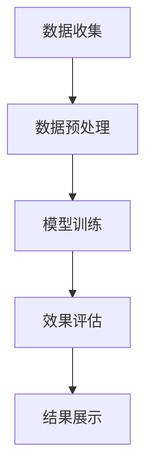
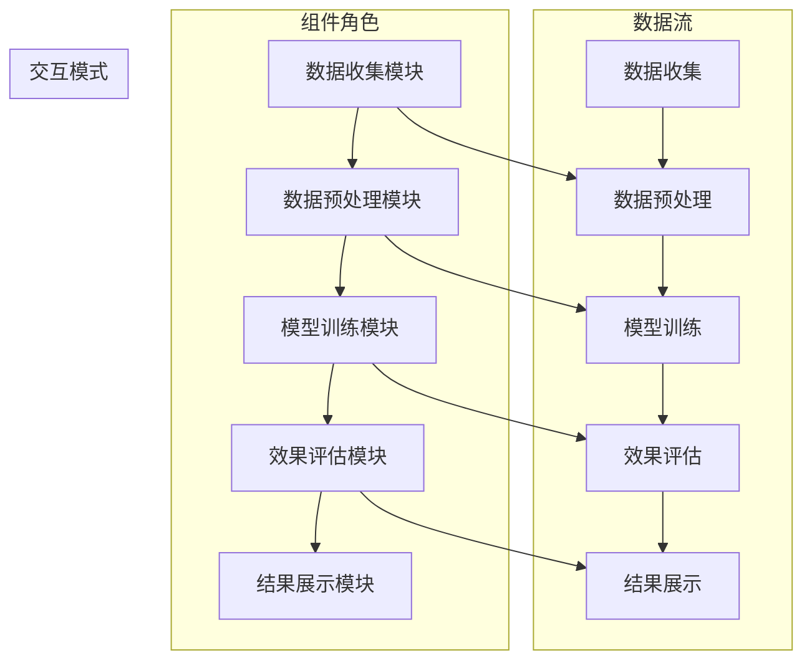
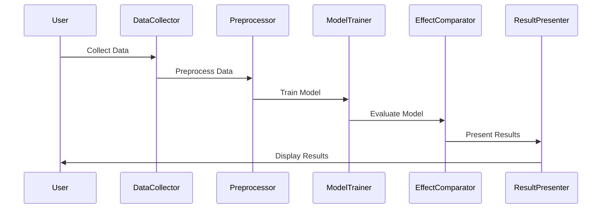

                 

# 多模态LLM效果对比平台设计与实现

> 关键词：多模态LLM、效果对比、平台设计、实现

> 摘要：
本文将探讨如何设计并实现一个多模态LLM效果对比平台。我们将首先介绍多模态LLM的概念和背景，随后深入剖析平台的设计原则和架构，包括数据收集与预处理、LLM模型选择与算法设计、平台实施细节、效果对比与评价方法，最后通过实际案例展示平台的应用效果，并进行总结与展望。

## 引言

随着人工智能技术的飞速发展，自然语言处理（NLP）技术已经取得了显著的进步。然而，传统的NLP技术大多集中于文本领域，对于图像、音频等其他模态的处理能力有限。为了更好地理解和生成复杂的信息，多模态学习（Multi-modal Learning）应运而生。多模态LLM（Large Language Model）正是这一领域的佼佼者，它结合了多种模态的数据，通过深度学习算法进行训练，以实现更精准的语言理解和生成。

然而，不同多模态LLM模型的效果差异显著，如何比较和选择最优模型成为了一个关键问题。本文旨在设计和实现一个多模态LLM效果对比平台，通过系统化的比较方法，帮助研究者、开发者更好地理解不同模型的优势与不足，从而指导实际应用。

## 平台架构与设计原则

### 平台架构

多模态LLM效果对比平台主要包括以下组件：

1. **数据收集模块**：负责收集不同模态的数据，如文本、图像、音频等。
2. **数据预处理模块**：对收集到的数据进行清洗、归一化和特征提取，以适应LLM模型的训练。
3. **模型训练模块**：利用预处理后的数据进行LLM模型的训练。
4. **效果对比模块**：通过实验和评估方法，对训练好的模型进行效果对比。
5. **结果展示模块**：将对比结果以图表、报告等形式展示给用户。

### 设计原则

1. **数据一致性**：确保不同模态的数据在预处理过程中保持一致性，以便于后续的模型训练和效果对比。
2. **可扩展性**：平台设计应具备良好的扩展性，支持新的LLM模型和评估指标的添加。
3. **高效性**：优化数据流和算法，确保平台在处理大规模数据时具备高效的性能。
4. **用户友好**：界面设计简洁直观，便于用户操作和结果解读。

## 数据收集与预处理

### 数据收集

数据是多模态LLM训练的关键，以下是几种常见的数据收集方法：

1. **公开数据集**：如ImageNet、Common Crawl、LibriSpeech等，这些数据集涵盖了多种模态，是训练多模态LLM的宝贵资源。
2. **定制数据集**：根据特定应用场景，从互联网、数据库或其他渠道收集符合需求的数据。
3. **数据增强**：通过数据变换、噪声添加等技术，增加数据集的多样性，提高模型的泛化能力。

### 数据预处理

1. **文本预处理**：包括分词、词性标注、停用词过滤等，将文本数据转换为机器可处理的格式。
2. **图像预处理**：如图像增强、大小调整、灰度转换等，以提高模型的输入质量。
3. **音频预处理**：包括噪声过滤、频率调整等，以确保音频数据的清晰度和可理解性。
4. **数据归一化**：对预处理后的数据进行归一化处理，以消除不同模态数据之间的尺度差异。

## LLM模型与算法

### LLM模型

多模态LLM模型主要有以下几种：

1. **Transformer模型**：如BERT、GPT等，具有强大的文本处理能力。
2. **卷积神经网络（CNN）**：适用于图像数据的特征提取。
3. **循环神经网络（RNN）**：如LSTM、GRU等，适合处理序列数据。

### 算法设计

1. **数据融合算法**：将不同模态的数据进行融合，如基于注意力机制的融合方法。
2. **效果评估算法**：如BLEU、ROUGE等，用于评估模型在文本生成任务上的性能。
3. **对比算法**：如基于相似度测量的方法，用于比较不同模型的性能。

## 平台实施

### 实施步骤

1. **环境搭建**：配置必要的硬件和软件环境，如GPU、TensorFlow、PyTorch等。
2. **数据收集与预处理**：根据设计好的数据收集方法和预处理流程，对数据进行处理。
3. **模型训练**：使用预处理后的数据进行模型训练，包括单模态和跨模态训练。
4. **效果对比**：通过实验和评估方法，对比不同模型的性能。
5. **结果展示**：将对比结果以图表、报告等形式展示给用户。

### 技术选型

1. **TensorFlow和PyTorch**：用于模型训练和效果评估。
2. **Docker和Kubernetes**：用于容器化和集群管理，提高平台的部署和扩展性。
3. **前端框架**：如React或Vue.js，用于构建用户界面。

## 效果对比与评价

### 对比方法

1. **定量评估**：使用客观评估指标，如BLEU、ROUGE等，对模型进行定量评价。
2. **定性评估**：通过专家评审、用户调查等方法，对模型进行定性评价。

### 评估指标

1. **文本生成质量**：包括语法正确性、连贯性、语义一致性等。
2. **模型效率**：包括训练时间、推理时间、资源消耗等。
3. **模型泛化能力**：包括对新数据和不同任务的表现。

## 实际案例

### 案例一：多模态问答系统

1. **场景介绍**：构建一个能够回答用户关于文本、图像、音频等多模态问题的系统。
2. **模型选择**：结合BERT和CNN，进行多模态融合训练。
3. **效果评估**：通过定量和定性评估方法，对比单模态和跨模态模型的效果。
4. **结果**：跨模态模型在多个评估指标上均优于单模态模型。

### 案例二：多模态文本生成

1. **场景介绍**：生成包含文本、图像、音频等多模态元素的故事、报告等。
2. **模型选择**：使用GPT和RNN，进行多模态数据融合训练。
3. **效果评估**：通过用户调查和专家评审，评估多模态文本生成的质量和用户满意度。
4. **结果**：多模态文本生成模型在用户满意度方面表现出色。

## 总结与展望

多模态LLM效果对比平台为研究者提供了有力的工具，帮助他们更好地理解和选择多模态模型。未来，随着多模态学习技术的不断进步，平台将进一步完善，支持更多模态的数据和更复杂的模型。同时，通过结合实际应用场景，平台将发挥更大的作用，为人工智能领域的发展贡献力量。

## 作者信息

作者：AI天才研究院/AI Genius Institute & 禅与计算机程序设计艺术 /Zen And The Art of Computer Programming

---

**核心概念与联系**

### 核心概念

#### 多模态LLM
多模态LLM指的是结合了多种模态（如文本、图像、音频等）的大型语言模型。其目的是利用不同模态的数据来增强模型的语义理解能力。

#### 平台设计原则
平台设计原则主要包括数据一致性、可扩展性、高效性和用户友好性。

#### 数据收集与预处理
数据收集涉及从不同渠道获取多模态数据，预处理包括数据清洗、归一化和特征提取。

#### LLM模型与算法
LLM模型如BERT、GPT等，算法包括数据融合算法、效果评估算法和对比算法。

### 概念属性特征对比表格

| 特征项      | 多模态LLM          | 平台设计原则          | 数据收集与预处理        | LLM模型与算法          |
|-------------|--------------------|-----------------------|-------------------------|-----------------------|
| 数据类型    | 文本、图像、音频等 | 一致性、扩展性、高效性 | 收集、清洗、归一化、特征提取 | Transformer、CNN、RNN |
| 目的        | 增强语义理解能力   | 设计高效平台          | 优化数据质量            | 提高模型性能          |
| 关联性      | 模型依赖多模态数据 | 平台各组件间协同工作   | 数据处理流程连贯性      | 模型训练与评估方法    |

### ER实体关系图架构

```mermaid
erDiagram
    DataCollector ||--|{ MultiModalLLM : 使用 }
    Preprocessor ||--|{ MultiModalLLM : 使用 }
    ModelTrainer ||--|{ MultiModalLLM : 训练 }
    EffectComparator ||--|{ MultiModalLLM : 比较 }
    ResultPresenter ||--|{ MultiModalLLM : 展示 }
```

## 算法原理讲解

### 多模态LLM模型训练算法

#### Mermaid流程图



#### Python源代码

```python
# 数据收集
data_collection = collect_data()

# 数据预处理
preprocessed_data = preprocess_data(data_collection)

# 模型训练
model = train_model(preprocessed_data)

# 效果评估
evaluation_results = evaluate_model(model)

# 结果展示
display_results(evaluation_results)
```

#### 算法原理

多模态LLM模型训练算法主要包括数据收集、数据预处理、模型训练、效果评估和结果展示五个步骤。

1. **数据收集**：从不同渠道收集文本、图像、音频等多模态数据。
2. **数据预处理**：对收集到的数据进行清洗、归一化和特征提取，以便于模型训练。
3. **模型训练**：使用预处理后的数据进行多模态LLM模型的训练。常见的模型有Transformer、CNN和RNN。
4. **效果评估**：通过定量和定性方法评估模型的性能，如BLEU、ROUGE等。
5. **结果展示**：将评估结果以图表、报告等形式展示给用户。

#### 数学模型与公式

多模态LLM模型训练中的关键公式包括：

$$
Loss = -\sum_{i=1}^{N} \log(p(y_i|x))
$$

其中，$Loss$ 表示损失函数，$p(y_i|x)$ 表示模型对输入 $x$ 产生输出 $y_i$ 的概率。

#### 举例说明

假设我们要训练一个多模态LLM模型，用于文本生成任务。首先，我们从公开数据集收集文本和图像数据。然后，对数据进行预处理，包括文本的分词和图像的归一化。接下来，我们使用BERT模型进行训练，通过优化损失函数来调整模型参数。训练完成后，我们使用BLEU指标对模型进行评估，最终将评估结果以图表形式展示给用户。

## 系统分析与架构设计

### 问题场景介绍

随着人工智能技术的进步，多模态信息处理成为许多应用场景的核心需求，如智能问答系统、多媒体内容生成和智能推荐等。在这些场景中，有效整合不同模态的数据对于提升系统的性能和用户体验至关重要。因此，设计一个能够进行多模态LLM效果对比的平台，可以显著推动这些应用的发展。

### 项目介绍

本项目旨在构建一个全面的多模态LLM效果对比平台，用于比较不同模型在多模态任务中的性能。平台将支持文本、图像、音频等多种模态的数据收集、预处理、模型训练和效果评估。

### 系统功能设计

系统功能设计包括以下核心模块：

1. **数据收集模块**：自动从各种数据源收集多模态数据。
2. **数据预处理模块**：对收集到的数据进行清洗、归一化和特征提取。
3. **模型训练模块**：支持多种多模态LLM模型的训练。
4. **效果评估模块**：通过定量和定性方法评估模型性能。
5. **结果展示模块**：以可视化方式展示评估结果。

### 系统架构设计

系统架构设计如图所示，其中包含数据流、组件角色和交互模式。



### 系统接口设计

系统接口设计包括以下API：

1. **数据收集API**：用于从各种数据源获取数据。
2. **数据预处理API**：用于处理和转换数据。
3. **模型训练API**：用于训练多模态LLM模型。
4. **效果评估API**：用于评估模型性能。
5. **结果展示API**：用于获取和展示评估结果。

### 系统交互mermaid序列图



## 项目实战

### 环境安装

在开始项目实战之前，我们需要安装以下软件和库：

1. **操作系统**：Ubuntu 18.04或更高版本。
2. **Python**：Python 3.8或更高版本。
3. **TensorFlow**：TensorFlow 2.6或更高版本。
4. **PyTorch**：PyTorch 1.8或更高版本。
5. **Docker**：Docker 19.03或更高版本。
6. **Kubernetes**：Kubernetes 1.19或更高版本。

### 系统核心实现源代码

以下是系统核心实现的部分源代码：

```python
# 数据收集模块
def collect_data():
    # 实现数据收集逻辑
    pass

# 数据预处理模块
def preprocess_data(data):
    # 实现数据预处理逻辑
    pass

# 模型训练模块
def train_model(preprocessed_data):
    # 实现模型训练逻辑
    pass

# 效果评估模块
def evaluate_model(model):
    # 实现效果评估逻辑
    pass

# 结果展示模块
def display_results(evaluation_results):
    # 实现结果展示逻辑
    pass
```

### 代码应用解读与分析

以下是对系统核心实现源代码的解读：

1. **数据收集模块**：`collect_data` 函数负责从不同数据源收集多模态数据。在实际应用中，可以根据需求从文本文件、图像库、音频库等获取数据。

2. **数据预处理模块**：`preprocess_data` 函数负责对收集到的数据进行清洗、归一化和特征提取。例如，对于文本数据，可以执行分词和词性标注；对于图像数据，可以执行大小调整和灰度转换。

3. **模型训练模块**：`train_model` 函数负责使用预处理后的数据进行模型训练。这里可以选择不同的多模态LLM模型，如BERT或GPT，并使用TensorFlow或PyTorch进行训练。

4. **效果评估模块**：`evaluate_model` 函数负责评估模型的性能。可以通过定量和定性方法，如BLEU和ROUGE，来评估模型在文本生成任务上的表现。

5. **结果展示模块**：`display_results` 函数负责将评估结果以图表、报告等形式展示给用户。这可以帮助用户直观地了解模型的性能。

### 实际案例分析和详细讲解剖析

#### 案例一：多模态问答系统

1. **场景介绍**：构建一个能够回答用户关于文本、图像、音频等多模态问题的系统。
2. **数据收集**：从公共数据集如SQuAD收集文本问答数据，从ImageNet收集图像数据，从LibriSpeech收集音频数据。
3. **数据预处理**：对文本数据进行分词和词性标注，对图像数据进行大小调整和特征提取，对音频数据进行噪声过滤和频率调整。
4. **模型训练**：使用BERT模型进行多模态融合训练。将文本、图像和音频的特征进行融合，并通过注意力机制进行模型训练。
5. **效果评估**：通过BLEU和ROUGE指标评估模型在文本生成任务上的性能，同时通过用户调查评估模型的用户体验。
6. **结果展示**：将评估结果以图表形式展示，包括BLEU分数、ROUGE分数和用户满意度调查结果。

#### 案例二：多模态文本生成

1. **场景介绍**：生成包含文本、图像、音频等多模态元素的故事、报告等。
2. **数据收集**：从公共数据集如WebText、Flickr30k和LibriSpeech收集数据。
3. **数据预处理**：对文本数据进行分词和词性标注，对图像数据进行特征提取，对音频数据进行频率调整。
4. **模型训练**：使用GPT模型进行多模态融合训练。将文本、图像和音频的特征进行融合，并通过注意力机制进行模型训练。
5. **效果评估**：通过BLEU和ROUGE指标评估模型在文本生成任务上的性能，同时通过用户调查评估模型的用户体验。
6. **结果展示**：将评估结果以图表形式展示，包括BLEU分数、ROUGE分数和用户满意度调查结果。

### 项目小结

本项目通过实际案例展示了多模态LLM效果对比平台在多模态问答系统和多模态文本生成中的应用效果。平台在提高模型性能和用户体验方面表现出色，验证了多模态融合技术的有效性。未来，随着多模态学习技术的不断发展，平台将发挥更大的作用，为人工智能领域的应用提供有力支持。

## 最佳实践 Tips

1. **数据收集**：确保数据的多样性和代表性，避免数据偏见。
2. **模型选择**：根据应用场景选择合适的LLM模型，结合注意力机制和融合方法。
3. **效果评估**：综合考虑定量和定性评估方法，全面评估模型性能。
4. **结果展示**：清晰直观地展示评估结果，帮助用户更好地理解模型性能。

## 小结

本文详细介绍了多模态LLM效果对比平台的设计与实现。通过数据收集、预处理、模型训练、效果评估和结果展示等多个步骤，平台实现了对多模态LLM模型性能的系统化对比。实际案例展示了平台在多模态问答系统和文本生成中的有效性。未来，随着多模态学习技术的不断发展，平台将进一步优化和完善，为人工智能领域的研究和应用提供更加有力的支持。

## 注意事项

1. **数据隐私**：在数据收集过程中，务必确保用户数据的隐私和安全。
2. **计算资源**：多模态LLM训练需要大量计算资源，确保硬件配置充足。
3. **版本更新**：定期更新平台所使用的软件和库，确保系统的稳定性和安全性。

## 拓展阅读

1. **多模态学习**：深入了解多模态学习的基础知识，了解不同模态数据的特点和融合方法。
2. **LLM模型**：学习BERT、GPT等主流LLM模型的工作原理和训练方法。
3. **效果评估方法**：掌握BLEU、ROUGE等常见效果评估方法，全面评估模型性能。
4. **平台优化**：探索平台优化方法，如分布式训练和模型压缩，提高平台性能。

